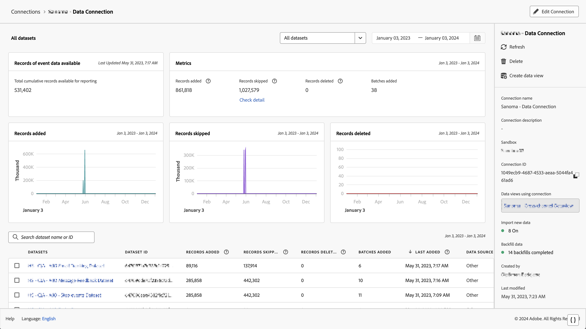

# Administrar conexiones

Una vez que los usuarios administradores hayan [creado una o varias conexiones](/help/connections/create-connection.md), pueden administrarlas en el Administrador de [!UICONTROL conexiones]. La última actualización de la experiencia de conexión añade dos funcionalidades importantes en la página Detalles de conexión, que se describen más adelante en esta página:

* Permite comprobar el estado **de los conjuntos de datos de la conexión y del proceso de ingesta**. Esta comprobación de estado le permite saber cuándo están disponibles los datos para poder entrar en Analysis Workspace e iniciar el análisis.

* Permite **identificar cualquier discrepancia en los datos** debido a una configuración incorrecta. ¿Le faltan filas? En caso afirmativo, ¿qué filas faltan y por qué? ¿Configuró incorrectamente las conexiones y esto causó la falta de datos en CJA?

>[!NOTE]
> Esta funcionalidad estará disponible para el público general el 20 de septiembre de 2021.

## Administrador de conexiones {#connections-manager}

El Administrador de conexiones le permite:

* Vea todas las conexiones de un vistazo, incluido el propietario, el entorno de pruebas y cuándo se crearon y modificaron.
* Ver todos los conjuntos de datos de una conexión.
* Comprobar el estado de una conexión.
* Eliminar una conexión.
* Cambiar el nombre de una conexión.
* Crear una vista de datos a partir de una conexión.

| Configuración | Descripción |
| --- | --- |
| [!UICONTROL Nombre] | Nombre descriptivo de la conexión. Al hacer clic en el nombre del hipervínculo, llegará a la página de Detalles de conexión que se describe a continuación. |
| Información de conexión | Haga clic en el icono de información junto al nombre de la conexión para ver la siguiente información: |
| Edición de una conexión | Haga clic en los puntos suspensivos (...) junto al nombre de la conexión y, a continuación, haga clic en [!UICONTROL Editar]. Para obtener más información, consulte “Editar conexión” a continuación. |
| Eliminar una conexión | Haga clic en los puntos suspensivos (...) junto al nombre de la conexión y, a continuación, haga clic en [!UICONTROL Eliminar]. Más información bajo el encabezado “Eliminar conexiones” a continuación. |
| Crear vista de datos | Haga clic en los puntos suspensivos (...) junto al nombre de la conexión y, a continuación, haga clic en [!UICONTROL Crear vista de datos]. Esta acción crea una nueva vista de datos basada en esta conexión. [Más información](https://experienceleague.adobe.com/docs/analytics-platform/using/cja-dataviews/data-views.html?lang=es) |
| [!UICONTROL Conjuntos de datos] | Los conjuntos de datos que forman parte de la conexión. Puede hacer clic en el hipervínculo para ver todos los conjuntos de datos de la conexión. Al hacer clic en un conjunto de datos, se abre ese conjunto de datos en Adobe Experience Platform, en una pestaña nueva. |
| [!UICONTROL Entorno de pruebas] | El [Entorno de pruebas de Adobe Experience Platform](https://experienceleague.adobe.com/docs/experience-platform/sandbox/home.html?lang=es) desde el que esta conexión obtiene sus conjuntos de datos. Este entorno de pruebas se seleccionó cuando creó la conexión. No se puede modificar. |
| [!UICONTROL Propietario] | La persona que creó la conexión. |
| [!UICONTROL Importación de conjuntos de datos] | Le permite activar o desactivar lo que antes se llamaba “flujo de datos”. |
| [!UICONTROL Fecha de creación] | La fecha en la que se creó la conexión. |
| [!UICONTROL Última modificación] | Fecha en la que se actualizó la conexión por última vez. |

### Eliminación de conexiones {#connections-delete}

Solo los administradores tienen permiso para eliminar una conexión. Esta acción no aparece para los usuarios que no son administradores.

1. Haga clic en los puntos suspensivos (...) junto al nombre de la conexión.
1. Haga clic en [!UICONTROL Eliminar].

Cuando elimine una conexión en [!UICONTROL Customer Journey Analytics], un mensaje de error indicará lo siguiente:

* Ya no funciona ninguna vista de datos creada en función de la conexión eliminada.
* Del mismo modo, los proyectos de del Espacio de trabajo que dependan de vistas de datos en la conexión eliminada dejarán de funcionar.

[Obtenga más información](/help/getting-started/cja-deletion.md) acerca de las implicaciones de la eliminación.

### Búsqueda de una conexión o un conjunto de datos

Puede buscar conexiones utilizando la barra de búsqueda situada en la parte superior, debajo del título [!UICONTROL Conexiones].

### Ordenación de conexiones

Puede ordenar las conexiones haciendo clic en el encabezado de cada columna y ordenando hacia arriba o hacia abajo.

## Página Detalles de conexión {#connection-detail}

La nueva página Detalles de conexiones le proporciona una vista muy detallada del estado de una conexión.

Le permite:

* Compruebe el estado de los conjuntos de datos de la conexión y del proceso de ingesta.
* Identifique los problemas de configuración que conducen a registros omitidos o eliminados.
* Ver cuándo están disponibles los datos para los informes.

>[!IMPORTANT]
>Los datos introducidos antes del 13 de agosto de 2021 no se reflejan en este cuadro de diálogo [!UICONTROL Conexiones].

Aquí se explican los widgets y la configuración:

| Widget/configuración | Descripción |
| --- | --- |
| Selector de conjunto de datos | Permite seleccionar uno o todos los conjuntos de datos de la conexión. No puede seleccionar conjuntos de datos múltiples. El valor predeterminado es [!UICONTROL Todos los conjuntos de datos]. |
| Calendario/intervalos de fechas | El intervalo de fechas indica cuándo se añadieron datos a la conexión. Se incluyen todos los ajustes preestablecidos de calendario estándar. Puede personalizar el intervalo de fechas, pero en la lista desplegable no aparecerá ningún intervalo de fechas personalizado. |
| [!UICONTROL Registros de widget de datos de evento disponibles] | Representa el número total de filas del conjunto de datos de evento disponibles para la creación de informes, **para toda la conexión**. Este recuento es independiente de cualquier configuración de calendario. Cambia si selecciona un conjunto de datos del selector de conjuntos de datos o en la tabla. (Tenga en cuenta que hay una latencia de una a dos horas para que los datos aparezcan en los informes, una vez añadidos). |
| Widget de [!UICONTROL métricas] | Resume los registros añadidos, omitidos o eliminados del evento, y el número de lotes agregados, **para el conjunto de datos y el intervalo de fechas que ha seleccionado**. |
| Widget de [!UICONTROL registros añadidos] | Indica cuántas filas se añadieron en el período de tiempo seleccionado, **para el conjunto de datos y el intervalo de fechas que ha seleccionado**. Se actualiza cada diez minutos. **Nota**: Los datos de los **[!UICONTROL registros añadidos]** solo incluyen datos de evento en este momento, no datos de perfil o búsqueda. |
| Widget de [!UICONTROL registros omitidos] | Indica cuántas filas se omitieron en el período de tiempo seleccionado, **para el conjunto de datos y el intervalo de fechas que ha seleccionado**. Los motivos por los que se omiten registros son: faltan marcas de hora, falta ID de persona, etc. Se actualiza cada diez minutos. **Nota**: Los datos de los **[!UICONTROL registros omitidos]** solo incluyen datos de evento en este momento, no datos de perfil o búsqueda. |
| Widget de [!UICONTROL registros eliminados] | Indica cuántas filas se eliminaron en el período de tiempo seleccionado, **para el conjunto de datos y el intervalo de fechas que ha seleccionado**. Alguien podría haber eliminado un conjunto de datos en Experience Platform, por ejemplo. Se actualiza cada diez minutos. **Nota**: Los datos de los **[!UICONTROL registros eliminados]** solo incluyen datos de evento en este momento, no datos de perfil o búsqueda. |
| Cuadro de búsqueda de conjunto de datos | Puede buscar por nombre de conjunto de datos o [!UICONTROL ID de conjunto de datos]. |
| [!UICONTROL Conjuntos de datos] | Muestra los conjuntos de datos que forman parte de la conexión. Puede hacer clic en el hipervínculo para ver todos los conjuntos de datos de la conexión. |
| [!UICONTROL ID de conjunto de datos] | Adobe Experience Platform genera automáticamente este ID. |
| [!UICONTROL Lotes] | Indica cuántos lotes de datos se han añadido a este conjunto de datos. |
| [!UICONTROL Última incorporación] | Muestra la marca de tiempo del último lote añadido a este conjunto de datos. |
| [!UICONTROL Tipo de conjunto de datos] | El tipo de conjunto de datos para este conjunto de datos puede ser [!UICONTROL Evento], [!UICONTROL Lookup] o [!UICONTROL Perfil]. [Más información](https://experienceleague.adobe.com/docs/analytics-platform/using/cja-connections/create-connection.html?lang=es#configure-dataset) |
| Esquema | El esquema de Adobe Experience Platform en el que se basan los conjuntos de datos de esta conexión. |
| **Carril derecho en el nivel de conexión** |  |
| [!UICONTROL Actualizar] | Actualice la conexión para permitir que se reflejen los registros añadidos recientemente. |
| [!UICONTROL Eliminar] | Elimine esta conexión. |
| [!UICONTROL Crear vista de datos] | Cree una vista de datos basada en esta conexión. [Más información](https://experienceleague.adobe.com/docs/analytics-platform/using/cja-dataviews/data-views.html?lang=en) |
| [!UICONTROL Nombre de la conexión] | Muestra el nombre descriptivo de la conexión. |
| [!UICONTROL Descripción de la conexión] | Muestra una descripción más detallada que, de forma ideal, describe el propósito de esta conexión. |
| [!UICONTROL Entorno de pruebas] | El [Entorno de pruebas de Adobe Experience Platform](https://experienceleague.adobe.com/docs/experience-platform/sandbox/home.html?lang=en) desde el que esta conexión obtiene sus conjuntos de datos. Este entorno de pruebas se seleccionó la primera vez que creó la conexión. No se puede modificar. |
| [!UICONTROL ID de conexión] | Este ID lo genera el sistema en Adobe Experience Platform. |
| [!UICONTROL Vistas de datos mediante conexión] | Enumera todas las vistas de datos que utilizan esta conexión. |
| [!UICONTROL Importar datos nuevos] | (Activado/Desactivado) Indica si se deben o no agregar nuevos lotes de datos a los datos históricos (relleno). |
| [!UICONTROL Datos de relleno] | Los datos de relleno (históricos) se rastrean en tres estados: [!UICONTROL En cola], [!UICONTROL En curso] (con el porcentaje de progreso indicado) y [!UICONTROL Completado]. |
| [!UICONTROL Creado por] | Muestra el nombre de la persona que creó la conexión. |
| [!UICONTROL Última modificación] | Muestra la fecha y la hora del último cambio en la conexión. |
| [!UICONTROL Última modificación de:] | Muestra la persona que modificó la conexión por última vez. |
| **Carril derecho en el nivel del conjunto de datos** |  |
| [!UICONTROL ID de la persona] | Muestra una identidad que se definió en el esquema del conjunto de datos en Experience Platform. Este es el ID de persona que eligió durante la creación de la conexión. Si crea una conexión que incluye conjuntos de datos con distintos ID, el sistema de informes reflejará eso. Para combinar conjuntos de datos de verdad, debe utilizar el mismo ID de persona en todos los conjuntos de datos. |
| [!UICONTROL Registros disponibles] | Representa el número total de filas ingeridas para este conjunto de datos, para el período de tiempo particular seleccionado a través del calendario. Una vez añadidos, no hay latencia en cuanto a la aparición de datos en los informes. (La excepción es que cuando crea una conexión completamente nueva, habrá [latencia](https://experienceleague.adobe.com/docs/analytics-platform/using/cja-overview/cja-faq.html?lang=es#3.-introducción-de-datos-en-customer-journey-analytics). |
| [!UICONTROL Registros añadidos] | Indica cuántas filas se agregaron en el período de tiempo seleccionado. **Nota**: Los datos de los **[!UICONTROL registros añadidos]** solo incluyen datos de evento en este momento, no datos de perfil o búsqueda. |
| [!UICONTROL Registros eliminados] | Indica cuántos registros se eliminaron durante el período de tiempo seleccionado. **Nota**: Los datos de los **[!UICONTROL registros eliminados]** solo incluyen datos de evento en este momento, no datos de perfil o búsqueda. |
| [!UICONTROL Lotes añadidos] | Indica cuántos lotes de datos se agregaron a este conjunto de datos. |
| [!UICONTROL Registros omitidos] | Indica cuántas filas se omitieron durante la ingesta en el período de tiempo seleccionado. **Nota**: Los datos de los **[!UICONTROL registros omitidos]** solo incluyen datos de evento en este momento, no datos de perfil o búsqueda. |
| [!UICONTROL Última incorporación] | Indica cuándo se agregó el último lote. |
| [!UICONTROL Tipo de conjunto de datos] | [!UICONTROL Evento], [!UICONTROL Búsqueda] o [!UICONTROL Perfil]. [Más información](https://experienceleague.adobe.com/docs/analytics-platform/using/cja-connections/create-connection.html?lang=en#configure-dataset) |
| [!UICONTROL Esquema] | Muestra el esquema de Adobe Experience Platform en el que se basa este conjunto de datos. |
| [!UICONTROL ID de conjunto de datos] | Este ID lo genera el sistema en Adobe Experience Platform. |

### Editar conexión

Permite a los administradores editar la conexión. Seleccione una conexión y haga clic en [!UICONTROL Editar conexión] para llegar a este cuadro de diálogo. Aquí puede hacer lo siguiente:

* Iniciar y detener la importación de nuevos datos. Este proceso se conocía anteriormente como “flujo de datos”.
* Cambiar el nombre de una conexión.
* Actualice los conjuntos de datos.
* Elimine los conjuntos de datos de las conexiones.

## Configurar la ventana móvil para la retención de datos de [!UICONTROL Conexión]

>[!IMPORTANT]
>Póngase en contacto con el Servicio de atención al cliente o con el administrador de cuentas de Adobe para implementar esta configuración. Todavía no está disponible a través de la IU de CJA.

Esta configuración le permite definir la retención de datos de CJA como un período de tiempo variable en meses (tres o seis meses, etc.), en un nivel de [!UICONTROL conexión] (no en un nivel de [!UICONTROL conjunto de datos]). La retención de datos se basa en marcas de hora de conjuntos de datos de evento y se aplica solo a conjuntos de datos de evento. No existe ninguna configuración de retención de datos para conjuntos de datos de búsqueda o perfil, ya que no hay marcas de tiempo aplicables. La principal ventaja es que solo almacena o genera informes sobre datos que son aplicables y útiles, y elimina los datos más antiguos que ya no son útiles. Le ayuda a mantenerse por debajo de los límites del contrato y reduce el riesgo de costes adicionales.