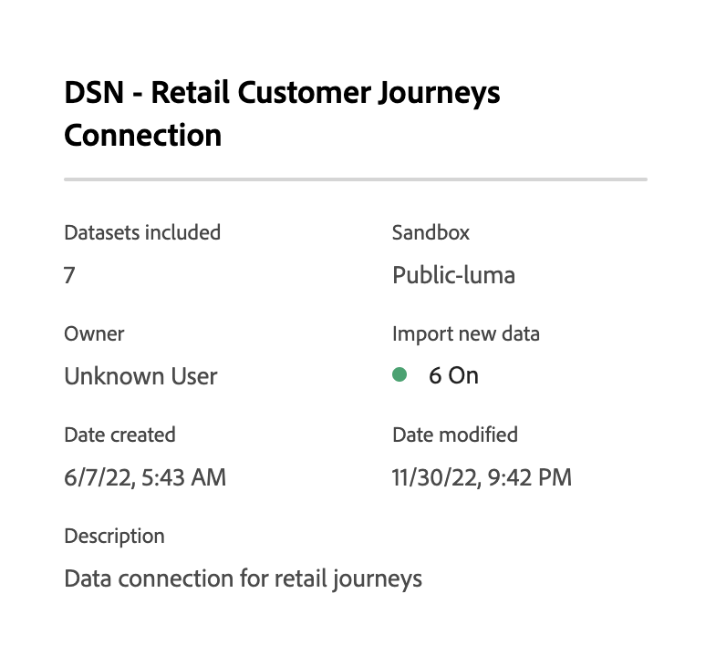

# Administrar conexiones

Una vez que haya [creado o editado una o más conexiones](/help/connections/create-connection.md), puede administrarlas en **[!UICONTROL Conexiones]**. Las conexiones le permiten:

* Vea todas las conexiones de un vistazo, incluido el propietario, el entorno de pruebas y cuándo se crearon y modificaron las conexiones.
* Editar una conexión.
* Eliminar una conexión.
* Crear una vista de datos a partir de una conexión.
* Ver todos los conjuntos de datos de una conexión.
* Compruebe el estado de los conjuntos de datos de la conexión y el estado del proceso de ingesta. Por ejemplo, ¿cuándo están disponibles los datos para que pueda empezar con los informes y análisis en Analysis Workspace?
* Identifique cualquier discrepancia en los datos debido a una configuración incorrecta. ¿Le faltan filas? En caso afirmativo, ¿qué filas faltan y por qué? ¿Configuró incorrectamente las conexiones y esto causó la falta de datos en el Customer Journey Analytics?
* Obtenga información sobre el uso de filas ingeridas y notificables en todas las conexiones.

[!UICONTROL Conexiones] tiene dos interfaces: [[!UICONTROL Lista]](#list) y [[!UICONTROL Uso]](#usage).

## Lista

La interfaz [!UICONTROL List] es la interfaz predeterminada para Conexiones. Si no está seleccionada, seleccione la ficha **[!UICONTROL Lista]** para tener acceso a la interfaz.

La interfaz [!UICONTROL List] muestra una tabla de todas las conexiones disponibles. Puede buscar rápidamente una conexión usando el cuadro Buscar .

En la tabla están disponibles las siguientes columnas o iconos.

| Columna o icono | Descripción |
| --- | --- |
| [!UICONTROL Nombre] | Nombre descriptivo de la conexión. Para ver los detalles de la conexión, seleccione el nombre del hipervínculo. Ver [detalles de conexión](#connection-details). |
|  | Para ver información sobre [!UICONTROL Conjuntos de datos incluidos], [!UICONTROL espacio aislado], [!UICONTROL Propietario] y más, seleccione  junto al nombre de la conexión.
Una ventana emergente muestra detalles. 
 |
|  | Para [crear una vista de datos](#create-a-data-view) para la conexión, seleccione . Este icono solo se muestra cuando no hay ninguna vista de datos asociada a la conexión. |
|  | Seleccione  para: 
 [Editar](#edit-a-connection) una conexión.
 [Eliminar](#delete-a-connection) una conexión.
 [Crear nueva vista de datos](#create-a-data-view). Para crear vistas de datos adicionales para la conexión. |
| [!UICONTROL Conjuntos de datos] | Uno o más vínculos a los conjuntos de datos que forman parte de la conexión. Puede seleccionar el hipervínculo del conjunto de datos para ver el conjunto de datos en la conexión. Si más conjuntos de datos forman parte de la conexión seleccionada, seleccione **[!UICONTROL +*x* more]** para mostrar el panel **[!UICONTROL Conjuntos de datos incluidos]**. Este panel muestra vínculos a todos los conjuntos de datos y una opción para buscar un conjunto de datos específico que forme parte de la conexión.

Al seleccionar un nombre de conjunto de datos, se abre el conjunto de datos en la IU del Experience Platform en una nueva pestaña. |
| [!UICONTROL Zona protegida] | La zona protegida [Experience Platform](https://experienceleague.adobe.com/es/docs/experience-platform/sandbox/home) desde la que esta conexión obtiene sus conjuntos de datos. Este entorno de pruebas se seleccionó cuando creó la conexión. No se puede modificar. |
| [!UICONTROL Propietario] | La persona que creó la conexión. |
| [!UICONTROL Importar datos nuevos] | Estado de la importación de nuevos datos para conjuntos de datos: 
)    **[!UICONTROL _x _en]**para conjuntos de datos configurados para importar datos nuevos, y
   **[!UICONTROL _x Desactivado_]** para conjuntos de datos no configurados para importar datos nuevos. |
| [!UICONTROL Fecha de creación] | La marca de tiempo cuando se creó la conexión. |
| [!UICONTROL Última modificación] | La marca de tiempo de la última actualización de la conexión. |
| [!UICONTROL Datos de relleno] | El estado para los datos de relleno entre conjuntos de datos.
   **[!UICONTROL _x _rellenos fallidos]**para el número de rellenos fallidos entre conjuntos de datos,
   **[!UICONTROL _x _rellenos en procesamiento]**para el número de rellenos en procesamiento entre conjuntos de datos,
   **[!UICONTROL _x _rellenos completados]**para el número de rellenos completados para los conjuntos de datos, y
   **[!UICONTROL _Desactivado_]** en caso de que no se definan rellenos para los conjuntos de datos de la conexión. |

Para configurar qué columnas mostrar, seleccione , que muestra el cuadro de diálogo **Personalizar tabla** que le permite activar o desactivar columnas en la tabla.

### Edición de una conexión

1. Seleccione  junto al nombre de la conexión
1. Seleccione  **[!UICONTROL Editar]** en el menú contextual.

Como alternativa, puede:

1. Seleccione la fila de conexión.

1. Seleccione  **[!UICONTROL Editar]** de la barra azul.

Al editar una conexión, puede:

* Iniciar y detener la importación de nuevos datos.
* Cambiar el nombre de una conexión.
* Actualice los conjuntos de datos.
* Elimine los conjuntos de datos de las conexiones.

Consulte [Crear o editar una conexión](create-connection.md) para obtener más información.

### Eliminar una conexión {#connections-delete}

1. Seleccione  junto al nombre de la conexión.
1. Seleccione  **[!UICONTROL Eliminar]**.

Como alternativa, puede:

1. Seleccione la fila de conexión.

1. Seleccione  **[!UICONTROL Eliminar]** de la barra azul.

Al eliminar una conexión, un panel **[!UICONTROL Eliminar conexión]** indica qué vistas de datos se eliminan y qué proyectos de Workspace se ven afectados.

Seleccione **[!UICONTROL Continuar]** para eliminar la conexión.

Consulte [Implicaciones de eliminación](/help/technotes/deletion.md) para obtener más información sobre cómo eliminar una conexión.

### Creación de una vista de datos para una conexión

* Si no hay ninguna vista de datos asociada a la conexión:

   1. Seleccione  junto al nombre de la conexión.

* Si ya se han creado una o más vistas de datos para la conexión:

   1. Seleccione  junto al nombre de la conexión.
   1. Seleccione  **[!UICONTROL Crear nueva vista de datos]**.

Como alternativa, puede:

1. Seleccione la fila de conexión.

1. Seleccione  **[!UICONTROL Crear vista de datos]** desde la barra de botones azul.

Consulte [Creación o edición de una vista de datos](/help/data-views/create-dataview.md) para obtener más información.

### Detalles de conexión {#connection-detail}

Para ir a los detalles de una conexión, seleccione un nombre de conexión en la tabla de conexiones.

La interfaz de detalles Conexiones proporciona una vista detallada del estado de una conexión. Puedes realizar lo siguiente:

* Compruebe el estado de los conjuntos de datos de la conexión y del proceso de ingesta.
* Identifique los problemas de configuración que pueden provocar registros omitidos o eliminados.
* Ver cuándo están disponibles los datos para los informes.

| Interfaz de usuario | Descripción |
| --- | --- |
|  [!UICONTROL Editar conexión] | Para editar los detalles de una conexión, seleccione  **[!UICONTROL Editar conexión]**. Consulte [Crear o editar una conexión](create-connection.md) para obtener más información. |
| Selector de conjunto de datos | Permite seleccionar uno o todos los conjuntos de datos de la conexión. No puede seleccionar conjuntos de datos múltiples. El valor predeterminado es [!UICONTROL Todos los conjuntos de datos]. |
| Selector de intervalo de fechas | Edite la fecha de inicio, la fecha de finalización o seleccione  para abrir el selector de intervalo de fechas. En el selector de intervalo de fechas, seleccione un intervalo de fechas utilizando uno de los períodos predefinidos (por ejemplo **[!UICONTROL Últimos 6 meses]**) o utilice el calendario para seleccionar las fechas de inicio y finalización. Seleccione **[!UICONTROL Aplicar]** para aplicar el nuevo intervalo de fechas. |
| [!UICONTROL Registros de datos de eventos disponibles] | Número total de filas del conjunto de datos de evento disponibles para el sistema de informes, **para toda la conexión**. Este recuento es independiente de cualquier configuración de calendario. El recuento cambia si selecciona un conjunto de datos del selector de conjuntos de datos o en la tabla. Una vez añadidos los datos, existe una latencia de una a dos horas para que los datos aparezcan en los informes. |
| [!UICONTROL Métricas] | Resuma los registros de evento, búsqueda, perfil y conjunto de datos de resumen que se agregan, omiten y eliminan, y el número de lotes agregados. Estas métricas se basan en **el conjunto de datos y el intervalo de fechas que ha seleccionado**.
Seleccione **[!UICONTROL Comprobar detalles]** para mostrar la ventana emergente **[!UICONTROL Comprobar detalles omitidos]**. La ventana emergente enumera el número de registros omitidos y el motivo de todos los conjuntos de datos de evento o conjuntos de datos seleccionados.

Seleccione la ventana emergente  con más información. Por algunas razones omitidas, como [!UICONTROL ID de visitante vacío], la ventana emergente muestra PSQL de muestra para EQS (Experience Platform para el servicio de consultas) que puede usar en [servicio de consultas](https://experienceleague.adobe.com/es/docs/experience-platform/query/home) para consultar los registros omitidos en el conjunto de datos. Seleccione  **[!UICONTROL Copiar PSQL de muestra para EQS]** para copiar el SQL. |
| [!UICONTROL Registros añadidos] | Indica cuántas filas se añadieron en el período de tiempo seleccionado, **para el conjunto de datos y el intervalo de fechas que ha seleccionado**. Se actualiza cada diez minutos. |
| [!UICONTROL Registros omitidos] | Indica cuántas filas se omitieron en el período de tiempo seleccionado, **para el conjunto de datos y el intervalo de fechas que ha seleccionado**. Los motivos por los que se omiten registros son: faltan marcas de hora, falta ID de persona o no es válido, etc. Se actualiza cada diez minutos. 
ID de persona no válidos (como `undefined` o `00000000`, o cualquier combinación de números y letras en un [!UICONTROL ID de persona] que aparece en un evento más de 1 millón de veces en un mes determinado) son ID que no se pueden atribuir a ningún usuario o persona en particular. Estas filas no se pueden ingerir en el sistema, y conlleva a la creación de informes e ingestas propensas a errores. Para corregir ID de persona no válidos, tiene tres opciones:<ul><li>Use [Configuración](/help/stitching/overview.md) para rellenar los identificadores de usuario sin definir o todos cero con identificadores de usuario válidos.</li><li>Vacíe el ID de usuario, que luego se omiten durante la ingesta (preferible a los ID de usuario no válidos o todos cero).</li><li>Corrija cualquier ID de usuario no válido en el sistema antes de ingerir los datos.</li></ul> |
| [!UICONTROL Registros] eliminados | Indica cuántas filas se eliminaron en el período de tiempo seleccionado, **para el conjunto de datos y el intervalo de fechas que ha seleccionado**. Alguien podría haber eliminado un conjunto de datos en [!DNL Experience Platform], por ejemplo. Se actualiza cada diez minutos.
En algunos casos, este valor también puede incluir registros reemplazados, como con la vinculación o algunas actualizaciones del conjunto de datos de búsqueda. Consideremos este ejemplo:
<ul><li>Se carga un registro a un conjunto de datos de perfil individual de XDM, cuyo Customer Journey Analytics está configurado para introducir como datos de búsqueda de perfil. En los detalles de la conexión, este conjunto de datos mostraría 1 registro añadido.</li><li>Puede cargar un duplicado del registro original en el mismo conjunto de datos de AEP, que ahora contiene dos registros. Customer Journey Analytics ingiere el registro adicional del conjunto de datos de búsqueda de perfiles. Al ver que ya ha introducido un registro de perfil en la conexión para ese ID de persona, Customer Journey Analytics elimina su versión anterior y agrega los nuevos datos de perfil. En los detalles de la conexión, esta acción representaría 1 registro añadido y 1 registro eliminado, ya que Customer Journey Analytics solo conserva los datos de búsqueda de perfil más recientes para cualquier ID de persona introducido.</li><li>En total, el conjunto de datos de AEP contiene dos registros que son idénticos. Por separado, los detalles de conexión del Customer Journey Analytics muestran el estado de sus datos introducidos: 2 registros añadidos y 1 registro eliminado para este conjunto de datos de perfil. </li></ul> |
|  _Buscar nombre o ID del conjunto de datos_ | Campo de búsqueda de conjunto de datos. Puede buscar en la tabla de conjuntos de datos por nombre de conjunto de datos o [!UICONTROL ID de conjunto de datos]. |
| [!UICONTROL Tabla de conjuntos de datos] | Los conjuntos de datos que forman parte de la conexión. |
| [!UICONTROL Conjuntos de datos] | Nombre del conjunto de datos que forma parte de la conexión. Puede seleccionar el hipervínculo para abrir el conjunto de datos en la interfaz de usuario de Experience Platform en una nueva pestaña. Puede seleccionar la fila o la casilla de verificación para mostrar solo los detalles del conjunto de datos seleccionado. |
| [!UICONTROL ID de conjunto de datos] | Generado automáticamente por el Experience Platform. |
| [!UICONTROL Registros añadidos] | El número de registros del conjunto de datos (filas) agregados a una conexión durante el intervalo de tiempo seleccionado. |
| [!UICONTROL Registros omitidos] | El número de registros del conjunto de datos (filas) omitidos durante la transferencia de datos para una conexión durante el intervalo de tiempo seleccionado. |
| [!UICONTROL Registros eliminados] | El número de registros del conjunto de datos (filas) quitados de una conexión durante el intervalo de tiempo seleccionado. |
| [!UICONTROL Lotes añadidos] | El número de lotes de conjuntos de datos que se han agregado a una conexión. |
| [!UICONTROL Última incorporación] | La marca de tiempo del último lote del conjunto de datos que se ha agregado a una conexión. |
| [!UICONTROL Tipo de fuente de datos] | El tipo de origen del conjunto de datos. El tipo de origen se define al crear una conexión. |
| [!UICONTROL Tipo de conjunto de datos] | El tipo de conjunto de datos para este conjunto de datos. El tipo puede ser [!UICONTROL Event], [!UICONTROL Profile], [!UICONTROL Lookup] o [!UICONTROL Summary]. [Más información](https://experienceleague.adobe.com/en/docs/analytics-platform/using/cja-connections/create-connection) |
| Esquema | El esquema del Experience Platform en el que se basa el conjunto de datos. |
| [!UICONTROL Importar datos nuevos] | Estado de importación de nuevos datos para el conjunto de datos: 
   **[!UICONTROL _x _en]**si el conjunto de datos está configurado para importar datos nuevos, y
   **[!UICONTROL _x Desactivado_]** si el conjunto de datos está configurado para no importar nueva importación de datos. |
| [!UICONTROL Transformar datos] | El estado de transformación de los conjuntos de datos de consulta B2B aplicables. Consulte [Transformación de conjuntos de datos para búsquedas B2B](transform-datasets-b2b-lookups.md) para obtener más información.
   **[!UICONTROL _x _en]**para conjuntos de datos aplicables habilitados para transformación, 
   **[!UICONTROL _x Desactivado_]** para conjuntos de datos aplicables no habilitados para transformación, y
**[!UICONTROL N/A]** para todos los demás conjuntos de datos, no aplicable para la transformación. |
| [!UICONTROL Datos de relleno] | El estado de los datos de relleno del conjunto de datos.
   **[!UICONTROL _x _rellenos fallidos]**para el número de rellenos fallidos,
   **[!UICONTROL _x _rellenos procesando]**para el número de rellenos procesando,
   **[!UICONTROL _x _rellenos completados]**para el número de rellenos completados, y
   **[!UICONTROL _Desactivado_]** en caso de que no se hayan configurado los rellenos. |
| [!UICONTROL Importar datos nuevos] | Estado de importación de nuevos datos para el conjunto de datos: 
   **[!UICONTROL _x _en]**si el conjunto de datos está configurado para importar datos nuevos, y
   **[!UICONTROL _x Desactivado_]** si el conjunto de datos está configurado para no importar datos nuevos. |
| [!UICONTROL Datos de relleno] | El estado de los datos de relleno del conjunto de datos.
   **[!UICONTROL _x _rellenos fallidos]**para el número de rellenos fallidos,
   **[!UICONTROL _x _rellenos procesando]**para el número de rellenos procesando,
   **[!UICONTROL _x _rellenos completados]**para el número de rellenos completados, y
   **[!UICONTROL _Desactivado_]** en caso de que no se hayan configurado rellenos. |

>[!IMPORTANT]
>
>Los datos introducidos antes del 13 de agosto de 2021 no se reflejan en la interfaz [!UICONTROL Connections].

#### Panel de conexión

Cuando no se selecciona ningún conjunto de datos en la tabla de conjuntos de datos, un panel a la derecha de la interfaz Conexiones muestra las opciones y los detalles de la conexión.

| Opciones | Descripción |
| --- | --- |
|  [!UICONTROL Actualizar] | Para actualizar la conexión y permitir que se reflejen los registros agregados recientemente, seleccione  **[!UICONTROL Actualizar]**. |
|  **[!UICONTROL Eliminar]** | [Eliminar](#delete-a-connection) esta conexión. |
|  **[!UICONTROL Crear vista de datos]** | [Crear una vista de datos](#create-a-data-view) basada en esta conexión. Consulte [Vistas de datos](https://experienceleague.adobe.com/en/docs/analytics-platform/using/cja-dataviews/data-views) para obtener más información. |
| [!UICONTROL Nombre de la conexión] | Nombre descriptivo de la conexión. |
| [!UICONTROL Descripción de la conexión] | Una descripción más detallada que describe el propósito de esta conexión. |
| [!UICONTROL Zona protegida] | La zona protegida [Experience Platform](https://experienceleague.adobe.com/es/docs/experience-platform/sandbox/home) desde la que esta conexión obtiene sus conjuntos de datos. Este entorno de pruebas se seleccionó la primera vez que creó la conexión. No se puede modificar. |
| [!UICONTROL ID de conexión] | Este ID se genera en el Experience Platform. Puede usar  para copiar el ID. |
| [!UICONTROL Vistas de datos mediante conexión] | Enumera todas las vistas de datos que utilizan esta conexión. |
| [!UICONTROL Importar datos nuevos] | Estado de la importación de nuevos datos para conjuntos de datos: 
   **[!UICONTROL _x _en]**para cuántos conjuntos de datos se han configurado para importar datos nuevos, y
   **[!UICONTROL _x Desactivado_]** para cuántos conjuntos de datos está desactivada la importación de datos nuevos. |
| [!UICONTROL Datos de relleno] | El estado de los datos de relleno para los conjuntos de datos.
   **[!UICONTROL _x _rellenos fallidos]**para el número de rellenos fallidos entre conjuntos de datos,
   **[!UICONTROL _x _rellenos en procesamiento]**para el número de rellenos en procesamiento entre conjuntos de datos,
   **[!UICONTROL _x _rellenos completados]**para el número de rellenos completados para los conjuntos de datos, y
   **[!UICONTROL _Desactivado_]** en caso de que no se definan rellenos para los conjuntos de datos de la conexión. |
| Transformar datos | El estado de transformación de los conjuntos de datos de consulta B2B aplicables. Consulte [Transformación de conjuntos de datos para búsquedas B2B](transform-datasets-b2b-lookups.md) para obtener más información.
   **[!UICONTROL _x _en]**para el número de conjuntos de datos habilitados para la transformación. |
| [!UICONTROL Creado por] | Nombre de la persona que creó la conexión. |
| [!UICONTROL Última modificación] | La marca de tiempo del último cambio en la conexión. |
| [!UICONTROL Última modificación de:] | La persona que modificó la conexión por última vez. |

#### Panel Conjunto de datos

Cuando se selecciona un conjunto de datos en la tabla de conjuntos de datos, un panel a la derecha de la interfaz Conexiones muestra detalles del conjunto de datos seleccionado.

| Detalles | Descripción |
| --- | --- |
| [!UICONTROL ID de la persona] | Identidad definida en el esquema del conjunto de datos en el Experience Platform. Esta identidad es el ID de persona que seleccionó durante la creación de la conexión. Si crea una conexión que incluye conjuntos de datos con distintos ID, el sistema de informes reflejará eso. Para combinar conjuntos de datos, debe utilizar el mismo ID de persona en ellos. |
| [!UICONTROL Clave] | La clave que ha especificado para un conjunto de datos de búsqueda. |
| [!UICONTROL Clave de coincidencia] | La clave coincidente que ha especificado para un conjunto de datos de búsqueda. |
| [!UICONTROL Marca de tiempo] | La marca de tiempo definida para un conjunto de datos de evento. |
| [!UICONTROL Registros disponibles] | El número total de filas ingeridas para este conjunto de datos, para el período de tiempo particular seleccionado a través del calendario. Una vez añadidos, no hay latencia en cuanto a la aparición de datos en los informes. Sin embargo, cuando crea una conexión completamente nueva, hay [latencia](https://experienceleague.adobe.com/en/docs/analytics-platform/using/cja-overview/cja-faq). |
| [!UICONTROL Registros añadidos] | Cantidad de filas añadidas en el período de tiempo seleccionado. |
| [!UICONTROL Registros eliminados] | Cuántos registros se eliminaron durante el período de tiempo seleccionado. |
| [!UICONTROL Lotes añadidos] | Cuántos lotes de datos se añadieron a este conjunto de datos. |
| [!UICONTROL Registros omitidos] | Cuántas filas se omitieron durante la ingesta en el período de tiempo seleccionado.
Los motivos por los que se omiten registros son: faltan marcas de hora, falta ID de persona o no es válido, etc. Se actualiza cada diez minutos.
ID de persona no válidos (como `undefined` o `00000000`, o cualquier combinación de números y letras en un [!UICONTROL ID de persona] que aparece en un evento más de 1 millón de veces en un mes determinado) son ID que no se pueden atribuir a ningún usuario o persona en particular. Estas filas no se pueden ingerir en el sistema, y conlleva a la creación de informes e ingestas propensas a errores. Para corregir ID de persona no válidos, tiene tres opciones:<ul><li>Use [Configuración](/help/stitching/overview.md) para rellenar los identificadores de usuario sin definir o todos cero con identificadores de usuario válidos.</li><li>Vacíe el ID de usuario, que luego se omitirá durante la ingesta (preferible a los ID de usuario no válidos o todos cero).</li><li>Corrija cualquier ID de usuario no válido en el sistema antes de ingerir los datos.</li></ul> |
| [!UICONTROL Última incorporación] | Cuando se añadió el último lote. |
| [!UICONTROL Importar datos nuevos] | Estado de importación de nuevos datos para el conjunto de datos: 
   **[!UICONTROL _x _en]**si el conjunto de datos está configurado para importar datos nuevos, y
   **[!UICONTROL _x Desactivado_]** si el conjunto de datos está configurado para no importar datos nuevos. |
| [!UICONTROL Datos de relleno] | El estado de los datos de relleno del conjunto de datos.
   **[!UICONTROL _x _rellenos fallidos]**para el número de rellenos fallidos,
   **[!UICONTROL _x _rellenos procesando]**para el número de rellenos procesando,
   **[!UICONTROL _x _rellenos completados]**para el número de rellenos completados, y
   **[!UICONTROL _Desactivado_]** en caso de que no se hayan configurado rellenos.
Para mostrar un cuadro de diálogo con una descripción general de los rellenos anteriores para el conjunto de datos, seleccione  **[!UICONTROL Rellenos anteriores]**. |
| [!UICONTROL Tipo de fuente de datos] | Tipo de origen de datos definido al agregar el conjunto de datos a la conexión. |
| [!UICONTROL Tipo de conjunto de datos] | [!UICONTROL Evento], [!UICONTROL Perfil], [!UICONTROL Búsqueda] o [!UICONTROL Resumen]. [Más información](https://experienceleague.adobe.com/en/docs/analytics-platform/using/cja-connections/create-connection) |
| [!UICONTROL Esquema] | El esquema del Experience Platform en el que se basa este conjunto de datos. |
| [!UICONTROL ID de conjunto de datos] | Esta ID del conjunto de datos se genera en el Experience Platform. |

## Uso

<!-- markdownlint-disable MD034 -->

>[!CONTEXTUALHELP]
>id="cja_connections_usage_keyusagemetrics"
>title="Métricas de uso clave"
>abstract="Proporcione datos mensuales y totales para las filas principales e históricas sobre las que se debe informar."

<!-- markdownlint-enable MD034 -->

<!-- markdownlint-disable MD034 -->

>[!CONTEXTUALHELP]
>id="cja_connections_usage_monthlyingestedrows"
>title="Filas ingeridas mensualmente"
>abstract="Mide el número total de registros agregados al sistema cada mes para proporcionar información sobre el crecimiento de los datos y las tasas de ingesta."

<!-- markdownlint-enable MD034 -->

<!-- markdownlint-disable MD034 -->

>[!CONTEXTUALHELP]
>id="cja_connections_usage_monthlyreportablerows"
>title="Filas que es posible notificar mensualmente"
>abstract="Registra el número de filas disponibles para la creación de informes. Las filas reportables son las filas ingeridas menos las filas que se omiten y eliminan durante la ingesta. Las filas notificables sirven como métrica clave para la facturación y el uso de datos."

<!-- markdownlint-enable MD034 -->

<!-- markdownlint-disable MD034 -->

>[!CONTEXTUALHELP]
>id="cja_connections_usage_detailbreakdown"
>title="Desglose por detalle."
>abstract="Puede ver métricas detalladas por conexión, conjunto de datos, zona protegida y etiquetas, con la opción de descargar un archivo CSV de los datos."

<!-- markdownlint-enable MD034 -->

La interfaz [!UICONTROL Uso] muestra el uso de filas ingeridas y notificables en todas las conexiones. Esta interfaz le permite determinar si el uso del Customer Journey Analytics cumple con lo acordado contractualmente. Además de supervisar, puede utilizar la interfaz de usuario de para planificar la renovación de su licencia de Customer Journey Analytics.

Puede seleccionar un intervalo de tiempo (entre los últimos 6 meses, el año hasta la fecha o los últimos 2 años) y un intervalo (entre mensual o trimestral) para monitorizar el uso del Customer Journey Analytics. La interfaz se divide en dos secciones:

* Filas ingeridas: filas totales ingeridas/enviadas desde conjuntos de datos de evento en todas las conexiones de Customer Journey Analytics, incluidos los registros omitidos durante la ingesta
* Filas reportables: filas reportables totales que incluyen todos los datos de eventos en todas las conexiones de Customer Journey Analytics

Seleccione la ficha **[!UICONTROL Uso]** para tener acceso a la interfaz.

### Informe de uso

1. Seleccione un **[!UICONTROL intervalo de tiempo]**. Puede seleccionar entre **[!UICONTROL últimos 6 meses]**, **[!UICONTROL año hasta la fecha]** o **[!UICONTROL últimos 2 años]**.
1. Seleccionar un **[!UICONTROL intervalo]**. Puede seleccionar entre **[!UICONTROL mensual]** o **[!UICONTROL trimestral]**.

Para [!UICONTROL filas ingeridas]:

* Un panel muestra el total de filas introducidas que incluyen todos los datos de eventos en todas las conexiones actualizadas el segundo día de un mes. En el panel:
   * un cuadro muestra el número de filas introducidas del último mes y el cambio en % (indicado por ▲ o ▼) con respecto al mes anterior.
   * un gráfico de líneas muestra las [!UICONTROL filas ingeridas mensualmente] ◼︎. Para ver una ventana emergente que muestra el número de filas introducidas mensualmente durante un mes, pase el ratón sobre cualquier punto de datos del gráfico de líneas.

Para [!UICONTROL filas reportables]:

* Un panel muestra el total de filas sobre las que se pueden realizar informes que incluyen todos los datos de eventos en todas las conexiones actualizadas el segundo día de un mes. En el panel:
   * un cuadro muestra el número total acumulado de filas sobre las que se puede realizar un informe.
   * un cuadro muestra el número total de filas sobre las que se puede realizar un informe del último mes y el cambio en % (indicado por ▲ o ▼) con respecto al mes anterior.
   * un gráfico de líneas muestra las ◼︎ [!UICONTROL filas mensuales de las que se debe informar]. Para ver una ventana emergente que muestra el número de filas notificables acumulativas de un mes específico, pase el ratón sobre cualquier punto de datos del gráfico de líneas.
   * un gráfico de líneas muestra las [!UICONTROL filas acumulativas sobre las que se puede generar informe] ◼︎. Para ver una ventana emergente que muestra el número de filas mensuales sobre las que se puede realizar un informe durante un mes, pase el ratón sobre cualquier punto de datos del gráfico de líneas.

>[!MORELIKETHIS]
>
>[Ver, solucionar problemas y modificar la configuración de conexión](https://experienceleague.adobe.com/en/docs/customer-journey-analytics-learn/tutorials/connections/connections-details-experience-in-cja) tutorial.
