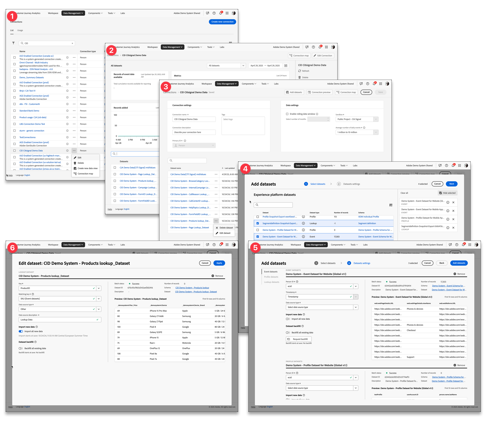

# Información general sobre conexiones

Las conexiones permiten a los administradores de productos de Customer Journey Analytics establecer conexiones con diferentes fuentes de datos de [!DNL &#x200B; Experience Platform], como eventos, búsquedas, perfiles y conjuntos de datos de resumen. Estas conexiones permiten la integración de datos de una conexión a una vista de datos derivada. Las conexiones son la base de Customer Journey Analytics y se crean a partir de [!DNL Experience Platform] conjuntos de datos de origen.

>[!IMPORTANT]
>
>Puede combinar varios conjuntos de datos de [!DNL Experience Platform] en una sola conexión.

## Flujo de trabajo Conexiones

<!-- Outdated interface 

>[!BEGINSHADEBOX]

See  [Configuring connections](https://video.tv.adobe.com/v/35111/?quality=12&learn=on){target="_blank"} for a demo video.

>[!ENDSHADEBOX]

-->

En un nivel superior, el flujo de trabajo Conexiones le permite:

| Interfaz | Descripción |
|:---:|---|
| ➊ | [Administre sus conexiones y el uso general](manage-connections.md) de Customer Journey Analytics desde el Administrador de conexiones. |
| ➋ | [Inspeccione los detalles de una conexión](manage-connections.md#connection-details), como los registros de conjuntos de datos ingeridos, omitidos o eliminados. |
| ➌ | [Cree o edite la configuración de una conexión](create-connection.md#create-or-edit-a-connection), como una ventana de datos móvil, la zona protegida que se va a usar, qué conjuntos de datos forman parte de la conexión y más. |
| ➍ | [Agregar conjuntos de datos a una conexión](create-connection.md#add-datasets). La conexión debe tener al menos un conjunto de datos de resumen o evento, pero puede contener una variedad de conjuntos de datos de resumen, perfil y evento. |
| ➎ | [Configure las opciones](create-connection.md#dataset-settings) de los conjuntos de datos que agregue. Puede determinar cómo vincular diferentes conjuntos de datos en función de un identificador común basado en personas o en cuentas de [!BADGE B2B edition]{type=Informative url="https://experienceleague.adobe.com/es/docs/analytics-platform/using/cja-overview/cja-b2b/cja-b2b-edition" newtab=true tooltip="Customer Journey Analytics B2B edition"}. |
| ➏ | [Editar la configuración de un conjunto de datos existente](create-connection.md#edit-a-dataset). Siempre puede volver a visitar la configuración del conjunto de datos en una etapa posterior. |

## Control de acceso

El acceso a la administración de conexiones debe restringirse a un grupo de administración principal. Las configuraciones de conexión tienen implicaciones contractuales con respecto a las asignaciones de volumen para los datos introducidos en Customer Journey Analytics.

>[!MORELIKETHIS]
>
>[Control de acceso](/help/technotes/access-control.md).

