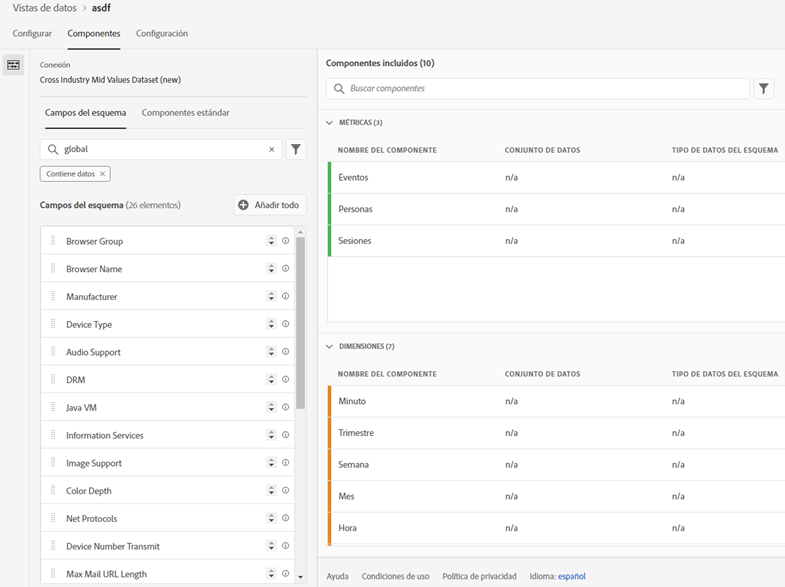
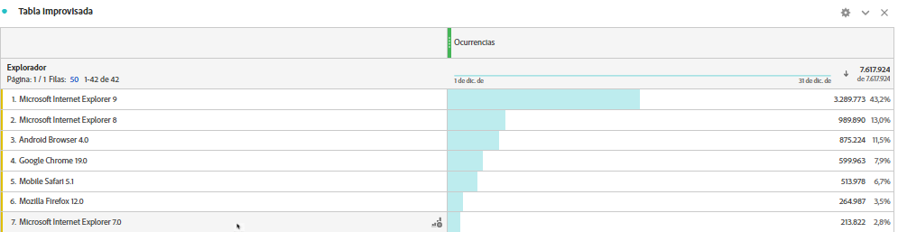

# Adición de búsquedas estándar a sus conjuntos de datos

>[!IMPORTANT]
>Las búsquedas estándar solo están disponibles para fuentes de datos del conector de datos de Analytics en CJA. Puede utilizarlas con implementaciones estándar de Adobe Analytics o con el [SDK web de Adobe Experience Platform](https://experienceleague.adobe.com/docs/experience-platform/edge/home.html?lang=es) o las API de recopilación de datos de Experience Platform.

Las búsquedas estándar (también conocidas como búsquedas suministradas por Adobe) mejoran la capacidad de Customer Journey Analytics para informar sobre algunas dimensiones o atributos que no son útiles por sí mismos, pero que sí lo son cuando se unen con otros datos. Algunos ejemplos son los atributos de los dispositivos móviles y de las dimensiones del sistema operativo y del explorador, como, por ejemplo, los números de versión del explorador. Una &quot;búsqueda estándar&quot; es similar a un conjunto de datos de búsqueda. Sin embargo, las búsquedas estándar son aplicables en todas las organizaciones con Experience Cloud. Se aplican automáticamente a todos los conjuntos de datos de evento que contienen determinados campos de esquema XDM (consulte la información sobre campos específicos a continuación). Existe un conjunto de datos de búsqueda estándar para cada ubicación de esquema que Adobe clasifica.

En Adobe Analytics tradicional, estas dimensiones aparecen por sí solas, mientras que en CJA hay que incluir activamente estas dimensiones al crear las vistas de datos. En el flujo de trabajo Conexiones, seleccione un conjunto de datos que esté marcado con una clave para la búsqueda estándar. La IU de vistas de datos sabe automáticamente que debe incluir todas las dimensiones de búsqueda estándar que estén disponibles para la creación de informes. Los archivos de búsqueda se mantienen actualizados automáticamente y están disponibles en todas las regiones y todas las cuentas. Se almacenan en organizaciones específicas de la región asociadas con el cliente.

## Uso de búsquedas estándar con el conjuntos de datos del conector de datos de Adobe

Los conjuntos de datos de búsqueda estándar se aplican automáticamente en el momento en que se crea el informe. Si está utilizando el Conector de datos de Analytics e introduce una dimensión para la que Adobe proporciona una búsqueda estándar, dicha búsqueda estándar se aplica automáticamente. Si un conjunto de datos de evento contiene campos XDM, es posible aplicarle búsquedas estándar.

<!--
### Specific IDs that need to be populated

The following IDs need to be populated in the specific XDM mixins for this functionality to work:

* Environment Details Mixin – device/typeID value populated - Must match Device Atlas IDs and will populate device data.
* Adobe Analytics ExperienceEvent Template Mixin or Adobe Analytics ExperienceEvent Full Extension Mixin with analytics/environment/browserIDStr and analytics/environment/operatingSystemIDStr. Both must match the Adobe IDs and  populate browser and OS data, respectively.

You need these mixins with the three IDs populated (device/typeID, environment/browserIDStr, and environment/operatingSystemIDStr). The lookup dimensions will then be pulled automatically by CJA and will be available in the Data View.

The catch here is that they can only populate those IDs today if they have a direct relationship with Device Atlas. They are Device Atlas IDs, and they provide an API to allow a customer to look them up. This is a significant hurdle, and we may just want to take the reference to this capability out of the product documentation until we have a productized way to expose the Device Atlas ID lookup functionality.
-->

### Campos de búsqueda estándar disponibles

* `browser`
   * `browser`, `group_id`, `id`
* `browser_group`
   * `browser_group`, `id`
* `os`
   * `os`, `group_id`, `id`
* `os_group`
   * `os_group`, `id`
* `mobile_audio_support - multi`
* `mobile_color_depth`
* `mobile_cookie_support`
* `mobile_device_name`
* `mobile_device_number_transmit`
* `mobile_device_type`
* `mobile_drm - multi`
* `mobile_image_support - multi`
* `mobile_information_services`
* `mobile_java_vm - multi`
* `mobile_mail_decoration`
* `mobile_manufacturer`
* `mobile_max_bookmark_url_length`
* `mobile_max_browser_url_length`
* `mobile_max_mail_url_length`
* `mobile_net_protocols - multi`
* `mobile_os`
* `mobile_push_to_talk`
* `mobile_screen_height`
* `mobile_screen_size`
* `mobile_screen_width`
* `mobile_video_support - multi`

## Informe sobre dimensiones de búsqueda estándar

Para informar sobre las dimensiones de búsqueda estándar, debe añadirlas al crear una vista de datos en Customer Journey Analytics:

A continuación, podrá ver los datos de búsqueda el Espacio de trabajo:

