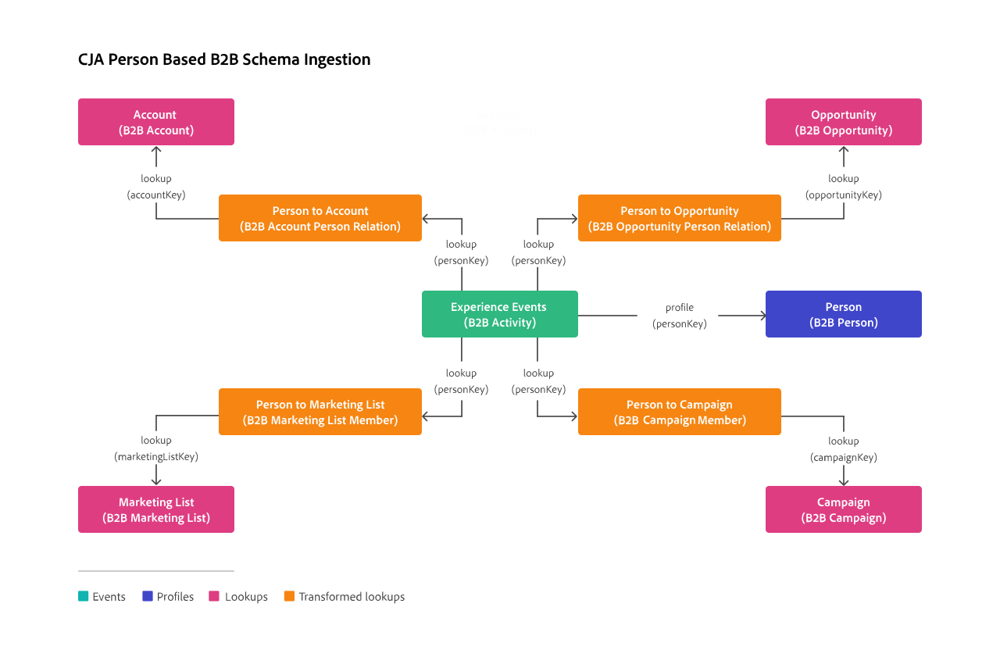

# Transformar el conjunto de datos para búsquedas B2B

Para admitir búsquedas basadas en personas en datos B2B (incluidas cuentas, oportunidades, listas de marketing y campañas), es necesaria la transformación de los conjuntos de datos de búsqueda B2B.

Esta transformación solo está disponible para conjuntos de datos con datos para esquemas de búsqueda B2B, según las siguientes clases:

* [Relación de persona de la cuenta XDM](https://experienceleague.adobe.com/en/docs/experience-platform/xdm/classes/b2b/business-account-person-relation)
* [Relación de persona de oportunidad empresarial de XDM](https://experienceleague.adobe.com/en/docs/experience-platform/xdm/classes/b2b/business-opportunity-person-relation)
* [Miembros de la lista de marketing empresarial de XDM](https://experienceleague.adobe.com/en/docs/experience-platform/xdm/classes/b2b/business-marketing-list-members)
* [Miembros de XDM Business Campaign](https://experienceleague.adobe.com/en/docs/experience-platform/xdm/classes/b2b/business-campaign-members)

>[!NOTE]
>
>Hay un límite de no más de 10 000 elementos por cada ID. Esta limitación implica que para cualquier ID de persona solo puede tener 10 000 cuentas, 10 000 oportunidades, 10 000 listas de marketing o 10 000 campañas.

>[!PREREQUISITES]
>
>Para que la ingesta funcione correctamente, debe validar que los conjuntos de datos de búsqueda B2B tengan datos rellenados para los siguientes campos (tal como se definen en los esquemas de búsqueda B2B):
>
>| Conjunto de datos que contiene datos que se ajustan al esquema | Campo rellenado con datos |
>|---|---|
>| Relación de persona de cuenta empresarial de XDM | `accountPersonID` |
>| Persona de oportunidad empresarial de XDM | `opportunityPersonID` |
>| Lista de marketing empresarial de XDM | `marketingListMemberID` |
>| Miembros de campaña empresarial de XDM | `campaign.sourceKey` |
>

Para habilitar la transformación para un conjunto de datos de búsqueda B2B:

* Compruebe para cada conjunto de datos los valores sugeridos para **[!UICONTROL Key]** y **[!UICONTROL Matching key]**. Si cambia los valores de los valores sugeridos, verá una advertencia que le pedirá que continúe. Debe estar seguro de que:

   * El valor que seleccionó para **Clave** se basa en el tipo de datos de ID de persona.
   * El valor que seleccione para **Clave de coincidencia** se define como el campo de identidad principal para el conjunto de datos de evento.

* Seleccione las opciones para importar nuevos datos y el relleno del conjunto de datos.

* Seleccione **[!UICONTROL Transformar conjunto de datos para búsquedas B2B]**.

  Esta opción transforma el conjunto de datos para que se pueda utilizar para búsquedas basadas en personas en escenarios B2B.

  >[!IMPORTANT]
  >
  >Una vez activada y guardada la conexión, la transformación es irreversible. No puede modificar la configuración Clave, Clave de coincidencia y Transformar conjunto de datos. Solo puede quitar, agregar y volver a configurar el conjunto de datos.

Para habilitar la transformación para uno o varios conjuntos de datos que ya forman parte de una conexión existente:

1. Elimine los conjuntos de datos de la conexión.
1. Guarde la conexión.
1. Agregue los conjuntos de datos a la conexión mientras activa la transformación de los conjuntos de datos.

## Información básica

Los conjuntos de datos no transformados, para esquemas basados en las cuatro clases de esquema mencionadas anteriormente, pueden contener varias filas para un único identificador de persona. Las búsquedas basadas en personas solo coinciden con la incidencia más reciente de ese identificador de persona, lo que impide una búsqueda adecuada basada en el ID de persona de cuentas, oportunidades, listas de marketing o campañas.

La transformación modifica el conjunto de datos de cada una de las cuatro clases de esquema (naranja en la ilustración siguiente), de modo que para cada identificador de persona se crea una matriz (objeto) para los datos relevantes (cuentas, oportunidades, listas de marketing o campañas) en los conjuntos de datos de búsqueda (rosa en la ilustración siguiente). Esta transformación permite un funcionamiento correcto de las búsquedas basadas en el ID de la persona.

