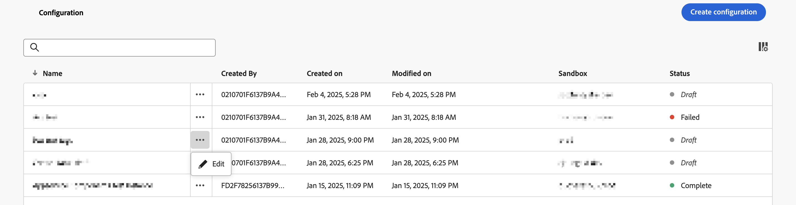
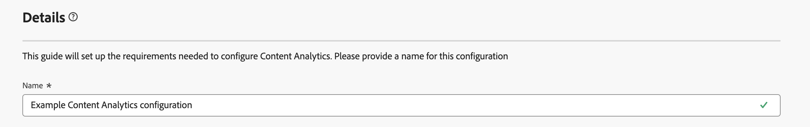
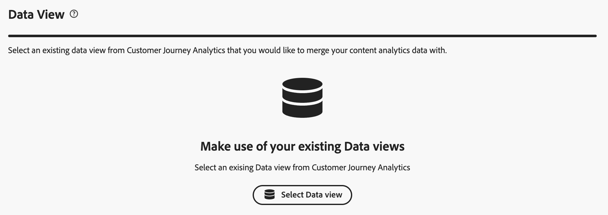
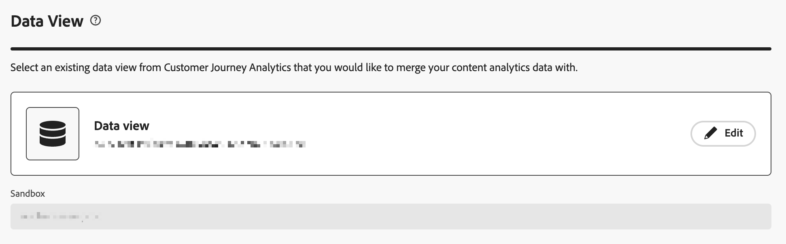
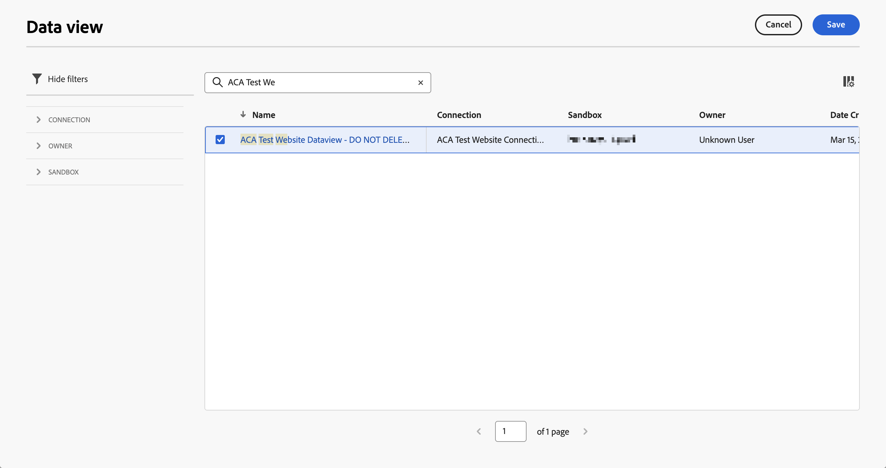
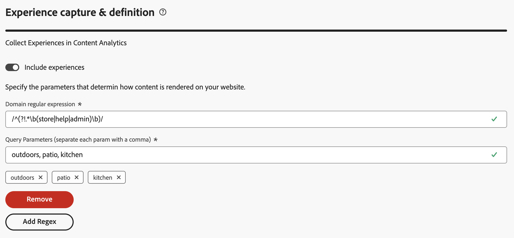
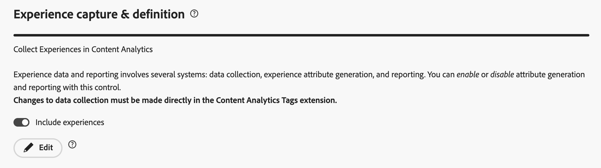
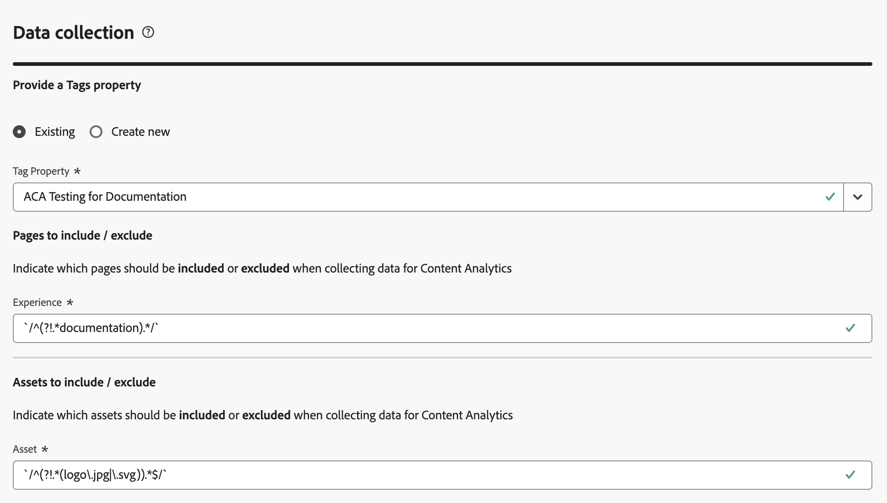
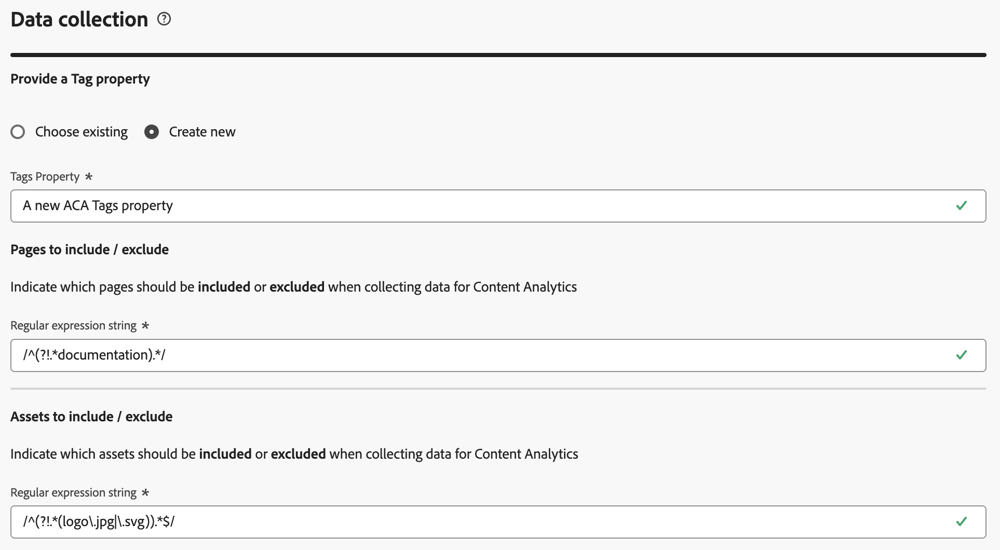
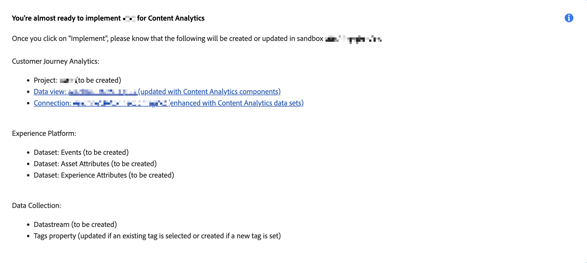

# Configuración guiada del análisis de contenido

La configuración guiada le ayuda a configurar el análisis de contenido de una forma rápida y sencilla. La configuración guiada utiliza un asistente para establecer los requisitos para configurar el análisis de contenido automáticamente para su organización. En la pantalla **[!UICONTROL Configuración]**, puede crear una configuración nueva o editar una existente.

>[!IMPORTANT]
>
>Solo puede tener una configuración del análisis de contenido por cada zona protegida de su organización.

Para acceder a la configuración del análisis de contenido

* Seleccione **[!UICONTROL Administración de datos]** > **[!UICONTROL configuración de Análisis de contenido]** en el menú principal de Customer Journey Analytics.

En la pantalla **[!UICONTROL Configuración de Content Analytics]**, verá una tabla de configuraciones de Content Analytics existentes.

Para cada configuración, están disponibles los siguientes detalles:

| Columna | Descripción |
|---|---|
| **[!UICONTROL Nombre]** | El nombre de la configuración. |
| **[!UICONTROL Creado por]** | La cuenta técnica que ha creado la configuración. |
| **[!UICONTROL Creado el]** | La marca de tiempo de creación de la configuración. |
| **[!UICONTROL Modificado el]** | La marca de tiempo de la última modificación de la configuración. |
| **[!UICONTROL Zona protegida]** | La zona protegida dentro de la organización en la que se configura y se implementa (o se planea implementar) el análisis de contenido. |
| **[!UICONTROL Estado]** | El estado de la configuración. El estado puede ser:  **[!UICONTROL Borrador]**: la configuración se guardó para más tarde y no se implementó.  **[!UICONTROL Error]**: la configuración ha fallado. Puede seleccionar **[!UICONTROL Editar]** para obtener información sobre el error. Adobe aborda activamente cualquier implementación fallida. Póngase en contacto con el Servicio de atención al cliente para obtener más información.  **[!UICONTROL Completado]**: la configuración se ha completado e implementado correctamente. |

Puede utilizar  para personalizar la tabla. Seleccione qué columnas desea mostrar en el cuadro de diálogo **[!UICONTROL Personalizar tabla]** y seleccione **[!UICONTROL Aplicar]** para aplicar los cambios.

En la pantalla **[!UICONTROL Configuración]** del análisis de contenido, puede crear una nueva configuración o editar una configuración existente.

Para crear una nueva configuración:

* Seleccione **[!UICONTROL Crear configuración]**. Esta acción abre el [asistente de configuración guiada](#guided-configuration-wizard).

Para editar una configuración existente:

* Seleccione  y, a continuación,  **[!UICONTROL Editar]** para una configuración de análisis de contenido existente. Esta acción abre el [asistente de configuración guiada](#guided-configuration-wizard).

## Asistente de la configuración guiada

El asistente de configuración guiada consta de cuatro secciones ([Detalles](#details), [Vista de datos](#data-view), [Captura y definición de experiencias](#experience-capture-and-definition) y [Recopilación de datos](#data-collection)), cada una de las cuales le solicita los detalles necesarios para configurar correctamente el análisis de contenido. Complete cada sección antes de pasar a la siguiente, ya que algunos ajustes de una sección pueden depender de los valores de configuración de secciones anteriores.

### Detalles {#onboarding-details}

<!-- markdownlint-disable MD034 -->

>[!CONTEXTUALHELP]
>id="aca_onboarding_details_button"
>title="Detalles"
>abstract="Introduzca un nombre para la conexión. En las secciones **[!UICONTROL Vista de datos]**, **[!UICONTROL Captura y definición de experiencias]** y **[!UICONTROL Recopilación de datos]**, proporcione más detalles para garantizar que el análisis de contenido se pueda configurar correctamente."

>[!CONTEXTUALHELP]
>id="aca_onboarding_details_name_header"
>title="Detalles"
>abstract="Esta guía establece los requisitos necesarios para configurar el análisis de contenido. Proporcione un nombre para esta configuración"

<!-- markdownlint-enable MD034 -->

Cada configuración requiere un nombre único. Por ejemplo, `Example Content Analytics configuration`. El nombre es necesario para guardar o implementar una configuración.

### Vista de datos {#onboarding-data-view}

<!-- markdownlint-disable MD034 -->

>[!CONTEXTUALHELP]
>id="ac_onboarding_dataview_button"
>title="Vista de datos"
>abstract="Para la configuración del análisis de contenido, debe seleccionar una vista de datos existente. Por lo tanto, puede combinar los datos del análisis de contenido con otros datos."

>[!CONTEXTUALHELP]
>id="aca_onboarding_dataview_header"
>title="Vista de datos"
>abstract="Seleccione una vista de datos existente de Customer Journey Analytics con la que desee combinar sus datos de análisis de contenido."

>[!CONTEXTUALHELP]
>id="aca_onboarding_dataview_header_alt"
>title="Vista de datos"
>abstract="Seleccione una vista de datos existente de Customer Journey Analytics con la que desee combinar sus datos de análisis de contenido. "

>[!CONTEXTUALHELP]
>id="aca_onboarding_dataview_change_dialog"
>title="Nueva vista de datos"
>abstract="Al seleccionar una nueva vista de datos se obtiene una actualización de dicha vista de datos para incluir las métricas y dimensiones de análisis de contenido. Si es necesario, la conexión asociada también se actualizará para incluir los conjuntos de datos de análisis de contenido. La conexión y la vista de datos configuradas actualmente para el análisis de contenido no se modifican."

>[!CONTEXTUALHELP]
>id="aca_onboarding_dataview_current_cleanup_labels_dialog"
>title="Limpieza de la vista de datos seleccionada"
>abstract="Ha seleccionado una vista de datos que ya está aprovisionada para el análisis de contenido. Esa configuración de Content Analytics existente se elimina y la vista de datos se aprovisiona con la nueva configuración."

>[!CONTEXTUALHELP]
>id="aca_onboarding_dataview_prev_cleanup_labels_dialog"
>title="Limpieza de la vista de datos anterior"
>abstract="Ha seleccionado una nueva vista de datos. Se elimina la configuración de Content Analytics para la vista de datos seleccionada anteriormente."

>[!CONTEXTUALHELP]
>id="aca_onboarding_dataview_new_dialog"
>title="Nueva vista de datos"
>abstract="Ha seleccionado una nueva vista de datos para esta configuración. La nueva vista de datos se actualizará para incluir las métricas y dimensiones de análisis de contenido. Se eliminarán las métricas y dimensiones similares de la vista de datos existente. Si hay una conexión diferente asociada con la nueva vista de datos, la conexión se actualizará para incluir conjuntos de datos del análisis de contenido. Tenga en cuenta que los conjuntos de datos del análisis de contenido no se eliminan de la configuración existente."

<!-- markdownlint-enable MD034 -->

Su configuración requiere la selección de una [vista de datos](/help/data-views/data-views.md).

1. Seleccione una vista de datos

   * Para seleccionar una nueva vista de datos para una configuración, use  **[!UICONTROL Seleccionar vista de datos]**.

     

   * Para modificar una vista de datos para una configuración, seleccione  **[!UICONTROL Editar]**.

     

   En ambos escenarios, aparecerá un cuadro de diálogo **[!UICONTROL Vista de datos]**, donde podrá seleccionar una vista de datos para su configuración.

   

   Si crea una configuración nueva, la lista solo mostrará las vistas de datos asociadas a las zonas protegidas que no tienen una configuración activa. Además, solo verá las vistas de datos asociadas con las zonas protegidas a las que tiene acceso y las conexiones para las que tiene derechos de modificación.

   Si edita una configuración existente, la lista solo mostrará las vistas de datos disponibles en la zona protegida ya asociada a la configuración existente.

   Puede realizar las siguientes acciones:

   * Para buscar un conjunto de datos específico, utilice el campo .
   * Para filtrar la lista de vistas de datos disponibles, seleccione . Puede filtrar la lista en [!UICONTROL Conexión], [!UICONTROL Propietario] y [!UICONTROL Zona protegida]. Use  **[!UICONTROL Ocultar segmentos]** para ocultar el panel de segmentos.
   * Para definir qué columnas desea mostrar en la tabla, seleccione . Seleccione qué columnas desea mostrar en el cuadro de diálogo **[!UICONTROL Personalizar tabla]** y seleccione **[!UICONTROL Aplicar]** para aplicar los cambios.

1. Seleccione  la vista de datos que desee utilizar.
1. Seleccione **[!UICONTROL Guardar]** para confirmar la vista de datos seleccionada. Seleccione **[!UICONTROL Cancelar]** para cancelar.

En Customer Journey Analytics, una [vista de datos](/help/data-views/data-views.md) está vinculada a una [conexión](/help/connections/overview.md) de Customer Journey Analytics. Y una conexión se basa en una zona protegida dentro de su organización. Una vez guardada la configuración, el campo **[!UICONTROL Zona protegida]** se rellenará automáticamente con el nombre correcto de la zona protegida, según la vista de datos seleccionada.

### Captura y definición de experiencias {#onboarding-experiences}

<!-- markdownlint-disable MD034 -->

>[!CONTEXTUALHELP]
>id="aca_onboarding_experiences_button"
>title="Captura y definición de experiencias"
>abstract="Puede seleccionar que se incluyan experiencias en los datos que recopila con Content Analytics. Cuando se selecciona, debe definir una o más combinaciones de una regex y parámetros de consulta para definir para qué URL desea incluir experiencias."

>[!CONTEXTUALHELP]
>id="aca_onboarding_experiences_header"
>title="Captura y definición de experiencias"
>abstract="Recopilar experiencias en el análisis de contenido"

>[!CONTEXTUALHELP]
>id="aca_onboarding_experiences_parameters_header"
>title="Captura y definición de experiencias"
>abstract="Especifique los parámetros que determinan cómo se procesa el contenido en el sitio web."

>[!CONTEXTUALHELP]
>id="aca_onboarding_experiencecapture_new_include_experiences"
>title="Captura y definición de experiencias"
>abstract="Cuando se habilita, se recopilan los datos de la experiencia, se generan los atributos de la experiencia y está disponible la creación de informes de experiencia."

>[!CONTEXTUALHELP]
>id="aca_onboarding_experiencecapture_edit_include_experiences"
>title="Captura y definición de experiencias"
>abstract="Cuando se habilita, se recopilan los datos de la experiencia, se generan los atributos de la experiencia y está disponible la creación de informes de experiencia.   Use  **[!UICONTROL Editar]** para modificar la configuración de recopilación de datos para las experiencias en la propiedad Etiquetas asociada con la configuración actual."

>[!CONTEXTUALHELP]
>id="aca_onboarding_experiencecapture_edit_button"
>title="Captura y definición de experiencias"
>abstract="Debe editar la configuración de la recopilación de datos de experiencia en la extensión de Adobe Content Analytics."

<!-- markdownlint-enable MD034 -->

En esta sección, puede seleccionar que se incluyan experiencias en los datos que recopile con el análisis de contenido.  Una experiencia es todo el texto de una página web que se puede reproducir con la URL utilizada por el usuario inicial que visitó esa página web.

De manera predeterminada, **[!UICONTROL Incluir experiencias]** está desactivado. Al seleccionar esta opción, debe definir para qué direcciones URL desea incluir experiencias.

Considere la posibilidad de incluir experiencias únicamente cuando se aplique lo siguiente:

* Las páginas del sitio deben poder reproducirse utilizando la dirección URL de la página.
* El contenido de texto que vea un usuario determinado se puede reproducir mediante la dirección URL de la página y no depende de las cookies u otros mecanismos de personalización.

>[!IMPORTANT]
>
>Implemente [versiones de Content Analytics](manual.md#versioning) para recopilar los cambios que realice en las experiencias (páginas) sujetas a Content Analytics.

#### Nueva configuración {#new-experiences-configuration}

Para incluir experiencias en una configuración nueva o no implementada:

1. Habilite **[!UICONTROL Incluir experiencias]**. El cambio para habilitar experiencias afecta a lo siguiente:

   * Recopilación de datos en la extensión de Content Analytics
   * Proceso que genera atributos de experiencia a partir de datos de evento de Content Analytics
   * La plantilla de informes de Customer Journey Analytics.

1. Especifique los parámetros que determinan cómo se procesa el contenido en su sitio web. Los parámetros son cero o más combinaciones de una **[!UICONTROL Expresión regular de dominio]** y **[!UICONTROL Parámetros de consulta]**. Los parámetros de consulta indican qué parámetros afectan al contenido de la página. Esta entrada permite a Content Analytics ignorar cualquier parámetro que no afecte al contenido de la página al definir una experiencia única.
   1. Introduzca una **[!UICONTROL Expresión regular de dominio]**, por ejemplo `/^(?!.*\b(store|help|admin)\b)/`. Asegúrese de omitir las expresiones regulares usando `/`. La expresión regular de dominio indica a qué direcciones URL se aplican estos parámetros. Por ejemplo, puede tener varios sitios y, para cada sitio, distintos parámetros controlan el contenido. Si los parámetros de consulta se aplican a todas las páginas, puede usar `.*` para indicar todas las páginas.
   1. Especifique una lista separada por comas de **[!UICONTROL parámetros de consulta]**; por ejemplo, `outdoors, patio, kitchen`.
1. Seleccione **[!UICONTROL Quitar]** si desea quitar una combinación de expresión regular de dominio y parámetros de consulta.
1. Seleccione **[!UICONTROL Añadir Regex]** si desea añadir otra combinación de una expresión regular y parámetros de consulta.

#### Configuración implementada {#implemented-experiences-configuration}

Para editar experiencias existentes o incluir unas nuevas en una configuración implementada:

* Alternar **[!UICONTROL Incluir experiencias]** para habilitar o deshabilitar:

   * Proceso que genera atributos de experiencia a partir de datos de evento de Content Analytics
   * La plantilla de informes de Customer Journey Analytics.

* Seleccione  **[!UICONTROL Editar]** para seguir editando la configuración de la recopilación de datos para las experiencias en análisis de contenido. Se le redirige a la extensión [Adobe Content Analytics](https://experienceleague.adobe.com/en/docs/experience-platform/tags/extensions/client/content-analytics/overview#configure-event-segmenting) en la propiedad Etiquetas que está asociada a la configuración actual.

### Recopilación de datos {#onboarding-data-collection}

En esta sección, puede configurar cómo recopilar los datos de análisis de contenido.

<!-- markdownlint-disable MD034 -->

>[!CONTEXTUALHELP]
>id="aca_onboarding_datacollection_button"
>title="Recopilación de datos"
>abstract="Defina qué propiedad Etiquetas desea utilizar o cree una nueva. Y defina las páginas y los recursos que desea incluir o excluir mediante expresiones regulares."

>[!CONTEXTUALHELP]
>id="aca_onboarding_datacollection_tag_header"
>title="Recopilación de datos"
>abstract="**Proporcionar una propiedad Etiquetas**"

>[!CONTEXTUALHELP]
>id="aca_onboarding_datacollection_pages_excluded_boldheader"
>title="Recopilación de datos"
>abstract="**Páginas para incluir/excluir**"

>[!CONTEXTUALHELP]
>id="aca_onboarding_datacollection_pages_excluded_header"
>title="Recopilación de datos"
>abstract="Indique qué páginas deben **incluirse** o **excluirse** al recopilar datos para el análisis de contenido"

>[!CONTEXTUALHELP]
>id="aca_onboarding_datacollection_assets_excluded_boldheader"
>title="Recopilación de datos"
>abstract="**Recursos para incluir/excluir**"

>[!CONTEXTUALHELP]
>id="aca_onboarding_datacollection_assets_excluded_header"
>title="Recopilación de datos"
>abstract="Indique qué recursos deben **incluirse** o **excluirse** al recopilar datos para el análisis de contenido"

>[!CONTEXTUALHELP]
>id="aca_onboarding_datacollection_experiences_edit_button"
>title="Recopilación de datos"
>abstract="Puede editar la configuración de las páginas en la extensión de Adobe Content Analytics en la propiedad Etiqueta, asociada a la configuración seleccionada."

>[!CONTEXTUALHELP]
>id="aca_onboarding_datacollection_assets_edit_button"
>title="Recopilación de datos"
>abstract="Puede editar la configuración de los recursos en la extensión de Adobe Content Analytics en la propiedad Etiqueta, asociada a la configuración seleccionada."

>[!CONTEXTUALHELP]
>id="aca_onboarding_datacollection_tags_disabled_description "
>title="Propiedad de etiquetas deshabilitada"
>abstract="La extensión de Content Analytics ya está activa."

<!-- markdownlint-enable MD034 -->

#### Nueva configuración {#new-configuration}

En una nueva configuración, debe definir si desea utilizar una propiedad Etiquetas existente o crear una nueva propiedad Etiquetas. Y debe definir las páginas y los recursos que desea incluir o excluir mediante expresiones regulares.

* Para utilizar una propiedad Etiquetas existente:

  

   1. Seleccione **[!UICONTROL Elegir existente]**.
   2. Seleccione una propiedad existente del menú desplegable **[!UICONTROL Propiedad de etiquetas]**. Puede empezar a escribir para buscar y limitar las opciones disponibles. No puede seleccionar una propiedad Etiquetas que ya esté siendo utilizada por otra configuración implementada de Content Analytics.

* Para crear una propiedad Etiquetas nueva:

  

   1. Seleccione **[!UICONTROL Crear nueva clase]**.
   1. Especifique un **[!UICONTROL Nombre de Etiquetas]**, por ejemplo `ACA Test for Documentation`.
   1. Especifique **[!UICONTROL dominios]**, por ejemplo, `example.com`.

* Indique qué páginas deben incluirse o excluirse al recopilar datos para Content Analytics.

  Especifique una cadena de expresión regular para **[!UICONTROL Páginas a incluir/excluir]**.  Por ejemplo: `^(?!.*documentation).*` para excluir todas las páginas de documentación de Content Analytics.

* Indique qué recursos deben incluirse o excluirse al recopilar datos para el análisis de contenido.

  Especifique una cadena de expresión regular para **[!UICONTROL Recursos a incluir/excluir]**.  Por ejemplo: `^(?!.*(logo\.jpg|\.svg)).*$` para excluir todas las imágenes de logotipo de JPEG y SVG de Content Analytics.

>[!IMPORTANT]
>
>Elimine manualmente la extensión automática de Web SDK incluida de la propiedad Etiquetas recién creada en caso de que tenga una implementación de Web SDK existente que utilice la [biblioteca de JavaScript](https://experienceleague.adobe.com/es/docs/experience-platform/web-sdk/install/library) en lugar de la [extensión Etiquetas](https://experienceleague.adobe.com/es/docs/experience-platform/tags/extensions/client/web-sdk/web-sdk-extension-configuration).
>

#### Configuración existente {#existing-configuration}

Para una configuración existente, no se puede editar la propiedad Etiquetas. Sin embargo, puede editar las páginas y los recursos que desea incluir o excluir.

* Para editar qué páginas se deben incluir o excluir al recopilar datos para el análisis de contenido, seleccione  **[!UICONTROL Editar]** debajo de **[!UICONTROL Experiencia]**. Se le redirigirá a la [extensión de Adobe Content Analytics](https://experienceleague.adobe.com/en/docs/experience-platform/tags/extensions/client/content-analytics/overview#configure-event-segmenting) asociada a la propiedad Etiquetas para la configuración actual de Content Analytics. Puede editar la expresión regular para incluir o excluir páginas. Asegúrese de [publicar](#publish) sus cambios.

* Para editar qué recursos deben incluirse o excluirse al recopilar datos para el análisis de contenido, seleccione  **[!UICONTROL Editar]** debajo de **[!UICONTROL Recurso]**. Se le redirigirá a la [extensión de Adobe Content Analytics](https://experienceleague.adobe.com/en/docs/experience-platform/tags/extensions/client/content-analytics/overview#configure-event-segmenting) asociada a la propiedad Etiquetas para la configuración actual de Content Analytics. Puede editar la expresión regular para incluir o excluir recursos. Asegúrese de [publicar](#publish) sus cambios.

### Resumen {#summary}

Cuando haya proporcionado todos los detalles necesarios, un resumen proporcionará los detalles sobre los artefactos que se crean o modifican.

* Aparecerá un mensaje **[!UICONTROL Ya está casi listo para implementar _nombre de configuración_ para el resumen de análisis de contenido]** cuando implemente una nueva configuración.

* En el caso de las configuraciones implementadas existentes, aparecerá un mensaje **[!UICONTROL Ha implementado _nombre de configuración_ para el resumen de análisis de contenido]**.

### Acciones {#actions}

<!-- markdownlint-disable MD034 -->

>[!CONTEXTUALHELP]
>id="aca_onboarding_implementation_warning_dialog"
>title="Confirmación de la implementación"
>abstract="Si selecciona **[!UICONTROL Implementar]**, configurará el análisis de contenido en función de la entrada proporcionada en este flujo de trabajo. Varias configuraciones se eligen de forma predeterminada en función de lo que generalmente resulta útil para el análisis de contenido, pero usted (como responsable del tratamiento de datos) debe revisar la configuración de cada artefacto para confirmar que la configuración se implemente de acuerdo con su política de privacidad, sus derechos y obligaciones contractuales y los requisitos de consentimiento según la legislación aplicable.  Tenga en cuenta que no se recopilarán datos hasta que la biblioteca de etiquetas asociada a esta configuración se publique manualmente.  Para poder derivar atributos de imágenes y texto, Adobe recuperará los atributos mediante:<ol><li>La dirección URL de la página, capturada en el momento de la visita al sitio del usuario, según la configuración de recopilación de datos que haya configurado y</li><li>La dirección URL donde se aloja la imagen.</li></ol>No debe etiquetar imágenes que estén alojadas en sitios de terceros."

<!-- markdownlint-enable MD034 -->

Al crear o editar una configuración, tiene estas opciones:

* **[!UICONTROL Descartar]**: todos los cambios realizados como parte de la configuración se descartarán.
* **[!UICONTROL Guardar para más tarde]**: los cambios realizados en una configuración se guardarán. Puede volver a consultar la configuración en una fase posterior para realizar más cambios o implementar la configuración. Solo se requiere un valor para [!UICONTROL Nombre] para guardar una configuración.
* **[!UICONTROL Implementar]**: La configuración o los cambios realizados en una configuración se han guardado e implementado. Todos los campos marcados como  que se requieren deben tener los valores adecuados. La implementación consiste en lo siguiente:

   * Configuración de **[!UICONTROL Customer Journey Analytics]**:
      * La vista de datos seleccionada se actualiza para incluir la dimensión y las métricas de análisis de contenido.
      * La Conexión asociada a la vista de datos seleccionada se modifica para incluir los conjuntos de datos de eventos y atributos de Content Analytics.
      * Se añade una plantilla de informes de análisis de contenido a Workspace.

   * Configuración de **[!UICONTROL Adobe Experience Platform]**:
      * La creación de esquemas para modelar eventos del análisis de contenido, atributos de recursos y atributos de experiencia (si están configurados).
      * La creación de conjuntos de datos para recopilar eventos del análisis de contenido, atributos de recursos y atributos de experiencia (si están configurados).
      * La creación de un flujo de datos que utiliza el servicio de caracterización para generar y actualizar atributos de contenido a partir de eventos del análisis de contenido.

   * Configuración de la **[!UICONTROL recopilación de datos]**:
      * La propiedad de Etiquetas nueva o existente está configurada para admitir la recopilación de datos de Content Analytics. Esta configuración implica la inclusión de la extensión del análisis de contenido de Adobe para las etiquetas.
      * Se crea una secuencia de datos para los eventos de análisis de contenido.
      * La extensión del análisis de contenido de Adobe está configurada para garantizar que los eventos de análisis de contenido se envíen a la secuencia de datos de análisis de contenido.
      * Si el SDK web no está configurado para la propiedad Etiquetas, se crea una nueva configuración del SDK web para enviar únicamente eventos de análisis de contenido.
      * Si el SDK web está configurado para esta propiedad Etiquetas, no se realizarán cambios en la configuración existente del SDK web.

* **[!UICONTROL Guardar]**: los cambios realizados en una configuración implementada se guardan y la implementación se actualiza.
* **[!UICONTROL Salir]** Realiza la salida de la configuración guiada. Todos los cambios realizados en una configuración implementada se descartan.

## Publicar {#publish}

Para recopilar datos para la configuración del análisis de contenido, debe publicar [manualmente](manual.md) la propiedad Etiquetas que se creó después de seleccionar **[!UICONTROL Implementar]**.

>[!MORELIKETHIS]
>
>[Configuración manual](manual.md)
>
