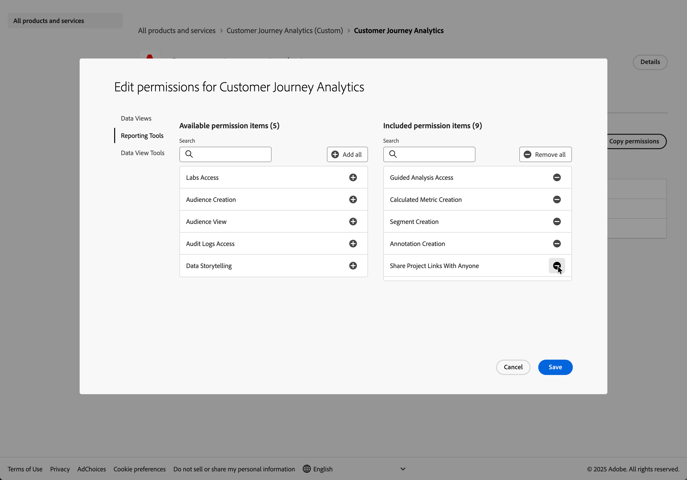

# Configuración independiente

>[!IMPORTANT]
>
>Esta guía de configuración es para clientes que tienen licencia del paquete independiente de Adobe Content Analytics. La guía supone que no ha utilizado ni planea utilizar Customer Journey Analytics ni ninguna otra aplicación de Experience Platform aparte de las funcionalidades y características de Content Analytics. Consulte [Configuración de Content Analytics](configuration.md) si desea configurar y utilizar Content Analytics como parte de una implementación de Customer Journey Analytics existente.
>

Content Analytics tiene licencia como producto independiente, pero la configuración se realiza en Experience Platform y Customer Journey Analytics. Estas plataformas proporcionan la infraestructura de recopilación y análisis de datos que Content Analytics requiere y utiliza. Esta guía proporciona todas las instrucciones específicas que necesita, incluso si es nuevo en Experience Platform y Customer Journey Analytics.

Antes de comenzar la configuración de Content Analytics independiente, debe:

* Obtenga información básica sobre los conceptos de análisis web, familiaridad con los sistemas de administración de etiquetas y conocimientos básicos de JavaScript.
* Planifique de 4 a 6 horas para la configuración inicial, además de tiempo adicional para probar y validar la configuración.

## Terminología

Esta guía utiliza varios términos técnicos, de Experience Platform y Customer Journey Analytics, con los que es posible que no esté familiarizado. A continuación se describen estos términos (con vínculos de referencia) en el contexto de Content Analytics:

| Término | Explicación |
|---|---|
| **Esquema** | Un [esquema](https://experienceleague.adobe.com/es/docs/experience-platform/xdm/schema/composition) es un conjunto de reglas que representan y validan la estructura y el formato de los datos. En un nivel superior, los esquemas proporcionan una definición abstracta de un objeto del mundo real, como un evento que se produce en un sitio web, como un clic. Y esboce qué datos deben incluirse en cada instancia de ese objeto. |
| **Conjunto de datos** | Un [conjunto de datos](https://experienceleague.adobe.com/es/docs/experience-platform/catalog/datasets/overview) es una construcción de almacenamiento y administración para una colección de datos, normalmente una tabla, que contiene un esquema (columnas) y campos (filas). Un conjunto de datos es como una tabla de base de datos en la que cada fila es un evento del sitio web. |
| **Flujo de datos** | Un [conjunto de datos](https://experienceleague.adobe.com/es/docs/experience-platform/datastreams/overview) representa la configuración del lado del servidor que enruta los datos de su sitio web al conjunto de datos correcto en Adobe Experience Platform. Un conjunto de datos actúa como una autopista de datos que conecta el sitio con el almacenamiento. |
| **Etiquetas** | [Las etiquetas](https://experienceleague.adobe.com/es/docs/experience-platform/tags/home) en Experience Platform son la próxima generación de funcionalidades de administración de etiquetas de Adobe. Las etiquetas ofrecen a los clientes una alternativa sencilla para implementar y gestionar las etiquetas de análisis, marketing y publicidad necesarias para potenciar las importantes experiencias del cliente. En Content Analytics, el sistema de administración de etiquetas de Adobe le permite implementar código de seguimiento en su sitio web sin tener que editar todas las páginas de forma similar. La funcionalidad Etiquetas es similar a la funcionalidad que podría conocer de Google Tag Manager. |
| **Zona protegida** | Experience Platform proporciona [zonas protegidas](https://experienceleague.adobe.com/es/docs/experience-platform/sandbox/home) que dividen una sola instancia de Experience Platform en entornos virtuales independientes para ayudar a desarrollar y evolucionar aplicaciones de experiencia digital. Content Analytics suele usar la zona protegida *Production*. |
| **Conexión** | [Conexiones](https://experienceleague.adobe.com/es/docs/analytics-platform/using/cja-connections/overview) definen qué conjuntos de datos de Experience Platform se incorporan. Las conexiones definen el vínculo entre el conjunto de datos (donde los datos se almacenan en AEP) y Customer Journey Analytics (donde los analiza). Una conexión hace que los datos recopilados estén disponibles para la creación de informes. |
| **Vista de datos** | Una [vista de datos](https://experienceleague.adobe.com/es/docs/analytics-platform/using/cja-dataviews/data-views) es un contenedor que le permite determinar cómo interpretar los datos de una conexión. Una vista de datos especifica todas las dimensiones y métricas sobre las que puede informar. Una vista de datos es como una configuración que determina las filas y columnas disponibles para su uso en el análisis. |
| **Analysis Workspace** | [Analysis Workspace](https://experienceleague.adobe.com/es/docs/analytics-platform/using/cja-workspace/home) es una interfaz de explorador de arrastrar y soltar que se usa para generar los informes y análisis de Content Analytics. |
| **Experiencia** | En Content Analytics, una [experiencia](https://experienceleague.adobe.com/es/docs/analytics-platform/using/content-analytics/content-analytics#terminology) hace referencia a todo el contenido de texto de una página web que se puede capturar y analizar en función de la dirección URL de la página. |
| **Recurso** | En Content Analytics, un [recurso](https://experienceleague.adobe.com/es/docs/analytics-platform/using/content-analytics/content-analytics#terminology) es un fragmento de contenido individual y único, como una imagen. |

## Resumen de configuración

Esta configuración le guiará en la configuración de todas las aplicaciones necesarias para tener una implementación de Content Analytics **independiente** en funcionamiento. Puede dividir la configuración en tres fases, en las que cada fase se basa en la anterior:

**Fase 1** - [Prepare su entorno](#prepare-your-environment). En esta fase, se configuran los permisos de usuario y se verifica la infraestructura de datos. Sin estos permisos y estructura de datos adecuados, no puede completar los pasos restantes. Estos son los pasos necesarios:

1. **Configure el control de acceso y los permisos** para admitir la configuración y la implementación de Content Analytics.
1. **Configure un esquema y un conjunto de datos** para definir el modelo (esquema) de los datos desde los que desea recopilar datos de análisis de contenido y dónde recopilarlos (conjunto de datos).

**Fase 2** - [Configurar la recopilación de datos](#configure-data-collection). En esta fase, se crea la canalización que captura los datos de contenido del sitio web. Por lo tanto, Content Analytics sabe qué contenido interactúan los visitantes con el contenido.

1. **Configure una secuencia de datos** para configurar cómo se enrutarán los datos recopilados al conjunto de datos.
1. **Use etiquetas de sitio web** para configurar reglas y elementos de datos con respecto a los datos de su capa de datos en el sitio web y para asegurarse de que los datos se envíen al conjunto de datos configurado.
1. **Implemente** en un entorno de prueba **y valide** la recopilación de datos antes de publicar en un entorno de producción.

**Fase 3** - [Configuración de informes](#set-up-reporting). En esta fase, ponga a disposición los datos recopilados para su análisis en los informes. Por lo tanto, puede obtener la información de rendimiento del contenido que desea obtener de Content Analytics.

1. **Configurar una conexión** a su conjunto de datos.
1. **Configure una vista de datos** para definir métricas y dimensiones.
1. **Configurar e implementar Content Analytics**.
1. **Configure un proyecto** para generar sus informes y visualizaciones de Content Analytics.

## Preparación del entorno

En esta fase, se configuran los permisos de usuario y se verifica la infraestructura de datos.

### Configuración del control de acceso y los permisos

Esta sección describe qué acceso necesita al producto, los perfiles del producto y los permisos necesarios para configurar Content Analytics independiente. Aunque solo le interesa la funcionalidad de Content Analytics, para que funcione correctamente, sigue necesitando acceso y permisos para otros productos de Experience Platform.

#### Control de acceso

El control de acceso determina si se le permite acceder a un producto de Experience Platform.

Necesita un administrador del sistema o de producto para agregarlo como administrador de un producto o un perfil de producto. Un administrador de productos solo puede agregarle como administrador del producto administrado (perfil), un administrador del sistema puede agregar administradores de productos a cualquier producto (perfil).

>[!BEGINSHADEBOX]

Vea  [Administrar usuarios para obtener un perfil de producto](https://video.tv.adobe.com/v/333860/?quality=12&learn=on){target="_blank"} para ver un vídeo de demostración.

>[!ENDSHADEBOX]

Debe ser administrador de productos de los siguientes productos y perfiles de producto para Content Analytics independiente:

* Adobe Experience Platform
   * AEP-Default-All-Users (el perfil predeterminado para acceder a la zona protegida de producción)

* Recopilación de datos de Adobe Experience Platform
   * Acceso a todos los registros de recopilación de datos predeterminados

* Adobe Experience Platform Privacy Service

* Customer Journey Analytics (personalizado)
   * Customer Journey Analytics (o cualquier otro perfil de producto aprovisionado de forma predeterminada)

Puede definir el acceso de administrador de productos mediante Admin Console:

1. Acceder a [Admin Console](https://adminconsole.adobe.com).
1. Seleccione **[!UICONTROL Productos]**.
1. Seleccione el producto específico.
1. Seleccione la ficha **[!UICONTROL Administradores]**.
1. Seleccione **[!UICONTROL Agregar administrador]** para agregar un administrador al producto.
1. Escriba uno o más nombres de correo electrónico o de usuario en el cuadro de diálogo **[!UICONTROL Agregar administradores de productos]**. Seleccione **[!UICONTROL Guardar]** para guardar.

El acceso al administrador de perfiles de producto se define a través de Admin Console:

1. Acceder a [Admin Console](https://adminconsole.adobe.com).
1. Seleccione **[!UICONTROL Productos]**.
1. Seleccione el producto específico. Asegúrese de que ya tiene acceso de administrador de productos.
1. Seleccione **[!UICONTROL perfiles de producto]**.
1. Seleccione el perfil de producto específico.
1. Seleccione la ficha **[!UICONTROL Administradores]**.
1. Seleccione **[!UICONTROL Agregar administrador]** para agregar un administrador al perfil del producto.
1. Escriba uno o más nombres de correo electrónico o de usuario en el cuadro de diálogo **[!UICONTROL Agregar administradores de perfil de producto]**. Seleccione **[!UICONTROL Guardar]** para guardar.

#### Permisos

Los permisos definen lo que puede hacer dentro de un producto una vez que tenga acceso a él.

Usted define permisos para Experience Platform en la interfaz [!UICONTROL Permissions] y utiliza el control de acceso basado en atributos. Para Customer Journey Analytics, puede definir permisos a través de [!UICONTROL Admin Console].

##### Experience Platform

La interfaz [!UICONTROL Permissions] de Experience Platform se basa en la definición de un rol. Una función es una colección de permisos basados en recursos. En un nuevo entorno aprovisionado, hay dos funciones predeterminadas disponibles: **[!UICONTROL Acceso predeterminado a todo tipo de producción]** y **[!UICONTROL Administradores de espacio aislado]**.

Para Content Analytics, debe comprobar si los siguientes recursos y permisos asociados se agregan a estas funciones:

* Rol predeterminado de acceso a todas las producciones

   * Recopilación de datos
      * Ver secuencias de datos
      * Administrar secuencias de datos

   * Administración de datos
      * Ver conjuntos de datos
      * Administrar conjuntos de datos

   * Modelado de datos
      * Esquemas de vistas
      * Administrar esquemas
      * Administrar metadatos de identidad

* Función Administradores de zona protegida

   * Zonas protegidas
      * Prod
      * (cualquier otra zona protegida que desee utilizar para Content Analytics)

   * Administración de zona protegida
      * Administrar paquetes
      * Administrar zonas protegidas
      * Restablecer espacio aislado
      * Ver espacio aislado

En la interfaz Permisos puede comprobar tanto las funciones como los permisos asociados. Y qué usuarios pertenecen a la función.

1. Acceda a Experience Platform para su organización.
1. En la pantalla de bienvenida, en **[!UICONTROL Acceso rápido]**, seleccione **[!UICONTROL Ver todo]**.
1. Habilita el pin  para **[!UICONTROL Permisos]**, de modo que **[!UICONTROL Permisos]** estará disponible en **[!UICONTROL Acceso rápido]** para uso futuro.
1. Seleccione **[!UICONTROL Permisos]**.
1. Seleccione  **[!UICONTROL Roles]**.
1. Seleccione la función específica que desea comprobar (por ejemplo, **[!UICONTROL Acceso predeterminado a todos los equipos de producción]**). Seleccione **[!UICONTROL Ver todos]** para ver todos los permisos.
1. En la pantalla **[!UICONTROL Detalles]**:
   1. Compruebe los **[!UICONTROL recursos]** enumerados en **[!UICONTROL Permisos]**.
   1. Compruebe los nombres de las zonas protegidas en **[!UICONTROL Zonas protegidas]**.

   Para hacer cualquier actualización, selecciona  **[!UICONTROL Editar]**.
   1. Para agregar un recurso que falta, selecciona **[!UICONTROL Nombre del recurso]**  del carril izquierdo de **[!UICONTROL Recursos]** > **[!UICONTROL Adobe Experience Platform]**.
   1. Para agregar un permiso que falta, seleccione  en el recurso al que le falta el permiso en el panel principal y seleccione el permiso que falta.

      

   Seleccione **[!UICONTROL Guardar]** para guardar cualquier actualización.

1. En la pantalla Usuarios o Grupos de usuarios:
   1. Compruebe que los usuarios individuales o grupos de usuarios adecuados forman parte de esta función.
      1. Seleccione  Agregar usuarios a usuarios para agregar usuarios individuales que haya definido en Admin Console.
      1. Seleccione  Agregar grupos en grupos de usuarios para agregar los grupos de usuarios que haya definido en Admin Console.

##### Customer Journey Analytics

Customer Journey Analytics no admite el control de acceso basado en atributos. Para especificar permisos, utilice Admin Console.

Para Content Analytics, debe comprobar si se incluyen los siguientes permisos de perfil de producto de Customer Journey Analytics:

* Vistas de datos
   * Todas las vistas de datos disponibles.

* Herramientas de informes
   * ¿Acceso guiado a análisis?
   * Creación de métricas calculadas
   * Creación de segmentos
   * ¿Acceso a Labs?
   * Creación de anotación
   * Creación de audiencias?
   * ¿Vista de audiencia?
   * Acceso a registros de auditoría
   * Uso compartido de vínculos del proyecto con cualquier persona
   * Previsión
   * Asistente de IA: conocimiento del producto
   * Data Insights Agent
   * Pies de ilustración inteligentes
   * ¿Contar datos?

* Herramientas de vista de datos
   * ¿Exportación de tabla completa?
   * ¿Extensión de CJA BI?

Para comprobar y actualizar estos permisos para Customer Journey Analytics:

1. Acceder a [Admin Console](https://adminconsole.adobe.com).
1. Seleccione **[!UICONTROL Productos]**.
1. Seleccione el producto **[!UICONTROL Customer Journey Analytics]**.
1. Seleccione **[!UICONTROL perfiles de producto]**.
1. Seleccione el perfil de producto aprovisionado predeterminado que está disponible para Customer Journey Analytics. Por ejemplo: **[!UICONTROL Customer Journey Analytics]**.
1. En la pantalla del perfil de producto, seleccione **[!UICONTROL Permisos]**.
1. Seleccione cualquiera de los botones  para editar los permisos. En el diálogo **[!UICONTROL Editar permisos para Customer Journey Analytics]**:

   

   1. Seleccione **[!UICONTROL Vistas de datos]** y habilite **[!UICONTROL Inclusión automática: Activado]**. Esta opción garantiza que todas las vistas de datos formen parte automáticamente de **[!UICONTROL Elementos de permiso incluidos]**.
   1. Seleccione **[!UICONTROL Herramientas de informes]** y asegúrese de que todos los permisos enumerados arriba formen parte de **[!UICONTROL Elementos de permisos incluidos]**.
   1. Seleccione **[!UICONTROL Herramientas de vista de datos]** y asegúrese de que todos los permisos enumerados arriba formen parte de **[!UICONTROL Elementos de permisos incluidos]**.

   Seleccione **[!UICONTROL Guardar]**.

### Configurar esquema y conjunto de datos

Para recopilar datos de su sitio web, sujetos a las perspectivas de Content Analytics, primero debe definir qué tipo de datos desea recopilar. Y también cómo se almacenan esos datos. Ambos conceptos se explican en [Configuración de un esquema y un conjunto de datos](/help/data-ingestion/aepwebsdk.md#set-up-a-schema-and-dataset) en la guía de inicio rápido [Ingesta de datos mediante Adobe Experience Platform Web SDK](/help/data-ingestion/aepwebsdk.md).

## Configuración de la recopilación de datos

En esta fase se crea la canalización que captura los datos de contenido del sitio web.

### Configurar una secuencia de datos

Ha definido qué datos recopilar y cómo almacenar esos datos. El siguiente paso es garantizar que los datos recopilados de su sitio web se enruten al conjunto de datos. Necesita configurar un conjunto de datos, como se explica en [Configurar un conjunto de datos](/help/data-ingestion/aepwebsdk.md#set-up-a-datastream) en la guía de inicio rápido de [Ingesta de datos mediante Adobe Experience Platform Web SDK](/help/data-ingestion/aepwebsdk.md).

### Usar etiquetas

Ha definido qué datos recopilar (esquema), cómo almacenar esos datos (conjunto de datos) y cómo se enrutan los datos recopilados del sitio web al conjunto de datos (conjunto de datos). Como paso siguiente, debe etiquetar el sitio web para configurar reglas y elementos de datos con los datos de la capa de datos del sitio web. El etiquetado del sitio web garantiza que los datos se envíen al conjunto de datos configurado. El etiquetado de su sitio web con la ayuda de las etiquetas se explica en [Usar etiquetas](/help/data-ingestion/aepwebsdk.md#use-tags) en la guía de inicio rápido de [Ingesta de datos mediante Adobe Experience Platform Web SDK](/help/data-ingestion/aepwebsdk.md).

### Implementar y validar

Ahora puede implementar el código en la versión de desarrollo de su sitio web dentro de la etiqueta `<head>`. Cuando se implementa, el sitio web comienza a recopilar datos en Adobe Experience Platform. Estos datos están sujetos a Content Analytics.

Valide la implementación, corríjala donde sea necesario y, una vez correcta, impleméntelo en el entorno de ensayo y producción mediante la función de flujo de trabajo de publicación de Etiquetas

## Configuración de informes

En esta fase se ponen a disposición los datos recopilados para su análisis en los informes.

### Configuración de una conexión con el conjunto de datos

Para informar sobre los datos recopilados y configurarlos para Content Analytics, debe configurar una conexión en Customer Journey Analytics. La conexión se conecta al conjunto de datos que contiene los datos recopilados. La forma de configurar una conexión se explica en [Configurar una conexión](../../data-ingestion/aepwebsdk.md#set-up-a-connection) en la guía de inicio rápido de [Ingesta de datos mediante Adobe Experience Platform Web SDK](/help/data-ingestion/aepwebsdk.md).

### Configurar una vista de datos

El paso final para configurar Content Analytics es definir una vista de datos. Una vista de datos es un contenedor específico de Customer Journey Analytics que le permite determinar cómo interpretar los datos de una conexión. Una vista de datos permite definir métricas y dimensiones a partir de los datos de uno o varios conjuntos de datos a los que está conectado Customer Journey Analytics. La configuración de una vista de datos se explica en [Configuración de una vista de datos](/help/data-ingestion/aepwebsdk.md#set-up-a-data-view) en la guía de inicio rápido de [Ingesta de datos mediante Adobe Experience Platform Web SDK](/help/data-ingestion/aepwebsdk.md).

### Configuración de Content Analytics

Ahora tiene todo lo necesario para configurar Content Analytics.

#### Configuración guiada

Use el [asistente de configuración guiada](guided.md) y seleccione la vista de datos que creó como parte del paso [Configurar una vista de datos](#set-up-a-data-view). Esta selección garantiza que Content Analytics se configure e implemente sobre los datos que recopile de su sitio web.

Tenga en cuenta que el asistente de configuración guiada configura los siguientes objetos específicos de Content Analytics adicionales:

* **Conjunto de datos**, que se configura automáticamente para los eventos de Content Analytics. Este conjunto de datos utiliza un esquema de Content Analytics específico que ya se ha creado y está disponible.
* **Flujo de datos**, que se configura automáticamente para transmitir eventos de Content Analytics al conjunto de datos de Content Analytics.
* **Propiedad de etiquetas**, que se configura automáticamente y con la extensión de Content Analytics. Esta propiedad Etiquetas garantiza que el sitio web envíe datos de Content Analytics a la secuencia de datos de Content Analytics y al conjunto de datos de Content Analytics.

  >[!IMPORTANT]
  >
  >Asegúrese de seleccionar la opción para crear una propiedad Nuevas etiquetas como parte del paso [Recopilación de datos](guided.md#new-configuration-1) del asistente.
  >

#### Configuración manual

Para implementar Content Analytics para su sitio web, debe publicar la propiedad Etiquetas de Content Analytics [manualmente](manual.md).

### Configurar un proyecto

Configure un proyecto en Customer Journey Analytics para generar [informes y visualizaciones de Content Analytics](/help/content-analytics/report/report.md). También puede usar una [plantilla de Content Analytics](/help/content-analytics/report/report.md#template) para comenzar.
