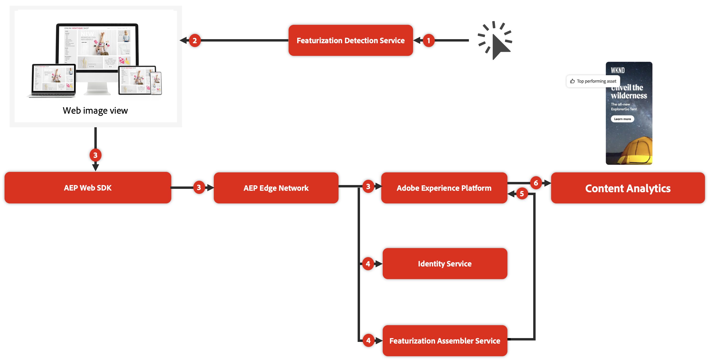

# Resumen de análisis de contenido

<!-- 
This is a placeholder article for upcoming Content Analytics documentation. Currently used to set up contextual help entries for developer working on onboarding UI and workspace UI 
-->

>[!WARNING]
>
>Este artículo es una versión preliminar no oficial del borrador de una próxima versión final y forma parte de la documentación de Análisis de contenido. Todo el contenido está sujeto a cambios y no se puede derivar ninguna obligación legal de la versión actual de este artículo.
>

{#release-limited-testing}

El análisis de contenido ayuda a los especialistas en marketing a comprender cómo afecta el contenido a los indicadores de rendimiento clave que ha definido una empresa. Además de las funcionalidades tradicionales basadas en micronivel para probar fragmentos de contenido (por ejemplo, pruebas A/B), Content Analytics proporciona perspectivas sobre cómo el contenido está impulsando el impacto a nivel macro. Por ejemplo, ¿responden mejor los clientes a un tono de voz específico, a un pallet de color específico o a temas específicos?

El análisis de contenido usa una IA y un servicio de aprendizaje automático basado en **funciones** para desglosar el contenido en componentes y atributos. Al crear un perfil de metadatos estructurado en todo el contenido, puede analizar qué contenido y qué atributos de ese contenido generan resultados empresariales.

Además de la creación de este perfil de metadatos estructurado, Content Analytics proporciona un **servicio de identidad** que identifica los recursos y las experiencias mediante un único identificador. El servicio de identidad sabe si un recurso, por ejemplo, se ha cambiado de tamaño, se ha recortado o se ha guardado en un formato de archivo diferente. El servicio asigna todas las variaciones de ese recurso al mismo identificador único. Como resultado, el servicio de identidad le permite agregar el rendimiento de un recurso en función de sus distintos formularios y ubicaciones.

## Valor

El análisis de contenido proporciona valor en un nivel creciente:

1. Contenido **uso**: con el análisis de contenido obtiene información sobre qué recursos reciben impresiones y dónde reciben los recursos. Estas perspectivas le ayudan a ver si los recursos se infrautilizan o se utilizan en exceso en las propiedades web.
1. **participaciones** de contenido: los análisis de contenido pueden proporcionar perspectivas de participación, como la tasa promedio de clics entre recursos con determinados atributos. Estas perspectivas le ayudan a determinar si tipos específicos de experiencias siguen siendo eficaces.
1. Contenido **recorridos**: además, cuando se combinan con todos los demás datos disponibles en Experience Platform, puede obtener información adicional sobre sus recorridos de contenido. Por ejemplo, si un contenido específico genera conversiones, además de la participación. Y con ese conocimiento puedes determinar el ROI de los tipos de contenido.
1. Contenido **personalizado**: en última instancia, el análisis de contenido le permite actuar según sus perspectivas y utilizar estas perspectivas para determinar cómo gastar dinero en contenido. Por ejemplo, ¿debo enviar tipos de contenido específicos a audiencias específicas? ¿Qué contenido me ofrece oportunidades de alta personalización?

## Terminología

El análisis de contenido utiliza los siguientes términos clave:

* **Experiencia**: Una experiencia es texto en una página web que se puede reproducir usando la URL usada por el usuario inicial que visitó esa página web. Cada experiencia obtiene un identificador único.
* **Recurso**: un recurso es un fragmento de contenido individual y único, como una imagen. Cada recurso también obtiene un identificador único.
* **Atributo**: un atributo es un elemento de metadatos descriptivo asociado a una experiencia o recurso. Algunos ejemplos de un atributo son: estilo de fotografía, legibilidad, estrategia de persuasión, color de objeto, color de fondo.

## Funcionamiento

El análisis de contenido utiliza datos de vista de imágenes web recopilados en conjuntos de datos de evento en Experience Platform. Estos datos se pueden recopilar mediante los distintos métodos disponibles: Edge Network de Experience Platform (Web SDK, API de servidor) o conector de origen de Analytics.

1. La parte de detección del servicio de funcionalidad se activa ante cualquier nueva instantánea de datos que llegue a un conjunto de datos de evento de análisis de contenido habilitado.
1. El servicio de detección de funcionalidades determina qué datos de esa instantánea son relevantes para el análisis de contenido y vuelve a visitar la experiencia y los recursos de estas vistas de imágenes web.
1. Tras la visita, se recopilan datos específicos de análisis de contenido mediante una configuración adecuada de Experience Platform Web SDK y de Experience Platform Edge Network. Y luego los datos se envían a un conjunto de datos de análisis de contenido dedicado y a conjuntos de datos de búsqueda relevantes.
1. El servicio de ensamblador de funciones y el servicio de identidad procesan los datos visitados.
1. Los resultados de estos servicios (componentes, atributos e identidades) se utilizan para actualizar los conjuntos de datos específicos de análisis de contenido relevantes en Experience Platform.
1. Los datos de análisis de contenido, junto con los datos de comportamiento y otros conjuntos de datos de búsqueda, se pueden utilizar en una configuración de Customer Journey Analytics (Conexión, Vista de datos y Workspace). Esa configuración proporciona la base para las perspectivas únicas a nivel de macro sobre el contenido.

>[!MORELIKETHIS]
>
>[Informes de análisis de contenido](report/report.md)
>[Configurar análisis de contenido](config/configuration.md)
