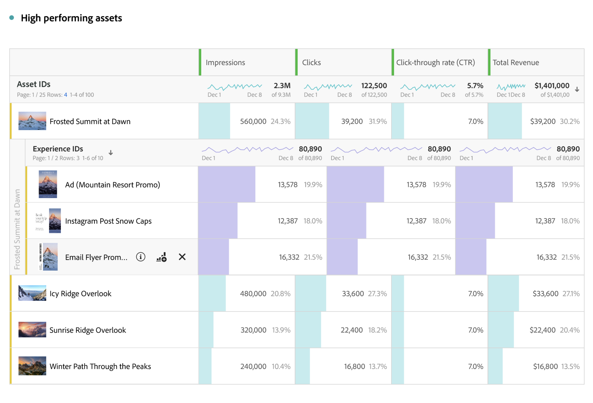
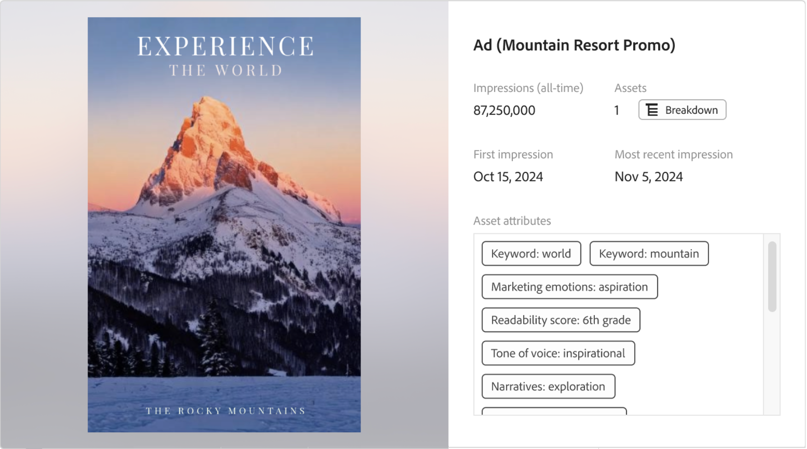

# Información general sobre creación de informes de Content Analytics

Realiza informes, realiza análisis y obtiene información sobre Content Analytics en [Analysis Workspace](/help/analysis-workspace/home.md). Hay disponible una [plantilla](#template) de Workspace específica para que pueda acceder inmediatamente a un proyecto de Workspace previamente completado con información de contenido relevante.

Para empezar a crear informes en Content Analytics desde cero, haga lo siguiente:

1. [Cree un nuevo proyecto](/help/analysis-workspace/build-workspace-project/create-projects.md) o [abra un proyecto existente](/help/analysis-workspace/build-workspace-project/open-projects.md) en Workspace.
1. Asegúrese de [seleccionar una vista de datos](/help/analysis-workspace/c-panels/panels.md#data-view) para la creación de informes de Content Analytics. La creación de informes de Content Analytics solo está disponibles para las vistas de datos [configuradas](/help/content-analytics/config/configuration.md).
1. Arrastre una visualización  [Tabla de forma libre](/help/analysis-workspace/visualizations/freeform-table/freeform-table.md) al lienzo.
1. Utilice [componentes específicos de Content Analytics](components.md) y otros [componentes](/help/components/overview.md) genéricos (como segmentos, intervalos de fechas y anotaciones) para crear sus análisis de Content Analytics.

## Miniaturas

En función de las dimensiones específicas de Content Analytics que utilice en el proyecto, se muestran miniaturas para los recursos y las dimensiones.

De forma predeterminada, se muestran las miniaturas de las dimensiones relevantes de Content Analytics. Para configurar la visualización de miniaturas para una dimensión de Content Analytics:

* Pase el puntero por encima de una fila de encabezado para la dimensión de Content Analytics. Por ejemplo, **[!UICONTROL ID de recurso]** o **[!UICONTROL ID de experiencia]**.
* Seleccione .
* En la ventana emergente **[!UICONTROL Configuración de fila]**, debajo de **[!UICONTROL Configuración]**, marque o desmarque **[!UICONTROL Mostrar miniaturas]**.

## Previsualizaciones

Para las filas de una dimensión de Content Analytics con miniaturas, puede abrir una ventana emergente de vista previa.

Para abrir la vista previa con los siguientes detalles:

* Seleccione . Verá los siguientes detalles.

  | Vista previa de la experiencia | Vista previa de recurso |
  |---|---|
  |  |  |
  | Nombre de la dimensión (por ejemplo, **[!UICONTROL Experience ID])** | Nombre de la dimensión del recurso (por ejemplo, **[!UICONTROL ID del recurso])** |
  | **[!UICONTROL Impresiones (todo el tiempo)]**: Número de impresiones de la experiencia. | **[!UICONTROL Impresiones (todas las veces)]**: número de impresiones del recurso. |
  | **[!UICONTROL Recursos]**: número de recursos que contiene esta experiencia.  Seleccione  **[!UICONTROL Desglose]** para inspeccionar los recursos. | **[!UICONTROL Experiencias]**: Número de experiencias en las que se muestra este recurso.  Seleccione  **[!UICONTROL Desglose]** para inspeccionar los recursos. |
  | **[!UICONTROL Primera impresión]**: Fecha de la primera impresión de la experiencia. | **[!UICONTROL Primera impresión]**: Fecha de la primera impresión del recurso. |
  | **[!UICONTROL impresión más reciente]**: Fecha de la impresión más reciente de la experiencia. | **[!UICONTROL Impresión más reciente]**: Fecha de la impresión más reciente del recurso. |
  | **[!UICONTROL Atributos de experiencia]**: Los [atributos](/help/content-analytics/report/components.md#experience-attributes) de la experiencia. | **[!UICONTROL Atributos del recurso]**: Los [atributos](/help/content-analytics/report/components.md#asset-attributes) del recurso. |

## Plantilla

Hay disponible una [plantilla](/help/analysis-workspace/templates/use-templates.md) de análisis de contenido para ayudarle a saber qué contenido y atributos de contenido tienen el mejor rendimiento. La plantilla forma parte del [caso de uso del canal Web y la participación](/help/analysis-workspace/templates/use-templates.md#web-engagement), y detalla el rendimiento del contenido a nivel granular. Puede examinar el rendimiento de recursos individuales o atributos específicos.

En función de lo que aprenda, podría hacer varias cosas. Como promocionar recursos de alto rendimiento en su página de inicio, personalizar el contenido para segmentos específicos para incluir atributos de alto rendimiento o rotar el contenido que ha empezado a quedar obsoleto.

Para utilizar la plantilla:

1. Seleccione **[!UICONTROL Workspace]** en el menú principal.
1. Asegúrese de que ha seleccionado una vista de datos configurada para Content Analytics.
1. Busque o utilice segmentos (**[!UICONTROL web]** para **[!UICONTROL canal]** e **[!UICONTROL interacción]** para **[!UICONTROL casos de uso]**) para buscar y seleccionar la plantilla de **[!UICONTROL Content Analytics]**.
1. Seleccione **[!UICONTROL Usar plantilla]**.
1. En el cuadro de diálogo **[!UICONTROL Configurar la plantilla]**, seleccione una métrica del cuadro de diálogo **[!UICONTROL Seleccionar una métrica de conversión]**. Por ejemplo, **[!UICONTROL CTR del recurso]**.
1. Seleccione **[!UICONTROL Continuar]**.

Se abre un proyecto de **[!UICONTROL Información general de Content Analytics]** en [Analysis Workspace](/help/analysis-workspace/home.md). El proyecto consta de cuatro [paneles](/help/analysis-workspace/c-panels/panels.md), donde cada panel proporciona [tablas de forma libre](/help/analysis-workspace/visualizations/freeform-table/freeform-table.md) y [visualizaciones](/help/analysis-workspace/visualizations/freeform-analysis-visualizations.md) para responder a una pregunta específica:

* **¿Qué contenido funciona mejor?**
Este panel le ayuda a comprender qué experiencias y qué recursos de esas experiencias impulsan la participación y la conversión. Las experiencias son una página web completa que se captura en un momento específico. Una experiencia puede contener texto y varios recursos de imagen individuales. Un recurso es una imagen individual.

  El panel consta de las siguientes visualizaciones:

   * **Experiencias**.

     >[!NOTE]
     >
     >Estas visualizaciones solo se muestran si tiene [experiencias incluidas](/help/content-analytics/config/guided.md#experience-capture-and-definition) en la configuración de Content Analytics.
     > 

      * **Experience CTR**: una visualización de [cambio de resumen](/help/analysis-workspace/visualizations/summary-number-change.md) que muestra Experience CTR.
      * **Experiencias de conversión principales**: Una visualización de [barra horizontal](/help/analysis-workspace/visualizations/horizontal-bar.md) que muestra las experiencias de conversión principales en función de la métrica de conversión seleccionada.
      * **Experiencias de mejor rendimiento**: Una [tabla de forma libre](/help/analysis-workspace/visualizations/freeform-table/freeform-table.md) (que incluye [miniaturas](#thumbnails) y [vistas previas](#previews)) para las experiencias de mejor rendimiento.

   * **Recursos**

      * **Recurso CTR**
Una visualización de [cambio de resumen](/help/analysis-workspace/visualizations/summary-number-change.md) que muestra Asset CTR.
      * **Recursos que más se convierten**
Una visualización de [barra horizontal](/help/analysis-workspace/visualizations/horizontal-bar.md) que muestra los recursos de conversión principales en función de la métrica de conversión seleccionada.
      * **Recursos de mayor rendimiento**
Una [tabla de forma libre](/help/analysis-workspace/visualizations/freeform-table/freeform-table.md) (que incluye [miniaturas](#thumbnails) y [vistas previas](#previews)) para los recursos de mayor rendimiento.
      * **Recursos: vistas frente a conversión.**
Una visualización de [diagrama de dispersión](/help/analysis-workspace/visualizations/scatterplot.md) que muestra un diagrama de dispersión de vistas de recursos en comparación con las conversiones de recursos.

* **¿Qué atributos del recurso contribuyen a las conversiones?**
Content Analytics utiliza IA y GenAI para asignar automáticamente los metadatos de cada recurso, como temas, escenas, colores de primer plano, etc. Un atributo es una etiqueta de metadatos asignada por IA que describe lo que hay en un recurso o experiencia. Por ejemplo: <code>color de primer plano: rojo</code> es un atributo asignado automáticamente. Las visualizaciones le ayudan a identificar qué atributos de sus recursos contribuyen en mayor medida a la conversión.

  El panel consta de las siguientes visualizaciones:

   * **Atributos de recurso de conversión principales**
Una [barra horizontal](/help/analysis-workspace/visualizations/horizontal-bar.md) que muestra los atributos de recursos que más se convierten en función de la métrica de conversión seleccionada.
   * **Atributos de recursos de conversión principales en comparación con los 30 días anteriores**
Una visualización de [barra horizontal](/help/analysis-workspace/visualizations/horizontal-bar.md) que muestra los principales atributos de recursos que se han convertido, en comparación con los 30 días anteriores, según la métrica de conversión seleccionada.
   * **Datos de atributo de recursos de conversión principales**
Una [tabla de forma libre](/help/analysis-workspace/visualizations/freeform-table/freeform-table.md) que muestra los atributos de conversión principales en función de la métrica de conversión seleccionada. Seleccione una fila de la tabla para actualizar la visualización de tendencias de atributo.
   * **Tendencia de atributo**
Una visualización de [línea](/help/analysis-workspace/visualizations/line.md) que muestra la tendencia de atributos para el atributo de recursos de conversión principal seleccionado.
   * **Color de primer plano del recurso**
Un ejemplo de [tabla de forma libre](/help/analysis-workspace/visualizations/freeform-table/freeform-table.md) que compara el rendimiento de elementos de una sola categoría de atributos de recursos: Colores de primer plano. Puede reemplazar este atributo de recurso con otras dimensiones de categoría de atributos de recurso.

* **¿Qué atributos de la experiencia contribuyen a la conversión?**

  >[!NOTE]
  >
  >Este panel solo se muestra si tiene [experiencias incluidas](/help/content-analytics/config/guided.md#experience-capture-and-definition) en la configuración de Content Analytics.
  > 

  Aunque los atributos de recursos se centran en las cualidades visuales de las imágenes, los atributos de experiencias se centran en el texto de la página. Las visualizaciones siguientes le permiten explorar qué atributos de experiencia contribuyen a la conversión. Estos atributos también se asignan automáticamente mediante modelos de IA y GenAI.

  El panel consta de las siguientes visualizaciones:

   * **Atributos de experiencia de conversión principales**
Una visualización de [barra horizontal](/help/analysis-workspace/visualizations/horizontal-bar.md) que muestra los principales atributos de experiencia de conversión en función de la métrica de conversión seleccionada.
   * **Atributos de experiencia de conversión principales frente a los 30 días anteriores**
Una visualización de [barra horizontal](/help/analysis-workspace/visualizations/horizontal-bar.md) que muestra los principales atributos de experiencia de conversión, en comparación con los 30 días anteriores, en función de la métrica de conversión seleccionada.
   * **Datos de atributos de experiencia de conversión principales**
Una [tabla de forma libre](/help/analysis-workspace/visualizations/freeform-table/freeform-table.md) que muestra las experiencias de conversión principales en función de la métrica de conversión seleccionada. Seleccione una fila de la tabla para actualizar la visualización de Línea.
   * **Línea**
Una visualización de [línea](/help/analysis-workspace/visualizations/line.md) que muestra la tendencia del atributo de experiencia de conversión superior seleccionado.
   * **Palabras clave de experiencia**
Una [tabla de forma libre](/help/analysis-workspace/visualizations/freeform-table/freeform-table.md) que muestra las palabras clave de experiencia principales en función de la métrica de conversión seleccionada.

* **¿Dónde aparecen los recursos en mi sitio?**
Panel que consta de una tabla de forma libre que detalla dónde aparecen los recursos más vistos en el sitio.

  El panel consta de una visualización:

   * **¿Dónde aparecen los recursos más vistos?**
Puede desglosar cualquier recurso por dimensiones para comprender mejor dónde aparece esa imagen.

     En el ejemplo [tabla de forma libre](/help/analysis-workspace/visualizations/freeform-table/freeform-table.md) (incluidas [miniaturas](#thumbnails) y [vistas previas](#previews)), se usa **[!UICONTROL ID de percepción de recurso]** en lugar de [!UICONTROL ID de recurso]. A veces, la misma imagen se puede duplicar en el sitio con una dirección URL de imagen diferente. El atributo [!UICONTROL ID de percepción del recurso] ayuda a agrupar estos duplicados en un único ID.

     Dado que los recursos pueden cambiar en una página, cada recurso se desglosa en **[!UICONTROL ID de experiencia]** para identificar en qué versión de esa página apareció el recurso. Puede reemplazar [!UICONTROL ID de experiencia] por otras dimensiones que le ayuden a comprender la ubicación de un recurso en su sitio. Por ejemplo: [!UICONTROL Nombre de página], [!UICONTROL URL de página] o [!UICONTROL Sección del sitio].

     También puede intercambiar [!UICONTROL ID de percepción de recursos] por [!UICONTROL ID de recursos] para obtener un registro de dónde se hace referencia a las URL de imágenes específicas.

>[!MORELIKETHIS]
>
>[Componentes de Content Analytics](components.md)
>[Uso de plantillas](/help/analysis-workspace/templates/use-templates.md#web-engagement)
>
