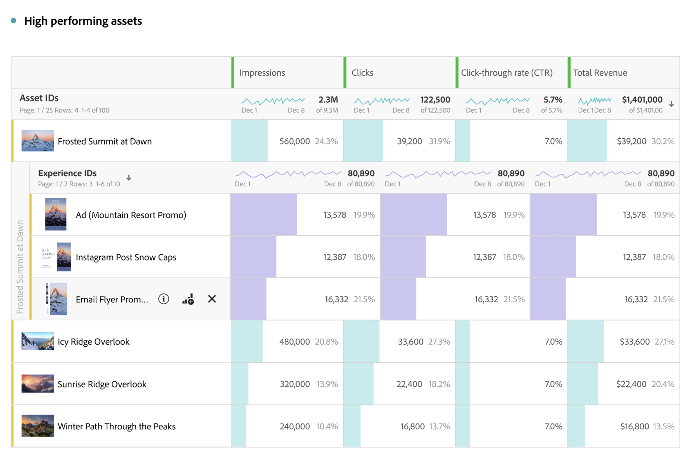

# Información general sobre creación de informes de Content Analytics

Realiza informes, realiza análisis y obtiene información sobre [!DNL Content Analytics] en [Analysis Workspace](/help/analysis-workspace/home.md). Hay disponible una [plantilla](#template) de Workspace específica para que pueda acceder inmediatamente a un proyecto de Workspace previamente completado con información de contenido relevante.

Para crear su propio informe de Content Analytics desde cero, siga estos pasos:

1. Cree un [nuevo proyecto](/help/analysis-workspace/build-workspace-project/create-projects.md) o abra un [proyecto existente](/help/analysis-workspace/build-workspace-project/open-projects.md) en Workspace.
1. Asegúrese de [seleccionar una vista de datos](/help/analysis-workspace/c-panels/panels.md#data-view) para la creación de informes de Content Analytics. La creación de informes de Content Analytics solo está disponibles para las vistas de datos [configuradas](/help/content-analytics/config/configuration.md).
1. Arrastre una visualización  [Tabla de forma libre](/help/analysis-workspace/visualizations/freeform-table/freeform-table.md) al lienzo.
1. Utilice [componentes específicos de Content Analytics](components.md) y otros [componentes](/help/components/overview.md) genéricos (como segmentos, intervalos de fechas y anotaciones) para crear sus análisis de Content Analytics.
1. Use otras [visualizaciones](/help/analysis-workspace/visualizations/freeform-analysis-visualizations.md) para mejorar su proyecto.

## Miniaturas

En función de las dimensiones específicas de Content Analytics que utilice en el proyecto, las miniaturas se muestran en las siguientes visualizaciones:

### Tabla de forma libre

De manera predeterminada, las miniaturas se muestran en [tabla de forma libre](/help/analysis-workspace/visualizations/freeform-table/freeform-table.md). Para configurar la visualización de miniaturas para una dimensión de Content Analytics:

* Pase el puntero por encima de una fila de encabezado para la dimensión de Content Analytics. Por ejemplo, **[!UICONTROL ID de recurso]** o **[!UICONTROL ID de experiencia]**.
* Seleccione .
* En la ventana emergente **[!UICONTROL Configuración de fila]**, debajo de **[!UICONTROL Configuración]**, marque o desmarque **[!UICONTROL Mostrar miniaturas]**.

### Barra (apilada) y barra horizontal (apilada)

Las miniaturas se muestran como parte de la leyenda en el eje vertical u horizontal. Las miniaturas también se muestran cuando pasa el ratón sobre una barra de [barras (apiladas)](/help/analysis-workspace/visualizations/bar.md) y [barras horizontales (apiladas)](/help/analysis-workspace/visualizations/horizontal-bar.md).

### Disperso

Las miniaturas se muestran cuando pasa el ratón sobre un punto de datos en [dispersión](/help/analysis-workspace/visualizations/scatterplot.md).

### Líneas

{{release-limited-testing-section}}

Las miniaturas se muestran cuando pasa el ratón sobre un punto de datos de [línea](/help/analysis-workspace/visualizations/line.md).

## Previsualizaciones

>[!AVAILABILITY]
>
>Las visualizaciones de barras y dispersión descritas en esta sección se encuentran en Prueba limitada y es posible que no estén disponibles en su entorno. Esta nota se elimina cuando la funcionalidad está disponible de forma general. Para obtener información sobre el proceso de lanzamiento de Customer Journey Analytics, consulte [Lanzamientos de funcionalidades de Customer Journey Analytics](/help/release-notes/releases.md).
>

Puede abrir una ventana emergente de vista previa. Para ello, haga lo siguiente:

* Seleccione  en una [tabla de forma libre](#freeform-table).
* Seleccione una barra específica en una visualización de [bar](#bar-and-horizontal-bar) o [barra horizontal](#bar-and-horizontal-bar), o un punto de datos en una visualización de [dispersión](#scatter).

Verá los siguientes detalles.

| Vista previa de la experiencia | Vista previa de recurso |
|---|---|
|  |  |
| Nombre de la dimensión (por ejemplo, **[!UICONTROL Experience ID])** | Nombre de la dimensión del recurso (por ejemplo, **[!UICONTROL ID del recurso])** |
| **[!UICONTROL Impresiones (todo el tiempo)]**: Número de impresiones de la experiencia. | **[!UICONTROL Impresiones (todas las veces)]**: número de impresiones del recurso. |
| **[!UICONTROL Recursos]**: número de recursos que contiene esta experiencia.  Seleccione  **[!UICONTROL Desglose]** para inspeccionar los recursos. | **[!UICONTROL Experiencias]**: Número de experiencias en las que se muestra este recurso.  Seleccione  **[!UICONTROL Desglose]** para inspeccionar los recursos. |
| **[!UICONTROL Primera impresión]**: Fecha de la primera impresión de la experiencia. | **[!UICONTROL Primera impresión]**: Fecha de la primera impresión del recurso. |
| **[!UICONTROL Impresión más reciente]**: Fecha de la impresión más reciente de la experiencia. | **[!UICONTROL Impresión más reciente]**: Fecha de la impresión más reciente del recurso. |
| **[!UICONTROL Atributos de experiencia]**: Los [atributos](/help/content-analytics/report/components.md#experience-attributes) de la experiencia. | **[!UICONTROL Atributos del recurso]**: Los [atributos](/help/content-analytics/report/components.md#asset-attributes) del recurso. |

## Plantilla

Hay disponible una [plantilla](/help/analysis-workspace/templates/use-templates.md) de Content Analytics para ayudarle a saber qué contenido y atributos de contenido tienen el mejor rendimiento. La plantilla forma parte del [caso de uso del canal Web y la participación](/help/analysis-workspace/templates/use-templates.md#web-engagement), y detalla el rendimiento del contenido a nivel granular. Puede examinar el rendimiento de recursos individuales o atributos específicos.

En función de lo que aprenda, podría hacer varias cosas. Como promocionar recursos de alto rendimiento en su página de inicio, personalizar el contenido para segmentos específicos para incluir atributos de alto rendimiento o rotar el contenido que ha empezado a quedar obsoleto.

Para utilizar la plantilla:

1. Seleccione **[!UICONTROL Workspace]** en el menú principal.
1. Asegúrese de que ha seleccionado una vista de datos configurada para Content Analytics.
1. Busque o utilice segmentos (**[!UICONTROL web]** para **[!UICONTROL canal]** e **[!UICONTROL interacción]** para **[!UICONTROL casos de uso]**) para buscar y seleccionar la plantilla de **[!UICONTROL Content Analytics]**.
1. Seleccione **[!UICONTROL Usar plantilla]**.
1. En el cuadro de diálogo **[!UICONTROL Configurar la plantilla]**, seleccione una métrica del cuadro de diálogo **[!UICONTROL Seleccionar una métrica de conversión]**. Por ejemplo, **[!UICONTROL CTR del recurso]**.
1. Seleccione **[!UICONTROL Continuar]**.

Se abre un proyecto de **[!UICONTROL Información general de Content Analytics]** en [Analysis Workspace](/help/analysis-workspace/home.md). El proyecto consta de cuatro [paneles](/help/analysis-workspace/c-panels/panels.md), donde cada panel proporciona [tablas de forma libre](/help/analysis-workspace/visualizations/freeform-table/freeform-table.md) y [visualizaciones](/help/analysis-workspace/visualizations/freeform-analysis-visualizations.md) para responder a una pregunta específica.

Puede usar el desglose **[!UICONTROL Canal de contenido]** para [desglosar](/help/analysis-workspace/c-panels/panels.md#break-down-a-panel) el panel del canal de contenido que le interesa: **[!UICONTROL web]** o **[!UICONTROL móvil]**.

Los cuatro paneles son:

* **¿Qué contenido funciona mejor?**
Este panel identifica qué experiencias y recursos impulsan la participación y la conversión. Las experiencias son páginas web completas capturadas en un momento específico o una combinación de texto, recursos y llamadas a la acción definidas dentro de una aplicación móvil.

   * **Experiencias**.

     >[!NOTE]
     >
     >Estas visualizaciones solo aparecen en la plantilla cuando ha configurado el sistema para [incluir experiencias](/help/content-analytics/config/guided.md#experience-capture-and-definition) en la configuración de Content Analytics.
     > 

      * **Experience CTR**: una visualización de [cambio de resumen](/help/analysis-workspace/visualizations/summary-number-change.md) que muestra Experience CTR.
      * **Experiencias de conversión principales**: Una visualización de [barra horizontal](/help/analysis-workspace/visualizations/horizontal-bar.md) que muestra las experiencias de conversión principales en función de la métrica de conversión seleccionada.
      * **Experiencias de mejor rendimiento**: Una [tabla de forma libre](/help/analysis-workspace/visualizations/freeform-table/freeform-table.md) (que incluye [miniaturas](#thumbnails) y [vistas previas](#previews)) para las experiencias de mejor rendimiento.

   * **Recursos**

      * **Recurso CTR**
Una visualización de [cambio de resumen](/help/analysis-workspace/visualizations/summary-number-change.md) que muestra el CTR del recurso.
      * **Recursos de conversión principales**
Una visualización de [barra horizontal](/help/analysis-workspace/visualizations/horizontal-bar.md) que muestra los recursos de conversión principales en función de la métrica de conversión seleccionada.
      * **Recursos de mayor rendimiento**
Una [tabla de forma libre](/help/analysis-workspace/visualizations/freeform-table/freeform-table.md) (que incluye [miniaturas](#thumbnails) y [vistas previas](#previews)) para los recursos de mayor rendimiento.
Assets: vistas comparadas con la conversión.
Una visualización de [diagrama de dispersión](/help/analysis-workspace/visualizations/scatterplot.md) que muestra un diagrama de dispersión de vistas de recursos en comparación con las conversiones de recursos.

* **¿Qué atributos del recurso contribuyen a las conversiones?**
Content Analytics utiliza IA y GenAI para asignar automáticamente metadatos y atributos, como temas, escenas y colores de primer plano, a cada recurso.

   * **Atributos de recurso de conversión principales**
Una [barra horizontal](/help/analysis-workspace/visualizations/horizontal-bar.md) que muestra los atributos de recursos que más se convierten en función de la métrica de conversión seleccionada.
   * **Principales atributos de recursos de conversión frente a los 30 días anteriores**
Una visualización de [barra horizontal](/help/analysis-workspace/visualizations/horizontal-bar.md) que muestra los principales atributos de recursos que se han convertido, en comparación con los 30 días anteriores, según la métrica de conversión seleccionada.
   * **Datos de atributo de recursos de conversión principales**
[tabla de forma libre](/help/analysis-workspace/visualizations/freeform-table/freeform-table.md) que muestra los atributos de conversión principales en función de la métrica de conversión seleccionada. Seleccione una fila de la tabla para actualizar la visualización de tendencias de atributo.
   * **Tendencia de atributo**
Una visualización de [línea](/help/analysis-workspace/visualizations/line.md) que muestra la tendencia de atributo para el atributo de recurso de conversión superior seleccionado.
   * **Color de primer plano de recurso**
Un ejemplo de [tabla de forma libre](/help/analysis-workspace/visualizations/freeform-table/freeform-table.md) que compara el rendimiento de elementos de una sola categoría de atributos de recursos: Colores de primer plano. Puede reemplazar este atributo de recurso con otras dimensiones de categoría de atributos de recurso.

* **¿Qué atributos de la experiencia contribuyen a la conversión?**

  >[!NOTE]
  >
  >Este panel solo se muestra si tiene [experiencias incluidas](/help/content-analytics/config/guided.md#experience-capture-and-definition) en la configuración de Content Analytics.
  > 

  Aunque los atributos de recursos se centran en las cualidades visuales de las imágenes, los atributos de experiencias se centran en el texto de la página. Las visualizaciones siguientes le permiten explorar qué atributos de experiencia contribuyen a la conversión. Estos atributos también se asignan automáticamente mediante modelos de IA y GenAI.

  El panel consta de las siguientes visualizaciones:

   * **Atributos de experiencia de conversión principales**
Una visualización de [barra horizontal](/help/analysis-workspace/visualizations/horizontal-bar.md) que muestra los principales atributos de experiencia de conversión en función de la métrica de conversión seleccionada.
Atributos de experiencia de conversión principales en comparación con los 30 días anteriores
Una visualización de [barra horizontal](/help/analysis-workspace/visualizations/horizontal-bar.md) que muestra los principales atributos de experiencia de conversión, en comparación con los 30 días anteriores, en función de la métrica de conversión seleccionada.
   * **Datos de atributos de experiencia de conversión principales**
[tabla de forma libre](/help/analysis-workspace/visualizations/freeform-table/freeform-table.md) que muestra las experiencias de conversión principales en función de la métrica de conversión seleccionada. Seleccione una fila de la tabla para actualizar la visualización de Línea.
   * **Línea**
Una visualización de [línea](/help/analysis-workspace/visualizations/line.md) que muestra la tendencia del atributo de experiencia de conversión superior seleccionado.
   * **Palabras clave de experiencia**
Una [tabla de forma libre](/help/analysis-workspace/visualizations/freeform-table/freeform-table.md) que muestra las palabras clave de experiencia principales en función de la métrica de conversión seleccionada.

* **¿Dónde aparecen los recursos en mi sitio?**
Esta tabla de forma libre detalla dónde aparecen los recursos más vistos. Utilice este análisis para identificar páginas de alto rendimiento y optimizar la ubicación de los recursos.

   * **¿Dónde aparecen los recursos más vistos?**
Puede desglosar cualquier recurso por dimensiones para comprender mejor dónde aparece esa imagen.

     En el ejemplo [tabla de forma libre](/help/analysis-workspace/visualizations/freeform-table/freeform-table.md) (incluidas [miniaturas](#thumbnails) y [vistas previas](#previews)), se usa **[!UICONTROL ID de percepción de recurso]** en lugar de [!UICONTROL ID de recurso]. A veces, la misma imagen se puede duplicar en el sitio con una dirección URL de imagen diferente. El atributo [!UICONTROL ID de percepción del recurso] ayuda a agrupar estos duplicados en un único ID.

     Dado que los recursos pueden cambiar en una página, el sistema desglosa cada recurso en **[!UICONTROL Experience Id]** para identificar la versión de la página en la que apareció el recurso. Puede reemplazar [!UICONTROL ID de experiencia] por otras dimensiones que le ayuden a comprender la ubicación de un recurso en su sitio. Por ejemplo: [!UICONTROL Nombre de página], [!UICONTROL URL de página] o [!UICONTROL Sección del sitio].

     También puede intercambiar [!UICONTROL ID de percepción de recursos] por [!UICONTROL ID de recursos] para obtener un registro de dónde se hace referencia a las URL de imágenes específicas.

>[!MORELIKETHIS]
>
>[componentes de Content Analytics](components.md)
>[Uso de plantillas](/help/analysis-workspace/templates/use-templates.md#web-engagement)
>
