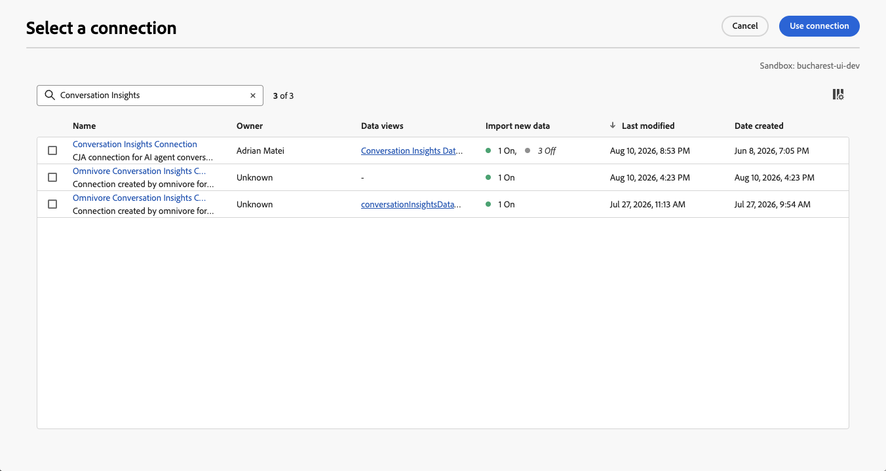

# Crear o editar una configuración

Conversation Insights le permite analizar conversaciones (de modelos de lenguaje grande (LLM) o humanos) a escala y dar contexto a esas conversaciones dentro del recorrido completo del cliente. A través de Conversation Insights, puede comprender el impacto de los representantes en los resultados reales del usuario.

A través de la interfaz de configuración de Perspectivas de conversación puede crear o editar rápidamente una configuración y los artefactos asociados (conexión, vistas de datos, etc.).

Cuando crea o edita una configuración de Perspectivas de conversación, especifica la zona protegida y los conjuntos de datos de evento que contienen preguntas, respuestas y datos de comentarios. También puede seleccionar la conexión de Customer Journey Analytics a la que desea agregar estos conjuntos de datos. Y la vista de datos a la que desee agregar las métricas y dimensiones de Perspectivas de conversación.

Solo los administradores del sistema pueden crear o editar configuraciones de Perspectivas de conversación.

Puede crear o editar configuraciones desde la [interfaz de configuración de Perspectivas de conversación](./conversation-insights-manage.md).

## Restaurar el conjunto de datos combinado que falta

Si edita una configuración y el conjunto de datos mezclado que se ha generado para la configuración ya no existe, seleccione **[!UICONTROL Restaurar]** para regenerar el conjunto de datos mezclado.

## Pasos de configuración

Para cada configuración:

1. En la sección **[!UICONTROL Detalles]**, especifique la siguiente información:

   

   | Campo | Descripción |
   |---------|----------|
   | **[!UICONTROL Nombre]** | Especifique un nombre para la configuración. |
   | **[!UICONTROL Zona protegida]** | Seleccione el simulador para pruebas de Experience Platform que contiene los conjuntos de datos de mensajes, respuestas y eventos de comentarios que desea agregar a su conexión. |

1. En la sección **[!UICONTROL Conjuntos de datos]**, especifique la siguiente información:

   

   | Campo | Descripción |
   |---------|----------|
   | **[!UICONTROL Solicita el conjunto de datos de evento]** | Seleccione el conjunto de datos que contiene los datos de evento de mensajes. |
   | **[!UICONTROL Conjunto de datos de evento de respuestas]** | Seleccione el conjunto de datos que contiene los datos de evento de las respuestas. |
   | **[!UICONTROL Conjunto de datos de evento de comentarios]** | Seleccione el conjunto de datos que contiene los datos de evento de comentarios. |

1. En la sección **[!UICONTROL Conexión]**, si no hay ninguna conexión configurada, use **[!UICONTROL Seleccionar una conexión]** para seleccionar una conexión.

   

   Si ya se ha configurado una conexión, seleccione  **[!UICONTROL Editar]** para seleccionar otra conexión.

   

   En el diálogo **[!UICONTROL Seleccionar una conexión]**:

   

   1. Seleccione la casilla de verificación situada junto a la conexión a la que desea agregar los conjuntos de datos de mensajes, respuestas y eventos de comentarios.
   1. Seleccione **[!UICONTROL Usar conexión]**.

   * Para buscar en la lista de conexiones desde las que seleccionar, use el campo .
   * Para definir qué columnas desea mostrar en la tabla, seleccione . En el cuadro de diálogo **[!UICONTROL Personalizar tabla]**, seleccione las columnas que desea mostrar. Luego selecciona **[!UICONTROL Aplicar]**.

1. En la sección **[!UICONTROL Vistas de datos]**, si no hay ninguna vista de datos configurada, seleccione **[!UICONTROL Seleccionar vistas de datos]** para seleccionar vistas de datos.

   Si las vistas de datos ya están configuradas, seleccione  **[!UICONTROL Editar selección de vista de datos]** para volver a configurar la selección de vistas de datos.

   En el diálogo **[!UICONTROL Seleccionar varias vistas de datos]**:

   

   1. Seleccione una o varias vistas de datos que desee utilizar para la configuración de Perspectivas de conversación.

   1. Seleccione **[!UICONTROL Usar vistas de datos]** para usar las vistas de datos. Seleccione Cancelar para cancelar.

   * Para buscar en la lista de vistas de datos entre las que seleccionar, use el campo .
   * Para definir qué columnas desea mostrar en la tabla, seleccione . En el cuadro de diálogo **[!UICONTROL Personalizar tabla]**, seleccione las columnas que desea mostrar. Luego selecciona **[!UICONTROL Aplicar]**.

1. Para finalizar la configuración:

   * Seleccione **[!UICONTROL Descartar]** para una nueva configuración que no se haya creado.

   * Seleccione **[!UICONTROL Guardar para más tarde]** para una nueva configuración que desee guardar pero para la que no desee crear el artefacto (por ejemplo, actualizaciones de vistas de datos). Para poder volver a consultar la configuración más tarde y finalizar la creación real de la configuración.

   * Seleccione **[!UICONTROL Crear]** para crear la nueva configuración.

   * Seleccione **[!UICONTROL Guardar]** para guardar la configuración modificada.

   * Seleccione **[!UICONTROL Restaurar]** para restaurar la configuración y regenerar un nuevo conjunto de datos combinado para la configuración.

   * Seleccione **[!UICONTROL Exit]** para omitir cualquier cambio en la configuración.

## Verificación de vista de datos

(Explicar las métricas y dimensiones que ve de los conjuntos de datos relevantes)

<!--

1. In the Data views dialog, select the checkbox next to one or more data views that you want to use when analyzing Experience Platform audience data within Analysis Workspace. These data views are automatically configured with Experience Platform audience data for reporting.

1. Select **[!UICONTROL Use data views]**.

1. Select **[!UICONTROL Create]** to create the configuration.

   >[!IMPORTANT]
   >
   >Because the profile dataset is updated once per day, audiences are available in Customer Journey Analytics data views on the day after you create the audience analysis configuration.

1. After 24 hours, [view audience dimensions in the data view](#view-audience-dimensions-in-the-data-view) to verify that the audience dimensions are available in the data views that you selected. 

 
## View audience dimensions in the data view

After you [create an audience analysis configuration](#create-an-audience-analysis-configuration), you can verify that audience dimensions were added to the data views that you selected during the configuration.

To view audience dimensions in the data view, you must be a product profile administrator for the product profile that the data view is assigned to. For more information, see [Access control](/help/technotes/access-control.md).

To view the audience analysis dimensions in the data view:

1. In Customer Journey Analytics, select **[!UICONTROL Data Management]** > **[!UICONTROL Data views]**.

1. In the **[!UICONTROL Dimensions]** section, the following dimensions should now be available:

   * **[!UICONTROL Audience Name]**

   * **[!UICONTROL Audience Origin]**

   * **[!UICONTROL Exited Audience Origin]**

   * **[!UICONTROL Exited Audience Name]**

   Note that each of these dimensions was added to the profile dataset that is associated with the merge policy that you selected during the audience analysis configuration, and each was added to the new lookup dataset that was created.

   

1. Use the audience analysis dimensions in Analysis Workspace. 

   Users who have access to use the data view in Analysis Workspace can now see the new dimensions and use them in their analyses. For information about how to use the audience analysis dimensions in Analysis Workspace, see [Analyze Experience Platform audiences in Customer Journey Analytics](/help/connections/audience-analysis/analyze-audiences.md).

-->