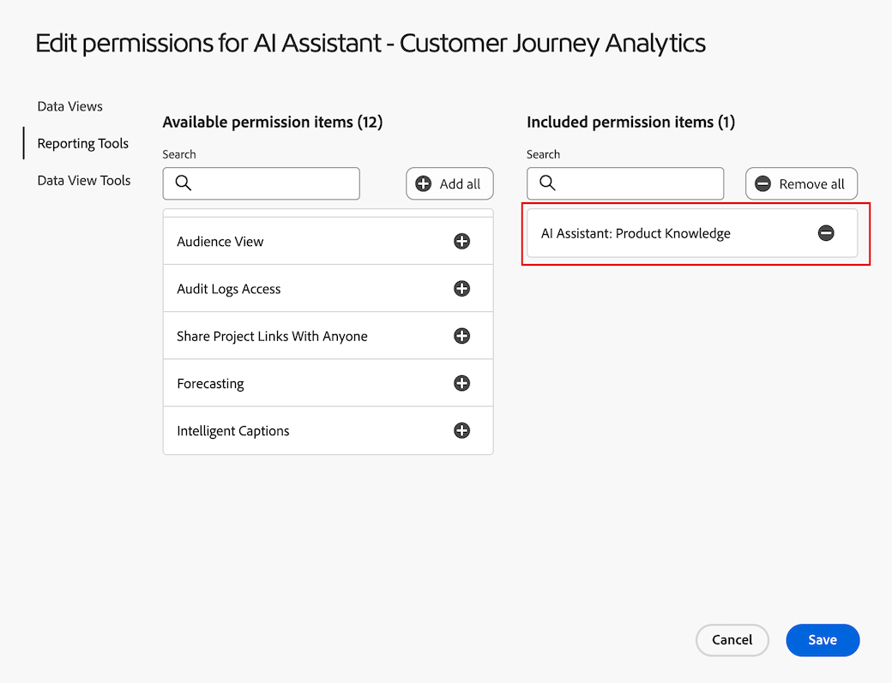

# Data Analysis AI Assistant en Customer Journey Analytics - Alpha

Data Analysis AI Assistant es un agente de conversación inteligente y consciente del contexto que puede ayudarle a responder de forma más rápida y eficaz a las preguntas que pueda tener sobre sus datos de Analysis Workspace en Customer Journey Analytics.

El Ayudante examina todos los datos de una vista de datos, incluidos los distintos tipos de métricas y componentes, y traduce el mensaje a la dimensión, métrica e intervalo de fechas adecuados para este análisis. En lugar de tener que familiarizarse con los componentes de la vista de datos y, a continuación, arrastrar y soltar esos componentes en la mejor combinación para responder a su pregunta, simplemente puede escribir la pregunta en el asistente de IA.

## Funciones dentro y fuera de ámbito para la versión de Alpha

Funciones en el ámbito:

| Función admitida | Descripción |
| --- | --- |
| Creación y actualización de visualizaciones | Genera una tabla de forma libre y una visualización asociada (por ejemplo, una línea, una barra, un anillo, etc.).
Ejemplo: *¿Cuál es el beneficio entre SKU de febrero a mayo?* |
| Tipos de visualización admitidos | Visualizaciones de líneas, varias líneas, forma libre, barras, anillo, número de resumen |
| Detección de mensajes fuera de ámbito | Si envía un mensaje que está fuera del ámbito, como &quot;exportar este proyecto&quot;, el Ayudante le responderá informándole de que la pregunta está fuera del ámbito. |
| Aclaración de preguntas | Si hace una pregunta que no tiene contexto suficiente para que la responda el asistente de IA, o es demasiado genérica, el asistente de IA responde con una pregunta aclaratoria y/o opciones sugeridas. Ejemplos: 
**Componentes**<ul><li>Métrica: *¿A qué métrica de &quot;ingresos&quot; se refería?*</li><li>Dimension: *¿En cuál de las siguientes &quot;regiones&quot; desea centrarse?*</li><li>Filtro: *¿Qué filtro de &quot;cuenta&quot; quería aplicar?*</li><li>Intervalo de fechas: *Por &quot;mes pasado&quot;, ¿se refería al último mes completo o a los últimos 30 días?*</li></ul>**elementos de Dimension**: ¿A qué &quot;nombre de tienda&quot; se refería? (por ejemplo, #5274 de tienda, #2949 de tienda, etc.) |
| Giro múltiple | El asistente de IA responde a un mensaje con el contexto de los mensajes anteriores, lo que permite a los usuarios actualizar las visualizaciones y hacer preguntas de seguimiento. Ejemplo: *Mostrarme los datos de marzo a abril en su lugar.* |
| Comentarios | <ul><li>Pulgares hacia arriba</li><li>Pulgares hacia abajo</li><li>Indicador</li></ul> |

Funciones fuera de ámbito:

| Función no admitida | Descripción |
| --- | --- |
| Resumen en línea o respuesta | El asistente de IA no puede responder en línea en el carril de chat con una respuesta de resumen de una petición de datos del usuario.Ejemplo de peticiones de datos fuera de ámbito:<ul><li>*Dame un resumen de los datos de mi última solicitud.*</li><li>*Resumir los elementos destacados de la visualización de líneas.*</li></ul> |
| Aclaración de preguntas | Las preguntas de aclaración se limitan a componentes y elementos de dimensión. El asistente de IA no puede aclarar vistas de datos, visualizaciones, granularidad de datos, comparación, ámbito, etc. Sin aclarar preguntas, el Ayudante toma como valor predeterminado lo que es más probable que pida. Si devuelve una visualización o una granularidad de datos inesperada, puede utilizar la capacidad de varias vueltas y actualizaciones para ajustar la visualización y los datos. |
| Acciones y capacidades de Workspace | El asistente de IA no puede realizar acciones para un usuario en Workspace aparte de crear y actualizar visualizaciones. Por ejemplo, no puede realizar ninguna de las siguientes acciones:<ul><li>Botones de la interfaz de usuario de la acción contextual (añadir a gráfico, nuevo panel, nueva tabla)</li><li>Compartir</li><li>Exportar</li><li>Descargar</li><li>Administrar preferencias de usuario</li><li>Depurar</li><li>Administrar vista de datos</li><li>Aplicación de paneles de Analytics</li><li>Atribución</li></ul> |
| Tipos de visualización no admitidos | <ul><li>Flujo</li><li>Visita en orden previsto</li><li>Tabla de cohortes</li><li>Área, área apilada</li><li>Barra apilada</li><li>Viñeta</li><li>Combo</li><li>Histograma</li><li>Barras horizontales, barras horizontales apiladas</li><li>Resumen de métricas clave</li><li>Dispersión</li><li>Cambio de resumen</li><li>Texto</li><li>Gráfico de rectángulos</li><li>Venn</li></ul> |
| Explicación y verificabilidad | Descripción o cita transparente de cómo el asistente de IA generó una respuesta y le proporciona una forma de confirmar que la respuesta es correcta. |

## Acceso a funciones en la IU de Customer Journey Analytics

[¿Necesitamos siquiera esta sección para el Alpha?]

Los siguientes parámetros rigen el acceso a la función del asistente de inteligencia artificial aplicada al análisis de datos:

* **Acceso a la solución**: el asistente de inteligencia artificial aplicada al análisis de datos está disponible para los clientes de Customer Journey Analytics Prime y Ultimate. No está disponible en Adobe Analytics.

También está disponible en Adobe Experience Platform, Adobe Journey Optimizer, Adobe Real-Time CDP y otras aplicaciones de Experience Platform.

* **Acceso contractual**: Si no puede usar el Asistente de IA, comuníquese con el administrador de su organización o con el representante de cuenta Adobe. Antes de que su organización pueda utilizar Data Analysis AI Assistant, su empresa debe aceptar ciertos términos legales relacionados con GenAI.

* **Permisos**: en [!UICONTROL Adobe Admin Console], el permiso de [!UICONTROL Herramientas de informes] **[!UICONTROL Asistente de IA: Análisis de datos]** determina el acceso a esta herramienta. Un [administrador de perfil de producto](https://helpx.adobe.com/es/enterprise/using/manage-product-profiles.html) debe seguir estos pasos en el [!UICONTROL Admin Console]:
   1. Vaya a **[!UICONTROL Admin Console]** > **[!UICONTROL Productos y servicios]** > **[!UICONTROL Customer Journey Analytics]** > **[!UICONTROL Perfiles de productos]**
   1. Seleccione el título del perfil de producto para el que desea proporcionar acceso a [!UICONTROL AI Assistant: Product Knowledge].
   1. En el perfil de producto específico, seleccione **[!UICONTROL Permisos]**.
   1. Seleccione  para editar **[!UICONTROL Herramientas de informes]**.
   1. Seleccione  para agregar **AI Assistant: Data Analysis** a **[!UICONTROL Elementos de permiso incluidos]**.

      .

   1. Seleccione **[!UICONTROL Guardar]** para guardar los permisos.

Consulte [Control de acceso](/help/technotes/access-control.md#access-control) para obtener más información.

## Acceso y uso del Data Analysis AI Assistant

1. Vaya a este vínculo para abrir Workspace en la organización IMS de Labs (en fase) e inicie sesión con su Adobe ID.

1. Haga clic en **[!UICONTROL Proyecto en blanco]** en el banner situado en la parte superior de la página de proyectos para abrir un nuevo proyecto en blanco.

1. Haga clic en el icono de chat del Ayudante de IA en la parte superior derecha.

   

1. En el cuadro de diálogo **[!UICONTROL Preguntar por el Customer Journey Analytics]** de la parte inferior, haga su primera pregunta de análisis de datos en el asistente de IA.

   Por ejemplo, supongamos que le interesan los pedidos que recibió su empresa en julio. Para poder introducir &quot;Mostrar pedidos en julio&quot;.

   

## Ejemplo de solicitudes de análisis de datos

A continuación, se muestran algunos ejemplos de cómo el asistente de IA responde a las solicitudes y a las visualizaciones esperadas:

| Mensaje de ejemplo | Visualización esperada |
| --- | --- |
| Mostrar mis ganancias en [Mes] | Línea
Si se solicita una tendencia o métrica en un intervalo de tiempo determinado, se devolverá una visualización de línea de forma predeterminada. |
| Tendencia de pedidos en [Mes] | Línea |
| Mostrar ingresos por región en [mes] | Barra |
| Porcentaje de ingresos por categoría de producto | Anillo |
| Pedidos por día de la semana de enero a mayo | Barra |
| Mostrar pedidos por sexo de marzo a junio | Barra |
| ¿Cuál es el beneficio entre SKU de febrero a mayo? | Barra |
| Ingresos por nombre de tienda en [Mes] | Barra |
| ¿Cuáles fueron mis 10 SKU principales por beneficio en [Mes]? | Barra |
| Proporción de compras por mes del año | Anillo |
| Beneficio total en [mes] | Número de resumen
Solicitar el &quot;total&quot; de una métrica en un intervalo de tiempo determinado debe devolver una visualización de Número de resumen. |

## Impulso de las prácticas recomendadas

Por determinar

## Expectativas de prueba del Alpha y comentarios solicitados

Por determinar

## Preguntas y contacto

Correo electrónico `taylorb@adobe.com` (PM)
Enviar preguntas y comentarios en el canal de Slack del Alpha

