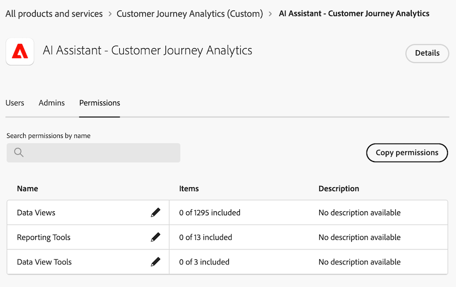
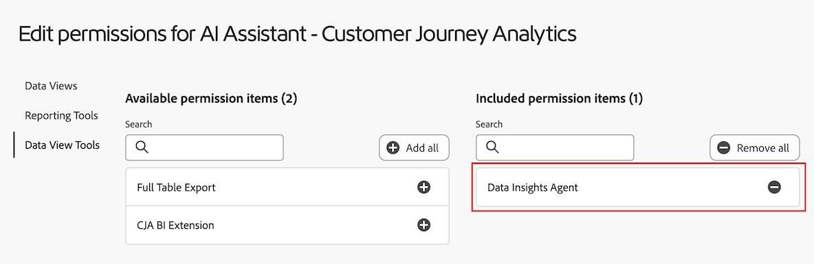
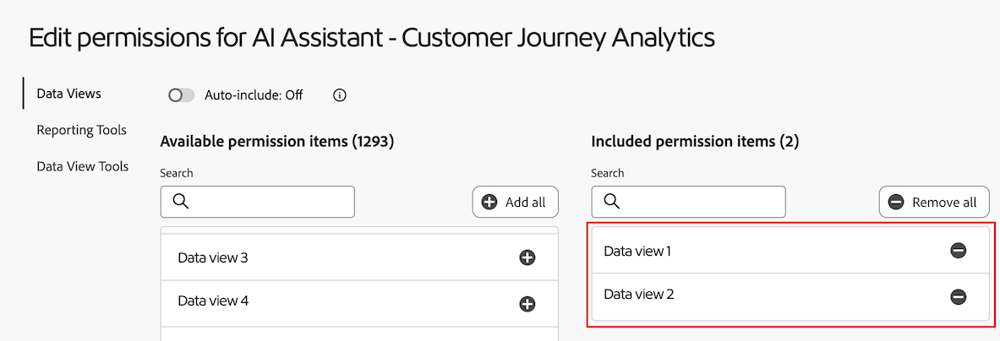

# Visualización de datos con Data Insights Agent en Customer Journey Analytics

>[!AVAILABILITY]
>
>La funcionalidad descrita en este artículo está disponible para todos los clientes aptos como parte de una versión por fases que comenzará el 28 de mayo de 2025 y es posible que aún no esté disponible en su entorno. Esta nota se eliminará cuando la funcionalidad esté disponible de forma general. Para obtener información sobre el proceso de lanzamiento de Customer Journey Analytics, consulte [lanzamientos de características de Customer Journey Analytics](/help/release-notes/releases.md).

>[!AVAILABILITY]
>
>Data Insights Agent está disponible para los clientes elegibles durante un tiempo limitado. El acceso a Data Insights Agent finalizará el 30 de noviembre de 2025. Para seguir utilizando Data Insights Agent sin interrupciones, póngase en contacto con el representante de su cuenta de Adobe para obtener más información sobre las licencias de Data Insights Agent.

Data Insights Agent, al que se puede acceder desde el asistente de IA de Customer Journey Analytics, es un agente de conversación de IA generativo que responde de forma rápida y eficaz a las preguntas sobre sus datos. Crea visualizaciones relevantes en Analysis Workspace utilizando componentes de la vista de datos y utilizando los datos reales.

El uso de Data Insights Agent para responder preguntas centradas en los datos en Analysis Workspace puede ahorrar incontables horas que, de lo contrario, podría dedicar a la creación manual de visualizaciones en Analysis Workspace y a familiarizarse con los componentes de las vistas de datos.

## Funciones dentro y fuera de ámbito

| Función | En ámbito | Fuera de ámbito |
| --- | --- | --- |
| **Tipos de visualización** | <ul><li>Línea</li><li>De varias líneas</li><li>Tabla de forma libre</li><li>Barra</li><li>Anillo</li><li>Número de resumen</li></ul> | <ul><li>Flujo</li><li>Visita en orden previsto</li><li>Tabla de cohortes</li><li>Área, área apilada</li><li>Barra apilada</li><li>Viñeta</li><li>Combo</li><li>Histograma</li><li>Barras horizontales, barras horizontales apiladas</li><li>Resumen de métricas clave</li><li>Puntos</li><li>Cambio de resumen</li><li>Texto</li><li>Gráfico de rectángulos</li><li>Venn</li><li>Análisis guiado: Crecimiento activo, Tendencias de conversión, Participación, Impacto de primer uso, Frecuencia, Canal, Crecimiento neto, Impacto de versión, Retención, Cronología, Tendencias</li></ul> |
| **Acciones de Workspace y capacidades del agente** | <ul><li>Creación y actualización de visualizaciones
Genera una tabla de forma libre y una visualización asociada (como una línea, una barra, un anillo, etc.).
Por ejemplo, *¿Cuál es la ganancia entre SKU de febrero a mayo?*
</li><li>Formular preguntas de seguimiento
Responder a un mensaje en el contexto desde cualquier mensaje anterior. Por ejemplo:
 <ul><li>Preguntar 1: *Eventos de tendencia de marzo.*</li><li>Mensaje 2: *Mostrarme los datos de marzo a abril*</li></ul> </li><li>Detección de mensajes fuera de ámbito
Si envía una solicitud que está fuera del ámbito, como *Exportar este proyecto*, Data Insights Agent le responderá informándole de que la pregunta está fuera del ámbito.
</li></ul> | <ul><li>Compartir</li><li>Exportar</li><li>Descargar</li><li>Administrar preferencias de usuario</li><li>Administrar vista de datos</li><li>Aplicación de paneles de Analytics</li><li>Atribución</li><li>Resumen o respuesta en línea
Data Insights Agent no puede responder en línea en el carril de chat con una respuesta resumida de una petición de datos del usuario. Algunos ejemplos de mensajes fuera del ámbito son: *Dame un resumen de los datos de mi último mensaje* y *Resume los elementos destacados de la visualización de líneas.*
</li></ul> |
| **aclarando preguntas** | Si hace una pregunta que no tiene contexto suficiente para que Data Insights Agent la responda o es demasiado genérica, Data Insights Agent responde con una pregunta aclaratoria o con opciones sugeridas. 
Las siguientes preguntas aclaratorias son ejemplos de preguntas relacionadas con los componentes:
<ul><li>Métrica: *¿A qué métrica de &quot;ingresos&quot; se refería?*</li><li>Dimension: *¿En cuál de las siguientes &quot;regiones&quot; desea centrarse?*</li><li>Segmento: *¿Qué segmento de &quot;cuenta&quot; quería aplicar?*</li><li>Intervalo de fechas: *Por &quot;mes pasado&quot;, ¿se refería al último mes completo o a los últimos 30 días?*</li></ul>
La siguiente pregunta aclaratoria es un ejemplo de una pregunta relacionada con los elementos de dimensión:
 <ul><li>¿A qué &quot;nombre de tienda&quot; te referías? (Por ejemplo, Almacenar #5274, Almacenar #2949, etc.).</li></ul> | Las preguntas de aclaración se limitan a componentes y elementos de dimensión. Data Insights Agent no puede aclarar cosas como vistas de datos, visualizaciones, granularidad de datos, comparación y ámbito. Cuando no se pueden utilizar preguntas aclaratorias, el agente toma como valor predeterminado lo que es más probable que se pida. Si devuelve una visualización o una granularidad de datos inesperada, puede hacer una pregunta de seguimiento o ajustar la visualización y los datos. |
| **Verificación y corrección de datos** | La verificabilidad y corrección de los datos se puede confirmar consultando la tabla de forma libre y la visualización de datos generadas. 
Por ejemplo, si solicita a Data Insights Agent que *Tendencie los pedidos el mes pasado*, puede confirmar que la métrica (&quot;pedidos&quot;) y el intervalo de fechas (&quot;el mes pasado&quot;) correctos se seleccionaron en el panel, la visualización de datos y la tabla de forma libre recién generados. | Data Insights Agent no responde informándole de los componentes o visualizaciones que se han añadido.
 |
| **Mecanismos de comentarios** | <ul><li>Pulgares hacia arriba</li><li>Pulgar hacia abajo</li><li>Indicador</li></ul> |  |

## Administración del acceso a Data Insights Agent en Customer Journey Analytics

Los siguientes parámetros rigen el acceso a Data Insights Agent en Customer Journey Analytics:

* **Acceso a la solución**: Data Insights Agent está disponible para todos los clientes de Customer Journey Analytics como parte de un programa de acceso limitado hasta el 30 de noviembre de 2025. No está disponible en Adobe Analytics.

* **Acceso contractual**: Si no puede usar Data Insights Agent en el asistente de IA, póngase en contacto con el administrador de su organización o con el equipo de cuenta de Adobe. Antes de que su organización pueda utilizar Data Insights Agent, debe aceptar ciertos términos legales relacionados con la IA generativa.

* **Permisos**: Deben otorgarse los permisos necesarios en [!UICONTROL Adobe Admin Console] para que los usuarios puedan acceder a Data Insights Agent.

  Para conceder permisos, un [administrador de perfil de producto](https://helpx.adobe.com/es/enterprise/using/manage-product-profiles.html) debe completar los siguientes pasos en [!UICONTROL Admin Console]:
   1. En **[!UICONTROL Admin Console]**, seleccione la ficha **[!UICONTROL Productos]** para ver la página **[!UICONTROL Todos los productos y servicios]**.
   1. Seleccione **[!UICONTROL Customer Journey Analytics]**.
   1. En la ficha **[!UICONTROL Perfiles de producto]**, seleccione el título del perfil de producto para el que desea proporcionar acceso a [!UICONTROL Asistente de IA: Conocimiento del producto].
   1. En el perfil de producto específico, seleccione la ficha **[!UICONTROL Permisos]**.

      

   1. En la fila **[!UICONTROL Herramientas de informes]** de la tabla proporcionada, seleccione el icono de edición .
   1. Desplácese hasta o busque **[!UICONTROL Asistente de IA: conocimiento del producto]** y, a continuación, seleccione el icono de signo más  junto a este permiso.

      El permiso **[!UICONTROL Asistente de IA: conocimiento del producto]** se agrega a la columna **[!UICONTROL Elementos de permiso incluidos]**.

      .

   1. Seleccione la pestaña **[!UICONTROL Herramientas de vista de datos]** y, a continuación, seleccione el icono de signo más  junto al permiso de **[!UICONTROL Data Insights Agent]**.

      El permiso **[!UICONTROL Data Insights Agent]** se agrega a la columna **[!UICONTROL Elementos de permiso incluidos]**.

      .

   1. Seleccione la pestaña **[!UICONTROL Vistas de datos]** para elegir las vistas de datos que desea habilitar para Data Insights Agent.

      >[!IMPORTANT]
      >
      >Tenga en cuenta lo siguiente al habilitar las vistas de datos:
      >* Puede habilitar un máximo de 50 vistas de datos por organización IMS. Si habilita más de 50 vistas de datos en todos los perfiles de producto para una organización determinada, Data Insights Agent utilizará las 50 vistas de datos más utilizadas.
      >* Data Insights Agent puede hacer referencia a las vistas de datos incluidas en algún momento durante el mismo día en que las habilita en Admin Console.

   1. Busque o desplácese hasta las vistas de datos que desee habilitar y, a continuación, seleccione el icono de signo más  junto al nombre de cada vista de datos.

      Cada vista de datos que agregue será visible en la columna **[!UICONTROL Elementos de permiso incluidos]**.

      .

   1. Seleccione **[!UICONTROL Guardar]** para guardar el esquema.

  Para obtener información adicional sobre el control de acceso, consulte [Control de acceso](/help/technotes/access-control.md#access-control).

## Acceder a Data Insights Agent en el asistente de IA

1. Vaya a [experience.adobe.com](https://experience.adobe.com/) e inicie sesión con su Adobe ID.

2. Seleccione **Customer Journey Analytics** en la página de inicio de Experience Cloud.

3. Seleccione **[!UICONTROL Proyecto en blanco]** en el banner de la parte superior de la página de proyectos para abrir un nuevo proyecto en blanco.

4. Asegúrese de que la vista de datos seleccionada para el panel sea una vista de datos habilitada para usar con Data Insights Agent, tal como se describe en [Administrar el acceso a Data Insights Agent en Customer Journey Analytics](#manage-access-to-data-insights-agent-in-customer-journey-analytics).

5. Seleccione el icono de chat AI Assistant en el área superior derecha de la página.

   Si no ve el icono de chat, póngase en contacto con el administrador para que pueda habilitar las siguientes funciones en Admin Console:

   * Herramientas de informes: **[!UICONTROL Asistente de IA: conocimiento del producto]**

   * Herramientas de vista de datos: **[!UICONTROL Data Insights Agent]**

   Para obtener más información, consulte [Administrar el acceso a Data Insights Agent en Customer Journey Analytics](#manage-access-to-data-insights-agent-in-customer-journey-analytics).

   

6. En el cuadro de diálogo **[!UICONTROL Preguntar por Customer Journey Analytics]** que aparece en la parte inferior de la página, haga una pregunta sobre la visualización de datos con Data Insights Agent.

   Para obtener más información, consulte los siguientes ejemplos.

### Ejemplo 1

Por ejemplo, supongamos que le interesan los pedidos que recibió su empresa en julio.

**Mensaje:** Escriba *&quot;Tendencia de pedidos en julio.&quot;*

**Respuesta:** Data Insights Agent recopila datos al examinar los datos de la vista de datos, incluidas las métricas y los componentes. Traduce el mensaje a las dimensiones y métricas correctas dentro del rango de datos.

Como puede ver, generó automáticamente un gráfico de líneas y una tabla de forma libre para mostrar los pedidos de julio.

### Ejemplo 2

A continuación, desea ver cómo se comparan los ingresos por región.

**Mensaje:** En la ventana del mensaje, escriba *&quot;Mostrar ingresos por región.&quot;*

**Respuesta:** Data Insights Agent entiende inteligentemente que por &quot;región&quot; se refiere a &quot;región del cliente&quot;. Genera un gráfico de barras que muestra mejor los ingresos por región:

### Ejemplo 3

A continuación, además de comprender los ingresos por región, también desea ver los datos con fines de lucro por región. En lugar de repetir la solicitud anterior, puede pedir a Data Insights Agent que actualice la visualización más reciente y la tabla de forma libre.

**Mensaje:** En la ventana del mensaje, escriba *&quot;Agregar ganancia.&quot;*

**Respuesta:** El gráfico de **[!UICONTROL barras]** sigue proporcionando la respuesta más concisa, pero la métrica de beneficios se ha agregado como una columna en la tabla de forma libre:

### Ejemplo 4

Por último, veamos los ingresos por categoría de producto.

**Mensaje:** En la ventana del mensaje, escriba *&quot;Proporción de ingresos por categoría de producto.&quot;*

**Respuesta:** De nuevo, Data Insights Agent elige la visualización más adecuada, en este caso la visualización **[!UICONTROL Anillo]**, para responder a la pregunta.

## Ejemplos de solicitudes de visualización de datos

A continuación, se muestran algunos ejemplos de indicadores comunes y las visualizaciones utilizadas por Data Insights Agent para responder a dichos mensajes.

| Mensaje de ejemplo | Visualización esperada |
| --- | --- |
| Mostrar mis ganancias en [Mes] | Línea
Si se solicita una tendencia o métrica dentro de un intervalo de tiempo determinado, de forma predeterminada, se devuelve una visualización de línea. |
| Tendencia de pedidos en [Mes] | Línea |
| Mostrar ingresos por región en [mes] | Barra |
| Porcentaje de ingresos por categoría de producto | Anillo |
| Pedidos por día de la semana, de enero a mayo | Barra |
| Mostrar pedidos por sexo, de marzo a junio | Barra |
| ¿Cuál es el beneficio entre SKU de febrero a mayo? | Barra |
| Ingresos por nombre de tienda en [Mes] | Barra |
| ¿Cuáles fueron mis 10 SKU principales por beneficio en [Mes]? | Barra |
| Proporción de compras por mes del año | Anillo |
| Beneficio total en [mes] | Número de resumen
Solicitar el &quot;total&quot; de una métrica en un intervalo de tiempo determinado debe devolver una visualización de Número de resumen. |

## Impulso de las prácticas recomendadas

Data Insights Agent procesa el contexto proporcionado por cada mensaje de usuario e intenta responder de forma inteligente con la visualización y los componentes más adecuados en una tabla de forma libre.

Las respuestas pueden variar en función de las palabras y frases específicas utilizadas en el mensaje, y los ligeros cambios de idioma pueden dar lugar a resultados diferentes.

Para obtener los mejores resultados, tenga en cuenta las siguientes directrices:

* **Sea específico:** Incluya términos exactos para reducir la respuesta. El siguiente es un ejemplo de un mensaje específico: &quot;Ventas del mes pasado en California&quot;

* **Use métricas, dimensiones y segmentos claros:** Si agrega métricas específicas (como &quot;Ingresos&quot;), dimensiones (como &quot;nombre del sitio web&quot;), segmentos (como &quot;usuarios de iPhone&quot;) e intervalos de fechas (como &quot;últimos tres meses&quot;), Data Insights Agent podrá centrarse en los datos correctos.

* **Haga preguntas directas:** Las preguntas de redacción facilitan directamente que Data Insights Agent proporcione perspectivas claras y relevantes. El siguiente es un ejemplo de cómo realizar una pregunta directa en un mensaje: &quot;¿Cuál es el ingreso promedio por categoría de producto este año?&quot;

Revise la siguiente tabla de términos y frases de ejemplo que puede utilizar en las peticiones de datos con Data Insights Agent, junto con los tipos de respuesta que puede esperar.

Estos ejemplos están diseñados para ayudarle a familiarizarse con cómo palabras o estructuras específicas pueden influir en la salida de Data Insight Agent, lo que garantiza perspectivas más precisas y valiosas. Data Insights Agent utiliza IA generativa, por lo que las visualizaciones de los datos seleccionados pueden variar ligeramente según los indicadores similares.

| Resultado deseado | Ejemplo de términos y frases |
| --- | --- |
| Visualización de número de resumen | <ul><li>Total</li></ul> |
| Comparar componentes | <ul><li>Comparar</li><li>VS</li><li>Contraste</li><li>Semana a semana</li><li>Mes tras mes</li><li>Trimestre tras trimestre</li><li>Año tras año</li></ul> |
| Visualización de anillo | <ul><li>Proporción</li><li>Cuota de</li><li>Distribución</li><li>Porcentaje</li><li>Contribución</li><li>Parte</li><li>Piezas</li></ul> |
| Visualización de líneas | <ul><li>Tendencia</li><li>[Métrica] en [intervalo de tiempo]</li></ul> |
| Visualización de barras | <ul><li>[Métrica] por [Dimension]</li></ul> |

<!--

## Beta testing expectations and requested feedback

After posing each question, carefully review the assistant's provided answer. It's crucial to evaluate the generated visualizations comprehensively before providing feedback. 

Consider the following when evaluating a response from Data Insights Agent: 

* Chat rail response or template: Evaluate the textual response provided. Is the response appropriate given the context of your prompt? 

* Visualization/chart: Evaluate the visualization. Is it the appropriate or expected visualization for your question, or would you have expected a different visualization?  

* Freeform table: Evaluate the freeform table. Is the freeform table data correct? Is it breaking down data where requested? Are the applied segments those that you requested or expected? 

* Error Message / Out-of-Scope: If a generic error message is given stating the question is out of scope, provide feedback on whether you think the out-of-scope message is appropriate, given your prompt. Was your prompt actually in scope? 

**For every response, give a thumbs up or thumbs down, based on the response.**

Following the thumbs up or thumbs down selection, please make a selection for the relevant multi-select feedback boxes. If you want to provide additional feedback, add notes in the open text box.

## Questions and Contact

* Send questions and feedback in the Beta Slack channel: #data-insights-agent-in-cja-beta

-->

