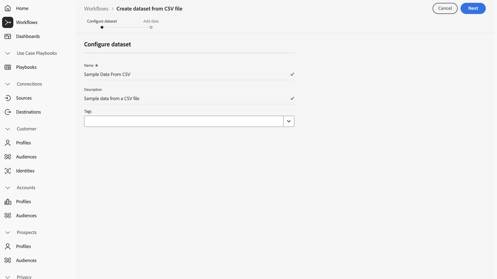
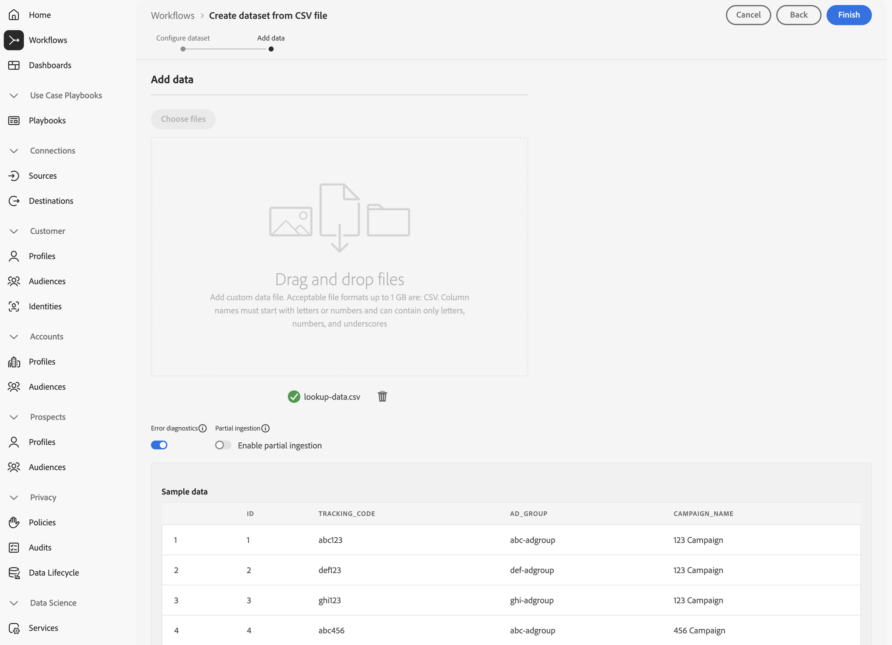
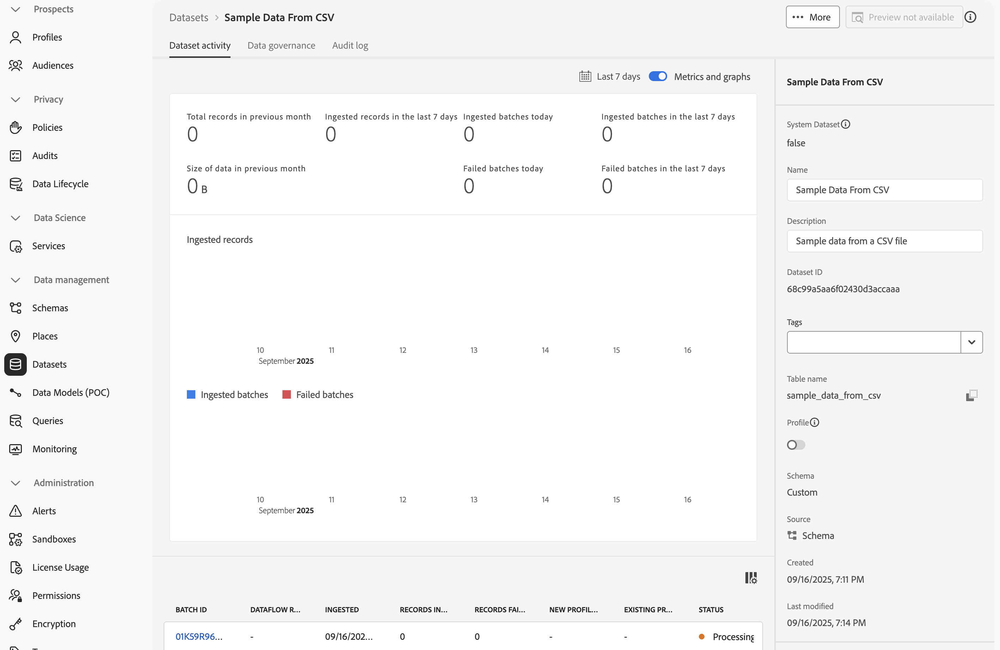
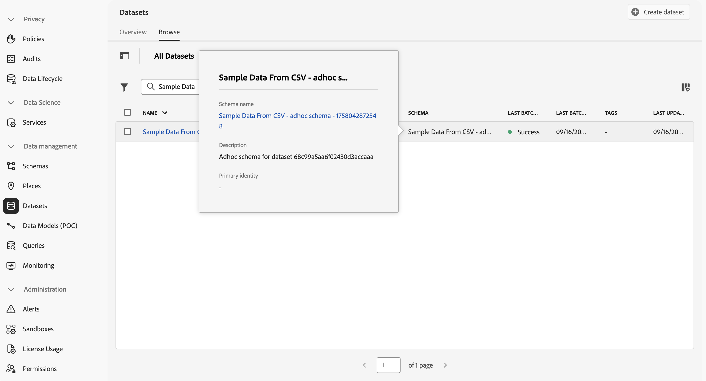
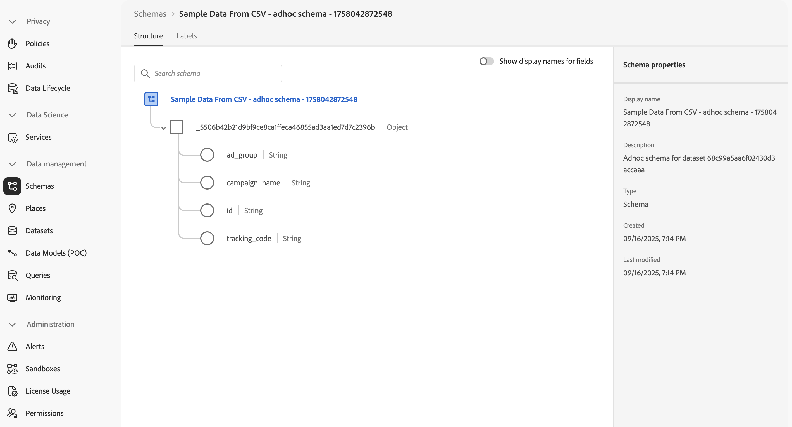
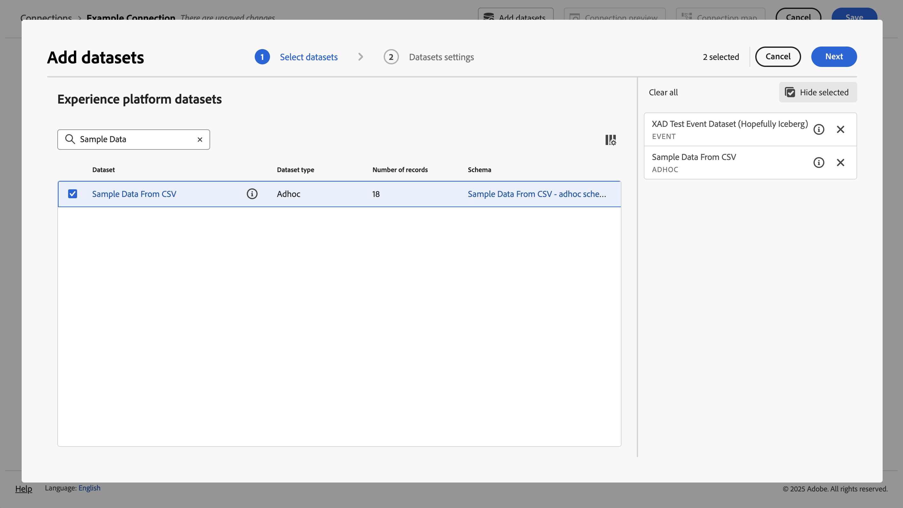
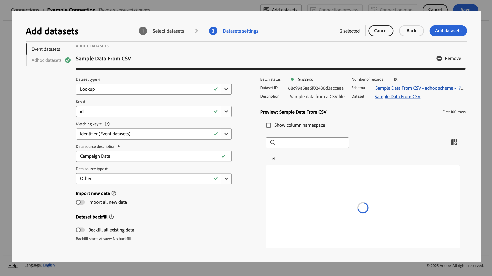
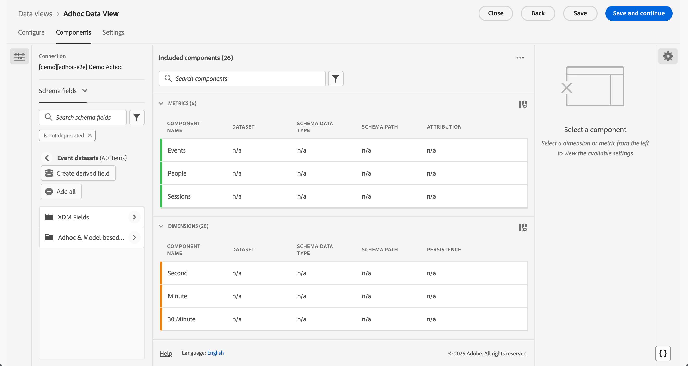

# Ingesta y uso de datos ad hoc

En esta guía de inicio rápido se explica cómo puede introducir datos ad hoc en Experience Platform y, a continuación, utilizar esos datos en Customer Journey Analytics.

Para lograrlo, debe llevar a cabo lo siguiente:

- **Crear un conjunto de datos con un archivo CSV** en Experience Platform. Este flujo de trabajo define el modelo (esquema) de los datos que desea recopilar y dónde recopilar los datos (conjunto de datos).

- **Configurar una conexión** en Customer Journey Analytics. Esta conexión debe incluir (al menos) su conjunto de datos ad hoc de Experience Platform.

- **Configure una vista de datos** en Customer Journey Analytics para definir métricas y dimensiones a partir de los campos de los datos ad hoc que desee usar en Analysis Workspace.

- **Configurar un proyecto** en Customer Journey Analytics para crear sus informes y visualizaciones.

>[!NOTE]
>
>Esta guía de inicio rápido es una guía simplificada sobre cómo introducir datos ad hoc mediante en Experience Platform y utilizar esos datos ad hoc en Customer Journey Analytics. Se recomienda estudiar la información adicional cuando se haga referencia a ella.

## Creación de un conjunto de datos con un archivo CSV

Para este inicio rápido, desea utilizar un archivo CSV que represente los datos de búsqueda y que contenga información similar a la que se muestra a continuación.

| _id | tracking_code | ad_group | campaign_name |
| ---: | :---          | :---        | :---          |
| 1 | abc123 | abc-adgroup | Campaña 123 |
| 2 | def123 | def-adgroup | Campaña 123 |
| 3 | ghi123 | ghi-adgroup | Campaña 123 |
| 4 | abc456 | abc-adgroup | Campaña 456 |
| 5 | def456 | def-adgroup | Campaña 456 |

>[!NOTE]
>
>Utilice conjuntos de datos y esquemas ad hoc para datos basados en registros (búsqueda, perfil). Los conjuntos de datos y esquemas ad hoc son menos adecuados y no deben tenerse en cuenta para los datos de series temporales (evento, resumen).

No es necesario crear un esquema XDM para datos ad hoc. Experience Platform admite un flujo de trabajo basado en los datos del archivo CSV:

1. Crea un esquema ad hoc automáticamente. Ese esquema se ajusta a las columnas del archivo CSV.
1. Crea un conjunto de datos que contiene los datos del archivo CSV.

Para iniciar el flujo de trabajo:

1. En la interfaz de Experience Platform, en el carril izquierdo, seleccione **[!UICONTROL Flujos de trabajo]**.
1. Seleccione  **[!UICONTROL Crear conjunto de datos a partir del archivo CSV]**.
1. Seleccione **[!UICONTROL Launch]** en el panel derecho.
1. En el asistente de **[!UICONTROL Flujos de trabajo]** > **[!UICONTROL Crear conjunto de datos a partir del archivo CSV]**:
   1. En el paso **[!UICONTROL Configurar conjunto de datos]**:
      1. Escriba un **[!UICONTROL Nombre]** para el conjunto de datos. Por ejemplo: `Sample Data From CSV`.
      1. Agregue una **[!UICONTROL descripción]** opcional. Por ejemplo: `Sample data from a CSV file`.
      1. Agregue una o más **[!UICONTROL Etiquetas]** opcionales o seleccione una o más **[!UICONTROL Etiquetas]** existentes.

         

      1. Seleccione **[!UICONTROL Siguiente]**.
   1. En el paso **[!UICONTROL Agregar datos]**:
      1. Seleccione **[!UICONTROL Elegir archivos]** para seleccionar el archivo CSV de su equipo o red. También puedes arrastrar y soltar el archivo desde su ubicación en tu equipo o red en **[!UICONTROL Arrastrar y soltar archivos]**. El archivo se ha cargado y se muestran **[!UICONTROL datos de ejemplo]**.
      1. Habilitar o deshabilitar **[!UICONTROL diagnósticos de error]** y **[!UICONTROL Habilitar la ingesta parcial]** según sus preferencias. Cuando **[!UICONTROL habilita la ingesta parcial]**, puede definir un **[!UICONTROL umbral de error %]**.

         

      1. Seleccione **[!UICONTROL Finalizar]**.

Una vez que los datos se hayan preparado y cargado correctamente, se le redirigirá a **[!UICONTROL Conjuntos de datos]** en la interfaz de Experience Platform.  Verá la **[!UICONTROL actividad del conjunto de datos]** para su **[!UICONTROL conjunto de datos de ejemplo del CSV]** con el estado  **[!UICONTROL Procesando]**.

Para inspeccionar los datos ad hoc:

1. En la interfaz de Experience Platform, en el carril izquierdo, seleccione **[!UICONTROL Conjuntos de datos]**.
1. Seleccione la ficha **[!UICONTROL Examinar]** en **[!UICONTROL Conjuntos de datos]**. Debería ver su conjunto de datos en la lista.
1. Seleccione el nombre del esquema en la columna **[!UICONTROL Esquema]**. Por ejemplo: **[!UICONTROL Datos de ejemplo del CSV...]**

   

1. En la ventana emergente, seleccione **[!UICONTROL Nombre de esquema]**. Por ejemplo: **[!UICONTROL Datos de ejemplo del CSV - esquema ad hoc - XXXXXXXXX]**. Se le redirigirá a **[!UICONTROL Esquemas]** > **[!UICONTROL Datos de ejemplo del CSV - esquema ad hoc - XXXXXXXXX]** interfaz.

En **[!UICONTROL Esquemas]** > **[!UICONTROL Datos de ejemplo del CSV - esquema ad hoc - XXXXXXXXX]** interfaz:

- Seleccione el objeto de nombre de inquilino superior debajo de **[!UICONTROL Esquemas]** > **[!UICONTROL Datos de ejemplo del CSV - esquema ad hoc - XXXXXXXXXXX]** para mostrar los campos dentro del objeto. Los campos dentro del objeto representan la estructura del archivo CSV. El esquema se crea automáticamente en función de la carga de los datos ad hoc.

  

  >[!NOTE]
  >
  >El flujo de trabajo define todos los campos del esquema para que sean del tipo Cadena. No puede cambiar este tipo en una fase posterior. Si necesita más flexibilidad en la definición de un esquema ad hoc, considere [usar la API para crear un esquema ad hoc](https://experienceleague.adobe.com/es/docs/experience-platform/xdm/tutorials/ad-hoc) y luego use el flujo de trabajo [Crear conjunto de datos a partir del esquema](https://experienceleague.adobe.com/es/docs/experience-platform/catalog/datasets/user-guide#schema).
  > 

## Configurar una conexión

Para usar el conjunto de datos de Experience Platform en Customer Journey Analytics, debe crear una conexión que incluya el conjunto de datos ad hoc resultante del [flujo de trabajo](#create-a-dataset-with-a-csv-file)

Una conexión le permite integrar conjuntos de datos de Experience Platform en Workspace. Para informar sobre estos conjuntos de datos, primero debe establecer una conexión entre conjuntos de datos en Experience Platform y Workspace.

Para crear la conexión:

1. En la interfaz de usuario de Customer Journey Analytics, seleccione **[!UICONTROL Conexiones]**, opcionalmente desde **[!UICONTROL Administración de datos]**, en el menú superior.

1. Seleccione **[!UICONTROL Crear nueva conexión]**.

1. En la pantalla **[!UICONTROL Conexión sin título]**, haga lo siguiente:

   1. Asigne un nombre a la conexión y descríbala en **[!UICONTROL Configuración de la conexión]**.

   1. Seleccione la zona protegida correcta en la lista **[!UICONTROL Zona protegida]** de **[!UICONTROL Configuración de datos]** y seleccione el número de eventos diarios en la lista **[!UICONTROL Número medio de eventos diarios]**.

      

   1. Seleccione **[!UICONTROL Agregar conjuntos de datos]**.

1. En el paso **[!UICONTROL Seleccionar conjuntos de datos]**, en **[!UICONTROL Agregar conjuntos de datos]**, haga lo siguiente:

   1. Seleccione el conjunto de datos que creó anteriormente, por ejemplo **[!UICONTROL Datos de ejemplo del CSV]**, y cualquier otro conjunto de datos que desee incluir en la conexión. Los conjuntos de datos ad hoc tienen **[!UICONTROL Adhoc]** [!UICONTROL Tipo de conjunto de datos].

      

   1. Seleccione **[!UICONTROL Siguiente]**.

1. En el paso **[!UICONTROL Configuración de conjuntos de datos]**, en **[!UICONTROL Agregar conjuntos de datos]**, haga lo siguiente:

   Para su conjunto de datos ad hoc:

   1. Seleccione el tipo de conjunto de datos ad hoc. Por ejemplo: **[!UICONTROL Búsqueda]**.
   1. Seleccione una **[!UICONTROL clave]** de las claves disponibles definidas en el esquema ad hoc.
   1. Seleccione una **[!UICONTROL clave coincidente]** de un conjunto de datos de evento que haya agregado como parte de su conexión.
   1. Seleccione la fuente de datos correcta en la lista **[!UICONTROL Tipo de fuente de datos]**. Si especifica **[!UICONTROL Otro]**, agregue una descripción para la fuente de datos.

   1. Establezca **[!UICONTROL Importar todos los datos nuevos]** y **[!UICONTROL Datos existentes del relleno del conjunto de datos]** según sus preferencias.

      

   1. Seleccione **[!UICONTROL Agregar conjuntos de datos]**.

   1. Seleccione **[!UICONTROL Guardar]**.

Consulte [Configuración de conjuntos de datos ad hoc](/help/connections/create-connection.md#adhoc-dataset) para obtener más información sobre la configuración disponible para conjuntos de datos ad hoc.

>[!IMPORTANT]
>
>Además de la recomendación general de no usar conjuntos de datos y esquemas ad hoc para datos de series temporales, no puede usar el flujo de trabajo **[!UICONTROL Crear conjunto de datos a partir de CSV]** para datos de series temporales. Este flujo de trabajo define todos los campos para que sean de tipo cadena que no se puede modificar posteriormente. Cuando se agrega un conjunto de datos basado en series temporales (evento o resumen) a una conexión, este tipo de conjunto de datos requiere la definición de al menos un campo de tipo DateTime. Si necesita usar datos de series temporales ad hoc, considere [usar la API para crear un esquema ad hoc](https://experienceleague.adobe.com/es/docs/experience-platform/xdm/tutorials/ad-hoc#token_type=bearer&expires_in=43197438) y luego use el flujo de trabajo [Crear conjunto de datos a partir del esquema](https://experienceleague.adobe.com/es/docs/experience-platform/catalog/datasets/user-guide#schema).

Después de crear una [conexión](/help/connections/overview.md), puede realizar diversas tareas de administración, como [seleccionar y combinar conjuntos de datos](/help/connections/combined-dataset.md), [comprobar el estado de los conjuntos de datos de una conexión y el estado de la ingesta de datos](/help/connections/manage-connections.md), etc.

## Configurar una vista de datos

Una vista de datos es un contenedor específico de Customer Journey Analytics que le permite determinar cómo interpretar los datos de una conexión. Especifica todas las dimensiones y métricas disponibles en Analysis Workspace y de qué columnas obtienen esos datos las dimensiones y métricas. Las vistas de datos se definen a fin de prepararse para la creación de informes en Analysis Workspace.

Para crear la vista de datos:

1. En la interfaz de usuario de Customer Journey Analytics, seleccione **[!UICONTROL Vistas de datos]**, opcionalmente desde **[!UICONTROL Administración de datos]**, en el menú superior.

1. Seleccione **[!UICONTROL Crear nueva vista de datos]**.

1. En el paso **[!UICONTROL Configurar]**, haga lo siguiente:

   1. Seleccione su [conexión](#set-up-a-connection) de la lista **[!UICONTROL Conexión]**.

   1. Asigne un nombre y (opcionalmente) describa su conexión.

      

   1. Seleccione **[!UICONTROL Guardar y continuar]**.

1. En el paso **[!UICONTROL Componentes]**, haga lo siguiente:

   1. Agregue cualquier campo de esquema o componente estándar que desee incluir en los cuadros de componente **[!UICONTROL METRICS]** o **[!UICONTROL DIMENSIONS]**. Asegúrese de agregar campos relevantes del conjunto de datos que contiene los datos ad hoc. Para acceder a esos campos:

      1. Seleccionar **[!UICONTROL conjuntos de datos de eventos]**.
      1. Seleccione **[!UICONTROL campos ad hoc y basados en modelos]**.

         

      1. Arrastre y suelte los campos de los esquemas ad hoc en **[!UICONTROL METRICS]** o **[!UICONTROL DIMENSIONS]**.

   1. De forma opcional, use [campos derivados](/help/data-views/derived-fields/derived-fields.md) para modificar cualquiera de los campos ad hoc de su tipo de cadena y formato predeterminados a otro tipo o formato.

   1. Seleccione **[!UICONTROL Guardar y continuar]**.

1. En el paso **[!UICONTROL Configuración]**, haga lo siguiente:

   Deje la configuración tal como está y seleccione **[!UICONTROL Guardar y finalizar]**.

Consulte [Resumen de vistas de datos](../data-views/data-views.md) para obtener más información sobre cómo crear y editar una vista de datos. Y qué componentes están disponibles para que los utilice en su vista de datos y cómo utilizar la configuración de segmentos y sesiones.

## Configurar un proyecto

Analysis Workspace es una herramienta de navegador flexible que le permite crear análisis rápidamente y compartir perspectivas basadas en sus datos. Los proyectos de Workspace se usan para combinar componentes, tablas y visualizaciones de datos para crear un análisis y compartirlo con cualquier persona de su organización.

Para crear un proyecto:

1. En la interfaz de usuario de Customer Journey Analytics, seleccione **[!UICONTROL Proyectos]** en el menú superior.

1. Seleccione **[!UICONTROL Proyectos]** en el panel de navegación izquierdo.

1. Seleccione **[!UICONTROL Crear proyecto]**.

1. Seleccione **[!UICONTROL Proyecto en blanco]**.

1. Seleccione su [vista de datos](#set-up-a-data-view) de la lista.

1. Para crear su primer informe, empiece a arrastrar y soltar dimensiones y métricas en la [!UICONTROL tabla de forma libre] en el [!UICONTROL panel]. Incluyendo aquellas métricas o dimensiones que se basan en los datos ad hoc.

Consulte [Información general de Analysis Workspace](../analysis-workspace/home.md) para obtener más información sobre cómo crear proyectos y compilar su análisis mediante componentes, visualizaciones y paneles.

>[!SUCCESS]
>
>Ha completado todos los pasos. Empezó definiendo los datos ad hoc que deseaba recopilar (archivo CSV). Ha utilizado el flujo de trabajo para crear un conjunto de datos ad hoc y un esquema a partir de ese archivo CSV. Ha definido una conexión en Customer Journey Analytics para utilizar los datos ad hoc introducidos y otros datos. La definición de la vista de datos le permite especificar qué dimensión y métricas debe utilizar y, finalmente, crear su primer proyecto visualizando y analizando los datos.
