# Ingesta de datos mediante el SDK para móviles de Adobe Experience Platform

En esta guía de inicio rápido se explica cómo puede ingerir datos de seguimiento de aplicaciones móviles directamente en Adobe Experience Platform mediante el SDK de Adobe Experience Platform Mobile y la red perimetral. A continuación, utilice esos datos en Customer Journey Analytics.

Para lograrlo, debe llevar a cabo lo siguiente:

- **Configurar un esquema y un conjunto de datos** en Adobe Experience Platform para definir el modelo (esquema) de los datos que desea recopilar y dónde recopilar realmente los datos (conjunto de datos).

- **Configurar una secuencia de datos** para configurar Adobe Experience Platform Edge Network con el fin de enrutar los datos recopilados al conjunto de datos configurado en Adobe Experience Platform.

- **Uso de etiquetas** para configurar fácilmente reglas y elementos de datos con respecto a los datos de la aplicación móvil. A continuación, asegúrese de que los datos se envíen a la secuencia de datos configurada en Adobe Experience Platform Edge Network.

- **Implementar y validar**. Debe disponer de un entorno donde pueda iterar el desarrollo de etiquetas y, una vez validado todo, publicarlo en su entorno de producción.

- **Configurar una conexión** en Customer Journey Analytics. Esta conexión debe incluir (al menos) su conjunto de datos de Adobe Experience Platform.

- **Configurar una vista de datos** en Customer Journey Analytics para definir las métricas y las dimensiones que desea utilizar en Analysis Workspace.

- **Configurar un proyecto** en Customer Journey Analytics para crear sus informes y visualizaciones.

>[!NOTE]
>
>Esta guía de inicio rápido es una guía simplificada sobre cómo introducir datos recopilados de la aplicación en Adobe Experience Platform y utilizarlos en Customer Journey Analytics. Se recomienda estudiar la información adicional cuando se haga referencia a ella.

## Configurar un esquema y un conjunto de datos

Para ingerir datos en Adobe Experience Platform, primero debe definir qué datos desea recopilar. Todos los datos ingeridos en Adobe Experience Platform deben cumplir una estructura estándar y desnormalizada para que las funciones y características consecutivas puedan reconocerlos y actuar en consecuencia. El modelo de datos de experiencia (XDM) es el marco de trabajo estándar que proporciona una estructura en forma de esquemas.

Una vez definido un esquema, se utilizan uno o más conjuntos de datos para almacenar y administrar la recopilación de datos. Un conjunto de datos es una construcción de almacenamiento y administración para una colección de datos (normalmente una tabla) que contiene un esquema (columnas) y campos (filas).

Todos los datos ingeridos en Adobe Experience Platform deben cumplir un esquema predefinido para que se puedan conservar como conjunto de datos.

### Configurar un esquema

Desea realizar un seguimiento de algunos datos mínimos de los perfiles mediante la aplicación móvil, por ejemplo, el nombre de la escena o la identificación.
Primero debe definir un esquema que modele estos datos.

Para configurar el esquema:

1. En la interfaz de usuario de Adobe Experience Platform, en el carril izquierdo, seleccione **[!UICONTROL Esquemas]** en [!UICONTROL ADMINISTRACIÓN DE DATOS].

1. Seleccionar **[!UICONTROL Crear esquema]**. .
1. En el paso Seleccionar una clase del asistente Crear esquema:

   1. Seleccionar **[!UICONTROL Evento de experiencia]**.

      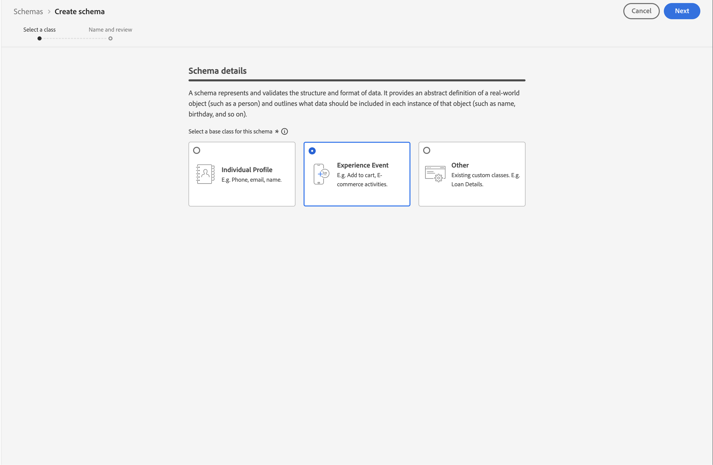

      >[!INFO]
      >
      >    Se utiliza un esquema de Evento de experiencia para modelar el _comportamiento_ de un perfil (como nombre de la escena, botón para añadir al carro de compras). Se utiliza un esquema de perfil individual para modelar los _atributos_ del perfil (como nombre, correo electrónico o sexo).

   1. Seleccione **[!UICONTROL Siguiente]**.

1. En el [!UICONTROL Nombre y paso de revisión] de la [!UICONTROL Crear esquema] asistente:

   1. Introduzca una **[!UICONTROL Nombre para mostrar del esquema]** para su esquema y (opcional) un **[!UICONTROL Descripción]**.

      

   1. Seleccione **[!UICONTROL Finalizar]**.

1. En la pestaña Estructura del esquema de ejemplo:

   1. Seleccione **[!UICONTROL + Agregar]** en [!UICONTROL Grupos de campos].

      

      Los grupos de campos son colecciones reutilizables de objetos y atributos que le permiten ampliar fácilmente su esquema.

   1. En el [!UICONTROL Adición de campos y grupos] , seleccione la **[!UICONTROL ExperienceEvent del SDK móvil de AEP]** de la lista.

      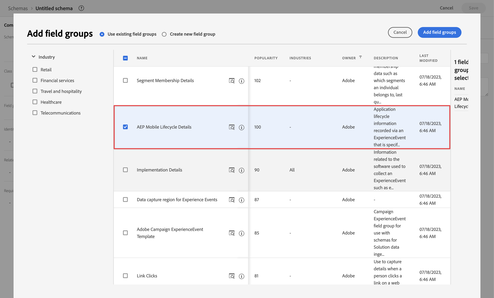

      Puede seleccionar el botón de vista previa para ver una vista previa de los campos que forman parte de este grupo de campos, como `application > name`.

      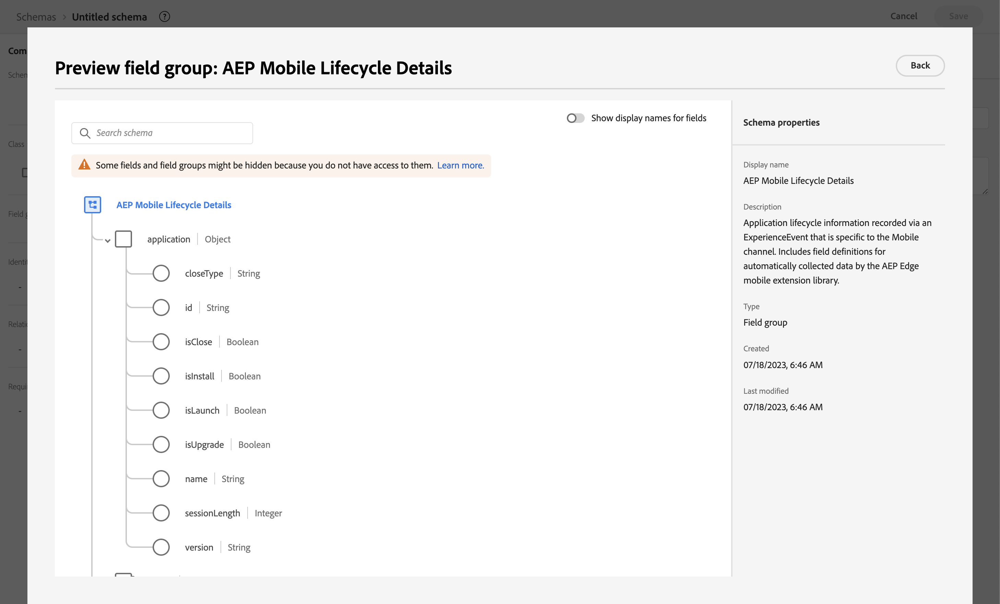

      Seleccione **[!UICONTROL Atrás]** para cerrar la vista previa.

   1. Seleccione **[!UICONTROL Agregar grupos de campos]**.

1. Seleccione **[!UICONTROL +]** junto al nombre del esquema en el panel [!UICONTROL Estructura].

   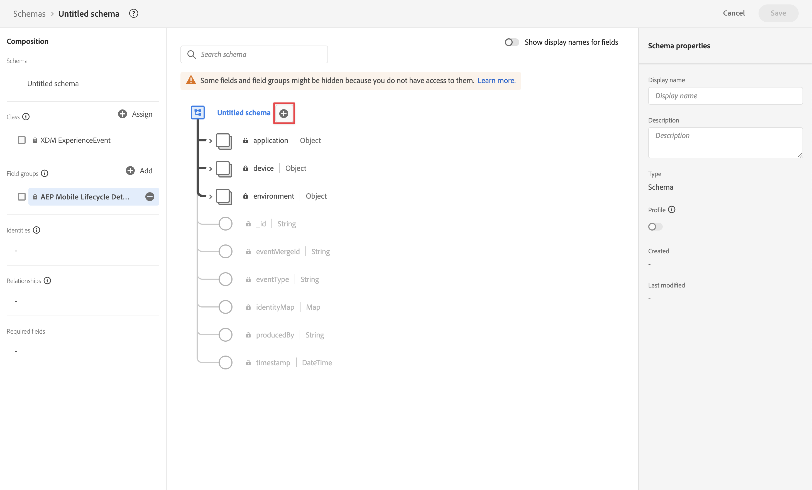

1. En el [!UICONTROL Propiedades del campo] panel, entrar `identification` como el [!UICONTROL Nombre de campo], **[!UICONTROL Identificación]** como el [!UICONTROL Nombre para mostrar], seleccione **[!UICONTROL Objeto]** como el [!UICONTROL Tipo] y seleccione **[!UICONTROL ExperienceEvent Core v2.1]** como el [!UICONTROL Grupo de campos].

   >[!NOTE]
   >
   >Si ese grupo de campos no está disponible, busque otro grupo de campos que contenga campos de identidad. O [crear un nuevo grupo de campos](https://experienceleague.adobe.com/docs/experience-platform/xdm/ui/resources/field-groups.html) y [añadir nuevos campos de identidad](https://experienceleague.adobe.com/docs/experience-platform/xdm/ui/fields/identity.html#define-a-identity-field) (like `ecid`, `crmId`y otros que necesite) al grupo de campos y seleccione ese nuevo grupo de campos.

   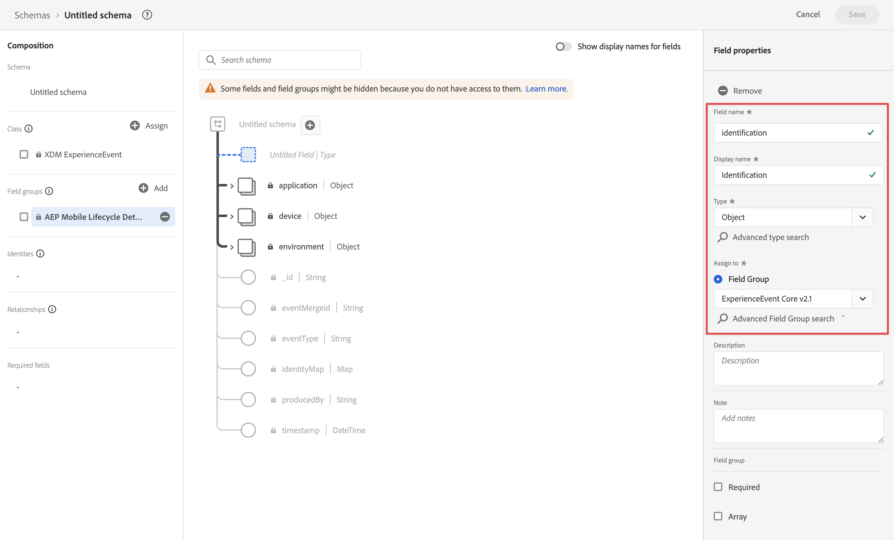

   El objeto de identificación agrega capacidades de identificación al esquema. En su caso, quiere identificar los perfiles que utilizan su aplicación móvil mediante el ID de Experience Cloud y la dirección de correo electrónico. Hay muchos otros atributos disponibles para rastrear la identificación de su persona (por ejemplo, ID de cliente, ID de fidelidad).

   Seleccione **[!UICONTROL Aplicar]** para agregar este objeto al esquema.

1. Seleccione el campo **[!UICONTROL ECID]** en el objeto de identificación que acaba de agregar y seleccione **[!UICONTROL Identidad]**, **[!UICONTROL Identidad principal]** y **[!UICONTROL ECID]** en la lista de [!UICONTROL Área de nombres de identidad] en el panel derecho.

   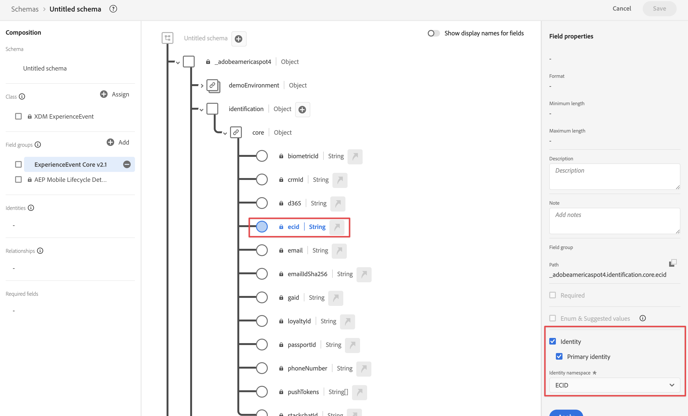

   Está especificando la identidad de Experience Cloud como la identidad principal que el servicio de identidad de Adobe Experience Platform puede utilizar para combinar (unir) el comportamiento de los perfiles con el mismo ECID.

   Seleccione **[!UICONTROL Aplicar]**. Verá que aparece un icono de huella digital en el atributo de ECID.

1. Seleccione el campo de **[!UICONTROL correo electrónico]** en el objeto de identificación que acaba de añadir y seleccione **[!UICONTROL Identidad]** y **[!UICONTROL Correo electrónico]** en la lista de [!UICONTROL Área de nombres de identidad] del panel [!UICONTROL Propiedades de campo].

   

   Está especificando la dirección de correo electrónico como otra identidad que el servicio de identidad de Adobe Experience Platform puede utilizar para combinar (unir) el comportamiento de los perfiles.

   Seleccione **[!UICONTROL Aplicar]**. Verá que aparece un icono de huella digital en el atributo de correo electrónico.

   Seleccione **[!UICONTROL Guardar]**.

1. Seleccione el elemento raíz del esquema que muestra el nombre del esquema y, a continuación, seleccione el conmutador **[!UICONTROL Perfil]**.

   Se le pedirá que habilite el esquema para el perfil. Tras la habilitación, cuando los datos se incorporan en conjuntos de datos basados en este esquema, los datos se combinan en el perfil del cliente en tiempo real.

   Consulte [Habilitar el esquema para utilizarlo en el perfil del cliente en tiempo real](https://experienceleague.adobe.com/docs/experience-platform/xdm/tutorials/create-schema-ui.html#profile) para obtener más información.

   >[!IMPORTANT]
   >
   >    Una vez guardado un esquema habilitado para perfil, ya no se puede deshabilitar para perfil.

   

1. Seleccione **[!UICONTROL Guardar]** para guardar el esquema.

Ha creado un esquema mínimo que modela los datos que puede capturar desde su aplicación móvil. El esquema permite identificar perfiles mediante la identidad de Experience Cloud y la dirección de correo electrónico. Al habilitar el esquema para el perfil, se garantiza que los datos capturados desde la aplicación móvil se añadan al perfil del cliente en tiempo real.

Junto a los datos de comportamiento, también puede capturar datos de atributos de perfil desde la aplicación móvil (por ejemplo, detalles de perfiles suscritos a un boletín informativo).

Para capturar datos de perfil, debería hacer lo siguiente:

- Crear un esquema basado en la clase Perfil individual XDM.

- Agregar el grupo de campos Profile Core v2 al esquema.

- Agregar un objeto de identificación basado en el grupo de campos Profile Core v2.

- Defina el ID de Experience Cloud como identificador principal y el correo electrónico como identificador.

- Habilitar el esquema para el perfil

Consulte [Crear y editar esquemas en la interfaz de usuario](https://experienceleague.adobe.com/docs/experience-platform/xdm/ui/resources/schemas.html?lang=es) para obtener más información sobre cómo agregar y quitar grupos de campos y campos individuales a un esquema.

### Configurar un conjunto de datos

Con el esquema, ha definido el modelo de datos. Ahora tiene que definir la construcción para almacenar y administrar esos datos mediante conjuntos de datos.

Para configurar un conjunto de datos:

1. En la interfaz de usuario de Adobe Experience Platform, en el carril izquierdo, seleccione **[!UICONTROL Conjuntos de datos]** en [!UICONTROL ADMINISTRACIÓN DE DATOS].

2. Seleccione **[!UICONTROL Crear conjunto de datos]**.

   

3. Seleccione **[!UICONTROL Crear conjunto de datos a partir de esquema]**.

   

4. Seleccione el esquema creado anteriormente y, después, **[!UICONTROL Siguiente]**.

5. Asigne un nombre al conjunto de datos y (opcionalmente) proporcione una descripción.

   

6. Seleccione **[!UICONTROL Finalizar]**.

7. Seleccione el conmutador **[!UICONTROL Perfil]**.

   Se le pedirá que habilite el conjunto de datos para el perfil. Una vez habilitado, el conjunto de datos enriquece los perfiles de clientes en tiempo real con sus datos ingeridos.

   >[!IMPORTANT]
   >
   >    Solo puede habilitar un conjunto de datos para un perfil cuando el esquema, al que se adhiere el conjunto de datos, también esté habilitado para el perfil.

   

Consulte [Guía de la interfaz de usuario de conjuntos de datos](https://experienceleague.adobe.com/docs/experience-platform/catalog/datasets/user-guide.html?lang=es) para obtener más información sobre cómo ver, previsualizar, crear o eliminar un conjunto de datos. Y cómo habilitar un conjunto de datos para el perfil del cliente en tiempo real.

## Configurar una secuencia de datos

Una secuencia de datos representa la configuración del lado del servidor al implementar los SDK web y móvil de Adobe Experience Platform. Al recopilar datos con los SDK de Adobe Experience Platform, los datos se envían a Adobe Experience Platform Edge Network. Es la secuencia de datos la que determina a qué servicios se reenvían los datos.

En la configuración, desea que los datos que recopila de la aplicación móvil se envíen al conjunto de datos en Adobe Experience Platform.

Para configurar la secuencia de datos, debe hacer lo siguiente:

1. En la interfaz de usuario de Adobe Experience Platform, seleccione **[!UICONTROL Secuencias de datos]** desde [!UICONTROL RECOPILACIÓN DE DATOS] en el carril izquierdo.

2. Seleccione **[!UICONTROL Nueva secuencia de datos]**.

3. Asigne un nombre y describa su secuencia de datos. Seleccione el esquema en la lista [!UICONTROL Esquema de eventos].

   

4. Seleccione **[!UICONTROL Guardar]**.

5. Seleccione **[!UICONTROL Agregar servicio]**.

6. En la pantalla [!UICONTROL Agregar servicio], debe hacer lo siguiente:

   1. Seleccione **[!UICONTROL Adobe Experience Platform]** en la lista [!UICONTROL Servicio].

   2. Asegúrese de que **[!UICONTROL Habilitado]** esté seleccionado.

   3. Seleccione su conjunto de datos en la lista [!UICONTROL Conjunto de datos de evento].

      

   4. Deje los demás ajustes y seleccione **[!UICONTROL Guardar]** para guardar la secuencia de datos.

El conjunto de datos ya está configurado para reenviar los datos recopilados desde la aplicación móvil al conjunto de datos en Adobe Experience Platform.

Consulte la [Información general sobre secuencias de datos](https://experienceleague.adobe.com/docs/experience-platform/edge/datastreams/overview.html?lang=es) para obtener más información sobre cómo configurar una secuencia de datos y cómo gestionar datos confidenciales.

## Usar etiquetas

Para implementar código en el sitio para recopilar datos, utilice la función Etiquetas de Adobe Experience Platform. Esta solución de administración de etiquetas le permite implementar código de junto con otros requisitos de etiquetado. Las etiquetas ofrecen una integración perfecta con Adobe Experience Platform mediante la extensión del SDK móvil de Adobe Experience Platform.

### Crear una etiqueta

1. En la interfaz de usuario de Adobe Experience Platform, en el carril izquierdo, seleccione **[!UICONTROL Etiquetas]** en [!UICONTROL RECOPILACIÓN DE DATOS].

2. Seleccione **[!UICONTROL Nueva propiedad]**.

   Asigne un nombre a la etiqueta y seleccione **[!UICONTROL Móvil]**. Seleccione **[!UICONTROL Guardar]** para continuar.

   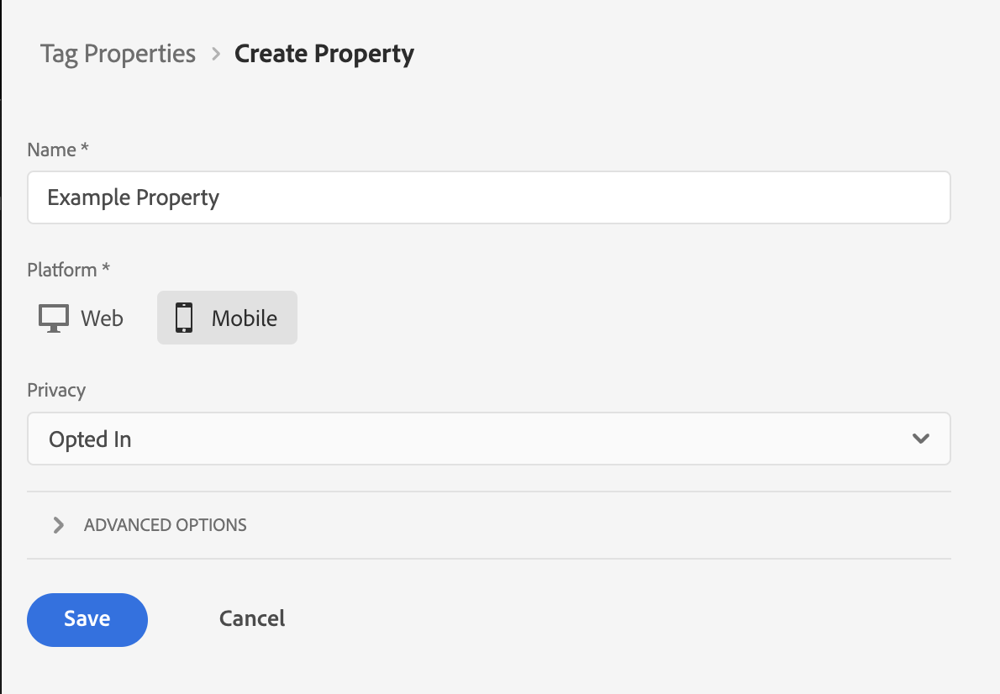

### Configurar una etiqueta

Después de crear la etiqueta, debe configurarla con las extensiones correctas y configurar los elementos de datos y las reglas según cómo quiera rastrear el sitio y enviar datos a Adobe Experience Platform.

Para configurarla, seleccione la etiqueta recién creada en la lista de [!UICONTROL Propiedades de etiqueta].

#### **Extensiones**

Añada la extensión de la red perimetral de la plataforma de Adobe a la etiqueta para asegurarse de que puede enviar datos a Adobe Experience Platform (a través de su secuencia de datos).

Para crear y configurar la extensión del SDK de Adobe Experience Platform Mobile:

1. Seleccionar **[!UICONTROL Extensiones]** en el carril izquierdo. Verá que las extensiones Mobile Core y Profile ya están disponibles.

1. Seleccione **[!UICONTROL Catálogo]** en la barra superior.

1. Busque o desplácese hasta el **[!UICONTROL Adobe Experience Platform Edge Network]** extensión y seleccione **[!UICONTROL Instalar]** en el panel derecho para instalarlo.

1. Seleccione la zona protegida y la secuencia de datos que ha creado anteriormente para su [!UICONTROL Entorno de producción], (opcionalmente) su [!UICONTROL Entorno de ensayo] y su [!UICONTROL Entorno de desarrollo].

   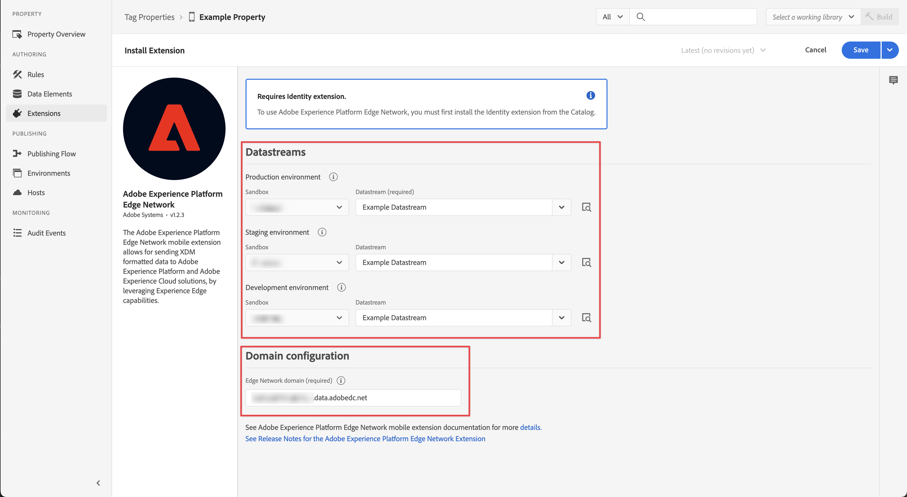

1. Introduzca su **[!UICONTROL Dominio de red perimetral]** debajo [!UICONTROL Configuración del dominio]. Normalmente se utiliza `<organizationName>.data.adobedc.net`.

1. Seleccione **[!UICONTROL Guardar]**.

Consulte [Configuración de la extensión de Adobe Experience Platform Edge Network](https://developer.adobe.com/client-sdks/documentation/edge-network) para obtener más información.

También desea configurar las siguientes extensiones adicionales del catálogo:

- Identidad.
- Garantía de AEP.
- Consentimiento.

Consulte [Configuración de una propiedad de etiqueta](https://experienceleague.adobe.com/docs/platform-learn/implement-mobile-sdk/initial-configuration/configure-tags.html?lang=es) en el Tutorial de aplicaciones móviles para Experience Platform para obtener mucha más información sobre las extensiones y su configuración.

#### **Elementos de datos**

Los Data Elements son los componentes básicos del diccionario de datos (o mapa de datos). Utilice Data Elements para recopilar, organizar y entregar datos a través de la tecnología de marketing y publicidad. Puede configurar elementos de datos en la etiqueta de que se lean desde datos o eventos de aplicaciones móviles y que se puedan utilizar para enviar datos a Adobe Experience Platform.

Por ejemplo, desea recopilar el nombre del operador de la aplicación móvil.

Para definir un elemento de datos de nombre de operador:

1. Seleccione **[!UICONTROL Elementos de datos]** en el carril izquierdo.

2. Seleccione **[!UICONTROL Agregar elemento de datos]**.

3. En el cuadro de diálogo [!UICONTROL Crear elemento de datos], haga lo siguiente:

   - Asigne un nombre al elemento de datos como, por ejemplo, `Carrier Name`.

   - Seleccionar **[!UICONTROL Mobile Core]** desde el [!UICONTROL Extensión] lista.

   - Seleccionar **[!UICONTROL Nombre del operador]** desde el [!UICONTROL Tipo de elemento de datos] lista.

     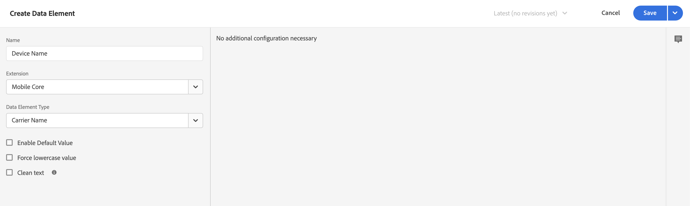

   - Seleccione **[!UICONTROL Guardar]**.

Puede crear tantos elementos de datos como desee y utilizarlos en reglas.

#### **Reglas**

Las etiquetas de Adobe Experience Platform siguen un sistema basado en reglas. Buscan la interacción de usuarios y datos asociados. Cuando se cumplen los criterios descritos en las reglas, la regla activa la extensión, script o el código del lado del cliente identificados. Puede utilizar reglas para enviar datos (como un objeto XDM) a Adobe Experience Platform mediante la extensión Adobe Experience Platform Edge Network.

Por ejemplo, desea enviar datos de evento cuando se utiliza la aplicación móvil (en primer plano) y cuando no se utiliza la aplicación móvil (devuelta al segundo plano).

Para definir una regla, debe hacer lo siguiente:

1. Seleccione **[!UICONTROL Reglas]** en el carril izquierdo.

2. Seleccione **[!UICONTROL Crear nueva regla]**.

3. En el cuadro de diálogo [!UICONTROL Crear regla], haga lo siguiente:

   - Asigne un nombre a la regla como, por ejemplo, `Application Status`.

   - Seleccione **[!UICONTROL + Agregar]**, bajo [!UICONTROL Eventos].

   - En el cuadro de diálogo [!UICONTROL Configuración de evento], haga lo siguiente:

      - Seleccionar **[!UICONTROL Mobile Core]** desde el [!UICONTROL Extensión] lista.

      - Seleccionar **[!UICONTROL Primer plano]** desde el [!UICONTROL Tipo de evento] lista.

      - Seleccione **[!UICONTROL Conservar cambios]**.

   - Clic  junto a [!UICONTROL Mobile Core - Primer plano].

      - Seleccionar **[!UICONTROL Mobile Core]** desde el [!UICONTROL Extensión] lista.

      - Seleccionar **[!UICONTROL Fondo]** desde el [!UICONTROL Tipo de evento] lista.

      - Seleccione **[!UICONTROL Conservar cambios]**.

   - Clic  Agregar debajo [!UICONTROL ACCIONES]. En el cuadro de diálogo [!UICONTROL Configuración de acción], haga lo siguiente:

      - Seleccionar **[!UICONTROL Adobe Experience Platform Edge Network]** desde el [!UICONTROL Extensión] lista.

      - Seleccionar **[!UICONTROL Reenviar evento a Edge Network]** desde el [!UICONTROL Tipo de acción] lista.

      - Seleccione **[!UICONTROL Conservar cambios]**.

   - La regla debe tener el siguiente aspecto:

     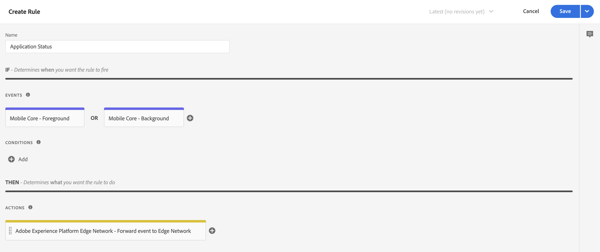

   - Seleccione **[!UICONTROL Guardar]**.

Lo anterior es solo un ejemplo de definición de una regla que envía datos XDM, que contienen el estado de la aplicación, a la red de Adobe Edge y a Adobe Experience Platform.

Puede utilizar las reglas de varias formas en la etiqueta para manipular las variables (mediante los elementos de datos).

Consulte [Reglas](https://developer.adobe.com/client-sdks/documentation/lifecycle-for-edge-network/#configure-a-rule-to-forward-lifecycle-metrics-to-platform) para obtener más información.

### Compilar y publicar una etiqueta

Después de haber definido elementos de datos y reglas, debe compilar y publicar la etiqueta. Al crear una compilación de biblioteca, debe asignarla a un entorno. Las extensiones, reglas y elementos de datos de la compilación se compilan y colocan en el entorno asignado. Cada entorno proporciona un código incrustado único que le permite integrar su compilación asignada en el sitio.

Para compilar y publicar una etiqueta, debe hacer lo siguiente:

1. Seleccione **[!UICONTROL Flujo de publicación]** en el carril izquierdo.

2. Seleccione **[!UICONTROL Seleccionar una biblioteca de trabajo]**, seguido de **[!UICONTROL Agregar biblioteca…]**.

3. En el cuadro de diálogo [!UICONTROL Crear biblioteca], haga lo siguiente:

   - Asigne un nombre a la biblioteca.

   - Seleccione **[!UICONTROL Desarrollo (desarrollo)]** en la lista [!UICONTROL Entorno].

   - Seleccione **[!UICONTROL + Agregar todos los recursos modificados]**.

     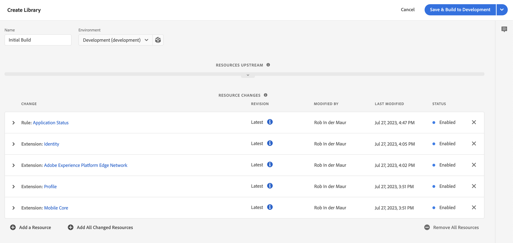

   - Seleccione **[!UICONTROL Guardar y compilar para desarrollo]**.

   La etiqueta se guardará y se compilará para su entorno de desarrollo. Un punto verde indica que la compilación de la etiqueta se ha realizado correctamente en el entorno de desarrollo.

4. Puede seleccionar **[!UICONTROL ...]** para recompilar la biblioteca o moverla a un entorno de ensayo o producción.

Las etiquetas de Adobe Experience Platform admiten flujos de trabajo de publicación simples o complejos que deben adaptarse a la implementación de Adobe Experience Platform Edge Network.

Consulte la [Información general de la publicación](https://developer.adobe.com/client-sdks/documentation/getting-started/create-a-mobile-property/#publish-the-configuration) para obtener más información.

### Recuperar el código de una etiqueta

Finalmente, debe utilizar la etiqueta dentro de la aplicación móvil que desea rastrear.

Para obtener instrucciones de código que expliquen cómo configurar la aplicación móvil y utilizar la etiqueta en la aplicación:

1. Seleccione **[!UICONTROL Entornos]** en el carril izquierdo.

2. En la lista de entornos, seleccione la instalación correcta  botón.

   En el [!UICONTROL Instrucciones de instalación de Mobile] , seleccione la plataforma adecuada ([!UICONTROL iOS], [!UICONTROL Android]). A continuación, utilice la copia  junto a cada uno de los fragmentos de código relevantes que desee utilizar para configurar e inicializar su aplicación móvil:

   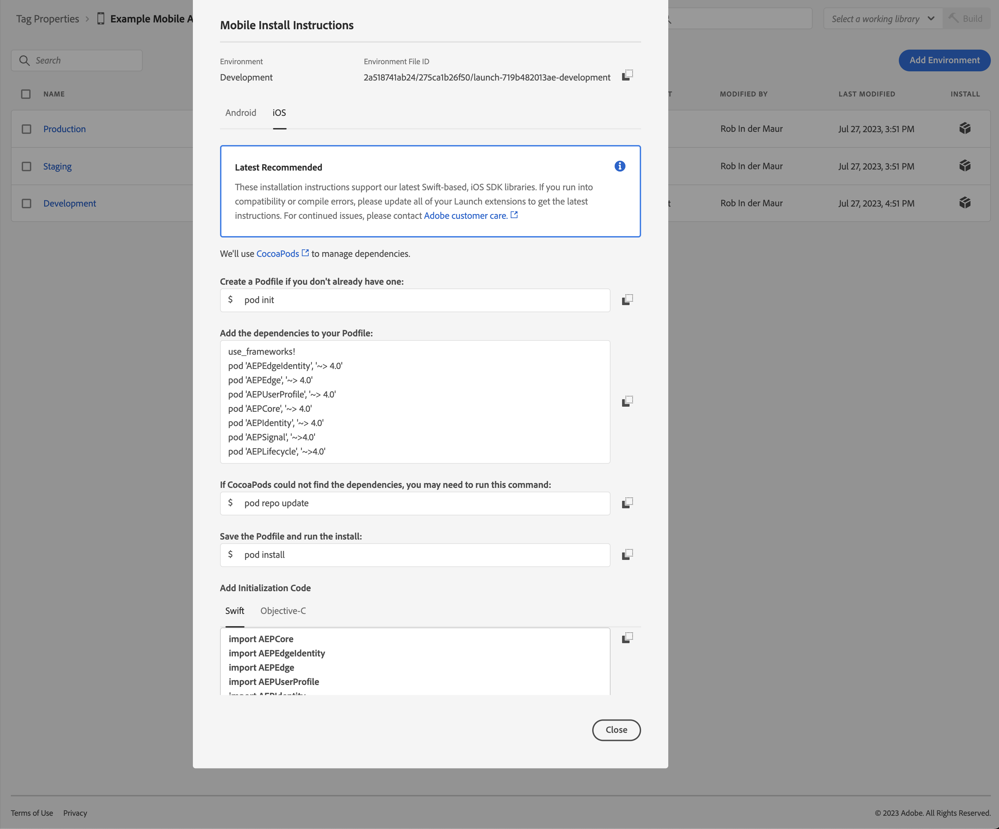

3. Seleccione **[!UICONTROL Cerrar]**.

En lugar del código para el entorno de desarrollo, podría haber seleccionado otro entorno (ensayo, producción) en función de dónde se encuentre en el proceso de implementación del SDK móvil de Adobe Experience Platform.

Consulte [Entornos](https://experienceleague.adobe.com/docs/experience-platform/tags/publish/environments/environments.html?lang=es) para obtener más información.

## Implementar y validar

Ahora puede implementar el código en su aplicación móvil. Cuando se implementa, la aplicación móvil empieza a recopilar datos en Adobe Experience Platform.

Valide la implementación, corrija lo que sea necesario y, una vez sea correcta, impleméntela en el entorno de ensayo y producción utilizando la función de flujo de trabajo de publicación de Etiquetas.

Consulte [Tutorial de implementación de Adobe Experience Cloud en aplicaciones móviles](https://experienceleague.adobe.com/docs/platform-learn/implement-mobile-sdk/overview.html?lang=es) para obtener información mucho más detallada.

## Configurar una conexión

Para utilizar los datos de Adobe Experience Platform en Customer Journey Analytics, se crea una conexión que incluye los datos resultantes de la configuración del esquema, el conjunto de datos y el flujo de trabajo.

Una conexión le permite integrar conjuntos de datos de Adobe Experience Platform en Workspace. Para informar sobre estos conjuntos de datos, primero debe establecer una conexión entre conjuntos de datos en Adobe Experience Platform y Workspace.

Para crear la conexión:

1. En la interfaz de usuario de Customer Journey Analytics, seleccione **[!UICONTROL Conexiones]** en la barra de navegación superior.

2. Seleccione **[!UICONTROL Crear nueva conexión]**.

3. En la pantalla [!UICONTROL Conexión sin título], haga lo siguiente:

   Asigne un nombre a la conexión y descríbala en [!UICONTROL Configuración de la conexión].

   Seleccione la zona protegida correcta en la lista [!UICONTROL Zona protegida] de [!UICONTROL Configuración de datos] y seleccione el número de eventos diarios en la lista [!UICONTROL Número medio de eventos diarios].

   

   Seleccione **[!UICONTROL Agregar conjuntos de datos]**.

   En el paso [!UICONTROL Seleccionar conjuntos de datos], en [!UICONTROL Agregar conjuntos de datos], haga lo siguiente:

   - Seleccione los conjuntos de datos que creó anteriormente u otros conjuntos de datos relevantes que desee incluir en su conexión (por ejemplo, datos de eventos de experiencia de seguimiento push y datos de perfil push de Adobe Journey Optimizer)

     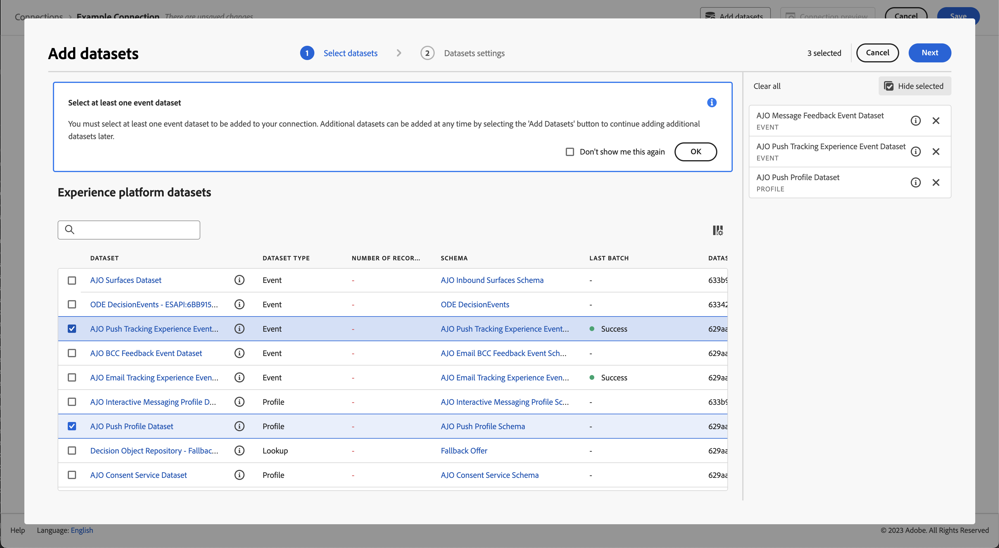

   - Seleccione **[!UICONTROL Siguiente]**.

   En el paso [!UICONTROL Configuración de conjuntos de datos], en [!UICONTROL Agregar conjuntos de datos], haga lo siguiente:

   - Para cada conjunto de datos:

      - Seleccione un [!UICONTROL ID de persona] entre las identidades disponibles de los esquemas del conjunto de datos en Adobe Experience Platform.

      - Seleccione la fuente de datos correcta en la lista [!UICONTROL Tipo de fuente de datos]. Si especifica **[!UICONTROL Otro]**, agregue una descripción para la fuente de datos.

      - Establezca **[!UICONTROL Importar todos los datos nuevos]** y **[!UICONTROL Datos existentes del relleno del conjunto de datos]** según sus preferencias.

     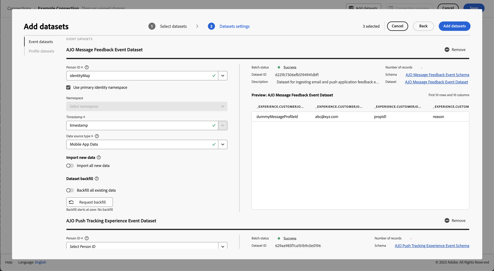

   - Seleccione **[!UICONTROL Agregar conjuntos de datos]**.

   Seleccione **[!UICONTROL Guardar]**.

Consulte [Información general sobre conexiones](../connections/overview.md) para obtener más información sobre cómo crear y administrar una conexión y cómo seleccionar y combinar conjuntos de datos.

## Configurar una vista de datos

Una vista de datos es un contenedor específico de Customer Journey Analytics que le permite determinar cómo interpretar los datos de una conexión. Especifica todas las dimensiones y métricas disponibles en Analysis Workspace y de qué columnas obtienen esos datos las dimensiones y métricas. Las vistas de datos se definen a fin de prepararse para la creación de informes en Analysis Workspace.

Para crear la vista de datos:

1. En la interfaz de usuario de Customer Journey Analytics, seleccione **[!UICONTROL Vistas de datos]** en la barra de navegación superior.

2. Seleccione **[!UICONTROL Crear nueva vista de datos]**.

3. En el paso [!UICONTROL Configurar], haga lo siguiente:

   Seleccione la conexión en la lista [!UICONTROL Conexión].

   Asigne un nombre y (opcionalmente) describa su conexión.

   

   Seleccione **[!UICONTROL Guardar y continuar]**.

4. En el paso [!UICONTROL Componentes], haga lo siguiente:

   Agregue cualquier campo de esquema o componente estándar que quiera incluir en los cuadros de componentes [!UICONTROL MÉTRICAS] o [!UICONTROL DIMENSIONES].

   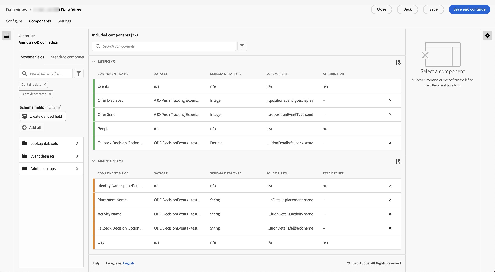

   Seleccione **[!UICONTROL Guardar y continuar]**.

5. En el paso [!UICONTROL Configuración], haga lo siguiente:

   Configuración de 

   Deje la configuración tal como está y seleccione **[!UICONTROL Guardar y finalizar]**.

Consulte [Información general de las vistas de datos](../data-views/data-views.md) para obtener más información sobre cómo crear y editar una vista de datos, qué componentes están disponibles para usar en la vista de datos y cómo usar la configuración de filtro y sesiones.

## Configurar un proyecto

Analysis Workspace es una herramienta de navegador flexible que le permite compilar análisis y compartir perspectivas rápidamente, en función de los datos. Los proyectos de Workspace se usan para combinar componentes, tablas y visualizaciones de datos para crear un análisis y compartirlo con cualquier persona de su organización.

Para crear un proyecto:

1. En la interfaz de usuario de Customer Journey Analytics, seleccione **[!UICONTROL Proyectos]** en la barra de navegación superior.

2. Seleccione **[!UICONTROL Proyectos]** en el panel de navegación izquierdo.

3. Seleccione **[!UICONTROL Crear proyecto]**.

   

   Seleccione **[!UICONTROL Proyecto en blanco]**.

   

4. Seleccione la vista de datos en la lista.

   .

5. Para crear el primer informe, comience a arrastrar y soltar dimensiones y métricas en la [!UICONTROL Tabla de forma libre] en el [!UICONTROL Panel] . Por ejemplo, arrastre `Events` como métricas y `Push Title` como dimensión, desglosada por `Event Type` para obtener una descripción general de las notificaciones push para su aplicación móvil y de lo que les ha sucedido.

   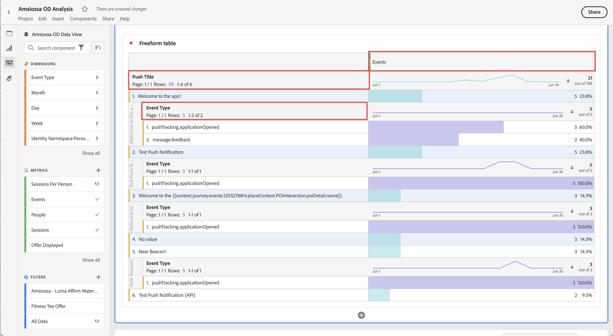

Consulte [Información general de Analysis Workspace](../analysis-workspace/home.md) para obtener más información sobre cómo crear proyectos y compilar su análisis mediante componentes, visualizaciones y paneles.

>[!SUCCESS]
>
>Ha completado todos los pasos. Empezando por definir qué datos desea recopilar (esquema) y dónde almacenarlos (conjunto de datos) en Adobe Experience Platform, ha configurado una secuencia de datos en Edge Network para garantizar que los datos se puedan reenviar a ese conjunto de datos. A continuación, definió e implementó la etiqueta de que contenía las extensiones (Adobe Experience Platform Edge Network y otras), los elementos de datos y las reglas para capturar datos de la aplicación móvil y enviarlos a la secuencia de datos. Ha definido una conexión en Customer Journey Analytics para utilizar los datos de seguimiento de notificaciones push de su aplicación móvil y otros datos. La definición de la vista de datos le permitió especificar qué dimensión y métricas utilizar y, finalmente, creó el primer proyecto que visualizó y analizó los datos de la aplicación móvil.
