# Ingesta de datos mediante el SDK web de Adobe Experience Platform y la red Edge

Esta guía de inicio rápido explica cómo puede ingerir datos de seguimiento de sitios web directamente en Adobe Experience Platform mediante el SDK web de Adobe Experience Platform y la red perimetral y, a continuación, utilizar esos datos en Customer Journey Analytics.

Para lograr esto, debe:

- **Configuración de un esquema y un conjunto de datos** en Adobe Experience Platform para definir el modelo (esquema) de los datos que desea recopilar y dónde recopilar realmente los datos (conjunto de datos).

- **Configuración de un conjunto de datos** para configurar la red perimetral de Adobe Experience Platform con el fin de enrutar los datos recopilados al conjunto de datos configurado en Adobe Experience Platform.

- **Usar etiquetas** para configurar fácilmente reglas y elementos de datos con respecto a los datos de la capa de datos de su sitio web y garantizar que los datos se envíen al conjunto de datos configurado en la red perimetral de Adobe Experience Platform.

- **Implementar y validar**. Tenga un entorno en el que pueda iterar en el desarrollo de etiquetas y, una vez validado todo, publíquelo en su entorno de producción.

- **Configuración de una conexión** en Customer Journey Analytics. Esta conexión debe incluir (al menos) su conjunto de datos de Adobe Experience Platform.

- **Configuración de una vista de datos** en Customer Journey Analytics para definir métricas y dimensiones que desee utilizar en Analysis Workspace.

- **Configuración de un proyecto** en Customer Journey Analytics para crear sus informes y visualizaciones.

>[!NOTE]
>
>Esta es una guía simplificada sobre cómo ingerir datos recopilados de su sitio en Adobe Experience Platform y utilizarlos en Customer Journey Analytics.  Se recomienda estudiar la información adicional cuando se haga referencia a ella.


## Configuración de un esquema y un conjunto de datos

Para introducir datos en Adobe Experience Platform, primero debe definir qué datos desea recopilar. Todos los datos introducidos en Adobe Experience Platform deben cumplir una estructura estándar y desnormalizada para que las funciones y características descendentes puedan reconocerlos y actuar en consecuencia. Experience Data Model (XDM) es el marco estándar que proporciona esta estructura en forma de esquemas.

Una vez que haya definido un esquema, utilizará uno o más conjuntos de datos para almacenar y administrar la recopilación de datos. Un conjunto de datos es una construcción de almacenamiento y administración para una colección de datos, normalmente una tabla, que contiene un esquema (columnas) y campos (filas).

Todos los datos introducidos en Adobe Experience Platform deben cumplir un esquema predefinido para que se puedan conservar como conjunto de datos.

### Configuración de un esquema

Desea rastrear datos mínimos de perfiles que visitan su sitio web, por ejemplo: nombre de página, identificación, etc.
Para ello, primero debe definir un esquema que modele estos datos.

Para configurar el esquema:

1. En la interfaz de usuario de Adobe Experience Platform, en el carril izquierdo, seleccione **[!UICONTROL Esquemas]** en [!UICONTROL ADMINISTRACIÓN DE DATOS].

2. Select **[!UICONTROL Crear esquema]**. Select **[!UICONTROL XDM ExperienceEvent]** de la lista de opciones.

   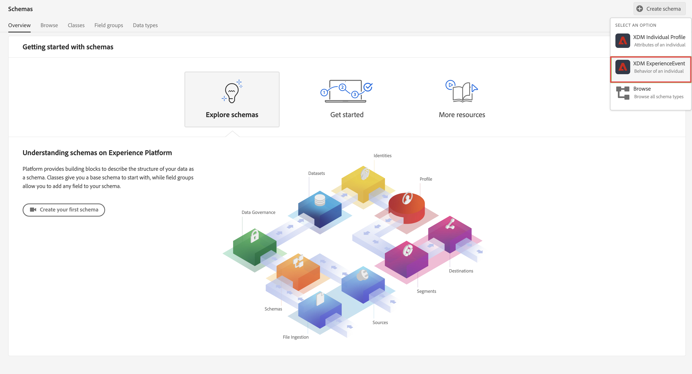

   >[!INFO]
   >
   >    Un esquema de eventos de experiencia se utiliza para modelar la variable _comportamiento_ de un perfil (como la vista de página, agregar al carro de compras). Se utiliza un esquema de perfil individual para modelar el perfil _attributes_ (como nombre, correo electrónico o sexo).


3. En el [!UICONTROL Esquema sin título] pantalla:

   1. Introduzca un nombre para mostrar para el esquema y (opcional) una descripción.

      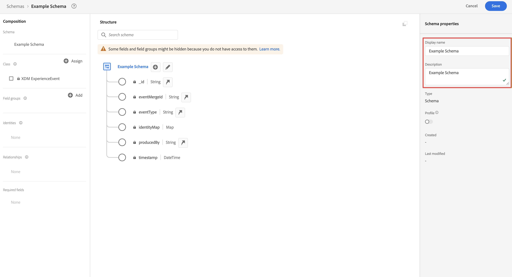

   2. Select **[!UICONTROL + Agregar]** en [!UICONTROL Grupos de campo].

      

      Los grupos de campos son colecciones reutilizables de objetos y atributos que permiten ampliar fácilmente el esquema.

   3. En el [!UICONTROL Agregar grupos de campos] seleccione **[!UICONTROL ExperienceEvent del SDK web de AEP]** grupo de campos de la lista.

      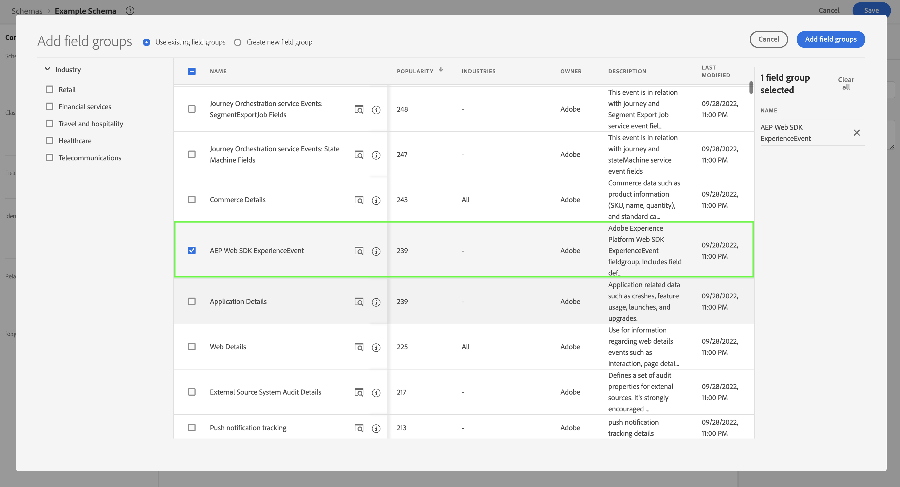

      Puede seleccionar el botón de vista previa para ver una vista previa de los campos que forman parte de este grupo de campos, como `web > webPageDetails > name`.

      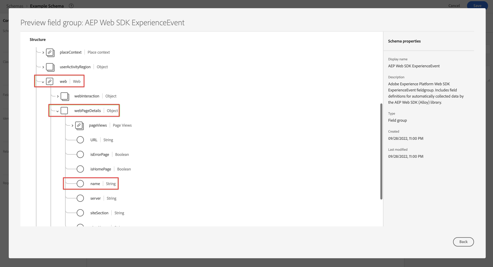

      Select **[!UICONTROL Atrás]** para cerrar la vista previa.

   4. Select **[!UICONTROL Agregar grupos de campos]**.

4. Select **[!UICONTROL +]** junto al nombre del esquema en la [!UICONTROL Estructura] panel.

   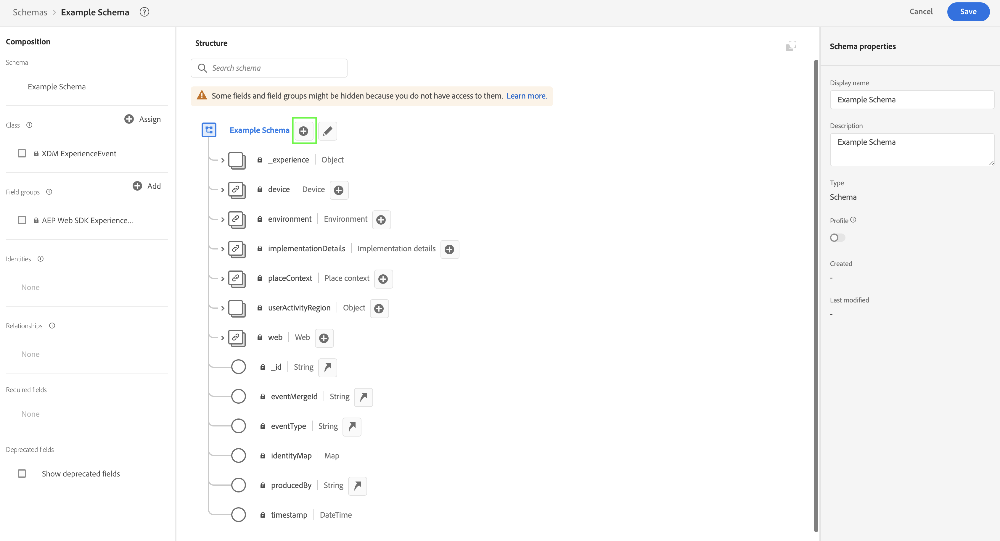

5. En el [!UICONTROL Propiedades de campo] , introduzca `Identification` como nombre, **[!UICONTROL Identificación]** como el [!UICONTROL Nombre para mostrar], seleccione **[!UICONTROL Objeto]** como el [!UICONTROL Tipo] y seleccione **[!UICONTROL ExperienceEvent Core v2.1]** como el [!UICONTROL Grupo de campos].

   

   Esto agregará capacidades de identificación al esquema. En su caso, desea identificar los perfiles que visitan el sitio mediante el ID de Experience Cloud y la dirección de correo electrónico. Hay muchos otros atributos disponibles para realizar un seguimiento de la identificación del visitante (por ejemplo, ID de cliente, ID de fidelidad, etc.).

   Select **[!UICONTROL Aplicar]** para añadir este objeto al esquema.

6. Seleccione el **[!UICONTROL ecid]** en el objeto de identificación que acaba de añadir y seleccione **[!UICONTROL Identidad]** y **[!UICONTROL Identidad principal]** y **[!UICONTROL ECID]** de la variable [!UICONTROL Área de nombres de identidad] en el panel derecho.

   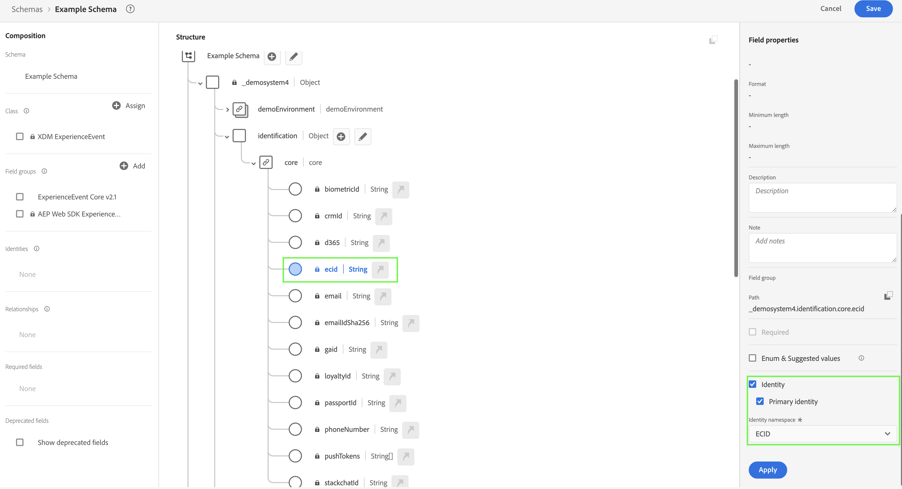

   Usted especifica la identidad del Experience Cloud como identidad principal que el servicio de identidad de Adobe Experience Platform puede utilizar para combinar (unir) el comportamiento de los perfiles con el mismo ECID.

   Select **[!UICONTROL Aplicar]**. Verá que aparece un icono de huella en el atributo ecid.

7. Seleccione el **[!UICONTROL email]** en el objeto de identificación que acaba de añadir y seleccione **[!UICONTROL Identidad]** y **[!UICONTROL Correo electrónico]** de la variable [!UICONTROL Área de nombres de identidad] en la [!UICONTROL Propiedades de campo] panel.

   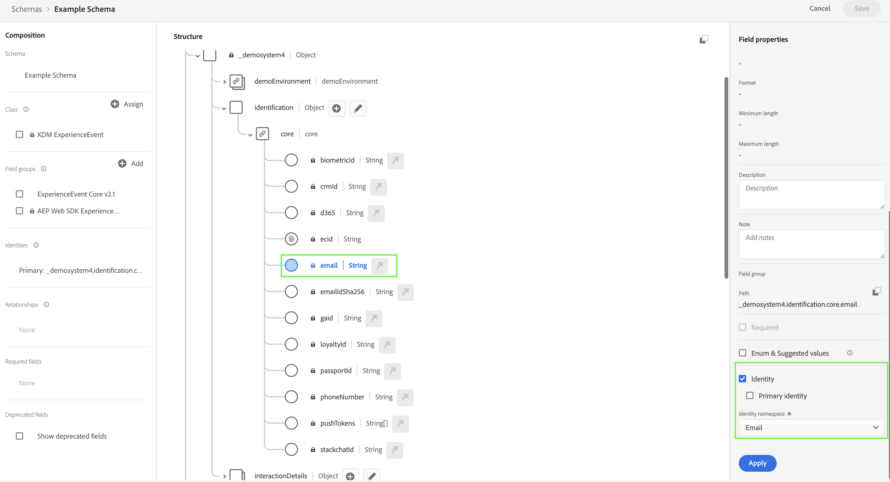

   Está especificando la dirección de correo electrónico como otra identidad que el servicio de identidad de Adobe Experience Platform puede utilizar para combinar (unir) el comportamiento de los perfiles.

   Select **[!UICONTROL Aplicar]**. Verá que aparece un icono de huella en el atributo de correo electrónico.

   Seleccione **[!UICONTROL Guardar]**.

8. Seleccione el elemento raíz del esquema que muestra el nombre del esquema y, a continuación, seleccione el **[!UICONTROL Perfil]** .

   Se le pedirá que habilite el esquema para el perfil. Una vez habilitados, cuando los datos se incorporen en conjuntos de datos basados en este esquema, esos datos se combinarán en el Perfil del cliente en tiempo real.

   Consulte [Habilitar el esquema para utilizarlo en el perfil de cliente en tiempo real](https://experienceleague.adobe.com/docs/experience-platform/xdm/tutorials/create-schema-ui.html?lang=en#profile) para obtener más información.

   >[!IMPORTANT]
   >
   >    Una vez guardado un esquema habilitado para perfil, ya no se puede deshabilitar para perfil.

   

9. Select **[!UICONTROL Guardar]** para guardar el esquema.

Ha creado un esquema mínimo que modela los datos que puede capturar del sitio web. El esquema permite identificar perfiles mediante la identidad del Experience Cloud y la dirección de correo electrónico. Al habilitar el esquema para el perfil, se asegura de que los datos capturados del sitio web se añadan al perfil del cliente en tiempo real.

Junto a los datos de comportamiento, también puede capturar datos de atributos de perfil de su sitio (por ejemplo, detalles de perfiles suscritos a un boletín informativo).

Para capturar estos datos de perfil, debe:

- Cree un esquema basado en la clase XDM Individual Profile .

- Agregue el grupo de campos Perfil principal v2 al esquema .

- Agregue un objeto de identificación basado en el grupo de campos Perfil Core v2 .

- Defina ecid como identificador principal y correo electrónico como identificador.

- Habilitar el esquema para el perfil

Consulte [Crear y editar esquemas en la interfaz de usuario](https://experienceleague.adobe.com/docs/experience-platform/xdm/ui/resources/schemas.html) para obtener más información sobre cómo agregar y quitar grupos de campos y campos individuales a un esquema.

### Configuración de un conjunto de datos

Con el esquema ha definido el modelo de datos. Ahora tiene que definir la construcción para almacenar y administrar esos datos. Esto se realiza mediante conjuntos de datos.

Para configurar su conjunto de datos:

1. En la interfaz de usuario de Adobe Experience Platform, en el carril izquierdo, seleccione **[!UICONTROL Conjuntos de datos]** en [!UICONTROL ADMINISTRACIÓN DE DATOS].

2. Select **[!UICONTROL Crear conjunto de datos]**.

   

3. Select **[!UICONTROL Crear conjunto de datos a partir del esquema]**.

   

4. Seleccione el esquema creado anteriormente y seleccione **[!UICONTROL Siguiente]**.

5. Asigne un nombre al conjunto de datos y (opcional) proporcione una descripción.

   

6. Select **[!UICONTROL Finalizar]**.

7. Seleccione el **[!UICONTROL Perfil]** .

   Se le pedirá que habilite el conjunto de datos para el perfil. Una vez habilitado, el conjunto de datos enriquecerá los perfiles de clientes en tiempo real con sus datos introducidos.

   >[!IMPORTANT]
   >
   >    Solo se puede habilitar un conjunto de datos para el perfil cuando el esquema, al que se adhiere el conjunto de datos, también esté habilitado para el perfil.

   

Consulte [Guía de la interfaz de usuario de conjuntos de datos](https://experienceleague.adobe.com/docs/experience-platform/catalog/datasets/user-guide.html?lang=es) para obtener más información sobre cómo ver, previsualizar, crear o eliminar un conjunto de datos. Y cómo habilitar un conjunto de datos para el perfil del cliente en tiempo real.

## Configuración de un conjunto de datos

Un conjunto de datos representa la configuración del lado del servidor al implementar los SDK web y móviles de Adobe Experience Platform. Al recopilar datos con los SDK de Adobe Experience Platform, los datos se envían a Adobe Experience Platform Edge Network. Es el conjunto de datos el que determina a qué servicios se reenvían los datos.

En la configuración, desea que los datos recopilados del sitio web se envíen a su conjunto de datos en Adobe Experience Platform.

Para configurar el conjunto de datos:

1. En la interfaz de usuario de Adobe Experience Platform, seleccione **[!UICONTROL Datastreams]** from [!UICONTROL RECOPILACIÓN DE DATOS] en el carril izquierdo.

2. Select **[!UICONTROL Nuevo conjunto de datos]**.

3. Asigne un nombre y describa su conjunto de datos. Seleccione el esquema de la variable [!UICONTROL Esquema de evento] lista.

   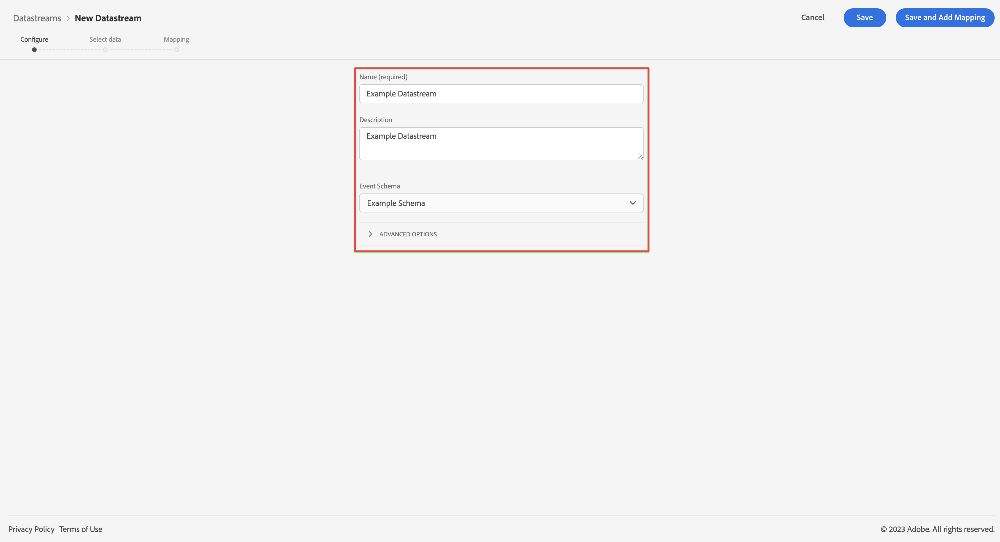

4. Seleccione **[!UICONTROL Guardar]**.

5. Select **[!UICONTROL Añadir servicio]**.

6. En el [!UICONTROL Pantalla Añadir servicio]:

   1. Select **[!UICONTROL Adobe Experience Platform]** de la variable [!UICONTROL Servicio] lista.

   2. Asegúrese **[!UICONTROL Habilitado]** está seleccionado.

   3. Seleccione su conjunto de datos desde el [!UICONTROL Conjunto de datos del evento] lista.

      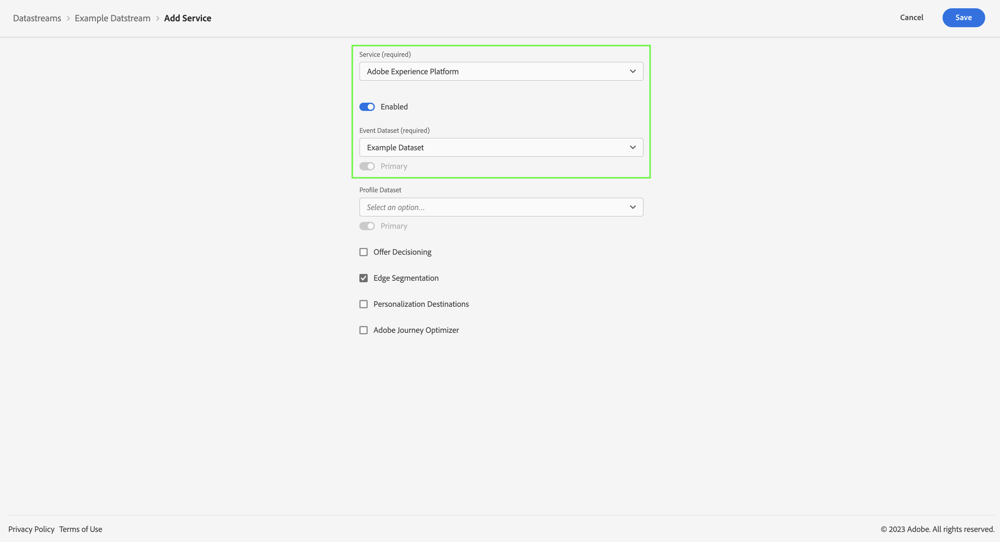

   4. Deje los demás ajustes y seleccione **[!UICONTROL Guardar]** para guardar el conjunto de datos.

El conjunto de datos ya está configurado para reenviar los datos recopilados de su sitio web a su conjunto de datos en Adobe Experience Platform.

Consulte [Información general sobre Datastreams](https://experienceleague.adobe.com/docs/experience-platform/edge/datastreams/overview.html?lang=es) para obtener más información sobre cómo configurar un conjunto de datos y cómo gestionar datos confidenciales.


## Usar etiquetas

Utilice la función Etiquetas de Adobe Experience Platform para implementar código en el sitio y recopilar datos. Esta solución de administración de etiquetas le permite implementar código de junto con otros requisitos de etiquetado. Las etiquetas ofrecen una integración perfecta con Adobe Experience Platform mediante la extensión web SDK de Adobe Experience Platform.

### Crear la etiqueta

1. En la interfaz de usuario de Adobe Experience Platform, en el carril izquierdo, seleccione **[!UICONTROL Etiquetas]** en [!UICONTROL RECOPILACIÓN DE DATOS].

2. Seleccione **[!UICONTROL Nueva propiedad]**.

   Asigne un nombre a la etiqueta y seleccione **[!UICONTROL Web]** e introduzca un nombre de dominio. Select **[!UICONTROL Guardar]** para continuar.

   

### Configurar la etiqueta

Después de crear la etiqueta, debe configurarla con las extensiones correctas y configurar los elementos de datos y las reglas según cómo desee rastrear el sitio y enviar datos a Adobe Experience Platform.

Seleccione la etiqueta recién creada de la lista de [!UICONTROL Propiedades de la etiqueta] para abrirlo.


#### **Extensiones**

Debe añadir la extensión del SDK web de la plataforma de Adobe a la etiqueta para asegurarse de que puede enviar datos a Adobe Experience Platform (a través del conjunto de datos).

Para crear y configurar la extensión del SDK web de Adobe Experience Platform:

1. Select **[!UICONTROL Extensiones]** en el carril izquierdo.

2. Select **[!UICONTROL Catálogo]** en la barra superior.

3. Busque o desplácese hasta la extensión web SDK de Adobe Experience Platform y seleccione **[!UICONTROL Instalar]** para instalarlo.

   

4. Seleccione el simulador de pruebas y el conjunto de datos creado anteriormente para su [!UICONTROL Entorno de producción] y (opcional) [!UICONTROL Entorno de ensayo] y [!UICONTROL Entorno de desarrollo].

   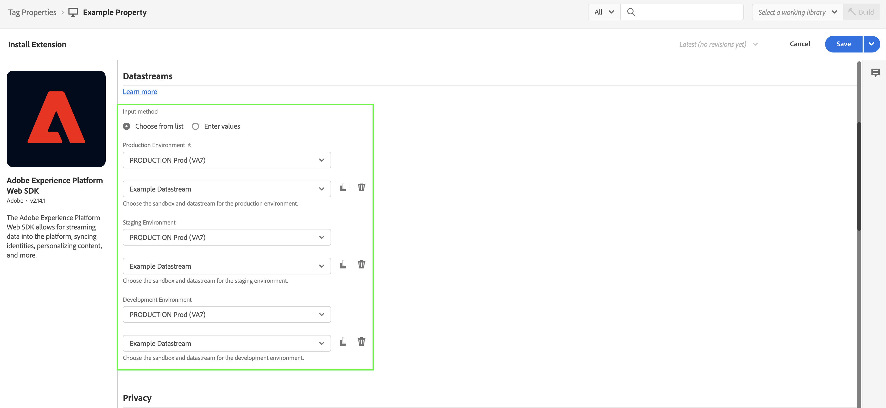

   Seleccione **[!UICONTROL Guardar]**.

Consulte [Configurar la extensión del SDK web de Adobe Experience Platform](https://experienceleague.adobe.com/docs/experience-platform/edge/extension/web-sdk-extension-configuration.html) para obtener más información.

También desea configurar la extensión del servicio de ID de Experience Cloud para que pueda utilizar fácilmente el servicio de ID de Experience Cloud. El servicio de ID de Experience Cloud identifica a los visitantes en todas las soluciones de Adobe Experience Cloud.

Para crear y configurar la extensión del servicio de ID de Experience Cloud:

1. Select **[!UICONTROL Extensiones]** en el carril izquierdo.

2. Select **[!UICONTROL Catálogo]** en la barra superior.

3. Busque o desplácese hasta la extensión del servicio de ID de Experience Cloud y seleccione **[!UICONTROL Instalar]** para instalarlo.

   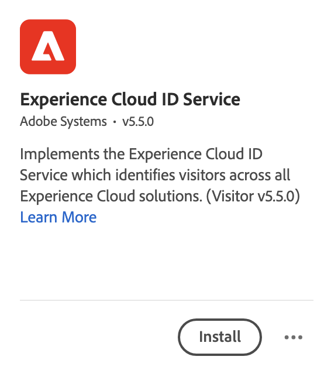

4. Deje todas las configuraciones en su valor predeterminado.

5. Seleccione **[!UICONTROL Guardar]**.

#### **Elementos de datos**

Los Data Elements son los componentes básicos del diccionario de datos (o mapa de datos). Utilice Data Elements para recopilar, organizar y entregar datos a través de la tecnología de marketing y publicidad. Configurará elementos de datos en la etiqueta que lean de la capa de datos y que pueden utilizarse para enviar datos a Adobe Experience Platform.

Existen diferentes tipos de elementos de datos. Primero configurará un elemento de datos para capturar el nombre de página que los visitantes están viendo en el sitio.

Para definir un elemento de datos de nombre de página:

1. Select **[!UICONTROL Elementos de datos]** en el carril izquierdo.

2. Select **[!UICONTROL Añadir elemento de datos]**.

3. En el [!UICONTROL Crear elemento de datos] diálogo:

   - Asigne un nombre al elemento de datos, por ejemplo: `Page Name`.

   - Select **[!UICONTROL Principal]** de la variable [!UICONTROL Extensión] lista.

   - Select **[!UICONTROL Información de página]** de la variable [!UICONTROL Tipo de elemento de datos] lista.

   - Select **[!UICONTROL Título]** de la variable [!UICONTROL Atributo] lista.

      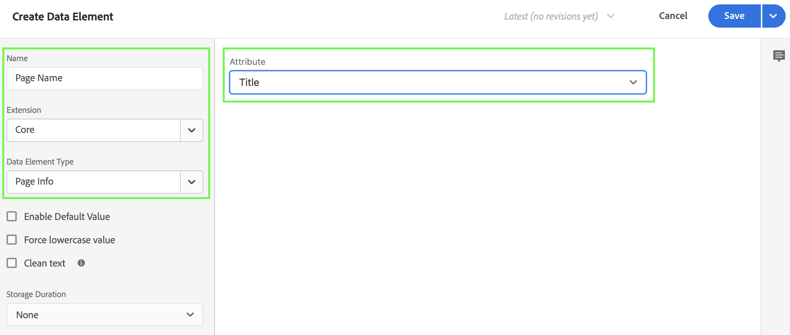

      Como alternativa, podría haber utilizado el valor de una variable de la capa de datos, por ejemplo, `pageName` y [!UICONTROL Variable JavaScript] tipo de elemento de datos para definir el elemento de datos.

      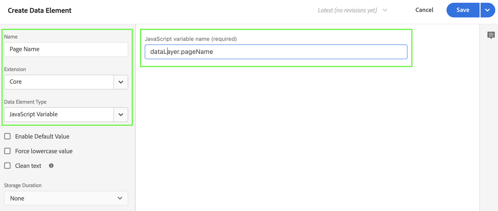

   - Seleccione **[!UICONTROL Guardar]**.

Ahora desea configurar un elemento de datos que haga referencia al ID de Experience Cloud que proporciona automáticamente el SDK web de Adobe Experience Platform y que está disponible a través de la extensión del servicio de ID de Experience Cloud.

Para definir un elemento de datos ECID:

1. Select **[!UICONTROL Elementos de datos]** en el carril izquierdo.

2. Select **[!UICONTROL Añadir elemento de datos]**.

3. En el [!UICONTROL Crear elemento de datos] diálogo:

   - Asigne un nombre al elemento de datos, por ejemplo: `ECID`.

   - Select **[!UICONTROL Servicio de ID de Experience Cloud]** de la variable [!UICONTROL Extensión] lista.

   - Select **[!UICONTROL ECID]** de la variable [!UICONTROL Tipo de elemento de datos] lista.

      

   - Seleccione **[!UICONTROL Guardar]**.

Por último, ahora desea asignar cualquiera de los elementos de datos específicos al esquema definido anteriormente. Debe definir otro elemento de datos que proporcione una representación del esquema XDM.

Para definir un elemento de datos de objeto XDM:

1. Select **[!UICONTROL Elementos de datos]** en el carril izquierdo.

2. Select **[!UICONTROL Añadir elemento de datos]**.

3. En el [!UICONTROL Crear elemento de datos] diálogo:

   - Asigne un nombre al elemento de datos, por ejemplo: `XDM - Page View`.

   - Select **[!UICONTROL SDK web de Adobe Experience Platform]** de la variable [!UICONTROL Extensión] lista.

   - Select **[!UICONTROL Objeto XDM]** de la variable [!UICONTROL Tipo de elemento de datos] lista.

   - Seleccione el simulador de pruebas en el [!UICONTROL Sandbox] lista.

   - Seleccione el esquema de la variable [!UICONTROL Esquema] lista.

   - Asigne la variable `identification > core > ecid` , definido en el esquema, al elemento de datos ECID. Seleccione el icono cilin der para elegir fácilmente el elemento de datos ECID de su lista de elementos de datos.

      

      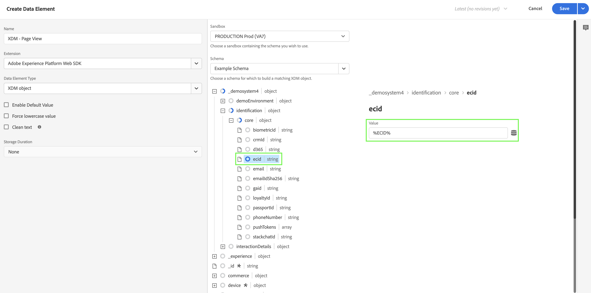


   - Asigne la variable `web > webPageDetails > name` , definido en el esquema, al elemento de datos Nombre de página .

      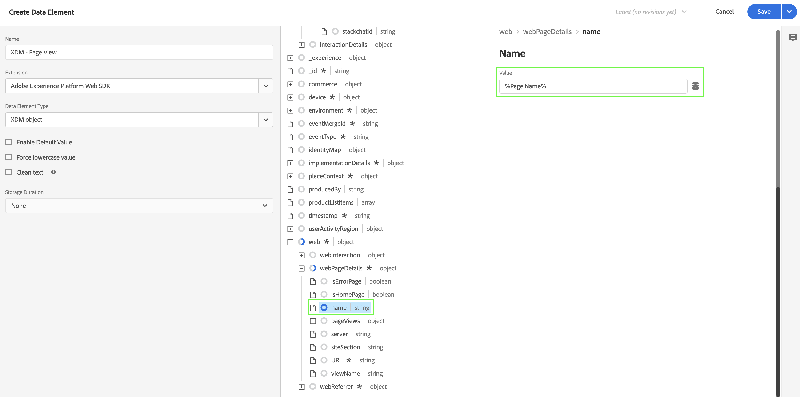

   - Seleccione **[!UICONTROL Guardar]**.


#### **Reglas**

Las etiquetas de Adobe Experience Platform siguen un sistema basado en reglas. Buscan la interacción de usuarios y datos asociados. Cuando se cumplen los criterios descritos en las reglas, la regla activa la extensión, script o el código del lado del cliente identificados. Puede utilizar reglas para enviar datos (como un objeto XDM) a Adobe Experience Platform mediante la extensión web SDK de Adobe Experience Platform.

Para definir una regla:

1. Select **[!UICONTROL Reglas]** en el carril izquierdo.

2. Select **[!UICONTROL Crear nueva regla]**.

3. En el [!UICONTROL Crear regla] diálogo:

   - Asigne un nombre a la regla, por ejemplo: `Page View`.

   - Select **[!UICONTROL + Agregar]** underneath [!UICONTROL Eventos].

   - En el [!UICONTROL Configuración de eventos] diálogo:

      - Select **[!UICONTROL Principal]** de la variable [!UICONTROL Extensión] lista.

      - Select **[!UICONTROL Window Loaded]** de la variable [!UICONTROL Tipo de evento] lista.

         

      - Seleccione **[!UICONTROL Conservar cambios]**.
   - Select **[!UICONTROL + Agregar]** underneath [!UICONTROL Acciones].

   - En el [!UICONTROL Configuración de la acción] diálogo:

      - Select **[!UICONTROL SDK web de Adobe Experience Platform]** de la variable [!UICONTROL Extensión] lista.

      - Select **[!UICONTROL Enviar evento]** de la variable [!UICONTROL Tipo de acción] lista.

      - Select **[!UICONTROL web.webpagedetails.pageViews]** de la variable [!UICONTROL Tipo] lista.

      - Seleccione el icono de cilin situado junto a  [!UICONTROL Datos XDM] y seleccione **[!UICONTROL XDM: vista de página]** de la lista de elementos de datos.

         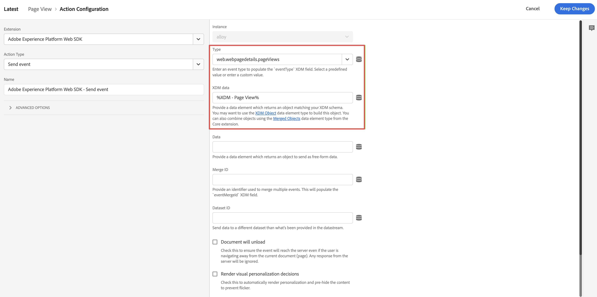

      - Seleccione **[!UICONTROL Conservar cambios]**.
   - La regla debería tener el siguiente aspecto:

      

   - Seleccione **[!UICONTROL Guardar]**.


Este es solo un ejemplo de definición de una regla que envía datos XDM, que contienen valores de otros elementos de datos, a Adobe Experience Platform.

Puede utilizar las reglas de varias formas en la etiqueta para manipular las variables (utilizando los elementos de datos).

Consulte [Reglas](https://experienceleague.adobe.com/docs/experience-platform/tags/ui/rules.html?lang=es) para obtener más información.

### Creación y publicación de una etiqueta

Después de haber definido elementos de datos y reglas, debe crear y publicar la etiqueta. Al crear una compilación de biblioteca, debe asignarla a un entorno. Las extensiones, reglas y elementos de datos de la compilación se compilan y colocan en el entorno asignado. Cada entorno proporciona un código incrustado único que le permite integrar su compilación asignada en el sitio.

Para crear y publicar la etiqueta:

1. Select **[!UICONTROL Flujo de publicación]** desde el carril izquierdo.

2. Select **[!UICONTROL Seleccionar una biblioteca de trabajo]**, seguido de **[!UICONTROL Agregar biblioteca...]**.

3. En el [!UICONTROL Crear biblioteca] diálogo:

   - Asigne un nombre a la biblioteca.

   - Select **[!UICONTROL Desarrollo (desarrollo)]** de la variable [!UICONTROL Entorno] lista.

   - Select **[!UICONTROL + Agregar todos los recursos modificados]**.

      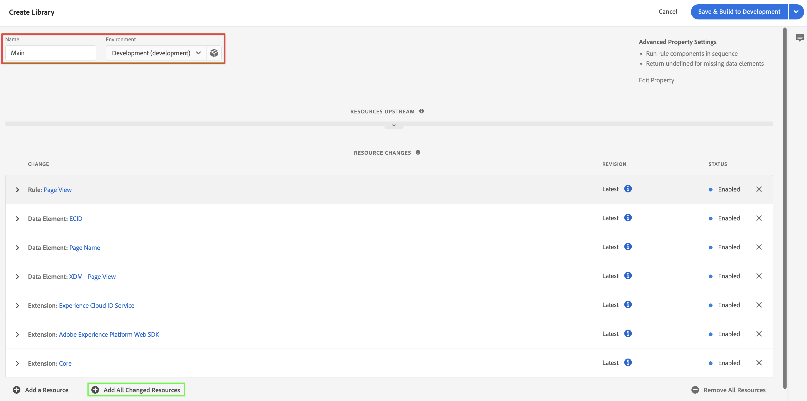

   - Select **[!UICONTROL Guardar y crear en desarrollo]**.

   Esto guarda y crea la etiqueta para su entorno de desarrollo. Un punto verde indica que la compilación de la etiqueta se ha realizado correctamente en el entorno de desarrollo.

4. Puede seleccionar **[!UICONTROL ...]** para reconstruir la biblioteca o moverla a un entorno de ensayo o producción.

   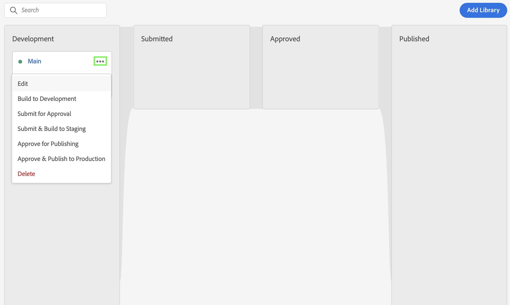

Las etiquetas de Adobe Experience Platform admiten flujos de trabajo de publicación sencillos o complejos que deberían acomodar su implementación del SDK web de Adobe Experience Platform.

Consulte [Información general sobre la publicación](https://experienceleague.adobe.com/docs/experience-platform/tags/publish/overview.html) para obtener más información.


### Recuperar el código de etiqueta

Finalmente, debe instalar la etiqueta en el sitio web que desee rastrear. Esto implica colocar el código en la etiqueta de encabezado de la plantilla de su sitio web.

Para obtener el código que hace referencia a la etiqueta :

1. Select **[!UICONTROL Entornos]** en el carril izquierdo.

2. En la lista de entornos, seleccione el botón de instalación (cuadro) correcto.

   En el [!UICONTROL Instrucciones de instalación en la web] seleccione el botón copiar junto al código de script que debería ser similar a:

   ```javascript
   <script src="https://assets.adobedtm.com/2a518741ab24/806645a0b9bb/launch-716db315b4e2-development.min.js" async></script>
   ```

   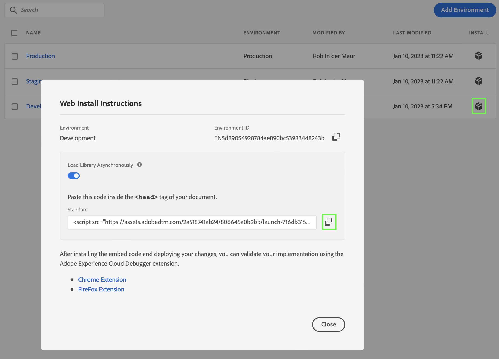

3. Select **[!UICONTROL Cerrar]**.

En lugar del código para el entorno de desarrollo, podría haber seleccionado otro entorno (ensayo, producción) en función de dónde se encuentre implementando el SDK web de Adobe Experience Platform.

Consulte [Entornos](https://experienceleague.adobe.com/docs/experience-platform/tags/publish/environments/environments.html?) para obtener más información.

## Implementar y validar

Ahora puede implementar el código en la versión de desarrollo de su sitio web dentro del `<head>` etiqueta. Cuando se implementa, el sitio web empezará a recopilar datos en Adobe Experience Platform.

Valide la implementación, corríjala donde sea necesario y, una vez correcta, impleméntelo en el entorno de ensayo y producción utilizando la función de flujo de trabajo de publicación de Etiquetas.

## Configuración de una conexión

Para utilizar los datos de Adobe Experience Platform en Customer Journey Analytics, se crea una conexión que incluye los datos resultantes de la configuración del esquema, el conjunto de datos y el flujo de trabajo.

Una conexión le permite integrar conjuntos de datos de Adobe Experience Platform el Espacio de trabajo. Para informar sobre estos conjuntos de datos, primero debe establecer una conexión entre conjuntos de datos en Adobe Experience Platform y Workspace.

Para crear la conexión:

1. En la interfaz de usuario del Customer Journey Analytics, seleccione **[!UICONTROL Conexiones]** en la barra de navegación superior.

2. Select **[!UICONTROL Crear nueva conexión]**.

3. En el [!UICONTROL Conexión sin título] pantalla:

   Asigne un nombre a la conexión y describa su [!UICONTROL Configuración de conexión].

   Seleccione el simulador de pruebas correcto en el [!UICONTROL Sandbox] en [!UICONTROL Configuración de datos] y seleccione el número de eventos diarios en la [!UICONTROL Promedio de eventos diarios] lista.

   

   Select **[!UICONTROL Agregar conjuntos de datos]**.

   En el [!UICONTROL Seleccionar conjuntos de datos] paso a paso [!UICONTROL Agregar conjuntos de datos]:

   - Seleccione el conjunto de datos creado anteriormente (`Example dataset`) y cualquier otro conjunto de datos que desee incluir en la conexión.

      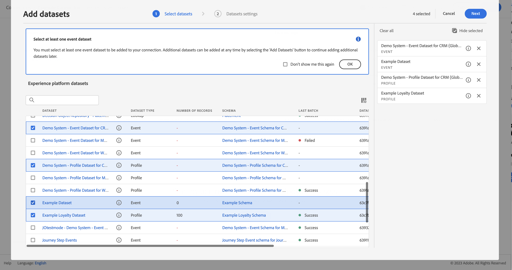

   - Seleccione **[!UICONTROL Siguiente]**.
   En el [!UICONTROL Configuración de conjuntos de datos] paso a paso [!UICONTROL Agregar conjuntos de datos]:

   - Para cada conjunto de datos:

      - Seleccione un [!UICONTROL ID de persona] de las identidades disponibles definidas en los esquemas de conjuntos de datos en Adobe Experience Platform.

      - Seleccione la fuente de datos correcta de la [!UICONTROL Tipo de fuente de datos] lista. Si especifica **[!UICONTROL Otro]** a continuación, agregue una descripción para la fuente de datos.

      - Establezca **[!UICONTROL Importar todos los datos nuevos]** y **[!UICONTROL Relleno de conjuntos de datos de datos existentes]** según sus preferencias.

      

   - Select **[!UICONTROL Agregar conjuntos de datos]**.
   Seleccione **[!UICONTROL Guardar]**.

Consulte [Información general sobre conexiones](../connections/overview.md) para obtener más información sobre cómo crear y administrar una conexión y cómo seleccionar y combinar conjuntos de datos.

## Configuración de una vista de datos

Una vista de datos es un contenedor específico de Customer Journey Analytics que le permite determinar cómo interpretar los datos de una conexión. Especifica todas las dimensiones y métricas disponibles en Analysis Workspace y de qué columnas obtienen esos datos las dimensiones y métricas. Las vistas de datos se definen a fin de prepararse para la creación de informes en Analysis Workspace.

Para crear la vista de datos:

1. En la interfaz de usuario del Customer Journey Analytics, seleccione **[!UICONTROL Vistas de datos]** en la barra de navegación superior.

2. Select **[!UICONTROL Crear nueva vista de datos]**.

3. En el [!UICONTROL Configurar] paso:

   Seleccione la conexión en el [!UICONTROL Conexión] lista.

   Nombre y (opcionalmente) describa su conexión.

   

   Select **[!UICONTROL Guardar y continuar]**.

4. En el [!UICONTROL Componentes] paso:

   Añada cualquier campo de esquema o componente estándar que desee incluir al [!UICONTROL MÉTRICAS] o [!UICONTROL Dimension] cuadros de componentes.

   

   Select **[!UICONTROL Guardar y continuar]**.

5. En el [!UICONTROL Configuración] paso:

   Configuración de 

   Deje la configuración tal como está y seleccione **[!UICONTROL Guardar y finalizar]**.

Consulte [Resumen de las vistas de datos](../data-views/data-views.md) para obtener más información sobre cómo crear y editar una vista de datos, qué componentes están disponibles para usar en la vista de datos y cómo usar la configuración de filtro y sesiones.


## Configuración de un proyecto

Analysis Workspace es una herramienta de navegador flexible que le permite crear análisis y compartir perspectivas rápidamente en función de sus datos. Los proyectos de Workspace se utilizan para combinar componentes de datos, tablas y visualizaciones para crear su análisis y compartirlo con cualquier persona de su organización.

Para crear el proyecto:

1. En la interfaz de usuario del Customer Journey Analytics, seleccione **[!UICONTROL Proyectos]** en la barra de navegación superior.

2. Select **[!UICONTROL Proyectos]** en el panel de navegación izquierdo.

3. Select **[!UICONTROL Crear proyecto]**.

   

   Select **[!UICONTROL Proyecto en blanco]**.

   

4. Seleccione la vista de datos de la lista.

   .

5. Comience a arrastrar y soltar dimensiones y métricas en la [!UICONTROL Tabla improvisada] en el [!UICONTROL Panel] para crear su primer informe. Por ejemplo, arrastre `Program Points Balance` y `Page View` como métricas y `email` como dimensión para obtener una visión general rápida de los perfiles que han visitado su sitio web y también forman parte del programa de fidelidad que recopila puntos de fidelidad.

   

Consulte [Información general de Analysis Workspace](../analysis-workspace/home.md) para obtener más información sobre cómo crear proyectos y crear su análisis mediante componentes, visualización y paneles.

>[!SUCCESS]
>
>Ha completado todos los pasos. Empezando por definir qué datos desea recopilar (esquema) y dónde almacenarlos (conjunto de datos) en Adobe Experience Platform, ha configurado un conjunto de datos en la red perimetral para garantizar que los datos se puedan reenviar a ese conjunto de datos. A continuación, definió e implementó la etiqueta que contiene las extensiones (Adobe Experience Platform Web SDK, servicio de ID de Experience Cloud), elementos de datos y reglas para capturar datos de su sitio web y enviarlos al conjunto de datos. Ha definido una conexión en Customer Journey Analytics para utilizar los datos de seguimiento del sitio web y otros datos. La definición de la vista de datos le permite especificar qué dimensión y métricas utilizar y, finalmente, creó su primer proyecto visualizando y analizando los datos.
