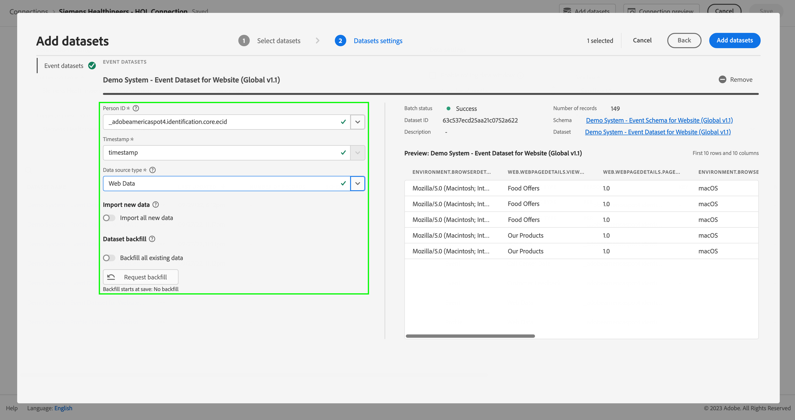

# Ingesta de datos mediante el SDK web de Adobe Experience Platform y Edge Network

Esta guía de inicio rápido explica cómo puede ingerir datos de seguimiento de sitios web directamente en Adobe Experience Platform mediante el SDK web de Adobe Experience Platform y Edge Network y, a continuación, utilizar esos datos en Customer Journey Analytics.

Para lograrlo, debe llevar a cabo lo siguiente:

- **Configurar un esquema y un conjunto de datos** en Adobe Experience Platform para definir el modelo (esquema) de los datos que desea recopilar y dónde recopilar realmente los datos (conjunto de datos).

- **Configurar una secuencia de datos** para configurar Adobe Experience Platform Edge Network con el fin de enrutar los datos recopilados al conjunto de datos configurado en Adobe Experience Platform.

- **Usar etiquetas** para configurar fácilmente reglas y elementos de datos con los datos de la capa de datos de su sitio web. A continuación, asegúrese de que los datos se envíen a la secuencia de datos configurada en Adobe Experience Platform Edge Network.

- **Implementar y validar**. Debe disponer de un entorno donde pueda iterar el desarrollo de etiquetas y, una vez validado todo, publicarlo en su entorno de producción.

- **Configurar una conexión** en Customer Journey Analytics. Esta conexión debe incluir (al menos) su conjunto de datos de Adobe Experience Platform.

- **Configurar una vista de datos** en Customer Journey Analytics para definir las métricas y las dimensiones que desea utilizar en Analysis Workspace.

- **Configurar un proyecto** en Customer Journey Analytics para crear sus informes y visualizaciones.

>[!NOTE]
>
>Esta es una guía simplificada sobre cómo ingerir datos recopilados de su sitio en Adobe Experience Platform y utilizarlos en Customer Journey Analytics. Se recomienda estudiar la información adicional cuando se haga referencia a ella.


## Configurar un esquema y un conjunto de datos

Para ingerir datos en Adobe Experience Platform, primero debe definir qué datos desea recopilar. Todos los datos ingeridos en Adobe Experience Platform deben cumplir una estructura estándar y desnormalizada para que las funciones y características consecutivas puedan reconocerlos y actuar en consecuencia. Experience Data Model (XDM) es el marco estándar que proporciona esta estructura en forma de esquemas.

Una vez definido un esquema, se utilizan uno o más conjuntos de datos para almacenar y administrar la recopilación de datos. Un conjunto de datos es una construcción de almacenamiento y administración para una colección de datos, normalmente una tabla, que contiene un esquema (columnas) y campos (filas).

Todos los datos ingeridos en Adobe Experience Platform deben cumplir un esquema predefinido para que se puedan conservar como conjunto de datos.

### Configurar un esquema

Desea rastrear algunos datos mínimos de los perfiles que visitan el sitio web como, por ejemplo, el nombre de la página o la identificación.
Para ello, primero debe definir un esquema que modele estos datos.

Para configurar el esquema:

1. En la interfaz de usuario de Adobe Experience Platform, en el carril izquierdo, seleccione **[!UICONTROL Esquemas]** en [!UICONTROL ADMINISTRACIÓN DE DATOS].

2. Seleccione **[!UICONTROL Crear esquema]**. Seleccione **[!UICONTROL XDM ExperienceEvent]** de la lista de opciones.

   

   >[!INFO]
   >
   >    Se utiliza un esquema de eventos de experiencia para modelar el _comportamiento_ de un perfil (como la vista de página, o agregar al carro de compras). Se utiliza un esquema de perfil individual para modelar los _atributos_ del perfil (como nombre, correo electrónico o sexo).


3. En la pantalla [!UICONTROL Esquema sin título]:

   1. Introduzca un nombre para mostrar para el esquema y (opcionalmente) una descripción.

      

   2. Seleccione **[!UICONTROL + Agregar]** en [!UICONTROL Grupos de campos].

      

      Los grupos de campos son colecciones reutilizables de objetos y atributos que le permiten ampliar fácilmente su esquema.

   3. En el cuadro de diálogo [!UICONTROL Agregar grupos de campos], seleccione el grupo de campos **[!UICONTROL ExperienceEvent del SDK web de AEP]** en la lista.

      

      Puede seleccionar el botón de vista previa para ver una vista previa de los campos que forman parte de este grupo de campos, como `web > webPageDetails > name`.

      

      Seleccione **[!UICONTROL Atrás]** para cerrar la vista previa.

   4. Seleccione **[!UICONTROL Agregar grupos de campos]**.

4. Seleccione **[!UICONTROL +]** junto al nombre del esquema en el panel [!UICONTROL Estructura].

   

5. En el panel [!UICONTROL Propiedades de campo], introduzca `Identification` como nombre, **[!UICONTROL Identificación]** como [!UICONTROL Nombre para mostrar], seleccione **[!UICONTROL Objeto]** como [!UICONTROL Tipo] y seleccione **[!UICONTROL ExperienceEvent Core v2.1]** como [!UICONTROL Grupo de campos].

   

   Esto añade capacidades de identificación al esquema. En su caso, desea identificar los perfiles que visitan el sitio mediante el Experience Cloud ID y la dirección de correo electrónico. Hay muchos otros atributos disponibles para realizar un seguimiento de la identificación del visitante (por ejemplo, ID de cliente o ID de fidelidad).

   Seleccione **[!UICONTROL Aplicar]** para agregar este objeto al esquema.

6. Seleccione el campo **[!UICONTROL ECID]** en el objeto de identificación que acaba de agregar y seleccione **[!UICONTROL Identidad]**, **[!UICONTROL Identidad principal]** y **[!UICONTROL ECID]** en la lista de [!UICONTROL Área de nombres de identidad] en el panel derecho.

   

   Está especificando la identidad de Experience Cloud como la identidad principal que el servicio de identidad de Adobe Experience Platform puede utilizar para combinar (unir) el comportamiento de los perfiles con el mismo ECID.

   Seleccione **[!UICONTROL Aplicar]**. Verá que aparece un icono de huella digital en el atributo de ECID.

7. Seleccione el campo de **[!UICONTROL correo electrónico]** en el objeto de identificación que acaba de añadir y seleccione **[!UICONTROL Identidad]** y **[!UICONTROL Correo electrónico]** en la lista de [!UICONTROL Área de nombres de identidad] del panel [!UICONTROL Propiedades de campo].

   

   Está especificando la dirección de correo electrónico como otra identidad que el servicio de identidad de Adobe Experience Platform puede utilizar para combinar (unir) el comportamiento de los perfiles.

   Seleccione **[!UICONTROL Aplicar]**. Verá que aparece un icono de huella digital en el atributo de correo electrónico.

   Seleccione **[!UICONTROL Guardar]**.

8. Seleccione el elemento raíz del esquema que muestra el nombre del esquema y, a continuación, seleccione el conmutador **[!UICONTROL Perfil]**.

   Se le pedirá que habilite el esquema para el perfil. Tras la habilitación, cuando los datos se incorporan en conjuntos de datos basados en este esquema, los datos se combinan en el perfil del cliente en tiempo real.

   Consulte [Habilitar el esquema para utilizarlo en el perfil del cliente en tiempo real](https://experienceleague.adobe.com/docs/experience-platform/xdm/tutorials/create-schema-ui.html?lang=es#profile) para obtener más información.

   >[!IMPORTANT]
   >
   >    Una vez guardado un esquema habilitado para perfil, ya no se puede deshabilitar para perfil.

   

9. Seleccione **[!UICONTROL Guardar]** para guardar el esquema.

Ha creado un esquema mínimo que modela los datos que puede capturar del sitio web. El esquema permite identificar perfiles mediante la identidad de Experience Cloud y la dirección de correo electrónico. Al habilitar el esquema para el perfil, se asegura de que los datos capturados del sitio web se agregan al perfil del cliente en tiempo real.

Junto a los datos de comportamiento, también puede capturar datos de atributos de perfil de su sitio (por ejemplo, detalles de perfiles que se subscriben a un boletín informativo).

Para capturar estos datos de perfil, debe hacer lo siguiente:

- Crear un esquema basado en la clase Perfil individual XDM.

- Agregar el grupo de campos Profile Core v2 al esquema.

- Agregar un objeto de identificación basado en el grupo de campos Profile Core v2.

- Definir ECID como identificador principal y el correo electrónico como identificador.

- Habilitar el esquema para el perfil

Consulte [Crear y editar esquemas en la interfaz de usuario](https://experienceleague.adobe.com/docs/experience-platform/xdm/ui/resources/schemas.html?lang=es) para obtener más información sobre cómo agregar y quitar grupos de campos y campos individuales a un esquema.

### Configurar un conjunto de datos

Con el esquema, ha definido el modelo de datos. Ahora tiene que definir la construcción para almacenar y administrar esos datos. Esto se realiza mediante conjuntos de datos.

Para configurar un conjunto de datos:

1. En la interfaz de usuario de Adobe Experience Platform, en el carril izquierdo, seleccione **[!UICONTROL Conjuntos de datos]** en [!UICONTROL ADMINISTRACIÓN DE DATOS].

2. Seleccione **[!UICONTROL Crear conjunto de datos]**.

   

3. Seleccione **[!UICONTROL Crear conjunto de datos a partir de esquema]**.

   

4. Seleccione el esquema creado anteriormente y, después, **[!UICONTROL Siguiente]**.

5. Asigne un nombre al conjunto de datos y (opcionalmente) proporcione una descripción.

   

6. Seleccione **[!UICONTROL Finalizar]**.

7. Seleccione el conmutador **[!UICONTROL Perfil]**.

   Se le pedirá que habilite el conjunto de datos para el perfil. Una vez habilitado, el conjunto de datos enriquece los perfiles de clientes en tiempo real con sus datos ingeridos.

   >[!IMPORTANT]
   >
   >    Solo puede habilitar un conjunto de datos para un perfil cuando el esquema, al que se adhiere el conjunto de datos, también esté habilitado para el perfil.

   

Consulte [Guía de la interfaz de usuario de conjuntos de datos](https://experienceleague.adobe.com/docs/experience-platform/catalog/datasets/user-guide.html?lang=es) para obtener más información sobre cómo ver, previsualizar, crear o eliminar un conjunto de datos. Y cómo habilitar un conjunto de datos para el perfil del cliente en tiempo real.

## Configurar una secuencia de datos

Una secuencia de datos representa la configuración del lado del servidor al implementar los SDK web y móvil de Adobe Experience Platform. Al recopilar datos con los SDK de Adobe Experience Platform, los datos se envían a Adobe Experience Platform Edge Network. Es la secuencia de datos lo que determina a qué servicios se reenvían los datos.

En la configuración, quiere que los datos recopilados del sitio web se envíen a su conjunto de datos en Adobe Experience Platform.

Para configurar la secuencia de datos, debe hacer lo siguiente:

1. En la interfaz de usuario de Adobe Experience Platform, seleccione **[!UICONTROL Secuencias de datos]** desde [!UICONTROL RECOPILACIÓN DE DATOS] en el carril izquierdo.

2. Seleccione **[!UICONTROL Nueva secuencia de datos]**.

3. Asigne un nombre y describa su secuencia de datos. Seleccione el esquema en la lista [!UICONTROL Esquema de eventos].

   

4. Seleccione **[!UICONTROL Guardar]**.

5. Seleccione **[!UICONTROL Agregar servicio]**.

6. En la pantalla [!UICONTROL Agregar servicio], debe hacer lo siguiente:

   1. Seleccione **[!UICONTROL Adobe Experience Platform]** en la lista [!UICONTROL Servicio].

   2. Asegúrese de que **[!UICONTROL Habilitado]** esté seleccionado.

   3. Seleccione su conjunto de datos en la lista [!UICONTROL Conjunto de datos de evento].

      

   4. Deje los demás ajustes y seleccione **[!UICONTROL Guardar]** para guardar la secuencia de datos.

La secuencia de datos ya está configurada para reenviar los datos recopilados de su sitio web a su conjunto de datos en Adobe Experience Platform.

Consulte la [Información general sobre secuencias de datos](https://experienceleague.adobe.com/docs/experience-platform/edge/datastreams/overview.html?lang=es) para obtener más información sobre cómo configurar una secuencia de datos y cómo gestionar datos confidenciales.


## Usar etiquetas

Utilice la función Etiquetas de Adobe Experience Platform a fin de implementar código en el sitio para recopilar datos. Esta solución de administración de etiquetas le permite implementar código de junto con otros requisitos de etiquetado. Las etiquetas ofrecen una integración perfecta con Adobe Experience Platform mediante la extensión del SDK web de Adobe Experience Platform.

### Crear una etiqueta

1. En la interfaz de usuario de Adobe Experience Platform, en el carril izquierdo, seleccione **[!UICONTROL Etiquetas]** en [!UICONTROL RECOPILACIÓN DE DATOS].

2. Seleccione **[!UICONTROL Nueva propiedad]**.

   Asigne un nombre a la etiqueta, seleccione **[!UICONTROL Web]** e introduzca un nombre de dominio. Seleccione **[!UICONTROL Guardar]** para continuar.

   

### Configurar una etiqueta

Después de crear la etiqueta, debe configurarla con las extensiones correctas y configurar los elementos de datos y las reglas según cómo quiera rastrear el sitio y enviar datos a Adobe Experience Platform.

Seleccione la etiqueta recién creada de la lista de [!UICONTROL Propiedades de la etiqueta] para abrirla.


#### **Extensiones**

Añada la extensión del SDK web de Adobe Experience Platform a la etiqueta para asegurarse de que puede enviar datos a Adobe Experience Platform (a través de la secuencia de datos).

Para crear y configurar la extensión del SDK web de Adobe Experience Platform, debe hacer lo siguiente:

1. Seleccione **[!UICONTROL Extensiones]** en el carril izquierdo.

2. Seleccione **[!UICONTROL Catálogo]** en la barra superior.

3. Busque o desplácese hasta la extensión del SDK web de Adobe Experience Platform y seleccione **[!UICONTROL Instalar]** para instalarla.

   

4. Seleccione la zona protegida y la secuencia de datos que ha creado anteriormente para su [!UICONTROL Entorno de producción], (opcionalmente) su [!UICONTROL Entorno de ensayo] y su [!UICONTROL Entorno de desarrollo].

   

   Seleccione **[!UICONTROL Guardar]**.

Consulte [Configurar la extensión del SDK web de Adobe Experience Platform](https://experienceleague.adobe.com/docs/experience-platform/edge/extension/web-sdk-extension-configuration.html?lang=es) para obtener más información.

También desea configurar la extensión del servicio  de Experience Cloud ID para poder utilizar fácilmente el ID de Experience Cloud. El servicio de Experience Cloud ID identifica a los visitantes en todas las soluciones de Adobe Experience Cloud.

Para crear y configurar la extensión del servicio de Experience Cloud ID, debe hacer lo siguiente:

1. Seleccione **[!UICONTROL Extensiones]** en el carril izquierdo.

2. Seleccione **[!UICONTROL Catálogo]** en la barra superior.

3. Busque o desplácese hasta la extensión del servicio  de Experience Cloud ID y seleccione **[!UICONTROL Instalar]** para instalarla.

   

4. Deje todas las configuraciones en su valor predeterminado.

5. Seleccione **[!UICONTROL Guardar]**.

#### **Elementos de datos**

Los Data Elements son los componentes básicos del diccionario de datos (o mapa de datos). Utilice Data Elements para recopilar, organizar y entregar datos a través de la tecnología de marketing y publicidad. Los elementos de datos de la etiqueta se configuran para que se lean en la capa de datos y se puedan utilizar para enviar datos a Adobe Experience Platform.

Existen diferentes tipos de elementos de datos. En primer lugar, debe configurar un elemento de datos para capturar el nombre de página que los visitantes están viendo en el sitio.

Para definir un elemento de datos de nombre de página, debe hacer lo siguiente:

1. Seleccione **[!UICONTROL Elementos de datos]** en el carril izquierdo.

2. Seleccione **[!UICONTROL Agregar elemento de datos]**.

3. En el cuadro de diálogo [!UICONTROL Crear elemento de datos], haga lo siguiente:

   - Asigne un nombre al elemento de datos como, por ejemplo, `Page Name`.

   - Seleccione **[!UICONTROL Principal]** en la lista [!UICONTROL Extensión].

   - Seleccione **[!UICONTROL Información de página]** en la lista [!UICONTROL Tipo de elemento de datos].

   - Seleccione **[!UICONTROL Título]** en la lista [!UICONTROL Atributo].

      

      Como alternativa, podría haber utilizado el valor de una variable de la capa de datos, por ejemplo `pageName`, y el tipo de elemento de datos [!UICONTROL Variable JavaScript] para definir el elemento de datos.

      

   - Seleccione **[!UICONTROL Guardar]**.

Ahora desea configurar un elemento de datos que haga referencia al Experience Cloud ID que proporciona automáticamente el SDK web de Adobe Experience Platform y que está disponible a través de la extensión del servicio de ID de Experience Cloud.

Para definir un elemento de datos ECID, debe hacer lo siguiente:

1. Seleccione **[!UICONTROL Elementos de datos]** en el carril izquierdo.

2. Seleccione **[!UICONTROL Agregar elemento de datos]**.

3. En el cuadro de diálogo [!UICONTROL Crear elemento de datos], haga lo siguiente:

   - Asigne un nombre al elemento de datos, por ejemplo `ECID`.

   - Seleccione **[!UICONTROL Servicio de Experience Cloud ID]** en la lista [!UICONTROL Extensión].

   - Seleccione **[!UICONTROL ECID]** en la lista [!UICONTROL Tipo de elemento de datos].

      

   - Seleccione **[!UICONTROL Guardar]**.

Por último, ahora desea asignar cualquiera de los elementos de datos específicos al esquema definido anteriormente. Puede definir otro elemento de datos que proporcione una representación del esquema XDM.

Para definir un elemento de datos de objeto XDM, debe hacer lo siguiente:

1. Seleccione **[!UICONTROL Elementos de datos]** en el carril izquierdo.

2. Seleccione **[!UICONTROL Agregar elemento de datos]**.

3. En el cuadro de diálogo [!UICONTROL Crear elemento de datos], haga lo siguiente:

   - Asigne un nombre al elemento de datos, por ejemplo `XDM - Page View`.

   - Seleccione **[!UICONTROL SDK web de Adobe Experience Platform]** en la lista [!UICONTROL Extensión].

   - Seleccione **[!UICONTROL Objeto XDM]** en la lista [!UICONTROL Tipo de elemento de datos].

   - Seleccione la zona protegida en la lista [!UICONTROL Zona protegida].

   - Seleccione el esquema en la lista [!UICONTROL Esquema].

   - Asigne el atributo `identification > core > ecid`, definido en el esquema, al elemento de datos ECID. Seleccione el icono del cilindro para elegir fácilmente el elemento de datos ECID de su lista de elementos de datos.

      

      


   - Asigne el atributo `web > webPageDetails > name`, definido en el esquema, al elemento de datos Nombre de página.

      

   - Seleccione **[!UICONTROL Guardar]**.


#### **Reglas**

Las etiquetas de Adobe Experience Platform siguen un sistema basado en reglas. Buscan la interacción de usuarios y datos asociados. Cuando se cumplen los criterios descritos en las reglas, la regla activa la extensión, script o el código del lado del cliente identificados. Puede utilizar reglas para enviar datos (como un objeto XDM) a Adobe Experience Platform mediante la extensión del SDK web de Adobe Experience Platform.

Para definir una regla, debe hacer lo siguiente:

1. Seleccione **[!UICONTROL Reglas]** en el carril izquierdo.

2. Seleccione **[!UICONTROL Crear nueva regla]**.

3. En el cuadro de diálogo [!UICONTROL Crear regla], haga lo siguiente:

   - Asigne un nombre a la regla como, por ejemplo, `Page View`.

   - Seleccione **[!UICONTROL + Agregar]**, bajo [!UICONTROL Eventos].

   - En el cuadro de diálogo [!UICONTROL Configuración de evento], haga lo siguiente:

      - Seleccione **[!UICONTROL Principal]** en la lista [!UICONTROL Extensión].

      - Seleccione **[!UICONTROL Ventana cargada]** en la lista [!UICONTROL Tipo de evento].

         

      - Seleccione **[!UICONTROL Conservar cambios]**.
   - Seleccione **[!UICONTROL + Agregar]**, bajo [!UICONTROL Acciones].

   - En el cuadro de diálogo [!UICONTROL Configuración de acción], haga lo siguiente:

      - Seleccione **[!UICONTROL SDK web de Adobe Experience Platform]** en la lista [!UICONTROL Extensión].

      - Seleccione **[!UICONTROL Enviar evento]** en la lista [!UICONTROL Tipo de acción].

      - Seleccione **[!UICONTROL web.webpagedetails.pageViews]** en la lista [!UICONTROL Tipo].

      - Seleccione el icono de cilindro situado junto a [!UICONTROL Datos XDM] y seleccione **[!UICONTROL XDM - Vista de página]** en la lista de elementos de datos.

         

      - Seleccione **[!UICONTROL Conservar cambios]**.
   - La regla debe tener el siguiente aspecto:

      

   - Seleccione **[!UICONTROL Guardar]**.


Este es solo un ejemplo de definición de una regla que envía datos XDM, que contienen valores de otros elementos de datos, a Adobe Experience Platform.

Puede utilizar las reglas de varias formas en la etiqueta para manipular las variables (mediante los elementos de datos).

Consulte [Reglas](https://experienceleague.adobe.com/docs/experience-platform/tags/ui/rules.html?lang=es) para obtener más información.

### Compilar y publicar una etiqueta

Después de haber definido elementos de datos y reglas, debe compilar y publicar la etiqueta. Al crear una compilación de biblioteca, debe asignarla a un entorno. Las extensiones, reglas y elementos de datos de la compilación se compilan y colocan en el entorno asignado. Cada entorno proporciona un código incrustado único que le permite integrar su compilación asignada en el sitio.

Para compilar y publicar una etiqueta, debe hacer lo siguiente:

1. Seleccione **[!UICONTROL Flujo de publicación]** en el carril izquierdo.

2. Seleccione **[!UICONTROL Seleccionar una biblioteca de trabajo]**, seguido de **[!UICONTROL Agregar biblioteca…]**.

3. En el cuadro de diálogo [!UICONTROL Crear biblioteca], haga lo siguiente:

   - Asigne un nombre a la biblioteca.

   - Seleccione **[!UICONTROL Desarrollo (desarrollo)]** en la lista [!UICONTROL Entorno].

   - Seleccione **[!UICONTROL + Agregar todos los recursos modificados]**.

      

   - Seleccione **[!UICONTROL Guardar y compilar para desarrollo]**.

   Esto guarda y compila la etiqueta para el entorno de desarrollo. Un punto verde indica que la compilación de la etiqueta se ha realizado correctamente en el entorno de desarrollo.

4. Puede seleccionar **[!UICONTROL ...]** para recompilar la biblioteca o moverla a un entorno de ensayo o producción.

   

Las etiquetas de Adobe Experience Platform admiten flujos de trabajo de publicación simples o complejos que deben admitir la implementación del SDK web de Adobe Experience Platform.

Consulte la [Información general de la publicación](https://experienceleague.adobe.com/docs/experience-platform/tags/publish/overview.html?lang=es) para obtener más información.


### Recuperar el código de una etiqueta

Por último, debe instalar la etiqueta en el sitio web que quiera rastrear. Esto implica colocar el código en la etiqueta de encabezado de la plantilla de su sitio web.

Para obtener el código que hace referencia a la etiqueta, debe hacer lo siguiente:

1. Seleccione **[!UICONTROL Entornos]** en el carril izquierdo.

2. En la lista de entornos, seleccione el botón (cuadro) de instalación correcto.

   En el cuadro de diálogo [!UICONTROL Instrucciones de instalación en la web] seleccione el botón para copiar junto al código de script que debería ser parecido a:

   ```javascript
   <script src="https://assets.adobedtm.com/2a518741ab24/.../launch-...-development.min.js" async></script>
   ```

   

3. Seleccione **[!UICONTROL Cerrar]**.

En lugar del código para el entorno de desarrollo, puede seleccionar otro entorno (ensayo o producción) en función de dónde se encuentre en el proceso de implementación del SDK web de Adobe Experience Platform.

Consulte [Entornos](https://experienceleague.adobe.com/docs/experience-platform/tags/publish/environments/environments.html?lang=es) para obtener más información.

## Implementar y validar

Ahora puede implementar el código en la versión de desarrollo de su sitio web dentro de la etiqueta `<head>`. Cuando se implementa, el sitio web comienza a recopilar datos en Adobe Experience Platform.

Valide la implementación, corrija lo que sea necesario y, una vez sea correcta, impleméntela en el entorno de ensayo y producción utilizando la función de flujo de trabajo de publicación de Etiquetas.

## Configurar una conexión

Para utilizar los datos de Adobe Experience Platform en Customer Journey Analytics, se crea una conexión que incluye los datos resultantes de la configuración del esquema, el conjunto de datos y el flujo de trabajo.

Una conexión le permite integrar conjuntos de datos de Adobe Experience Platform en Workspace. Para informar sobre estos conjuntos de datos, primero debe establecer una conexión entre conjuntos de datos en Adobe Experience Platform y Workspace.

Para crear la conexión:

1. En la interfaz de usuario de Customer Journey Analytics, seleccione **[!UICONTROL Conexiones]** en la barra de navegación superior.

2. Seleccione **[!UICONTROL Crear nueva conexión]**.

3. En la pantalla [!UICONTROL Conexión sin título], haga lo siguiente:

   Asigne un nombre a la conexión y descríbala en [!UICONTROL Configuración de la conexión].

   Seleccione la zona protegida correcta en la lista [!UICONTROL Zona protegida] de [!UICONTROL Configuración de datos] y seleccione el número de eventos diarios en la lista [!UICONTROL Número medio de eventos diarios].

   

   Seleccione **[!UICONTROL Agregar conjuntos de datos]**.

   En el paso [!UICONTROL Seleccionar conjuntos de datos] en [!UICONTROL Agregar conjuntos de datos]:

   - Seleccione el conjunto de datos que creó anteriormente (`Example dataset`) y cualquier otro conjunto de datos que quiera incluir en la conexión.

      

   - Seleccione **[!UICONTROL Siguiente]**.
   En el paso [!UICONTROL Configuración de conjuntos de datos], en [!UICONTROL Agregar conjuntos de datos], haga lo siguiente:

   - Para cada conjunto de datos:

      - Seleccione un [!UICONTROL ID de persona] entre las identidades disponibles de los esquemas del conjunto de datos en Adobe Experience Platform.

      - Seleccione la fuente de datos correcta en la lista [!UICONTROL Tipo de fuente de datos]. Si especifica **[!UICONTROL Otro]**, agregue una descripción para la fuente de datos.

      - Establezca **[!UICONTROL Importar todos los datos nuevos]** y **[!UICONTROL Datos existentes del relleno del conjunto de datos]** según sus preferencias.

      

   - Seleccione **[!UICONTROL Agregar conjuntos de datos]**.
   Seleccione **[!UICONTROL Guardar]**.

Consulte [Información general sobre conexiones](../connections/overview.md) para obtener más información sobre cómo crear y administrar una conexión y cómo seleccionar y combinar conjuntos de datos.

## Configurar una vista de datos

Una vista de datos es un contenedor específico de Customer Journey Analytics que le permite determinar cómo interpretar los datos de una conexión. Especifica todas las dimensiones y métricas disponibles en Analysis Workspace y de qué columnas obtienen esos datos las dimensiones y métricas. Las vistas de datos se definen a fin de prepararse para la creación de informes en Analysis Workspace.

Para crear la vista de datos:

1. En la interfaz de usuario de Customer Journey Analytics, seleccione **[!UICONTROL Vistas de datos]** en la barra de navegación superior.

2. Seleccione **[!UICONTROL Crear nueva vista de datos]**.

3. En el paso [!UICONTROL Configurar], haga lo siguiente:

   Seleccione la conexión en la lista [!UICONTROL Conexión].

   Asigne un nombre y (opcionalmente) describa su conexión.

   

   Seleccione **[!UICONTROL Guardar y continuar]**.

4. En el paso [!UICONTROL Componentes], haga lo siguiente:

   Agregue cualquier campo de esquema o componente estándar que quiera incluir en los cuadros de componentes [!UICONTROL MÉTRICAS] o [!UICONTROL DIMENSIONES].

   

   Seleccione **[!UICONTROL Guardar y continuar]**.

5. En el paso [!UICONTROL Configuración], haga lo siguiente:

   Configuración de 

   Deje la configuración tal como está y seleccione **[!UICONTROL Guardar y finalizar]**.

Consulte [Información general de las vistas de datos](../data-views/data-views.md) para obtener más información sobre cómo crear y editar una vista de datos, qué componentes están disponibles para usar en la vista de datos y cómo usar la configuración de filtro y sesiones.


## Configurar un proyecto

Analysis Workspace es una herramienta de navegador flexible que le permite compilar análisis y compartir perspectivas rápidamente, en función de los datos. Los proyectos de Workspace se usan para combinar componentes, tablas y visualizaciones de datos para crear un análisis y compartirlo con cualquier persona de su organización.

Para crear un proyecto:

1. En la interfaz de usuario de Customer Journey Analytics, seleccione **[!UICONTROL Proyectos]** en la barra de navegación superior.

2. Seleccione **[!UICONTROL Proyectos]** en el panel de navegación izquierdo.

3. Seleccione **[!UICONTROL Crear proyecto]**.

   

   Seleccione **[!UICONTROL Proyecto en blanco]**.

   

4. Seleccione la vista de datos en la lista.

   .

5. Comience a arrastrar y soltar dimensiones y métricas en la [!UICONTROL Tabla de forma libre] del [!UICONTROL Panel] para crear su primer informe. Por ejemplo, arrastre `Program Points Balance` y `Page View` como métricas y `email` como dimensión para obtener una visión general rápida de los perfiles que han visitado su sitio web y forman parte del programa de fidelidad que recopila puntos de fidelidad.

   

Consulte [Información general de Analysis Workspace](../analysis-workspace/home.md) para obtener más información sobre cómo crear proyectos y compilar su análisis mediante componentes, visualizaciones y paneles.

>[!SUCCESS]
>
>Ha completado todos los pasos. Empezando por definir qué datos desea recopilar (esquema) y dónde almacenarlos (conjunto de datos) en Adobe Experience Platform, ha configurado una secuencia de datos en Edge Network para garantizar que los datos se puedan reenviar a ese conjunto de datos. A continuación, ha definido e implementado la etiqueta que contiene las extensiones (SDK web de Adobe Experience Platform, servicio de Experience Cloud ID), los elementos de datos y las reglas para capturar datos de su sitio web y enviarlos al conjunto de datos. Ha definido una conexión en Customer Journey Analytics para utilizar los datos de seguimiento del sitio web y otros datos. La definición de la vista de datos le permite especificar qué dimensión y métricas debe utilizar y, finalmente, crear su primer proyecto visualizando y analizando los datos.
