# Ingesta y uso de datos de Adobe Analytics tradicional

En esta guía de inicio rápido se explica cómo utilizar los datos recopilados por Adobe Analytics en Customer Journey Analytics.

>[!PREREQUISITES]
>
>Tiene Adobe Analytics licencia e implementado en uno o más de sus sitios web, utilizando cualquiera de los métodos de implementación documentados:
>
>- [Implementar Analytics con Experience Platform Edge](https://experienceleague.adobe.com/docs/analytics/implementation/aep-edge/overview.html?lang=es)
>
>- [Implementar Analytics con la extensión de Adobe Analytics](https://experienceleague.adobe.com/docs/analytics/implementation/launch/overview.html?lang=es)
>
>- [Implementar Analytics mediante JavaScript](https://experienceleague.adobe.com/docs/analytics/implementation/js/overview.html?lang=en)

Para lograr esto, debe:

- **Configuración de un conector de origen de Adobe Analytics** en Adobe Experience Platform. Esto se encarga de introducir los datos actuales de Adobe Analytics en un conjunto de datos en Adobe Experience Platform.

- **Configuración de una conexión** en Customer Journey Analytics. Esta conexión debe incluir (al menos) su conjunto de datos de Adobe Experience Platform.

- **Configuración de una vista de datos** en Customer Journey Analytics para definir las métricas y las dimensiones que desea utilizar en Analysis Workspace.

- **Configuración de un proyecto** en Customer Journey Analytics para crear sus informes y visualizaciones.

>[!NOTE]
>
>Se trata de una guía simplificada sobre cómo introducir datos mediante el conector de origen de Adobe Analytics y utilizar esos datos en Customer Journey Analytics. Se recomienda estudiar la información adicional cuando se haga referencia a ella.

## Configuración de un conector de origen de Adobe Analytics

El conector de origen de Adobe Analytics le permite introducir datos de grupos de informes de Adobe Analytics en Adobe Experience Platform.

Para crear un conector de origen de Adobe Analytics:

1. En la interfaz de usuario de Platform, seleccione **[!UICONTROL Fuentes]**, desde el carril izquierdo.

2. Select **[!UICONTROL aplicaciones de Adobe]** de la lista de [!UICONTROL CATEGORÍAS].

3. Select **[!UICONTROL Configuración]** o **[!UICONTROL Añadir datos]** en el mosaico de Adobe Analytics.

   

4. Select **[!UICONTROL Grupo de informes]**. En la lista de grupos de informes, seleccione el que desee utilizar.

   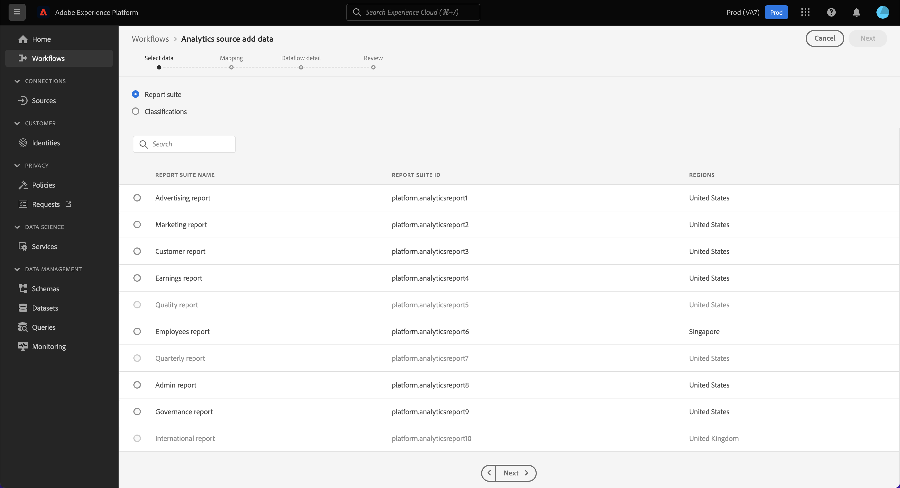

   Seleccione **[!UICONTROL Siguiente]**.

5. Select **[!UICONTROL Esquema predeterminado]** como el [!UICONTROL Esquema de Target]. Adobe Experience Platform crea automáticamente el esquema y el conjunto de datos correspondiente para asignar todos los campos estándar del grupo de informes de Adobe Analytics seleccionado.

   

   Seleccione **[!UICONTROL Siguiente]**.

6. Asigne un nombre al flujo de datos y (opcionalmente) proporcione una descripción.

   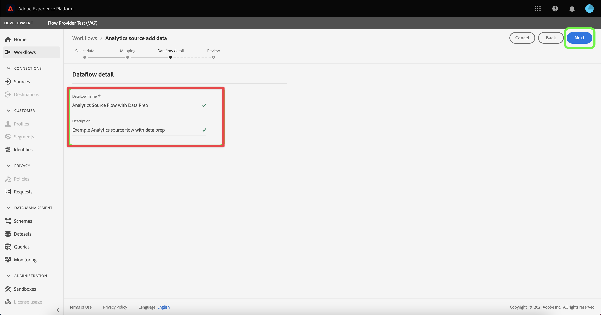

   Seleccione **[!UICONTROL Siguiente]**.

7. Revise la conexión y seleccione **[!UICONTROL Finalizar]**.

   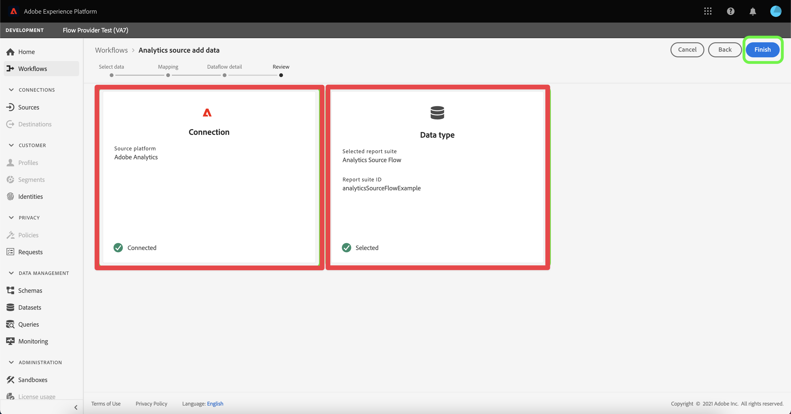

Una vez creada la conexión, el flujo de datos se crea automáticamente para rellenar un conjunto de datos con los datos de Adobe Analytics del grupo de informes, incluida la ingesta de hasta 13 meses de datos históricos.

Cuando termina la ingesta inicial, los datos del grupo de informes de Adobe Analytics están listos para que los use el Customer Journey Analytics.

Consulte [Crear una conexión de origen de Adobe Analytics en la interfaz de usuario](https://experienceleague.adobe.com/docs/experience-platform/sources/ui-tutorials/create/adobe-applications/analytics.html?lang=es) para ver un tutorial mucho más completo.

## Configuración de una conexión

Para utilizar los datos de Adobe Experience Platform en Customer Journey Analytics, se crea una conexión que incluye los datos resultantes de la configuración del esquema, el conjunto de datos y el flujo de trabajo.

Una conexión le permite integrar conjuntos de datos de Adobe Experience Platform el Espacio de trabajo. Para informar sobre estos conjuntos de datos, primero debe establecer una conexión entre conjuntos de datos en Adobe Experience Platform y Workspace.

Para crear la conexión:

1. En la interfaz de usuario del Customer Journey Analytics, seleccione **[!UICONTROL Conexiones]** en la barra de navegación superior.

2. Select **[!UICONTROL Crear nueva conexión]**.

3. En el [!UICONTROL Conexión sin título] pantalla:

   Asigne un nombre a la conexión y describa su [!UICONTROL Configuración de conexión].

   Seleccione el simulador de pruebas correcto en el [!UICONTROL Sandbox] en [!UICONTROL Configuración de datos] y seleccione el número de eventos diarios en la [!UICONTROL Cantidad promedio de eventos diarios] lista.

   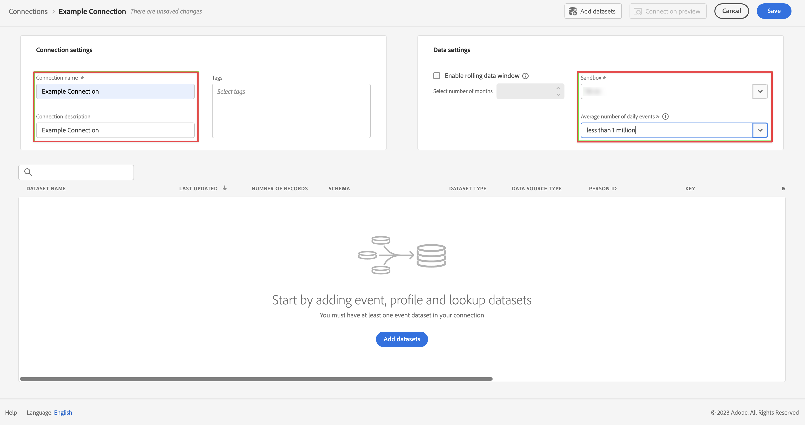

   Select **[!UICONTROL Agregar conjuntos de datos]**.

   En el [!UICONTROL Seleccionar conjuntos de datos] paso a paso [!UICONTROL Agregar conjuntos de datos]:

   - Seleccione el conjunto de datos creado automáticamente por el conector de origen de Adobe Analytics y cualquier otro conjunto de datos que desee incluir en la conexión.

      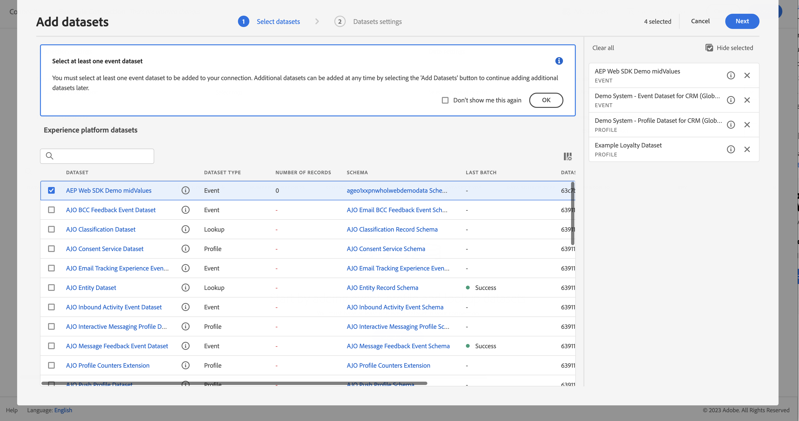

   - Seleccione **[!UICONTROL Siguiente]**.
   En el [!UICONTROL Configuración de conjuntos de datos] paso a paso [!UICONTROL Agregar conjuntos de datos]:

   - Para cada conjunto de datos:

      - Seleccione un [!UICONTROL ID de persona] de las identidades disponibles definidas en los esquemas de conjuntos de datos en Adobe Experience Platform.

      - Seleccione la fuente de datos correcta de la [!UICONTROL Tipo de fuente de datos] lista. Si especifica **[!UICONTROL Otro]** y, a continuación, agregue una descripción para la fuente de datos.

      - Establezca **[!UICONTROL Importar todos los datos nuevos]** y **[!UICONTROL Relleno de conjuntos de datos de datos existentes]** según sus preferencias.

      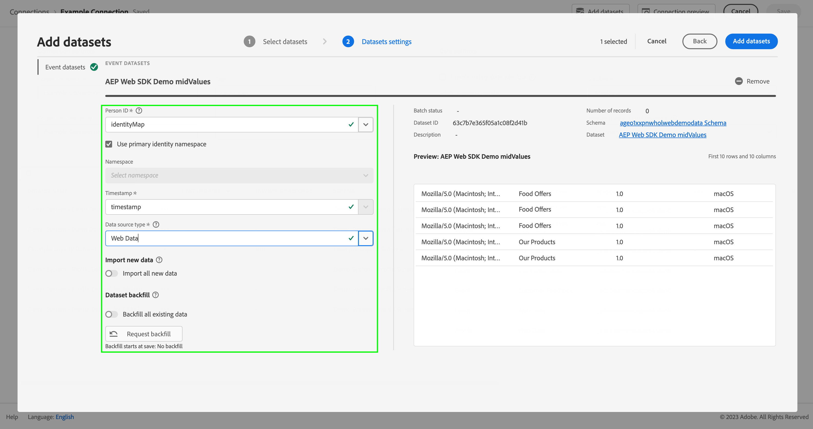

   - Select **[!UICONTROL Agregar conjuntos de datos]**.
   Seleccione **[!UICONTROL Guardar]**.

Consulte [Información general sobre conexiones](../connections/overview.md) para obtener más información sobre cómo crear y administrar una conexión y cómo seleccionar y combinar conjuntos de datos.

## Configuración de una vista de datos

Una vista de datos es un contenedor específico de Customer Journey Analytics que le permite determinar cómo interpretar los datos de una conexión. Especifica todas las dimensiones y métricas disponibles en Analysis Workspace y de qué columnas obtienen esos datos las dimensiones y métricas. Las vistas de datos se definen a fin de prepararse para la creación de informes en Analysis Workspace.

Para crear la vista de datos:

1. En la interfaz de usuario del Customer Journey Analytics, seleccione **[!UICONTROL Vistas de datos]** en la barra de navegación superior.

2. Select **[!UICONTROL Crear nueva vista de datos]**.

3. En el [!UICONTROL Configurar] paso:

   Seleccione la conexión en el [!UICONTROL Conexión] lista.

   Nombre y (opcionalmente) describa su conexión.

   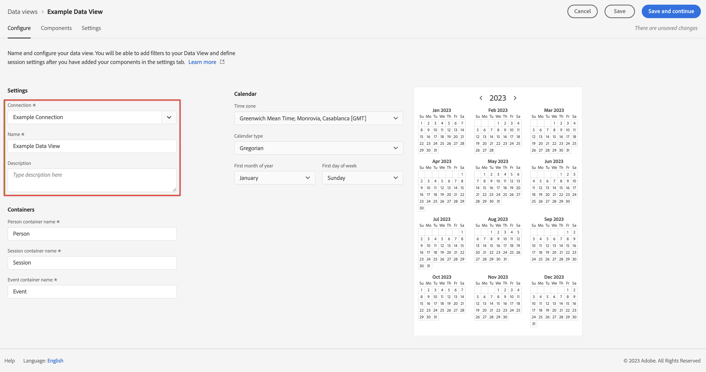

   Select **[!UICONTROL Guardar y continuar]**.

4. En el [!UICONTROL Componentes] paso:

   Añada cualquier campo de esquema o componente estándar que desee incluir en el [!UICONTROL MÉTRICAS] o [!UICONTROL Dimension] cuadros de componentes.

   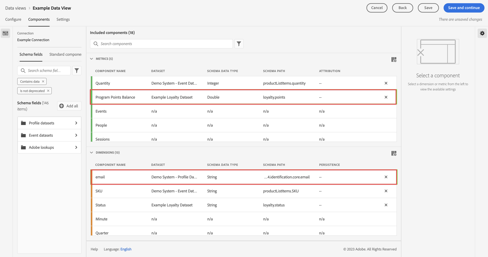

   Select **[!UICONTROL Guardar y continuar]**.

5. En el [!UICONTROL Configuración] paso:

   Configuración de 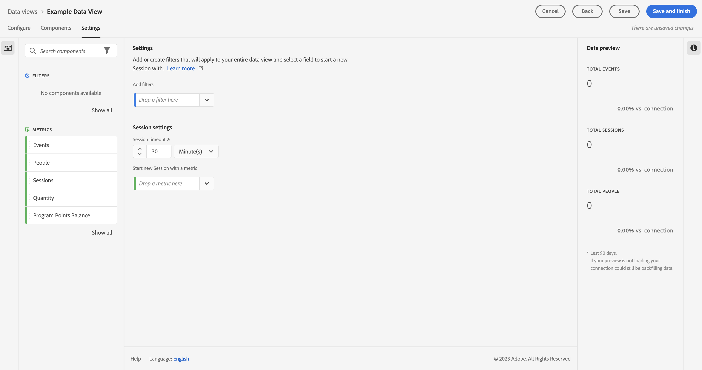

   Deje la configuración tal como está y seleccione **[!UICONTROL Guardar y finalizar]**.

Consulte [Resumen de las vistas de datos](../data-views/data-views.md) para obtener más información sobre cómo crear y editar una vista de datos, qué componentes están disponibles para usar en la vista de datos y cómo usar la configuración de filtro y sesiones.

## Configuración de un proyecto

Analysis Workspace es una herramienta de navegador flexible que le permite crear análisis y compartir perspectivas rápidamente en función de sus datos. Los proyectos de Workspace se utilizan para combinar componentes de datos, tablas y visualizaciones con el fin de crear su análisis y compartirlo con cualquier persona de su organización.

Para crear el proyecto:

1. En la interfaz de usuario del Customer Journey Analytics, seleccione **[!UICONTROL Proyectos]** en la barra de navegación superior.

2. Select **[!UICONTROL Proyectos]** en el panel de navegación izquierdo.

3. Select **[!UICONTROL Crear proyecto]**.

   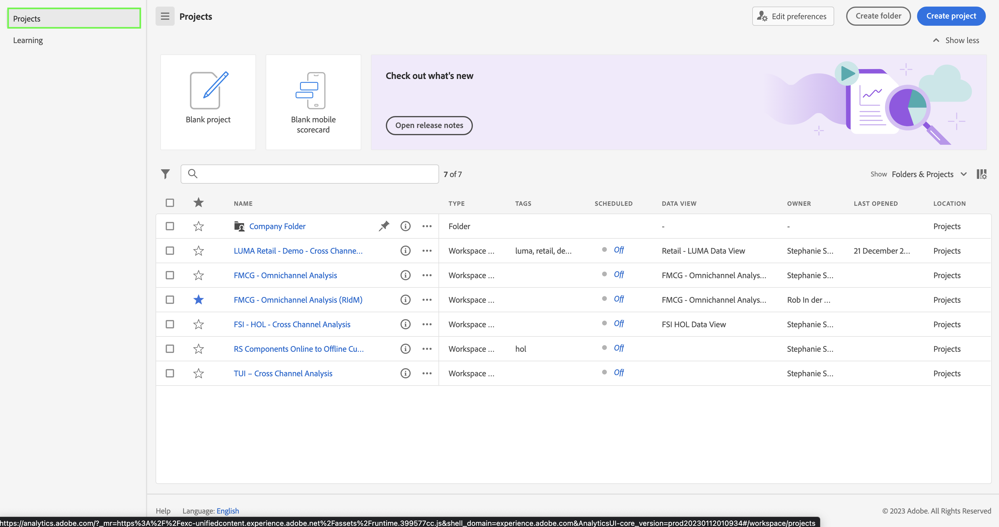

   Select **[!UICONTROL Proyecto en blanco]**.

   

4. Seleccione la vista de datos de la lista.

   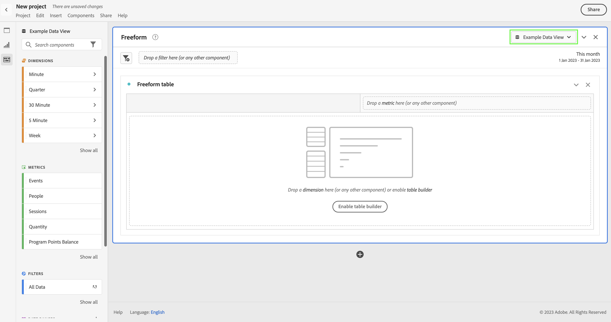.

5. Comience a arrastrar y soltar dimensiones y métricas en la [!UICONTROL Tabla improvisada] en el [!UICONTROL Panel] para crear su primer informe. Por ejemplo, arrastre `Program Points Balance` y `Page View` como métricas y `email` como dimensión para obtener una visión general rápida de los perfiles que han visitado su sitio web y forman parte del programa de fidelidad que recopila puntos de fidelidad.

   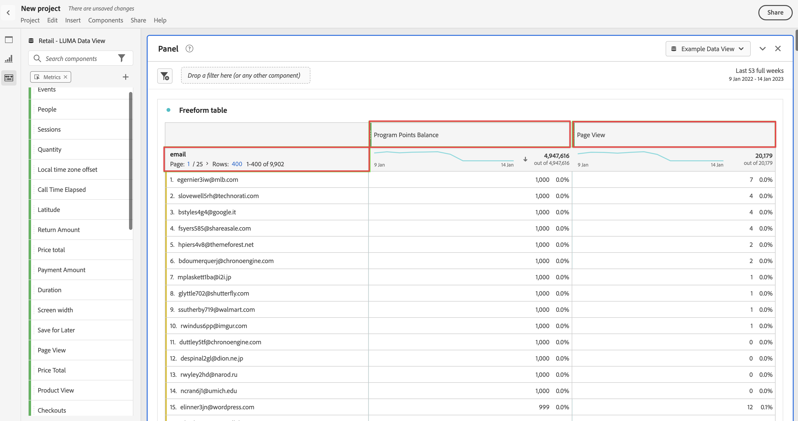

Consulte [Información general de Analysis Workspace](../analysis-workspace/home.md) para obtener más información sobre cómo crear proyectos y crear su análisis mediante componentes, visualizaciones y paneles.

>[!SUCCESS]
>
>Ha completado todos los pasos. Comenzando por configurar el conector de fuente de datos de Adobe Analytics y configurar ese conector para su grupo de informes, los datos de Adobe Analytics se cargan automáticamente en Adobe Experience Platform. Ha definido una conexión en Customer Journey Analytics para utilizar los datos de Adobe Analytics ingestados y otros datos. La definición de la vista de datos le permite especificar qué dimensión y métricas utilizar y, finalmente, creó su primer proyecto visualizando y analizando los datos.

