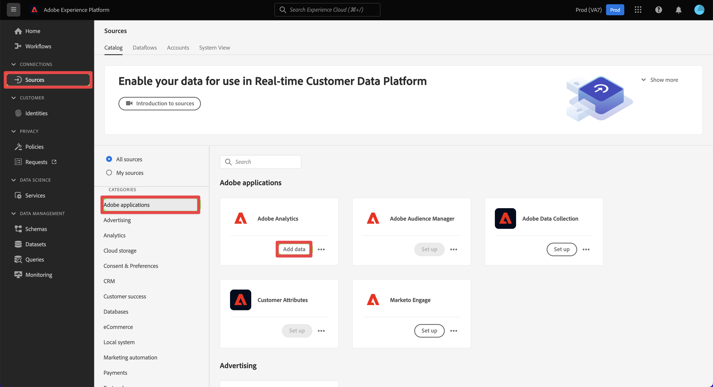
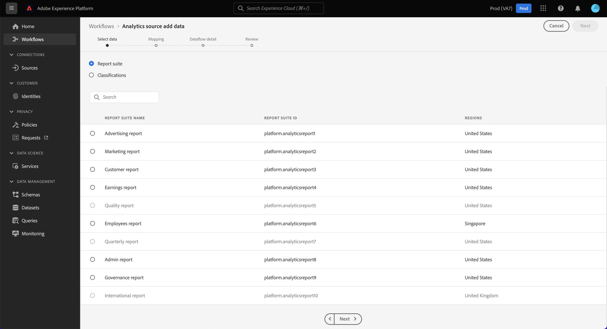
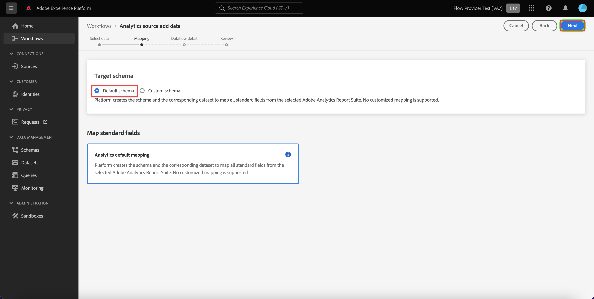
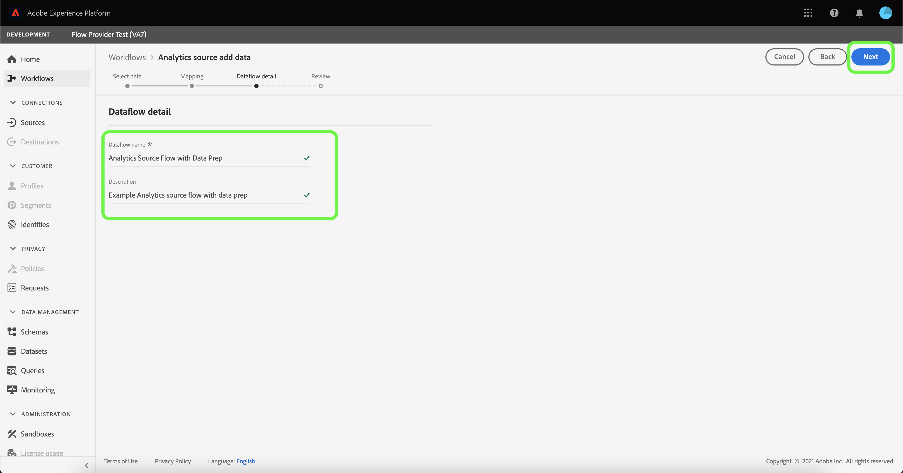
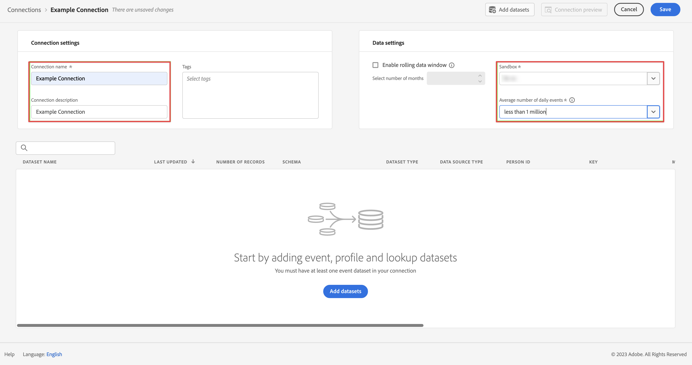
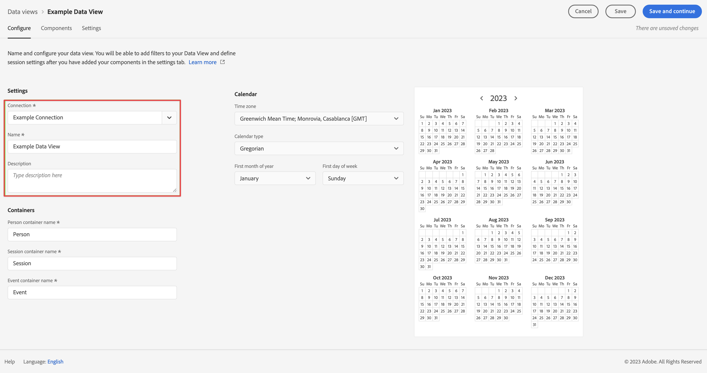
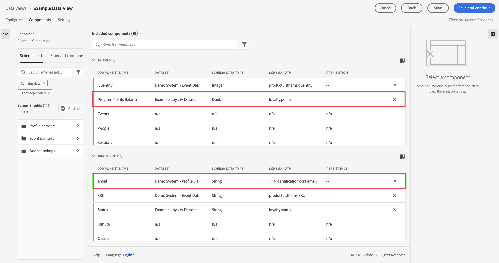
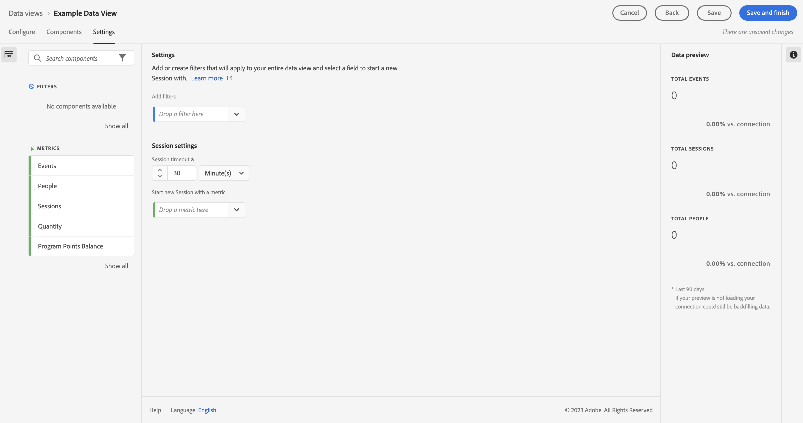

# Ingesta y uso de datos de Adobe Analytics

En esta guía de inicio rápido se explica cómo utilizar los datos recopilados por Adobe Analytics en Customer Journey Analytics.

>[!PREREQUISITES]
>
>Dispone de Adobe Analytics con licencia e implementado en uno o más de sus sitios web, utilizando cualquiera de los métodos de implementación documentados:
>
>- [Implementar Analytics con Experience Platform Edge](https://experienceleague.adobe.com/docs/analytics/implementation/aep-edge/overview.html?lang=es)
>
>- [Implementar Analytics con la extensión de Adobe Analytics](https://experienceleague.adobe.com/docs/analytics/implementation/launch/overview.html?lang=es)
>
>- [Implementar Analytics con JavaScript](https://experienceleague.adobe.com/docs/analytics/implementation/js/overview.html?lang=es)

Para lograrlo, debe llevar a cabo lo siguiente:

- **Configurar un conector de origen de Adobe Analytics** en Adobe Experience Platform. El conector de origen se encarga de la ingesta de los datos actuales de Adobe Analytics en un conjunto de datos en Adobe Experience Platform.

- **Configurar una conexión** en Customer Journey Analytics. La conexión debe incluir (al menos) su conjunto de datos de Adobe Experience Platform.

- **Configurar una vista de datos** en Customer Journey Analytics para definir las métricas y las dimensiones que desea utilizar en Analysis Workspace.

- **Configurar un proyecto** en Customer Journey Analytics para crear sus informes y visualizaciones.

>[!NOTE]
>
>Esta guía de inicio rápido es una guía simplificada sobre cómo introducir datos mediante el conector de origen de Adobe Analytics y utilizar esos datos en Customer Journey Analytics. Se recomienda estudiar la información adicional cuando se haga referencia a ella.

## Configurar un conector de origen de Adobe Analytics

El conector de origen de Adobe Analytics le permite introducir datos de grupos de informes de Adobe Analytics en Adobe Experience Platform.

Para crear un conector de origen de Adobe Analytics, debe hacer lo siguiente:

1. En la interfaz de usuario de Platform, seleccione **[!UICONTROL Orígenes]**, en el carril izquierdo.

2. Seleccione **[!UICONTROL Aplicaciones de Adobe]** en la lista de [!UICONTROL CATEGORÍAS].

3. Seleccione **[!UICONTROL Configurar]** o **[!UICONTROL Agregar datos]** en el mosaico de Adobe Analytics.

   

4. Seleccione **[!UICONTROL Grupo de informes]**. En la lista de grupos de informes, seleccione el que desee usar.  También puede usar  **[!UICONTROL _Buscar_]** para buscar un grupo de informes.

   

   Seleccione **[!UICONTROL Siguiente]**.

5. Seleccione **[!UICONTROL Esquema predeterminado]** como [!UICONTROL Esquema de destino]. Adobe Experience Platform crea automáticamente el esquema y el conjunto de datos correspondiente para asignar todos los campos estándar del grupo de informes de Adobe Analytics seleccionado.

   

   Seleccione **[!UICONTROL Siguiente]**.

6. Asigne un nombre al flujo de datos y (opcionalmente) proporcione una descripción.

   

   Seleccione **[!UICONTROL Siguiente]**.

7. Revise la conexión y seleccione **[!UICONTROL Finalizar]**.

   

Una vez creada la conexión, el flujo de datos se crea automáticamente para rellenar un conjunto de datos con los datos de Adobe Analytics del grupo de informes. El flujo de datos ingiere hasta 13 meses de datos históricos para las zonas protegidas de producción. El relleno en zonas protegidas que no son de producción está limitado a tres meses.

Cuando termina la ingesta inicial, los datos del grupo de informes de Adobe Analytics están listos para que los use Customer Journey Analytics.

Consulte [Crear una conexión de origen de Adobe Analytics en la interfaz de usuario](https://experienceleague.adobe.com/docs/experience-platform/sources/ui-tutorials/create/adobe-applications/analytics.html?lang=es) para ver un tutorial mucho más completo.

## Configurar una conexión

Para utilizar los datos de Adobe Experience Platform en Customer Journey Analytics, se crea una conexión que incluye los datos resultantes de la configuración del esquema, el conjunto de datos y el flujo de trabajo.

Una conexión le permite integrar conjuntos de datos de Adobe Experience Platform el Espacio de trabajo. Para informar sobre estos conjuntos de datos, primero debe establecer una conexión entre conjuntos de datos en Adobe Experience Platform y Workspace.

Para crear la conexión:

1. En la interfaz de usuario de Customer Journey Analytics, seleccione **[!UICONTROL Conexiones]**, opcionalmente desde **[!UICONTROL Administración de datos]**, en el menú superior.

2. Seleccione **[!UICONTROL Crear nueva conexión]**.

3. En la pantalla [!UICONTROL Conexión sin título], haga lo siguiente:

   Asigne un nombre a la conexión y descríbala en [!UICONTROL Configuración de la conexión].

   Seleccione la zona protegida correcta en la lista [!UICONTROL Zona protegida] de [!UICONTROL Configuración de datos] y seleccione el número de eventos diarios en la lista [!UICONTROL Número medio de eventos diarios].

   

   Seleccione **[!UICONTROL Agregar conjuntos de datos]**.

   En el paso [!UICONTROL Seleccionar conjuntos de datos] en [!UICONTROL Agregar conjuntos de datos]:

   - Seleccione el conjunto de datos creado automáticamente por el conector de origen de Adobe Analytics y cualquier otro conjunto de datos que desee incluir en la conexión.

     

   - Seleccione **[!UICONTROL Siguiente]**.

   En el paso [!UICONTROL Configuración de conjuntos de datos], en [!UICONTROL Agregar conjuntos de datos], haga lo siguiente:

   - Para cada conjunto de datos:

      - Seleccione un [!UICONTROL ID de persona] entre las identidades disponibles de los esquemas del conjunto de datos en Adobe Experience Platform.

      - Seleccione la fuente de datos correcta en la lista [!UICONTROL Tipo de fuente de datos]. Si especifica **[!UICONTROL Otro]**, agregue una descripción para la fuente de datos.

      - Establezca **[!UICONTROL Importar todos los datos nuevos]** y **[!UICONTROL Datos existentes del relleno del conjunto de datos]** según sus preferencias.

     

   - Seleccione **[!UICONTROL Agregar conjuntos de datos]**.

   Seleccione **[!UICONTROL Guardar]**.

Consulte [Información general sobre conexiones](../connections/overview.md) para obtener más información sobre cómo crear y administrar una conexión y cómo seleccionar y combinar conjuntos de datos.

## Configurar una vista de datos

Una vista de datos es un contenedor específico de Customer Journey Analytics que le permite determinar cómo interpretar los datos de una conexión. Especifica todas las dimensiones y métricas disponibles en Analysis Workspace y de qué columnas obtienen esos datos las dimensiones y métricas. Las vistas de datos se definen a fin de prepararse para la creación de informes en Analysis Workspace.

Para crear la vista de datos:

1. En la interfaz de usuario de Customer Journey Analytics, seleccione **[!UICONTROL Vistas de datos]**, opcionalmente desde **[!UICONTROL Administración de datos]**, en el menú superior.

2. Seleccione **[!UICONTROL Crear nueva vista de datos]**.

3. En el paso [!UICONTROL Configurar], haga lo siguiente:

   Seleccione la conexión en la lista [!UICONTROL Conexión].

   Asigne un nombre y (opcionalmente) describa su conexión.

   

   Seleccione **[!UICONTROL Guardar y continuar]**.

4. En el paso [!UICONTROL Componentes], haga lo siguiente:

   Agregue cualquier campo de esquema o componente estándar que quiera incluir en los cuadros de componentes [!UICONTROL MÉTRICAS] o [!UICONTROL DIMENSIONES].

   

   Seleccione **[!UICONTROL Guardar y continuar]**.

5. En el paso [!UICONTROL Configuración], haga lo siguiente:

   Configuración de 

   Deje la configuración tal como está y seleccione **[!UICONTROL Guardar y finalizar]**.

Consulte [Resumen de vistas de datos](../data-views/data-views.md) para obtener más información sobre cómo crear y editar una vista de datos, qué componentes están disponibles para que los use en su vista de datos y cómo usar la configuración de segmentos y sesiones.

## Configurar un proyecto

Analysis Workspace es una herramienta de navegador flexible que le permite compilar análisis y compartir perspectivas rápidamente, en función de los datos. Los proyectos de Workspace se usan para combinar componentes, tablas y visualizaciones de datos para crear un análisis y compartirlo con cualquier persona de su organización.

Para crear un proyecto:

1. En la interfaz de usuario de Customer Journey Analytics, seleccione **[!UICONTROL Proyectos]** en el menú superior.

2. Seleccione **[!UICONTROL Proyectos]** en el panel de navegación izquierdo.

3. Seleccione **[!UICONTROL Crear proyecto]**.

   

   Seleccione **[!UICONTROL Proyecto en blanco]**.

   

4. Seleccione la vista de datos en la lista.

   .

5. Para crear su primer informe, empiece a arrastrar y soltar dimensiones y métricas en la [!UICONTROL tabla de forma libre] en el [!UICONTROL panel] Por ejemplo, arrastre `Program Points Balance` y `Page View` como métricas y `email` como dimensión para obtener una visión general rápida de los perfiles que han visitado su sitio web y forman parte del programa de lealtad que recopila puntos de lealtad.

   

Consulte [Información general de Analysis Workspace](../analysis-workspace/home.md) para obtener más información sobre cómo crear proyectos y compilar su análisis mediante componentes, visualizaciones y paneles.

>[!SUCCESS]
>
>Ha completado todos los pasos. Empezando por configurar el conector de fuente de datos de Adobe Analytics y, posteriormente, configurar ese conector para el grupo de informes, los datos de Adobe Analytics se cargan automáticamente en Adobe Experience Platform. Ha definido una conexión en Customer Journey Analytics para utilizar los datos de Adobe Analytics ingeridos y otros datos. La definición de la vista de datos le permite especificar qué dimensión y métricas debe utilizar y, finalmente, crear su primer proyecto visualizando y analizando los datos.

