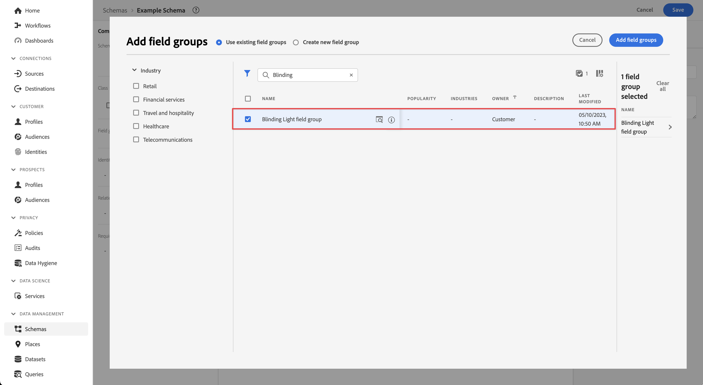
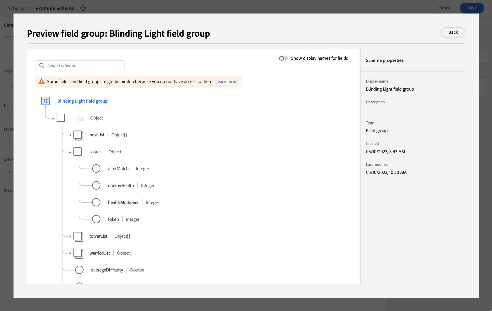
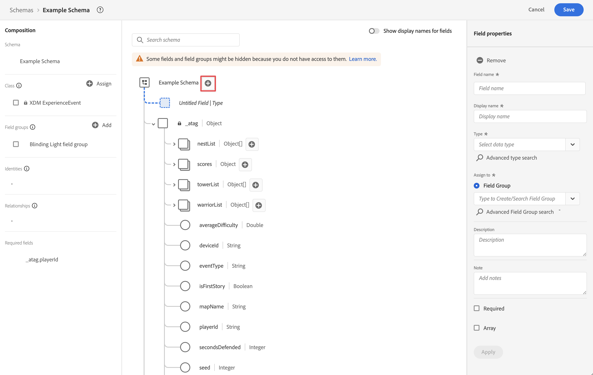
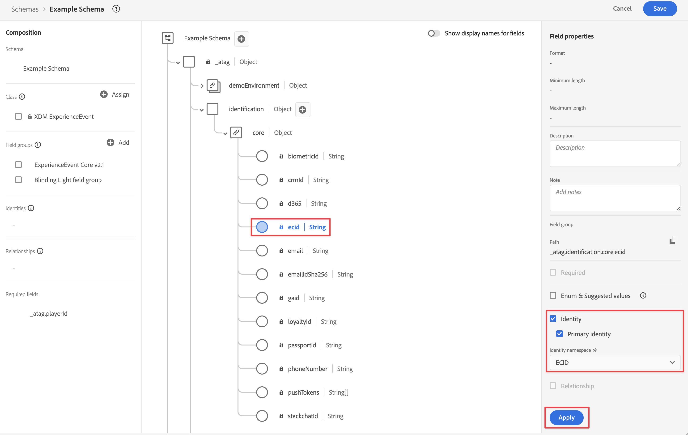
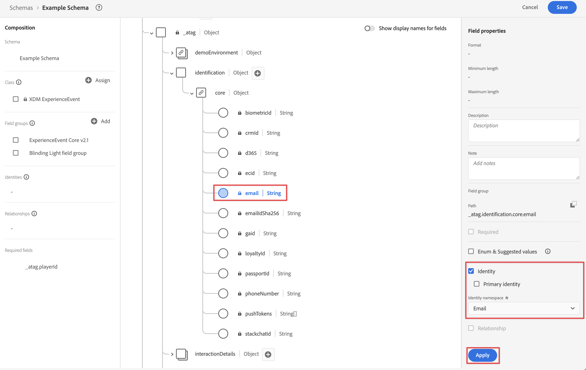

# Ingesta de datos mediante la API del servidor de red perimetral de Adobe Experience Platform

En esta guía de inicio rápido se explica cómo puede ingerir datos de seguimiento de dispositivos como dispositivos IoT, descodificadores, consolas de juegos y aplicaciones de escritorio directamente en Adobe Experience Platform mediante la API de servidor de red perimetral de Adobe Experience Platform y Edge Network. A continuación, utilice esos datos en Customer Journey Analytics.

Para lograr esto, debe:

- **Configurar un esquema y un conjunto de datos** en Adobe Experience Platform para definir el modelo (esquema) de los datos que desea recopilar y dónde recopilar realmente los datos (conjunto de datos).

- **Configurar una secuencia de datos** para configurar Adobe Experience Platform Edge Network con el fin de enrutar los datos recopilados al conjunto de datos configurado en Adobe Experience Platform.

- **Usar API de servidor** para enviar datos directamente desde la aplicación o el juego que se ejecuta en un equipo de escritorio, una consola de juegos, un dispositivo IoT o un decodificador al conjunto de datos.

- **Implementar y validar**. Contar con un entorno en el que pueda iterar en el desarrollo y, una vez validado todo, publicarlo en directo en el entorno de producción.

- **Configurar una conexión** en Customer Journey Analytics. Esta conexión debe incluir (al menos) su conjunto de datos de Adobe Experience Platform.

- **Configurar una vista de datos** en Customer Journey Analytics para definir las métricas y las dimensiones que desea utilizar en Analysis Workspace.

- **Configurar un proyecto** en Customer Journey Analytics para crear sus informes y visualizaciones.

>[!NOTE]
>
>Esta guía de inicio rápido es una guía simplificada sobre cómo ingerir datos recopilados de una aplicación o juego que se ejecuta en un dispositivo IoT, decodificador, consola de juegos o equipo de escritorio en Adobe Experience Platform y utilizarlos en Customer Journey Analytics. Se recomienda estudiar la información adicional cuando se haga referencia a ella.


## Configurar un esquema y un conjunto de datos

Para introducir datos en Adobe Experience Platform, primero debe definir qué datos desea recopilar. Todos los datos ingeridos en Adobe Experience Platform deben cumplir una estructura estándar y desnormalizada para que las funciones y características consecutivas puedan reconocerlos y actuar en consecuencia. El modelo de datos de experiencia (XDM) es el marco de trabajo estándar que proporciona una estructura en forma de esquemas.

Una vez definido un esquema, se utilizan uno o más conjuntos de datos para almacenar y administrar la recopilación de datos. Un conjunto de datos es una construcción de almacenamiento y administración para una colección de datos (normalmente una tabla) que contiene un esquema (columnas) y campos (filas).

Todos los datos ingeridos en Adobe Experience Platform deben cumplir un esquema predefinido para que se puedan conservar como conjunto de datos.

### Configurar un esquema

Desea rastrear algunos datos mínimos de perfiles jugando su juego en una consola, por ejemplo, identificación, puntuaciones, progreso y otra información.
Primero debe definir un esquema que modele estos datos.

Para configurar el esquema:

1. En la interfaz de usuario de Adobe Experience Platform, en el carril izquierdo, seleccione **[!UICONTROL Esquemas]** en [!UICONTROL ADMINISTRACIÓN DE DATOS].

2. Seleccione **[!UICONTROL Crear esquema]**. Seleccione **[!UICONTROL XDM ExperienceEvent]** de la lista de opciones.

   

   >[!INFO]
   >
   >    Se utiliza un esquema de Evento de experiencia para modelar el _comportamiento_ de un perfil (como alcanzar un nivel en el juego, por ejemplo). Se utiliza un esquema de perfil individual para modelar los _atributos_ del perfil (como nombre, correo electrónico o sexo).


3. En la pantalla [!UICONTROL Esquema sin título]:

   1. Introduzca un nombre para mostrar para el esquema y (opcionalmente) una descripción.

      

   2. Seleccione **[!UICONTROL + Agregar]** en [!UICONTROL Grupos de campos].

      

      Los grupos de campos son colecciones reutilizables de objetos y atributos que le permiten ampliar fácilmente su esquema.

   3. En el [!UICONTROL Adición de campos y grupos] , seleccione la **[!UICONTROL Luz cegadora]** de la lista. Este grupo de campos se crea para rastrear el progreso del usuario al jugar un juego ficticio titulado Blinding Light on a console.

      

      Puede seleccionar el botón de vista previa para ver una vista previa de los campos que forman parte de este grupo de campos, como `scores > afterMatch`.

      

      Seleccione **[!UICONTROL Atrás]** para cerrar la vista previa.

   4. Seleccione **[!UICONTROL Agregar grupos de campos]**.

4. Seleccionar **[!UICONTROL +]** junto al nombre del esquema.

   

5. En el [!UICONTROL Propiedades del campo] panel, entrar `identification` como el [!UICONTROL Nombre de campo], **[!UICONTROL Identificación]** como el [!UICONTROL Nombre para mostrar], seleccione **[!UICONTROL Objeto]** como el [!UICONTROL Tipo] y seleccione **[!UICONTROL ExperienceEvent Core v2.1]** como el [!UICONTROL Grupo de campos].

   

   El objeto de identificación agrega capacidades de identificación al esquema. En su caso, desea identificar los perfiles que están jugando con el ID de Experience Cloud y la dirección de correo electrónico que utilizan para iniciar sesión en la consola de juegos. Hay muchos otros atributos disponibles para rastrear la identificación de su persona.

   Seleccione **[!UICONTROL Aplicar]** para agregar este objeto al esquema.

6. Seleccione el campo **[!UICONTROL ECID]** en el objeto de identificación que acaba de agregar y seleccione **[!UICONTROL Identidad]**, **[!UICONTROL Identidad principal]** y **[!UICONTROL ECID]** en la lista de [!UICONTROL Área de nombres de identidad] en el panel derecho.

   

   Está especificando la identidad de Experience Cloud como la identidad principal que el servicio de identidad de Adobe Experience Platform puede utilizar para combinar (unir) el comportamiento de los perfiles con el mismo ECID.

   Seleccione **[!UICONTROL Aplicar]**. Verá que aparece un icono de huella digital en el atributo de ECID.

7. Seleccione el campo de **[!UICONTROL correo electrónico]** en el objeto de identificación que acaba de añadir y seleccione **[!UICONTROL Identidad]** y **[!UICONTROL Correo electrónico]** en la lista de [!UICONTROL Área de nombres de identidad] del panel [!UICONTROL Propiedades de campo].

   

   Está especificando la dirección de correo electrónico como otra identidad que el servicio de identidad de Adobe Experience Platform puede utilizar para combinar (unir) el comportamiento de los perfiles.

   Seleccione **[!UICONTROL Aplicar]**. Verá que aparece un icono de huella digital en el atributo de correo electrónico.

   Seleccione **[!UICONTROL Guardar]**.

8. Seleccione el elemento raíz del esquema que muestra el nombre del esquema y, a continuación, seleccione el conmutador **[!UICONTROL Perfil]**.

   Se le pedirá que habilite el esquema para el perfil. Tras la habilitación, cuando los datos se incorporan en conjuntos de datos basados en este esquema, los datos se combinan en el perfil del cliente en tiempo real.

   Consulte [Habilitar el esquema para utilizarlo en el perfil del cliente en tiempo real](https://experienceleague.adobe.com/docs/experience-platform/xdm/tutorials/create-schema-ui.html?lang=es#profile) para obtener más información.

   >[!IMPORTANT]
   >
   >    Una vez guardado un esquema habilitado para perfil, ya no se puede deshabilitar para perfil.

   

9. Seleccione **[!UICONTROL Guardar]** para guardar el esquema.

Ha creado un esquema mínimo que modela los datos que puede capturar de su juego. El esquema permite identificar perfiles mediante la identidad de Experience Cloud y la dirección de correo electrónico. Al habilitar el esquema para el perfil, se garantiza que los datos capturados desde el juego de la consola se añadan al perfil del cliente en tiempo real.

Junto a los datos de comportamiento, también puede capturar datos de atributos de perfil desde la consola (por ejemplo, detalles de perfiles conectados a la consola).

Para capturar datos de perfil, debería hacer lo siguiente:

- Crear un esquema basado en la clase Perfil individual XDM.

- Agregar el grupo de campos Profile Core v2 al esquema.

- Agregar un objeto de identificación basado en el grupo de campos Profile Core v2.

- Defina el ID de Experience Cloud como identificador principal y el correo electrónico como identificador.

- Habilitar el esquema para el perfil

Consulte [Crear y editar esquemas en la interfaz de usuario](https://experienceleague.adobe.com/docs/experience-platform/xdm/ui/resources/schemas.html?lang=es) para obtener más información sobre cómo agregar y quitar grupos de campos y campos individuales a un esquema.

### Configurar un conjunto de datos

Con el esquema, ha definido el modelo de datos. Ahora tiene que definir la construcción para almacenar y administrar esos datos mediante conjuntos de datos.

Para configurar un conjunto de datos:

1. En la interfaz de usuario de Adobe Experience Platform, en el carril izquierdo, seleccione **[!UICONTROL Conjuntos de datos]** en [!UICONTROL ADMINISTRACIÓN DE DATOS].

2. Seleccione **[!UICONTROL Crear conjunto de datos]**.

   

3. Seleccione **[!UICONTROL Crear conjunto de datos a partir de esquema]**.

   

4. Seleccione el esquema creado anteriormente y, después, **[!UICONTROL Siguiente]**.

5. Asigne un nombre al conjunto de datos y (opcionalmente) proporcione una descripción.

   

6. Seleccione **[!UICONTROL Finalizar]**.

7. Seleccione el conmutador **[!UICONTROL Perfil]**.

   Se le pedirá que habilite el conjunto de datos para el perfil. Una vez habilitado, el conjunto de datos enriquece los perfiles de clientes en tiempo real con sus datos ingeridos.

   >[!IMPORTANT]
   >
   >    Solo puede habilitar un conjunto de datos para un perfil cuando el esquema, al que se adhiere el conjunto de datos, también esté habilitado para el perfil.

   

Consulte [Guía de la interfaz de usuario de conjuntos de datos](https://experienceleague.adobe.com/docs/experience-platform/catalog/datasets/user-guide.html?lang=es) para obtener más información sobre cómo ver, previsualizar, crear o eliminar un conjunto de datos. Y cómo habilitar un conjunto de datos para el perfil del cliente en tiempo real.

## Configurar una secuencia de datos

Un conjunto de datos representa la configuración del lado del servidor al implementar los SDK web y móvil de Adobe Experience Platform y la API del servidor de red perimetral de Adobe Experience Platform. Al recopilar datos con los SDK de Adobe Experience Platform y las API del servidor de red perimetral, los datos se envían a Adobe Experience Platform Edge Network. Es la secuencia de datos la que determina a qué servicios se reenvían los datos.

En su configuración, desea que los datos que recopila del juego se envíen a su conjunto de datos en Adobe Experience Platform.

Para configurar la secuencia de datos, debe hacer lo siguiente:

1. En la interfaz de usuario de Adobe Experience Platform, seleccione **[!UICONTROL Secuencias de datos]** desde [!UICONTROL RECOPILACIÓN DE DATOS] en el carril izquierdo.

2. Seleccione **[!UICONTROL Nueva secuencia de datos]**.

3. Asigne un nombre y describa su secuencia de datos. Seleccione el esquema en la lista [!UICONTROL Esquema de eventos].

   

4. Seleccione **[!UICONTROL Guardar]**.

5. Seleccione **[!UICONTROL Agregar servicio]**.

6. En la pantalla [!UICONTROL Agregar servicio], debe hacer lo siguiente:

   1. Seleccione **[!UICONTROL Adobe Experience Platform]** en la lista [!UICONTROL Servicio].

   2. Asegúrese de que **[!UICONTROL Habilitado]** esté seleccionado.

   3. Seleccione su conjunto de datos en la lista [!UICONTROL Conjunto de datos de evento].

      

   4. Deje los demás ajustes y seleccione **[!UICONTROL Guardar]** para guardar la secuencia de datos.

La secuencia de datos ahora está configurada para reenviar los datos recopilados del juego a su conjunto de datos en Adobe Experience Platform.

Consulte la [Información general sobre secuencias de datos](https://experienceleague.adobe.com/docs/experience-platform/datastreams/overview.html?lang=es) para obtener más información sobre cómo configurar una secuencia de datos y cómo gestionar datos confidenciales.

## Usar la API del servidor de red perimetral

En el desarrollo del juego, puede agregar llamadas relevantes a la API del servidor de red perimetral de Adobe Experience Platform cuando corresponda.

Por ejemplo, para actualizar la puntuación del reproductor, utilizaría:

```
curl -X POST "https://server.adobedc.net/ee/v2/interact?dataStreamId={DATASTREAM_ID}"
-H "Authorization: Bearer {TOKEN}"
-H "x-gw-ims-org-id: {ORG_ID}"
-H "x-api-key: {API_KEY}"
-H "Content-Type: application/json"
-d '{
   "event": {
      "xdm": {
         "identityMap": {
            "Email_LC_SHA256": [
               {
                  "id": "0c7e6a405862e402eb76a70f8a26fc732d07c32931e9fae9ab1582911d2e8a3b",
                  "primary": true
               }
            ]
         },
         "eventType": "game.scoreUpdate",
         "{sandbox}": {
            "scores": {
               "afterMatch": 132391",
            }
         },
         "timestamp": "2021-08-09T14:09:20.859Z"
      }
   }
}'
```

En la solicitud del POST de ejemplo, `{DATASTREAM_ID}` apunta al identificador de la secuencia de datos de ejemplo que configuró anteriormente. `{sandbox}` es el nombre único de la zona protegida que identifica la ruta al grupo de campos Luz cegadora personalizado.

Consulte [Recopilación de datos interactiva](https://experienceleague.adobe.com/docs/experience-platform/edge-network-server-api/data-collection/interactive-data-collection.html?lang=en) y [Recopilación de datos no interactiva](https://experienceleague.adobe.com/docs/experience-platform/edge-network-server-api/data-collection/non-interactive-data-collection.html?lang=en) para obtener más información acerca de cómo utilizar la API del servidor de red perimetral.

## Configurar una conexión

Para utilizar los datos de Adobe Experience Platform en Customer Journey Analytics, se crea una conexión que incluye los datos resultantes de la configuración del esquema, el conjunto de datos y el flujo de trabajo.

Una conexión le permite integrar conjuntos de datos de Adobe Experience Platform en Workspace. Para informar sobre estos conjuntos de datos, primero debe establecer una conexión entre conjuntos de datos en Adobe Experience Platform y Workspace.

Para crear la conexión:

1. En la interfaz de usuario de Customer Journey Analytics, seleccione **[!UICONTROL Conexiones]** en la barra de navegación superior.

2. Seleccione **[!UICONTROL Crear nueva conexión]**.

3. En la pantalla [!UICONTROL Conexión sin título], haga lo siguiente:

   Asigne un nombre a la conexión y descríbala en [!UICONTROL Configuración de la conexión].

   Seleccione la zona protegida correcta en la lista [!UICONTROL Zona protegida] de [!UICONTROL Configuración de datos] y seleccione el número de eventos diarios en la lista [!UICONTROL Número medio de eventos diarios].

   

   Seleccione **[!UICONTROL Agregar conjuntos de datos]**.

   En el paso [!UICONTROL Seleccionar conjuntos de datos], en [!UICONTROL Agregar conjuntos de datos], haga lo siguiente:

   - Seleccione los conjuntos de datos que creó anteriormente u otros conjuntos de datos relevantes que desee incluir en la conexión

   - Seleccione **[!UICONTROL Siguiente]**.

   En el paso [!UICONTROL Configuración de conjuntos de datos], en [!UICONTROL Agregar conjuntos de datos], haga lo siguiente:

   - Para cada conjunto de datos:

      - Seleccione un [!UICONTROL ID de persona] entre las identidades disponibles de los esquemas del conjunto de datos en Adobe Experience Platform.

      - Seleccione la fuente de datos correcta en la lista [!UICONTROL Tipo de fuente de datos]. Si especifica **[!UICONTROL Otro]**, agregue una descripción para la fuente de datos.

      - Establezca **[!UICONTROL Importar todos los datos nuevos]** y **[!UICONTROL Datos existentes del relleno del conjunto de datos]** según sus preferencias.

   - Seleccione **[!UICONTROL Agregar conjuntos de datos]**.

   Seleccione **[!UICONTROL Guardar]**.

Consulte [Información general sobre conexiones](../connections/overview.md) para obtener más información sobre cómo crear y administrar una conexión y cómo seleccionar y combinar conjuntos de datos.

## Configurar una vista de datos

Una vista de datos es un contenedor específico de Customer Journey Analytics que le permite determinar cómo interpretar los datos de una conexión. Especifica todas las dimensiones y métricas disponibles en Analysis Workspace y de qué columnas obtienen esos datos las dimensiones y métricas. Las vistas de datos se definen a fin de prepararse para la creación de informes en Analysis Workspace.

Para crear la vista de datos:

1. En la interfaz de usuario de Customer Journey Analytics, seleccione **[!UICONTROL Vistas de datos]** en la barra de navegación superior.

2. Seleccione **[!UICONTROL Crear nueva vista de datos]**.

3. En el paso [!UICONTROL Configurar], haga lo siguiente:

   Seleccione la conexión en la lista [!UICONTROL Conexión].

   Asigne un nombre y (opcionalmente) describa su conexión.

   

   Seleccione **[!UICONTROL Guardar y continuar]**.

4. En el paso [!UICONTROL Componentes], haga lo siguiente:

   Agregue cualquier campo de esquema o componente estándar que quiera incluir en los cuadros de componentes [!UICONTROL MÉTRICAS] o [!UICONTROL DIMENSIONES].

   Seleccione **[!UICONTROL Guardar y continuar]**.

5. En el paso [!UICONTROL Configuración], haga lo siguiente:

   Configuración de 

   Deje la configuración tal como está y seleccione **[!UICONTROL Guardar y finalizar]**.

Consulte [Información general de las vistas de datos](../data-views/data-views.md) para obtener más información sobre cómo crear y editar una vista de datos, qué componentes están disponibles para usar en la vista de datos y cómo usar la configuración de filtro y sesiones.


## Configurar un proyecto

Analysis Workspace es una herramienta de navegador flexible que le permite compilar análisis y compartir perspectivas rápidamente, en función de los datos. Los proyectos de Workspace se usan para combinar componentes, tablas y visualizaciones de datos para crear un análisis y compartirlo con cualquier persona de su organización.

Para crear un proyecto:

1. En la interfaz de usuario de Customer Journey Analytics, seleccione **[!UICONTROL Proyectos]** en la barra de navegación superior.

2. Seleccione **[!UICONTROL Proyectos]** en el panel de navegación izquierdo.

3. Seleccione **[!UICONTROL Crear proyecto]**.

   

   Seleccione **[!UICONTROL Proyecto en blanco]**.

   

4. Seleccione la vista de datos en la lista.

   .

5. Para crear el primer informe, comience a arrastrar y soltar dimensiones y métricas en la [!UICONTROL Tabla de forma libre] en el [!UICONTROL Panel].

Consulte [Información general de Analysis Workspace](../analysis-workspace/home.md) para obtener más información sobre cómo crear proyectos y compilar su análisis mediante componentes, visualizaciones y paneles.

>[!SUCCESS]
>
>Ha completado todos los pasos. Comience por definir qué datos desea recopilar (esquema) y dónde almacenarlos (conjunto de datos) en Adobe Experience Platform. Ha configurado una secuencia de datos en la red perimetral para garantizar que los datos se puedan reenviar a ese conjunto de datos. A continuación, utilizó la API del servidor de red perimetral para enviar esos datos al conjunto de datos. Ha definido una conexión en Customer Journey Analytics para utilizar los datos del juego y otros datos. Su definición de vista de datos le permitió especificar qué dimensión y métricas utilizar y, finalmente, creó su primer proyecto visualizando y analizando los datos del juego.
