# Ingiera y utilice datos mediante conectores de origen.

En esta guía de inicio rápido se explica cómo ingerir datos en Adobe Experience Platform mediante un conector de origen en un proveedor de datos y, a continuación, utilizarlos en Customer Journey Analytics.

Para lograrlo, debe llevar a cabo lo siguiente:

- **Configurar un esquema y un conjunto de datos** en Adobe Experience Platform para definir el modelo (esquema) de los datos que desea recopilar y dónde recopilar realmente los datos (conjunto de datos).

- **Usar un conector de origen** en Adobe Experience Platform para obtener los datos en el conjunto de datos configurado.

- **Configurar una conexión** en Customer Journey Analytics. Esta conexión debe incluir (al menos) su conjunto de datos de Adobe Experience Platform.

- **Configurar una vista de datos** en Customer Journey Analytics para definir las métricas y las dimensiones que desea utilizar en Analysis Workspace.

- **Configurar un proyecto** en Customer Journey Analytics para crear sus informes y visualizaciones.

>[!NOTE]
>
>Esta es una guía simplificada sobre cómo ingerir datos mediante un conector de origen en Adobe Experience Platform y utilizarlos en Customer Journey Analytics. Se recomienda estudiar la información adicional cuando se haga referencia a ella.

## Configurar un esquema y un conjunto de datos

Para ingerir datos en Adobe Experience Platform, primero debe definir qué datos desea recopilar. Todos los datos ingeridos en Adobe Experience Platform deben cumplir una estructura estándar y desnormalizada para que las funciones y características consecutivas puedan reconocerlos y actuar en consecuencia. Experience Data Model (XDM) es el marco estándar que proporciona esta estructura en forma de esquemas.

Una vez definido un esquema, se utilizan uno o más conjuntos de datos para almacenar y administrar la recopilación de datos. Un conjunto de datos es una construcción de almacenamiento y administración para una colección de datos, normalmente una tabla, que contiene un esquema (columnas) y campos (filas).

Todos los datos ingeridos en Adobe Experience Platform deben cumplir un esquema predefinido para que se puedan conservar como conjunto de datos.

### Configurar un esquema

Para este inicio rápido, debe recopilar algunos datos de fidelidad, como el ID de fidelidad, los puntos de fidelidad y el estado de fidelidad.
Para ello, primero debe definir un esquema que modele estos datos.

Para configurar el esquema:

1. En la interfaz de usuario de Adobe Experience Platform, en el carril izquierdo, seleccione **[!UICONTROL Esquemas]** en [!UICONTROL ADMINISTRACIÓN DE DATOS].

2. Seleccione **[!UICONTROL Crear esquema]**. Seleccione **[!UICONTROL Perfil individual XDM]** de la lista de opciones.

   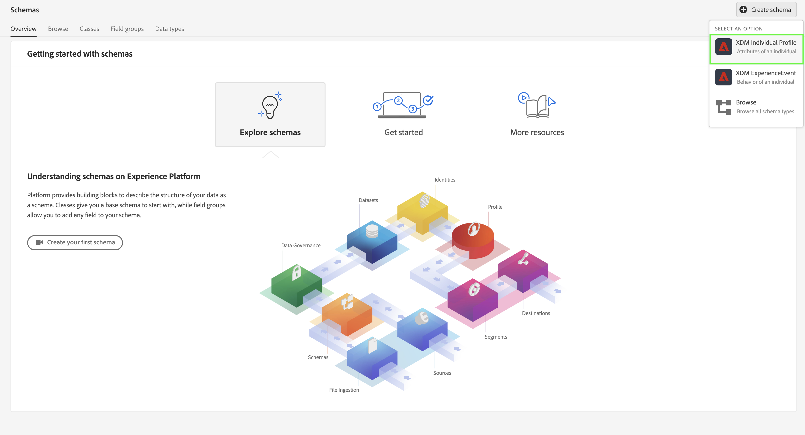

   >[!INFO]
   >
   >    Se utiliza un esquema de perfil individual para modelar los _atributos_ del perfil (como nombre, correo electrónico o sexo). Se utiliza un esquema de eventos de experiencia para modelar el _comportamiento_ de un perfil (como la vista de página, o agregar al carro de compras).

3. En la pantalla [!UICONTROL Esquema sin título]:

   1. Introduzca un nombre para mostrar para el esquema y (opcionalmente) una descripción.

      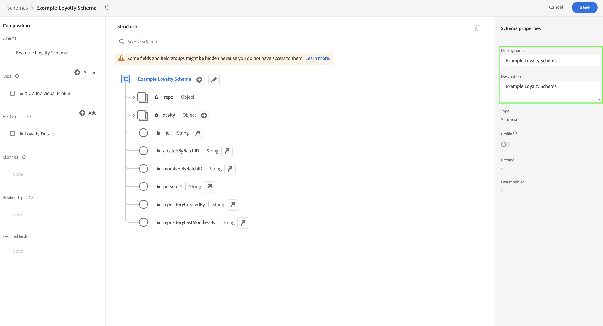

   2. Seleccione **[!UICONTROL + Agregar]** en [!UICONTROL Grupos de campos].

      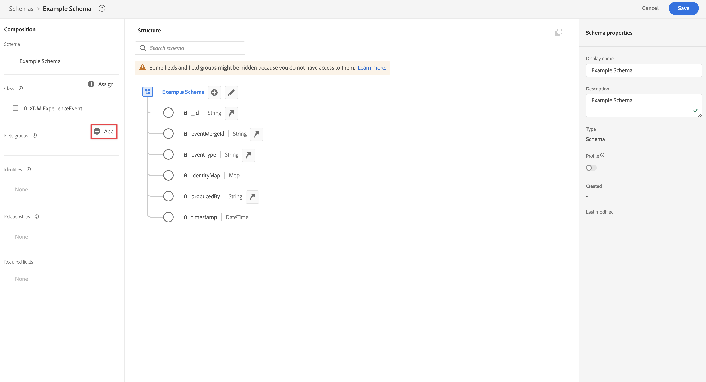

      Los grupos de campos son una colección reutilizable de objetos y atributos que le permiten ampliar fácilmente sus esquemas.

   3. En el cuadro de diálogo [!UICONTROL Agregar grupos de campos] seleccione el grupo de campos **[!UICONTROL Detalles de fidelidad]** en la lista.

      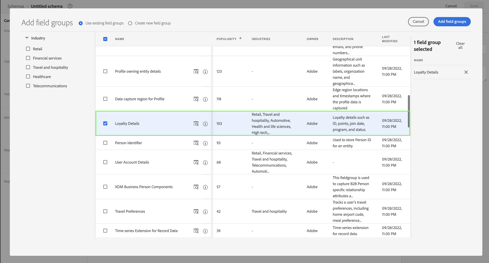

      Puede seleccionar el botón de vista previa para ver una vista previa de los campos que forman parte de este grupo de campos.

      

      Seleccione **[!UICONTROL Atrás]** para cerrar la vista previa.

   4. Seleccione **[!UICONTROL Agregar grupos de campos]**.

4. Seleccione **[!UICONTROL +]** junto al nombre del esquema en el panel [!UICONTROL Estructura].

   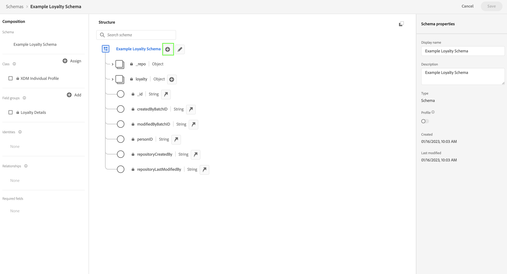

5. En el panel [!UICONTROL Propiedades de campo], introduzca `Identification` como nombre, **[!UICONTROL Identificación]** como [!UICONTROL Nombre para mostrar], seleccione **[!UICONTROL Objeto]** como [!UICONTROL Tipo] y seleccione **[!UICONTROL Profile Core v2]** como [!UICONTROL Grupo de campos].

   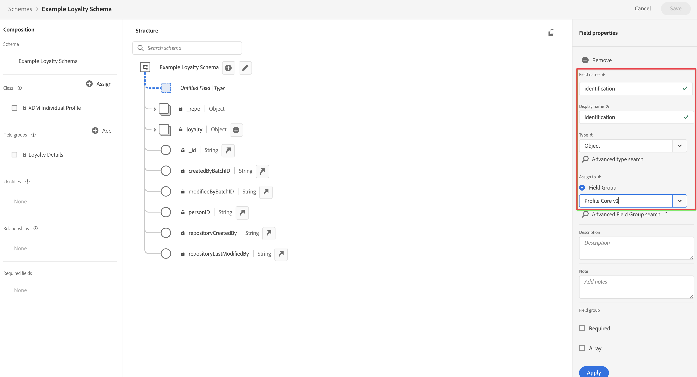

   Esto añade capacidades de identificación al esquema. En su caso, desea identificar la información de fidelidad utilizando la dirección de correo electrónico en los datos por lotes.

   Seleccione **[!UICONTROL Aplicar]** para agregar este objeto al esquema.

6. Seleccione el campo de **[!UICONTROL correo electrónico]** en el objeto de identificación que acaba de añadir y seleccione **[!UICONTROL Identidad]** y **[!UICONTROL Correo electrónico]** en el [!UICONTROL Área de nombres de identidad] del panel [!UICONTROL Propiedades de campo].

   

   Está especificando la dirección de correo electrónico como la identidad que el servicio de identidad de Adobe Experience Platform puede utilizar para combinar (unir) el comportamiento de los perfiles.

   Seleccione **[!UICONTROL Aplicar]**. Verá que aparece un icono de huella digital en el atributo de correo electrónico.

7. Seleccione el nivel raíz del esquema (con el nombre del esquema) y, a continuación, seleccione el conmutador **[!UICONTROL Perfil]**.

   Se le pedirá que habilite el esquema para el perfil. Tras la habilitación, cuando los datos se incorporan en conjuntos de datos basados en este esquema, los datos se combinan en el perfil del cliente en tiempo real.

   Consulte [Habilitar el esquema para utilizarlo en el perfil del cliente en tiempo real](https://experienceleague.adobe.com/docs/experience-platform/xdm/tutorials/create-schema-ui.html?lang=es#profile) para obtener más información.

   >[!IMPORTANT]
   >
   >    Una vez guardado un esquema habilitado para perfil, ya no se puede deshabilitar para perfil.

   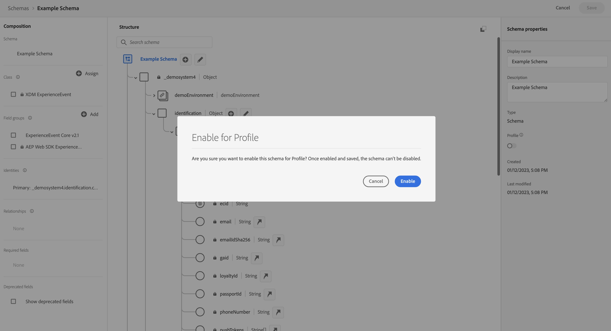

8. Seleccione **[!UICONTROL Guardar]** para guardar el esquema.

Ha creado un esquema mínimo que modela los datos de fidelidad que puede ingerir en Adobe Experience Platform. El esquema permite identificar perfiles mediante la dirección de correo electrónico. Al habilitar el esquema para el perfil, se asegura de que los datos del origen de streaming se agregan al perfil del cliente en tiempo real.

Consulte [Crear y editar esquemas en la interfaz de usuario](https://experienceleague.adobe.com/docs/experience-platform/xdm/ui/resources/schemas.html?lang=es) para obtener más información sobre cómo agregar y quitar grupos de campos y campos individuales a un esquema.

### Configurar un conjunto de datos

Con el esquema, ha definido el modelo de datos. Ahora tiene que definir la construcción para almacenar y administrar esos datos. Esto se realiza mediante conjuntos de datos.

Para configurar un conjunto de datos:

1. En la interfaz de usuario de Adobe Experience Platform, en el carril izquierdo, seleccione **[!UICONTROL Conjuntos de datos]** en [!UICONTROL ADMINISTRACIÓN DE DATOS].

2. Seleccione **[!UICONTROL Crear conjunto de datos]**.

   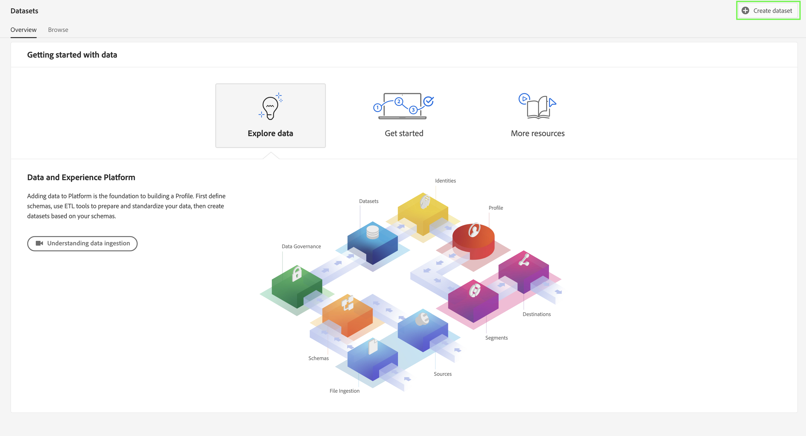

3. Seleccione **[!UICONTROL Crear conjunto de datos a partir de esquema]**.

   Haga clic en 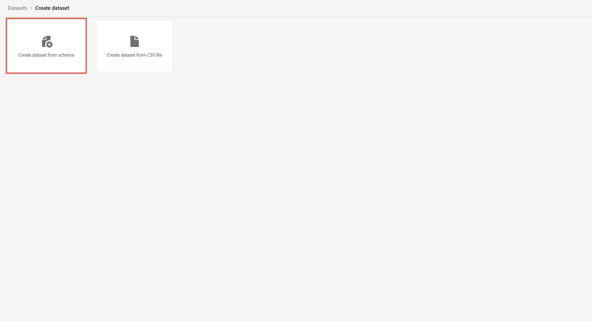

4. Seleccione el esquema creado anteriormente y, después, **[!UICONTROL Siguiente]**.

5. Asigne un nombre al conjunto de datos y (opcionalmente) proporcione una descripción.

   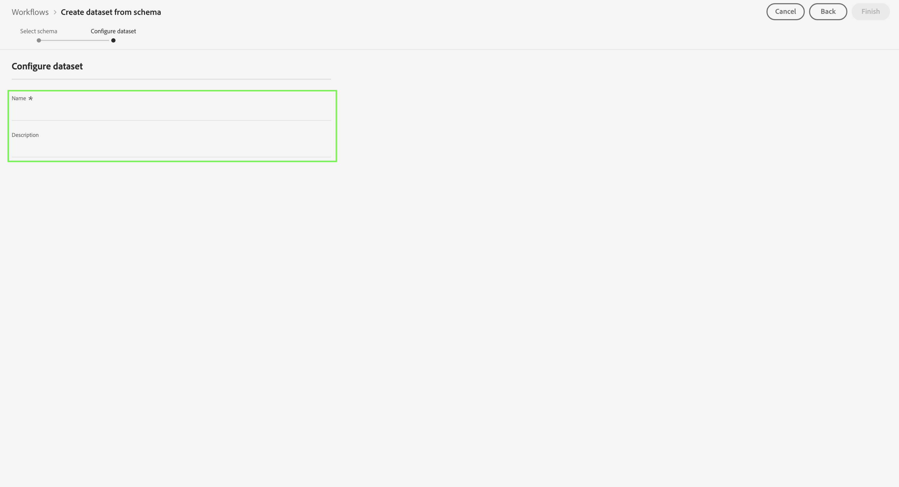

6. Seleccione **[!UICONTROL Finalizar]**.

7. Seleccione el conmutador **[!UICONTROL Perfil]**.

   Se le pedirá que habilite el conjunto de datos para el perfil. Una vez habilitado, el conjunto de datos enriquece los perfiles de clientes en tiempo real con sus datos ingeridos.

   >[!IMPORTANT]
   >
   >    Solo puede habilitar un conjunto de datos para un perfil cuando el esquema, al que se adhiere el conjunto de datos, también esté habilitado para el perfil.

   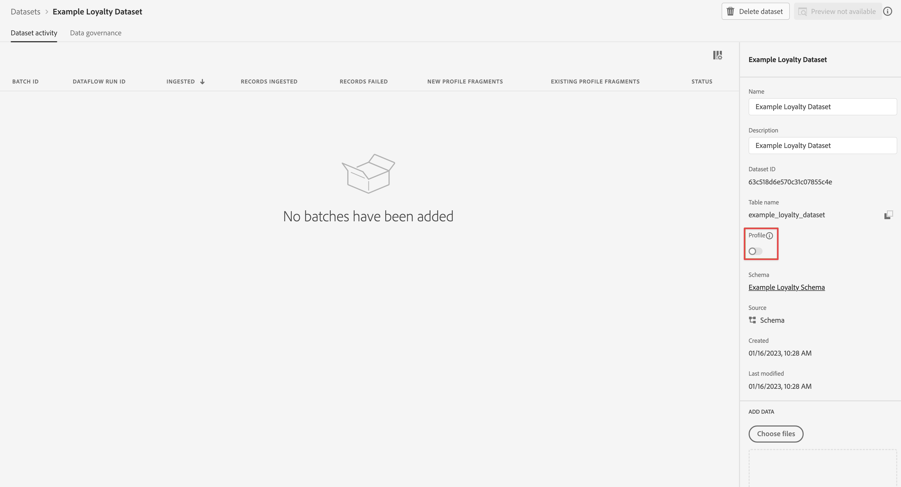

Consulte [Guía de la interfaz de usuario de conjuntos de datos](https://experienceleague.adobe.com/docs/experience-platform/catalog/datasets/user-guide.html?lang=es) para obtener más información sobre cómo ver, previsualizar, crear o eliminar un conjunto de datos. Y cómo habilitar un conjunto de datos para el perfil del cliente en tiempo real.

## Uso de un conector de origen

Según el origen de los datos de fidelidad, elija el conector de origen correspondiente disponible en Adobe Experience Platform.

Para configurar un conector de origen, debe hacer lo siguiente:

1. En la interfaz de usuario de Adobe Experience Platform, seleccione **[!UICONTROL Orígenes]** en [!UICONTROL CONEXIONES], en el carril izquierdo.

2. Seleccione el conector de origen de la lista de conectores de origen disponibles. Cada conector sigue un flujo de trabajo similar:

   - **[!UICONTROL Autenticación]**. Se proporcionan los detalles de autenticación para acceder al origen de los datos.

   - **[!UICONTROL Seleccionar datos]**: seleccione los datos de origen que quiera ingerir.

   - **[!UICONTROL Detalles de flujo de datos]**: se proporcionan detalles adicionales sobre el flujo de datos, es decir, el nombre y qué conjunto de datos se debe utilizar.

   - **[!UICONTROL Asignación]**: los campos de datos de origen entrantes se asignan a atributos del esquema asociado al conjunto de datos seleccionado.

   - **[!UICONTROL Programación]**: si está disponible, permite programar la ingesta de datos.

   - **[!UICONTROL Revisar]**: presenta una revisión de la definición del conector de origen.

   Cada conector proporciona documentación detallada.

   Para acceder a esta documentación, debe hacer lo siguiente:

   - En el mosaico del conector, seleccione la opción **[!UICONTROL ...]** junto a [!UICONTROL Configurar] o [!UICONTROL Agregar datos].

      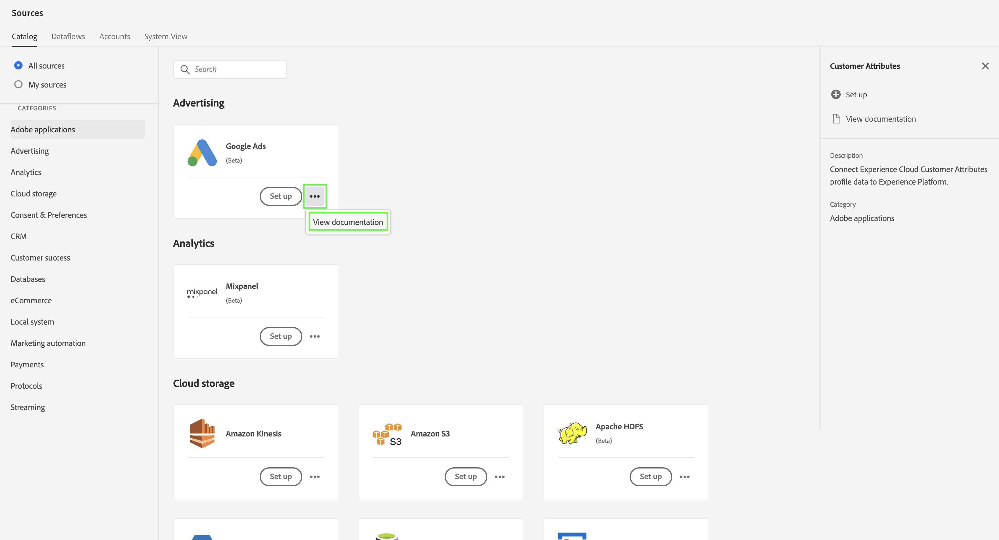

   - Seleccione **[!UICONTROL Ver documentación]**.

Consulte [Ingesta y uso de datos de Adobe Analytics tradicional](./analytics.md) para obtener información sobre cómo utilizar el conector de origen de Adobe Analytics.

Consulte [Ingesta y uso de datos de streaming](./streaming.md) para obtener información sobre cómo utilizar el conector de origen de API HTTP.

Consulte [Información general sobre conectores de origen](https://experienceleague.adobe.com/docs/experience-platform/sources/home.html?lang=es#terms-and-conditions) para obtener información general sobre los conectores de origen, incluidos vínculos a más información sobre cada conector.

## Configurar una conexión

Para utilizar los datos de Adobe Experience Platform en Customer Journey Analytics, se crea una conexión que incluye los datos resultantes de la configuración del esquema, el conjunto de datos y el flujo de trabajo.

Una conexión le permite integrar conjuntos de datos de Adobe Experience Platform en Workspace. Para informar sobre estos conjuntos de datos, primero debe establecer una conexión entre conjuntos de datos en Adobe Experience Platform y Workspace.

Para crear la conexión:

1. En la interfaz de usuario de Customer Journey Analytics, seleccione **[!UICONTROL Conexiones]** en la barra de navegación superior.

2. Seleccione **[!UICONTROL Crear nueva conexión]**.

3. En la pantalla [!UICONTROL Conexión sin título]:

   Asigne un nombre a la conexión y descríbala en [!UICONTROL Configuración de la conexión].

   Seleccione la zona protegida correcta en la lista [!UICONTROL Zona protegida] en [!UICONTROL Configuración de datos] y seleccione el número de eventos diarios en la lista [!UICONTROL Número medio de eventos diarios].

   

   Seleccione **[!UICONTROL Agregar conjuntos de datos]**.

   En el paso [!UICONTROL Seleccionar conjuntos de datos] en [!UICONTROL Agregar conjuntos de datos]:

   - Seleccione el conjunto de datos que creó anteriormente (`Example Loyalty Dataset`) y cualquier otro conjunto de datos que quiera incluir en la conexión.

      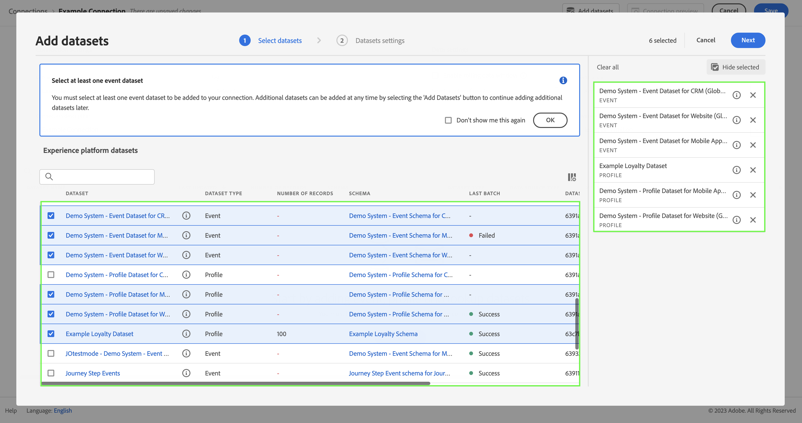

   - Seleccione **[!UICONTROL Siguiente]**.
   En el paso [!UICONTROL Configuración de conjuntos de datos] en [!UICONTROL Agregar conjuntos de datos]:

   - Para cada conjunto de datos:

      - Seleccione un [!UICONTROL ID de persona] entre las identidades disponibles de los esquemas del conjunto de datos en Adobe Experience Platform.

      - Seleccione la fuente de datos correcta en la lista [!UICONTROL Tipo de fuente de datos]. Si especifica **[!UICONTROL Otro]**, agregue una descripción para la fuente de datos.

      - Establezca **[!UICONTROL Importar todos los datos nuevos]** y **[!UICONTROL Relleno de conjuntos de datos de datos existentes]** según sus preferencias.

      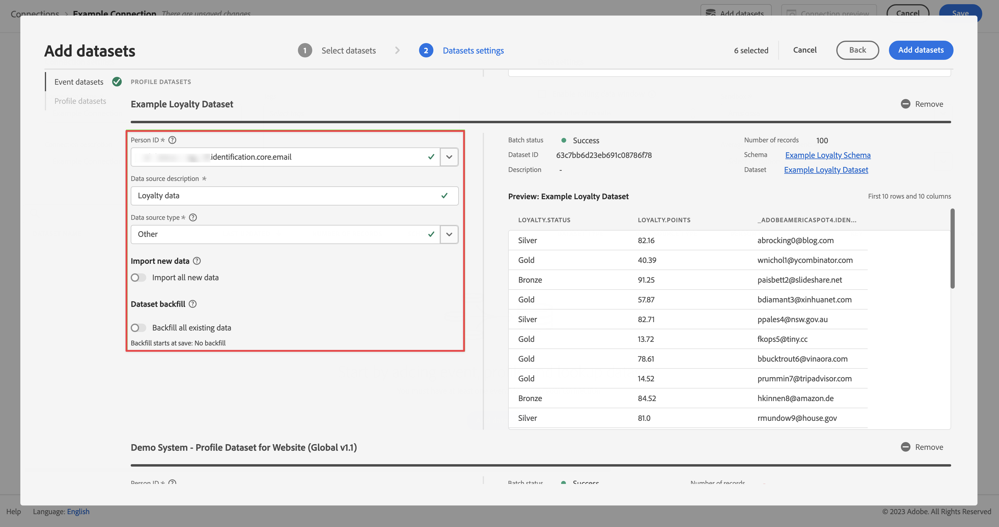

   - Seleccione **[!UICONTROL Agregar conjuntos de datos]**.
   Seleccione **[!UICONTROL Guardar]**.

Consulte [Información general sobre conexiones](../connections/overview.md) para obtener más información sobre cómo crear y administrar una conexión y cómo seleccionar y combinar conjuntos de datos.

## Configurar una vista de datos

Una vista de datos es un contenedor específico de Customer Journey Analytics que le permite determinar cómo interpretar los datos de una conexión. Especifica todas las dimensiones y métricas disponibles en Analysis Workspace y de qué columnas obtienen esos datos las dimensiones y métricas. Las vistas de datos se definen a fin de prepararse para la creación de informes en Analysis Workspace.

Para crear la vista de datos:

1. En la interfaz de usuario de Customer Journey Analytics, seleccione **[!UICONTROL Vistas de datos]** en la barra de navegación superior.

2. Seleccione **[!UICONTROL Crear nueva vista de datos]**.

3. En el paso [!UICONTROL Configurar]:

   Seleccione la conexión en la lista [!UICONTROL Conexión].

   Asigne un nombre y (opcionalmente) describa su conexión.

   

   Seleccione **[!UICONTROL Guardar y continuar]**.

4. En el paso [!UICONTROL Componentes]:

   Agregue cualquier campo de esquema y/o componente estándar que quiera incluir en los cuadros de componentes [!UICONTROL MÉTRICAS] o [!UICONTROL DIMENSIONES].

   

   Seleccione **[!UICONTROL Guardar y continuar]**.

5. En el paso [!UICONTROL Configuración]:

   Configuración de 

   Deje la configuración tal como está y seleccione **[!UICONTROL Guardar y finalizar]**.

Consulte [Información general de las vistas de datos](../data-views/data-views.md) para obtener más información sobre cómo crear y editar una vista de datos, qué componentes están disponibles para usar en la vista de datos y cómo usar la configuración de filtro y sesiones.

## Configurar un proyecto

Analysis Workspace es una herramienta de navegador flexible que le permite compilar análisis y compartir perspectivas rápidamente, en función de los datos. Los proyectos de Workspace se usan para combinar componentes, tablas y visualizaciones de datos para crear un análisis y compartirlo con cualquier persona de su organización.

Para crear un proyecto:

1. En la interfaz de usuario de Customer Journey Analytics, seleccione **[!UICONTROL Proyectos]** en la barra de navegación superior.

2. Seleccione **[!UICONTROL Proyectos]** en el panel de navegación izquierdo.

3. Seleccione **[!UICONTROL Crear proyecto]**.

   

   Seleccione **[!UICONTROL Proyecto en blanco]**.

   

4. Seleccione la vista de datos en la lista.

   .

5. Comience a arrastrar y soltar dimensiones y métricas en la [!UICONTROL Tabla de forma libre] del [!UICONTROL Panel] para crear su primer informe. Por ejemplo, arrastre `Program Points Balance` y `Page View` como métricas y `email` como dimensión para obtener una visión general rápida de los perfiles que han visitado su sitio web y forman parte del programa de fidelidad que recopila puntos de fidelidad.

   

Consulte [Información general de Analysis Workspace](../analysis-workspace/home.md) para obtener más información sobre cómo crear proyectos y compilar su análisis mediante componentes, visualizaciones y paneles.

>[!SUCCESS]
>
>Ha completado todos los pasos. Empezando por definir qué datos de fidelidad quiere recopilar (esquema) y dónde quiere almacenarlos (conjunto de datos) en Adobe Experience Platform, ha configurado el conector de origen apropiado para proporcionarle los datos de fidelidad. Ha definido una conexión en Customer Journey Analytics para utilizar los datos de fidelidad ingeridos y otros datos. La definición de la vista de datos le permite especificar qué dimensión y métricas debe utilizar y, finalmente, crear su primer proyecto visualizando y analizando los datos.
