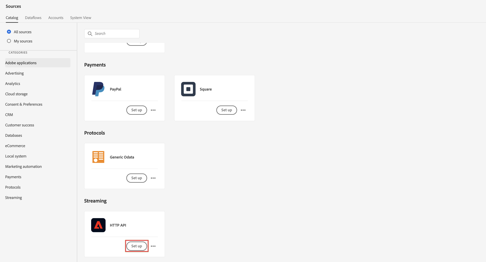
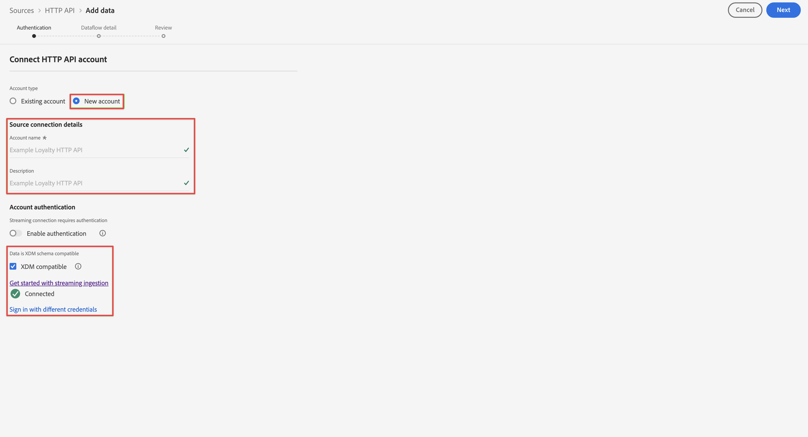
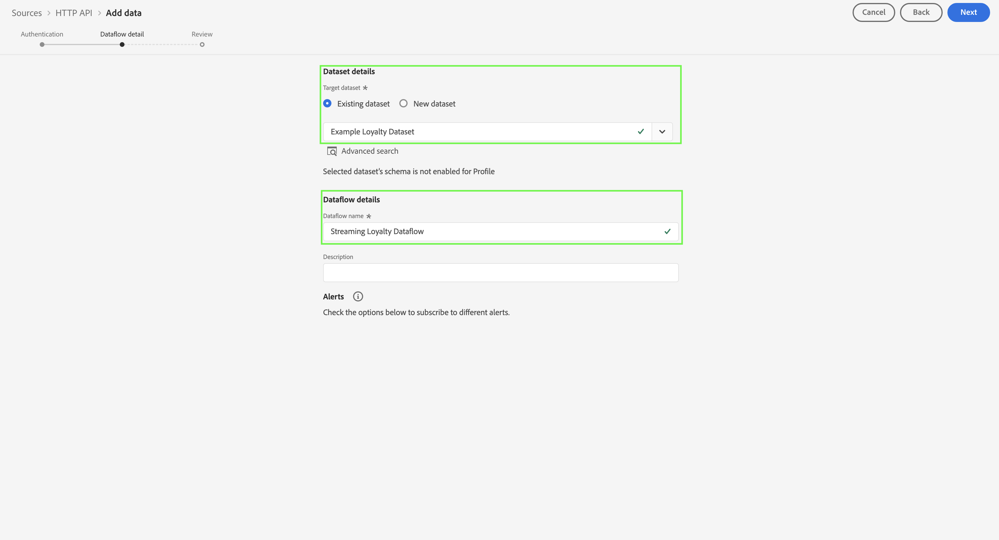
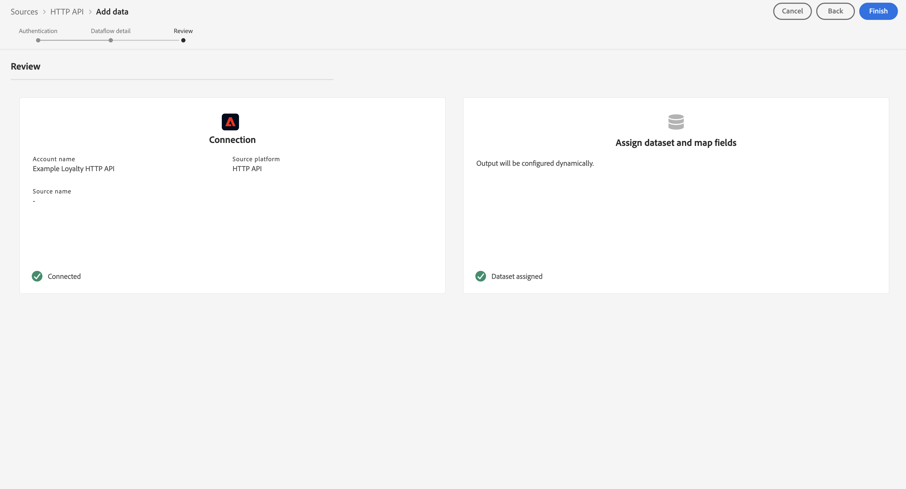
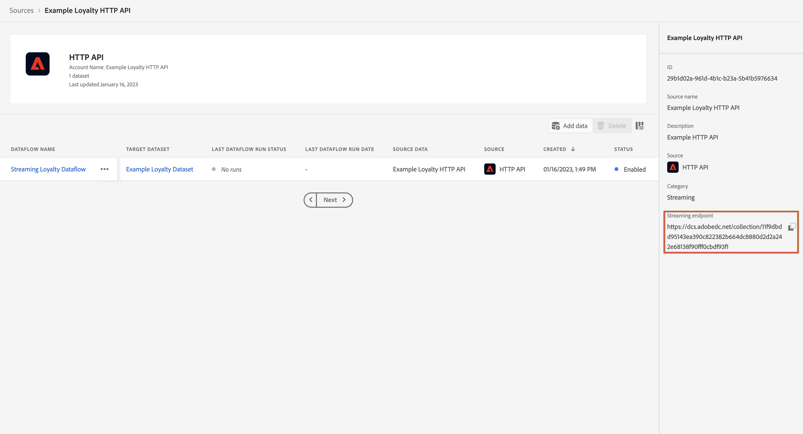

# Ingesta y uso de datos de flujo continuo

En esta guía de inicio rápido se explica cómo puede ingerir datos de flujo continuo en Adobe Experience Platform y, a continuación, utilizar esos datos en Customer Journey Analytics.

Para lograr esto, debe:

- **Configuración de un esquema y un conjunto de datos** en Adobe Experience Platform para definir el modelo (esquema) de los datos que desea recopilar y dónde recopilar realmente los datos (conjunto de datos).

- **Uso del conector de origen de API HTTP** para transmitir fácilmente sus datos al conjunto de datos configurado en Adobe Experience Platform.

- **Configuración de una conexión** en Customer Journey Analytics. Esta conexión debe incluir (al menos) su conjunto de datos de Adobe Experience Platform.

- **Configuración de una vista de datos** en Customer Journey Analytics para definir métricas y dimensiones que desee utilizar en Analysis Workspace.

- **Configuración de un proyecto** en Customer Journey Analytics para crear sus informes y visualizaciones.


>[!NOTE]
>
>Esta es una guía simplificada sobre cómo ingerir datos de flujo continuo en Adobe Experience Platform y utilizarlos en Customer Journey Analytics.  Se recomienda estudiar la información adicional cuando se haga referencia a ella.

## Configuración de un esquema y un conjunto de datos

Para introducir datos en Adobe Experience Platform, primero debe definir qué datos desea recopilar. Todos los datos introducidos en Adobe Experience Platform deben cumplir una estructura estándar y desnormalizada para que las funciones y características descendentes puedan reconocerlos y actuar en consecuencia. Experience Data Model (XDM) es el marco estándar que proporciona esta estructura en forma de esquemas.

Una vez que haya definido un esquema, utilizará uno o más conjuntos de datos para almacenar y administrar la recopilación de datos. Un conjunto de datos es una construcción de almacenamiento y administración para una colección de datos, normalmente una tabla, que contiene un esquema (columnas) y campos (filas).

Todos los datos introducidos en Adobe Experience Platform deben cumplir un esquema predefinido para que se puedan conservar como conjunto de datos.

### Configuración de un esquema

Para este inicio rápido asumimos que desea recopilar algunos datos de fidelidad, por ejemplo, ID de fidelidad, puntos de fidelidad y estado de fidelidad.
Para ello, primero debe definir un esquema que modele estos datos.

Para configurar el esquema:

1. En la interfaz de usuario de Adobe Experience Platform, en el carril izquierdo, seleccione **[!UICONTROL Esquemas]** en [!UICONTROL ADMINISTRACIÓN DE DATOS].

2. Select **[!UICONTROL Crear esquema]**. Select **[!UICONTROL Perfil individual XDM]** de la lista de opciones.

   

   >[!INFO]
   >
   >    Se utiliza un esquema de perfil individual para modelar el perfil _attributes_ (como nombre, correo electrónico o sexo). Un esquema de eventos de experiencia se utiliza para modelar la variable _comportamiento_ de un perfil (como la vista de página, agregar al carro de compras).


3. En el [!UICONTROL Esquema sin título] pantalla:

   1. Introduzca un nombre para mostrar para el esquema y (opcional) una descripción.

      

   2. Select **[!UICONTROL + Agregar]** en [!UICONTROL Grupos de campo].

      

      Los grupos de campos son una colección reutilizable de objetos y atributos que le permiten ampliar fácilmente sus esquemas.

   3. En el [!UICONTROL Agregar grupos de campos] seleccione **[!UICONTROL Detalles de fidelidad]** grupo de campos de la lista.

      

      Puede seleccionar el botón de vista previa para ver una vista previa de los campos que forman parte de este grupo de campos.

      

      Select **[!UICONTROL Atrás]** para cerrar la vista previa.

   4. Select **[!UICONTROL Agregar grupos de campos]**.

4. Select **[!UICONTROL +]** junto al nombre del esquema en la [!UICONTROL Estructura] panel.

   

5. En el [!UICONTROL Propiedades de campo] , introduzca `Identification` como nombre, **[!UICONTROL Identificación]** como el [!UICONTROL Nombre para mostrar], seleccione **[!UICONTROL Objeto]** como el [!UICONTROL Tipo] y seleccione **[!UICONTROL Perfil principal v2]** como el [!UICONTROL Grupo de campos].

   

   Esto agregará capacidades de identificación al esquema. En su caso, desea identificar la información de fidelidad utilizando la dirección de correo electrónico en los datos de lote.

   Select **[!UICONTROL Aplicar]** para añadir este objeto al esquema.

6. Seleccione el **[!UICONTROL email]** en el objeto de identificación que acaba de añadir y seleccione **[!UICONTROL Identidad]** y **[!UICONTROL Correo electrónico]** de la variable [!UICONTROL Área de nombres de identidad] en el [!UICONTROL Propiedades de campo] panel.

   

   Está especificando la dirección de correo electrónico como la identidad que el servicio de identidad de Adobe Experience Platform puede utilizar para combinar (unir) el comportamiento de los perfiles.

   Select **[!UICONTROL Aplicar]**. Verá que aparece un icono de huella en el atributo de correo electrónico.

7. Seleccione el nivel raíz del esquema (con el nombre del esquema) y, a continuación, seleccione el **[!UICONTROL Perfil]** .

   Se le pedirá que habilite el esquema para el perfil. Una vez habilitados, cuando los datos se incorporen en conjuntos de datos basados en este esquema, esos datos se combinarán en el Perfil del cliente en tiempo real.

   Consulte [Habilitar el esquema para utilizarlo en el perfil de cliente en tiempo real](https://experienceleague.adobe.com/docs/experience-platform/xdm/tutorials/create-schema-ui.html?lang=en#profile) para obtener más información.

   >[!IMPORTANT]
   >
   >    Una vez guardado un esquema habilitado para perfil, ya no se puede deshabilitar para perfil.

   

8. Select **[!UICONTROL Guardar]** para guardar el esquema.

Ha creado un esquema mínimo que modela los datos de fidelidad que puede introducir en Adobe Experience Platform . El esquema permite identificar perfiles mediante la dirección de correo electrónico. Al habilitar el esquema para el perfil, se asegura de que los datos del origen de flujo continuo se agregan al perfil del cliente en tiempo real.

Consulte [Crear y editar esquemas en la interfaz de usuario](https://experienceleague.adobe.com/docs/experience-platform/xdm/ui/resources/schemas.html) para obtener más información sobre cómo agregar y quitar grupos de campos y campos individuales a un esquema.

### Configuración de un conjunto de datos

Con el esquema ha definido el modelo de datos. Ahora tiene que definir la construcción para almacenar y administrar esos datos. Esto se realiza mediante conjuntos de datos.

Para configurar su conjunto de datos:

1. En la interfaz de usuario de Adobe Experience Platform, en el carril izquierdo, seleccione **[!UICONTROL Conjuntos de datos]** en [!UICONTROL ADMINISTRACIÓN DE DATOS].

2. Select **[!UICONTROL Crear conjunto de datos]**.

   

3. Select **[!UICONTROL Crear conjunto de datos a partir del esquema]**.

   

4. Seleccione el esquema creado anteriormente y seleccione **[!UICONTROL Siguiente]**.

5. Asigne un nombre al conjunto de datos y (opcional) proporcione una descripción.

   

6. Select **[!UICONTROL Finalizar]**.

7. Seleccione el **[!UICONTROL Perfil]** .

   Se le pedirá que habilite el conjunto de datos para el perfil. Una vez habilitado, el conjunto de datos enriquecerá los perfiles de clientes en tiempo real con sus datos introducidos.

   >[!IMPORTANT]
   >
   >    Solo se puede habilitar un conjunto de datos para el perfil cuando el esquema, al que se adhiere el conjunto de datos, también esté habilitado para el perfil.

   

Consulte [Guía de la interfaz de usuario de conjuntos de datos](https://experienceleague.adobe.com/docs/experience-platform/catalog/datasets/user-guide.html?lang=es) para obtener más información sobre cómo ver, previsualizar, crear o eliminar un conjunto de datos. Y cómo habilitar un conjunto de datos para el perfil del cliente en tiempo real.


## Configuración de una conexión de flujo continuo de API HTTP

La aplicación de origen transmite datos que se ajustan al esquema creado y que tienen el aspecto siguiente.

```json
{
    ...
    "_demosystem4": {
        "identification": {
            "core": {
                "email": "abrocking0@blog.com",
                "loyaltyId": "793406",
            }
        }
    },
    "loyalty": {
        "loyaltyID": [
            "793406"
        ],
        "points": 82.16,
        "status": "Silver"
    }
    ...
}
```

Para transmitir estos datos al conjunto de datos que hemos creado, debe definir un extremo de flujo continuo al que se enviarán esos datos. Para ello, debe definir un conector de origen de API HTTP.

Para crear un conector de origen de API HTTP:

1. En la interfaz de usuario del Experience Platform, seleccione **[!UICONTROL Fuentes]** under [!UICONTROL CONEXIONES] en el carril izquierdo.

2. Select **[!UICONTROL Transmisión]** de la lista de [!UICONTROL CATEGORÍAS].

3. Select **Configuración** en el [!UICONTROL API HTTP] mosaico.

   

4. En el [!UICONTROL Autenticación] del [!UICONTROL Añadir datos] pantalla:

   Escriba un nombre y una descripción para la conexión de API HTTP.

   Select **[!UICONTROL Compatible con XDM]** para indicar que los datos que va a transmitir son compatibles con un esquema XDM existente.

   Select **[!UICONTROL Conectar a origen]**. Después de una conexión correcta, verá [!UICONTROL Conectado].

   

   Haga clic en **[!UICONTROL Siguiente]** para continuar.

5. En el [!UICONTROL Detalles de flujo de datos] del [!UICONTROL Añadir datos] pantalla:

   Select **[!UICONTROL Conjunto de datos existente]**, seleccione su conjunto de datos en la lista de conjuntos de datos y asigne un nombre a su [!UICONTROL Nombre de flujo de datos].

   

   Seleccione **[!UICONTROL Siguiente]**.

6. La variable [!UICONTROL Consulte] del [!UICONTROL Añadir datos] le proporciona una descripción general de la conexión de API HTTP.

   

   Select **[!UICONTROL Finalizar]**.

7. Verá la definición final del extremo de flujo de API HTTP.

   

Puede copiar la URL del extremo de flujo continuo y utilizarla para configurar la aplicación de lealtad para que transmita datos al conjunto de datos de fidelidad de Adobe Experience Platform.

Consulte [Creación de una conexión de flujo continuo de API HTTP mediante la interfaz de usuario](https://experienceleague.adobe.com/docs/experience-platform/sources/ui-tutorials/create/streaming/http.html?lang=en) para ver un tutorial mucho más completo que explica cómo utilizar la autenticación, cómo asignar datos cuando los datos entrantes no son compatibles con el esquema XDM y cómo crear un nuevo conjunto de datos como parte de la configuración del conector de flujo continuo.


## Configuración de una conexión

Para utilizar los datos de Adobe Experience Platform en Customer Journey Analytics, se crea una conexión que incluye los datos resultantes de la configuración del esquema, el conjunto de datos y el flujo de trabajo.

Una conexión le permite integrar conjuntos de datos de Adobe Experience Platform el Espacio de trabajo. Para informar sobre estos conjuntos de datos, primero debe establecer una conexión entre conjuntos de datos en Adobe Experience Platform y Workspace.

Para crear la conexión:

1. En la interfaz de usuario del Customer Journey Analytics, seleccione **[!UICONTROL Conexiones]** en la barra de navegación superior.

2. Select **[!UICONTROL Crear nueva conexión]**.

3. En el [!UICONTROL Conexión sin título] pantalla:

   Asigne un nombre a la conexión y describa su [!UICONTROL Configuración de conexión].

   Seleccione el simulador de pruebas correcto en el [!UICONTROL Sandbox] en [!UICONTROL Configuración de datos] y seleccione el número de eventos diarios en la [!UICONTROL Promedio de eventos diarios] lista.

   

   Select **[!UICONTROL Agregar conjuntos de datos]**.

   En el [!UICONTROL Seleccionar conjuntos de datos] paso a paso [!UICONTROL Agregar conjuntos de datos]:

   - Seleccione el conjunto de datos creado anteriormente (`Example Loyalty Dataset`) y cualquier otro conjunto de datos que desee incluir en la conexión.

      

   - Seleccione **[!UICONTROL Siguiente]**.
   En el [!UICONTROL Configuración de conjuntos de datos] paso a paso [!UICONTROL Agregar conjuntos de datos]:

   - Para cada conjunto de datos:

      - Seleccione un [!UICONTROL ID de persona] de las identidades disponibles definidas en los esquemas de conjuntos de datos en Adobe Experience Platform.

      - Seleccione la fuente de datos correcta de la [!UICONTROL Tipo de fuente de datos] lista. Si especifica **[!UICONTROL Otro]** a continuación, agregue una descripción para la fuente de datos.

      - Establezca **[!UICONTROL Importar todos los datos nuevos]** y **[!UICONTROL Relleno de conjuntos de datos de datos existentes]** según sus preferencias.

      

   - Select **[!UICONTROL Agregar conjuntos de datos]**.
   Seleccione **[!UICONTROL Guardar]**.

Consulte [Información general sobre conexiones](../connections/overview.md) para obtener más información sobre cómo crear y administrar una conexión y cómo seleccionar y combinar conjuntos de datos.

## Configuración de una vista de datos

Una vista de datos es un contenedor específico de Customer Journey Analytics que le permite determinar cómo interpretar los datos de una conexión. Especifica todas las dimensiones y métricas disponibles en Analysis Workspace y de qué columnas obtienen esos datos las dimensiones y métricas. Las vistas de datos se definen a fin de prepararse para la creación de informes en Analysis Workspace.

Para crear la vista de datos:

1. En la interfaz de usuario del Customer Journey Analytics, seleccione **[!UICONTROL Vistas de datos]** en la barra de navegación superior.

2. Select **[!UICONTROL Crear nueva vista de datos]**.

3. En el [!UICONTROL Configurar] paso:

   Seleccione la conexión en el [!UICONTROL Conexión] lista.

   Nombre y (opcionalmente) describa su conexión.

   

   Select **[!UICONTROL Guardar y continuar]**.

4. En el [!UICONTROL Componentes] paso:

   Añada cualquier campo de esquema o componente estándar que desee incluir al [!UICONTROL MÉTRICAS] o [!UICONTROL Dimension] cuadros de componentes.

   

   Select **[!UICONTROL Guardar y continuar]**.

5. En el [!UICONTROL Configuración] paso:

   Configuración de 

   Deje la configuración tal como está y seleccione **[!UICONTROL Guardar y finalizar]**.

Consulte [Resumen de las vistas de datos](../data-views/data-views.md) para obtener más información sobre cómo crear y editar una vista de datos, qué componentes están disponibles para usar en la vista de datos y cómo usar la configuración de filtro y sesiones.


## Configuración de un proyecto

Analysis Workspace es una herramienta de navegador flexible que le permite crear análisis y compartir perspectivas rápidamente en función de sus datos. Los proyectos de Workspace se utilizan para combinar componentes de datos, tablas y visualizaciones para crear su análisis y compartirlo con cualquier persona de su organización.

Para crear el proyecto:

1. En la interfaz de usuario del Customer Journey Analytics, seleccione **[!UICONTROL Proyectos]** en la barra de navegación superior.

2. Select **[!UICONTROL Proyectos]** en el panel de navegación izquierdo.

3. Select **[!UICONTROL Crear proyecto]**.

   

   Select **[!UICONTROL Proyecto en blanco]**.

   

4. Seleccione la vista de datos de la lista.

   .

5. Comience a arrastrar y soltar dimensiones y métricas en la [!UICONTROL Tabla improvisada] en el [!UICONTROL Panel] para crear su primer informe. Por ejemplo, arrastre `Program Points Balance` y `Page View` como métricas y `email` como dimensión para obtener una visión general rápida de los perfiles que han visitado su sitio web y también forman parte del programa de fidelidad que recopila puntos de fidelidad.

   

Consulte [Información general de Analysis Workspace](../analysis-workspace/home.md) para obtener más información sobre cómo crear proyectos y crear su análisis mediante componentes, visualización y paneles.

>[!SUCCESS]
>
>Ha completado todos los pasos. Empezando por definir qué datos de lealtad desea recopilar (esquema) y dónde almacenarlos (conjunto de datos) en Adobe Experience Platform, se configuró un conector de origen de API HTTP para transmitir los datos de fidelidad directamente al conjunto de datos. La definición de la vista de datos le permite especificar qué dimensión y métricas utilizar y, finalmente, creó su primer proyecto visualizando y analizando los datos.

