# Duplicación y uso de datos relacionales

{{release-limited-testing}}

En esta guía de inicio rápido se explica cómo usar [Experience Platform Data Mirror for Customer Journey Analytics](data-mirror.md) para reflejar datos relacionales de una solución nativa de Data Warehouse en Adobe Experience Platform. Y luego usar esos datos en Customer Journey Analytics.

Para aplicar este caso de uso, debe:

* **Use una solución nativa del almacén de datos** para almacenar los datos que desea reflejar en Experience Platform. Y luego usar esos datos en Customer Journey Analytics para informar y analizar.

* **Configure un esquema** en Experience Platform para definir el modelo (esquema) de los datos que desea reflejar.

* **Use un conector de origen** en Experience Platform para obtener los datos reflejados en un conjunto de datos.

* **Configurar una conexión** en Customer Journey Analytics. Esta conexión debe incluir (al menos) su conjunto de datos relacional de Experience Platform.

* **Configurar una vista de datos** en Customer Journey Analytics para definir las métricas y las dimensiones que desea utilizar en Analysis Workspace.

* **Configurar un proyecto** en Customer Journey Analytics para crear sus informes y visualizaciones.

Experience Platform Data Mirror para Customer Journey Analytics requiere esquemas relacionales.


>[!NOTE]
>
>Esta guía de inicio rápido es una guía simplificada sobre cómo duplicar datos relacionales en Adobe Experience Platform y utilizar esos datos en Customer Journey Analytics. Se recomienda estudiar la información adicional cuando se haga referencia a ella.

{{relational-model-based}}

## Uso de una solución nativa de Data Warehouse

Esta guía de inicio rápido utiliza [[!DNL Google BigQuery]](datawarehouse.md#google-bigquery) como solución nativa del almacén de datos. Otras [soluciones compatibles](datawarehouse.md) son [[!DNL Snowflake]](datawarehouse.md#snowflake) y [[!DNL Azure Databricks]](datawarehouse.md#azure-databricks).

En [!DNL Google BigQuery], los siguientes datos de ejemplo se almacenan y actualizan con regularidad en una tabla denominada **[!UICONTROL eventdata]**.

+++ Detalles de los datos de evento de muestra

| timestamp | id | pagename | personid | código de seguimiento | pedidos | ingresos |
| :---                      |  ---: | :---              | :---            | :---          |   ---: | :---           |
| 06-03-2025 T19:15:39+00:00 | 10001 | página de inicio | person-1abc123 | abc123 |        |                |
| 06-03-2025 T19:15:39+00:00 | 10002 | página de confirmación | person-1abc123 |               | 1 | 174,25 |
| 06-03-2025 T19:15:39+00:00 | 10003 | página de inicio | person-2def123 | def123 |        |                |
| 06-03-2025 T19:15:39+00:00 | 10004 | página de inicio | person-3ghi123 | ghi123 |        |                |
| 06-03-2025 T19:15:39+00:00 | 10005 | página de confirmación | person-3ghi123 |               | 1 | 149,25 |
| 06-03-2025 T19:15:39+00:00 | 10006 | página de inicio | person-4abc456 | abc456 |        |                |
| 06-03-2025 T19:15:39+00:00 | 10007 | página de inicio | person-5def456 | def456 |        |                |
| 06-03-2025 T19:15:39+00:00 | 10008 | página de inicio | person-6ghi456 | ghi456 |        |                |
| 06-03-2025 T19:15:39+00:00 | 10009 | página de confirmación | person-6ghi456 |               | 1 | 159,25 |
| 06-03-2025 T19:15:39+00:00 | 10010 | página de inicio | person-7abc789 | abc789 |        |                |
| 06-03-2025 T19:15:39+00:00 | 10011 | página de inicio | person-8def789 | def789 |        |                |
| 06-03-2025 T19:15:39+00:00 | 10012 | página de inicio | person-9ghi789 | ghi789 |        |                |
| 06-03-2025 T19:15:39+00:00 | 10013 | página de confirmación | person-9ghi789 |               | 1 | 124,25 |
| 06-03-2025 T19:15:39+00:00 | 10014 | página de inicio | person-10abc987 | abc987 |        |                |
| 06-03-2025 T19:15:39+00:00 | 10015 | página de inicio | person-11def987 | def987 |        |                |
| 06-03-2025 T19:15:39+00:00 | 10016 | página de inicio | person-12ghi987 | ghi987 |        |                |
| 06-03-2025 T19:15:39+00:00 | 10017 | página de inicio | person-13abc654 | abc654 |        |                |
| 06-03-2025 T19:15:39+00:00 | 10018 | página de inicio | person-14def654 | def654 |        |                |
| 06-03-2025 T19:15:39+00:00 | 10019 | página de inicio | person-15ghi654 | ghi654 |        |                |
| 06-03-2025 T19:15:39+00:00 | 10020 | página de confirmación | person-15ghi654 |               | 1 | 174,25 |

+++

Los datos se almacenan en una tabla de la base de datos con un esquema asociado. Para inspeccionar la tabla de la base de datos:

1. Inicie sesión en Google BigQuery.
1. Seleccione **[!UICONTROL BigQuery]** > **[!UICONTROL Studio]**.
1. Seleccione el proyecto, conjunto de datos y tabla. En la ficha **[!UICONTROL Esquema]**, verá una descripción general del esquema para los datos de evento.

   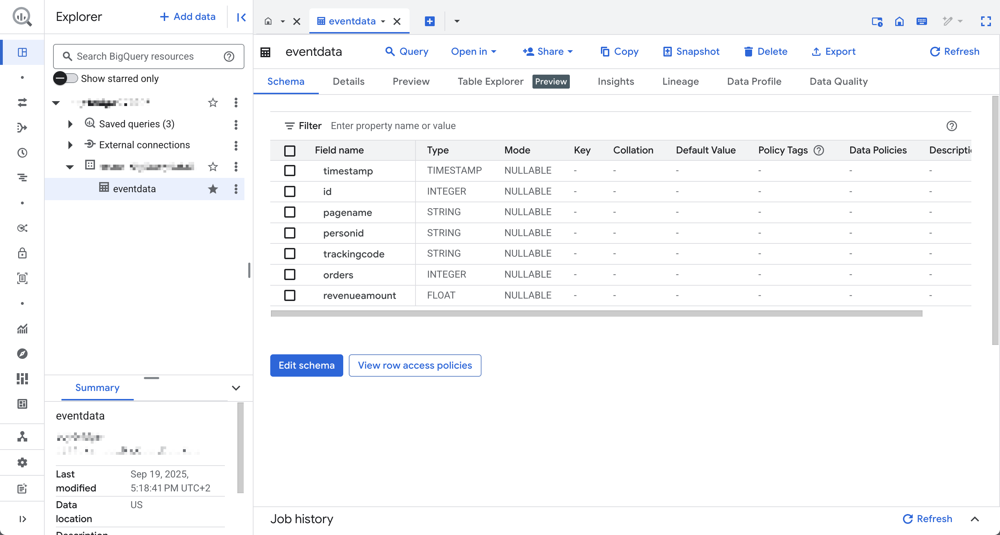

Para inspeccionar los datos:

1. Seleccione **[!UICONTROL Consulta]**.
1. Ejecute una consulta de ejemplo en el editor de consultas, donde `project` es el nombre del proyecto y `datasets` es el nombre de los conjuntos de datos:

   ```sql
   SELECT * FROM `project.datasets.eventdata` LIMIT 100
   ```

   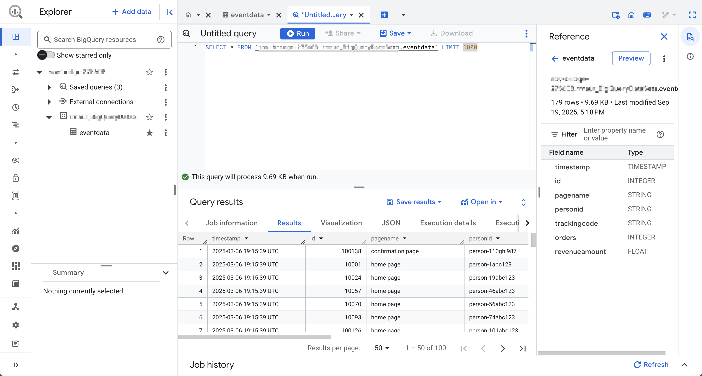

Para Experience Platform Data Mirror para Customer Journey Analytics, las tablas de la solución nativa del almacén de datos deben estar habilitadas para el historial de cambios. Para comprobar que la tabla está habilitada para el historial de cambios:

1. Ejecute la siguiente instrucción SQL en el editor de consultas para comprobar la configuración, donde `project` es el nombre del proyecto y `datasets` es el nombre de los conjuntos de datos:

   ```sql
   SELECT
      table_name,
      MAX(CASE WHEN option_name = 'enable_change_history' THEN option_value END) AS enable_change_history
   FROM `project.datasets.INFORMATION_SCHEMA.TABLE_OPTIONS`
   WHERE table_name = 'eventdata'
   GROUP BY table_name
   ORDER BY table_name;
   ```

1. Si el resultado no es **[!UICONTROL TRUE]**, use la siguiente instrucción SQL para habilitar el historial de cambios, donde `project` es el nombre del proyecto y `datasets` es el nombre de los conjuntos de datos:

   ```sql
   ALTER TABLE `project.datasets.eventdata` 
   SET OPTIONS (enable_change_history = TRUE);
   ```

Los datos de la tabla de la solución nativa del almacén de datos están listos para Experience Platform Data Mirror para Customer Journey Analytics.


## Configurar un esquema

Para duplicar datos en Experience Platform, primero debe definir el esquema de los datos. Todos los datos que desee reflejar en Experience Platform y que utilicen Experience Platform Data Mirror para Customer Journey Analytics deben ajustarse a un esquema relacional.

Defina un esquema que modele estos datos. Para configurar el esquema:

1. En la interfaz de usuario de Adobe Experience Platform, en el carril izquierdo, seleccione **[!UICONTROL Esquemas]** en **[!UICONTROL Administración de datos]**.

1. Seleccione **[!UICONTROL Crear esquema]**. 
1. En el menú desplegable, seleccione **[!UICONTROL Relacional]**.
1. Si ve una ventana emergente con la opción de seleccionar entre **[!UICONTROL Crear manualmente]** o **[!UICONTROL Cargar un archivo DDL]**:
   1. Seleccione **[!UICONTROL seleccionar Crear manualmente]**.

      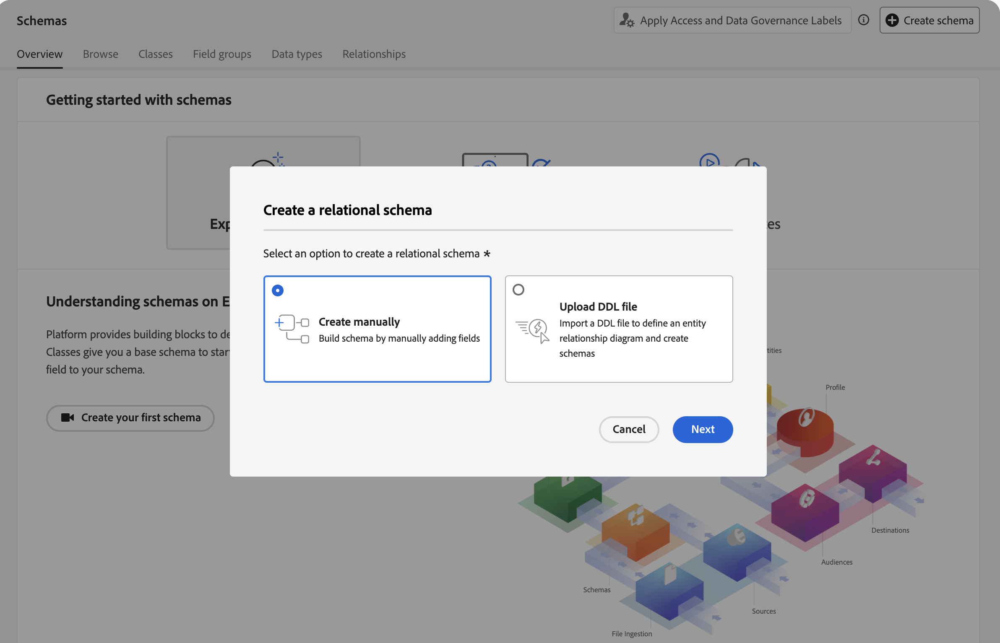

   1. Seleccione **[!UICONTROL Siguiente]**.
1. En la interfaz de **[!UICONTROL Esquemas]** > **[!UICONTROL Crear esquema relacional]**:
   1. Escriba un **[!UICONTROL nombre para mostrar del esquema]**. Por ejemplo: `Sample Event Feed Schema`.
   1. Escriba una **[!UICONTROL descripción]**. Por ejemplo: `Sample event feed schema for a relational schema`.
   1. Seleccione **[!UICONTROL Serie temporal]** como **[!UICONTROL comportamiento del esquema]**. Selecciona **[!UICONTROL Serie temporal]** para datos basados en series temporales y **[!UICONTROL Registro]** para datos basados en registros. El comportamiento define la estructura del esquema y las propiedades que se incluyen.

      Experience Platform Data Mirror para Customer Journey Analytics se utiliza principalmente para datos de series temporales (por ejemplo, datos de eventos).

      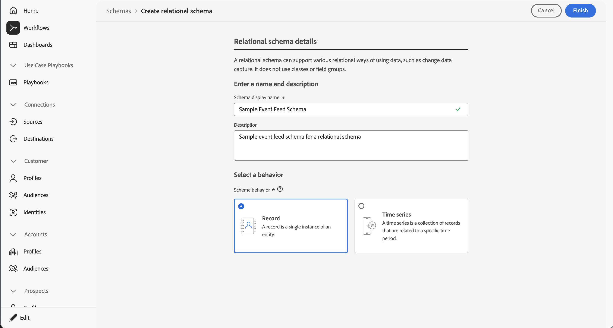

   1. Seleccione **[!UICONTROL Finalizar]**.

1. En la interfaz **[!UICONTROL Esquemas]** > **[!UICONTROL Esquema de fuente de eventos de ejemplo]**, verá una advertencia que indica que los esquemas relacionales admiten la ingesta como filas de cambio.

   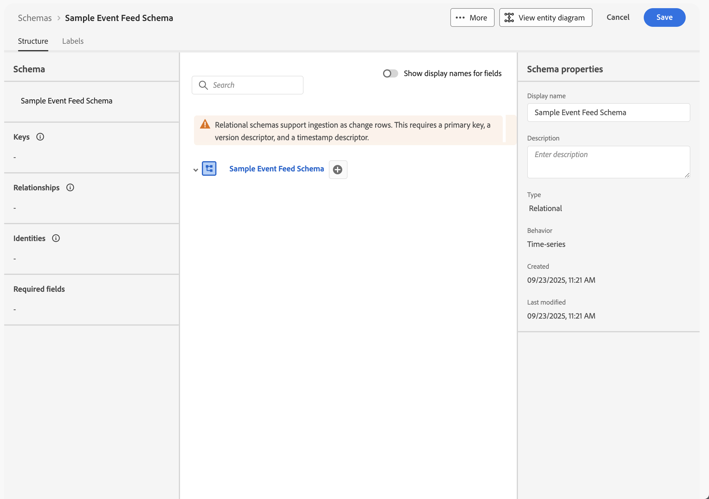

   La ingesta como filas de cambio también se conoce como captura de datos de cambio (CDC). Para admitir la captura de datos modificados, el esquema requiere lo siguiente:

   * Clave principal.
   * Descriptor de versión.
   * Descriptor de marca de tiempo para datos de series de tiempo.

1. Seleccione  junto a **[!UICONTROL Esquema de fuente de eventos de muestra]** para empezar a agregar campos al esquema. Agregue los siguientes campos con tipo de datos y atributos adicionales al esquema.

   | Nombre de campo | Nombre para mostrar | Tipo | Atributos adicionales |
   |---|---|---|---|
   | `id` | `Id` | **[!UICONTROL Entero]** | Descriptor de versión  |
   | `orders` | `Orders` | **[!UICONTROL Entero]** | |
   | `pagename` | `Page Name` | **[!UICONTROL Cadena]** | |
   | `personid` | `Person Id` | **[!UICONTROL Cadena]** |  Clave principal<br/> Identity<br/>Seleccione CRMID para el área de nombres de identidad. |
   | `revenueamount` | `Revenue Amount` | **[!UICONTROL Doble]** | |
   | `timestamp` | `Timestamp` | **[!UICONTROL DateTime]** | Descriptor de marca de tiempo  |
   | `trackingcode` | `Tracking Code` | **[!UICONTROL Cadena]** | |


   * El campo **[!UICONTROL id]** está configurado como **[!UICONTROL descriptor de versión]**.

     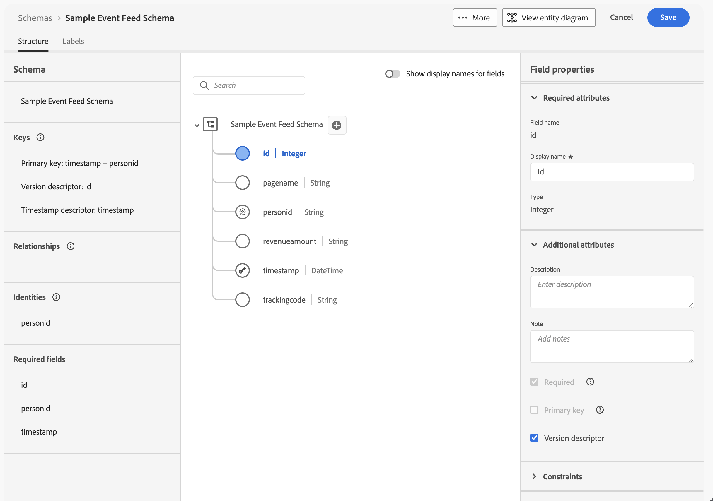

     En un escenario real, es posible que desee usar un campo más apropiado como [descriptor de versión](aep.md#schema). Por ejemplo, un campo que realiza un seguimiento de la última hora de modificación.

   * El campo **[!UICONTROL personid]** está configurado, junto con **[!UICONTROL timestamp]** como **[!UICONTROL clave principal]**. Seleccione  **[!UICONTROL Crear clave principal compuesta]** para crear una clave compuesta.

     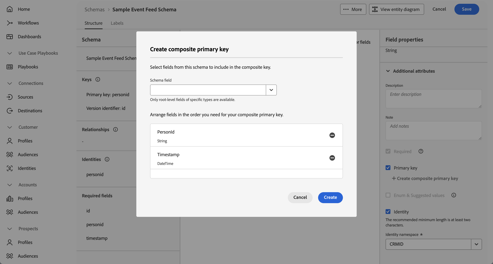

     El campo **[!UICONTROL personid]** también está configurado como **[!UICONTROL identidad]**, con **[!UICONTROL CRMID]** como **[!UICONTROL área de nombres de identidad]**.

     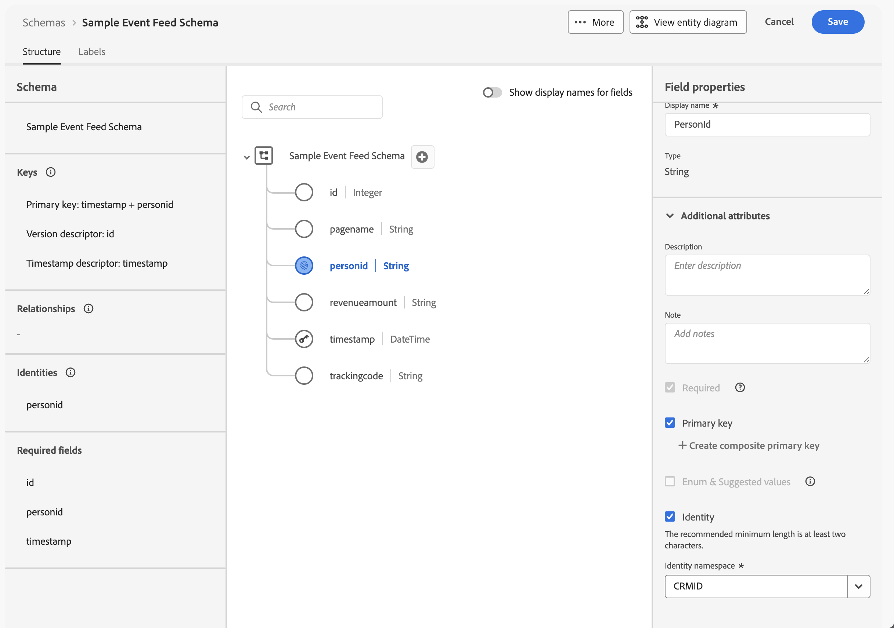

     El campo **[!UICONTROL personid]** no tiene que ser la **[!UICONTROL clave principal]**. En un escenario en tiempo real, lo más probable es que tengas un campo diferente para rastrear la clave principal, aparte de **[!UICONTROL personid]**.

   * El campo **[!UICONTROL timestamp]** está configurado, junto con el campo **[!UICONTROL personid]** como **[!UICONTROL clave principal]**. El campo **[!UICONTROL timestamp]** también está configurado como **[!UICONTROL descriptor Timestamp]**. Solo necesita definir un campo como **[!UICONTROL descriptor de marca de tiempo]** para los datos relacionales de series de tiempo.

     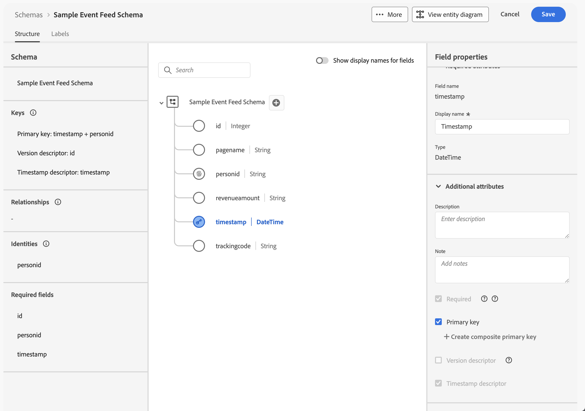


   Si ha definido la **[!UICONTROL clave principal]**, el **[!UICONTROL descriptor de versión]** y el **[!UICONTROL descriptor de marca de tiempo]** correctamente, desaparecerá la advertencia sobre la definición del esquema.

1. Seleccione **[!UICONTROL Guardar]** para guardar el esquema.

Del mismo modo, puede configurar un [esquema](aep.md#schema) relacional basado en registros. Por ejemplo, para contener datos de perfil y búsqueda.


## Uso de un conector de origen

Puede utilizar un conector de origen para conectar la solución nativa del almacén de datos a Experience Platform.

En la interfaz de Experience Platform:

1. Seleccionar **[!UICONTROL orígenes]**.
1. Seleccione o busque **[!UICONTROL Google BigQuery]**.
1. Seleccione **[!UICONTROL Agregar datos]**.

El asistente Agregar datos le guiará por los siguientes pasos para conectar los datos de la tabla de [!DNL Google BigQuery] a Experience Platform.

### Autenticación

En el paso **[!UICONTROL Autenticación]**, seleccione:

* **[!UICONTROL Cuenta existente]** cuando ya tienes una cuenta configurada para Google BigQuery. Continúe con el paso [Seleccionar datos](#select-data).
* **[!UICONTROL Nueva cuenta]** cuando necesite conectarse a Google BigQuery.
   1. Especifique un **[!UICONTROL nombre de cuenta]** y (opcional) **[!UICONTROL Descripción]**.
   1. Seleccione su **[!UICONTROL tipo de autenticación]**: **[!UICONTROL Autenticación básica]** o **[!UICONTROL Autenticación de servicio]**. En función de su selección, proporcione la entrada requerida.
   1. Seleccionar **[!UICONTROL Conectar con el origen]**

      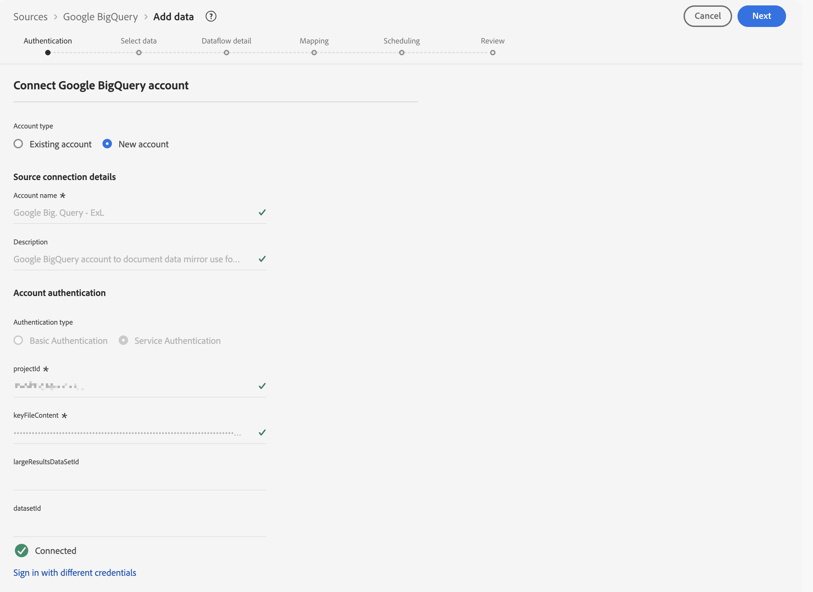

      Se ha verificado su conexión. Una  **[!UICONTROL conectada]** indicó una conexión correcta.

   1. Seleccione **[!UICONTROL Siguiente]**.

  Consulte la documentación de Experience Platform para obtener más información sobre cómo conectarse y autenticarse al usar el conector [Azure Databricks](https://experienceleague.adobe.com/es/docs/experience-platform/sources/connectors/databases/databricks) o [Snowflake](https://experienceleague.adobe.com/es/docs/experience-platform/sources/connectors/databases/snowflake).


### Seleccionar datos

En el paso **[!UICONTROL Seleccionar datos]**, haga lo siguiente:

1. Seleccione la tabla de la lista de tablas. Por ejemplo: **[!UICONTROL eventdata]**.

   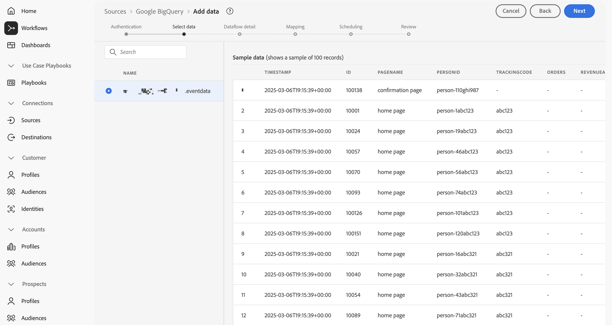

   Verá una muestra de los datos mostrados para su verificación.

1. Haga clic en **[!UICONTROL Siguiente]** para continuar.


### Detalles del flujo de datos

En el paso **[!UICONTROL Detalle del flujo de datos]**:

1. Seleccione **[!UICONTROL Habilitar la captura de datos modificados]**. Aparece un cuadro de información **[!UICONTROL Cambiar requisito de captura de datos]** con más información.
1. Seleccione **[!UICONTROL Nuevo conjunto de datos]** para **[!UICONTROL Conjunto de datos de destino]** para crear un nuevo conjunto de datos que contenga los datos reflejados.
1. Escriba un **[!UICONTROL nombre del conjunto de datos de salida]**. Por ejemplo: `event-data-mirror`.
1. Seleccione el esquema relacional que creó anteriormente en el menú desplegable **[!UICONTROL Esquema]**. Por ejemplo: **[!UICONTROL Esquema de fuente de eventos de muestra]**.

   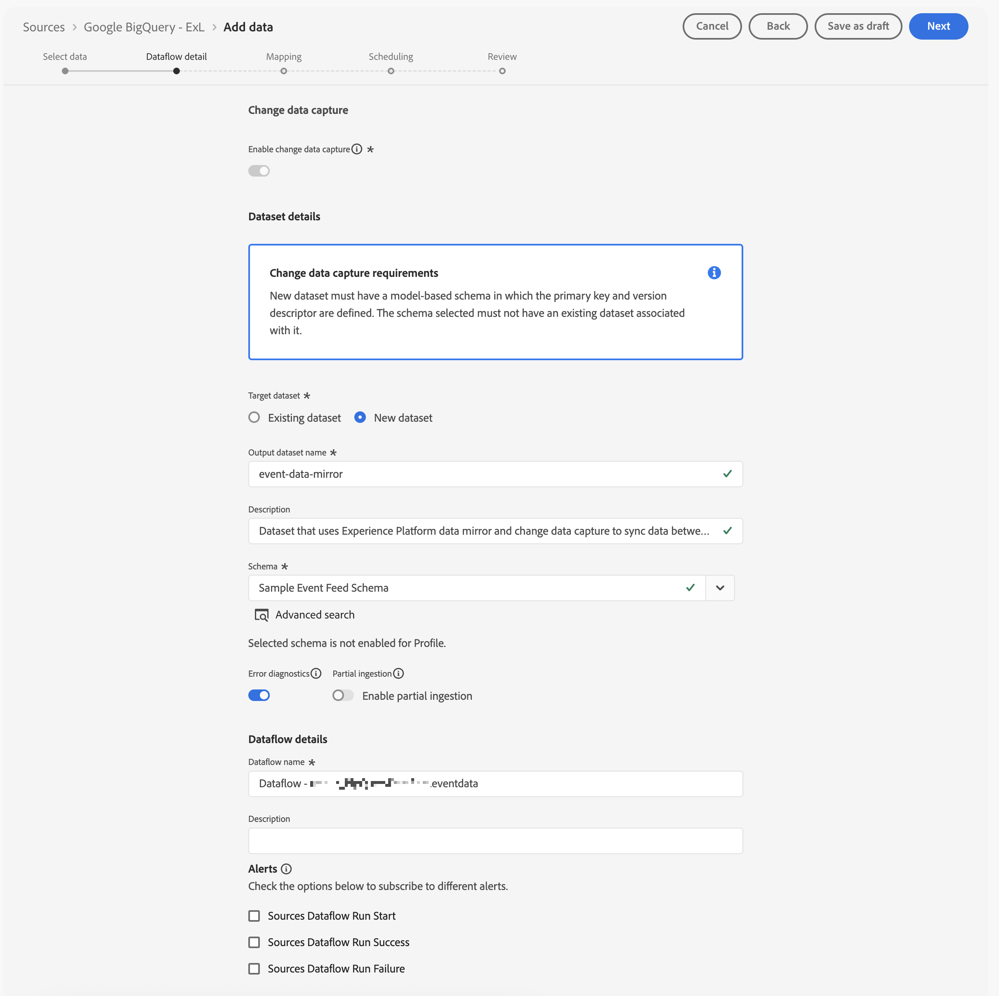

1. Especifique otros detalles.
1. Seleccione **[!UICONTROL Siguiente]**.


### Asignación

En el paso **[!UICONTROL Asignación]**, haga lo siguiente:

1. Asigne los campos del esquema en Google BigQuery (**[!UICONTROL datos de Source]**) a los campos del esquema que ha definido en Experience Platform (**[!UICONTROL Campos de destino]**).

   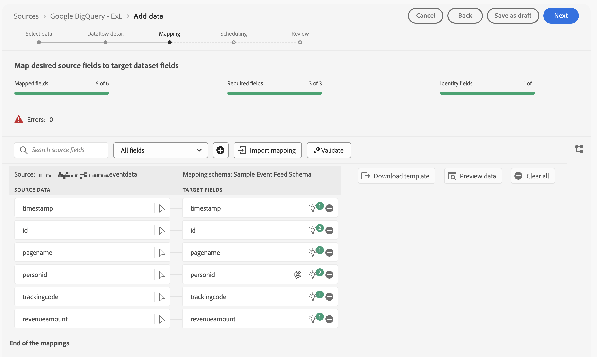

1. Si todos los campos están asignados correctamente, seleccione **[!UICONTROL Siguiente]** para continuar.


### Programación

En el paso **[!UICONTROL Programación]**:

1. Especifique la **[!UICONTROL Frecuencia]** e **[!UICONTROL Intervalo]** para programar la sincronización de los datos reflejados.
1. Especifique la **[!UICONTROL hora de inicio]** para la programación.

   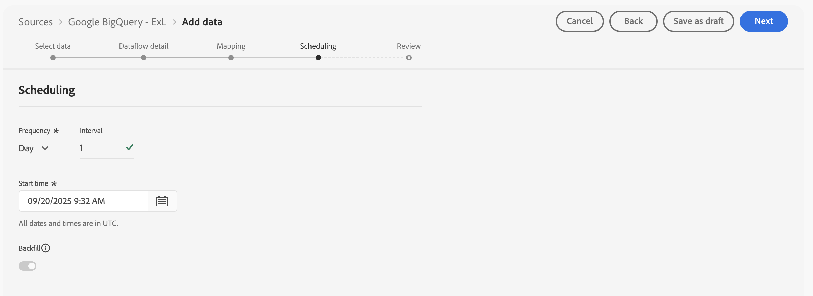

1. Haga clic en **[!UICONTROL Siguiente]** para continuar.


### Revisar

En el paso **[!UICONTROL Revisar]**.

1. Revise la configuración del conector de origen.

   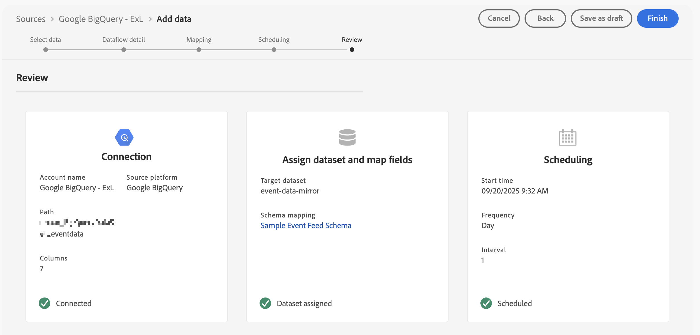

1. Seleccione **[!UICONTROL Finalizar]**. Se le dirigirá al flujo de datos configurado.

   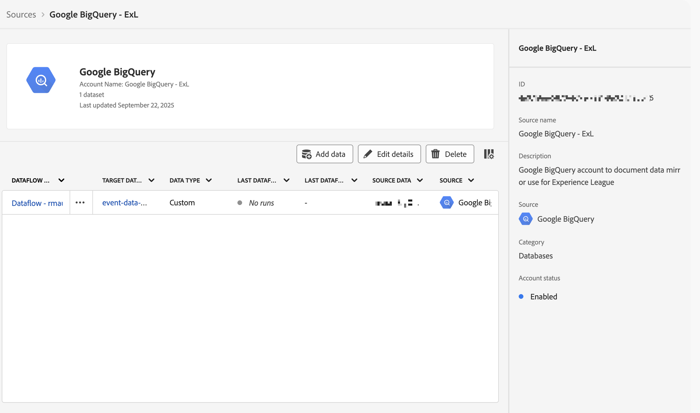


## Configurar una conexión

En esta guía de inicio rápido, creará una nueva conexión para utilizar los datos reflejados de Experience Platform. Como alternativa, puede agregar los datos reflejados a una conexión existente.

En la interfaz de Customer Journey Analytics:

1. Seleccione **[!UICONTROL Conexiones]** en el menú **[!UICONTROL Administración de datos]**.
1. Seleccione **[!UICONTROL Crear nueva conexión]**.
1. Especifique el **[!UICONTROL Nombre de conexión]**, **[!UICONTROL espacio aislado]**, **[!UICONTROL Cantidad promedio de eventos diarios]** y otros parámetros opcionales necesarios.
1. Seleccione **[!UICONTROL Agregar conjuntos de datos]**.

   1. En el paso **[!UICONTROL Seleccionar conjuntos de datos]** de **[!UICONTROL Agregar conjuntos de datos]**:

      1. Seleccione el conjunto de datos que contiene los datos reflejados. Por ejemplo: **[!UICONTROL event-data-mirror]**. El conjunto de datos tiene **[!UICONTROL Relacional]** como **[!UICONTROL tipo de conjunto de datos]**.

         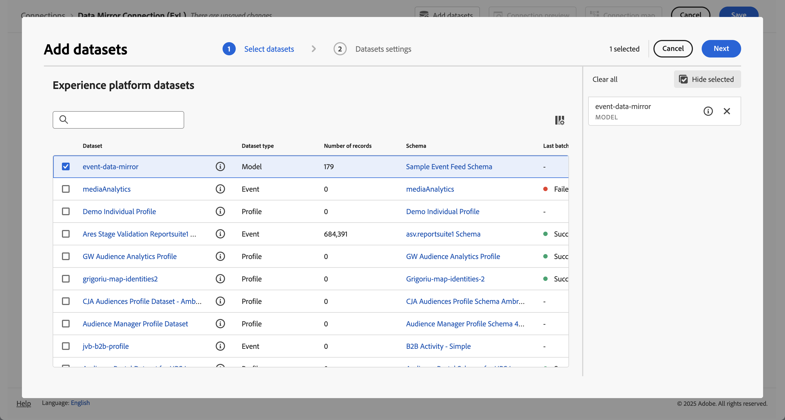

      1. Añada conjuntos de datos adicionales que sean relevantes para la conexión.
      1. Seleccione **[!UICONTROL Siguiente]**.

   1. En el paso **[!UICONTROL Configuración de conjuntos de datos]** de **[!UICONTROL Agregar conjuntos de datos]**:

      Para el conjunto de datos relacional **[!UICONTROL event-data-mirror]**

      1. Seleccione **[!UICONTROL Evento]** como **[!UICONTROL Tipo de conjunto de datos]**.
      1. Seleccione el campo **[!UICONTROL PersonId]** como **[!UICONTROL ID de persona]**.
      1. **[!UICONTROL Marca de tiempo]** se rellena automáticamente como **[!UICONTROL Marca de tiempo]**.
      1. Seleccione **[!UICONTROL Otro]** como **[!UICONTROL tipo de origen de datos]**.
      1. Escriba `Google BigQuery Event Data` como **[!UICONTROL descripción del origen de datos]**.
      1. Especifique otros detalles, como **[!UICONTROL Importar todos los datos nuevos]** y **[!UICONTROL Rellenar todos los datos existentes]**.

         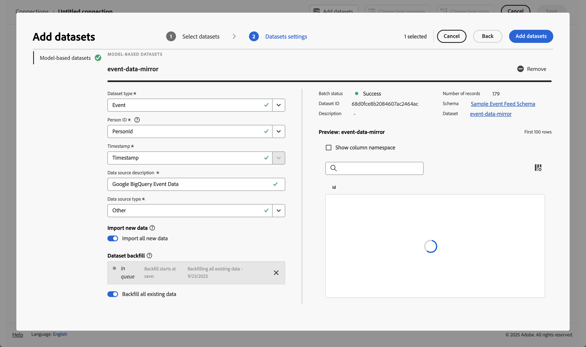

      De forma opcional, especifique detalles para otros conjuntos de datos.

   1. Seleccione **[!UICONTROL Agregar conjuntos de datos]**.
1. Seleccione **[!UICONTROL Guardar]**.

Después de crear una [conexión](/help/connections/overview.md), puede realizar varias tareas de administración. Como [seleccionar y combinar conjuntos de datos](/help/connections/combined-dataset.md), [comprobar el estado de los conjuntos de datos de una conexión y el estado de la ingesta de datos](/help/connections/manage-connections.md), etc.


## Configurar una vista de datos

Para crear la vista de datos:

1. En la interfaz de Customer Journey Analytics, seleccione **[!UICONTROL Vistas de datos]**, opcionalmente desde **[!UICONTROL Administración de datos]**, en el menú superior.

2. Seleccione **[!UICONTROL Crear nueva vista de datos]**.

3. En el paso **[!UICONTROL Configurar]**, haga lo siguiente:

   1. Seleccione la conexión en la lista **[!UICONTROL Conexión]**.

   1. Asigne un nombre y (opcionalmente) describa su conexión.

   1. Seleccione **[!UICONTROL Guardar y continuar]**.

4. En el paso **[!UICONTROL Componentes]**, haga lo siguiente:

   1. Agregue cualquier campo de esquema o componente estándar que desee incluir en los cuadros de componente **[!UICONTROL METRICS]** o **[!UICONTROL DIMENSIONS]**. Asegúrese de agregar campos relevantes del conjunto de datos que contiene los datos reflejados. Para acceder a esos campos:

      1. Seleccionar **[!UICONTROL conjuntos de datos de eventos]**.
      1. Seleccione **[!UICONTROL campos ad hoc y relacionales]**.
      1. Arrastre y suelte los campos de los esquemas relacionales en **[!UICONTROL METRICS]** o **[!UICONTROL DIMENSIONS]**.

         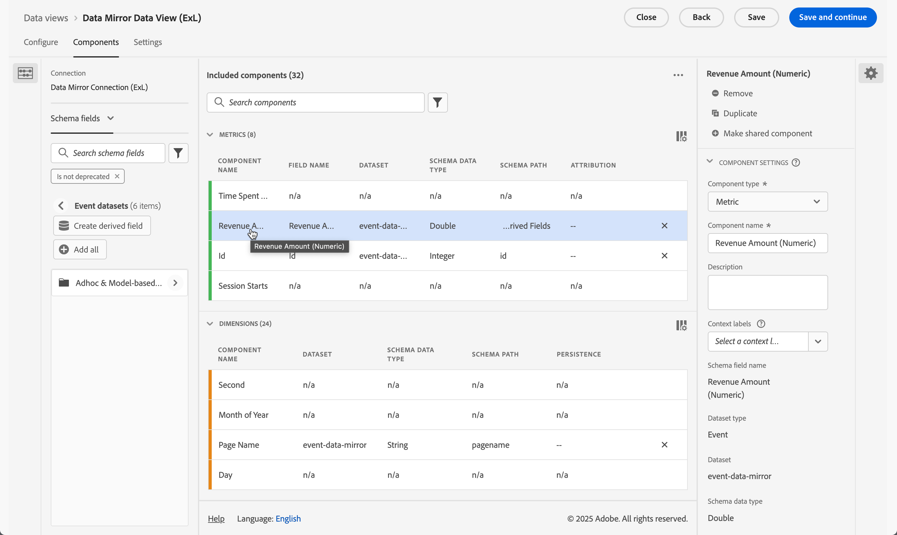

   1. Defina campos derivados para campos que no tienen el tipo adecuado, que no tienen el formato adecuado o que desea modificar por otros motivos. Por ejemplo, para **[!UICONTROL Importe de ingresos]**.

      1. Seleccione **[!UICONTROL Crear campo derivado.]**
      1. En el editor de campos derivado:
         1. Defina un nuevo campo `Revenue Amount (Numeric)`, como se muestra a continuación.

            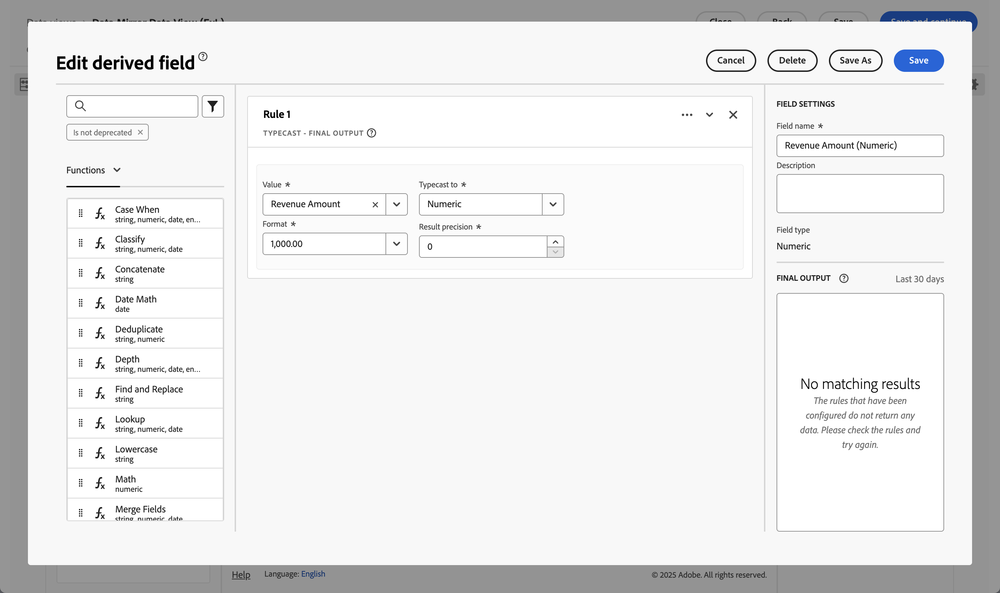

         1. Seleccione **[!UICONTROL Guardar]**.
      1. Arrastre el nuevo campo derivado **[!UICONTROL Importe de ingresos (numérico)]** y suelte el campo en **[!UICONTROL MÉTRICAS]**.

         

   1. Seleccione **[!UICONTROL Guardar y continuar]**.

5. En el paso **[!UICONTROL Configuración]**, haga lo siguiente:

   Deje la configuración tal como está y seleccione **[!UICONTROL Guardar y finalizar]**.

Consulte [Resumen de vistas de datos](../data-views/data-views.md) para obtener más información sobre cómo crear y editar una vista de datos. Y qué componentes están disponibles para que los utilice en su vista de datos y cómo utilizar la configuración de segmentos y sesiones.


## Configurar un proyecto

Analysis Workspace es una herramienta de navegador flexible que le permite crear análisis rápidamente y compartir perspectivas basadas en sus datos. Los proyectos de Workspace se usan para combinar componentes, tablas y visualizaciones de datos para crear un análisis y compartirlo con cualquier persona de su organización.

Para crear un proyecto:

1. En la interfaz de Customer Journey Analytics, seleccione **[!UICONTROL Workspace]** en el menú superior.

2. Seleccione **[!UICONTROL Proyectos]** en el panel de navegación izquierdo.

3. Seleccione **[!UICONTROL Crear proyecto]**. En la ventana emergente:


   1. Seleccione **[!UICONTROL proyecto Workspace en blanco]**.

   1. Seleccione **[!UICONTROL Crear]**.


4. En el área de trabajo **[!UICONTROL Nuevo proyecto]**, asegúrese de que su [vista de datos](#set-up-a-data-view) esté seleccionada. Esa vista de datos vincula a la [conexión](#set-up-a-connection) que contiene los datos reflejados.

5. Para crear su primer informe, arrastre y suelte dimensiones y métricas en la **[!UICONTROL tabla de forma libre]** en el panel **[!UICONTROL Forma libre]**. Por ejemplo, arrastre **[!UICONTROL Cantidad de ingresos (numérica)]** a **[!UICONTROL _Arrastre una métrica aquí_]**. A continuación, arrastre **[!UICONTROL PersonId]** y suelte el campo en el primer encabezado de columna. Realice otros ajustes según lo considere oportuno.

   El resultado final es una descripción general de los perfiles y sus ingresos en función de los datos reflejados procedentes de una tabla de Google BigQuery.

   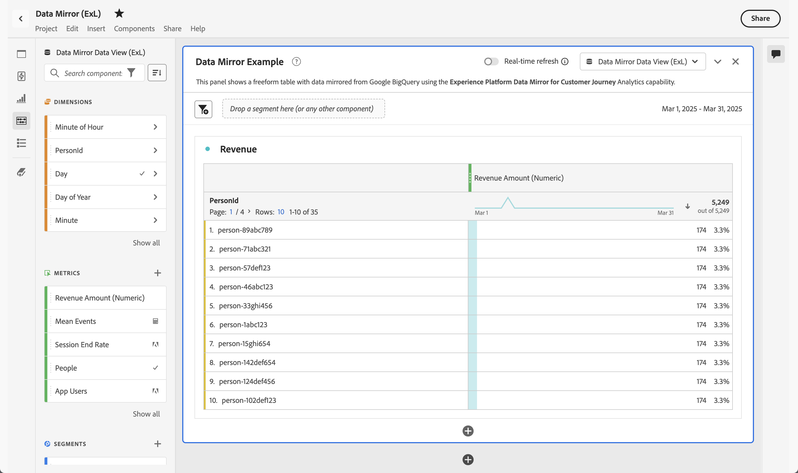

Consulte [Información general de Analysis Workspace](../analysis-workspace/home.md) para obtener más información sobre cómo crear proyectos y compilar su análisis mediante componentes, visualizaciones y paneles.

>[!SUCCESS]
>
>Ha completado todos los pasos. Empezó por definir qué datos reflejados deseaba recopilar (esquema) de una solución nativa de Data Warehouse. Y dónde almacenar esos datos (conjunto de datos) en Experience Platform. Ha configurado el conector de origen adecuado para que le proporcione los datos reflejados en Experience Platform. Ha definido una conexión en Customer Journey Analytics para utilizar los datos de evento reflejados y (opcionalmente) otros datos. La definición de la vista de datos le permitió especificar qué dimensión y métricas utilizar a partir de los datos reflejados. Y finalmente creó su primer proyecto visualizando y analizando sus datos reflejados.
