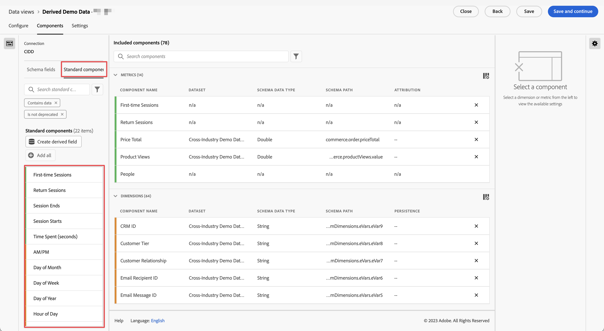

# Referencia de componente estándar

La mayoría de las dimensiones y métricas de Customer Journey Analytics se basan en elementos de esquema del conjunto de datos de Adobe Experience Platform. Sin embargo, hay varios componentes disponibles para agregarlos a una vista de datos independientemente de la conexión que utilice.

Los [!UICONTROL Componentes estándares] son componentes que no se generan a partir de los campos de esquema del conjunto de datos, sino que se generan en el sistema. Algunos componentes del sistema son necesarios para facilitar las funciones de creación de informes en Analysis Workspace, mientras que otros componentes del sistema son opcionales.

## Componentes estándares necesarios {#required}

De forma predeterminada, estos componentes estándares necesarios se añaden a cada vista de datos. Son esenciales para las funciones de creación de informes que ofrece el Customer Journey Analytics.

### Dimensiones estándar

{{standard-dimensions}}

### Métricas estándar

{{standard-metrics}}

## Componentes estándar opcionales {#optional}

Los componentes estándar opcionales están disponibles en la pestaña **[!UICONTROL Vistas de datos]** > **[!UICONTROL Editar vista de datos]** > **[!UICONTROL Componentes]** > **[!UICONTROL Componentes estándar]**.

| Nombre del componente | Dimensión o métrica | Notas y valores |
| --- | --- | --- |
| [!UICONTROL a. m./p. m.] | Dimensión de partición de tiempo | a. m. o p. m. |
| [!UICONTROL ID de lote] | Dimensión | Identificador del lote de Experience Platform del que formaba parte un [!UICONTROL Evento]. |
| [!UICONTROL ID de conjunto de datos] | Dimensión | Identificador del conjunto de datos de Experience Platform del que formaba parte un [!UICONTROL Evento]. |
| [!UICONTROL Día del mes] | Dimensión de partición de tiempo | 1-31 |
| [!UICONTROL Día de la semana] | Dimensión de partición de tiempo | lunes, martes, miércoles, jueves, viernes, sábado, domingo |
| [!UICONTROL Día del año] | Dimensión de partición de tiempo | 1-366 |
| [!UICONTROL Hora del día] | Dimensión de partición de tiempo | 0-23 |
| [!UICONTROL &#x200B; Mes del año] | Dimensión de partición de tiempo | Enero-diciembre |
| [!UICONTROL Sesiones por primera vez] | Métrica | Primera sesión de una persona definida dentro de la ventana de creación de informes. [Más información](https://experienceleague.adobe.com/docs/analytics-platform/using/cja-dataviews/data-views-usecases.html?lang=es#new-repeat) |
| [!UICONTROL Sesiones de retorno] | Métrica | Número de sesiones que no fueron la primera sesión de una persona. [Más información](https://experienceleague.adobe.com/docs/analytics-platform/using/cja-dataviews/data-views-usecases.html?lang=es#new-repeat) |
| [!UICONTROL ID de la persona] | Dimensión | Cada esquema del conjunto de datos definido en Experience Platform puede tener su propio conjunto de una o más identidades definidas y asociadas a un área de nombres de identidad. Cualquiera de ellos puede utilizarse como ID de persona. Algunos ejemplos son: ID de cookie, ID vinculado, ID de usuario, código de seguimiento, etc. La dimensión [!UICONTROL ID de persona] es la base de la combinación de conjuntos de datos y la identificación de personas únicas en Customer Journey Analytics.
Los posibles casos de uso incluyen los siguientes:<ul><li>Cree un segmento con un valor de ID de persona específico para segmentar todo según el comportamiento de ese usuario.</li><li>Depuración: asegúrese de que los datos de un ID de cookie específico (o un ID de cliente específico) estén presentes.</li><li>Identificación de los usuarios que llamaron a un centro de llamadas.</li></ul> |
| [!UICONTROL Área de nombres de ID de persona] | Dimensión | De qué tipo de identificación consta el [!UICONTROL ID de persona]. Algunos ejemplos son los aiguientes: `email address`, `cookie ID`, `Analytics ID` |
| [!BADGE B2B edition]{type=Informative url="https://experienceleague.adobe.com/en/docs/analytics-platform/using/cja-overview/cja-b2b/cja-b2b-edition" newtab=true tooltip="Customer Journey Analytics B2B edition"} [!UICONTROL ID. de cuenta global] | Dimensión | [!UICONTROL Id. de cuenta global], cuando usa el contenedor de cuenta global en la conexión. |
| [!BADGE B2B edition]{type=Informative url="https://experienceleague.adobe.com/en/docs/analytics-platform/using/cja-overview/cja-b2b/cja-b2b-edition" newtab=true tooltip="Customer Journey Analytics B2B edition"} [!UICONTROL ID de cuenta] | Dimensión | El [!UICONTROL identificador de cuenta], cuando usa el contenedor de cuenta en su conexión. |
| [!BADGE B2B edition]{type=Informative url="https://experienceleague.adobe.com/en/docs/analytics-platform/using/cja-overview/cja-b2b/cja-b2b-edition" newtab=true tooltip="Customer Journey Analytics B2B edition"} [!UICONTROL ID de oportunidad] | Dimensión | [!UICONTROL Id. de oportunidad], cuando utiliza el contenedor de oportunidad en su conexión. |
| [!BADGE B2B edition]{type=Informative url="https://experienceleague.adobe.com/en/docs/analytics-platform/using/cja-overview/cja-b2b/cja-b2b-edition" newtab=true tooltip="Customer Journey Analytics B2B edition"} [!UICONTROL ID. de grupo de compra] | Dimensión | [!UICONTROL Id. de grupo de compra], cuando use el contenedor de grupo de compra en su conexión. |
| [!UICONTROL Trimestre del año] | Dimensión de partición de tiempo | T1, T2, T3, T4 |
| [!UICONTROL Repetir sesión] | Métrica | Número de sesiones que no fueron la primera sesión de una persona. [Más información](https://experienceleague.adobe.com/docs/analytics-platform/using/cja-dataviews/data-views-usecases.html?lang=es#new-repeat) |
| [!UICONTROL Tipo de sesión] | Dimensión | Esta dimensión tiene dos valores: 1. [!UICONTROL Primera vez] y 2. Volviendo. El elemento de línea [!UICONTROL Primera vez] incluye todo el comportamiento (es decir, las métricas respecto a esta dimensión) de una sesión que se ha determinado que es la primera sesión definida por una persona. Todo lo demás está incluido en el elemento de línea [!UICONTROL Devolución] (suponiendo que todo pertenece a una sesión). Cuando las métricas no formen parte de ninguna sesión, se incluirán en el bloque “No aplicable” para esta dimensión. [Más información](https://experienceleague.adobe.com/docs/analytics-platform/using/cja-dataviews/data-views-usecases.html?lang=es#new-repeat) |
| [!UICONTROL Tiempo empleado por evento] | Dimensión | Agrupa el [!UICONTROL Tiempo empleado] de la métrica en bloques de [!UICONTROL Eventos]. |
| [!UICONTROL Tiempo empleado por sesión] | Dimensión | Agrupa el [!UICONTROL Tiempo empleado] de la métrica en bloques de [!UICONTROL Sesiones]. |
| [!UICONTROL Tiempo empleado por persona] | Dimensión | Agrupa el [!UICONTROL Tiempo empleado] de la métrica en bloques de [!UICONTROL Personas]. |
| [!UICONTROL Fin de semana]/[!UICONTROL día laborable] | Dimensión de partición de tiempo | Fin de semana o día laborable |

{style="table-layout:auto"}
