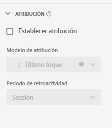

# Configuración de componentes de atribución {#attribution-component-settings}

<!-- markdownlint-disable MD034 -->

>[!CONTEXTUALHELP]
>id="dataview_component_metric_attribution"
>title="Atribución"
>abstract="Configure el modelo de atribución predeterminado aplicado a una métrica en los informes."

<!-- markdownlint-enable MD034 -->

La atribución le permite personalizar cómo los elementos de dimensión obtienen crédito por los eventos de éxito.

Por ejemplo:

1. Una persona que visita su sitio hace clic en un vínculo de búsqueda de pago a una de sus páginas de producto. Después, añade el producto al carro de compras, pero no lo compra.
2. Al día siguiente, ve una publicación en los medios sociales de uno de sus amigos. Hace clic en el vínculo y, a continuación, completa la compra.

En algunos informes, es posible que desee atribuir el pedido a la búsqueda de pago. En otros informes, es posible que desee atribuir el pedido a los medios sociales. La atribución permite controlar este aspecto del sistema de informes.

## Definición del modelo de atribución de un componente

Puede cambiar el modelo de atribución predeterminado para un componente determinado actualizando la configuración del componente en la vista de datos. Al hacerlo, se anula el modelo de atribución del componente siempre que se utilice en Analysis Workspace.

>[!NOTE]
>
>Tenga en cuenta lo siguiente al habilitar un modelo de atribución no predeterminado en una métrica:
>
>* **Al usar la métrica en un informe con *una sola dimensión*:** La atribución de la métrica anula el modelo de asignación establecido en la dimensión. Por ejemplo, una métrica con una atribución de &quot;primer contacto&quot; anula una asignación de dimensión &quot;más reciente&quot;.
>
>* **Al usar la métrica en un informe con *varias dimensiones*:** La atribución de la métrica se aplica sobre el modelo de asignación para cada dimensión. Por ejemplo, una métrica con una atribución de &quot;primer contacto&quot; se aplica sobre una asignación de dimensión &quot;más reciente&quot;.
>
> Para obtener más información sobre la asignación, consulte [Configuración del componente de persistencia](/help/data-views/component-settings/persistence.md).

Para actualizar el modelo de atribución predeterminado de un componente:

1. Vaya a la vista de datos que contiene el componente cuyo modelo de atribución predeterminado desea actualizar.

1. Seleccione el componente y expanda la sección **[!UICONTROL Atribución]** a la derecha de la pantalla.

   

1. Seleccione [!UICONTROL **Establecer atribución**] y, a continuación, seleccione la ventana [modelo de atribución](#attribution-models), [contenedor](#container) y [retrospectiva](#lookback-window).

1. Seleccione [!UICONTROL **Guardar y continuar**].

>[!TIP]
>
>Si su organización requiere que una métrica tenga varias configuraciones de atribución, puede realizar una de las siguientes acciones:
>
> * Copie la métrica en la vista de datos con cada configuración de atribución deseada. Puede incluir la misma métrica varias veces en una vista de datos, lo que otorga a cada métrica una configuración diferente. Asegúrese de etiquetar cada métrica de forma adecuada para que los analistas comprendan la diferencia entre estas métricas al generar informes.
>
> * Anule la métrica en Analysis Workspace. En [Configuración de columna](/help/analysis-workspace/visualizations/freeform-table/column-row-settings/column-settings.md) de una métrica, seleccione **[!UICONTROL Usar modelo de atribución no predeterminado]** para cambiar el modelo de atribución y la ventana de retroactividad de la métrica para ese informe específico.

## Modelos de atribución {#attribution-models}

<!-- markdownlint-disable MD034 -->

>[!CONTEXTUALHELP]
>id="dataviews_component_attribution_attributionmodels"
>title="Modelo"
>abstract="Seleccione un modelo de atribución para la métrica."

<!-- markdownlint-enable MD034 -->

{{attribution-models-details}}

## Contenedor

{{attribution-container}}

## Ventana de retroactividad

{{attribution-lookback-window}}

## Ejemplo

{{attribution-example}}
