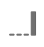

# Configuración de componentes de atribución

La atribución le permite personalizar la forma en que los elementos de dimensión obtienen crédito por los eventos de éxito. Por ejemplo:

1. Una persona que accede a su sitio hace clic en un vínculo de búsqueda de pago a una de las páginas de producto. Agregan el producto al carro de compras, pero no lo compran.
2. Al día siguiente, ven una publicación en los medios sociales de uno de sus amigos. Hace clic en el vínculo y, a continuación, completa la compra.

En algunos informes, es posible que desee atribuir el pedido a la búsqueda de pago. En otros informes, es posible que desee atribuir el pedido a los medios sociales. La atribución permite controlar este aspecto del sistema de informes.

Esta configuración del componente de vista de datos le permite establecer un modelo de atribución predeterminado para una métrica. Puede anular el modelo de atribución de una métrica determinada mientras trabaja en Analysis Workspace.

Si su organización requiere que una métrica tenga varias configuraciones de atribución, puede realizar una de las siguientes acciones:

* Copie la métrica en la vista de datos con cada configuración de atribución deseada. Puede incluir la misma métrica varias veces en una vista de datos, lo que otorga a cada métrica una configuración diferente. Asegúrese de etiquetar cada métrica de forma adecuada para que los analistas comprendan la diferencia entre estas métricas al generar informes.
* Anule la métrica en Analysis Workspace. En el [Configuración de columna](/help/analysis-workspace/visualizations/freeform-table/column-row-settings/column-settings.md), seleccione **[!UICONTROL Uso de modelos de atribución no predeterminados]** para cambiar el modelo de atribución y la ventana retrospectiva de la métrica para ese informe específico.

## Modelos de atribución

Un modelo de atribución determina qué elementos de dimensión obtienen crédito por una métrica cuando se ven varios valores dentro de la ventana retrospectiva de una métrica. Los modelos de atribución solo se aplican cuando hay varios elementos de dimensión establecidos dentro de la ventana retrospectiva. Si solo se establece un elemento de dimensión, ese elemento de dimensión obtiene un 100% de crédito, independientemente del modelo de atribución utilizado.

| Icono | Modelo de atribución | Definición |
| :---: | :--- | --- |
|  | Último contacto | Otorga un 100% de crédito al punto de contacto que se produce más recientemente antes de la conversión. Este modelo de atribución suele ser el valor predeterminado para cualquier métrica en la que no se especifique lo contrario en un modelo de atribución. Las organizaciones suelen utilizar este modelo en el que el tiempo de conversión es relativamente corto, como con el análisis de palabras clave de búsqueda interna. |
|  | Primer contacto | Otorga un 100% de crédito al punto de contacto que se ve por primera vez dentro de la ventana retrospectiva de atribución. Las organizaciones suelen utilizar este modelo para comprender la imagen de marca o la adquisición de clientes. |
|  | Lineal | Otorga el mismo crédito a cada punto de contacto que se visualice y que conduzca a una conversión. Resulta útil cuando los ciclos de conversión son más largos o requieren una participación del cliente más frecuente. Las organizaciones suelen utilizar este modelo de atribución para medir la efectividad de las notificaciones de aplicaciones móviles o con productos por suscripción. |
|  | Participación | Otorga un 100% de crédito a todos los puntos de contacto únicos. Dado que cada punto de contacto recibe un 100 % de crédito, los datos de métricas suelen sumar más del 100 %. Si un elemento de dimensión aparece varias veces separadas y conduce a una conversión, los valores se deduplican al 100%. Este modelo de atribución es ideal en situaciones en las que desea comprender a qué puntos de contacto se exponen más los clientes. Los medios suelen utilizar este modelo para calcular la velocidad de contenido. Las organizaciones comerciales suelen utilizar este modelo para comprender qué partes de su sitio son esenciales para la conversión. |
|  | Mismo contacto | Otorga un 100% de crédito al mismo evento en el que se produjo la conversión. Si un punto de contacto no se produce en el mismo evento que una conversión, se agrupa en &quot;Ninguno&quot;. Este modelo de atribución a veces se equipara a no tener ningún modelo de atribución. Resulta útil en escenarios en los que no desea valores de otros eventos que afecten a cómo una métrica da crédito a los elementos de dimensión. Los equipos de producto o diseño pueden utilizar este modelo para evaluar la eficacia de una página en la que se produce la conversión. |
|  | En forma de U | Otorga un 40% de crédito a la primera interacción, un 40% de crédito a la última interacción y divide el 20% restante en cualquier punto de contacto intermedio. Para las conversiones con un solo punto de contacto, se otorga un 100% de crédito. Para las conversiones con dos puntos de contacto, se otorga un 50% de crédito a ambos. Este modelo de atribución se utiliza mejor en escenarios donde se valora más la primera y la última interacción, pero no se desea descartar por completo las interacciones adicionales intermedias. |
|  | Curva J | Otorga un 60% de crédito a la última interacción, un 20% de crédito a la primera interacción y divide el 20% restante en cualquier punto de contacto intermedio. Para las conversiones con un solo punto de contacto, se otorga un 100% de crédito. Para las conversiones con dos puntos de contacto, se otorga un 75% de crédito a la última interacción y un 25% de crédito a la primera. Similar a la Forma de U, este modelo de atribución favorece la primera y la última interacción, pero favorece más intensamente la última interacción. |
|  | J inversa | Otorga un 60% de crédito al primer contacto, un 20% al último contacto y divide el 20% restante en cualquier punto de contacto intermedio. Para las conversiones con un solo punto de contacto, se otorga un 100% de crédito. Para las conversiones con dos puntos de contacto, se otorga un 75% de crédito a la primera interacción y un 25% de crédito a la última. Similar a la Forma de J, este modelo de atribución favorece la primera y la última interacción, pero favorece más intensamente la primera interacción. |
|  | Deterioro de tiempo | Sigue un declive exponencial con un parámetro de semivida personalizado, con un valor predeterminado de 7 días. El valor de cada canal depende de la cantidad de tiempo que transcurra entre el inicio del punto de contacto y la conversión final. La fórmula utilizada para determinar el crédito es `2^(-t/halflife)`, donde `t` es la cantidad de tiempo entre un punto de contacto y una conversión. A continuación, todos los puntos de contacto se normalizan al 100%. Ideal para escenarios en los que desea medir la atribución con un evento específico e importante. Cuanto más tardía sea la conversión después de este evento, menor será el crédito. |
|  | Personalizado | Permite especificar los pesos que desea dar al primer punto de contacto, al último punto de contacto y a cualquier punto de contacto intermedio. Los valores especificados se normalizan al 100% incluso si los números introducidos no suman 100. Para las conversiones con un solo punto de contacto, se otorga un 100% de crédito. En el caso de interacciones con dos puntos de contacto, se omite el parámetro central. Los puntos de primer y último contacto se normalizan al 100% y el crédito se asigna en consecuencia. Este modelo es ideal para los analistas que desean un control total sobre su modelo de atribución y tienen necesidades específicas que otros modelos de atribución no satisfacen. |
|  | Algorítmico | Utiliza técnicas estadísticas para determinar de manera dinámica la asignación óptima de crédito para la métrica seleccionada. El algoritmo utilizado para la atribución se basa en el dividendo de Harsanyi de la teoría de juegos cooperativa. El dividendo de Harsanyi es una generalización de la solución del valor de Shapley (llamada así por Lloyd Shapley, economista ganador del Premio Nobel) para distribuir crédito entre los jugadores en un juego con contribuciones desiguales al resultado. En un nivel alto, la atribución se calcula como una coalición de actores a los que se debe distribuir equitativamente un excedente. La distribución del superávit de cada coalición se determina de acuerdo con el superávit creado previamente por cada subcoalición (o los elementos de dimensión que participaban antes) de manera recursiva. Para obtener más información, consulte los artículos originales de John Harsanyi y Lloyd Shapley: Shapley, Lloyd S. (1953). A value for n-person games. *Contributions to the Theory of Games, 2(28)*, 307-317. Harsanyi, John C. (1963). Un modelo de negociación simplificado para un juego cooperativo de n personas. *International Economic Review 4(2)*, 194-220. |

{style="table-layout:auto"}

## Ventana retroactiva

Una ventana retrospectiva es la cantidad de tiempo que una conversión debe devolverse en el tiempo para incluir los puntos de contacto. Si se establece un elemento de dimensión fuera de la ventana retrospectiva, el valor no se incluye en ningún cálculo de atribución.

* **14 días**: Busca hasta 14 días después de que se produjo la conversión.
* **30 días**: Busca hasta 30 días después de que se produjo la conversión.
* **60 días**: Busca hasta 60 días después de que se produjo la conversión.
* **90 días**: Busca hasta 90 días después de que se produjo la conversión.
* **Session**: Busca hasta el principio de la sesión en la que se produjo una conversión. Las ventanas retrospectivas de sesión respetan el [Session timeout](../create-dataview.md#session-settings).
* **Persona (ventana del Sistema de informes)**: Busca todas las visitas hasta el primer día del mes del intervalo de fechas actual. Por ejemplo, si el intervalo de fechas del informe es del 15 de septiembre al 30 de septiembre, el intervalo de fechas de retrospectiva de personas sería del 1 de septiembre al 30 de septiembre. Si utiliza esta ventana retrospectiva, puede ver ocasionalmente que los elementos de dimensión se atribuyen a fechas fuera de la ventana de creación de informes.
* **Tiempo personalizado:** Permite establecer una ventana retrospectiva personalizada desde el momento en que se produjo una conversión. Puede especificar el número de minutos, horas, días, semanas, meses o trimestres. Por ejemplo, si se produce una conversión el 20 de febrero, una ventana retrospectiva de cinco días evaluaría todos los puntos de contacto de la dimensión del 15 de febrero al 20 de febrero en el modelo de atribución.

## Ejemplo

Consideremos el siguiente ejemplo:

1. El 15 de septiembre, una persona llega a su sitio a través de un anuncio de búsqueda de pago y luego lo abandona.
2. El 18 de septiembre, la persona regresa a su sitio a través de un vínculo de medios sociales que obtuvo de un amigo. Agregan varios artículos al carro, pero no compran nada.
3. El 24 de septiembre, su equipo de marketing les enviará un correo electrónico con un cupón para algunos de los artículos del carrito. Aplican el cupón, pero visitan otros sitios para ver si hay otros cupones disponibles. Encontraron otro a través de un anuncio y finalmente hicieron una compra por valor de 50 dólares.

Según la ventana retrospectiva y el modelo de atribución, los canales reciben crédito diferente. Los siguientes son algunos ejemplos importantes:

* Uso de **primer contacto** y una **ventana retrospectiva de sesión**, la atribución solo se fijará en la tercera visita. Entre el correo electrónico y la visualización, el correo electrónico fue el primero, por lo que el correo electrónico recibe un 100% de crédito por la compra de 50 dólares.
* Uso de **primer contacto** y una **ventana retrospectiva de personas**, la atribución se fijará en las tres visitas. La búsqueda de pago fue la primera, así que recibe un 100% de crédito por la compra de 50 dólares.
* Uso de **linear** y una **ventana retrospectiva de sesión**, el crédito se divide entre el correo electrónico y la visualización. Cada uno de estos canales recibe un crédito de 25 dólares.
* Uso de **linear** y una **ventana retrospectiva de personas**, el crédito se divide entre la búsqueda de pago, el medio social, el correo electrónico y la visualización. Cada canal recibe un crédito de 12,50 dólares por esta compra.
* Uso de **en forma de J** y una **ventana retrospectiva de personas**, el crédito se divide entre la búsqueda de pago, el medio social, el correo electrónico y la visualización.
   * Se otorga un crédito del 60 % a la visualización, es decir, 30 dólares.
   * El 20 % de crédito se asigna a la búsqueda de pago, 10 dólares en este caso.
   * El 20% restante se divide entre el medio social y el correo electrónico, lo que otorga 5 dólares a cada uno.
* Uso de **Deterioro de tiempo** y una **ventana retrospectiva de personas**, el crédito se divide entre la búsqueda de pago, el medio social, el correo electrónico y la visualización. Con la semivida de 7 días predeterminada:
   * Diferencia de cero días entre el punto de contacto de visualización y la conversión. `2^(-0/7) = 1`
   * Diferencia de cero días entre el punto de contacto del correo electrónico y la conversión. `2^(-0/7) = 1`
   * Diferencia de seis días entre el punto de contacto social y la conversión. `2^(-6/7) = 0.552`
   * Diferencia de nueve días entre el punto de contacto de búsqueda de pago y la conversión. `2^(-9/7) = 0.41`
   * La normalización de estos valores resulta en lo siguiente:
      * Visualización: 33,8 %, 16,88 dólares
      * Correo electrónico: 33,8 % 16,88 dólares
      * Medio social: 18,6 %, 9,32 dólares
      * Búsqueda de pago: 13,8 %, 6,92 dólares

Los eventos de conversión que generalmente tienen números enteros se dividen si el crédito pertenece a más de un canal. Por ejemplo, si dos canales contribuyen a un pedido mediante un modelo de atribución lineal, ambos canales obtienen 0,5 de ese pedido. Estas métricas parciales se suman en todas las personas y luego se redondean al entero más cercano para los informes.
