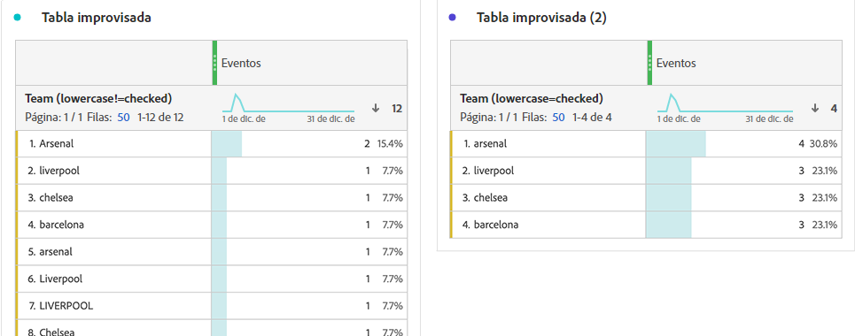

# Configuración de componentes de comportamiento

La configuración de comportamiento está disponible tanto en dimensiones como en métricas. La configuración disponible depende del tipo de componente y del tipo de datos de esquema.

## Configuración de comportamiento de dimensión

| Configuración | Descripción |
| --- | --- |
| [!UICONTROL Minúsculas] | Anula la duplicación de filas que tienen el mismo valor pero mayúsculas y minúsculas diferentes. Si se habilita, todas las instancias de una dimensión con el mismo valor se informan como minúsculas. Por ejemplo, los datos contienen los valores `"liverpool"` `"Liverpool"` y `"LIVERPOOL"` en una dimensión de cadena. Si las [!UICONTROL minúsculas] están habilitadas, los tres valores se combinan en `"liverpool"`. Si está desactivado, los tres valores se tratan como diferentes. |

>[!NOTE]
>
>Si habilita las [!UICONTROL minúsculas] en una dimensión del conjunto de datos de consulta, pueden existir varios valores de búsqueda para el mismo identificador. Si se produce este conflicto, CJA utiliza el primer valor de intercalación ASCII (los valores en mayúsculas preceden a los valores en minúsculas). Adobe recomienda evitar el uso de conjuntos de datos de búsqueda que contienen el mismo valor cuando las [!UICONTROL minúsculas] está habilitadas.

## Configuración del comportamiento de las métricas

| Configuración | Descripción/caso de uso |
| --- | --- |
| [!UICONTROL Contar valores] | Visible en los tipos de datos de esquema entero y doble. Aumente la métrica en la cantidad especificada. Por ejemplo, aumenta una métrica en 50 si el valor de la columna es `50`. |
| [!UICONTROL Contar instancias] | Visible en los tipos de datos de esquema entero y doble. Aumente la métrica en uno, independientemente del valor. La presencia de cualquier valor aumenta la métrica. Por ejemplo, aumenta una métrica en 1 si el valor de la columna es `50`. |
| [!UICONTROL Valores para contar] | Visible en tipos de datos de esquema booleanos. Permite determinar si la métrica aumenta contando `true`, `false` o ambos. |

Puede generar las métricas Pedidos e Ingresos en Analysis Workspace utilizando la misma columna de conjunto de datos de evento con comportamientos diferentes. Arrastre la columna del conjunto de datos Ingresos a la vista de datos dos veces y establezca uno en Contar valores y el otro en Contar instancias. La métrica Pedidos cuenta las instancias, mientras que la métrica Ingresos cuenta los valores.
