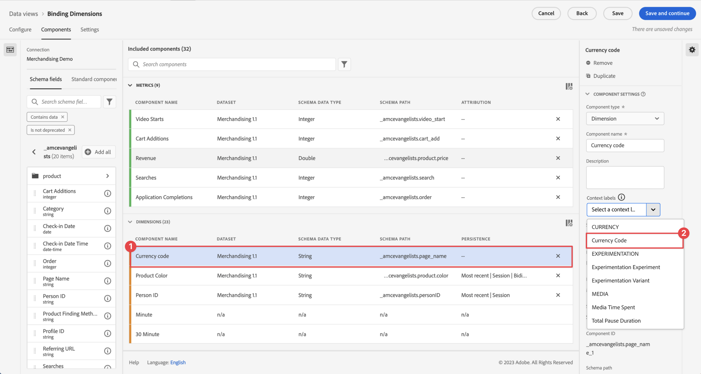

# Formato de configuración de componentes

El formato le permite determinar cómo se muestra una métrica determinada.

| Configuración | Descripción |
| --- | --- |
| **[!UICONTROL Formato]** | Permite especificar el formato de una métrica, como Decimal, Hora, Porcentaje o Moneda. |
| **[!UICONTROL Lugares decimales]** | No visible en los tipos de datos de esquema de enteros. Permite especificar el número de decimales que debe mostrar una métrica. |
| **[!UICONTROL Fecha]** | Permite determinar cómo desea que se muestre el campo de fecha y hora cuando se utiliza como dimensión en la creación de informes.  [Más información](../../use-cases/data-views/data-views-usecases.md#date-and-date-time-use-cases) |
| **[!UICONTROL Fecha-hora]** | Permite determinar cómo desea que se muestre el campo de fecha y hora cuando se utiliza como dimensión en la creación de informes.  [Más información](../../use-cases/data-views/data-views-usecases.md#date-and-date-time-use-cases) |
| **[!UICONTROL Moneda]** | Permite determinar en qué moneda desea que se muestre la métrica. Consulte [Moneda](#currency) más detalles. |
| **[!UICONTROL Mostrar tend ascendente como]** | Permite especificar si una tendencia al alza en esta métrica debe considerarse buena (verde) o mala (rojo). |
| **[!UICONTROL Valor verdadero]** y **[!UICONTROL Valor falso]** | Solo visible en los tipos de datos de esquema booleano. Permite personalizar la etiqueta del elemento de dimensión para los valores `true` y `false`. |

{style="table-layout:auto"}

## Moneda

Al seleccionar **[!UICONTROL Moneda]** como el [!UICONTROL Formato] para una métrica, puede determinar cómo mostrar y convertir monedas.

### Mostrar moneda

Para mostrar una moneda para una métrica:

1. Introduzca el número de **[!UICONTROL Cifras decimales]**.

2. Seleccione una divisa en la **[!UICONTROL Mostrar moneda en]** lista.

### Convertir y mostrar moneda

[!BADGE Nueva función]{type=Positive}

{{release-limited-testing-section}}

Para habilitar la conversión de una moneda para una métrica:

- Configure la conexión de CJA para que contenga al menos un conjunto de datos de evento que contenga una dimensión de código de moneda para cada evento que contenga una métrica de moneda. Esa dimensión de código de moneda utiliza un código de moneda alfabético que se ajusta a la variable [ISO 4217](https://www.iso.org/iso-4217-currency-codes.html) estándar para representar monedas. Por ejemplo, USD por $, EUR por €, GBP por £.

- Ha aplicado (opcionalmente) la variable [!UICONTROL Código de divisa] etiqueta de contexto a una o más dimensiones que definen códigos de moneda disponibles en el conjunto de datos.

  Para aplicar la variable [!UICONTROL Código de divisa] etiqueta de contexto, en el [!UICONTROL Componentes] de la vista de datos:

  <!---->

   1. Seleccione la dimensión de uno de los conjuntos de datos que contiene los códigos de moneda. Por ejemplo, [!UICONTROL Código de divisa].

   2. Seleccionar **[!UICONTROL Código de divisa]** desde el [!UICONTROL Etiquetas de contexto] lista.

  Repita estos pasos en caso de que tenga más dimensiones que contengan códigos de moneda que desee utilizar para la conversión de moneda.

>[!NOTE]
>
>La métrica que seleccione para la conversión de moneda debe tener un tipo numérico (Double, Long, Integer, Short, Byte).

Para definir cómo convertir y mostrar una moneda para una métrica:

1. Introduzca el número de **[!UICONTROL Cifras decimales]**.

2. Seleccionar **[!UICONTROL Convertir concurrencia]**.

3. En función de la etiqueta de contexto aplicada, la dimensión adecuada del **[!UICONTROL Dimensión Código de moneda]** lista se selecciona automáticamente. Puede seleccionar cualquier otra dimensión, incluidas las dimensiones a las que haya aplicado adicionalmente la etiqueta de contexto Código de moneda.

4. Seleccione una divisa en la **[!UICONTROL Conversión y visualización de moneda en]** lista.

### Preguntas frecuentes 

+++ ¿Cómo se ejecuta la conversión de moneda?

Tras la creación del informe, el valor de la métrica y el código de moneda original se convierten a USD y, a continuación, a la moneda configurada para su visualización. Para esta conversión, se utilizan los tipos de cambio de moneda diarios, aplicables en el momento del evento.

+++

