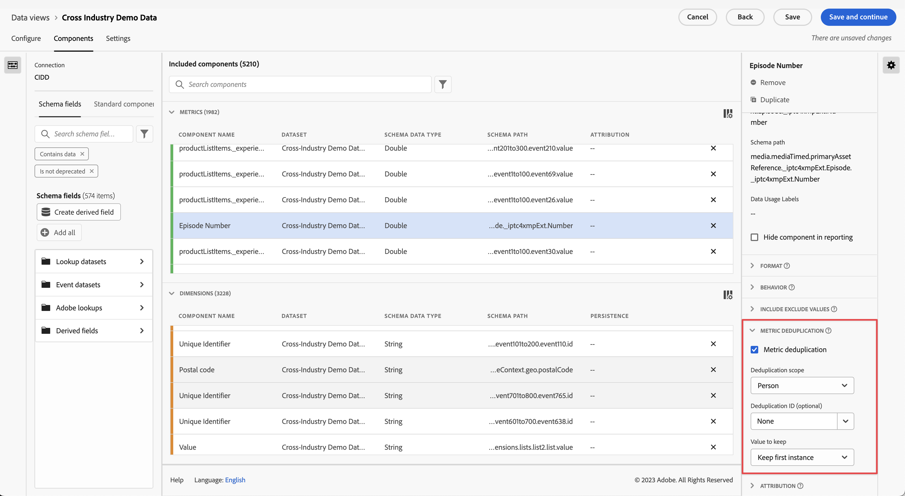

# Configuración del componente de anulación de deduplicación de métricas {#metric-deduplication-component-settings}

<!-- markdownlint-disable MD034 -->

>[!CONTEXTUALHELP]
>id="dataview_component_metric_deduplication"
>title="Anulación de duplicación métrica"
>abstract="Configure una métrica para contar solo los valores que aparezcan de forma no repetitiva."

<!-- markdownlint-enable MD034 -->

La anulación de deduplicación de métricas le permite configurar una métrica para que solo cuente los valores de forma no repetitiva.

| Configuración | Descripción |
| --- | --- |
| [!UICONTROL Anulación de duplicación métrica] | Casilla de verificación que permite habilitar la anulación de deduplicación de métricas. Deshabilitado de forma predeterminada. |
| [!UICONTROL Ámbito de anulación de duplicación] | Permite determinar hasta dónde llega la comprobación única. **[!UICONTROL Cuenta global ]**: solo se cuenta la primera ocurrencia de métrica en la ventana de creación de informes. **[!UICONTROL Cuenta]**: solo se cuenta la primera ocurrencia de métrica en la ventana de creación de informes. **[!UICONTROL Oportunidad ]**: solo se cuenta la primera ocurrencia de métrica en la ventana de creación de informes. **[!UICONTROL Grupo de compras]**: solo se cuenta la primera ocurrencia de métrica en la ventana de creación de informes. **[!UICONTROL Persona ]**: solo se cuenta la primera ocurrencia de métrica en la ventana de creación de informes. **[!UICONTROL Sesión]**: solo se cuenta la primera ocurrencia de métrica de la sesión.  |
| [!UICONTROL ID de anulación de duplicación] | En lugar de aplicar la anulación de deduplicación en la propia métrica, le permite aplicar la anulación de duplicación de métricas en función de una dimensión. Útil para dimensiones como ID de compra para aplicar la anulación de deduplicación. |
| [!UICONTROL Valor que mantener] | <ul><li>**Mantener primera instancia**: utilícelo en situaciones en las que la instancia inicial de la métrica sea válida. Lo más común probablemente sería una confirmación de compra. Incluso si alguien vuelve a cargar la página sin querer y obtiene otra instancia de confirmación de compra, el evento inicial es el válido.</li><li>**Mantener última instancia**: utilícelo en situaciones en las que recopilar la última instancia tenga más sentido. Ejemplo: Alguien actualiza su perfil en línea. Solo queremos contar una de estas actualizaciones por sesión. Sin embargo, pueden actualizar su perfil varias veces durante la sesión. Si conservamos la primera instancia, podría haber actividades que no se vincularan al evento. En este caso, tiene más sentido mantener la última instancia.</li></ul> |

{style="table-layout:auto"}

>[!CAUTION]
>
>La anulación de duplicación en el ámbito de una _persona_ se evalúa mediante meses completos en tiempo UTC. Es posible que una ventana de creación de informes mensual parcial no muestre todas las instancias primera o última, si algunas ocurrieron dentro del mes completo, pero fuera de las fechas de creación de informes.
