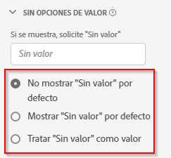

# Configuración de componentes de opciones sin valor {#no-value-options-component-settings}

<!-- markdownlint-disable MD034 -->

>[!CONTEXTUALHELP]
>id="dataview_component_dimension_novalueoptions"
>title="Sin opciones de valor"
>abstract="Configure el comportamiento predeterminado para cuando no haya ningún valor presente en una dimensión."

<!-- markdownlint-enable MD034 -->

Las [!UICONTROL Opciones “sin valor”] le permiten determinar cómo gestiona Analysis Workspace las situaciones en las que un evento de un conjunto de datos contiene una métrica, pero la dimensión no contiene un valor. Puede elegir el nombre de este elemento de dimensión, ocultarlo por completo o incluso tratarlo como un valor real.

## Configuración {#settings}

| Configuración | Descripción |
| --- | --- |
| **[!UICONTROL Si se muestra, solicite Sin valor]** | Campo de texto que permite cambiar el nombre del elemento de dimensión **[!UICONTROL Sin valor]** por otro. |
| **[!UICONTROL No mostrar &quot;Sin valor&quot; de forma predeterminada]** | No muestra este valor en la creación de informes. Las ocurrencias de métricas no vinculadas a esta dimensión no son visibles en el informe. |
| **[!UICONTROL Mostrar &quot;Sin valor&quot; de forma predeterminada]** | Muestra este valor en la creación de informes. |
| **[!UICONTROL Tratar &quot;Sin valor&quot; como un valor]** | (No se admite para dimensiones numéricas) Sustituye los valores en blanco de los datos por el texto especificado en [!UICONTROL Si se muestra, indique &quot;Sin valor&quot;.]. Por ejemplo, si tuviera los tipos de dispositivos móviles como dimensión, podría cambiar el nombre del elemento **[!UICONTROL Ningún valor]** por Escritorio. Tenga en cuenta que cuando cambia este campo a un valor personalizado, el valor personalizado se trata como un valor de cadena legítimo. Por lo tanto, si introduce el valor “Rojo” en este campo, cualquier instancia de la cadena “Rojo” que aparezca en los datos en sí también se moverá bajo el mismo elemento de línea que haya especificado. |

## Compatibilidad con &quot;Sin valor&quot; para dimensiones numéricas {#numeric}

Al utilizar un valor numérico como dimensión, puede

* Configurar la opción &quot;Sin valor&quot; en una vista de datos. Tenga en cuenta que todas las opciones de configuración mostradas arriba son compatibles, excepto **[!UICONTROL Tratar &quot;Sin valor&quot; como un valor]**.
* Use **[!UICONTROL Incluir “Sin valor”]** para dimensiones numéricas en una tabla de forma libre en Workspace.
* En el Generador de segmentos, use los operadores **[!UICONTROL existe]** o **[!UICONTROL no existe]** con dimensiones numéricas.

>[!MORELIKETHIS]
>
>[Libro de reproducción completo para la administración de &quot;Sin valor&quot; en Adobe Customer Journey Analytics](https://experienceleaguecommunities.adobe.com/t5/adobe-analytics-blogs/the-complete-playbook-for-handling-no-value-in-adobe-cja/ba-p/756696?profile.language=es#M598).

