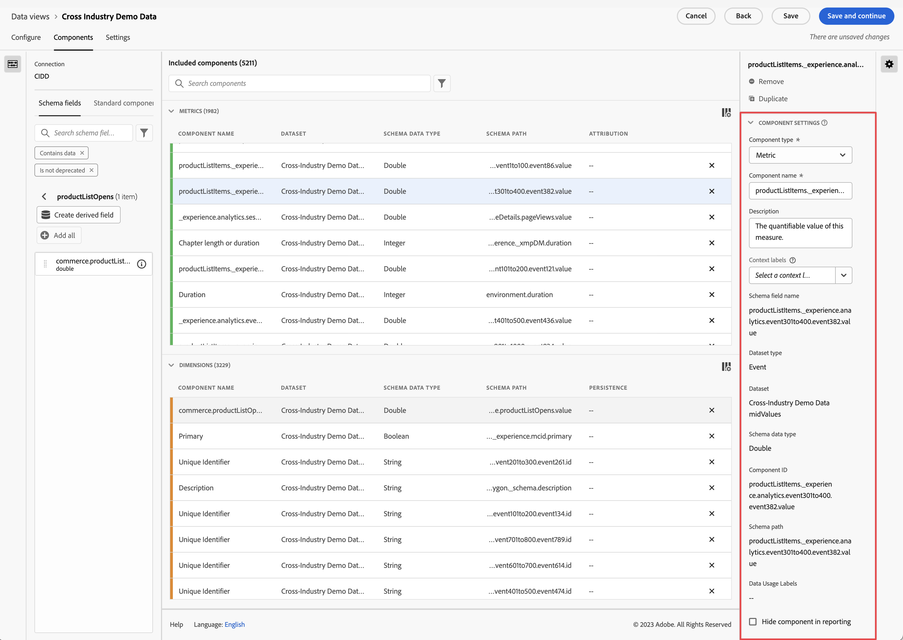

# Configuración de componentes

Configuración principal que utiliza un componente de vista de datos.

| Configuración | Descripción/caso de uso |
| --- | --- |
| [!UICONTROL Tipo de componente] | Requerido. Permite cambiar un componente de Métrica a Dimension o viceversa. Si se cambia esta lista desplegable, el componente pasará al área de componentes incluidos correspondiente. |
| [!UICONTROL Nombre del componente] | Requerido. Permite especificar el nombre descriptivo que aparecerá en Analysis Workspace. Puede cambiar el nombre de un componente para darle un nombre específico para la vista de datos. |
| [!UICONTROL Descripción] | Opcional, pero recomendada. Proporciona información sobre el componente a otros usuarios. |
| [!UICONTROL Etiquetas] | Opcional. Le permite etiquetar el componente con etiquetas personalizadas o listas para usar para facilitar la búsqueda y el filtrado en la IU de Analysis Workspace. |
| [!UICONTROL Nombre del campo] | Nombre del campo de esquema. |
| [!UICONTROL Tipo de conjunto de datos] | Requerido. Campo no editable que muestra el tipo de conjunto de datos (evento, búsqueda o perfil) del que procede el componente. |
| [!UICONTROL Conjunto de datos] | Campo no editable que muestra el conjunto de datos desde el que se originó el componente. Este campo puede contener varios conjuntos de datos. |
| [!UICONTROL Tipo de datos del esquema] | Campo no editable que muestra el tipo de datos del componente.  Aunque puede utilizar cualquier tipo de campo de esquema admitido en Platform, no todos los tipos de campos son compatibles con CJA. Se admiten los siguientes tipos de datos: `Integer`, `Int`, `Long`, `Double`, `Float`, `Number`, `Short`, `Byte`, `String` y `Boolean`. Solo se permite el tipo de datos de esquema `String` en los conjuntos de datos de búsqueda en este momento. |
| [!UICONTROL ID de componente] | Requerido. La [API de CJA](https://adobe.io/cja-apis/docs) utiliza este campo para hacer referencia al componente. Cada componente de una vista de datos debe ser único. Adobe genera automáticamente un ID para cada componente; sin embargo, puede hacer clic en el icono de edición y modificar el ID del componente. Al cambiar este ID de componente, se rompen todos los proyectos existentes del Espacio de trabajo que contienen este componente. Aunque cada componente necesita un ID único en una sola vista de datos, puede utilizar el mismo ID de componente en otras vistas de datos. Si utiliza el mismo ID de componente en otras vistas de datos, puede hacer que los proyectos del Espacio de trabajo sean compatibles en todas las vistas de datos. |
| [!UICONTROL Ruta de esquema] | Requerido. Campo no editable que muestra la ruta de esquema de la que procede el componente. |
| [!UICONTROL Ocultar componente en creación de informes] | Permite depurar el componente fuera de la vista de datos para los usuarios que no son administradores. Los administradores aún pueden acceder a él haciendo clic en [!UICONTROL Mostrar todos los componentes] en un proyecto de Analysis Workspace. |

Aquí hay un vídeo sobre la configuración de componentes en las vistas de datos:

>[!VIDEO](https://video.tv.adobe.com/v/333112/?quality=12)
