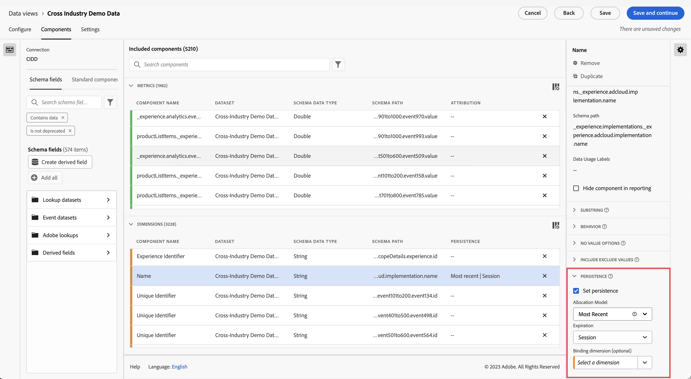

# Configuración de componentes de [!UICONTROL persistencia]

La [!UICONTROL persistencia] es la capacidad de un valor de dimensión determinado para relacionarse con una métrica más allá del evento en el que está establecido. Utiliza una combinación de asignación y caducidad.

* La **asignación** le permite determinar qué valor se conserva cuando más de un elemento de dimensión puede persistir a la vez en una sola columna.
* La **caducidad** le permite determinar cuánto tiempo persiste un elemento de dimensión más allá del evento en el que está establecido.

La [!UICONTROL persistencia] solo está disponible en dimensiones y es retroactiva a los datos a los que se aplica. Se trata de una transformación inmediata de los datos que se produce antes de aplicar el filtrado u otras operaciones de análisis.

| Configuración | Descripción |
| --- | --- |
| [!UICONTROL Establecer persistencia] | Habilite la persistencia para la dimensión. Si la persistencia no está habilitada, la dimensión solo se relaciona con métricas que existen en el mismo evento. Esta opción está desactivada de manera predeterminada. |
| [!UICONTROL Asignación] | Permite especificar el modelo de asignación utilizado en una dimensión para la persistencia. Las opciones son: [!UICONTROL Más reciente], [!UICONTROL Original], [!UICONTROL Instancia], [!UICONTROL Todos]. A partir del 28 de octubre de 2021, se añadirá una ventana retrospectiva de hasta 90 días a la configuración de [!UICONTROL Asignación]. |
| [!UICONTROL Caducidad] | Permite especificar la ventana de persistencia para una dimensión. Las opciones son: [!UICONTROL Sesión] (predeterminada), [!UICONTROL Persona], [!UICONTROL Tiempo personalizado], [!UICONTROL Métrica]. Es posible que deba poder caducar la dimensión de una compra (por ejemplo, términos de búsqueda internos u otros casos de uso de comercialización). La caducidad máxima que puede establecer es de 90 días. Si selecciona una asignación de [!UICONTROL Todos], solo está disponible la caducidad de la [!UICONTROL Sesión] o [!UICONTROL Persona]. |

## Configuración de [!UICONTROL asignación]

Detalles sobre la configuración de asignación disponible.

* **[!UICONTROL Más reciente]**: conserva el valor más reciente (por marca de tiempo) presente en la dimensión. Cualquier valor posterior que aparezca en el periodo de caducidad de la dimensión reemplaza al valor que persiste anteriormente. Si Tratar Sin valor como un valor está habilitado en esta dimensión en [Sin opciones de valor](no-value-options.md), los valores vacíos sobrescriben los valores persistentes anteriormente. Por ejemplo, vea la siguiente tabla con asignación [!UICONTROL Más reciente] y caducidad de [!UICONTROL Sesión]:

   | Dimensión | Visita 1 | Visita 2 | Visita 3 | Visita 4 | Visita 5 |
   | --- | --- | --- | --- | --- | --- |
   | Valores del conjunto de datos |  | C | B |  | A |
   | Asignación más reciente |  | C | B | B | A |

* **[!UICONTROL Original]**: conserva el valor original por marca de tiempo presente en la dimensión durante el periodo de caducidad. Si esta dimensión tiene un valor, no se sobrescribe cuando se ve un valor diferente en un evento posterior. Por ejemplo, vea la siguiente tabla con asignación [!UICONTROL Original] y caducidad de [!UICONTROL Sesión]:

   | Dimensión | Visita 1 | Visita 2 | Visita 3 | Visita 4 | Visita 5 |
   | --- | --- | --- | --- | --- | --- |
   | Valores del conjunto de datos |  | C | B |  | A |
   | Asignación original |  | C | C | C | C |

* **[!UICONTROL Todos]**: actúa de manera similar al modelo de atribución [!UICONTROL Participación] de las métricas. Conserva todos los valores de forma equitativa, de modo que cada uno obtenga crédito total para la métrica en la creación de informes. Por ejemplo, vea la siguiente tabla con asignación de [!UICONTROL Todo] y caducidad de [!UICONTROL Sesión]:

   | Dimensión | Visita 1 | Visita 2 | Visita 3 | Visita 4 | Visita 5 |
   | --- | --- | --- | --- | --- | --- |
   | Valores del conjunto de datos | A | B | C |  | A |
   | Toda la asignación | A | A,B | A,B,C | A,B,C | A,B,C |

* **[!UICONTROL Conocido por primera vez]** y **[!UICONTROL Último conocido]**: (19 de enero de 2022 ) estos dos modelos de asignación satisfacen los casos de uso de dimensiones “entrada” y “salida”. Toman el primer o el último valor observado para una dimensión dentro de un ámbito de persistencia especificado (sesión, persona o período de tiempo personalizado con retrospectiva) y lo aplican a todos los eventos dentro del ámbito especificado. Ejemplo:

   | Dimensión | Visita 1 | Visita 2 | Visita 3 | Visita 4 | Visita 5 |
   | --- | --- | --- | --- | --- | --- |
   | Marca de tiempo (mín.) | 1 | 2 | 3 | 6 | 7 |
   | Valores originales |  | C | B |  | A |
   | Primero conocido | C | C | C | C | C |
   | Último conocido | A | A | A | A | A |

## Configuración de [!UICONTROL caducidad]

Detalles sobre la configuración de caducidad disponible.

* **Sesión**: caduca después de una sesión determinada. Ventana de caducidad predeterminada.
* **Persona**: caduca al final de la ventana de creación de informes.
* **Hora personalizada**: Caduca después de un período de tiempo especificado (hasta 90 días). Esta opción de caducidad solo está disponible para los modelos de asignación Original y Más reciente. Al utilizar la caducidad basada en el tiempo, se tienen en cuenta los valores anteriores al inicio de la ventana de creación de informes (hasta 90 días).
* **Métrica**: cuando esta métrica se ve en una visita, caduca inmediatamente el valor persistente en la dimensión. Puede usar cualquier métrica como fin de caducidad para esta dimensión. Esta opción de caducidad solo está disponible para la configuración de asignación Original y Más reciente.

## [!UICONTROL Dimensión de enlace]

Un menú desplegable que permite enlazar la persistencia de un valor de dimensión con valores de dimensión de otra dimensión. Las opciones desplegables válidas incluyen otras dimensiones incluidas en la vista de datos.

Consulte [Uso de dimensiones y métricas de enlace en CJA](../../use-cases/binding-dimensions-metrics.md) para ver ejemplos sobre cómo utilizar de forma eficaz las dimensiones de enlace.

## [!UICONTROL Métrica de enlace]

Lista desplegable que permite elegir una métrica que actúa como activador de enlace. Las opciones desplegables válidas incluyen métricas incluidas en la vista de datos.

Esta configuración solo aparece cuando la dimensión de enlace es inferior en la matriz de objetos que el componente. Cuando la métrica de enlace está presente en un evento, los valores de dimensión se copian de la dimensión de nivel de evento hasta el nivel de esquema inferior de la dimensión de enlace.

Consulte el segundo ejemplo en [Uso de dimensiones y métricas de enlace en CJA](../../use-cases/binding-dimensions-metrics.md) para obtener más información sobre cómo utilizar de forma eficaz las métricas de enlace.
