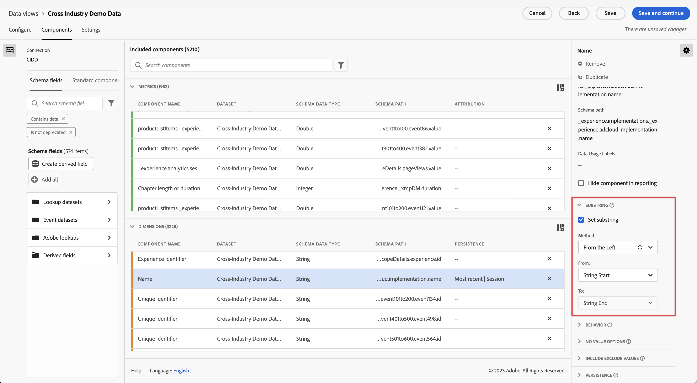

# [!UICONTROL Substring] configuración de componentes

[!UICONTROL Substring] la configuración de componentes permite realizar varios métodos de manipulación de cadenas para obtener los elementos de dimensión deseados en los informes.

[!UICONTROL Substring] solo está disponible en dimensiones y es retroactivo para los datos a los que se aplica. Se trata de una transformación inmediata de los datos que se produce antes de aplicar el filtrado u otras operaciones de análisis.

## De izquierda a derecha

Realice una parte de una cadena basada en su posición hasta el principio o el final de una cadena. **[!UICONTROL Desde la izquierda]** y **[!UICONTROL Desde la derecha]** los métodos proporcionan dos menús desplegables: **[!UICONTROL De]** (donde se inicia la salida) y **[!UICONTROL Hasta]** (donde termina la salida).

* **[!UICONTROL Inicio de cadena]**: Inicio de la cadena.
* **[!UICONTROL Final de cadena]**: El final de la cadena.
* **[!UICONTROL Posición]**: Un número estático de caracteres de la izquierda o la derecha, según el método .
* **[!UICONTROL Cadena]**: Haga coincidir un carácter o secuencia de caracteres para indicar el principio o el final de una cadena. Este menú desplegable también revela opciones adicionales:
   * **[!UICONTROL Coincidencia]**: La cadena que debe coincidir. Si la entrada no coincide con este campo, [Sin opciones de valor](no-value-options.md) .
   * **[!UICONTROL Índice]**: La variable **[!UICONTROL Coincidencia]** Los criterios de se pueden presentar varias veces en una cadena. Este entero determina qué coincidencia debe comenzar o finalizar la salida, según el método . Por ejemplo, un índice de `1` representa la primera coincidencia. Si el índice es mayor que el número de coincidencias disponibles, [Sin opciones de valor](no-value-options.md) .
   * **[!UICONTROL Incluir cadena]**: Una casilla de verificación que incluya la variable **[!UICONTROL Coincidencia]** en la salida si está activada.
* **[!UICONTROL Length]**: Un entero que especifica el recuento de caracteres que se va a incluir después de la posición inicial de la salida. Solo está disponible en la sección **[!UICONTROL Hasta]** lista desplegable.

## Delimitador

Utilice este método para campos que utilizan un delimitador para separar varios valores de cadena. Puede extraer un elemento individual para utilizarlo como salida o convertir la cadena en un elemento de esquema de matriz de objetos.

* **[!UICONTROL Criterio]**: Cómo desea tratar la lista delimitada de valores.
   * **[!UICONTROL Desde la izquierda]**: Comience desde el principio de la lista delimitada y cuente hacia adelante.
   * **[!UICONTROL Desde la derecha]**: Comience desde el final de la lista delimitada y cuente hacia atrás.
   * **[!UICONTROL Convertir en matriz]**: Trate esta dimensión como si fuera un elemento de esquema de matriz de objetos.
* **[!UICONTROL Delimitador]**: El delimitador que utiliza el campo.
* **[!UICONTROL Índice]**: Solo está presente si el criterio es De izquierda a derecha. El número de elemento como si estuviera en una matriz. Por ejemplo, si la entrada de cadena es `"Fox,Turtle,Rabbit,Wolf"` con un índice de 3, el resultado es `"Rabbit"`. Si el índice es superior al número de elementos delimitados, [Sin opciones de valor](no-value-options.md) .

## Análisis de URL

Para su uso con campos que contienen direcciones URL. Uso de la URL de ejemplo `https://example.com/store/index.html?cid=campaign#cart`, están disponibles las siguientes opciones:

* **[!UICONTROL Obtener protocolo]**: Obtenga el protocolo de la dirección URL. Por ejemplo, `"https://"`.
* **[!UICONTROL Obtener host]**: Obtenga el host de la URL. Por ejemplo, `"example.com"`.
* **[!UICONTROL Obtener ruta]**: Obtenga la ruta de la dirección URL. Por ejemplo, `"store/index.html"`.
* **[!UICONTROL Obtener valor de cadena de consulta]**: Obtenga el valor de una sola cadena de consulta. Coloque el parámetro de cadena de consulta deseado en la variable **[!UICONTROL Clave de consulta]** campo . Si la dirección URL anterior se utiliza con la variable `"cid"` clave de consulta, el resultado es `"campaign"`.
* **[!UICONTROL Obtener valor hash]**: Obtenga el valor hash de la dirección URL. Por ejemplo, `"cart"`.

Si la entrada no es una dirección URL válida o si el componente URL deseado no está presente, [Sin opciones de valor](no-value-options.md) .

## Recortar

Recorte el espacio en blanco o los caracteres especiales de la cadena.

* **[!UICONTROL Recortar espacios en blanco]**: Casilla de verificación que elimina todos los espacios en blanco al principio y al final de la cadena si está activada.
* **[!UICONTROL Recortar caracteres especiales]**: Una casilla de verificación que muestra un **[!UICONTROL Caracteres especiales]** campo de entrada si está activado. Todos los caracteres de este campo se eliminan de la salida. No se admiten caracteres de bytes múltiples.

## Regex

Aplique expresiones regulares a una dimensión para recuperar el valor deseado.

* **[!UICONTROL Regex]**: La fórmula de expresión regular.
* **[!UICONTROL Formato de salida]**: Campo opcional que permite agregar texto o reordenar la salida del subgrupo regex. Si este campo está en blanco, el resultado de la cadena es la expresión regex evaluada.
* **[!UICONTROL Distinción entre mayúsculas y minúsculas]**: Casilla de verificación que fuerza a la expresión regular a distinguir entre mayúsculas y minúsculas si está habilitada.

CJA utiliza un subconjunto de la sintaxis regex de Perl. Si la entrada no coincide con la expresión regular y la variable **[!UICONTROL Formato de salida]** está en blanco, [Sin opciones de valor](no-value-options.md) . Se admiten las expresiones siguientes:

| Expresión | Descripción |
| --- | --- |
| `a` | Un solo carácter `a`. |
| `a|b` | Un solo carácter `a` o `b`. |
| `[abc]` | Un solo carácter `a`, `b`o `c`. |
| `[^abc]` | Cualquier carácter individual excepto `a`, `b`o `c`. |
| `[a-z]` | Cualquier carácter individual del rango de `a`-`z`. |
| `[a-zA-Z0-9]` | Cualquier carácter individual del rango de `a`-`z`, `A`-`Z`o dígitos `0`-`9`. |
| `^` | Coincide con el principio de la línea. |
| `$` | Coincide con el final de la línea. |
| `\A` | Inicio de cadena. |
| `\z` | Final de cadena. |
| `.` | Coincide con cualquier carácter. |
| `\s` | Cualquier carácter de espacio en blanco. |
| `\S` | Cualquier carácter que no sea un espacio en blanco. |
| `\d` | Cualquier dígito. |
| `\D` | Cualquier no dígito. |
| `\w` | Cualquier letra, número o guión bajo. |
| `\W` | Cualquier carácter que no sea de palabra. |
| `\b` | Cualquier límite de palabra. |
| `\B` | Cualquier carácter que no sea un límite de palabra. |
| `\<` | Inicio de la palabra. |
| `\>` | Fin de la palabra. |
| `(...)` | Capturar todo lo incluido. |
| `(?:...)` | Captura sin marca. Evita que se haga referencia a la coincidencia en la cadena de salida. |
| `a?` | Cero o uno de `a`. |
| `a*` | Cero o más de `a`. |
| `a+` | Uno más de los `a`. |
| `a{3}` | Exactamente 3 de `a`. |
| `a{3,}` | 3 o más de `a`. |
| `a{3,6}` | Entre 3 y 6 de `a`. |

También se admiten marcadores de posición de salida. Puede utilizar estas secuencias en el **[!UICONTROL Formato de salida]** cualquier número de veces y en cualquier orden para obtener la salida de cadena deseada.

| Secuencia de marcador de posición de salida | Descripción |
| --- | --- |
| `$&` | Genera lo que coincide con toda la expresión. |
| `$n` | Genera lo que coincidió con la subexpresión nth. Por ejemplo, `$1` genera la primera subexpresión. |
| ``$` `` | Genera el texto entre el final de la última coincidencia encontrada (o el inicio del texto si no se encontró ninguna coincidencia anterior) y el inicio de la coincidencia actual. |
| `$+` | Genera lo que coincidió con la última subexpresión marcada en la expresión regular. |
| `$$` | Genera el carácter de cadena `"$"`. |
