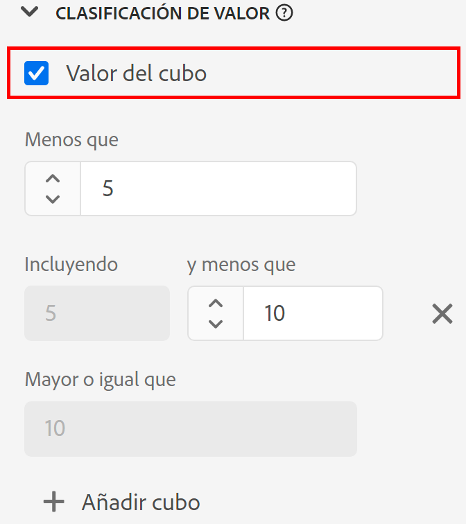

# Configuración del componente de [!UICONTROL agrupamiento de valores] {#value-bucketing-component-settings}

<!-- markdownlint-disable MD034 -->

>[!CONTEXTUALHELP]
>id="dataview_component_dimension_value_bucketing"
>title="Creación de depósitos"
>abstract="Agrupe los valores en intervalos específicos. Estos intervalos aparecen como elementos de dimensión en los informes."

<!-- markdownlint-enable MD034 -->

Al crear o editar una vista de datos, la agrupación de valores permite combinar valores numéricos basados en un rango. Solo está disponible para dimensiones que utilizan tipos de datos de esquema entero o doble.

La agrupación de valores es útil cuando desea agrupar intervalos en lugar de tratar cada número único como un elemento de dimensión independiente. Por ejemplo, un bloque de entre 5 y 10 aparecerá como un elemento de línea de 5 a 10 en Analysis Workspace.

Si desea la flexibilidad al crear informes tanto en términos de dimensiones agrupadas como en no agrupadas, arrastre dos copias del componente a la lista de dimensiones disponibles. Habilite el agrupamiento en una dimensión y deshabilite en la otra.

| Configuración | Descripción |
| --- | --- |
| [!UICONTROL Valor del cubo] | Casilla de verificación que permite activar el agrupamiento. |
| [!UICONTROL Menos de] | Límite superior del primer bloque de dimensiones. |
| [!UICONTROL Incluyendo] [!UICONTROL y menor que] | Límites de bloques subsiguientes. |
| [!UICONTROL Mayor o igual que] | Límite inferior del último bloque de dimensiones. |
| [!UICONTROL Añadir cubo] | Permite añadir otro bloque a la agrupación de dimensiones numéricas. Puede añadir hasta 20 bloques en una sola dimensión. |

{style="table-layout:auto"}
