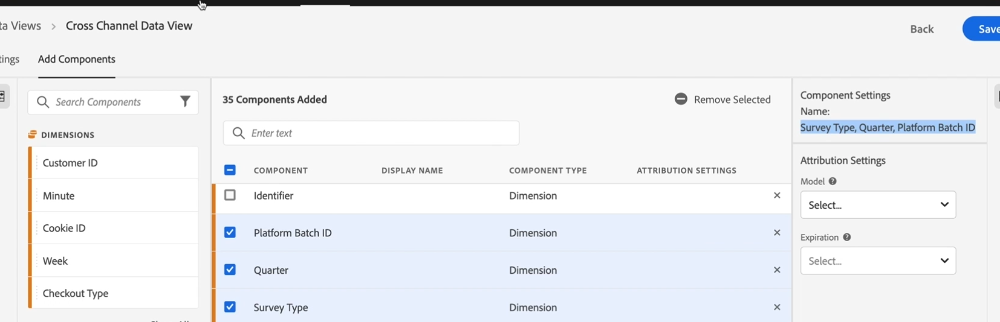
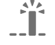

# Configuración de componentes y atribuciones

Las eVars, las propiedades y los eventos de la sensación tradicional de Adobe Analytics ya no existen en el análisis de viajes del cliente. En su lugar, tiene elementos de esquema ilimitados (dimensiones, métricas, campos de lista). Todos los ajustes de atribución que se utilizaron para aplicar a eVars y props durante el proceso de recopilación de datos ahora se aplican en tiempo de consulta, también conocidos como procesamiento de tiempo de informe.

Haga clic [aquí](https://docs.adobe.com/content/help/en/platform-learn/tutorials/cja/attribution-settings-in-data-views.html) para ver un vídeo de información general.

Tenga esto en cuenta antes de aplicar la configuración de atribución:

* En la interfaz de usuario de vistas de datos, se especifica la atribución predeterminada. **Nota**: Posteriormente, podrá anular esta configuración en proyectos de Workspace. Sin embargo, esta funcionalidad no está disponible en este momento.

* La configuración de atribución en el análisis de viaje del cliente no es destructiva ni retroactiva. En otras palabras, no puede dañar irreparablemente sus conjuntos de datos en el análisis de viajes del cliente. Incluso si elimina algo accidentalmente, siempre puede volver a la plataforma de experiencia y volver a introducir el conjunto de datos. (Sin embargo, tenga en cuenta que volver a incorporar el conjunto de datos supondrá un costo adicional).

* Si desea que una dimensión &quot;se comporte&quot; como una eVar tradicional (variable de conversión), debe configurarla con la atribución de &quot;Visita de último toque&quot; de forma predeterminada.

* Si desea que una dimensión &quot;se comporte&quot; como una propiedad tradicional (variable de tráfico), debe configurarla con la atribución &quot;Mismo toque&quot; de forma predeterminada.

* Si desea que una métrica se &quot;comporte&quot; como una métrica predeterminada, no debe cambiar nada.

* La configuración de atribución de métricas anula la configuración de atribución de dimensiones.

## Especificar la configuración de componente y atribución

Después de [establecer y guardar la configuración](/help/data-views/create-dataview.md) de vista de datos y de agregar componentes, estará listo para especificar la configuración de atribución, si lo desea. Puede especificar la configuración de atribución/caducidad/retroactividad para dimensiones y métricas. Si, por ejemplo, desea que la atribución de una dimensión persista, es probable que desee establecer una hora de caducidad personalizada. Por ejemplo: si desea que una dimensión &#39;Código de seguimiento&#39; (una variable de campaña) configurada en la atribución &#39;Último toque&#39; persista durante una semana, agregue una caducidad personalizada de 1 semana.

>[!IMPORTANT]
>Puede optar por no establecer la asignación/caducidad. En ese caso, las dimensiones se comportarán como... . Las métricas sin configuración de atribución heredarán la configuración de la dimensión a la que se aplica esta métrica.

1. Especifique la configuración de componente y atribución para dimensiones y métricas. Consulte a continuación para obtener información sobre la configuración individual.

1. Haga clic en **[!UICONTROL Save]** para guardar la vista de datos.

### Configuración de componentes

Puede cambiar el nombre de la métrica o dimensión a algo más sencillo de usar. Tenga en cuenta que el nombre subyacente no cambia, solo el nombre para mostrar.

### Modelo de atribución

El modelo describe la distribución de las conversiones a los eventos de un grupo. Por ejemplo, primer contacto o último contacto. Determina la forma en que el análisis de viaje del cliente asigna crédito por un evento de éxito si una variable recibe varios valores antes del evento.

| Icono de la interfaz de usuario | Modelo de atribución | Definición | Uso |
| --- | --- | --- | --- |
|  | Último contacto | Otorga un 100% de crédito al punto de contacto que se produce más recientemente antes de la conversión. | El modelo de atribución más básico y común. Se utiliza con frecuencia para conversiones con un breve ciclo de consideración. Último toque lo utilizan comúnmente equipos que gestionan el marketing de búsqueda o que analizan palabras clave de búsqueda interna. |
|  | Primer contacto | Otorga un 100% de crédito al punto de contacto que se ve por primera vez en la ventana retrospectiva de atribución. | Otro modelo de atribución común que resulta útil para analizar canales de marketing destinados a impulsar la diferenciación de la marca o la adquisición de clientes. Lo suelen usar equipos de marketing de Visualización o Social, pero también es una herramienta excelente para evaluar la efectividad de recomendaciones de productos in situ. |
|  | Mismo contacto | Otorga un 100% de crédito a la visita individual donde se produjo la conversión. Si un punto de contacto no se produce en la misma visita que una conversión, se agrupa en “Ninguno”. | Es un modelo útil al evaluar el contenido o la experiencia del usuario que se presentó inmediatamente en el momento de la conversión. Los equipos de producto o diseño a menudo utilizan este modelo para tener acceso a la efectividad de una página en la que tiene lugar la conversión. |
|  | Lineal | Otorga el mismo crédito a cada punto de contacto que se visualice y que conduzca a una conversión. | Este modelo es útil para conversiones con ciclos de consideración más largos o experiencias del usuario que necesitan interacción de clientes más frecuente. La suelen utilizar equipos que miden la efectividad de notificaciones de aplicaciones móviles o con productos por suscripción. |
|  | Forma de U | Otorga un 40% de crédito a la primera interacción, un 40% de crédito a la última interacción y divide el 20% restante en cualquier punto de contacto intermedio. Para las conversiones con un solo punto de contacto, se otorga un 100% de crédito. Para las conversiones con dos puntos de contacto, se otorga un 50% de crédito a ambos. | Un gran modelo para aquellos que valoran las interacciones que introdujeron o cerraron una conversión, pero que aún desean reconocer las interacciones de asistencia. La atribución de Forma de U la suelen utilizar equipos que adoptan un enfoque más equilibrado y desean dar más crédito a canales que encontraron o cerraron una conversión. |
|  | Forma de J | Otorga un 60% de crédito a la última interacción, un 20% de crédito a la primera interacción y divide el 20% restante en cualquier punto de contacto intermedio. Para las conversiones con un solo punto de contacto, se otorga un 100% de crédito. Para las conversiones con dos puntos de contacto, se otorga un 75% de crédito a la última interacción y un 25% de crédito a la primera. | Este modelo es ideal para aquellos que dan prioridad a los buscadores y cerradores, pero que quieren centrarse en cerrar interacciones. La atribución de Forma de J la suelen utilizar equipos que adoptan un enfoque más equilibrado y desean dar más crédito a canales que cerraron una conversión. |
|  | J inversa | Otorga un 60% de crédito al primer contacto, un 20% al último contacto y divide el 20% restante en cualquier punto de contacto intermedio. Para las conversiones con un solo punto de contacto, se otorga un 100% de crédito. Para las conversiones con dos puntos de contacto, se otorga un 75% de crédito a la primera interacción y un 25% de crédito a la última. | Este modelo es ideal para aquellos que dan prioridad a los buscadores y cerradores, pero que desean centrarse en encontrar interacciones. La atribución de J inversa la suelen utilizar equipos que adoptan un enfoque más balanceado y desean dar más crédito a canales que iniciaron una conversión. |
|  | Personalizado | Permite especificar el valor que desea dar a los puntos de primer contacto, los puntos de último contacto y los puntos de contacto intermedios. Los valores especificados se normalizan al 100% incluso si los números introducidos no suman 100. Para las conversiones con un solo punto de contacto, se otorga un 100% de crédito. En el caso de interacciones con dos puntos de contacto, se omite el parámetro central. Los puntos de primer y último contacto se normalizan al 100% y el crédito se asigna en consecuencia. | Este modelo es perfecto para aquellos que quieren un control total sobre su modelo de atribución y tienen necesidades específicas que otros modelos de atribución no satisfacen. |
|  | Declive temporal | Sigue un declive exponencial con un parámetro de semivida personalizado, con un valor predeterminado de 7 días. El valor de cada canal depende de la cantidad de tiempo que transcurra entre el inicio del punto de contacto y la conversión final. La fórmula utilizada para determinar el crédito es `2``(-t/halflife)`, donde `t` es la cantidad de tiempo entre un punto de contacto y una conversión. A continuación, todos los puntos de contacto se normalizan al 100%. | Ideal para equipos que periódicamente ejecutan campañas audiovisuales o que comercializan eventos con una fecha predeterminada. Cuanto más tardía sea la conversión después de un evento de marketing, menor será el crédito. |
|  | Participación | Otorga un 100% de crédito a todos los puntos de contacto únicos. El número total de conversiones está incrementado en comparación con otros modelos de atribución. La participación anula la duplicación de los canales vistos varias veces. | Excelente para comprender con qué frecuencia se exponen los clientes a una determinada interacción. Los medios suelen utilizar este modelo para calcular la velocidad de contenido. Los comercios suelen utilizar este modelo para comprender qué partes de sus sitios son esenciales para la conversión. |

### Caducidad

Especifica un período de tiempo o evento tras el cual caduca el valor de la dimensión (ya no recibe crédito por los eventos de éxito). Puede establecer la caducidad de la atribución en el nivel de sesión, persona o personalizado.

| Configuración | Definición |
|---|---|
| Sesión | Anteriormente conocido como el nivel de &#39;visita&#39;. Los eventos de conversión más allá de la vista de página o sesión no se asocian con la dimensión o métrica. |
| Persona (ventana de informes) | Anteriormente conocido como el nivel &#39;Visitante&#39;. Los eventos de conversión no vinculados a esta persona no se asocian con la dimensión o métrica. |
| Tiempo personalizado | Especifique los minutos, horas, días, meses o trimestres personalizados. Los eventos de conversión más allá del período de tiempo especificado no se asocian con la dimensión o métrica. |

Para obtener más información, consulte el documento [Atribución IQ](https://docs.adobe.com/content/help/en/analytics/analyze/analysis-workspace/panels/attribution/attribution.html).

### Ventana retroactiva

Una ventana retrospectiva es la cantidad de tiempo que una conversión debe devolverse en el tiempo para incluir los puntos de contacto. Los modelos de atribución que dan más crédito a las primeras interacciones ven diferencias mayores al tener ventanas retrospectivas distintas.

* **Sesión:** Revisa hasta el principio de una sesión en la que se produjo una conversión. Las ventanas retroactivas de visitas son estrechas, ya que no se ven más allá de la sesión. Las ventanas retrospectivas de sesión respetan la definición de visita modificada en las vistas de datos.
* **Persona (ventana de informes):** Busca en todas las sesiones hasta el primer día del mes del intervalo de fechas actual. Las ventanas retrospectivas personales son amplias, ya que pueden abarcar muchas sesiones. Por ejemplo: si el intervalo de fechas del informe es del 15 de septiembre al 30 de septiembre, el intervalo de fechas retrospectivas de la persona incluye del 1 de septiembre al 30 de septiembre.
