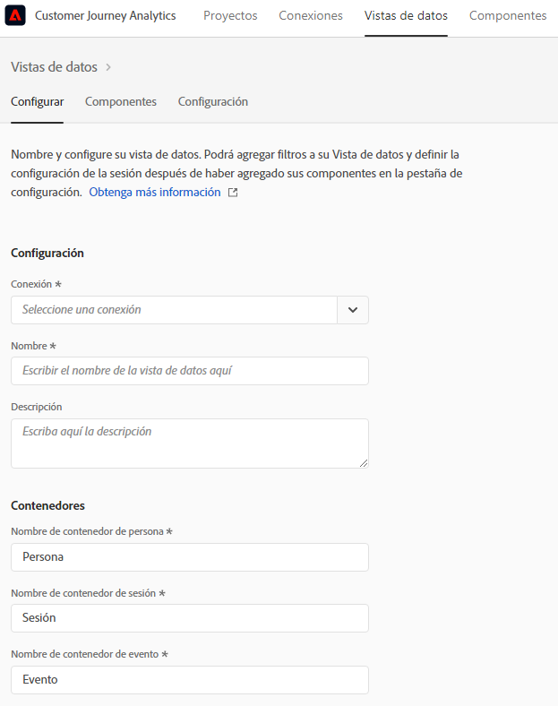
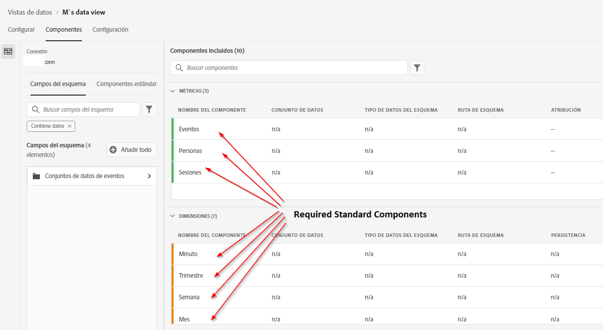
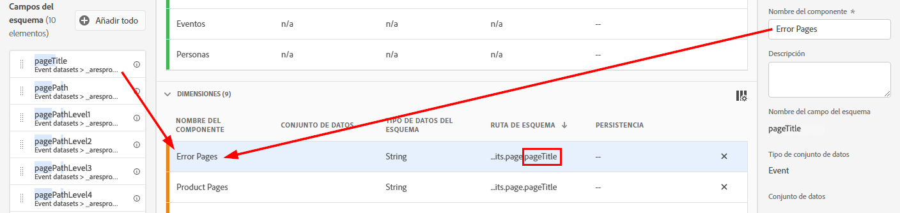
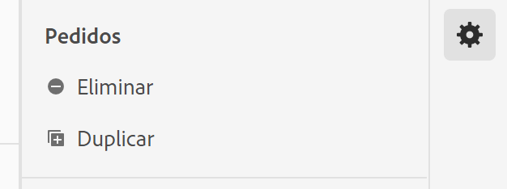
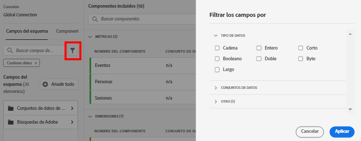
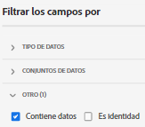

# Creación o edición de una fuente de datos

La creación de una vista de datos implica crear métricas y dimensiones a partir de elementos de esquema o utilizar componentes estándares. La mayoría de los elementos de esquema pueden ser una dimensión o una métrica según los requisitos de la empresa. Una vez arrastrado un elemento de esquema a una vista de datos, las opciones aparecen a la derecha, donde puede ajustar el funcionamiento de la dimensión o métrica en CJA.

## Configuración de una fuente de datos

1. Inicie sesión en [Customer Journey Analytics](https://analytics.adobe.com) y vaya a la pestaña **[!UICONTROL Vistas de datos]**.
2. Haga clic en **[!UICONTROL Agregar]** para crear una vista de datos o haga clic en una vista de datos existente para editarla.

### Configuración de vista de datos

Proporciona una configuración general para la vista de datos.

| Configuración | Descripción |
| --- | --- |
| [!UICONTROL Conexión] | Este campo vincula la vista de datos con la conexión establecida anteriormente, que tiene uno o varios conjuntos de datos de Adobe Experience Platform. |
| [!UICONTROL Nombre] | Requerido. Nombre de la vista de datos. Este valor aparece en la lista desplegable superior derecha de Analysis Workspace. |
| [!UICONTROL Descripción] | Opcional. Adobe recomienda una descripción detallada para que los usuarios entiendan por qué existe la vista de datos y para quién está diseñada. |

### Contenedores

Designa el nombre de los contenedores para la vista de datos. Los nombres de contenedores se utilizan frecuentemente en [Filtros](/help/components/filters/filters-overview.md#Filter-containers).

| Configuración | Descripción |
| --- | --- |
| [!UICONTROL Nombre de contenedor de persona] | [!UICONTROL Persona] (valor predeterminado). El contenedor [!UICONTROL Persona] incluye todas las visitas y vistas de página de los visitantes en un lapso de tiempo específico. Si su organización utiliza un término diferente (por ejemplo, visitante o usuario), puede cambiar el nombre del contenedor aquí. |
| [!UICONTROL Nombre de contenedor de sesión] | [!UICONTROL Sesión] (valor predeterminado). El contenedor [!UICONTROL Sesión] le permite identificar interacciones de páginas, campañas o conversiones para una sesión específica. Puede cambiar el nombre de este contenedor a Visita o a cualquier otro término que prefiera. |
| [!UICONTROL Nombre de contenedor de evento] | [!UICONTROL Evento] (valor predeterminado). El contenedor [!UICONTROL Evento] define eventos individuales en un conjunto de datos. Si su organización utiliza un término diferente (por ejemplo, Visitas individuales o Vistas de página), puede cambiar el nombre del contenedor aquí. |

### Calendario

Indica el formato de calendario que desea que siga la vista de datos. Puede tener varias vistas de datos basadas en la misma [Conexión](/help/connections/create-connection.md) y proporcionarles diferentes tipos de calendario o zonas horarias. Estas vistas de datos pueden permitir que equipos que utilicen distintos tipos de calendario satisfagan sus necesidades respectivas con los mismos datos subyacentes.

| Configuración | Descripción |
| --- | --- |
| [!UICONTROL Zona horaria] | Elija en qué zona horaria desea que se presenten los datos. Si elige una zona horaria que funcione según el horario de verano, los datos se ajustan automáticamente para reflejarlo. En primavera, cuando los relojes se adelantan, hay un espacio de una hora. En otoño, cuando los relojes se atrasan, se repite una hora durante el cambio del horario de verano. |
| [!UICONTROL Tipo de calendario] | Determine cómo se agrupan las semanas del mes. **Gregoriano:** formato de calendario estándar. Los trimestres se agrupan por mes. **Venta minorista 4-5-4:** calendario de venta minorista estandarizado 4-5-4. El primer y último mes del trimestre contiene 4 semanas, mientras que el segundo mes del trimestre consta de 5 semanas. **Personalizado (4-5-4):** similar al calendario 4-5-4 excepto que puede elegir el primer día del año y el año en el que se produce la semana extra. **Personalizado (4-4-5):** el primer y el segundo meses de cada trimestre contienen 4 semanas, mientras que la última semana de cada trimestre constan de 5 semanas. **Personalizado (5-4-4):** el primer mes de cada trimestre consta de 5 semanas, mientras que el segundo y el tercer mes de cada trimestre constan de 4 semanas. |
| [!UICONTROL Primer mes del año] y [!UICONTROL primer día de la semana] | Visible para el tipo de calendario gregoriano. Especifique en qué mes desea que comience el año del calendario y en qué día desea que comience cada semana. |
| [!UICONTROL Primer día del año actual] | Visible para tipos de calendario personalizados. Especifique qué día del año desea que comience el año actual. El calendario aplica automáticamente el formato del primer día de cada semana en función de este valor. |
| [!UICONTROL Año que incluye la semana “extra”] | Con la mayoría de los calendarios de 364 días (52 semanas de 7 días cada uno), cada año se acumulan varios días restantes hasta formar una semana extra. Esta semana extra se agrega al último mes de ese año. Especifique a qué año desea agregar la semana adicional. |

## Definición de los componentes de una vista de datos

A continuación, puede crear métricas y dimensiones a partir de elementos de esquema. También puede utilizar componentes estándares.

1. Inicie sesión en [Customer Journey Analytics](https://analytics.adobe.com) y vaya a la pestaña **[!UICONTROL Vistas de datos]**.
1. Haga clic en **[!UICONTROL Agregar]** para crear una vista de datos o haga clic en una vista de datos existente para editarla.
1. Haga clic en la pestaña **[!UICONTROL Componentes]**.

   

   Puede ver la [!UICONTROL Conexión] en la parte superior izquierda, que contiene los conjuntos de datos, y sus [!UICONTROL Campos de esquema] a continuación. Tenga en cuenta que los componentes ya incluidos son componentes estándar necesarios (que genera el sistema) para todas las vistas de datos. Adobe aplica el filtro **[!UICONTROL Contiene datos]** de forma predeterminada, de modo que solo aparecen los campos de esquema que contienen datos. Si desea un campo que no contenga datos, elimine este filtro.

1. Arrastre un campo de esquema, como `pageTitle`, desde el carril izquierdo a la sección Métricas o Dimensión.

   Puede arrastrar el mismo campo de esquema a las secciones de dimensiones o métricas varias veces y configurar la misma dimensión o métrica de diferentes maneras. Por ejemplo, desde el campo `pageTitle` puede crear una dimensión llamada Páginas de producto y otra Páginas de error utilizando diferentes [Configuraciones del componente](component-settings/overview.md) a la derecha.

   

   Si arrastra una carpeta de campo de esquema desde el carril izquierdo, se ordenan automáticamente en secciones típicas. Los campos de cadena terminan en la sección [!UICONTROL Dimensiones] y los tipos de esquema numérico terminan en la sección [!UICONTROL Métricas]. También puede hacer clic en **[!UICONTROL Agregar todo]** y todos los campos de esquema se añaden a sus respectivas ubicaciones.

1. Una vez que seleccione el componente, verá una serie de configuraciones a la derecha. Configure el componente con [Configuración del componente](component-settings/overview.md). La configuración de componentes disponible depende de si el componente es una dimensión o métrica y del tipo de datos de esquema. La configuración incluye lo siguiente:

   * [[!UICONTROL Atribución]](component-settings/attribution.md)
   * [[!UICONTROL Comportamiento]](component-settings/behavior.md)
   * [[!UICONTROL Formato]](component-settings/format.md)
   * [[!UICONTROL Incluir/excluir valores]](component-settings/include-exclude-values.md)
   * [[!UICONTROL Anulación de duplicación métrica]](component-settings/metric-deduplication.md)
   * [[!UICONTROL Sin opciones de valor]](component-settings/no-value-options.md)
   * [[!UICONTROL Persistencia]](component-settings/persistence.md)
   * [[!UICONTROL Clasificación de valor]](component-settings/value-bucketing.md)

## Duplicar métricas o dimensiones

Duplicar métricas o dimensiones y luego modificar configuraciones específicas es una manera sencilla de crear varias métricas o dimensiones a partir de un único campo de esquema. Seleccione la opción [!UICONTROL Duplicado] debajo del nombre de la métrica o dimensión en la parte superior derecha. Modifique la nueva métrica o dimensión, y guárdela con un nombre más descriptivo.

## Filtrar campos de esquema o conjuntos de datos

Puede filtrar los campos de esquema en el carril izquierdo según los siguientes tipos de datos:

También puede filtrar por conjuntos de datos y por si un campo de esquema contiene datos o si es una identidad. De forma predeterminada, Adobe aplica el filtro **[!UICONTROL Contiene datos]** a todas las vistas de datos.

## Configuración ficha

1. Inicie sesión en [Customer Journey Analytics](https://analytics.adobe.com) y vaya a la pestaña **[!UICONTROL Vistas de datos]**.
1. Haga clic en **[!UICONTROL Agregar]** para crear una vista de datos o haga clic en una vista de datos existente para editarla.
1. Haga clic en la pestaña **[!UICONTROL Configuración]**.

### Filtro global

Puede agregar filtros que se apliquen a toda la vista de datos. Este filtro se aplicará a cualquier informe que ejecute el Espacio de trabajo. Arrastre un filtro desde la lista en el carril izquierdo al campo [!UICONTROL Añadir filtros].

### Configuración de sesión

Determine el período de inactividad entre los eventos antes de que caduque una sesión y se inicie una nueva.

Se requiere un período de tiempo. Opcionalmente, también puede forzar el inicio de una nueva sesión cuando un evento contenga una métrica determinada.

Una vez especificada toda la configuración deseada, haga clic en **[!UICONTROL Guardar y finalizar]**.
