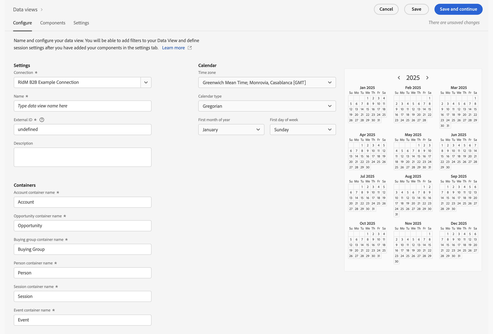
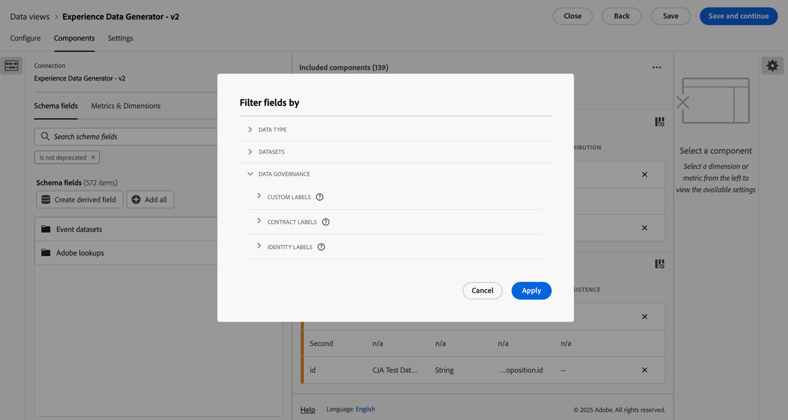
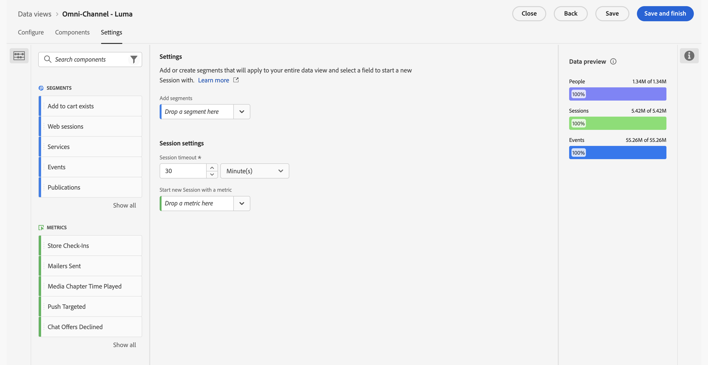

# Creación o edición de una vista de datos

La creación de una vista de datos implica crear métricas y dimensiones a partir de elementos de esquema o utilizar componentes estándares. La mayoría de los elementos de esquema pueden ser una dimensión o una métrica según los requisitos de la empresa. Una vez arrastrado un elemento de esquema a una vista de datos, las opciones aparecen a la derecha, donde puede ajustar el funcionamiento de la dimensión o métrica en Customer Journey Analytics.

>[!BEGINSHADEBOX]

Consulte  [Crear o editar una vista de datos](https://video.tv.adobe.com/v/35110/?quality=12&learn=on){target="_blank"} para ver un vídeo de demostración.

>[!ENDSHADEBOX]

Creación o edición de una vista de datos:

1. Inicie sesión en [Customer Journey Analytics](https://analytics.adobe.com) y seleccione **[!UICONTROL Vistas de datos]**, opcionalmente desde **[!UICONTROL Administración de datos]**, en el menú superior.
1. Para crear una vista de datos, seleccione **[!UICONTROL Crear nueva vista de datos]**. También puede seleccionar una vista de datos existente de la lista de vistas de datos para editarla.

## Configuración {#configure}

Para configurar una vista de datos nueva o existente, haga lo siguiente:

>[!BEGINTABS]

>[!TAB Estándar]

>[!TAB B2B Edition]

>[!ENDTABS]

1. Seleccione la pestaña **[!UICONTROL Configurar]** (si no está activa).

1. Especificar datos de [!UICONTROL Configuración], [!UICONTROL Contenedor] y [!UICONTROL Calendario] (consulte más abajo).
1. Seleccionar **[!UICONTROL Guardar y continuar]** para seguir configurando la vista de datos nueva o la existente. Seleccionar **[!UICONTROL Guardar]** para almacenar la configuración para la vista de datos existente.

### Configuración {#configure-settings}

>[!CONTEXTUALHELP]
>id="dataview_externalid"
>title="ID externo"
>abstract="El cambio del ID externo puede afectar a la forma en que el nombre de la vista de datos aparece en fuentes externas, como las herramientas de inteligencia empresarial."

Proporciona una configuración general para la vista de datos.

| Configuración | Descripción |
| --- | --- |
| **[!UICONTROL Conexión]** | Este campo vincula la vista de datos con la conexión establecida anteriormente, que tiene uno o varios conjuntos de datos de Adobe Experience Platform. |
| **[!UICONTROL Nombre]** | Requerido. Nombre de la vista de datos. Este valor aparece en el menú desplegable superior derecho de Analysis Workspace. |
| **[!UICONTROL ID externo]** | Requerido. El nombre de la vista de datos que se puede utilizar en fuentes externas, como herramientas de inteligencia empresarial. El valor predeterminado es `unspecified`. Si no especifica un ID externo, el nombre se generará a partir del nombre de la vista de datos y reemplazando los espacios por guiones bajos. |
| **[!UICONTROL Descripción]** | Opcional. Adobe recomienda una descripción detallada para que los usuarios entiendan por qué existe la vista de datos y para quién está diseñada. |

{style="table-layout:auto"}

### Compatibilidad {#compatibility}

>[!CONTEXTUALHELP]
>id="dataview_dataviewsinadobejourneyoptimizer"
>title="Vistas de datos en Adobe Journey Optimizer"
>abstract="Customer Journey Analytics necesita utilizar una conexión y una vista de datos que sean compatibles con Adobe Journey Optimizer. De forma predeterminada, se crean automáticamente una conexión y una vista de datos para este fin. También puede habilitar esta opción para que sea la vista de datos predeterminada que se utilice en los informes de Adobe Journey Optimizer. Cuando está habilitada, todos los componentes necesarios para Journey Optimizer se añaden a esta vista de datos, y todos los conjuntos de datos de Journey Optimizer necesarios se añaden a la conexión asociada a esta vista de datos."
>additional-url="https://experienceleague.adobe.com/es/docs/analytics-platform/using/integrations/ajo#connection" text="Qué componentes y conjuntos de datos se añaden."

Proporciona la configuración que se aplica al usar Adobe Journey Optimizer además de Customer Journey Analytics.

Esta sección solo está visible para los administradores que están aprovisionados con Journey Optimizer.

| Configuración | Descripción |
| --- | --- |
| [!UICONTROL **Establecer como vista de datos predeterminada en Adobe Journey Optimizer**] | Esta opción de configuración estandariza los informes en Journey Optimizer y Customer Journey Analytics. También le permite realizar análisis avanzados de los datos de Adobe Journey Optimizer en Customer Journey Analytics (seleccionando  [!UICONTROL **Analizar en CJA**] en Journey Optimizer).
Para realizar este tipo de análisis, Journey Optimizer necesita acceder a una vista de datos de Customer Journey Analytics.
Habilite esta opción para que sea la vista de datos predeterminada que se utilice en la creación de informes de Journey Optimizer para su zona protegida.

Esta opción de configuración hace lo siguiente automáticamente:
<ul><li>Configura todos los conjuntos de datos de Journey Optimizer necesarios en la conexión asociada en Customer Journey Analytics para su uso con Journey Optimizer.</li><li>Crea un conjunto de métricas y dimensiones de Journey Optimizer en la vista de datos (incluidos campos derivados y métricas calculadas). Las etiquetas de contexto se establecen automáticamente en todas estas métricas y dimensiones.</li><li>Habilita automáticamente la opción **[!UICONTROL Usar en CJA]** en la conexión asociada con esta vista de datos. (Para obtener más información sobre esta opción, consulte [Usar una conexión de Journey Optimizer en Customer Journey Analytics](/help/connections/manage-connections.md)).
Si deshabilita manualmente esta opción una vez habilitada, la conexión y las vistas de datos asociadas se restablecerán a su estado predeterminado. Esto puede provocar cambios en los informes.
</li></ul>

Ten en cuenta lo siguiente al habilitar esta opción: <ul><li>Puede cambiar la vista de datos predeterminada más adelante, pero al hacerlo se podrían modificar los datos de la creación de informes de Journey Optimizer. Si elige deshabilitar esta opción después de habilitarla, se le pedirá que seleccione una nueva vista de datos predeterminada.</li><li>Si ya ha realizado personalizaciones manuales en los conjuntos de datos, dimensiones o métricas en la vista de datos de Customer Journey Analytics, las personalizaciones manuales permanecen intactas al habilitar esta opción de configuración. Esta opción realiza personalizaciones adicionales que estandarizan aún más la creación de informes en Journey Optimizer y Customer Journey Analytics. También puede realizar personalizaciones manuales después de habilitar esta opción.</li><li>Cuando esta opción está seleccionada, la conexión asociada con la vista de datos no se puede eliminar.</li></ul>Consulte [Integración de Adobe Journey Optimizer con Adobe Customer Journey Analytics](/help/integrations/ajo.md) para obtener más información. |

{style="table-layout:auto"}

### Contenedores

Designa el nombre de los contenedores para la vista de datos. Los nombres de contenedores se utilizan frecuentemente en [segmentos](/help/components/segments/seg-overview.md#containers).

| Configuración | Descripción |
| --- | --- |
| [!BADGE B2B Edition]{type=Informative url="https://experienceleague.adobe.com/es/docs/analytics-platform/using/cja-overview/cja-b2b/cja-b2b-edition" newtab=true tooltip="Customer Journey Analytics B2B Edition"} **[!UICONTROL Nombre de contenedor de cuenta global ]** | `Global Account` (predeterminado). El contenedor [!UICONTROL Cuenta global] incluye todas las sesiones y eventos de las cuentas globales dentro del lapso de tiempo especificado. Si su organización utiliza un término diferente, puede cambiar el nombre del contenedor aquí. |
| [!BADGE B2B Edition]{type=Informative url="https://experienceleague.adobe.com/es/docs/analytics-platform/using/cja-overview/cja-b2b/cja-b2b-edition" newtab=true tooltip="Customer Journey Analytics B2B Edition"} **[!UICONTROL Nombre de contenedor de cuenta ]** | `Account` (predeterminado). El contenedor [!UICONTROL Cuenta] incluye todas las sesiones y eventos de las cuentas dentro del lapso de tiempo especificado. Si su organización utiliza un término diferente, puede cambiar el nombre del contenedor aquí. |
| [!BADGE B2B Edition]{type=Informative url="https://experienceleague.adobe.com/es/docs/analytics-platform/using/cja-overview/cja-b2b/cja-b2b-edition" newtab=true tooltip="Customer Journey Analytics B2B Edition"} **[!UICONTROL Nombre de contenedor de oportunidad ]** | `Opportunity` (predeterminado). El contenedor [!UICONTROL Oportunidad] incluye todas las visitas y vistas de página de los visitantes en un lapso de tiempo específico. Si su organización utiliza un término diferente, puede cambiar el nombre del contenedor aquí. |
| [!BADGE B2B Edition]{type=Informative url="https://experienceleague.adobe.com/es/docs/analytics-platform/using/cja-overview/cja-b2b/cja-b2b-edition" newtab=true tooltip="Customer Journey Analytics B2B Edition"} **[!UICONTROL Nombre de contenedor de grupo de compra ]** | `Buying Group` (predeterminado). El contenedor [!UICONTROL Grupo de compras] incluye todas las visitas y vistas de página de los visitantes en un lapso de tiempo específico. Si su organización utiliza un término diferente, puede cambiar el nombre del contenedor aquí. |
| **[!UICONTROL Nombre de contenedor de persona]** | `Person` (predeterminado). El contenedor [!UICONTROL Persona] incluye todas las sesiones y eventos de las personas en un lapso de tiempo específico. Si su organización utiliza un término diferente (por ejemplo, visitante o usuario), puede cambiar el nombre del contenedor aquí. |
| **[!UICONTROL Nombre de contenedor de sesión]** | `Session` (predeterminado). El contenedor [!UICONTROL Sesión] le permite identificar interacciones de páginas, campañas o conversiones para una sesión específica. Puede cambiar el nombre de este contenedor a Visita o a cualquier otro término que prefiera. |
| **[!UICONTROL Nombre de contenedor de evento]** | `Event` (predeterminado). El contenedor [!UICONTROL Evento] define eventos individuales en un conjunto de datos. Si su organización utiliza un término diferente (por ejemplo, Visitas individuales o Vistas de página), puede cambiar el nombre del contenedor aquí. |

{style="table-layout:auto"}

### Ajustes de IA

Seleccione **[!UICONTROL Habilitar para Data Insights Agent]** para habilitar la vista de datos para [Data Insights Agent](/help/data-analysis-ai.md). Data Insights Agent es un agente de conversación de IA generativa al que se puede acceder desde el asistente de IA de Customer Journey Analytics. Le ayuda a analizar rápidamente los datos con indicaciones de texto. El agente crea visualizaciones relevantes en Analysis Workspace utilizando componentes de la vista de datos y utilizando los datos reales.

### Calendario

Indica el formato de calendario que desea que siga la vista de datos. Puede tener varias vistas de datos basadas en la misma [Conexión](/help/connections/create-connection.md) y proporcionarles diferentes tipos de calendario o zonas horarias. Estas vistas de datos pueden permitir que equipos que utilicen distintos tipos de calendario satisfagan sus necesidades respectivas con los mismos datos subyacentes.

| Configuración | Descripción |
| --- | --- |
| [!UICONTROL **Zona horaria**] | Elija en qué zona horaria desea que se presenten los datos. Si elige una zona horaria que funcione según el horario de verano, los datos se ajustan automáticamente para reflejarlo. En primavera, cuando los relojes se adelantan, hay un espacio de una hora. En otoño, cuando los relojes se atrasan, se repite una hora durante el cambio del horario de verano. |
| [!UICONTROL **Tipo de calendario**] | Determine cómo se agrupan las semanas del mes. **Gregoriano:** formato de calendario estándar. Los trimestres se agrupan por mes. **Venta minorista 4-5-4:** calendario de venta minorista estandarizado 4-5-4. El primer y último mes del trimestre contiene cuatro semanas, mientras que el segundo mes del trimestre consta de cinco semanas. **Personalizado (4-5-4):** similar al calendario 4-5-4 excepto que puede elegir el primer día del año y el año en el que se produce la semana extra. **Personalizado (4-4-5):** el primer y el segundo meses de cada trimestre contienen 4 semanas, mientras que la última semana de cada trimestre constan de 5 semanas. **Personalizado (5-4-4):** el primer mes de cada trimestre consta de 5 semanas, mientras que el segundo y el tercer mes de cada trimestre constan de 4 semanas. |
| [!UICONTROL **Primer mes del año**] y [!UICONTROL **primer día de la semana**] | Visible para el tipo de calendario gregoriano. Especifique en qué mes desea que comience el año del calendario y cada semana. |
| [!UICONTROL **Primer día del año actual**] | Visible para tipos de calendario personalizados. Especifique qué día del año desea que comience el año actual. El calendario aplica automáticamente el formato del primer día de cada semana en función de este valor. |
| [!UICONTROL **Año que incluye la semana “extra”**] | Con la mayoría de los calendarios de 364 días (52 semanas de 7 días cada uno), cada año se acumulan varios días restantes hasta formar una semana extra. Esta semana extra se agrega al último mes de ese año. Especifique a qué año desea agregar la semana adicional.  **Semanas adicionales y años bisiestos**  Al seleccionar un **[!UICONTROL Tipo de calendario]** personalizado (**[!UICONTROL Personalizado (4-5-4)]**, **[!UICONTROL Personalizado (4-4-5)]** o **[!UICONTROL Personalizado (5-4-4)]**), los días restantes se acumulan cada año hasta que sumen una semana adicional completa (siete días). Esa semana adicional se añade al año que seleccione en **[!UICONTROL Año que incluye la semana “extra”]**.  Los años bisiestos no se muestran de forma intencionada en el **[!UICONTROL Año que incluye la semana “extra”]**. Sin embargo, un año bisiesto puede contener 53 semanas. Para que un año bisiesto contenga 53 semanas, seleccione un año no bisiesto en **[!UICONTROL Año que incluye la semana “extra”]** para garantizar que la desviación acumulada de la fecha sume hasta siete días para el año bisiesto de destino. Por ejemplo: para tener 53 semanas en 2024, seleccione **[!UICONTROL 2019]**. De 2019 a 2024, la desviación de fecha total es de siete días (2020 (+2), 2021 (+1), 2022 (+1), 2023 (+1) y 2024 (+2)), lo que se traduce en una semana 53 en 2024.  La selección de **[!UICONTROL Primer día del año actual]** afecta al lugar dónde se ubica la semana adicional. Confirme la configuración con la vista previa del calendario. |

{style="table-layout:auto"}

## Componentes

A continuación, puede establecer los componentes de una vista de datos, lo que significa que puede crear métricas y dimensiones a partir de elementos de esquema. También puede utilizar componentes estándares.

>[!IMPORTANT]
>
>Se pueden añadir hasta 5000 métricas y 5000 dimensiones a una sola vista de datos.

1. Seleccione la pestaña **[!UICONTROL Componentes]**.

   

   Puede ver la [!UICONTROL Conexión] en la parte superior izquierda, que contiene los conjuntos de datos y sus [!UICONTROL Campos de esquema] a continuación.  Los componentes ya incluidos son estándar (generados por el sistema) necesarios para todas las vistas de datos (como Eventos, Personas, Métricas de sesiones y las dimensiones Minuto, Trimestre y Semana). Adobe también aplica el filtro **[!UICONTROL Contiene datos]** y **[!UICONTROL no está obsoleto]** de forma predeterminada, de modo que solo aparecen los campos de esquema que contienen datos y que no están obsoletos.

1. Busque un campo de esquema mediante  **[!UICONTROL Buscar campos de esquema]** o busque un campo accediendo a cualquiera de las colecciones de conjuntos de datos, como  **[!UICONTROL Conjuntos de datos de eventos]** o  **[!UICONTROL Conjuntos de datos de búsqueda]**.  En el caso de los conjuntos de datos de eventos, hay disponibles colecciones independientes para  **[!UICONTROL Campos XDM]** y  **[!UICONTROL Campos ad hoc y relacionales]**. Como alternativa, puede crear un campo derivado utilizando  **Crear campo derivado**. Consulte [Campos derivados](./derived-fields/derived-fields.md) para obtener más información.

1. Cuando haya encontrado el campo de esquema específico o haya definido el campo derivado, arrastre ese campo, como, por ejemplo,  **[!UICONTROL Nombre de página]**, desde el carril izquierdo hasta la sección **[!UICONTROL Métricas]** o **[!UICONTROL Dimensiones]** debajo de **[!UICONTROL Componentes incluidos]**.
Puede arrastrar el mismo campo de esquema a las secciones de dimensiones o métricas varias veces y configurar la misma dimensión o métrica de diferentes maneras. Por ejemplo, desde el campo pageName puede crear una dimensión llamada `Product Pages` y otra titulada `Error pages`, utilizando una [Configuración de componentes](component-settings/overview.md) diferente la derecha.
Si arrastra una carpeta de campos del esquema desde el carril izquierdo, los campos de la carpeta se ordenarán automáticamente en la sección correspondiente. Los campos de cadena terminan en la sección [!UICONTROL Dimensiones] y los tipos de esquema numérico terminan en la sección [!UICONTROL Métricas]. También puede hacer clic en **[!UICONTROL Añadir todo]** y todos los campos del esquema se añadirán a su sección respectiva.

1. Una vez seleccionado un componente, la configuración aparece a la derecha.

   

   Configure el componente con [Configuración del componente](component-settings/overview.md). La configuración de componentes disponible depende de si el componente es una dimensión o métrica y del tipo de datos de esquema. La configuración incluye lo siguiente:

   * [[!UICONTROL Atribución]](component-settings/attribution.md)
   * [[!UICONTROL Comportamiento]](component-settings/behavior.md)
   * [[!UICONTROL Formato]](component-settings/format.md)
   * [[!UICONTROL Incluir/excluir valores]](component-settings/include-exclude-values.md)
   * [[!UICONTROL Anulación de duplicación métrica]](component-settings/metric-deduplication.md)
   * [[!UICONTROL Sin opciones de valor]](component-settings/no-value-options.md)
   * [[!UICONTROL Persistencia]](component-settings/persistence.md)
   * [[!UICONTROL Clasificación de valor]](component-settings/value-bucketing.md)

1. Seleccione **[!UICONTROL Guardar y continuar]** para seguir configurando la vista de datos nueva o la existente. Seleccionar **[!UICONTROL Guardar]** para almacenar la configuración para la vista de datos existente.

### Duplicado de métricas o dimensiones

Duplicar métricas o dimensiones y luego modificar configuraciones específicas es una manera sencilla de crear varias métricas o dimensiones a partir de un único campo de esquema. Seleccione la opción [!UICONTROL Duplicado] debajo del nombre de la métrica o dimensión en la parte superior derecha. Modifique la nueva métrica o dimensión, y guárdela con un nombre más descriptivo.

### Filtrado de campos de esquema o conjuntos de datos

Puede filtrar los campos de esquema  en el carril izquierdo por [!UICONTROL tipo de datos], [!UICONTROL conjuntos de datos], [!UICONTROL gobernanza de datos] y [!UICONTROL otros] criterios ([!UICONTROL contiene datos], [!UICONTROL es identidad] y [!UICONTROL no está obsoleto]):

>[!TIP]
>
>Si los componentes no se cargan correctamente en la vista de datos y ve un mensaje de error en su lugar, consulte [Falta de permisos](../troubleshooting/lack-of-permissions.md) para resolverlo.

### Componentes incluidos {#included-components}

>[!CONTEXTUALHELP]
>id="dataview_includedcomponents_filter_datagovernance_custom"
>title="Etiquetas personalizadas"
>abstract="Además de las etiquetas proporcionadas por Adobe, también puede definir sus propias etiquetas personalizadas para su organización."
>additional-url="https://experienceleague.adobe.com/es/docs/experience-platform/data-governance/labels/overview" text="Información general sobre las etiquetas de uso de datos"

>[!CONTEXTUALHELP]
>id="dataview_includedcomponents_filter_datagovernance_contract"
>title="Etiquetas de contrato"
>abstract="Las etiquetas de contrato (C) se utilizan para categorizar los datos que tienen obligaciones contractuales o están relacionados con las políticas de gobernanza de datos de su organización."
>additional-url="https://experienceleague.adobe.com/es/docs/experience-platform/data-governance/labels/overview" text="Información general sobre las etiquetas de uso de datos"

>[!CONTEXTUALHELP]
>id="dataview_includedcomponents_filter_datagovernance_identity"
>title="Etiquetas de identidad"
>abstract="Las etiquetas de identidad (I) se utilizan para categorizar los datos que permiten identificar a una persona específica o ponerse en contacto con ella."
>additional-url="https://experienceleague.adobe.com/es/docs/experience-platform/data-governance/labels/overview" text="Información general sobre las etiquetas de uso de datos"

>[!CONTEXTUALHELP]
>id="dataview_includedcomponents_filter_datagovernance_sensitive"
>title="Etiquetas confidenciales"
>abstract="Las etiquetas confidenciales (S) se utilizan para categorizar los datos que usted y su organización consideran confidenciales."
>additional-url="https://experienceleague.adobe.com/es/docs/experience-platform/data-governance/labels/overview" text="Información general sobre las etiquetas de uso de datos"

>[!CONTEXTUALHELP]
>id="dataview_includedcomponents_filter_datagovernance_partnerecosystem"
>title="Ecosistema de socios"
>abstract="Las etiquetas de ecosistema de socios (P) se utilizan para categorizar los datos que se comparten con socios de terceros."
>additional-url="https://experienceleague.adobe.com/es/docs/experience-platform/data-governance/labels/overview" text="Información general sobre las etiquetas de uso de datos"

>[!CONTEXTUALHELP]
>id="dataview_includedcomponents_filter_datagovernance_policies"
>title="Políticas"
>abstract="Para que las etiquetas de uso de datos respalden con eficacia el cumplimiento, deben implementarse políticas de uso de datos. Las políticas de uso de datos son reglas que describen los tipos de acciones de marketing que se le permite realizar, o que se le restringe, en los datos de Experience Platform. Los filtros de las políticas se aplican a la política habilitada a la Vista de datos."
>additional-url="https://experienceleague.adobe.com/es/docs/experience-platform/data-governance/labels/overview" text="Información general sobre las etiquetas de uso de datos"

>[!CONTEXTUALHELP]
>id="dataview_includedcomponents_filter_datagovernance_responsibleengagement"
>title="Etiquetas de participación responsable"
>abstract="Las etiquetas de participación responsable se utilizan para apoyar una participación responsable."
>additional-url="https://experienceleague.adobe.com/es/docs/experience-platform/data-governance/labels/overview" text="Información general sobre las etiquetas de uso de datos"

Los **[!UICONTROL componentes incluidos]** contienen la lista de **[!UICONTROL Métricas]** y **[!UICONTROL Dimensiones]** que configure para la vista de datos.

* Para buscar componentes, utilice  **[!UICONTROL _Buscar componentes_]**.
* Para filtrar los componentes incluidos en la lista, seleccione .

  

  En el cuadro de diálogo **[!UICONTROL Filtrar campo por]**, puede filtrar según las siguientes categorías:

   * **[!UICONTROL Tipo de datos]**: puede seleccionar uno o más de los siguientes tipos de datos: [!UICONTROL Cadena], [!UICONTROL Entero], [!UICONTROL Corto], [!UICONTROL Booleano], [!UICONTROL Doble], [!UICONTROL Byte], [!UICONTROL Largo], [!UICONTROL Fecha] o [!UICONTROL Fecha-hora].
   * **[!UICONTROL Conjuntos de datos]**: seleccione uno o más conjuntos de datos.
   * **[!UICONTROL Gobernanza de datos]**: seleccione una o más etiquetas de las subcategorías [!UICONTROL Etiquetas personalizadas], [!UICONTROL Etiquetas de contrato], [!UICONTROL Etiquetas de identidad], [!UICONTROL Etiquetas de confidencialidad], [!UICONTROL Ecosistema de socios] o [!UICONTROL Directivas].
   * **[!UICONTROL Otros]**: seleccione una o más de las opciones [!UICONTROL Contiene datos], [!UICONTROL Es identidad] o [!UICONTROL No está obsoleto].

  Seleccione **[!UICONTROL Aplicar]** para aplicar los filtros. 

## Configuración {#dataview-settings}

1. Seleccione la pestaña **[!UICONTROL Configuración]**.

   Configuración de la 

1. Configure los segmentos para aplicarlos a toda la vista de datos. Consulte [Configuración (segmentos)](#settings-filters) más abajo.
1. Configure el tiempo de espera de sesión y las métricas. Consulte [Configuración de sesión](#session-settings) más abajo.

1. Seleccione **[!UICONTROL Guardar y continuar]** para seguir configurando la vista de datos nueva o la existente. Seleccionar **[!UICONTROL Guardar]** para almacenar la configuración para la vista de datos existente.

### Configuración (segmentos) {#segment-settings}

Puede añadir segmentos que se apliquen a una vista de datos entera. Este filtro se aplica a cualquier informe que se ejecute en Worskpace. Arrastre un filtro desde la lista en el carril izquierdo hasta el campo **[!UICONTROL Añadir segmentos]**.

### Configuración de sesión

Determine el período de inactividad entre los eventos antes de que caduque una sesión y se inicie una nueva. Se requiere un período de tiempo. Opcionalmente, también puede forzar el inicio de una nueva sesión cuando un evento contenga una métrica determinada. Consulte [Configuración de sesión](session-settings.md) para obtener más información.

### Previsualización de datos

La vista previa de datos compara (para los distintos contenedores) los datos de esta vista de datos con los datos de la conexión. El porcentaje de vista previa se basa en el número total de la conexión de los últimos 90 días.

Si la vista previa no se carga, es posible que la conexión aún esté reponiendo los datos.

Una vez especificada toda la configuración deseada, haga clic en **[!UICONTROL Guardar y finalizar]**.
