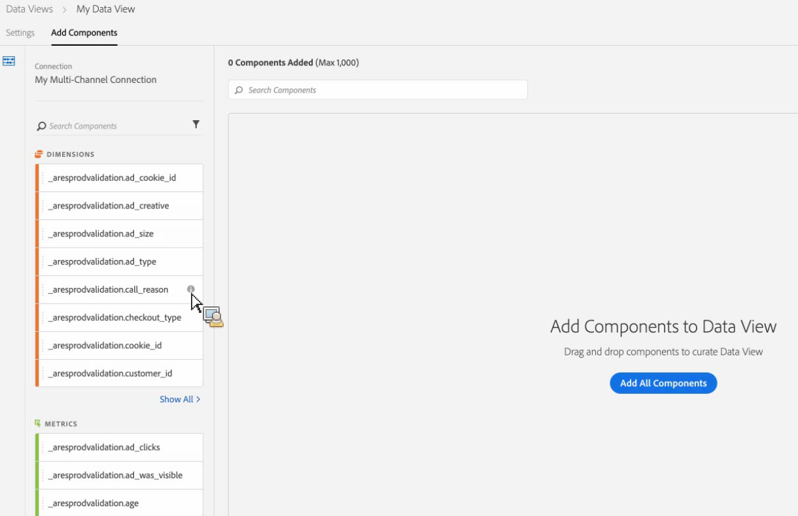
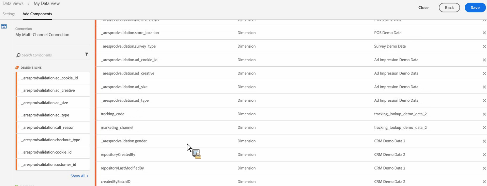

# Creación de una vista de datos

Una vista de datos es similar a un grupo de informes virtuales en Analytics, en el sentido de que es una vista &quot;filtrada&quot; de los datos. Puede crear distintas vistas de datos para la misma conexión, con diferentes configuraciones para el tiempo de espera de visita, la atribución, etc. Puede crear varias vistas de datos para un único conjunto de datos. Por ejemplo, puede tener una vista de datos en la que todas las dimensiones estén configuradas como &quot;Último contacto&quot; y, simultáneamente, otra vista de datos (basada en el mismo conjunto de datos) con todas las dimensiones definidas como &quot;Primer contacto&quot;.

Los proyectos de Workspace en Customer Journey Analytics se basan en vistas de datos.

Haga clic [aquí](https://docs.adobe.com/content/help/en/platform-learn/tutorials/cja/basic-configuration-for-data-views.html) para ver un vídeo de información general.

## Requisitos previos

Para poder crear vistas de datos, debe [configurar una o más conexiones a conjuntos de datos de Experience Platform](/help/connections/create-connection.md).

## Ajustar configuración

1. En Customer Journey Analytics, vaya a la ficha **[!UICONTROL Vistas de datos]**.

1. Haga clic en **[!UICONTROL Añadir]** para agregar una vista de datos y ajustar su configuración.

   | Configuración de sesión | Definición |
   |---|---|
   | Conexión | Este campo vincula la vista de datos con la conexión que ha establecido anteriormente, que tiene los conjuntos de datos de [!UICONTROL Experience Platform]. |
   | Nombre | Es obligatorio asignar un nombre a la vista de datos. |
   | Descripción | Una descripción detallada no es obligatoria, pero se recomienda. |
   | Añadir etiquetas | Las etiquetas permiten organizar las vistas de datos en categorías. |
   | Zona horaria | Elija el huso horario de la vista de datos. |
   | Tiempo de espera de la sesión | Seleccione su definición de &quot;sesión&quot;. El tiempo de espera de sesión es la cantidad de inactividad que un visitante único debe presentar antes de que una sesión se inicie automáticamente. El valor predeterminado es de 30 minutos. Por ejemplo, si establece el tiempo de espera de sesión en 45 minutos, se crea un nuevo grupo de sesión por cada secuencia de visitas obtenida diferente de la anterior por al menos 45 minutos de inactividad. <!--This setting impacts not only your visit counts, but also how visit segment containers are evaluated, and the visit expiration logic for any eVars expiring on visit. Decreasing the session timeout will likely increase the total number of visits in your reporting, while increasing the visit timeout will likely decrease the total number of visits in your reporting. This needs to be reviewed.--> |
   | Iniciar nueva sesión con un evento | Una nueva sesión se inicia cuando se activa un evento, independientemente de si se ha superado o no el tiempo de espera de la sesión. La sesión recién creada incluye el evento que la ha iniciado. Además, es posible utilizar varios eventos para iniciar una sesión, y se activa una nueva si se observa cualquiera de esos eventos en los datos. Este ajuste afecta al recuento de visitas, al contenedor de segmento (antes conocido como Visita) y a la lógica de caducidad de las visitas en las dimensiones. |
   | Añadir filtros | &quot;Filtros&quot; es el término para &quot;segmentos&quot; en Customer Journey Analytics. Si desea filtrar los datos, arrastre el filtro correspondiente hasta aquí desde el carril izquierdo. Si no selecciona ningún filtro, la vista de datos tendrá todos los datos. |

1. Haga clic en **[!UICONTROL Continuar]**.

## Añadir componentes

1. Ahora es el momento de agregar componentes (dimensiones, métricas) a la vista de datos (similar a la experiencia de depuración en grupos de informes virtuales). Tenga en cuenta que cada uno de los campos de los conjuntos de datos ahora se traduce en dimensiones o métricas. Arrastre dimensiones y métricas al panel o haga clic en **[!UICONTROL Seleccionar todo]** para añadir todos los componentes.

   

1. Haga clic en la ficha **[!UICONTROL Añadir componentes]** para agregar dimensiones y métricas a la vista de datos.

   

1. (Opcional) Puede cambiar el nombre de un componente por un nombre descriptivo o cambiar su configuración de atribución seleccionándolo y editando su configuración. Tenga en cuenta que se conserva el nombre subyacente. Para obtener más información, consulte [Configuración de vistas de datos y atribución](/help/data-views/configure-dataviews.md).

1. Los siguientes pasos son para [especificar la configuración](/help/data-views/configure-dataviews.md) de componentes y atribuciones.