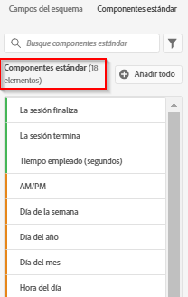

# Creación de una nueva vista de datos

La creación de una vista de datos implica crear métricas y dimensiones a partir de elementos de esquema o utilizar componentes estándares. La creación de métricas o dimensiones le proporciona una gran flexibilidad. Anteriormente, se suponía que si tenía conjuntos de datos en Adobe Experience Platform, los campos de cadena se utilizaban como dimensiones y los campos numéricos como métricas. Para cambiar cualquiera de estos campos, tenía que editar el esquema en Platform. La IU de vistas de datos ahora permite [mayor libertad de definición de métricas y dimensiones](/help/data-views/data-views.md). Para ver más casos de uso, consulte [Casos de uso de vistas de datos](/help/data-views/data-views-usecases.md).

## 1. Configuración de los contenedores y los ajustes de las vistas de datos

1. En Customer Journey Analytics, vaya a la ficha **[!UICONTROL Vistas de datos]**.
2. Haga clic en **[!UICONTROL Agregar]** para crear una vista de datos y ajustar su configuración.

| Configuración | Descripción/caso de uso |
| --- | --- |
| [!UICONTROL Conexión] | Este campo vincula la vista de datos con la conexión establecida anteriormente, que tiene uno o varios conjuntos de datos de Adobe Experience Platform. |
| [!UICONTROL Nombre] | Es obligatorio asignar un nombre a la vista de datos. |
| [!UICONTROL Descripción] | No es obligatorio proporcionar descripción detallada, pero se recomienda. |
| [!UICONTROL Zona horaria] | Elija en qué zona horaria desea que se presenten los datos. |
| [!UICONTROL Etiquetas] | Las etiquetas permiten organizar las vistas de datos en categorías. |
| [!UICONTROL Contenedores] | Puede cambiar el nombre de los contenedores aquí y así es como aparecerán en cualquier proyecto de Workspace basado en dicha vista de datos. Los contenedores se utilizan en filtros y visitas en orden previsto/flujo, etc. para definir la amplitud o el alcance del contexto. [Más información](https://experienceleague.adobe.com/docs/analytics-platform/using/cja-components/cja-filters/filters-overview.html?lang=es#filter-containers) |
| [!UICONTROL El nombre del contenedor de persona es...] | [!UICONTROL Persona] (valor predeterminado). El contenedor [!UICONTROL Persona] incluye todas las visitas y vistas de página de los visitantes en un lapso de tiempo específico. Puede cambiarle el nombre a &quot;Usuario&quot; o a cualquier otro término que prefiera. |
| [!UICONTROL El nombre del contenedor de sesión es...] | [!UICONTROL Sesión] (valor predeterminado). El contenedor [!UICONTROL Sesión] le permite identificar interacciones de páginas, campañas o conversiones para una sesión específica. Puede cambiarle el nombre a &quot;Visita&quot; o a cualquier otro término que prefiera. |
| [!UICONTROL El nombre del contenedor de eventos es...] | [!UICONTROL Evento] (valor predeterminado). El contenedor [!UICONTROL Evento] define qué eventos de página desea incluir o excluir de un filtro. |

A continuación, puede crear métricas y dimensiones a partir de elementos de esquema. También puede utilizar componentes estándares.

## 2. Creación de métricas y dimensiones a partir de elementos de esquema

1. En [!UICONTROL Customer Journey Analytics] > [!UICONTROL Vistas de datos], haga clic en la pestaña [!UICONTROL Componentes].

Puede ver la [!UICONTROL Conexión] en la parte superior izquierda, que contiene los conjuntos de datos, y sus [!UICONTROL Campos de esquema] a continuación. Tenga en cuenta que:

* Los componentes ya incluidos son los componentes estándar necesarios (generados por el sistema).
* También aplicamos el filtro **[!UICONTROL Contiene datos]** de forma predeterminada, de modo que solo aparecen los campos de esquema que contienen datos. Si está buscando un campo que no contenga datos, simplemente quite el filtro.

1. A continuación, arrastre un campo de esquema, como [!UICONTROL pageTitle], desde el carril izquierdo a la sección Métricas o Dimensión.

   Puede arrastrar el mismo campo de esquema a las secciones de dimensiones o métricas varias veces y configurar la misma dimensión o métrica de diferentes maneras.
Por ejemplo, desde el campo **[!UICONTROL pageTitle]** puede crear una dimensión llamada “Páginas de producto” y otra “Páginas de error”, etc., cambiando el nombre del **[!UICONTROL Nombre del componente]** a la derecha. En el campo **[!UICONTROL pageTitle]**, también puede crear métricas a partir de un valor de cadena. Por ejemplo, puede crear una o más métricas **[!UICONTROL Pedidos]** con diferentes configuraciones de atribución y diferentes valores de inclusión/exclusión.

   

   >[!NOTE]
   >
   >Puede arrastrar carpetas de campo de esquema completas desde el carril izquierdo y se ordenarán automáticamente en secciones tradicionales. Los campos de cadena terminarán en la sección [!UICONTROL Dimensiones] y los números en la sección [!UICONTROL Métricas]. O bien, puede hacer clic en **[!UICONTROL Añadir todo]** y se agregarán todos los campos de esquema.

1. Una vez que seleccione el componente, verá una serie de configuraciones a la derecha. Configure el componente mediante las configuraciones que se describen a continuación.

### Ajuste de la configuración de componentes

| Configuración | Descripción/caso de uso |
| --- | --- |
| [!UICONTROL Tipo de componente] | Requerido. Permite cambiar un componente de Métrica a Dimension o viceversa. |
| [!UICONTROL Nombre del componente] | Requerido. Permite especificar el nombre descriptivo que aparecerá en Analysis Workspace. Puede cambiar el nombre de un componente para asignarle un nombre específico para la vista de datos. |
| [!UICONTROL Descripción] | Opcional, pero recomendada, para proporcionar información sobre el componente a otros usuarios. |
| [!UICONTROL Etiquetas] | Opcional. Le permite etiquetar el componente con etiquetas personalizadas o listas para usar para facilitar la búsqueda y el filtrado en la IU de Analysis Workspace. |
| [!UICONTROL Nombre del campo] | Nombre del campo de esquema. |
| [!UICONTROL Tipo de conjunto de datos] | Requerido. Campo no editable que muestra el tipo de conjunto de datos (evento, búsqueda o perfil) del que procede el componente. |
| [!UICONTROL Conjunto de datos] | Requerido. Campo no editable que muestra el tipo de campo del que procede el componente (por ejemplo, cadena, entero, etc.). Este campo puede contener varios conjuntos de datos. |
| [!UICONTROL Tipo de datos del esquema] | Se refiere a si el componente es una cadena, un número entero, etc. |
| [!UICONTROL ID de componente] | Requerido. La [API de CJA](https://adobe.io/cja-apis/docs) utiliza este campo para hacer referencia al componente. Puede hacer clic en el icono de edición y modificar este ID de componente. Sin embargo, al cambiar este ID de componente, se rompen todos los proyectos existentes de Workspace que contienen este componente. Si alguna vez crea otra vista de datos que utiliza un campo diferente para una dimensión pageTitle, puede cambiarle el nombre y hacer compatible la vista de datos cruzados de dimensión. |
| [!UICONTROL Ruta del esquema] | Requerido. Campo no editable que muestra la ruta de esquema de la que procede el componente. |
| [!UICONTROL Ocultar componente en creación de informes] | Predeterminado = desactivado. Permite depurar el componente fuera de la vista de datos cuando se utiliza en la creación de informes. Esto no afecta a los permisos, solo a la depuración de componentes. En otras palabras, puede ocultar el componente de los usuarios que no sean administradores en la creación de informes. Los administradores aún pueden acceder a él haciendo clic en [!UICONTROL Mostrar todos los componentes] en un proyecto de Analysis Workspace. |

### Ajuste de la configuración de formato

La configuración de formato solo es para métricas.

| Configuración | Descripción/caso de uso |
| --- | --- |
| [!UICONTROL Formato] | Permite especificar el formato de una métrica, como Decimal, Hora, Porcentaje o Moneda. |
| [!UICONTROL Lugares decimales] | Permite especificar el número de decimales que debe mostrar una métrica. |
| [!UICONTROL Mostrar tend. ascendente como] | Permite especificar si una tendencia al alza en esta métrica debe considerarse buena (verde) o mala (rojo). |
| [!UICONTROL Moneda] | Esta configuración solo aparece si el formato de métrica seleccionado es [!UICONTROL Moneda]. Hay disponible una lista de opciones de moneda. El valor predeterminado es ninguna moneda. Esto le permite representar los ingresos en la moneda que elija en la creación de informes. No se trata de una conversión de moneda, sino de una opción de formato de IU. |

### Ajuste de la configuración de la atribución

| Configuración | Descripción/caso de uso |
| --- | --- |
| [!UICONTROL Establecer atribución] | Permite especificar la configuración de atribución que desea aplicar a esta métrica de forma predeterminada cuando se utiliza. Este valor predeterminado se puede sobrescribir en una tabla improvisada o en una métrica calculada. |
| [!UICONTROL Modelo de atribución] | Permite especificar un modelo de atribución predeterminado: solo activo cuando se activa la configuración [!UICONTROL Usar modelo de atribución no predeterminado]. El valor predeterminado es [!UICONTROL Último toque]. Las opciones son: Último toque, Primer toque, Lineal, Participación, Mismo toque, Forma de U, Curva J, J Inversa, Deterioro de tiempo, Personalizado, Algorítmico. Algunas de estas opciones crean campos adicionales que es necesario rellenar, como Personalizado o Deterioro de tiempo. Puede crear varias métricas utilizando el mismo campo: esto significa que puede tener una métrica de ingresos [!UICONTROL Último toque] y una métrica de ingresos [!UICONTROL Primer toque], pero en función del mismo campo de ingresos del esquema. |
| [!UICONTROL Ventana retroactiva] | Permite especificar una ventana retrospectiva predeterminada para una métrica; solo está activa cuando activa la configuración [!UICONTROL Usar modelo de atribución no predeterminado]. Las opciones son: Persona (ventana de informes), Sesión, Personalizado. Cuando se selecciona Personalizado, también se le da la opción de seleccionar cualquier número de días/semanas/meses/etc. (hasta 90 días), igual que Attribution IQ. Puede tener varias métricas utilizando el mismo campo de esquema, pero cada una con una ventana retrospectiva independiente. |

### Ajuste de la configuración de los valores de inclusión/exclusión

Esta configuración le permite modificar los datos subyacentes sobre los que realiza informes en el momento de la consulta. No es lo mismo que un filtro. Pero los filtros respetarán esta nueva dimensión, al igual que las rutas y la atribución.

Por ejemplo, puede crear una dimensión fuera del campo pageTitle, pero llamarla &quot;páginas de error&quot; e incluir cualquier página que [!UICONTROL contenga la frase] &quot;error&quot;.

| Configuración | Descripción/caso de uso |
| --- | --- |
| [!UICONTROL Con distinción de mayúsculas y minúsculas] | Predeterminado = Activado. Esta configuración solo se aplica a la sección [!UICONTROL Incluir/Excluir valores]. Le permite decir si la regla de inclusión/exclusión que está aplicando debe contar con distinción de mayúsculas y minúsculas. |
| [!UICONTROL Coincidencias] | Le permite especificar qué valores desea tener en cuenta para la creación de informes antes de la atribución y filtros (por ejemplo, usar solo valores que contengan la frase “error”). Puede especificar: **[!UICONTROL Si se cumplen todos los criterios]** o **[!UICONTROL Si se cumplen los criterios]**. |
| [!UICONTROL Criterios] | Permite especificar la lógica de coincidencia que debe aplicarse a una regla de filtro específica.<ul><li>**Cadena**: Contiene la frase, Contiene cualquier término, Contiene todos los términos, No contiene ningún término, No contiene la frase, Es igual a, No es igual a, Comienza con, Finaliza con</li><li>**Doble/entero**: igual, no igual, es mayor que, es menor que, es mayor o igual que, es menor o igual que</li><li>**Fecha**: igual, no igual, es posterior a, es anterior, ocurre en</li></ul> |
| [!UICONTROL Operando de coincidencia] | Permite especificar el operando de coincidencia al que se debe aplicar el operador de coincidencia.<ul><li>**Cadena**: Campo de texto</li><li>**Doble/entero**: Campo de texto con flechas arriba/abajo para valores numéricos</li><li>**Fecha**: Selector de granularidad de día (calendario)</li><li>**Fecha y hora**: Selector de granularidad de fecha y hora</li></ul> |
| [!UICONTROL Añadir regla] | Permite especificar un operador de coincidencia y un operador adicionales. |

### Ajuste de la configuración de comportamiento

| Configuración | Descripción/caso de uso |
| --- | --- |
| [!UICONTROL Contar valores] | Solo para métricas booleanas, esta configuración le permite especificar si desea [!UICONTROL Contar verdadero], [!UICONTROL Contar falso] o [!UICONTROL Contar verdadero o falso] como valor de métrica. El valor predeterminado es [!UICONTROL Count True]. |
| [!UICONTROL Contar instancias] | Permite especificar si un campo numérico o de tipo de fecha utilizado como métrica debe contar las veces que se estableció en lugar del valor en sí.  Si desea añadir las instancias de un campo numérico y desea simplemente añadir el número de veces que un campo se *estableció* en lugar del valor real incluido en él. Esto resulta útil para crear una métrica de [!UICONTROL pedidos] a partir de un campo de [!UICONTROL ingresos], por ejemplo. Si se establecieron ingresos, entonces queremos contar 1 pedido único en lugar de la cantidad de ingresos numérica. |

### Ajuste de la configuración de las [!UICONTROL Opciones sin valor]

[!UICONTROL La configuración de las Opciones sin valor] son análogas a los valores [!UICONTROL sin especificar] o [!UICONTROL ninguno] en la creación de informes. En la IU de vistas de datos, componente por componente, puede decidir cómo desea que se traten estos valores en la creación de informes. También puede cambiar el nombre de [!UICONTROL Ningún valor] por otro que se adapte mejor a su entorno, como [!UICONTROL Nulo], [!UICONTROL No se ha fijado] u otros.

Tenga en cuenta también que, independientemente de lo que especifique en este campo, se puede usar para el tratamiento especial por parte de la IU del elemento de línea [!UICONTROL Ningún valor] en los informes, tal como se indica en la configuración [!UICONTROL Opciones sin valor].

| Configuración | Descripción/caso de uso |
| --- | --- |
| [!UICONTROL Si se muestra, solicite Ningún valor...] | Aquí es donde puede cambiar el nombre de **[!UICONTROL Ningún valor]** por otro. |
| [!UICONTROL No mostrar Ningún valor de forma predeterminada] | No muestra este valor en la creación de informes. |
| [!UICONTROL Mostrar Ningún valor de forma predeterminada] | Muestra este valor en la creación de informes. |
| [!UICONTROL Tratar Ningún valor como valor] | Esta configuración reemplazará los valores en blanco de los datos con el texto especificado en [!UICONTROL Si se muestra, llame a No value...]. Por ejemplo, si tuviera los tipos de dispositivos móviles como dimensión, podría cambiar el nombre del elemento **[!UICONTROL Ningún valor]** por Escritorio. Tenga en cuenta que cuando cambie este campo a un valor personalizado, el valor personalizado se tratará como un valor de cadena legítimo. Por lo tanto, si introduce el valor &quot;Rojo&quot; en este campo, cualquier instancia de la cadena &quot;Rojo&quot; que aparezca en los datos en sí también se moverá bajo el mismo elemento de línea que haya especificado. |

### Ajuste de la configuración de la persistencia

Para obtener más información, consulte el tema sobre [Persistencia](/help/data-views/persistence.md).

| Configuración | Descripción/caso de uso |
| --- | --- |
| [!UICONTROL Establecer persistencia] | Tecla de alternancia |
| [!UICONTROL Asignación] | Permite especificar el modelo de asignación utilizado en una dimensión para la persistencia. Las opciones son: [!UICONTROL Más reciente], [!UICONTROL Original], [!UICONTROL Instancia], [!UICONTROL Todos]. Si desea que un valor persista (similar a eVars en la versión tradicional de Analytics), aquí es donde lo configuraría. La única diferencia clave es que la persistencia máxima que puede establecer es de 90 días. Además, [!UICONTROL No caducar] no es una opción. |
| [!UICONTROL Caducidad] | Permite especificar la ventana de persistencia para una dimensión. Las opciones son: [!UICONTROL Sesión] (predeterminada), [!UICONTROL Persona], [!UICONTROL Tiempo], [!UICONTROL Métrica]. Es posible que deba poder caducar la dimensión de una compra (por ejemplo, términos de búsqueda internos u otros casos de uso de comercialización). [!UICONTROL Métricas] le permite especificar cualquiera de las métricas definidas como la caducidad de esta dimensión (por ejemplo, una métrica de [!UICONTROL compra]). **Nota**: No se puede establecer una caducidad personalizada para una dimensión al seleccionar una asignación de  [!UICONTROL Todos]. |

### Ajuste de la configuración de agrupamiento de valores

Por ejemplo, un bloque de &quot;entre 5 y 10&quot; aparecerá como un elemento de línea de &quot;5 a 10&quot; en la creación de informes de Workspace.

| Configuración | Descripción/caso de uso |
| --- | --- |
| [!UICONTROL Valor del cubo] | Permite crear una versión agrupada de una dimensión numérica. Esto permite informar sobre bloques de ingresos u otros valores numéricos como dimensión en la creación de informes. |
| [!UICONTROL Hasta] | Permite especificar los límites del primer bloque de dimensiones numéricas. Esto solo se aplica a las dimensiones numéricas. |
| [!UICONTROL Entre y hasta] | Permite especificar los límites de los contenedores de dimensiones numéricas subsiguientes. |
| [!UICONTROL Añadir cubo] | Permite añadir otro bloque a la agrupación de dimensiones numéricas. |

### Uso de [!UICONTROL componentes estándares]

Además de crear métricas y dimensiones a partir de elementos de esquema, también puede usar componentes estándares en las vistas de datos.

Los [!UICONTROL Componentes estándares] son componentes que no se generan a partir de los campos de esquema del conjunto de datos, sino que se generan en el sistema. Algunos componentes del sistema son necesarios en cualquier vista de datos para facilitar las funciones de generación de informes en Analysis Workspace, mientras que otros componentes del sistema son opcionales.

De forma predeterminada, estos componentes estándares necesarios se añaden a cada vista de datos.

| Nombre del componente | Dimensión o métrica | Notas |
| --- | --- | --- |
| [!UICONTROL Personas] | Métrica | Esta métrica se basa en el ID de persona especificado en una [!UICONTROL Conexión]. |
| [!UICONTROL Sesiones] | Métrica | Esta métrica se basa en la configuración de creación de sesiones que se especifica a continuación. |
| [!UICONTROL Eventos] | Métrica | Esta métrica representa el número de filas de todos los conjuntos de datos de evento de una [!UICONTROL Conexión]. |
| [!UICONTROL Día] | Dimensión | La dimensión “Día” indica el día en el que se produjo una métrica determinada. El primer elemento de dimensión es el primer día del intervalo de fechas y el último elemento de dimensión es el último día del intervalo de fechas. |
| [!UICONTROL Semana] | Dimensión | La dimensión “Semana” indica la semana en que se produjo una métrica determinada. El primer elemento de dimensión es la primera semana del intervalo de fechas y el último elemento de dimensión es la última semana del intervalo de fechas. |
| [!UICONTROL Mes] | Dimensión | La dimensión “Mes” indica el día en el que se produjo una métrica determinada. El primer elemento de dimensión es el primer mes del intervalo de fechas y el último elemento de dimensión es el último mes del intervalo de fechas. |
| [!UICONTROL Trimestre] | Dimensión | La dimensión “Trimestre” indica el trimestre en el que se produjo una métrica determinada. El primer elemento de dimensión es el primer trimestre del intervalo de fechas y el último elemento de dimensión es el último trimestre del intervalo de fechas. |
| [!UICONTROL Año] | Dimensión | La dimensión “Año” informa el año en que se produjo una métrica determinada. El primer elemento de dimensión es el primer año del intervalo de fechas y el último elemento de dimensión es el año más reciente del intervalo de fechas. |
| [!UICONTROL Hora] | Dimensión | La dimensión “Hora” indica la hora en la que se produjo una métrica determinada (redondeada hacia abajo). El primer elemento de dimensión es la primera hora del intervalo de fechas y el último elemento de dimensión es la última hora del intervalo de fechas. |
| [!UICONTROL Minuto] | Dimensión | La dimensión “Minuto” indica el minuto en el que se produjo una métrica determinada (redondeada hacia abajo). El primer elemento de dimensión es el primer minuto del intervalo de fechas y el último elemento de dimensión es el último minuto del intervalo de fechas. |

### Componentes estándares opcionales

Los componentes estándar opcionales están disponibles en la pestaña **[!UICONTROL Componentes estándares]**.

| Nombre del componente | Dimensión o métrica | Notas |
| --- | --- | --- |
| [!UICONTROL La sesión finaliza] | Métrica | Esta métrica cuenta el número de eventos que fueron el primer evento de una sesión. Cuando se utiliza en una definición de filtro (por ejemplo, [!UICONTROL La sesión inicia] existe), se filtra hasta el primer evento de cada sesión. |
| [!UICONTROL La sesión termina] | Métrica | Esta métrica cuenta el número de eventos que fueron el último evento de una sesión. De forma similar a [!UICONTROL Inicio de sesión], también se puede utilizar en una definición de filtro para filtrar cosas hasta el último evento de cada sesión. |
| [!UICONTROL Tiempo empleado (segundos)] | Métrica | La métrica [!UICONTROL Tiempo empleado] suma el tiempo entre dos valores diferentes para una dimensión. |
| [!UICONTROL Tiempo empleado por evento] | Dimensión | [!UICONTROL Tiempo empleado por evento] agrupa la métrica [!UICONTROL Tiempo empleado] en bloques de [!UICONTROL Eventos]. |
| [!UICONTROL Tiempo empleado por sesión] | Dimensión | [!UICONTROL Tiempo empleado por sesión] agrupa la métrica [!UICONTROL Tiempo empleado] en bloques de [!UICONTROL Sesiones]. |
| [!UICONTROL Tiempo empleado por persona] | Dimensión | [!UICONTROL Tiempo empleado por persona] agrupa la métrica [!UICONTROL Tiempo empleado] en bloques de [!UICONTROL Personas]. |
| [!UICONTROL ID de lote] | Dimensión | Representa el lote de Experience Platform del que formaba parte un [!UICONTROL Evento]. |
| [!UICONTROL ID de conjunto de datos] | Dimensión | Representa el conjunto de datos del Experience Platform del que formaba parte un [!UICONTROL Evento]. |

### Filtrar campos y dimensiones/métricas de esquema

Puede filtrar los campos de esquema en el carril izquierdo según los siguientes tipos de datos:

También puede filtrar por conjuntos de datos y por si un campo de esquema contiene datos o si es una identidad. De forma predeterminada, se aplica el filtro **[!UICONTROL Contiene datos]** a todas las vistas de datos.

## 3. Añadir un filtro global a la vista de datos

Puede añadir filtros que se apliquen a toda la vista de datos. Este filtro se aplicará a cualquier informe que ejecute en Workspace.

1. Haga clic en la pestaña [!UICONTROL Configuración] en [!UICONTROL Vistas de datos].
1. Arrastre un filtro desde la lista en el carril izquierdo al campo [!UICONTROL Añadir filtros].
