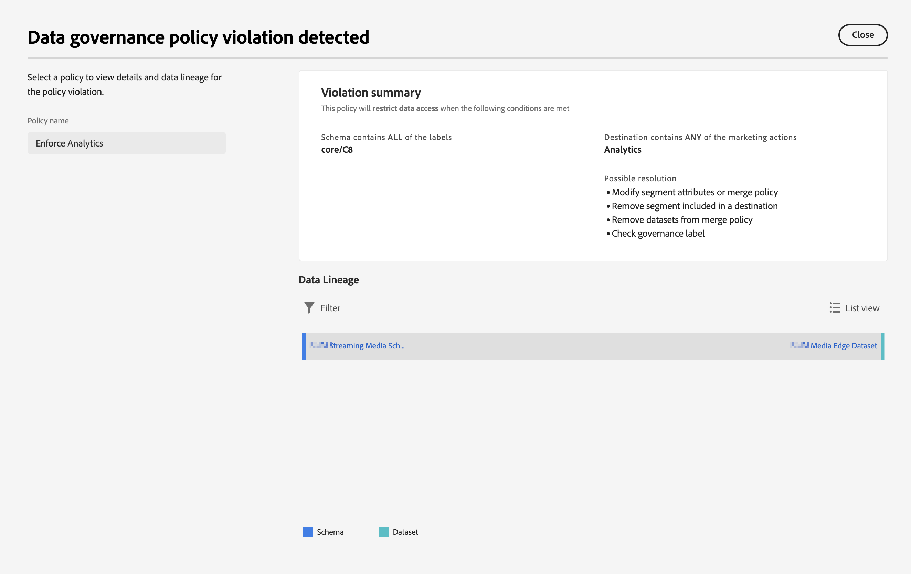

# Etiquetas y políticas

Al crear un conjunto de datos en Experience Platform, puede crear lo siguiente [etiquetas de uso de datos](https://experienceleague.adobe.com/en/docs/experience-platform/data-governance/labels/reference) para algunos o todos los elementos del conjunto de datos. Puede ver estas etiquetas y políticas en Customer Journey Analytics.

Las siguientes etiquetas son de especial interés para Customer Journey Analytics:

* La etiqueta`C8` **[!UICONTROL Sin medición]**. Esta etiqueta significa que los datos no se pueden usar para los análisis en los sitios web o las aplicaciones de su organización.

* El `C12` label - **[!UICONTROL No hay exportación de datos generales]**. Los campos de esquema etiquetados de esta manera no se pueden exportar ni descargar de Customer Journey Analytics (a través de la creación de informes, exportación, API, etc.)

>[!NOTE]
>
>Las etiquetas del uso de datos no se propagan automáticamente a los conjuntos de datos vinculados. Sin embargo, se pueden añadir manualmente.

El etiquetado, en sí, no significa que se apliquen estas etiquetas de uso de datos. Para eso sirven las políticas. Puede crear las directivas utilizando el [IU de Experience Platform](https://experienceleague.adobe.com/en/docs/experience-platform/data-governance/policies/user-guide) o a través de [API del servicio de directivas](https://experienceleague.adobe.com/en/docs/experience-platform/data-governance/api/overview) en Experience Platform.

En Customer Journey Analytics aparecen dos políticas definidas por Adobe que afectan a la creación de informes y a la descarga o al uso compartido:

* **[!UICONTROL Aplicación de la política de Analytics]**
* **[!UICONTROL Aplicación de la política de descarga]**

## Visualización de etiquetas de datos en las vistas de datos de Customer Journey Analytics

Las etiquetas de datos que usted u otros usuarios hayan creado en Experience Platform se muestran en tres ubicaciones de la interfaz de usuario de las vistas de datos:

| Ubicación | Descripción |
| --- | --- |
| Botón Información de un campo de esquema | Al hacer clic en este botón, se indica qué [!UICONTROL Etiquetas de uso de datos] se aplican en ese monento a un campo:
 |
| Carril derecho bajo [Configuración de componentes](/help/data-views/component-settings/overview.md) | Cualquier [!UICONTROL Etiqueta de uso de datos] se enumera aquí:
 |
| Adición de etiquetas de datos como una columna | Puede añadir [!UICONTROL Etiquetas de uso de datos] como una columna a los [!UICONTROL Componentes incluidos] en vistas de datos. Haga clic en el icono del selector de columnas y seleccione **[!UICONTROL Etiquetas de uso de datos]**:
 |

{style="table-layout:auto"}

## Filtro en las etiquetas de Gobernanza de datos en las vistas de datos

En el editor de vistas de datos, haga clic en el icono [!UICONTROL Filtro] del carril izquierdo y filtre los componentes de vistas de datos por **[!UICONTROL Gobernanza de datos]** y tipo de **[!UICONTROL Etiqueta]**:

Haga clic en **[!UICONTROL Aplicar]** para ver qué componentes tienen etiquetas adjuntas.

## Filtro en políticas de Gobernanza de datos en vistas de datos

Puede comprobar si una directiva (por ejemplo, una denominada Aplicar Analytics) está activada y si dicha directiva bloquea el uso de ciertos elementos de vista de datos de Customer Journey Analytics para Analytics.

De nuevo, haga clic en el icono [!UICONTROL filtro] en el carril izquierdo y, debajo de **[!UICONTROL Gobernanza de datos]**, en **[!UICONTROL Políticas]**:

Clic **[!UICONTROL Aplicar]** para ver qué directivas están habilitadas.

## Cómo afectan las políticas habilitadas a las vistas de datos

Si la política **[!UICONTROL Aplicar Analytics]** está activada, los componentes de esquema que tienen determinadas etiquetas de datos (como C8) asociadas a ellas no se pueden añadir a las vistas de datos.

Estos componentes aparecen atenuados en el carril izquierdo [!UICONTROL Campos de esquema] lista:

Tampoco puede guardar una vista de datos que tenga campos bloqueados.

Tenga cuidado al intentar aplicar etiquetas de acceso y de control de datos en campos o grupos de campos en Experience Platform para los que ya tiene componentes definidos en la vista de datos. Puede ver este cuadro de diálogo.

Primero debe resolver la infracción (por ejemplo, quitar los componentes de la vista de datos).

>[!MORELIKETHIS]
>
>[Descarga de datos confidenciales](/help/analysis-workspace/export/download-send.md)

>[!MORELIKETHIS]
>
>[¿Qué son las etiquetas restringidas en Report Builder?](https://experienceleague.adobe.com/en/docs/analytics-platform/using/cja-reportbuilder/restricted-labels)

