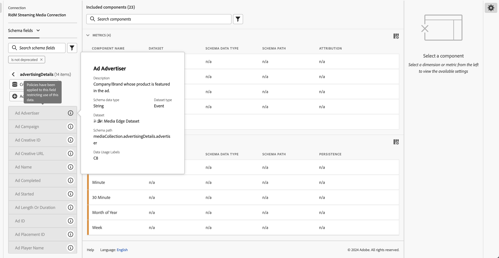

# Etiquetas y políticas

>[!NOTE]
>
>Actualmente, esta funcionalidad está en [prueba limitada](/help/release-notes/releases.md).

Al crear un conjunto de datos en Experience Platform, puede crear [etiquetas de uso de datos](https://experienceleague.adobe.com/docs/experience-platform/data-governance/labels/reference.html?lang=en) para algunos o todos los elementos del conjunto de datos. Hasta ahora, estas etiquetas no estaban expuestas en CJA. Con esta versión, puede ver estas etiquetas y directivas en CJA.

De especial interés para CJA son estas etiquetas:

* La variable `C8` label - **[!UICONTROL Sin medición]**. Esta etiqueta significa que los datos no se pueden usar para análisis en los sitios web o las aplicaciones de su organización.

* La variable `C12` label - **[!UICONTROL Sin exportación de datos general]**. Los campos de esquema etiquetados de esta manera no se pueden exportar ni descargar desde CJA (a través de informes, exportación, API, etc.)

El etiquetado en sí mismo no significa que se apliquen estas etiquetas de uso de datos. Para eso se utilizan las políticas. Las políticas se crean mediante la variable [API del servicio de directivas](https://experienceleague.adobe.com/docs/experience-platform/data-governance/api/overview.html?lang=en) en Experience Platform.

En CJA aparecen dos políticas definidas por Adobe que afectan a los informes y a la descarga/uso compartido:

* **[!UICONTROL Aplicar Analytics]** directiva
* **[!UICONTROL Aplicar descarga]** directiva

## Ver etiquetas de datos en vistas de datos de CJA

Las etiquetas de datos que se crearon en el Experience Platform se muestran en tres ubicaciones de la interfaz de usuario de vistas de datos:

| Ubicación | Descripción |
| --- | --- |
| Botón Información de un campo de esquema | Al hacer clic en este botón, se indica cuál [!UICONTROL Etiquetas de uso de datos] actualmente se aplica a un campo:
 |
| Carril derecho debajo [Configuración de componentes](/help/data-views/component-settings/overview.md) | Cualquiera [!UICONTROL Etiquetas de uso de datos] se enumeran aquí:
 |
| Agregar etiquetas de datos como una columna | Puede añadir [!UICONTROL Etiquetas de uso de datos] como columna para [!UICONTROL Componentes incluidos] en vistas de datos. Haga clic en el icono del selector de columnas y seleccione **[!UICONTROL Etiquetas de uso de datos]**:
 |

{style=&quot;table-layout:auto&quot;}

## Filtro en las etiquetas de Control de datos en las vistas de datos

En el editor de vistas de datos, haga clic en el icono Filtro de la pista izquierda y filtre los componentes de vistas de datos por **[!UICONTROL Administración de datos]** y tipo de **[!UICONTROL Etiqueta]**:

Haga clic en **[!UICONTROL Aplicar]** para ver qué componentes tienen etiquetas adjuntas.

## Filtrar por políticas de control de datos en vistas de datos

Puede comprobar si hay una directiva activada que bloquee el uso de ciertos elementos de vista de datos de CJA para análisis o exportación con fines específicos.

De nuevo, haga clic en el icono Filtro en el carril izquierdo y debajo de **[!UICONTROL Administración de datos]**, haga clic en **[!UICONTROL Políticas]**:

Haga clic en **[!UICONTROL Aplicar]** para ver qué directivas están habilitadas.

## Cómo afectan las políticas habilitadas a las vistas de datos

Si la variable **[!UICONTROL Aplicar Analytics]** o **[!UICONTROL Aplicar descarga]** las directivas de están activadas, los componentes de esquema que tienen determinadas etiquetas de datos (como C8 o C12) asociadas a ellas no se pueden agregar a las vistas de datos.

Estos componentes aparecen atenuados en el carril izquierdo [!UICONTROL Campos de esquema] lista:

Tampoco puede guardar una vista de datos que tenga campos bloqueados.

>[!MORELIKETHIS]
>[Descargar datos confidenciales](/help/analysis-workspace/curate-share/download-send.md)
