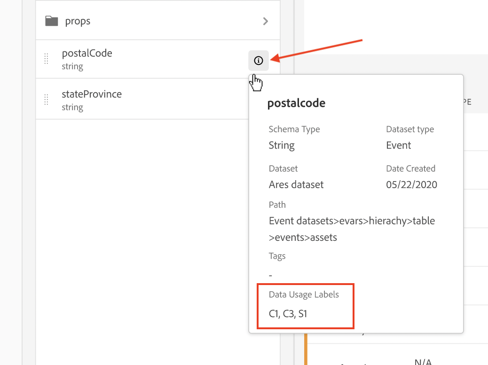
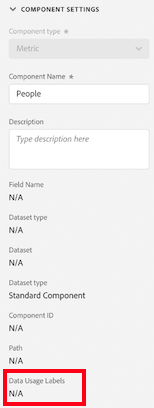
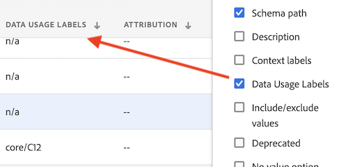
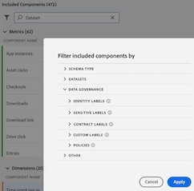
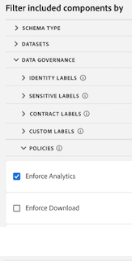
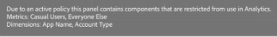

# Compatibilidad con CJA para la administración de datos de Adobe Experience Platform

>[!NOTE]
>
>Actualmente, esta funcionalidad está en [prueba limitada](/help/release-notes/releases.md).

La integración entre CJA y [Administración de datos de Adobe Experience Platform](https://experienceleague.adobe.com/docs/experience-platform/data-governance/home.html?lang=en) permite el etiquetado de datos de CJA confidenciales y la aplicación de políticas de privacidad.

Las etiquetas de privacidad y las políticas creadas en conjuntos de datos consumidos por el Experience Platform se pueden ver en el flujo de trabajo de vistas de datos de CJA. Estas etiquetas detienen o advierten a los usuarios que crean métricas y/o dimensiones a partir de campos confidenciales.

Además, cuando se exportan datos desde CJA (mediante informes, exportación, API, etc.), se añaden advertencias o etiquetas para notificar a los usuarios que un informe contiene información confidencial que debe tratarse de una manera específica.

Esta integración le permite administrar el cumplimiento de normas más fácilmente. Los administradores de datos de su organización pueden establecer políticas para restringir el uso. Como resultado, los usuarios de CJA pueden usar los datos con mayor seguridad, sabiendo que cumplen con las políticas definidas por los administradores de datos.

## Etiquetado y políticas en Adobe Experience Platform

Al crear un conjunto de datos en Experience Platform, puede crear [etiquetas de uso de datos](https://experienceleague.adobe.com/docs/experience-platform/data-governance/labels/reference.html?lang=en) para algunos o todos los elementos del conjunto de datos. Hasta ahora, estas etiquetas no estaban expuestas en CJA. Con esta versión, puede ver estas etiquetas en CJA. De especial interés para CJA son estas etiquetas:

* La variable `C8` label - **[!UICONTROL Sin medición]**. Esta etiqueta significa que los datos no se pueden usar para análisis en los sitios web o las aplicaciones de su organización.

* La variable `C12` label - **[!UICONTROL Sin exportación de datos general]**. Los campos de esquema etiquetados de esta manera no se pueden exportar ni descargar desde CJA (a través de informes, exportación, API, etc.)

El etiquetado en sí mismo no significa que se apliquen estas etiquetas de uso de datos. Para eso se utilizan las políticas. Las políticas se crean mediante la variable [API del servicio de directivas](https://experienceleague.adobe.com/docs/experience-platform/data-governance/api/overview.html?lang=en) en Experience Platform.

Las políticas tienen dos componentes: la etiqueta de datos y una acción de marketing que los consumidores de datos pueden realizar en el contexto de las políticas de uso restringido de datos. En el contexto de CJA, dos Adobes definidos [acciones de marketing](https://experienceleague.adobe.com/docs/experience-platform/data-governance/policies/overview.html?lang=en#appendix) son importantes:

* Analytics: uso de datos con fines analíticos, como medición, análisis e informes sobre el uso que hacen los consumidores de las aplicaciones o los sitios de su organización.

* Exportación de datos, es decir, fuera del entorno de Adobe.

Asocia etiquetas y acciones de marketing con una directiva y, a continuación, activa la directiva. La política toma la etiqueta y la acción de marketing y dice: aplique esta restricción. En CJA aparecen dos políticas definidas por Adobe que afectan a los informes y a la descarga/uso compartido:

* [!UICONTROL Aplicar Analytics] directiva
* [!UICONTROL Aplicar descarga] directiva

### Ver etiquetas de datos en vistas de datos de CJA

Las etiquetas de datos que se crearon en el Experience Platform se muestran en tres ubicaciones de la interfaz de usuario de vistas de datos:

| Ubicación | Descripción |
| --- | --- |
| Botón Información de un campo de esquema | Al hacer clic en este botón, se indica qué etiquetas de uso de datos se aplican actualmente a un campo:
 |
| Carril derecho debajo [Configuración de componentes](/help/data-views/component-settings/overview.md) | Todas las etiquetas de uso de datos se enumeran aquí:
 |
| Agregar etiquetas de datos como una columna | Puede agregar Etiquetas de datos como una columna a las columnas Componentes incluidos en las vistas de datos. Haga clic en el icono del selector de columnas y seleccione Etiquetas de uso de datos:
 |

### Filtro en las etiquetas de Control de datos en las vistas de datos

En el editor de vistas de datos, haga clic en el icono Filtro en la pista izquierda y filtre los componentes de vistas de datos por etiquetas de control de datos:

Haga clic en **[!UICONTROL Aplicar]** para ver qué componentes tienen etiquetas adjuntas.

### Filtrar por políticas de control de datos en vistas de datos

Puede comprobar si hay una directiva activada que bloquee el uso de ciertos elementos de vista de datos de CJA para análisis o exportación con fines específicos.

De nuevo, haga clic en el icono Filtro en el carril izquierdo y, en Administración de datos, haga clic en Directivas:

Haga clic en **[!UICONTROL Aplicar]** para ver qué directivas están habilitadas _para esta vista de datos?_

### Cómo [!UICONTROL Aplicar Analytics] la directiva afecta a los proyectos de Workspace

Si esta directiva está activada, los campos de esquema que tienen determinadas etiquetas de datos (como C8) asociadas a ellas no se pueden usar con fines de análisis dentro de CJA Workspace.

Para los informes, esto significa que

* No puede agregar estos campos a las vistas de datos y aparecen atenuados en el carril izquierdo [!UICONTROL Campos de esquema] lista.
* No se puede guardar una vista de datos que tenga campos bloqueados.

Si intenta realizar análisis de Workspace en vistas de datos que contienen elementos prohibidos para análisis, obtendrá un aviso similar al siguiente:

En componentes individuales, el mensaje sería similar a este:

### Cómo [!UICONTROL Aplicar descarga] la directiva afecta a los proyectos de Workspace

Si esta directiva está activada, cualquier exportación o descarga (como correos electrónicos o archivos pdfs compartidos) de proyectos de Workspace hash de los campos confidenciales. Puede seguir realizando análisis de estos campos en Workspace, pero si intenta enviar un correo electrónico o compartir un proyecto de otro modo, los campos bloqueados aparecerán como elementos con hash en el archivo .pdf.

Añada una captura de pantalla aquí.

### Ver etiquetas en el Report Builder

Consulte _esta sección_ para obtener más información. (enlace al documento de Christine)
