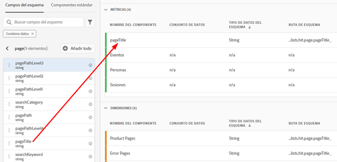
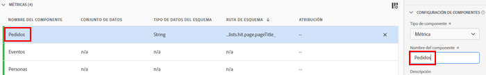
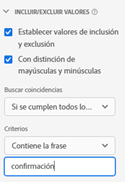
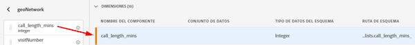
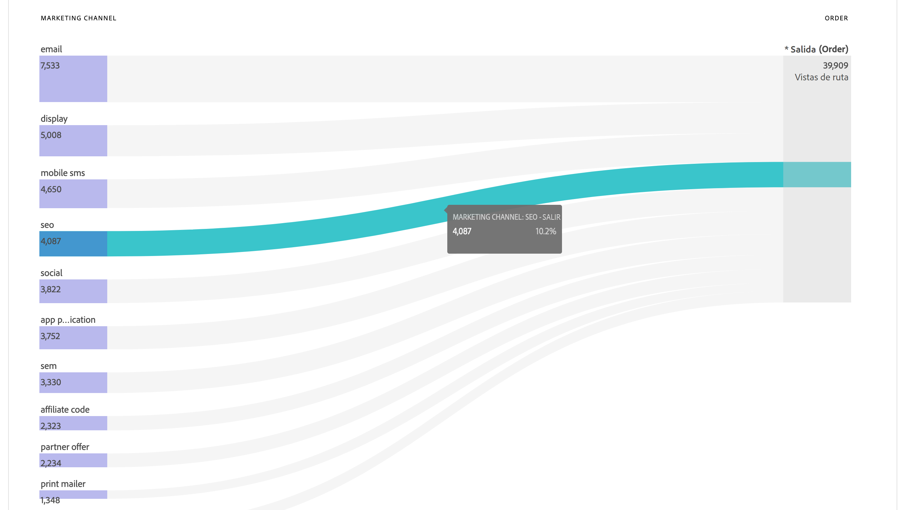
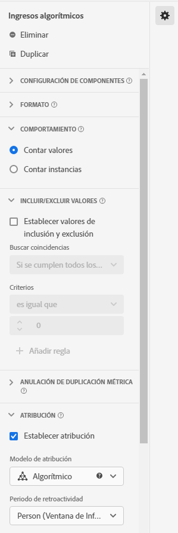

# Casos de uso de vistas de datos

Estos casos de uso muestran la flexibilidad y la potencia de las vistas de datos de Customer Journey Analytics.

## 1. Cree una métrica a partir de un campo de esquema de cadena {#string}

Por ejemplo, al crear una vista de datos, puede crear una métrica [!UICONTROL Pedidos] a partir de un campo de esquema [!UICONTROL pageTitle] que sea una cadena. A continuación se describen los pasos que debe seguir:

1. En la ficha Componentes, arrastre [!UICONTROL pageTitle] a la sección [!UICONTROL Métricas] en [!UICONTROL Componentes incluidos].
   
1. Ahora, resalte la métrica que acaba de arrastrar y cambie el nombre a [!UICONTROL Configuración de componentes] a la derecha:
   
1. Abra el cuadro de diálogo [!UICONTROL Incluir/Excluir valores] a la derecha y especifique lo siguiente:
   

   La frase &quot;confirmación&quot; indica que se trata de un pedido. Después de revisar todos los títulos de las páginas donde se cumplen esos criterios, se contará un &quot;1&quot; para cada instancia. El resultado es una nueva métrica (no una métrica calculada). Una métrica que ha incluido o excluido valores puede utilizarse en cualquier otra métrica. Funciona con Attribution IQ, filtros y en cualquier otro lugar donde se pueden usar métricas estándares.
1. Puede especificar un modelo de atribución para esta métrica, como [!UICONTROL Último toque], con un [!UICONTROL Periodo de retroactividad] de [!UICONTROL Sesión].
También puede crear otra métrica [!UICONTROL Pedidos] desde el mismo campo y especificar un modelo de atribución diferente para él, como [!UICONTROL Primer toque] y una ventana [!UICONTROL Periodo de retroactividad] diferente, como, por ejemplo, [!UICONTROL 30 días].

Otro ejemplo sería el uso del ID de visitante, una dimensión, como métrica para determinar cuántos ID de visitante tiene su compañía.

## 2. Use enteros como dimensiones {#integers}

Anteriormente, los enteros se trataban automáticamente como métricas en CJA. Ahora, los números (incluidos los eventos personalizados de Adobe Analytics) pueden tratarse como dimensiones. Vea el siguiente ejemplo:

1. Arrastre el entero [!UICONTROL call_length_min] a la sección [!UICONTROL Dimensión] en [!UICONTROL Componentes incluidos]:

   

1. Ahora puede añadir [!UICONTROL Clasificación de valor] para presentar esta dimensión en forma de agrupación en los informes. (Sin agrupar, cada instancia de esta dimensión aparecería como un elemento de línea en los informes del Espacio de trabajo).

   

## 3. Utilice dimensiones numéricas como “métricas” en diagramas de flujo {#numeric}

Puede utilizar una dimensión numérica para obtener “métricas” en la visualización de [!UICONTROL flujo].

1. En la pestaña [Componentes](https://experienceleague.adobe.com/docs/analytics-platform/using/cja-dataviews/create-dataview.html?lang=es#configure-component-settings) de vistas de datos, arrastre el campo de esquema [!UICONTROL Canales de marketing] al área [!UICONTROL Métricas] en [!UICONTROL Componentes incluidos].
2. En los informes del Espacio de trabajo, este flujo muestra [!UICONTROL Canales de marketing] fluyendo hacia [!UICONTROL Pedidos]:

## 4. Filtre los subeventos {#sub-event}

Esta función se aplica específicamente a los campos basados en matrices. La funcionalidad de inclusión/exclusión permite realizar filtros en el nivel de subevento, mientras que los filtros (segmentos) creados en el generador de filtros solo le proporcionan filtros en el nivel de evento. De este modo, puede realizar el filtrado de subeventos mediante la inclusión/exclusión en Vistas de datos y luego hacer referencia a esa nueva métrica/dimensión en un filtro a nivel de evento.

Por ejemplo, puede usar la funcionalidad de inclusión/exclusión en las vistas de datos para centrarse únicamente en los productos que generaron ventas de más de 50 dólares. Por lo tanto, si tiene un pedido que incluye una compra de productos de 50 dólares y una compra de productos de 25 dólares, solo quitaríamos esta última, no todo el pedido.

1. En la pestaña [Componentes](https://experienceleague.adobe.com/docs/analytics-platform/using/cja-dataviews/create-dataview.html#configure-component-settings) de vistas de datos, arrastre el campo de esquema [!UICONTROL Ingresos] al área [!UICONTROL Métricas] en [!UICONTROL Componentes incluidos].
1. Seleccione la métrica y configure lo siguiente en el lado derecho:
a. En [!UICONTROL Formato], seleccione [!UICONTROL Moneda].
b. En [!UICONTROL Moneda], seleccione USD.
c. En [!UICONTROL Incluir/Excluir valores], active la casilla situada junto a [!UICONTROL Definir valores de inclusión/exclusión].
d. En [!UICONTROL Coincidencia], seleccione [!UICONTROL Si se cumplen todos los criterios].
e. En [!UICONTROL Criterios], seleccione [!UICONTROL es mayor o igual que].
f. Especifique “50” como valor.

Esta nueva configuración le permite ver solo los ingresos de alto valor y filtrar cualquiera por debajo de 50 $.

## 5. Utilice la configuración [!UICONTROL Opciones sin valor] {#no-value}

Es posible que su compañía haya dedicado tiempo en formar a sus usuarios para ver No especificado en los informes. El valor predeterminado en Vistas de datos es “Sin valor”. Ahora puede [cambiar el nombre de Sin valor por No especificado](https://experienceleague.adobe.com/docs/analytics-platform/using/cja-dataviews/create-dataview.html?lang=es#configure-no-value-options-settings) en la IU de las vistas de datos.

Otro ejemplo sería una dimensión para el registro de un programa de membresía. En este caso, puede cambiar el nombre “Sin valor” por “Sin registro de programa de membresía”.

## 6. Cree varias métricas con diferentes configuraciones de [!UICONTROL Atribución] {#attribution}

Con la función [!UICONTROL Duplicar] de la parte superior derecha, cree una serie de métricas de ingresos con diferentes configuraciones de atribución como [!UICONTROL Primer contacto], [!UICONTROL Último contacto] y [!UICONTROL Algorítmico].

No olvide cambiar el nombre de cada métrica para reflejar las diferencias, como Ingresos algorítmicos:

Para obtener más información sobre otras configuraciones de vistas de datos, consulte [Creación de vistas de datos](/help/data-views/create-dataview.md).
Para obtener una descripción general conceptual de las vistas de datos, consulte [Información general sobre las vistas de datos](/help/data-views/data-views.md).

## 7. Creación de informes de sesión nueva frente a repetida {#new-repeat}

Puede determinar si una sesión es realmente la primera sesión de un usuario o no, en función de la ventana de creación de informes que definió para esta vista de datos y una ventana retrospectiva de 13 meses. Esta creación de informe permite determinar, por ejemplo, lo siguiente:

* ¿Qué porcentaje de sus pedidos provienen de sesiones nuevas o repetidas?

* Para un canal de marketing determinado o una campaña específica, ¿está dirigiéndose a los usuarios que ingresan por primera vez o a los que regresan? ¿Cómo influyeron estas opciones en las tasas de conversión?

Tres componentes facilitan la creación de informes:

* Primera dimensión: [tipo de sesión](https://experienceleague.adobe.com/docs/analytics-platform/using/cja-dataviews/component-reference.html?lang=es#optional). Esta dimensión tiene dos valores: 1) [!UICONTROL Nuevo] y 2) [!UICONTROL Devolución]. El elemento de línea [!UICONTROL Nuevo] incluye todo el comportamiento (es decir, las métricas respecto a esta dimensión) de una sesión que se ha determinado que es la primera sesión definida por una persona. Todo lo demás está incluido en el elemento de línea [!UICONTROL Devolución] (suponiendo que todo pertenece a una sesión). Cuando las métricas no forman parte de ninguna sesión, caen en el bloque “No aplicable” para esta dimensión.

* Dos métricas: [nuevas sesiones, sesiones de retorno](https://experienceleague.adobe.com/docs/analytics-platform/using/cja-dataviews/component-reference.html?lang=en#optional). Una nueva sesión se define como la primera sesión definida por una persona dentro de la ventana de creación de informes. Las sesiones de retorno son el número de sesiones que no fueron la primera sesión de una persona.

Para acceder a estos componentes:

1. Vaya al editor de vista de datos.
1. Haga clic en la pestaña **[!UICONTROL Componentes]** > **[!UICONTROL Componentes estándar opcionales]** en el carril izquierdo.
1. Arrastre estos componentes a la vista de datos.

Del 95 % al 99 % de las veces, las nuevas sesiones se informan con precisión. Las únicas excepciones son las siguientes:

* Cuando se produce una primera sesión antes de la ventana retrospectiva de 13 meses. Se ignorará esta sesión.

* Cuando una sesión abarca tanto la ventana retrospectiva como la ventana de creación de informes. Supongamos que ejecuta un informe del 1 al 15 de junio de 2022. La ventana retrospectiva abarcaría del 1 de mayo de 2021 al 31 de mayo de 2022. Si una sesión comenzara el 30 de mayo de 2022 y finalizara el 1 de junio de 2022, porque la sesión se incluye en la ventana retrospectiva, todas las sesiones de la ventana de informes se contarán como sesiones de retorno.

## Uso de la funcionalidad Fecha y Fecha-Hora {#date}

>[!NOTE]
>
>Actualmente, esta funcionalidad está en [prueba limitada](/help/release-notes/releases.md).

Casos de uso de ejemplo:

* Fecha: Una empresa de viajes está recopilando la fecha de salida de los viajes como campo en sus datos. Les gustaría tener un informe que compare el [!UICONTROL Día de la semana] para todas las fechas de salida recopiladas para comprender cuál es la más popular. Les gustaría hacer lo mismo por [!UICONTROL Mes del año].

* Fecha-Hora: Una empresa minorista está recopilando el tiempo de cada una de sus compras en puntos de venta (POS). Durante un mes determinado, les gustaría entender los períodos de compra más concurridos por [!UICONTROL Hora del día].

>[!MORELIKETHIS]
>[Fecha y fecha-hora en la configuración del componente Formato](/help/data-views/component-settings/format.md)

