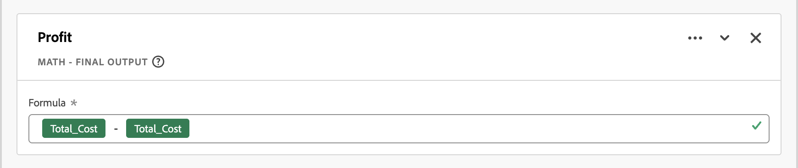

# Directrices de campos derivados

Los [campos derivados](./derived-fields.md) de Customer Journey Analytics le permiten transformar, clasificar y enriquecer datos en el momento de la consulta sin modificar los conjuntos de datos de origen. Esa flexibilidad puede introducir complejidad, problemas de rendimiento y sobrecarga de mantenimiento si se aplica sin disciplina.

Este artículo proporciona directrices (prácticas recomendadas, protecciones y escollos comunes) para trabajar con campos derivados. La audiencia a la que se dirige son los arquitectos de datos, administradores de productos y analistas que necesitan lo siguiente:

* **Optimizar rendimiento**: identifique patrones que ralentizan la ejecución de consultas o alcancen los límites del sistema para seleccionar la herramienta adecuada para el trabajo:

   * [Campos derivados](./derived-fields.md)
   * [Configuración de vista de datos](/help/data-views/component-settings/overview.md)
   * [Preparación de datos](https://experienceleague.adobe.com/es/docs/experience-platform/data-prep/home)
   * [Métricas calculadas](/help/components/calc-metrics/calc-metr-overview.md)
   * [Conjuntos de datos de búsqueda](/help/getting-started/cja-upgrade/cja-upgrade-dataset-lookup.md)

* **Mejore la capacidad de mantenimiento**: genere una lógica de campo derivada que sea clara, modular y fácil de actualizar.
* **Garantizar la corrección**: evite errores lógicos comunes en la clasificación, la atribución y la transformación de datos.

Las secciones de este artículo están organizadas por temas. Desde cadenas de reglas demasiado complejas hasta el uso incorrecto de funciones como [Lookup](./derived-fields.md#lookup), [Regex Replace](./derived-fields.md#regex-replace) y [Next o Previous](./derived-fields.md#next-or-previous). Cada sección incluye:

* **Patrones** para detectar: Señales observables en las definiciones de campo derivadas.
* **Diagnóstico de riesgo**: Por qué el patrón es problemático. Las posibles razones son los efectos negativos en **rendimiento**, **calidad de los datos** o **mantenimiento**.
* **Recommendations**: Pasos concretos para refactorizar o mejorar la implementación.

Estas directrices le ayudan a crear implementaciones eficientes, escalables y semánticamente correctas en Customer Journey Analytics. Aplique estas directrices cuando audite vistas de datos existentes, diseñe nuevos campos derivados o cree herramientas de control.

## Campos derivados de alta cardinalidad

En esta sección se describen los segmentos predeterminados de vistas de datos que hacen referencia a campos derivados de alta cardinalidad.

### Patrones

* Segmentos predeterminados de vista de datos que hacen referencia a un campo derivado creado en una dimensión de alta cardinalidad (aproximadamente un millón de valores distintos). Por ejemplo: dirección URL de página completa.
* Operaciones simples como [Minúsculas](./derived-fields.md#lowercase), [Recortar](./derived-fields.md#trim) o [Mayúsculas y minúsculas cuando](./derived-fields.md#case-when) comprueba la dirección URL de la página suelen ser más costosas que la misma lógica en campos de baja cardinalidad como el nombre de página, la sección del sitio o el grupo de direcciones URL.

### Diagnóstico de riesgos: rendimiento

* Los segmentos predeterminados que filtran en campos derivados que tocan la dirección URL de la página u otras dimensiones de alta cardinalidad añaden latencia a cada consulta con la vista de datos.

### Recomendaciones

* Evite hacer referencia a direcciones URL de página completa o a componentes de alta cardinalidad similares directamente en los segmentos predeterminados de vistas de datos. Inserte una lógica de URL pesada ([Case When](./derived-fields.md#case-when), [Regex Replace](./derived-fields.md#regex-replace), varias funciones de cadena) en sentido ascendente a [preparación de datos](https://experienceleague.adobe.com/es/docs/experience-platform/data-prep/home) o [conjuntos de datos de consulta](/help/getting-started/cja-upgrade/cja-upgrade-dataset-lookup.md), de modo que las clasificaciones resultantes se dirijan a dimensiones más sencillas y de baja cardinalidad.
* Prefiera claves de baja cardinalidad, como un nombre de página normalizado, una sección del sitio o grupos de URL preclasificados.
* Audite periódicamente los segmentos predeterminados de las vistas de datos existentes y los campos derivados para ver referencias a dimensiones de alta cardinalidad (URL de página, ID de campaña, cadenas de consulta sin procesar) y refactorice a claves normalizadas o agrupadas.

## Caso demasiado complejo al encadenar reglas

En esta sección se describen las cadenas más complejas de [reglas Case When](./derived-fields.md#case-when).

Customer Journey Analytics aplica [límites explícitos de funciones y operadores](derived-fields.md#limitations) por campo derivado (por ejemplo, número máximo de operadores, número máximo de funciones por tipo). Las funciones y cadenas demasiado complejas dentro de las funciones son más difíciles de mantener y más propensas a errores.

### Patrones

* [Caso muy grande When](./derived-fields.md#case-when) funciona con cadenas **[!UICONTROL If]** y **[!UICONTROL Else If]** complejas:
   * Muchas condiciones (por ejemplo: más de 20 operadores) o anidamiento profundo (más de 3 o 4 niveles de [Case When](./derived-fields.md#case-when) **[!UICONTROL If]** y **[!UICONTROL Else If]** anidados).
   * Condiciones repetidas en el mismo campo con valores diferentes.
* Coincidencia de cadena constante repetida.

  +++ Ejemplo

  

  +++

### Diagnóstico de riesgos: rendimiento, calidad de datos, alto mantenimiento

* Riesgo de mantenimiento y error: la lógica codificada como bloque de regla monolítica es difícil de depurar y actualizar.
* Rendimiento potencial y riesgo límite: puede alcanzar o acercarse a [límites de operador o función](./derived-fields.md#limitations), especialmente con patrones de clasificación.

### Recomendaciones

* Dividir en varios campos derivados. Por ejemplo, separe *campaign normalization* (asignación de identificadores de campaña incoherentes a un valor canónico) del agrupamiento de canales en lugar de combinar todo en una regla gigante.
* Utilice conjuntos de datos de búsqueda. Muchos **[!UICONTROL Si el valor _value_ Criterio _criteria_ Luego establece _value_ en value]**, las condiciones se implementan mejor como un [conjunto de datos de consulta](/help/getting-started/cja-upgrade/cja-upgrade-dataset-lookup.md) combinado con la función [Lookup](./derived-fields.md#lookup) en lugar de usar cadenas largas [Case When](./derived-fields.md#case-when).
* Utilice filtros de componentes de vista de datos. Si parte de la lógica simplemente filtra los valores incorrectos, use [include exclude](/help/data-views/component-settings/include-exclude-values.md) en el nivel de componente de vista de datos en lugar de incrustar esa lógica en un campo derivado.

## Uso incorrecto

En esta sección se describe el uso incorrecto de los campos derivados. Especialmente, donde las alternativas son una mejor solución.

>[!NOTE]
>
>Mover la lógica de un campo derivado a una configuración de componente de vista de datos no mejora por sí sola el rendimiento de la consulta. Ambos enfoques se compilan con la misma lógica derivada subyacente. Las recomendaciones de esta sección se refieren a la claridad, la gobernanza y la reutilización en lugar de a la velocidad.

### Patrones

* Un campo derivado replica el comportamiento ya disponible en la configuración del componente:
   * Normalización de mayúsculas y minúsculas, recorte o filtrado simple (por ejemplo: excluyendo `unknown`, `undefined` o `null`) sin complejidad adicional.
   * Agrupación básica en intervalos de números.

     +++ Ejemplo

     

     +++

     En su lugar, use [agrupación de valores](/help/data-views/component-settings/value-bucketing.md) en una dimensión de la vista de datos.
   * Lógica de persistencia o atribución codificada con [Siguiente o Anterior](./derived-fields.md#next-or-previous) o lógica de secuencia manual donde la configuración de la vista de datos [atribución](/help/data-views/component-settings/attribution.md) y [caducidad](/help/data-views/component-settings/persistence.md) sería suficiente.
   * Una métrica derivada que simplemente cuenta una métrica existente bajo una condición.

     +++ Ejemplo

     

     +++

     Esto replica lo que podría lograr una métrica filtrada o [Incluir valores de exclusión](/help/data-views/component-settings/include-exclude-values.md).

### Diagnóstico de riesgos: calidad de los datos, alto mantenimiento

* Complejidad redundante: se utilizan campos derivados donde existen funciones de vista de datos integradas más sencillas.
* Riesgo de gobernanza: es posible que otros usuarios no entiendan por qué existe un campo derivado en lugar de una configuración nativa. El patrón aumenta el desorden en la administración de campos derivados.
* Reutilización reducida: la codificación de indicadores condicionales como campos derivados dificulta la reutilización de métricas base con diferentes filtros en los proyectos.

### Recomendaciones

* Recortar/en minúsculas: use la configuración de los componentes [Substring](/help/data-views/component-settings/substring.md) y [Behavior](/help/data-views/component-settings/behavior.md) a menos que necesite transformaciones combinadas de varios pasos.
* Exclusión de valor: use [Incluir valores de exclusión](/help/data-views/component-settings/include-exclude-values.md) para métricas o valores de dimensión en el nivel de componente de vista de datos, no en un campo derivado.
* Atribución y persistencia: use la configuración de la vista de datos [Persistencia](/help/data-views/component-settings/persistence.md) (**[!UICONTROL Modelo de asignación]** y **[!UICONTROL Caducidad]**) para las dimensiones en lugar de simularlas en un campo derivado con [Siguiente o Anterior](./derived-fields.md#next-or-previous) u otra lógica secuencial.
* Agrupación numérica: mantenga el campo derivado numérico y permita que la vista de datos cree una dimensión agrupada en la parte superior, en lugar de programar etiquetas de intervalo en una cadena [Case When](./derived-fields.md#case-when).
* Lógica condicional: convertir la lógica de indicador simple 0 o 1 en una de las siguientes:
   * la métrica original con la lógica de filtro incluir o excluir valores como se aplica en Analysis Workspace.
   * una métrica filtrada mediante la configuración del componente vista de datos.

## Clasificaciones erróneas de métricas y dimensiones

En esta sección se analiza la clasificación errónea de métricas y dimensiones.

### Patrones

* Un campo derivado produce claramente:
   * Salidas numéricas (recuento, proporción o aritmética) pero el componente está configurado como dimensión.
   * Salidas categóricas (etiquetas o cadenas), pero el componente se configura como una métrica.
* Un campo derivado codifica los indicadores 0/1 como cadenas.

Customer Journey Analytics permite forzar los campos numéricos a dimensiones y los campos de cadena a métricas en el nivel de vista de datos, pero la desalineación puede crear informes confusos.

### Diagnóstico de riesgos: calidad de datos

* Discordancia semántica: el tipo de componente no coincide con la naturaleza del resultado derivado, lo que dificulta el análisis o la agregación correcta del tipo de componente.

### Recomendaciones

* Si el resultado es numérico:
   * Establezca el tipo de componente en **[!UICONTROL Métrica]** en la vista de datos.
   * Si el componente representa una métrica de subconjunto (por ejemplo, **[!UICONTROL Vistas de página de cierre de compra]**), utilice una métrica filtrada dentro de la vista de datos en lugar de una cadena derivada más una métrica calculada en la parte superior.
* Si el resultado es una etiqueta:
   * Establezca el tipo de componente en **[!UICONTROL Dimension]** y configure la configuración de [Persistencia](/help/data-views/component-settings/persistence.md) (**[!UICONTROL Modelo de asignación]** y **[!UICONTROL Caducidad]**) según corresponda.

## Dificultades del canal de marketing y de la lógica de campaña

Esta sección analiza los escollos del canal de marketing y de la lógica de campaña.

>[!NOTE]
>
>Considere la simplificación ascendente: use [Preparación de datos](https://experienceleague.adobe.com/es/docs/experience-platform/data-prep/home), [conjuntos de datos de búsqueda](/help/getting-started/cja-upgrade/cja-upgrade-dataset-lookup.md) o funciones de campo derivadas como [Clasificar](./derived-fields.md#classify) para consolidar reglas de canal de marketing similares y reducir el número de operadores en su lógica [Case When](./derived-fields.md#case-when). Además, limite el número de campos de alta cardinalidad a los que se hace referencia en la lógica de clasificación de canal (por ejemplo: muchas claves de parámetros de consulta distintas), ya que estos campos aumentan la cardinalidad y el coste de la consulta.

### Patrones

* Los canales de marketing de Customer Journey Analytics suelen implementarse utilizando campos derivados.

   * Campos derivados que implementan el canal de marketing o el agrupamiento de campañas en función de parámetros de URL, referente, página de aterrizaje y mucho más.
   * Orden sospechoso: aparece una regla de captador global genérica antes de que se apliquen reglas más específicas.
   * Tratamiento incompleto de todas las opciones posibles: no se ha establecido ninguna rama explícita para **[!UICONTROL Dominio de referencia]** o **[!UICONTROL No se ha establecido el parámetro de consulta]**.

### Diagnóstico de riesgos: calidad de datos

* Error de orden lógico: reglas posteriores en la cadena que potencialmente anulan canales específicos y conducen a un tráfico clasificado incorrectamente.
* Etiquetado incorrecto de tráfico directo: el tráfico no coincidente cae en un canal no deseado o está etiquetado como `Other`.

### Recomendaciones

* Aplicar orden de prioridad descendente. Coloque primero las señales más potentes (por ejemplo, dominios internos para excluir parámetros de campañas pagadas).
* Incluir un **[!UICONTROL explícito final de valor establecido en]** caso contrario. Establezca la reserva en **[!UICONTROL Sin valor]** para evitar sobrescribir canales anteriores. No establezca el valor en **[!UICONTROL Valor de cadena personalizado]** y, a continuación, el **[!UICONTROL valor de cadena personalizado]** en `Direct`, `None` o `Unclassified` en este paso de captador global.
* Utilice plantillas. Aproveche las plantillas de campo derivado de canal de marketing siempre que sea posible. O al menos alinee la lógica con las prácticas recomendadas de canal de marketing de Adobe.

## Claves de cadena no normalizadas utilizadas en búsquedas

En esta sección se analiza el uso de claves de cadena no normalizadas en las búsquedas.

### Patrones

* Una función [Lookup](./derived-fields.md#lookup) sobre un evento o campo de perfil que alimenta un conjunto de datos de búsqueda.
* No hay [Minúsculas](./derived-fields.md#lowercase), [Recortar](./derived-fields.md#trim) o [Reemplazo de regex](./derived-fields.md#regex-replace) anteriores que estandarizan la clave.
* Candidatos comunes: URL, ID de campaña, correo electrónico, ID de cuenta.

### Diagnóstico de riesgos: calidad de datos, alto mantenimiento

* Riesgo de calidad de datos: las búsquedas fallan cuando el uso de mayúsculas y minúsculas clave o los espacios en blanco difieren de la tabla de búsqueda, lo que provoca que *no haya coincidencias* en los valores y los huecos de los informes.

### Recomendaciones

* Agregue las funciones [Minúsculas](./derived-fields.md#lowercase) y [Recortar](./derived-fields.md#trim) antes de la función [Buscar](./derived-fields.md#lookup) a menos que haya una razón documentada para conservar las mayúsculas o minúsculas.
* Si ya hay varias transformaciones encadenadas, compruebe su orden: primero normalice y, a continuación, busque.

## Uso indebido o extralimitado de regex

Esta sección analiza el uso incorrecto o la extralimitación de la funcionalidad regex para los campos derivados.

### Patrones

* [Regex Replace](./derived-fields.md#regex-replace) o condiciones basadas en regex usan patrones muy amplios en los que las funciones [Case When](./derived-fields.md#case-when) más simples con **[!UICONTROL Contains]** o **[!UICONTROL Starts with]** son una alternativa más sencilla y mejor.

  +++ Ejemplo

  

  

  +++

* Varias condiciones de regex se superponen o entran en conflicto.
* Uso de regex para analizar direcciones URL en lugar de usar la función [Análisis de URL](./derived-fields.md#url-parse).

### Diagnóstico de riesgos: rendimiento, calidad de datos, alto mantenimiento

* Riesgo de rendimiento y mantenimiento: los patrones de regex complejos son más difíciles de depurar y pueden ser más lentos.
* Riesgo de corrección: una regex demasiado amplia puede capturar valores no deseados.

### Recomendaciones

* Prefiera [Análisis de URL](./derived-fields.md#url-parse) para elementos de URL estándar (dominio, ruta, parámetros de consulta) en lugar de [Reemplazo de Regex](./derived-fields.md#regex-replace).
* Para las comprobaciones de patrones simples, use la lógica [Case When](./derived-fields.md#case-when) with **[!UICONTROL Contains]**, **[!UICONTROL Starts with]** o **[!UICONTROL Ends with]** en lugar de expresiones regulares con [Regex Replace](./derived-fields.md#regex-replace).
* Marque expresiones regulares que utilicen varios grupos anidados o alternaciones para patrones simples. O expresiones regulares que se pueden reemplazar mediante funciones de cadena de campo derivadas.

## Lógica de estilo de métrica calculada en campos derivados

En esta sección se describe el uso de la lógica de estilo calculada en un campo derivado.

>[!NOTE]
>
>Los campos derivados se evalúan en el nivel de evento (fila) antes de la agregación, mientras que las métricas calculadas de Analysis Workspace funcionan con valores ya agregados. Por lo tanto, las relaciones, los promedios y los cálculos de estilo distinto pueden arrojar resultados diferentes en función de si estos cálculos se implementan como un campo derivado o como una métrica calculada. Sea deliberado sobre dónde vive la aritmética, porque el grano de la evaluación cambia la respuesta.

### Patrones

* Aritmética pura en campos numéricos dentro de un campo derivado (suma, resta, división) que parece una métrica calculada.

  +++ Ejemplos

  

  .

  +++

* No se utiliza la manipulación ni la clasificación de cadenas; la lógica es puramente numérica.

### Diagnóstico de riesgos: calidad de datos

* Cuestión de gobernanza y diseño: la aritmética puede estar mejor situada como:
   * Una métrica de campo derivado (si desea el campo derivado como métrica estándar controlada para todos los usuarios).
   * Una métrica calculada en Analysis Workspace (si la métrica calculada es específica del análisis).

### Recomendaciones

* Si el resultado aritmético suele ser útil entre usuarios y proyectos, conserve el resultado como una métrica de campo derivada. Asegúrese de que el tipo de componente es métrica y que el formato (moneda, porcentaje) se configura en el nivel de vista de datos.
* Si el resultado es específico de un nicho o analista, mueva el resultado a una métrica calculada y simplifique la vista de datos.

## Uso excesivo de las funciones Siguiente o Anterior o secuencial

En esta sección se describe el uso excesivo de [Siguiente o Anterior](./derived-fields.md#next-or-previous) o funciones secuenciales.

### Patrones

* Un campo derivado usa las funciones [Siguiente o Anterior](./derived-fields.md#next-or-previous) varias veces (cerca del límite documentado por campo).
* [Siguiente o Anterior](./derived-fields.md#next-or-previous) se usa para implementar lógica de persistencia (por ejemplo: llevar una campaña hacia adelante) en lugar de usar persistencia de vista de datos.

### Diagnóstico de riesgos: calidad de los datos, alto mantenimiento

* Complejidad y fragilidad: la lógica secuencial pesada es más difícil de razonar y puede romperse si cambian las reglas de sesionización o el orden.
* Redundancia con persistencia de dimensión: algunos casos de uso (por ejemplo, Canal de último contacto en una sesión) se tratan mejor en la configuración de la vista de datos [Persistencia](/help/data-views/component-settings/persistence.md) (**[!UICONTROL Modelo de asignación]**) de la dimensión.

### Recomendaciones

* Para patrones que se asemejan a la persistencia estándar (por ejemplo, llevar un valor hacia adelante en una sesión o persona), use la configuración de [Persistencia](/help/data-views/component-settings/persistence.md) de la dimensión (**[!UICONTROL Modelo de asignación]** y **[!UICONTROL Caducidad]**) en la vista de datos en lugar de simular estos patrones con [Siguiente o Anterior](./derived-fields.md#next-or-previous).
* Reserve [Siguiente o Anterior](./derived-fields.md#next-or-previous) para una ruta de varios pasos avanzada o un etiquetado funnel que la persistencia de la dimensión por sí sola no pueda lograr (por ejemplo: concatenación de secuencia de canal).

## Ignorar contexto de nivel de persona y sesión

En esta sección se describe la omisión del contexto de nivel de persona y sesión al definir un campo derivado.

>[!NOTE]
>
>En algunos casos, un segmento con ámbito de sesión o nivel de persona en Analysis Workspace puede modelar el comportamiento de forma más sencilla que un campo derivado. Considere la posibilidad de utilizar segmentos en lugar de campos derivados complejos entre ámbitos cuando corresponda.

### Patrones

* Un campo derivado supone implícitamente un [nivel de contenedor](/help/getting-started/cja-b2b-concepts-features.md#containers) en particular (evento, sesión o persona) pero:

   * El campo derivado no hace referencia a atributos de nivel de persona o sesión.
   * La configuración de sesión de vista de datos entra en conflicto con la lógica deseada.

### Diagnóstico de riesgos: calidad de datos

* Discordancia conceptual: la semántica de campo derivada puede no coincidir con el nivel de agregación que esperan los analistas (por ejemplo: un campo basado en persona que puede cambiar con cada evento).

### Recomendaciones

* Si se pretende que la lógica sea de nivel de sesión: compruebe que [configuración de sesión](/help/data-views/session-settings.md) esté correctamente configurada y considere la posibilidad de utilizar componentes con ámbito de sesión o resumen en Analysis Workspace o en una [herramienta de BI integrada](/help/data-views/bi-extension.md).
* Si la lógica está pensada para ser de nivel de persona: utilice conjuntos de datos de perfil o conjuntos de datos de búsqueda y haga referencia a estos conjuntos de datos dentro de campos derivados.
* Evalúe si un segmento de ámbito de sesión o de ámbito personal en Analysis Workspace lograría el mismo resultado de forma más sencilla que un campo derivado.

## Alcanzar o acercarse a los límites de funciones documentadas

En esta sección se analizan las implicaciones de alcanzar o acercarse a los límites de funciones de campo derivadas documentadas.

>[!NOTE]
>
>Reduzca la dependencia en campos de alta cardinalidad dentro de campos derivados complejos siempre que sea posible (por ejemplo: use claves normalizadas o clasificaciones agrupadas) para limitar tanto el costo de la consulta como la probabilidad de alcanzar [límites de operador o función](./derived-fields.md#limitations).

Customer Journey Analytics [documenta](./derived-fields.md#limitations) funciones y operadores máximos por campo derivado, incluidos límites por tipo de función ([Búsqueda](./derived-fields.md#lookup), [Fecha matemática](./derived-fields.md#date-math), [Deduplicar](./derived-fields.md#deduplicate), [Matemáticas](./derived-fields.md#math), [Dividir](./derived-fields.md#split), [Análisis de URL](./derived-fields.md#url-parse), etc.).

### Patrones

* Un campo derivado usa muchas operaciones [Lookup](./derived-fields.md#lookup), [Math](./derived-fields.md#math), [Split](./derived-fields.md#split) u otras funciones.
* El número de operadores está cerca de los [límites documentados](./derived-fields.md#limitations) (por ejemplo: más del 70% - 80% de los recuentos permitidos).

### Diagnóstico de riesgos: rendimiento, alto mantenimiento

* Riesgo de escalabilidad: las futuras adiciones pueden fallar o comportarse de forma inesperada si el campo alcanza su límite de funciones.

### Recomendaciones

* Indicador proactivo cuando el uso supera un umbral (por ejemplo: > 70 % de cualquier límite de función u operador).
* Divida la lógica en varios campos derivados que estén encadenados (por ejemplo, un campo derivado A que normalice una clave de búsqueda y un campo derivado Band normalize_key y, a continuación, lookup_label).
* Utilice la preparación de datos externa o un conjunto de datos de búsqueda donde se necesiten clasificaciones especialmente grandes.

## Reglas de optimización específicas de la vista de datos

En esta sección se describen las reglas de optimización específicas de la vista de datos para los campos derivados.

Compruebe también la configuración de vista de datos de cada componente derivado.

### Patrones

* Una dimensión derivada tiene una atribución predeterminada (por ejemplo: Último contacto con caducidad de sesión) pero el nombre de campo derivado implica una semántica diferente (por ejemplo: `First Campaign of Visit`, `Original Source`).
* Una dimensión derivada tiene la configuración predeterminada [Persistencia](/help/data-views/component-settings/persistence.md) (por ejemplo: **[!UICONTROL Más reciente]** asignación con caducidad de **[!UICONTROL Sesión]**), pero el nombre de la dimensión derivada implica una semántica diferente (por ejemplo, `First Campaign of Visit` o `Original Source`).

### Diagnóstico de riesgos: calidad de datos

* Discordancia semántica: la etiqueta de la dimensión sugiere un comportamiento de asignación o caducidad diferente (por ejemplo, asignación original o caducidad a nivel de persona) al que está configurado realmente.
* Esta discrepancia aumenta el riesgo de que los analistas malinterpreten los informes o comparen componentes que parecen similares por su nombre, pero que utilizan modelos de asignación diferentes.

### Recomendaciones

* Ajuste el modelo de asignación [y la caducidad](/help/data-views/component-settings/persistence.md) en esa dimensión para alinear el nombre y el comportamiento. Por ejemplo, una dimensión de campo derivado denominada `Original Source` debe utilizar Atribución de primer contacto con caducidad establecida en Persona.
* Ajuste el **[!UICONTROL modelo de asignación]** y la **[!UICONTROL caducidad]** en la configuración de [Persistencia](/help/data-views/component-settings/persistence.md) de la dimensión para alinear el nombre y el comportamiento. Por ejemplo, `Original Source` debe establecer **[!UICONTROL Modelo de asignación]** en **[!UICONTROL Original]** con **[!UICONTROL Caducidad]** establecido en **[!UICONTROL Persona]**.
