# Campos derivados {#derived-fields}

>[!CONTEXTUALHELP]
>id="dataview_derivedfields"
>title="Campos derivados"
>abstract="Un campo derivado permite definir manipulaciones de datos sobre la marcha, mediante un generador de reglas personalizable. A continuación, puede usar ese campo derivado como componente (métrica o dimensión) en Workspace o incluso definirlo como componente en la vista Datos."

Los campos derivados son un aspecto importante de la funcionalidad de creación de informes en tiempo real de Adobe Customer Journey Analytics. Un campo derivado permite definir manipulaciones de datos (a menudo complejas) sobre la marcha, mediante un generador de reglas personalizable. A continuación, puede usar ese campo derivado como un componente (métrica o dimensión) en [Workspace](../../analysis-workspace/home.md) o incluso definirlo como un componente en [Vista de datos](../data-views.md).

Los campos derivados pueden ahorrar una cantidad significativa de tiempo y esfuerzo, en comparación con la transformación o manipulación de los datos en otras ubicaciones fuera de Customer Journey Analytics. Por ejemplo, [Preparación de datos](https://experienceleague.adobe.com/docs/experience-platform/data-prep/home.html?lang=es), [Data Distiller](https://experienceleague.adobe.com/docs/experience-platform/query/data-distiller/overview.html?lang=es) o dentro de sus propios procesos ETL (Extraer, transformar, cargar)/ELT (Extraer, cargar, transformar).

Los campos derivados que se definen en las [Vistas de datos](../data-views.md) se basan en un conjunto de funciones definidas como reglas y se aplican a los campos de esquema o estándar disponibles.

>[!NOTE]
>
>[Los componentes estándar](../component-reference.md) están vinculados y asociados a conjuntos de datos de evento. Como resultado, los componentes estándar que se utilizan como parte de un campo derivado solo funcionan con datos de un conjunto de datos de evento.
>

Algunos ejemplos de casos de uso son:

- Defina un campo Nombre de página derivado que corrija los valores incorrectos de nombre de página recopilados para corregir los valores de nombre de página.

- Defina un campo de canal de marketing derivado que determine el canal de marketing adecuado en función de una o varias condiciones (por ejemplo, parámetro de URL, dirección URL de página, nombre de página).

Los componentes estándar solo se admiten en conjuntos de datos de evento en campos derivados.

## Interfaz de campo derivado {#interface}

Cuando se crea o edita un campo derivado, se utiliza la interfaz de campo derivado.

|  | Nombre | Descripción |
|---------|----------|--------|
| 1 | **Selector** | Utilice el área de selector para seleccionar y arrastrar la función, la plantilla de función, el campo de esquema o el campo estándar y colocarlos en el generador de reglas.  Utilice el menú desplegable para seleccionar entre:   [!UICONTROL Funciones]: indica las [funciones](#function-reference) disponibles,   [!UICONTROL Plantillas de funciones]: indica las [plantillas de funciones](#function-templates) disponibles,   [!UICONTROL Campos de esquema]: indica los campos disponibles de las categorías de conjuntos de datos (evento, perfil, búsqueda) y los campos derivados definidos anteriormente y el   [!UICONTROL Campos estándar]: campos disponibles estándar (como el ID de conjunto de datos de Platform). En el selector solo se muestran los campos estándar de cadena o numéricos. Si la función admite otros tipos de datos, se pueden seleccionar los campos estándar con estos otros tipos de datos para valores o campos dentro de la interfaz de la regla. Puede buscar campos de función, plantillas de funciones, esquema y campos estándar mediante el cuadro de búsqueda .  Puede filtrar la lista de objetos seleccionados seleccionando el filtro  y especificar filtros en el cuadro de diálogo [!UICONTROL Filtrar campos por]. Puede quitar filtros fácilmente usando el  para cada filtro. |
| 2 | **Generador de reglas** | Genere secuencialmente el campo derivado utilizando una o más reglas. Una regla es una implementación específica de una función y, por lo tanto, siempre se asocia a una sola función. Para crear una regla, arrastre y suelte una función en el generador de reglas. El tipo de función determina la interfaz de la regla. Consulte la [Interfaz de regla](#rule-interface) para obtener más información.  Puede insertar una función al principio, al final o entre las reglas que ya están disponibles en el generador de reglas. La última regla del generador de reglas determina el resultado final del campo derivado. |
| 3 | **[!UICONTROL ** Configuración del campo **]** | Puede asignar un nombre al campo derivado, describirlo e inspeccionar su tipo de campo. |
| 4 | **[!UICONTROL ** Salida final **]** | Esta área muestra una vista previa actualizada sobre la marcha de los valores de salida, basada en los datos de los últimos 30 días y los cambios realizados en el campo derivado del generador de reglas. |

{style="table-layout:auto"}

## Asistente de plantilla de campo {#wizard}

Cuando accede a la interfaz de campo derivado por primera vez, se muestra el asistente [!UICONTROL Comenzar con una plantilla de campo].

1. Seleccione la plantilla que mejor describa el tipo de campo que está tratando de crear.
2. Seleccione el botón **[!UICONTROL ** Seleccionar **]** para continuar.

El cuadro de diálogo de campo derivado se rellena con reglas (y funciones) necesarias o útiles para el tipo de campo seleccionado. Consulte [Plantillas de funciones](#function-templates) para obtener más información sobre las plantillas disponibles.

## Interfaz de regla {#rules}

Cuando se define una regla en el generador de reglas, se utiliza la interfaz de la regla.

|  | Nombre | Descripción |
|---------|----------|--------|
| A | **Nombre de regla** | De manera predeterminada, el nombre de regla es **Regla X** (X hace referencia a un número de secuencia). Para editar el nombre de una regla, seleccione su nombre y escriba el nuevo nombre, por ejemplo `Query Parameter`. |
| B | **Nombre de función** | El nombre de la función seleccionada para la regla, por ejemplo [!UICONTROL ANÁLISIS DE URL]. Cuando la función es la última de la secuencia de funciones y determina los valores del resultado final, el nombre de la función va seguido de [!UICONTROL - SALIDA FINAL], por ejemplo [!UICONTROL ANÁLISIS DE URL - SALIDA FINAL].  Para mostrar una ventana emergente con más información sobre la función, seleccione el . |
| C | **Descripción de la regla** | Como opción, puede añadir una descripción a una regla. Seleccione el  y, a continuación, seleccione **[!UICONTROL ** Añadir descripción **]** para añadir una descripción o **[!UICONTROL ** Editar descripción **]** para editar una descripción existente. Utilice el editor para escribir una descripción. Puede utilizar la barra de herramientas para dar formato al texto (mediante el selector de estilo, negrita, cursiva, subrayado, derecha, izquierda, centrado, color, lista de números, lista de viñetas) y añadiendo vínculos a la información externa.  Para terminar de editar la descripción, haga clic fuera del editor. |
| D | **Área de función** | Define la lógica de la función. La interfaz depende del tipo de función. El menú desplegable de [!UICONTROL Campo] o [!UICONTROL Valor] muestra todas las categorías de campos (reglas, campos estándar, campos) disponibles, según el tipo de entrada que espera la función. También puede arrastrar y soltar un campo del selector de Campos de esquema y estándar en un Campo o Valor. Cuando ese campo arrastrado se origina desde un conjunto de datos de consulta, se inserta automáticamente una función de consulta antes de la función que defina.  Consulte [Referencia de función](#function-reference) para obtener información detallada para cada una de las funciones admitidas. |

{style="table-layout:auto"}

## Crear un campo derivado {#create}

1. Seleccione una vista de datos existente o cree una vista de datos. Consulte [Vistas de datos](../data-views.md) para obtener más información.

2. Seleccione la pestaña **[!UICONTROL ** Componentes **]** de la vista de datos.

3. Seleccione **[!UICONTROL ** Crear campo derivado **]** en el carril izquierdo.

4. Para definir el campo derivado, utilice la interfaz [!UICONTROL Crear campo derivado]. Consulte [Interfaz de campo derivado](#derived-field-interface).

   Para guardar el nuevo campo derivado, seleccione **[!UICONTROL ** Guardar **]**.

5. El nuevo campo derivado se añadirá al contenedor [!UICONTROL Campos derivados >] como parte de **[!UICONTROL ** Campos de esquema **]** en el carril izquierdo de la vista de datos.

## Editar un campo derivado {#edit}

1. Seleccione una vista de datos existente. Consulte [Vistas de datos](../data-views.md) para obtener más información.

2. Seleccione la pestaña **[!UICONTROL ** Componentes **]** de la vista de datos.

3. Seleccione la pestaña **[!UICONTROL ** Campos del esquema **]** en el panel [!UICONTROL Conexión] de la izquierda.

4. Seleccione el contenedor **[!UICONTROL ** Campos derivados >**]**.

5. Pase el puntero por encima del campo derivado que quiera editar y seleccione .

6. Para editar el campo derivado, utilice la interfaz [!UICONTROL Editar campo derivado]. Consulte [Interfaz de campo derivado](#derived-field-interface).

   - Seleccione **[!UICONTROL ** Guardar **]** para guardar el campo derivado actualizado.

   - Seleccione **[!UICONTROL ** Cancelar **]** para cancelar los cambios realizados en el campo derivado.

   - Seleccione **[!UICONTROL ** Guardar como **]** para guardar el campo derivado como un nuevo campo derivado. El nuevo campo derivado tiene el mismo nombre que el campo derivado editado original con `(copy)` añadido.

Como alternativa, si ha utilizado un campo derivado como componente para dimensiones o métricas en la vista de datos:

1. Seleccione el componente. Tenga en cuenta que el componente puede tener un nombre diferente del campo derivado.

1. En el panel Componente, seleccione el  junto al campo derivado, debajo del nombre del campo Esquema.

1. Para editar el campo derivado, use la interfaz [!UICONTROL Editar campo derivado]. Consulte [Interfaz de campo derivado](#derived-field-interface).

   - Seleccione **[!UICONTROL ** Guardar **]** para guardar el campo derivado actualizado.

   - Seleccione **[!UICONTROL ** Cancelar **]** para cancelar los cambios realizados en el campo derivado.

   - Seleccione **[!UICONTROL ** Guardar como **]** para guardar el campo derivado como un nuevo campo derivado. El nuevo campo derivado tiene el mismo nombre que el campo derivado editado original con `(copy)` añadido.

## Eliminar un campo derivado {#delete}

1. Seleccione una vista de datos existente. Consulte [Vistas de datos](../data-views.md) para obtener más información.

2. Seleccione la pestaña **[!UICONTROL ** Componentes **]** de la vista de datos.

3. Seleccione la pestaña **[!UICONTROL ** Campos de esquema **]** en el panel [!UICONTROL Conexión].

4. Seleccione el contenedor **[!UICONTROL ** Campos derivados >**]**.

5. Pase el puntero por encima del campo derivado que quiere eliminar y seleccione .

6. En la interfaz [!UICONTROL Editar campo derivado], seleccione **[!UICONTROL Eliminar]**.

   Un cuadro de diálogo [!UICONTROL Eliminar componente] le pedirá que confirme la eliminación. Considere cualquier referencia externa que pueda existir al campo derivado fuera de la vista de datos.

   - Seleccione **[!UICONTROL ** Continuar **]** para eliminar el campo derivado.

Como alternativa, si ha utilizado un campo derivado como componente para dimensiones o métricas en la vista de datos:

1. Seleccione el componente. Tenga en cuenta que el componente puede tener un nombre diferente del campo derivado.

1. En el panel Componente, seleccione el  junto al campo derivado, debajo del nombre del campo Esquema.

1. En la interfaz de [!UICONTROL Editar campo derivado], seleccione **[!UICONTROL Eliminar]**.

   Un cuadro de diálogo [!UICONTROL Eliminar componente] le pedirá que confirme la eliminación. Considere cualquier referencia externa que pueda existir al campo derivado fuera de la vista de datos.

   - Seleccione **[!UICONTROL ** Continuar **]** para eliminar el campo derivado.

>[!NOTE]
>
>Los campos derivados se administran en el nivel de conexión en Customer Journey Analytics. Cualquier cambio realizado en un campo derivado en cualquiera de las vistas de datos asociadas a esa conexión se aplica a todas estas vistas de datos asociadas.

## Plantillas de funciones {#templates}

Para crear rápidamente un campo derivado para casos de uso específicos, hay plantillas de funciones disponibles. Se puede acceder a estas plantillas de funciones desde el área de selector de la interfaz del campo derivado o aparecen cuando se usan por primera vez vez en el asistente [!UICONTROL Comenzar con una plantilla de campo].

### Canales de marketing {#mchannel}

Esta plantilla de función utiliza una colección de reglas para crear canales de marketing.

+++ Detalles

Para utilizar la plantilla, debe especificar los parámetros correctos para cada función enumerada como parte de las reglas de la plantilla. Consulte [Referencia de función](#function-reference) para obtener más información.

+++

### Rechazos {#bounces}

Esta plantilla de función utiliza una colección de reglas para identificar los rechazos del sitio.

+++ Detalles

{{select-package}}

Para utilizar la plantilla, debe especificar los parámetros correctos para cada función enumerada como parte de las reglas de la plantilla. Consulte [Referencia de función](#function-reference) para obtener más información.

+++

### Combinación multidimensional {#multi-dim}

Esta plantilla de función combina dos valores en uno.

+++ Detalles

{{select-package}}

Para utilizar la plantilla, debe especificar los parámetros correctos para cada función enumerada como parte de las reglas de la plantilla. Consulte [Referencia de función](#function-reference) para obtener más información.

+++

### Nombre descriptivo del conjunto de datos {#friendlyname}

Esta plantilla de función proporciona un nombre de conjunto de datos legible.

+++ Detalles

{{select-package}}

Para utilizar la plantilla, debe especificar los parámetros correctos para cada función enumerada como parte de las reglas de la plantilla. Consulte [Referencia de función](#function-reference) para obtener más información.

+++

### Nombre de página de URL {#pagename}

Esta plantilla de función crea un nombre de página simple.

+++ Detalles

{{select-package}}

Para utilizar la plantilla, debe especificar los parámetros correctos para cada función enumerada como parte de las reglas de la plantilla. Consulte [Referencia de función](#function-reference) para obtener más información.

+++

### Temporada de vacaciones {#holiday}

Esta plantilla de función clasifica los momentos clave del año.

+++ Detalles

{{select-package}}

Para utilizar la plantilla, debe especificar los parámetros correctos para cada función enumerada como parte de las reglas de la plantilla. Consulte [Referencia de función](#function-reference) para obtener más información.

+++

### Metas mensuales {#goals}

Esta plantilla de función establece metas mensuales personalizadas.

+++ Detalles

{{select-package}}

Para utilizar la plantilla, debe especificar los parámetros correctos para cada función enumerada como parte de las reglas de la plantilla. Consulte [Referencia de función](#function-reference) para obtener más información.

+++

### Obtener todos los valores de la lista delimitada {#allvalues}

Esta plantilla de función convierte una lista limitada en una matriz.

+++ Detalles

{{select-package}}

Para utilizar la plantilla, debe especificar los parámetros correctos para cada función enumerada como parte de las reglas de la plantilla. Consulte [Referencia de función](#function-reference) para obtener más información.

+++

### Obtener el primer valor de la lista delimitada {#firstvalue}

Esta plantilla de función obtiene el primer valor de una lista delimitada.

+++ Detalles

{{select-package}}

Para utilizar la plantilla, debe especificar los parámetros correctos para cada función enumerada como parte de las reglas de la plantilla. Consulte [Referencia de función](#function-reference) para obtener más información.

+++

### Obtener el último valor de la lista delimitada {#lastvalue}

Esta plantilla de función obtiene el último valor de una lista delimitada.

+++ Detalles

{{select-package}}

Para utilizar la plantilla, debe especificar los parámetros correctos para cada función enumerada como parte de las reglas de la plantilla. Consulte [Referencia de función](#function-reference) para obtener más información.

+++

### Nombre de dominio {#domain}

Esta plantilla de función extrae el nombre de dominio mediante una expresión regular.

+++ Detalles

{{select-package}}

Para utilizar la plantilla, debe especificar los parámetros correctos para cada función enumerada como parte de las reglas de la plantilla. Consulte [Referencia de función](#function-reference) para obtener más información.

+++

### Obtener parámetro de cadena de consulta {#querystring}

Esta plantilla de función extrae valores de la cadena de consulta.

+++ Detalles

{{select-package}}

Para utilizar la plantilla, debe especificar los parámetros correctos para cada función enumerada como parte de las reglas de la plantilla. Consulte [Referencia de función](#function-reference) para obtener más información.

+++

### Campo de transición {#transition}

Esta plantilla de función realiza la transición de informes de un campo a otro.

+++ Detalles

{{select-package}}

Para utilizar la plantilla, debe especificar los parámetros correctos para cada función enumerada como parte de las reglas de la plantilla. Consulte [Referencia de función](#function-reference) para obtener más información.

+++

### Detección de bots simples {#botdetection}

Esta plantilla de función implementa la identificación de bots ligeros.

+++ Detalles

{{select-package}}

Para utilizar la plantilla, debe especificar los parámetros correctos para cada función enumerada como parte de las reglas de la plantilla. Consulte [Referencia de función](#function-reference) para obtener más información.

+++

### Vínculo de salida {#exit}

Esta plantilla de función identifica el último vínculo en el que se hizo clic en una sesión.

+++ Detalles

{{select-package}}

Para utilizar la plantilla, debe especificar los parámetros correctos para cada función enumerada como parte de las reglas de la plantilla. Consulte [Referencia de función](#function-reference) para obtener más información.

+++

### Vínculo de descarga {#download}

Esta plantilla de función indica vínculos de descarga comunes.

+++ Detalles

{{select-package}}

Para utilizar la plantilla, debe especificar los parámetros correctos para cada función enumerada como parte de las reglas de la plantilla. Consulte [Referencia de función](#function-reference) para obtener más información.

+++

### Latitud del estado {#state-latitude}

Esta plantilla de función obtiene la latitud para un estado de EE. UU. con una precisión de 5 dígitos.

+++ Detalles

{{select-package}}

Para utilizar la plantilla, debe especificar los parámetros correctos para cada función enumerada como parte de las reglas de la plantilla. Consulte [Referencia de función](#function-reference) para obtener más información.

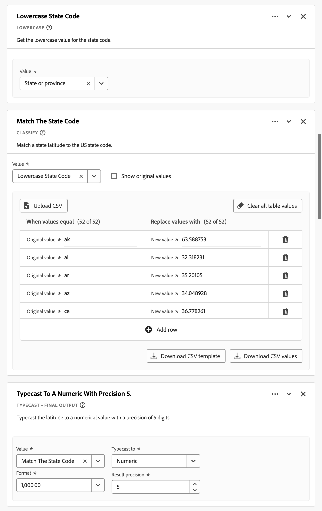

+++

### Longitud del estado {#state-longitude}

Esta plantilla de función obtiene la longitud de un estado de EE. UU. con una precisión de 5 dígitos.

+++ Detalles

{{select-package}}

Para utilizar la plantilla, debe especificar los parámetros correctos para cada función enumerada como parte de las reglas de la plantilla. Consulte [Referencia de función](#function-reference) para obtener más información.

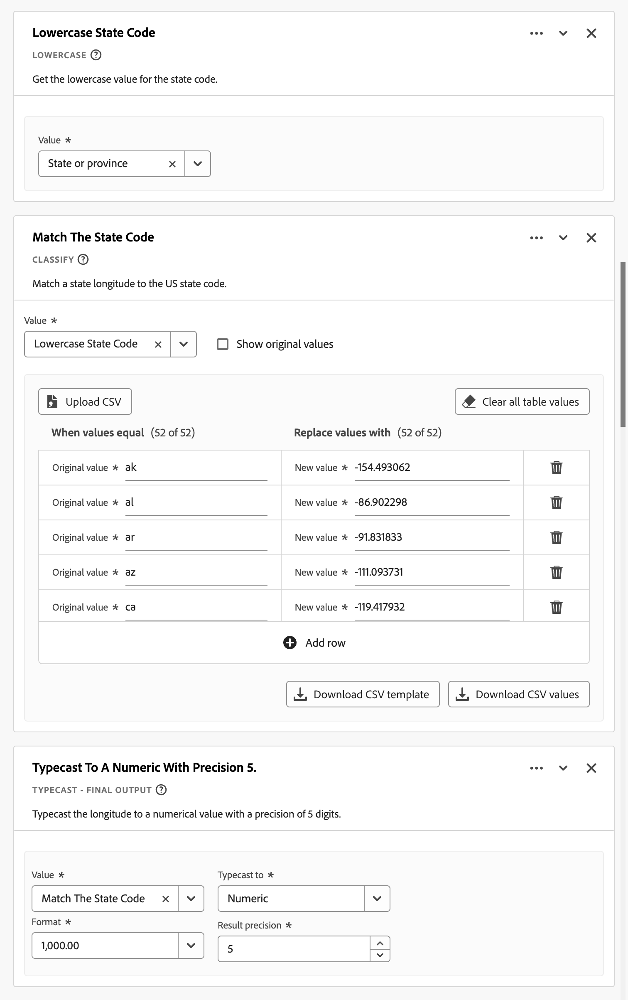

+++

<!--

+++ Data clean up template

>[!WARNING]
>
>Could not find any information on this template.
+++

-->

## Referencia de función {#functionref}

{{select-package}}

Para cada función admitida, busque los detalles siguientes sobre:

- especificaciones:
   - tipo de datos de entrada: tipo de datos admitidos,
   - entrada: posibles valores para la entrada,
   - operadores incluidos: operadores admitidos para esta función (si existen),
   - limitaciones: limitaciones que se aplican a esta función específica,
   - salida.

- casos de uso, incluidos:
   - los datos antes de definir el campo derivado,
   - cómo definir el campo derivado,
   - después de definir el campo derivado.

- restricciones (si procede).

<!-- CASE WHEN -->

### Case When {#casewhen}

>[!CONTEXTUALHELP]
>id="dataview_derivedfields_casewhen"
>title="Case When"
>abstract="Esta función proporciona la capacidad de aplicar condiciones basadas en criterios definidos de uno o varios campos. Estos criterios se utilizan para definir los valores en el nuevo campo derivado, según la secuencia de las condiciones."

Aplica condicionales, según los criterios definidos en uno o varios campos. Estos criterios se utilizan para definir los valores del nuevo campo derivado en función de la secuencia de las condiciones.

+++ Detalles

## Especificaciones {#casewhen-io}

| Tipo de datos de entrada | Entrada | Operadores incluidos | Limitaciones | Salida |
|---|---|---|---|---|
| <ul><li>Cadena</li><li>Numéricos</li><li>Fecha</li></ul> | <ul><li>Contenedor [!UICONTROL If], [!UICONTROL Else If]:
<ul><li>[!UICONTROL Valor]</li><ul><li>Reglas</li><li>Campos estándar</li><li>Campos</li></ul><li>[!UICONTROL Criterio] (consulte los operadores incluidos, según el tipo de valor seleccionado)</li></ul></li><li>[!UICONTROL Luego establezca el valor en], [!UICONTROL De lo contrario, establezca el valor en ]:
<ul><li>[!UICONTROL Valor]</li><ul><li>Reglas</li><li>Campos estándar</li><li>Campos</li></ul></ul></li></ul> | 
Cadenas
<ul><li>Es igual a</li><li>Es igual a cualquier término</li><li>Contiene la frase</li><li>Contiene cualquier término</li><li>Contiene todos los términos</li><li>Comienza con</li><li>Comienza con cualquier término</li><li>Finaliza con</li><li>Finaliza con cualquier término</li><li>No es igual a</li><li>No coincide con ningún término</li><li>No contiene la frase</li><li>No contiene ningún término</li><li>No contiene todos los términos</li><li>No comienza con</li><li>No comienza con ningún término</li><li>No finaliza con</li><li>No termina con ningún término</li><li>Está establecido</li><li>No está establecido</li></ul>
Numéricos
<ul><li>Es igual a</li><li>No es igual a</li><li>es mayor que</li><li>es mayor o igual que</li><li>Es menor que</li><li>es menor o igual que</li><li>Está establecido</li><li>No está establecido</li></ul>
Fechas
<ul><li>Es igual a</li><li>No es igual a</li><li>es posterior a</li><li>Es posterior o igual a</li><li>Es antes de</li><li>Es anterior o igual a</li><li>Está establecido</li><li>No está establecido</li></ul> | <ul><li>5 funciones por campo derivado</li><li>200 [operadores](#operators) por campo derivado. Un ejemplo de operador único es &quot;El dominio de referencia contiene Google&quot;. </li></ul> | 
Nuevo campo derivado
 |

{style="table-layout:auto"}

## Caso de uso 1 {#casewhen-uc1}

Desea definir reglas para identificar varios canales de marketing aplicando una lógica en cascada para establecer un campo de canal de marketing en el valor adecuado:

- Si el referente es de un motor de búsqueda y la página tiene un valor de cadena de consulta donde `cid` contiene `ps_`, el canal de marketing debe identificarse como una [!DNL *búsqueda de pago*].
- Si el referente es de un motor de búsqueda y la página no tiene la cadena de consulta `cid`, el canal de marketing debe identificarse como una [!DNL *búsqueda natural*].
-  Si una página tiene un valor de la cadena de consulta donde `cid` contiene `em_`, el canal de marketing debe identificarse como un [!DNL *correo electrónico*].
- Si una página tiene un valor de la cadena de consulta donde `cid` contiene `ds_`, el canal de marketing debe identificarse como un [!DNL *anuncio en pantalla*].
- Si una página tiene un valor de cadena de consulta donde `cid` contiene `so_`, el canal de marketing debe identificarse como [!DNL *Social de pago*].
- Si el referente es de un dominio de referencia de [!DNL twitter.com], [!DNL facebook.com], [!DNL linkedin.com] o [!DNL tiktok.com], el canal de marketing debe identificarse como [!DNL *Social natural*].
- Si ninguna de las reglas anteriores coincide, el canal de marketing debe identificarse como [!DNL *Otro referente*].

En caso de que el sitio reciba los siguientes eventos de ejemplo, que contienen [!UICONTROL Referente] y [!UICONTROL URL de la página], estos eventos se deben identificar de la siguiente manera:

| [!DNL Event] | [!DNL Referrer] | [!DNL Page URL] | [!DNL Marketing Channel] |
|:--:|----|----|----|
| 1 | `https://facebook.com` | `https://site.com/home` | [!DNL Natural Social] |
| 2 | `https://abc.com` | `https://site.com/?cid=ds_12345678` | [!DNL Display] |
| 3 | | `https://site.com/?cid=em_12345678` | [!DNL Email] |
| 4 | `https://google.com` | `https://site.com/?cid=ps_abc098765` | [!DNL Paid Search] |
| 5 | `https://google.com` | `https://site.com/?cid=em_765544332` | [!DNL Email] |
| 6 | `https://google.com` |  | [!DNL Natural Search] |

{style="table-layout:auto"}

### Datos antes {#casewhen-uc1-databefore}

| [!DNL Referrer] | [!DNL Page URL] |
|----|----|
| `https://facebook.com` | `https://site.com/home` |
| `https://abc.com` | `https://site.com/?cid=ds_12345678` |
|  | `https://site.com/?cid=em_12345678` |
| `https://google.com` | `https://site.com/?cid=ps_abc098765` |
| `https://google.com` | `https://site.com/?cid=em_765544332` |
| `https://google.com` | |

{style="table-layout:auto"}

### Campo derivado {#casewhen-uc1-derivedfield}

Debe definir un campo derivado `Marketing Channel`. Utilice las funciones [!UICONTROL CASE WHEN] para definir reglas que creen valores para el campo basados en los valores existentes tanto para el campo `Page URL` como para el campo `Referring URL`.

Observe el uso de la función [!UICONTROL ANÁLISIS DE URL] para definir reglas que recuperen los valores de `Page Url` y `Referring Url` antes de aplicar las reglas [!UICONTROL CASE WHEN].

### Datos después {#casewhen-uc1-dataafter}

| [!DNL Marketing Channel] |
|----|
| [!DNL Natural Social] |
| [!DNL Display] |
| [!DNL Email] |
| [!DNL Paid Search] |
| [!DNL Email] |
| [!DNL Natural Search] |

{style="table-layout:auto"}

## Caso de uso 2 {#casewhen-uc2}

Ha recopilado varias variaciones diferentes de búsqueda dentro de su dimensión [!DNL Product Finding Methods]. Para comprender el rendimiento general de la búsqueda frente a la exploración, debe dedicar una gran cantidad de tiempo a combinar los resultados manualmente.

Su sitio recopila los siguientes valores para su dimensión [!DNL Product Finding Methods]. Al final, todos estos valores indican una búsqueda.

| Valor recopilado | Valor real |
|---|---|
| [!DNL search p13n_no] | [!DNL search] |
| [!DNL search p13n_yes] | [!DNL search] |
| [!DNL search refine p13n_no] | [!DNL search] |
| [!DNL search refine p13n_yes] | [!DNL search] |
| [!DNL search redirect p13n_yes] | [!DNL search] |
| [!DNL search-redirect] | [!DNL search] |

{style="table-layout:auto"}

### Datos antes {#casewhen-uc2-databefore}

| [!DNL Product Finding Methods] |
|----|
| [!DNL search p13_no] |
| [!DNL search p13_yes] |
| [!DNL browse] |
| [!DNL search refine p13_no] |
| [!DNL search refine p13_yes] |
| [!DNL browse] |
| [!DNL search redirect p13_yes] |
| [!DNL search-redirect] |
| [!DNL browse] |

{style="table-layout:auto"}

### Campo derivado {#casewhen-uc2-derivedfield}

Debe definir un campo derivado `Product Finding Methods (new)`. Debe crear las siguientes reglas [!UICONTROL CASE WHEN] en el generador de reglas. Estas reglas aplican lógica a todas las posibles variaciones de los antiguos valores de campo de [!UICONTROL Métodos de búsqueda de productos] para `search` y `browse` utilizando el criterio [!UICONTROL Contiene la frase].

### Datos después {#casewhen-uc2-dataafter}

| [!DNL Product Finding Methods (new)] |
|----|
| [!DNL search] |
| [!DNL search] |
| [!DNL browse] |
| [!DNL search] |
| [!DNL search] |
| [!DNL browse] |
| [!DNL search] |
| [!DNL search] |
| [!DNL browse] |

{style="table-layout:auto"}

## Caso de uso 3 {#casewhen-uc3}

Como empresa de viajes, le gustaría agrupar la duración del viaje de los viajes reservados para poder informar sobre las duraciones agrupadas de los viajes.

Suposiciones:

- La organización está recopilando la duración del viaje en un campo numérico.
- Les gustaría agrupar las duraciones de 1 a 3 días en un contenedor denominado &#39;[!DNL short trip]&#39;
- Les gustaría agrupar las duraciones de 4 a 7 días en un contenedor denominado &#39;[!DNL medium trip]&#39;
- Les gustaría agrupar las duraciones de más de 8 días en un contenedor denominado &#39;[!DNL long trip]&#39;
- Se reservaron 132 viajes de un día de duración
- Se reservaron 110 viajes de 2 días de duración
- Se reservaron 105 viajes de 3 días de duración
- Se reservaron 99 viajes de 4 días de duración
- Se reservaron 92 viajes de 5 días de duración
- Se reservaron 85 viajes de 6 días de duración
- Se reservaron 82 viajes de 7 días de duración
- Se reservaron 78 viajes de 8 días de duración
- Se reservaron 50 viajes de 9 días de duración
- Se reservaron 44 viajes de 10 días de duración
- Se reservaron 38 viajes de 11 días de duración
- Se reservaron 31 viajes de 12 días de duración

El informe deseado debe tener el siguiente aspecto:

| [!DNL Trip Duration Type] | [!DNL Bookings] |
|----|---:|
| [!DNL medium trip] | 358 |
| [!DNL short trip] | 347 |
| [!DNL long trip] | 241 |

{style="table-layout:auto"}

### Datos antes {#casewhen-uc3-databefore}

| [!DNL Trip Duration] |
|---:|
| 1 |
| 12 |
| 3 |
| 6 |
| 4 |
| 8 |
| 6 |
| 2 |
| 1 |
| 2 |
| 21 |
| 8 |

### Campo derivado {#casewhen-uc3-derivedfield}

Debe definir un campo derivado `Trip Duration (bucketed)`. Debe crear la siguiente regla [!UICONTROL CASE WHEN] en el generador de reglas. Esta regla aplica lógica para agrupar los antiguos valores de campo de [!UICONTROL Duración del viaje] en tres valores: `short trip`, `medium  trip` y `long trip`.

### Datos después {#casewhen-uc3-dataafter}

| [!DNL Trip Duration (bucketed)] |
|---|
| [!DNL short trip] |
| [!DNL long trip] |
| [!DNL short trip] |
| [!DNL medium trip] |
| [!DNL medium trip] |
| [!DNL long trip] |
| [!DNL medium trip] |
| [!DNL short trip] |
| [!DNL short trip] |
| [!DNL short trip] |
| [!DNL long trip] |
| [!DNL long trip] |

## Más información {#casewhen-more-info}

Customer Journey Analytics utiliza una estructura de contenedor anidada, siguiendo el modelo de Adobe Experience Platform [XDM](https://experienceleague.adobe.com/docs/experience-platform/xdm/home.html?lang=es) (modelo de datos de experiencia). Consulte [Contenedores](../create-dataview.md#containers) y [Contenedores de segmento](/help/components/segments/seg-overview.md#containers) para obtener más información. Este modelo de contenedor, aunque flexible por naturaleza, establece algunas restricciones para utilizar el generador de reglas.

Customer Journey Analytics utiliza el siguiente modelo de contenedor predeterminado:

Se aplican y ponen en vigor las siguientes restricciones al *seleccionar* y *establecer* valores.

|  | Restricciones |
|:---:|----|
| **A** | Los valores que *seleccione* dentro de la misma construcción [!UICONTROL If], [!UICONTROL Else If] (mediante [!UICONTROL And] u [!UICONTROL Or]) en una regla deben proceder del mismo contenedor y pueden ser de cualquier tipo (cadena , Numérico , etc.).   |
| **B** | Todos los valores que *estableczca* en una regla deben pertenecer al mismo contenedor y tener el mismo tipo o un valor derivado del mismo tipo.    |
| **C** | Los valores que *seleccione* en las construcciones [!UICONTROL If], [!UICONTROL Else If] de la regla *no* deben originarse en el mismo contenedor y *no* deben ser del mismo tipo.    |

{style="table-layout:auto"}

+++

<!-- CLASSIFY -->

### Clasificar {#classify}

>[!CONTEXTUALHELP]
>id="dataview_derivedfields_classify"
>title="Clasificar"
>abstract="Esta función proporciona la capacidad de definir un conjunto de valores que se sustituyen por los valores correspondientes mediante la entrada de texto."

Define un conjunto de valores que se reemplazan por los valores correspondientes en un nuevo campo derivado.

+++ Detalles

## Especificaciones {#classify-io}

| Tipo de datos de entrada | Entrada | Operadores incluidos | Limitaciones | Salida |
|---|---|---|---|---|
| <ul><li>Cadena</li><li>Numéricos</li><li>Fecha</li></ul> | <ul><li>[!UICONTROL Campo para clasificar]<ul><li>Reglas</li><li>Campos estándar</li><li>Campos</li></ul></li><li>[!UICONTROL Cuando el valor es igual a] y [!UICONTROL Reemplazar valores por]:
<ul><li>Cadena</li></ul><li>Mostrar valores originales<ul><li>Booleano</li></ul></li></ul> | 
N/A
 | <ul><li>5 funciones por campo derivado</li><li>200 [operadores](#operators) por campo derivado. Cada entrada de [!UICONTROL Cuando el valor es igual al valor original] [!UICONTROL Reemplazar el valor por uno nuevo] se considera una operación.</li></ul> | 
Nuevo campo derivado
 |

{style="table-layout:auto"}

## Caso de uso 1 {#classify-uc1}

Tiene un archivo CSV que incluye una columna de clave para `hotelID` y una o más columnas adicionales asociadas a `hotelID`: `city`, `rooms`, `hotel name`.
Está recopilando [!DNL Hotel ID] en una dimensión, pero desea crear una dimensión [!DNL Hotel Name] derivada de `hotelID` en el archivo CSV.

**Estructura y contenido del archivo CSV**

| [!DNL hotelID] | [!DNL city] | [!DNL rooms] | [!DNL hotel name] |
|---|---|---:|---|
| [!DNL SLC123] | [!DNL Salt Lake City] | 40 | [!DNL SLC Downtown] |
| [!DNL LAX342] | [!DNL Los Angeles] | 60 | [!DNL LA Airport] |
| [!DNL SFO456] | [!DNL San Francisco] | 75 | [!DNL Market Street] |
| [!DNL AMS789] | [!DNL Amsterdam] | 50 | [!DNL Okura] |

{style="table-layout:auto"}

**Informe actual**

| [!DNL Hotel ID] | Vistas del producto |
|---|---:|
| [!DNL SLC123] | 200 |
| [!DNL LX342] | 198 |
| [!DNL SFO456] | 190 |
| [!DNL AMS789] | 150 |

{style="table-layout:auto"}

**Informe deseado**

| [!DNL Hotel Name] | Vistas del producto |
|----|----:|
| [!DNL SLC Downtown] | 200 |
| [!DNL LA Airport] | 198 |
| [!DNL Market Street] | 190 |

{style="table-layout:auto"}

### Datos antes {#classify-uc1-databefore}

| [!DNL Hotel ID] |
|----|
| [!DNL SLC123] |
| [!DNL LAX342] |
| [!DNL SFO456] |
| [!DNL AMS789] |

{style="table-layout:auto"}

### Campo derivado {#classify-uc1-derivedfield}

Defina un campo derivado `Hotel Name`. Utilice la función [!UICONTROL CLASIFICAR] para definir una regla en la que se pueden clasificar valores del campo [!UICONTROL ID de hotel] y reemplazarlos por valores nuevos.

Si desea incluir valores originales que no haya definido como parte de los valores que se van a clasificar (por ejemplo, ID de hotel AMS789), asegúrese de seleccionar **[!UICONTROL Mostrar valores originales]**. Esto garantiza que AMS789 forme parte de la salida del campo derivado, a pesar de que ese valor no se clasifique.

### Datos después {#classify-uc1-dataafter}

| [!DNL Hotel Name] |
|----|
| [!DNL SLC Downtown] |
| [!DNL LA Airport] |
| [!DNL Market Street] |

{style="table-layout:auto"}

## Caso de uso 2 {#classify-uc2}

Ha recopilado direcciones URL en lugar del nombre de página descriptivo de varias páginas. Esta colección combinada de valores interrumpe la creación de informes.

### Datos antes {#classify-uc2-databefore}

| [!DNL Page Name] |
|---|
| [!DNL Home Page] |
| [!DNL Flight Search] |
| `http://www.adobetravel.ca/Hotel-Search` |
| `https://www.adobetravel.com/Package-Search` |
| [!DNL Deals & Offers] |
| `http://www.adobetravel.ca/user/reviews` |
| `https://www.adobetravel.com.br/Generate-Quote/preview` |

{style="table-layout:auto"}

### Campo derivado {#classify-uc2-derivedfield}

Defina un campo derivado `Page Name (updated)`. Utilice la función [!UICONTROL CLASSIFY] para definir una regla en la que se puedan clasificar los valores del campo [!UICONTROL Nombre de página] existente y reemplazarlos por los valores correctos actualizados.

### Datos después {#classify-uc2-dataafter}

| [!DNL Page Name (updated)] |
|---|
| [!DNL Home Page] |
| [!DNL Flight Search] |
| [!DNL Hotel Search] |
| [!DNL Package Search] |
| [!DNL Deals & Offers] |
| [!DNL Reviews] |
| [!DNL Generate Quote] |

## Más información {#classify-moreinfo}

La siguiente funcionalidad adicional está disponible en la interfaz de regla Clasificar:

- Para borrar rápidamente todos los valores de tabla, seleccione  **[!UICONTROL Borrar todos los valores de tabla]**.
- Para cargar un archivo CSV que contenga valores originales para Cuando los valores son iguales a y nuevos valores para Reemplazar valores por, seleccione  **[!UICONTROL Cargar CSV]**.
- Para descargar una plantilla para crear un archivo CSV con valores nuevos y originales para cargar, seleccione  **[!UICONTROL Descargar plantilla CSV]**.
- Para descargar un archivo CSV con todos los valores nuevos y originales rellenados en la interfaz de regla, seleccione  **[!UICONTROL Descargar valores CSV]**.

+++

<!-- CONCATENATE -->

### Concatenar {#concatenate}

<!-- markdownlint-disable MD034 -->

>[!CONTEXTUALHELP]
>id="dataview_derivedfields_concatenate"
>title="Concatenar"
>abstract="Esta función proporciona la capacidad de combinar dos o más campos, campos derivados o valores de cadena introducidos por el usuario en un único campo con delimitadores definidos"

<!-- markdownlint-enable MD034 -->

Combina valores de campo en un único campo derivado nuevo con delimitadores definidos.

+++ Detalles

## Especificaciones {#concatenate-io}

| Tipo de datos de entrada | Entrada | Operadores incluidos | Limitaciones | Salida |
|---|---|---|---|---|
| <ul><li>Cadena</li></ul> | <ul><li>[!UICONTROL Valor]<ul><li>Reglas</li><li>Campos estándar</li><li>Campos</li><li>Cadena</li></ul></li><li>[!UICONTROL Delimitador]:<ul><li>Cadena</li></ul></li> </ul> | 
N/A
 | 
2 funciones por campo derivado
 | 
Nuevo campo derivado
 |

{style="table-layout:auto"}

## Caso de uso {#concatenate-uc}

Actualmente, está recopilando los códigos del aeropuerto de origen y destino como campos independientes. Desea tomar los dos campos y combinarlos en una sola dimensión separada por un guion (-). Por lo tanto, puede analizar la combinación de origen y destino para identificar las rutas principales reservadas.

Suposiciones:

- Los valores de origen y destino se recopilan en campos independientes en la misma tabla.
- El usuario determina si se debe utilizar el delimitador &quot;-&quot; entre los valores.

Imagine que se producen las siguientes reservas:

- El cliente ABC123 reserva un vuelo entre Salt Lake City (SLC) y Orlando (MCO)
- El cliente ABC456 reserva un vuelo entre Salt Lake City (SLC) y Los Ángeles (LAX)
- El cliente ABC789 reserva un vuelo entre Salt Lake City (SLC) y Seattle (SEA)
- El cliente ABC987 reserva un vuelo entre Salt Lake City (SLC) y San José (SJO)
- El cliente ABC654 reserva un vuelo entre Salt Lake City (SLC) y Orlando (MCO)

El informe deseado debe tener un aspecto similar al siguiente:

| Origen/Destino | Reservas |
|----|---:|
| SLC-MCO | 2 |
| SLC-LAX | 1 |
| SLC-SEA | 1 |
| SLC-SJO | 1 |

{style="table-layout:auto"}

### Datos antes {#concatenate-uc-databefore}

| Origen | Destino |
|----|---:|
| SLC | MCO |
| SLC | LAX |
| SLC | SEA |
| SLC | SJO |
| SLC | MCO |

{style="table-layout:auto"}

### Campo derivado {#concatenate-derivedfield}

Defina un campo derivado `Origin - Destination`. Utilice la función [!UICONTROL CONCATENAR] para definir una regla que concatene los campos [!UICONTROL Original] y [!UICONTROL Destino] mediante el `-` [!UICONTROL Delimitador].

### Datos después {#concatenate-dataafter}

| Origen - Destino (campo derivado) |
|---|
| SLC-MCO |
| SLC-LAX |
| SLC-SEA |
| SLC-SJO |
| SLC-MCO |

{style="table-layout:auto"}

+++

<!-- DATE MATH -->

### Matemáticas de fechas {#datemath}

>[!CONTEXTUALHELP]
>id="dataview_derivedfields_datemath"
>title="Matemáticas de fechas"
>abstract="Esta función ofrece la posibilidad de devolver la diferencia entre dos campos de fecha o de fecha y hora. Los campos basados en personas (de conjuntos de datos de perfil) no tienen opciones para **[!UICONTROL Devolver el primero]** y **[!UICONTROL Devolver el último.]**."

Devuelve la diferencia entre dos fechas o dos campos de fecha y hora.

+++ Detalles

## Especificaciones {#datemath-io}

| Tipo de datos de entrada | Entrada | Operadores incluidos | Limitaciones | Salida |
|---|---|---|---|---|
| <ul><li>Fecha</li><li>Fecha-hora</li></ul> | <ul><li>[!UICONTROL Ámbito]<ul><li>Evento</li><li>Sesión</li><li>Persona</li></ul></li><li>[!UICONTROL Valor]<ul><li>Fecha</li><li>Fecha-hora</li><li>Fecha estática (ha introducido el usuario)</li><li>Fecha y hora estáticas (ingresó el usuario)</li><li>Fecha dinámica<ul><li>Hoy</li></ul></li><li>Fecha-hora dinámica<ul><li>Ahora</li></ul></li></ul></li><li>[!UICONTROL Granularidad]:<ul><li>Seconds</li><li>Minutes</li><li>Horas</li><li>Days</li><li>Weeks</li><li>Months</li><li>Trimestres</li><li>Años</li></ul></li><li>Para cada devolución de fecha y hora:<ul><li>Primero (dentro de la sesión o la persona)</li><li>Último (en sesión o persona)</li></ul></li></ul> | 
N/A
 | 
2 funciones por campo derivado
 | 
Nuevo campo derivado
 |

{style="table-layout:auto"}

## Caso de uso 1 {#datemath-uc1}

Como analista de marketing de una empresa hotelera, le gustaría comprender la diferencia del número de días entre las fechas de llegada de los clientes y las fechas de reserva a lo largo de la última semana.

### Campo derivado {#datemath-uc1-derivedfield}

Defina un campo derivado `Days between booking and check-in`. Utiliza la función [!UICONTROL DATE MATH] para definir una regla que calcule los días del [!UICONTROL ámbito] [!DNL Person] entre la [!UICONTROL fecha de reserva] y la [!UICONTROL fecha de llegada]. Selecciona [!UICONTROL Día] como [!UICONTROL Granularidad de salida]. Y selecciona [!UICONTROL Devolver el último] tanto para la [!UICONTROL Fecha de reserva] como para la [!UICONTROL Fecha de registro] para garantizar que se use el valor de ámbito de la última persona en el cálculo.

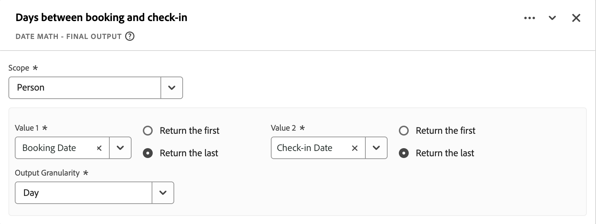

## Caso de uso 2 {#datemath-uc2}

Como analista de marketing de una tienda, quiere saber cuántos días atrás fue la última visita de un cliente a la tienda. La funcionalidad de geolocalización se utiliza en una aplicación móvil y las señalizaciones de la tienda para capturar las visitas físicas de los clientes.

### Campo derivado {#datemath-uc2-derivedfield}

Defina un campo derivado `Days Since Visit To Shop`. Utiliza la función [!UICONTROL DATE MATH] para definir una regla que calcule los días entre una fecha y hora personalizada (que especifica en [!UICONTROL Fecha]) y la [!UICONTROL hora local] (de su grupo de campos [!UICONTROL placeContext] del conjunto de datos de evento) con un [!UICONTROL ámbito de deduplicación] de [!UICONTROL Persona]. Selecciona [!UICONTROL Devolver el último] para garantizar que se use el último valor de ámbito de persona de [!UICONTROL Hora local] en el cálculo. Selecciona Día como [!UICONTROL granularidad de salida].

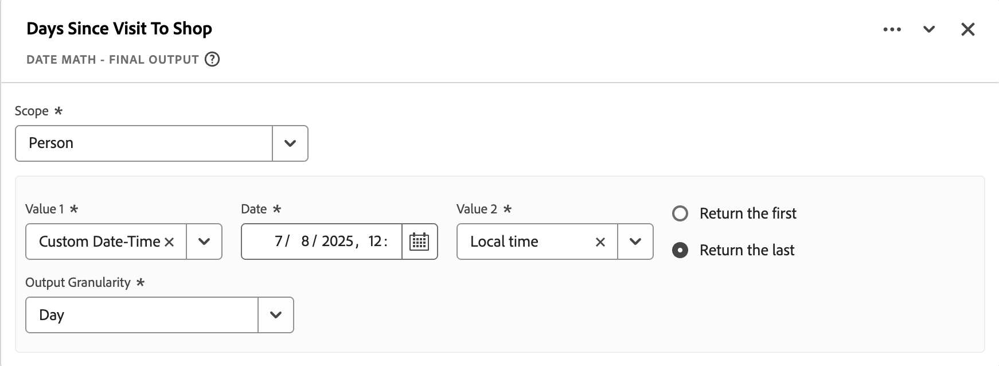

También puede usar el valor de intervalo de fechas dinámico Ahora para calcular entre ahora y la [!UICONTROL Hora local] (de su grupo de campos [!UICONTROL placeContext] de su conjunto de datos de evento)

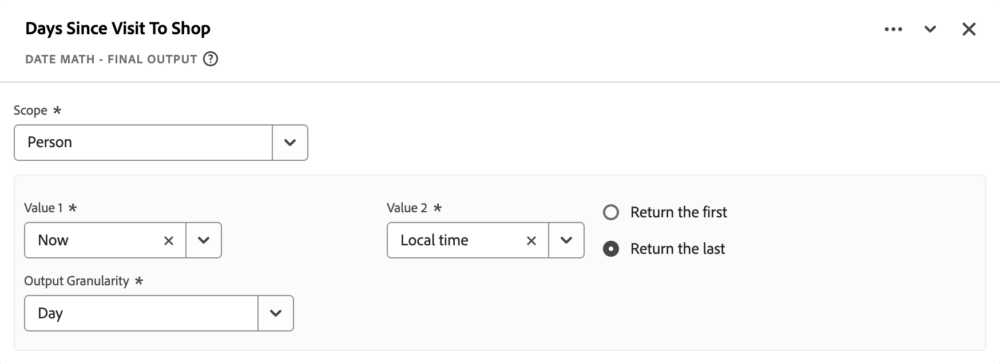 de Date Math

## Caso de uso 3 {#datemath-uc3}

Desea comprender el tiempo de búsqueda en minutos antes de que un cliente, dentro de una sesión, realice un pedido.

Usted define un nuevo campo derivado de `Time Between Search And Order In Minutes` que es el resultado de dos funciones [[!UICONTROL CASE WHEN]](#case-when) para definir valores de [!UICONTROL Tiempo de búsqueda] y [!UICONTROL Tiempo de pedido].
A continuación, utilice estos dos valores para calcular la diferencia con una función [!UICONTROL DATE MATH] con [!UICONTROL Ámbito] establecido en [!UICONTROL Sesión], valores establecidos en [!UICONTROL Tiempo de búsqueda] y [!UICONTROL Tiempo de pedido] y [!UICONTROL Granularidad de salida] establecido en [!UICONTROL Minuto]. Para ambos valores, selecciona [!UICONTROL Devolver el primer] para garantizar que se devuelvan el primer [!UICONTROL Tiempo de búsqueda] y el [!UICONTROL Tiempo de pedido].

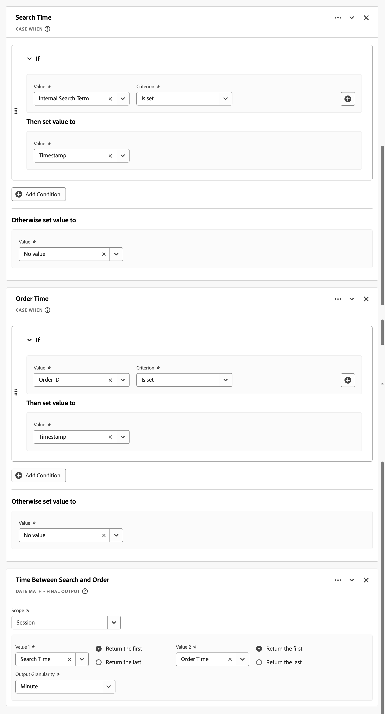

## Más información {#datemath-more-info}

Las opciones de [!UICONTROL Devolver el primer] o [!UICONTROL Devolver el último] no están disponibles cuando selecciona un campo basado en personas (de un conjunto de datos de perfil). Un campo basado en persona solo puede tener un valor para un campo Fecha o Fecha-hora para una persona.
+++

<!-- DEDUPLICATE -->

### Deduplicar {#dedup}

>[!CONTEXTUALHELP]
>id="dataview_derivedfields_deduplicate"
>title="Deduplicar"
>abstract="Esta función proporciona la capacidad de configurar un campo para que solo cuente los valores de forma no repetitiva en el nivel de sesión o de persona. Además, se puede utilizar un ID de anulación de duplicación para garantizar que, en función de un ID determinado (como un ID de compra), solo se emplee un valor (la primera instancia o la última)."

Evita contar un valor varias veces.

+++ Detalles

## Especificaciones {#deduplicate-io}

| Tipo de datos de entrada | Entrada | Operadores incluidos | Limitaciones | Salida |
|---|---|---|---|---|
| <ul><li>Cadena</li><li>Numéricos</li></ul> | <ul><li>[!UICONTROL Valor]:<ul><li>Reglas</li><li>Campos estándar</li><li>Campos</li><li>Cadena</li></ul></li><li>[!UICONTROL Ámbito]:<ul><li>Persona</li><li>Sesión</li></ul></li><li>[!UICONTROL ID de deduplicación]:<ul><li>Reglas</li><li>Campos estándar</li><li>Campos</li><li>Cadena</li></ul><li>[!UICONTROL Valor a mantener]:<ul><li>Mantener primera instancia</li><li>Mantener última instancia</li></ul></li></ul> | 
N/A
 | 
5 funciones por campo derivado
 | 
Nuevo campo derivado
 |

{style="table-layout:auto"}

## Caso de uso 1 {#deduplicate-uc1}

Desea evitar el recuento de ingresos duplicados cuando un usuario vuelve a cargar la página de confirmación de reserva. Utilice el ID de confirmación de reserva en el identificador para no volver a contar los ingresos cuando se reciban en el mismo evento.

### Datos antes {#deduplicate-uc1-databefore}

| ID de confirmación de reserva | Ingresos |
|----|---:|
| ABC123456789 | 359 |
| ABC123456789 | 359 |
| ABC123456789 | 359 |

{style="table-layout:auto"}

### Campo derivado {#deduplicate-uc1-derivedfield}

Defina un campo derivado `Booking Confirmation`. Utilice la función [!UICONTROL DEDUPLICAR] para definir una regla que anule la duplicación del [!UICONTROL Valor] [!DNL Booking] para [!UICONTROL Ámbito] [!DNL Person] mediante el [!UICONTROL ID deduplicación] [!UICONTROL ID de confirmación de reserva]. Seleccione [!UICONTROL Mantener primera instancia] como [!UICONTROL Valor a mantener].

### Datos después {#deduplicate-uc1-dataafter}

| ID de confirmación de reserva | Ingresos |
|----|---:|
| ABC123456789 | 359 |
| ABC123456789 | 0 |
| ABC123456789 | 0 |

{style="table-layout:auto"}

## Caso de uso 2 {#deduplicate-uc2}

Utiliza los eventos como un proxy para las pulsaciones con clic con campañas de marketing externas. Las recargas y redirecciones están ocasionando que la métrica del evento esté inflada. Desea anular la duplicación de la dimensión de código de seguimiento para que solo se recopile la primera y minimizar el recuento excesivo de eventos.

### Datos antes {#deduplicate-uc2-databefore}

| ID de visitante | Canal de marketing | Eventos |
|----|---|---:|
| ABC123 | búsqueda de pago | 1 |
| ABC123 | búsqueda de pago | 1 |
| ABC123 | búsqueda de pago | 1 |
| DEF123 | correo electrónico | 1 |
| DEF123 | correo electrónico | 1 |
| JKL123 | búsqueda natural | 1 |
| JKL123 | búsqueda natural | 1 |

{style="table-layout:auto"}

### Campo derivado {#deduplicate-uc2-derivedfield}

Defina un campo derivado `Tracking Code (deduplicated)`. Utilice la función [!UICONTROL DEDUPLICATE] para definir una regla que anule la duplicación del [!UICONTROL código de seguimiento] con un [!UICONTROL ámbito de deduplicación] de [!UICONTROL Sesión] y [!UICONTROL Mantener la primera instancia] como el [!UICONTROL Valor a mantener].

### Datos después {#deduplicate-uc2-dataafter}

| ID de visitante | Canal de marketing | Eventos |
|----|---|---:|
| ABC123 | búsqueda de pago | 1 |
| DEF123 | correo electrónico | 1 |
| JKL123 | búsqueda natural | 1 |

{style="table-layout:auto"}

+++

<!-- DEPTH -->

### Profundidad {#depth}

>[!CONTEXTUALHELP]
>id="dataview_derivedfields_depth"
>title="Profundidad"
>abstract="Esta función ofrece la posibilidad de devolver la profundidad de cualquier campo, de forma similar a la funcionalidad del componente estándar de profundidad del evento."

Devuelve la profundidad de un campo, similar a lo que es posible con la [dimensión de profundidad de evento estándar](/help/components/dimensions/overview.md#standard-dimensions).

+++ Detalles

## Especificaciones {#depth-io}

| Tipo de datos de entrada | Entrada | Operadores incluidos | Limitaciones | Salida |
|---|---|---|---|---|
| Cualquiera | Cualquier campo | N/A | 3 funciones por campo derivado | Nuevo campo derivado |

{style="table-layout:auto"}

## Caso de uso {#depth-uc1}

Desea comprender la profundidad de la búsqueda interna (que también puede interpretar como el número de búsquedas). Por lo tanto, puede utilizar esa profundidad de búsqueda interna más adelante para desglosar el término de búsqueda asociado con una profundidad de búsqueda específica.

### Campo derivado {#depth-uc1-derivedfield}

Defina un campo derivado `Internal Search Depth`. La función [!UICONTROL DEPTH] se usa para definir una regla con el fin de recuperar la profundidad de [!UICONTROL término de búsqueda interna] y almacenarla en un nuevo campo derivado.

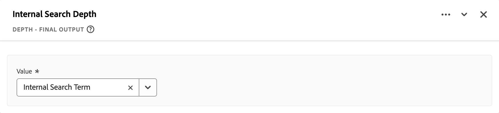

Y luego utilice ese nuevo campo derivado en una visualización para desglosar el término que se ha utilizado para buscar en la primera búsqueda.

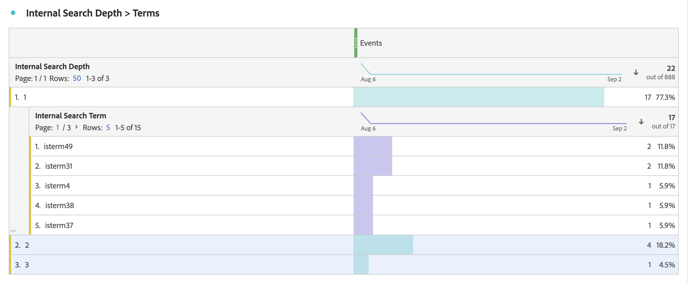

+++

<!-- FIND AND REPLACE -->

### Buscar y reemplazar {#find-and-replace}

<!-- markdownlint-disable MD034 -->

>[!CONTEXTUALHELP]
>id="dataview_derivedfields_findandreplace"
>title="Buscar y reemplazar"
>abstract="Esta función proporciona la capacidad de buscar todos los valores de un campo seleccionado y reemplazarlos con un valor diferente en un nuevo campo derivado."

Busca todos los valores de un campo seleccionado y los reemplaza por un valor diferente en un nuevo campo derivado.

+++ Detalles

## Especificaciones {#findreplace-io}

| Tipo de datos de entrada | Entrada | Operadores incluidos | Limitaciones | Salida |
|---|---|---|---|---|
| <ul><li>Cadena</li></ul> | <ul><li>[!UICONTROL Valor]<ul><li>Reglas</li><li>Campos estándar</li><li>Campos</li></ul></li><li>[!UICONTROL Buscar todo], [!UICONTROL y reemplazar todo por]:<ul><li>Cadena</li></ul></li></ul></ul> | 
Cadenas
<ul><li>[!UICONTROL Buscar todo], [!UICONTROL y reemplazar todo por]</li></ul> | 
5 funciones por campo derivado
 | 
Nuevo campo derivado
 |

{style="table-layout:auto"}

## Caso de uso {#findreplace-uc}

Ha recibido algunos valores con formato incorrecto para su informe de canales de marketing externos, por ejemplo `email%20 marketing` en lugar de `email marketing`. Estos valores con formato incorrecto fracturan los informes y dificultan la visualización del rendimiento del correo electrónico. Desea reemplazar `email%20marketing` por `email marketing`.

**Informe original**

| [!DNL External Marketing Channels] | [!DNL Sessions] |
|---|--:|
| [!DNL email marketing] | 500 |
| [!DNL email %20marketing] | 24 |

{style="table-layout:auto"}

**Informe preferido**

| [!DNL External Marketing Channels] | [!DNL Sessions] |
|---|--:|
| [!DNL email marketing] | 524 |

### Datos antes {#findreplace-uc-databefore}

| [!DNL External Marketing] |
|----|
| [!DNL email marketing] |
| [!DNL email%20marketing] |
| [!DNL email marketing] |
| [!DNL email marketing] |
| [!DNL email%20marketing] |

{style="table-layout:auto"}

### Campo derivado {#findreplace-uc-derivedfield}

Defina un campo derivado `Email Marketing (updated)`. Utilice la función [!UICONTROL BUSCAR Y REEMPLAZAR] para definir una regla que busque y reemplace todas las ocurrencias de `email%20marketing` por `email marketing`.

### Datos después {#findreplace-uc-dataafter}

| [!DNL External Marketing (updated)] |
|----|
| [!DNL email marketing] |
| [!DNL email marketing] |
| [!DNL email marketing] |
| [!DNL email marketing] |
| [!DNL email marketing] |

{style="table-layout:auto"}

+++

<!-- LOOKUP -->

### Consulta {#lookup}

>[!CONTEXTUALHELP]
>id="dataview_derivedfields_lookup"
>title="Consulta"
>abstract="Esta función proporciona la capacidad de utilizar campos de un conjunto de datos de búsqueda mediante una clave coincidente entre conjuntos de datos."

Valores de consulta que utilizan un campo de un conjunto de datos de consulta y devuelven un valor en un nuevo campo derivado o para un procesamiento de reglas adicional.

+++ Detalles

## Especificación {#lookup-io}

| Tipo de datos de entrada | Entrada | Operadores incluidos | Límite | Salida |
|---|---|---|---|---|
| <ul><li>Cadena</li><li>Numéricos</li><li>Fecha</li></ul> | <ul><li>[!UICONTROL Campo al que aplicar la consulta]:</li><ul><li>Reglas</li><li>Campos estándar</li><li>Campos</li></ul><li>[!UICONTROL Conjunto de datos de consulta]</li><ul><li>Conjunto de datos</li></ul><li>[!UICONTROL Clave de coincidencia]<ul><li>Reglas</li><li>Campos</li></ul></li><li>Valores que se deben devolver<ul><li>Reglas</li><li>Campos</li></ul></li></ul> | 
N/A
 | 
3 funciones por campo derivado
 | 
Nuevo campo o valor derivado para un procesamiento posterior en la siguiente regla
 |

{style="table-layout:auto"}

## Caso de uso {#lookup-uc}

Desea consultar el nombre de la actividad mediante el ID de actividad recopilado cuando sus clientes hicieron clic en un banner personalizado mostrado a través de Adobe Target. Desea utilizar un conjunto de datos de consulta con actividades de Analytics for Target (A4T) que contengan ID de actividad y nombres de actividad.

### Conjunto de datos de consulta A4T {#lookup-uc-lookup}

| ID de actividad | Nombre de la actividad |
|---|---|
| 415851 | Páginas de categoría de prueba MVT |
| 415852 | Luma: Campaign Max 2022 |
| 402922 | Banners de la página de inicio |

{style="table-layout:auto"}

### Campo derivado {#lookup-uc-derivedfield}

Defina un campo derivado `Activity Name`. Utilice la función [!UICONTROL CONSULTA] para definir una regla para consultar valor de los datos recopilados, especificados en el campo [!UICONTROL Campo al que aplicar la consulta] (por ejemplo **[!DNL ActivityIdentifier]**). Seleccione el conjunto de datos de consulta de la lista [!UICONTROL Conjunto de datos de consulta] (por ejemplo, **[!DNL New CJA4T Activities]**). A continuación, seleccione el campo de identificador (por ejemplo **[!DNL ActivityIdentifier]**) en la lista [!UICONTROL Clave coincidente] y el campo que se devuelve de la lista [!UICONTROL Valores que se deben devolver] (por ejemplo **[!DNL ActivityName]**).

## Más información {#lookup-more-info}

La función Consulta se aplica en el momento del informe a los datos recuperados por Customer Journey Analytics del conjunto de datos de consulta que se han configurado como parte de la conexión.

Puede insertar rápidamente una función [!UICONTROL Consulta] en el generador de reglas, que ya contiene una o más funciones.

1. Seleccione **[!UICONTROL Campos de esquema]** en el selector.
1. Seleccione  **[!UICONTROL Conjuntos de datos de consulta]**.
1. Seleccione el conjunto de datos de consulta y busque el campo que desee utilizar para la consulta.
1. Arrastre y suelte el campo de consulta en cualquiera de los campos de entrada disponibles para una función (por ejemplo, Case When). Si es válido, un cuadro azul, etiquetado **[!UICONTROL + Añadir]**, le permite soltar el campo e insertar automáticamente una función de consulta antes de la función en la que soltó el campo de consulta. La función de consulta insertada se rellenará automáticamente con valores relevantes para todos los campos.
   

+++

<!-- LOWERCASE -->

### Minúsculas {#lowercase}

>[!CONTEXTUALHELP]
>id="dataview_derivedfields_lowercase"
>title="Minúsculas"
>abstract="Esta función convierte todo el texto de la cadena en valores en minúsculas."

Convierte los valores de un campo a minúsculas y los almacena en un nuevo campo derivado.

+++ Detalles

## Especificación {#lowercase-io}

| Tipo de datos de entrada | Entrada | Operadores incluidos | Límite | Salida |
|---|---|---|---|---|
| <ul><li>Cadena</li><li>Numéricos</li><li>Fecha</li></ul> | <ul><li>[!UICONTROL Campo]</li><ul><li>Reglas</li><li>Campos estándar</li><li>Campos</li></ul> | 
N/A
 | 
2 funciones por campo derivado
 | 
Nuevo campo derivado
 |

{style="table-layout:auto"}

## Caso de uso {#lowercase-uc}

Desea convertir todos los nombres de productos recopilados a minúsculas para un sistema de informes adecuado.

### Datos antes {#lowercase-uc-databefore}

| Nombres de productos recopilados | Vistas del producto |
|---|---:|
| Raqueta de tenis | 35 |
| Raqueta de tenis | 33 |
| raqueta de tenis | 21 |
| Bate de béisbol | 15 |
| Bate de béisbol | 12 |
| bate de béisbol | 10 |

{style="table-layout:auto"}

### Campo derivado {#lowercase-uc-derivedfield}

Defina un campo derivado `Product Names`. Utilice la función [!UICONTROL MINÚSCULAS] para definir una regla que convierta el valor del campo [!UICONTROL Nombres de productos recopilados] a minúsculas y almacene esa información en el nuevo campo derivado.

### Datos después {#lowercase-uc-dataafter}

| Nombres de producto | Vistas del producto |
|---|---|
| raqueta de tenis | 89 |
| bate de béisbol | 37 |

{style="table-layout:auto"}

+++

<!-- MATH -->

### Matemáticas {#math}

>[!CONTEXTUALHELP]
>id="dataview_derivedfields_math"
>title="Matemáticas"
>abstract="Esta función proporciona la capacidad de realizar operaciones matemáticas en un campo. La función se puede aprovechar para realizar operaciones aritméticas básicas, como suma, resta, multiplicación y división."

Utilice operadores matemáticos básicos (sumar, restar, multiplicar, dividir y elevar a una potencia) en campos numéricos.

+++ Detalles

## Especificación {#math-io}

| Tipo de datos de entrada | Entrada | Operadores incluidos | Límite | Salida |
|---|---|---|---|---|
| <ul><li>Numéricos</li></ul> | <ul><li>Uno o varios campos numéricos</li><li>Uno o varios operadores (sumar, restar, multiplicar, dividir, elevar a una potencia)</li><li>Valor de entrada del usuario</li></ul> | <ul><li>`+` (sumar)</li><li>`-` (restar)</li><li>`*` (multiplicar)</li><li>`/` (dividir)</li><li>`^` (elevar a una potencia)</li></ul> | <ul><li>25 operaciones por campo derivado</li><li>5 funciones matemáticas por campo derivado</li></ul> | 
Nuevo campo derivado
 |

{style="table-layout:auto"}

## Caso de uso {#math-uc}

Debido a la inflación, desea corregir las cifras de ingresos de los datos CRM ingeridos con una inflación del 5 %.

### Datos antes {#math-uc-databefore}

| ID de CRM | Ingresos anuales |
|---|---:|
| 1234 | 35.070.000 |
| 4133 | 7.500.000 |
| 8110 | 10.980 |
| 2201 | 42.620 |

{style="table-layout:auto"}

### Campo derivado {#math-uc-derivedfield}

Defina un campo derivado `Corrected Annual Revenue`. Utilice la función [!UICONTROL MATEMÁTICAS] para definir una regla que multiplica el número de ingresos anuales original por 1,05.

### Datos después {#math-uc-dataafter}

| ID de CRM | Ingresos anuales corregidos |
|---|---:|
| 1234 | 36.823.500 |
| 4133 | 7.875.000 |
| 8110 | 11.529.00 |
| 2201 | 44.751 |

{style="table-layout:auto"}

## Más información {#math-more-info}

Para crear una fórmula:

1. Empiece a escribir en el campo Fórmula y los campos numéricos que coincidan con lo que escriba aparecerán en un menú emergente. También puede arrastrar y soltar un campo numérico desde los campos disponibles en el panel izquierdo.
   

1. Añada el operando (por ejemplo `*` para multiplicar) seguido de otro campo o un valor estático. Puede utilizar paréntesis para definir fórmulas más complejas.

1. Para insertar un valor estático (por ejemplo, `1.05`), escriba el valor y seleccione **[!UICONTROL Añadir *x* como valor estático]** o **[!UICONTROL Añadir -*x* como valor estático negativo]** en el menú emergente.
   

1. La marca de verificación verde  indica si la fórmula matemática es válida; de lo contrario, verá una advertencia  y el mensaje [!UICONTROL Expresión de fórmula no válida].
   

Hay algunas consideraciones importantes al trabajar con números estáticos en la función [!UICONTROL MATH]:

- Los valores estáticos deben asociarse con un campo. Por ejemplo, no se admite el uso de la función [!UICONTROL MATH] con solo campos estáticos.
- No se puede usar el operador de subida a alimentación (`ˆ`) en un valor estático.
- Si utiliza varios valores estáticos en una fórmula, estos valores estáticos deben agruparse con paréntesis para que la fórmula sea válida. Por ejemplo:

   - Esta fórmula devuelve un error.
     

   - Esta fórmula es válida.
     

Utilice la función Math para cálculos basados en el nivel de visita. Utilice la función [Resumir](#summarize) para los cálculos basados en el ámbito de evento, sesión o persona.

+++

<!-- MERGE FIELDS -->

### Combinar campos {#merge}

>[!CONTEXTUALHELP]
>id="dataview_derivedfields_mergefields"
>title="Combinar campos"
>abstract="Esta función proporciona la capacidad de tomar valores de dos campos diferentes e incluir sus valores respectivos en una sola dimensión. La regla comprueba primero si se ha establecido el primer valor. Si no, utilizará el segundo valor y así sucesivamente."

Combina valores de dos campos diferentes en un nuevo campo derivado.

+++ Detalles

## Especificación {#merge-fields-io}

| Tipo de datos de entrada | Entrada | Operadores incluidos | Límite | Salida |
|---|---|---|---|---|
| <ul><li>Cadena</li><li>Numéricos</li><li>Fecha</li></ul> | <ul><li>[!UICONTROL Campo]</li><ul><li>Reglas</li><li>Campos estándar</li><li>Campos</li></ul> | 
N/A
 | 
5 funciones por campo derivado
 | 
Nuevo campo derivado
 |

{style="table-layout:auto"}

## Caso de uso {#merge-fields-uc}

Desea crear una dimensión compuesta por el campo de nombre de página y el campo de motivo de la llamada con la intención de analizar el recorrido en los distintos canales.

### Datos antes {#merge-fields-uc-databefore}

| Nombre de página | Sesión | Visitantes |
|---|--:|--:|
| página de ayuda | 250 | 200 |
| página de inicio | 500 | 250 |
| página de detalles del producto | 300 | 200 |

{style="table-layout:auto"}

| Motivo de la llamada | Sesión | Visitantes |
|---|--:|--:|
| preguntas sobre mi pedido | 275 | 250 |
| realizar un cambio en mi pedido | 150 | 145 |
| problema con el pedido | 100 | 95 |

{style="table-layout:auto"}

### Campo derivado {#merge-fields-uc-derivedfield}

Defina un campo derivado `Cross Channel Interactions`. Utilice la función [!UICONTROL COMBINAR CAMPOS] para definir una regla para combinar los valores del campo [!UICONTROL Nombre de página] y el campo [!UICONTROL Motivo de la llamada] y almacenarlos en el nuevo campo derivado.

### Datos después {#merge-fields-uc-dataafter}

| Interacciones entre canales | Sesiones | Visitantes |
|---|--:|--:|
| página de inicio | 500 | 250 |
| página de detalles del producto | 300 | 200 |
| preguntas sobre mi pedido | 275 | 250 |
| página de ayuda | 250 | 200 |
| realizar un cambio en mi pedido | 150 | 145 |
| problema con el pedido | 100 | 95 |

{style="table-layout:auto"}

## Más información {#merge-fields-moreinfo}

Debe seleccionar el mismo tipo de campos dentro de una regla Combinar campos. Por ejemplo, si selecciona un campo Fecha, todos los demás campos que desee combinar deben ser campos Fecha.

+++

<!-- NEXT OR PREVIOUS -->

### Siguiente o anterior {#next-previous}

>[!CONTEXTUALHELP]
>id="dataview_derivedfields_nextprevious"
>title="Siguiente o anterior"
>abstract="Esta función proporciona la capacidad de ver el valor siguiente o anterior recopilado para un campo determinado."

Toma un campo como entrada y resuelve el valor siguiente o anterior de ese campo dentro del ámbito de la sesión o el uso. Esto solo se aplicará a los campos de tabla Visita y Evento.

+++ Detalles

## Especificación {#prevornext-io}

| Tipo de datos de entrada | Entrada | Operadores incluidos | Límite | Salida |
|---|---|---|---|---|
| <ul><li>Cadena</li><li>Numéricos</li><li>Fecha</li></ul> | <ul><li>[!UICONTROL Campo]</li><ul><li>Reglas</li><li>Campos estándar</li><li>Campos</li></ul><li>[!UICONTROL Método]<ul><li>Valor anterior</li><li>Siguiente valor</li></ul></li><li>[!UICONTROL Ámbito]:<ul><li>Persona</li><li>Sesión</li></ul></li><li>[!UICONTROL Índice]:<ul><li>Numéricos</li></ul><li>[!UICONTROL Incluir repeticiones]:<ul><li>Booleano</li></ul></li></ul> | 
N/A
 | 
3 funciones por campo derivado
 | 
Nuevo campo derivado
 |

{style="table-layout:auto"}

## Caso de uso {#prevornext-uc1}

Desea saber cuál es el valor **siguiente** o **anterior** de los datos que recibe, teniendo en cuenta los valores repetidos.

### Datos {#prevornext-uc1-databefore}

**Ejemplo 1: gestión de repeticiones de inclusión**

| Datos recibidos | Siguiente valor Sesión Índice = 1 Incluir repeticiones | Siguiente valor Sesión Índice = 1 NO incluir repeticiones | Valor anterior Sesión Índice = 1 Incluir repeticiones | Valor anterior Sesión Índice = 1 NO incluir repeticiones |
|---|---|---|---|---|
| Inicio | Inicio | búsqueda | *Sin valor* | *Sin valor* |
| Inicio | búsqueda | búsqueda | Inicio | *Sin valor* |
| búsqueda | búsqueda | información del producto | Inicio | Inicio |
| búsqueda | información del producto | información del producto | búsqueda | Inicio |
| información del producto | búsqueda | búsqueda | búsqueda | búsqueda |
| búsqueda | Detalles del producto | información del producto | información del producto | información del producto |
| información del producto | búsqueda | búsqueda | búsqueda | búsqueda |
| búsqueda | búsqueda | *Sin valor* | información del producto | información del producto |
| búsqueda | *Sin valor* | *Sin valor* | búsqueda | información del producto |

{style="table-layout:auto"}

**Ejemplo 2 - Gestión de repeticiones de inclusión con valores en blanco en los datos recibidos**

| Datos recibidos | Siguiente valor Sesión Índice = 1 Incluir repeticiones | Siguiente valor Sesión Índice = 1 NO incluir repeticiones | Valor anterior Sesión Índice = 1 Incluir repeticiones | Valor anterior Sesión Índice = 1 NO incluir repeticiones |
|---|---|---|---|---|
| Inicio | Inicio | búsqueda | *Sin valor* | *Sin valor* |
| Inicio | Inicio | búsqueda | Inicio | *Ningún valor* |
| Inicio | búsqueda | búsqueda | Inicio | *Sin valor* |
| búsqueda | búsqueda | información del producto | Inicio | Inicio |
|   |   |   |   |   |
| búsqueda | búsqueda | información del producto | búsqueda | Inicio |
| búsqueda | información del producto | información del producto | búsqueda | Inicio |
| información del producto | *Ningún valor* | *Sin valor* | búsqueda | búsqueda |
|   |   |   |   |   |

{style="table-layout:auto"}

### Campo derivado {#prevnext-uc1-derivedfield}

Defina un campo derivado `Next Value` o `Previous value`. Utilice la función [!UICONTROL SIGUIENTE O ANTERIOR] para definir una regla que seleccione el campo [!UICONTROL Datos recibidos], seleccione [!UICONTROL Siguiente valor] o [!UICONTROL Valor anterior] como [!UICONTROL Método], [!UICONTROL Sesión] como Ámbito y establezca el valor de [!UICONTROL Índice] en `1`.

## Más información {#prevnext-moreinfo}

Solo puede seleccionar campos que pertenezcan a la tabla Visita o Evento.

[!UICONTROL Repeticiones de inclusión] determina cómo controlar los valores repetidos para la función [!UICONTROL NEXT OR PREVIOUS].

- Incluya repeticiones y los valores siguientes o anteriores. Si se selecciona [!UICONTROL Incluir repeticiones], se omitirán las repeticiones secuenciales de los valores siguientes o anteriores de la visita actual.

- Las filas sin valores (en blanco) para un campo seleccionado no tendrán valores anteriores o siguientes devueltos como parte de la salida de la función [!UICONTROL NEXT O PREVIOUS].

+++

<!-- REGEX REPLACE -->

### Reemplazar regex {#regex-replace}

>[!CONTEXTUALHELP]
>id="dataview_derivedfields_regexreplace"
>title="Reemplazar regex"
>abstract="Esta función proporciona la capacidad de extraer partes de una cadena mediante expresiones regulares."

Reemplaza un valor de un campo mediante una expresión regular en un nuevo campo derivado.

+++ Detalles

## Especificación {#regex-replace-io}

| Tipo de datos de entrada | Entrada | Operadores incluidos | Límite | Salida |
|---|---|---|---|---|
| <ul><li>Cadena</li><li>Numéricos</li></ul> | <ul><li>[!UICONTROL Campo]</li><ul><li>Reglas</li><li>Campos estándar</li><li>Campos</li></ul></ul><ul><li>[!UICONTROL Regex]</li><ul><li>Cadena</li></ul></li><li>[!UICONTROL Formato de salida]:<ul><li>Cadena</li></ul></ul><ul><li>Con distinción de mayúsculas y minúsculas</li><ul><li>Booleano</li></ul></li></ul></li> | 
N/A
 | 
1 función por campo derivado
 | 
Nuevo campo derivado
 |

{style="table-layout:auto"}

## Caso de uso {#regex-replace-uc}

Desea obtener una parte de una dirección URL y utilizarla como identificador de página único para analizar el tráfico. Se usa `[^/]+(?=/$|$)` para la expresión regular a fin de capturar el final de la dirección URL y `$1` como patrón de salida.

### Datos antes {#regex-replace-uc-databefore}

| URL de la página |
|---|
| `https://business.adobe.com/products/analytics/adobe-analytics-benefits.html` |
| `https://business.adobe.com/products/analytics/adobe-analytics.html` |
| `https://business.adobe.com/products/experience-platform/customer-journey-analytics.html` |
| `https://business.adobe.com/products/experience-platform/adobe-experience-platform.html` |

{style="table-layout:auto"}

### Campo derivado {#regex-replace-uc-derivedfield}

Crea un campo derivado de `Page Identifier`. Utiliza la función [!UICONTROL REGEX REPLACE] para definir una regla que reemplace el valor del campo [!UICONTROL URL de referencia] con un [!UICONTROL Regex] de `[^/]+(?=/$|$)` y [!UICONTROL formato de salida] de `$1`.

### Datos después {#regex-replace-uc-dataafter}

| Identificador de la página |
|---|
| adobe-analytics-benefits.html |
| adobe-analytics.html |
| customer-recorrido-analytics.html |
| adobe-experience-platform.html |

## Más información {#regex-replace-more-info}

Customer Journey Analytics utiliza un subconjunto de la sintaxis regex de Perl. Se admiten las expresiones siguientes:

| Expresión | Descripción |
| --- | --- |
| `a` | Un solo carácter `a`. |
| `a\|b` | Un solo carácter `a` o `b`. |
| `[abc]` | Un solo carácter `a`, `b` o `c`. |
| `[^abc]` | Cualquier carácter individual distinto de `a`, `b` o `c`. |
| `[a-z]` | Cualquier carácter individual del intervalo de `a`-`z`. |
| `[a-zA-Z0-9]` | Cualquier carácter individual del intervalo de `a`-`z`, `A`-`Z` o dígitos de `0`-`9`. |
| `^` | Coincide con el principio de la línea. |
| `$` | Coincide con el final de la línea. |
| `\A` | Inicio de cadena. |
| `\z` | Final de cadena. |
| `.` | Coincide con cualquier carácter. |
| `\s` | Cualquier carácter de espacio en blanco. |
| `\S` | Cualquier carácter que no sea un espacio en blanco. |
| `\d` | Cualquier dígito. |
| `\D` | Cualquier carácter que no sea un dígito. |
| `\w` | Cualquier letra, número o guion bajo. |
| `\W` | Cualquier carácter que no sea de palabra. |
| `\b` | Cualquier límite de palabra. |
| `\B` | Cualquier carácter que no sea un límite de palabra. |
| `\<` | Inicio de la palabra. |
| `\>` | Fin de la palabra. |
| `(...)` | Capturar todo lo incluido. |
| `(?:...)` | Captura sin marca. Evita que se haga referencia a la coincidencia en la cadena de salida. |
| `a?` | Cero o uno de `a`. |
| `a*` | Cero o más de `a`. |
| `a+` | Uno más de los `a`. |
| `a{3}` | Exactamente 3 de `a`. |
| `a{3,}` | 3 o más de `a`. |
| `a{3,6}` | Entre 3 y 6 de `a`. |

Puede utilizar estas secuencias en el [!UICONTROL Formato de salida] cualquier número de veces y en cualquier orden para obtener la salida de cadena deseada.

| Secuencia de marcador de posición de salida | Descripción |
| --- | --- |
| `$&` | Genera lo que coincide con toda la expresión. |
| `$n` | Genera lo que coincide con la enésima subexpresión. Por ejemplo, `$1` genera la primera subexpresión. |
| ``$` `` | Genera el texto entre el final de la última coincidencia encontrada (o el inicio del texto si no se encontró ninguna coincidencia anterior) y el inicio de la coincidencia actual. |
| `$+` | Genera lo que coincide con la última subexpresión marcada en la expresión regular. |
| `$$` | Genera el carácter de cadena `"$"`. |

{style="table-layout:auto"}

+++

<!-- SPLIT -->

### División {#split}

>[!CONTEXTUALHELP]
>id="dataview_derivedfields_split"
>title="División"
>abstract="Esta función proporciona la capacidad de dividir un campo en varios campos en función de un delimitador."

Divide un valor de un campo en un nuevo campo derivado.

+++ Detalles

## Especificación {#split-io}

| Tipo de datos de entrada | Entrada | Operadores incluidos | Límite | Salida |
|---|---|---|---|---|
| <ul><li>Cadena</li><li>Numéricos</li></ul> | <ul><li>[!UICONTROL Campo]</li><ul><li>Reglas</li><li>Campos estándar</li><li>Campos</li></ul></ul><ul><li>[!UICONTROL Método]:</li><ul><li>Desde la izquierda</li><li>Desde la derecha</li><li>Convertir en matriz</li></ul></li><li>Para el delimitador:<ul><li>Cadena</li></ul><li>Para el índice:<ul><li>Numéricos</li></ul></li> | 
N/A
 | 
2 funciones por campo derivado
 | 
Nuevo campo derivado
 |

{style="table-layout:auto"}

## Caso de uso 1 {#split-uc1}

Recopile las respuestas de la aplicación en una lista delimitada en una sola dimensión. Desea que cada valor de la lista sea un valor único en el informe de respuestas.

### Datos antes {#split-uc1-databefore}

| Respuestas de la aplicación de voz | Eventos |
|---|--:|
| ha sido genial, tiene todo el sentido del mundo, se lo recomendaré a otras personas | 1 |
| ha sido genial, algo confuso, se lo recomendaré a otras personas | 1 |
| no ha sido genial, muy confuso, no se lo recomendaré a otras personas | 1 |

{style="table-layout:auto"}

### Campo derivado {#split-u1-derivedfield}

Cree un campo derivado `Responses`. Utilice la función [!UICONTROL DIVISIÓN] para definir una regla que use el método [!UICONTROL Convertir en matriz] para convertir los valores del campo [!UICONTROL Respuesta de la aplicación de voz] usando `,` como [!UICONTROL Delimitador].

### Datos después {#split-uc1-dataafter}

| Respuestas | Eventos |
|---|--:|
| ha sido genial | 2 |
| se lo recomendaré a otras personas | 2 |
| no ha sido genial | 1 |
| tiene todo el sentido del mundo | 1 |
| algo confuso | 1 |
| muy confuso | 1 |
| no recomendará a otras personas | 1 |

{style="table-layout:auto"}

## Caso de uso 2 {#split-uc2}

Recopile las respuestas de la aplicación en una lista delimitada en una sola dimensión. Desea las respuestas del primer valor de la lista a su propia dimensión. Desea colocar el último valor de la lista en su propia dimensión.

### Datos antes {#split-uc2-databefore}

| Respuestas | Eventos |
|---|--:|
| fue genial, tiene mucho sentido, recomendará a otros | 1 |
| ha sido genial, algo confuso, se lo recomendaré a otras personas | 1 |
| no ha sido genial, muy confuso, no se lo recomendaré a otras personas | 1 |

{style="table-layout:auto"}

### Campo derivado {#split-u2-derivedfield}

Crea un campo derivado de `First Response`. La función [!UICONTROL SPLIT] se usa para definir una regla que toma el primer valor del campo [!UICONTROL Responses] de la izquierda de la respuesta `,` como delimitador.

Cree un campo derivado de `Second Response` para tomar el último valor del campo [!UICONTROL Respuestas] seleccionando Desde la derecha, 1 como Delimitador y 1 como Índice.

### Datos después {#split-uc2-dataafter}

| Primera respuesta | Eventos |
|---|--:|
| ha sido genial | 2 |
| no ha sido genial | 1 |

{style="table-layout:auto"}

| Segunda respuesta | Eventos |
|---|--:|
| se lo recomendaré a otras personas | 2 |
| no recomendará a otras personas | 1 |

{style="table-layout:auto"}

+++

<!-- SUMMARIZE -->

### Resumir {#summarize}

>[!CONTEXTUALHELP]
>id="dataview_derivedfields_summarize"
>title="Resumir"
>abstract="Esta función proporciona la capacidad de acumular valores en el nivel de evento, sesión o persona. Según el tipo de campo del campo seleccionado, habrá diferentes opciones disponibles."

Aplica funciones de tipo agregación a métricas o dimensiones en los niveles de evento, sesión y usuario. 

+++ Detalles

## Especificación {#summarize-io}

| Tipo de datos de entrada | Entrada | Operadores incluidos | Límite | Salida |
|---|---|---|---|---|
| <ul><li>Cadena</li><li>Numéricos</li><li>Fecha</li></ul> | <ul><li>Valor<ul><li>Reglas</li><li>Campos estándar</li><li>Campos</li></ul></li><li>Resumir métodos</li><li>Ámbito<ul><li>Evento</li><li>Sesión</li><li>Persona</li></ul></li></ul> | <ul><li>Numéricos<ul><li>MAX: devuelve el mayor valor de un conjunto de valores</li><li>MIN: devuelve el valor más pequeño de un conjunto de valores</li><li>MEDIAN: devuelve el valor mediano de un conjunto de valores</li><li>MEAN: devuelve el promedio de un conjunto de valores</li><li>SUM: devuelve la suma de un conjunto de valores</li><li>COUNT: devuelve el número de valores recibidos</li><li>DISTINCT: devuelve un conjunto de valores distintos</li></ul></li><li>Cadenas<ul><li>DISTINCT: devuelve un conjunto de valores distintos</li><li>COUNT DISTINCT: devuelve el número de valores distintos</li><li>MOST COMMON: devuelve el valor de cadena que se recibe con más frecuencia</li><li>LEAST COMMON: devuelve el valor de cadena que se recibe con menor frecuencia</li><li>FIRST: el primer valor recibido; solo aplicable a las tablas de sesión y evento</li><li>LAST: el último valor recibido; solo aplicable a las tablas de sesión y evento</li></ul></li><li>Fechas<ul><li>DISTINCT: devuelve un conjunto de valores distintos</li><li>COUNT DISTINCT: devuelve el número de valores distintos</li><li>MOST COMMON: devuelve el valor de cadena que se recibe con más frecuencia</li><li>LEAST COMMON: devuelve el valor de cadena que se recibe con menor frecuencia</li><li>FIRST: el primer valor recibido; solo aplicable a las tablas de sesión y evento</li><li>LAST: el último valor recibido; solo aplicable a las tablas de sesión y evento</li><li>EARLIEST: el valor más antiguo recibido (determinado por la hora); solo aplicable a las tablas de sesión y evento</li><li>LATEST: el último valor recibido (determinado por la hora); solo aplicable a las tablas de sesión y evento</li></ul></li></ul> | 3 funciones por campo derivado | Nuevo campo derivado |

{style="table-layout:auto"}

## Caso de uso {#summarize-uc}

Desea clasificar Ingresos por adición al carro de compras en tres categorías diferentes: pequeño, mediano y grande. Esto le permite analizar e identificar las características de los clientes de alto valor.

### Datos antes {#summarize-uc-databefore}

Suposiciones:

- Los ingresos por adición al carro de compras se recopilan como un campo numérico.

Escenarios:

- El clienteABC123 añade 35 USD al carro de compras para el ProductoABC y, a continuación, añade por separado el ProductoDEF al carro de compras por 75 USD.
- El ClienteDEF456 añade 50 USD al carro de compras para el ProductoGHI y, a continuación, añade por separado el ProductoJKL al carro de compras por 275 USD.
- El ClienteGHI789 añade 500 USD al carro de compras para el ProductoMNO.

Lógica:

- Si el total de ingresos por adición al carro de compras de un visitante es inferior a 150 USD, establézcalo en Pequeño.
- Si el total de ingresos por adición al carro de compras de un visitante es mayor que 150 USD, pero menor que 500 USD, se debe establecer en Mediano.
- Si el total de ingresos de adición al carro de compras de un visitante es mayor o igual que 500 $, establézcalo en Grande.

Resultados:

- Total de ingresos por adición al carro de compras por 110 $ para CustomerABC123.
- Total de ingresos por adición al carro de compras por 325 $ para CustomerDEF456.
- Total de ingresos por 500 $ para CustomerGHI789.

### Campo derivado {#summarize-uc-derivedfield}

Cree un campo derivado de `Add To Cart Revenue Size`. Utilice la función [!UICONTROL SUMMARIZE] y el [!UICONTROL método Sum] [!UICONTROL Summarize] con [!UICONTROL Scope] establecido en [!UICONTROL Person] para sumar los valores del campo [!UICONTROL cart_add]. A continuación, utilice una segunda regla [!UICONTROL CASE WHEN] para dividir el resultado en los tres tamaños de categoría.

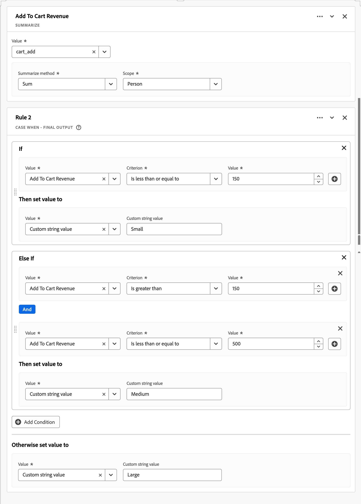

### Datos después {#summarize-uc-dataafter}

| Tamaño de ingresos de adición al carro | Visitantes |
|---|--:|
| Pequeño | 1 |
| Medio | 1 |
| Grande | 1 |

{style="table-layout:auto"}

## Más información {#summarize-more-info}

Utilice la función Resumir para cálculos basados en eventos, sesiones o personas. Utilice la función [Math](#math) para los cálculos basados en el nivel de visita.

+++

<!-- TRIM -->

### Recortar {#trim}

>[!CONTEXTUALHELP]
>id="dataview_derivedfields_trim"
>title="Recortar"
>abstract="Esta función proporciona la capacidad de recortar espacios en blanco o caracteres especiales desde el principio o el final de una cadena. También la capacidad de especificar el número de caracteres que se utilizarán para el valor devuelto, ya sea desde el principio o el final de la cadena."

Recorta los espacios en blanco, los caracteres especiales o el número de caracteres desde el principio o el final de los valores de campo en un nuevo campo derivado.

+++ Detalles

## Especificación {#trim-io}

| Tipo de datos de entrada | Entrada | Operadores incluidos | Límite | Salida |
|---|---|---|---|---|
| <ul><li>Cadena</li></ul> | <ul><li>[!UICONTROL Campo]<ul><li>Reglas</li><li>Campos estándar</li><li>Campos</li></ul></li><li>Recortar espacios en blanco</li><li>Recortar caracteres especiales<ul><li>Entrada de caracteres especiales</li></ul></li><li>Recortar desde la izquierda<ul><li>Desde<ul><li>Inicio de cadena</li><li>Posición<ul><li>Posición #</li></ul></li><li>Cadena<ul><li>Valor de cadena</li><li>Índice</li><li>Indicador para incluir cadena</li></ul></li></ul></li><li>Hasta<ul><li>Fin de cadena</li><li>Posición<ul><li>Posición #</li></ul></li><li>Cadena<ul><li>Valor de cadena</li><li>Índice</li><li>Indicador para incluir cadena</li></ul></li><li>Longitud</li></ul></li></ul></li><li>Recortar por la derecha<ul><li>Desde<ul><li>Fin de cadena</li><li>Posición<ul><li>Posición #</li></ul></li><li>Cadena<ul><li>Valor de cadena</li><li>Índice</li><li>Indicador para incluir cadena</li></ul></li></ul></li><li>Hasta<ul><li>Inicio de cadena</li><li>Posición<ul><li>Posición #</li></ul></li><li>Cadena<ul><li>Valor de cadena</li><li>Índice</li><li>Indicador para incluir cadena</li></ul></li><li>Longitud</li></ul></li></ul></li></ul> | 
N/A
 | 
1 función por campo derivado
 | 
Nuevo campo derivado
 |

## Caso de uso 1 {#trim-uc1}

Recopila los datos del producto, pero esos datos contienen caracteres de espacio en blanco ocultos que fragmentan los informes. Desea recortar fácilmente cualquier espacio en blanco en exceso

### Datos antes {#trim-uc1-databefore}

| ID del producto | Eventos |
|---|--:|
| `"prod12356 "` | 1 |
| `"prod12356"` | 1 |
| `" prod12356"` | 1 |

{style="table-layout:auto"}

### Campo derivado {#trim-u1-derivedfield}

Cree un campo derivado `Product Identifier`. Utilice la función [!UICONTROL RECORTAR] para definir una regla para **[!UICONTROL Recortar espacio en blanco]** desde el campo **[!UICONTROL ID del producto]**.

### Datos después {#trim-uc1-dataafter}

| Identificador de producto | Eventos |
|---|--:|
| `"prod12356"` | 3 |

{style="table-layout:auto"}

## Caso de uso 2 {#trim-uc2}

Los datos sobre los nombres de páginas recopilados incluyen algunos caracteres especiales erróneos al final del nombre de página que deben eliminarse.

### Datos antes {#trim-uc2-databefore}

| Nombre | Eventos |
|---|--:|
| página de inicio# | 1 |
| página de inicio? | 1 |
| página de inicio% | 1 |
| página de inicio&amp; | 1 |
| página de inicio/ | 1 |

{style="table-layout:auto"}

### Campo derivado {#trim-u2-derivedfield}

Cree un campo derivado `Page Name`. Utilice la función [!UICONTROL RECORTAR] para definir una regla para [!UICONTROL Recortar caracteres especiales] del campo [!UICONTROL Nombre] utilizando los [!UICONTROL caracteres especiales] `#?%&/`.

### Datos después {#trim-uc2-dataafter}

| Nombre de página | Eventos |
|---|--:|
| página de inicio | 5 |

{style="table-layout:auto"}

## Caso de uso 3 {#trim-uc3}

Recopile los datos que incluyen un ID de tienda (storeID). El storeID contiene el código de estado de EE. UU. abreviado como los dos primeros caracteres. Solo desea utilizar ese código de estado en los informes.

### Datos antes {#trim-uc3-databefore}

| storeID | Eventos |
|---|--:|
| CA293842 | 1 |
| CA423402 | 1 |
| UT123418 | 1 |
| UT189021 | 1 |
| ID028930 | 1 |
| O234223 | 1 |
| NV22342 | 1 |

{style="table-layout:auto"}

### Campo derivado {#trim-u3-derivedfield}

Cree un campo derivado `Store Identifier`. Utilice la función [!UICONTROL RECORTAR] para definir una regla para [!UICONTROL Truncar por la derecha] el campo [!UICONTROL storeID] desde el final de la cadena hasta la posición `3`.

### Datos después {#trim-uc3-dataafter}

| Identificador de tienda | Eventos |
|---|--:|
| CA | 2 |
| UT | 2 |
| ID | 1 |
| O BIEN | 1 |
| NV | 1 |

{style="table-layout:auto"}

+++

<!-- TYPECASE -->

### Cambiar tipo de campo {#typecast}

>[!CONTEXTUALHELP]
>id="dataview_derivedfields_typecast"
>title="Cambiar tipo de campo"
>abstract="Esta función ofrece la posibilidad de cambiar el tipo de campo sobre la marcha para que esté disponible para transformaciones adicionales en Customer Journey Analytics."

Cambia el tipo de campo de un campo para que esté disponible para transformaciones adicionales en Customer Journey Analytics.

+++ Detalles

## Especificaciones {#typecast-io}

| Tipo de datos de entrada | Entrada | Operadores incluidos | Límite | Salida |
|---|---|---|---|---|
| <ul><li>Numéricos</li><li>Fecha</li><li>Fecha-hora</li><li>Cadena</li></ul> | <ul><li>[!UICONTROL Campo] | 
<ul><li>Entero<ul><li>A cadena</li></ul></li><li>Doble<ul><li>A cadena<ul><li>Incluir el número de decimales que heredar (máximo de 5?)</li></ul></li><li>A entero</li></ul></li><li>Byte<ul><li>A cadena</li></ul></li><li>Largo<ul><li>A cadena</li></ul></li><li>Fecha<ul><li>A cadena<ul><li>Proporcionar la capacidad de definir el formato de salida</li></ul></li><li>Ejemplos<ul><li>Fecha (ejemplo del 7 de enero de 2025)<ul><li data-stringify-indent="1" data-stringify-border="0">MM-DD-AA<ul><li data-stringify-indent="2" data-stringify-border="0">Ejemplo: 01-07-25</li></ul></li><li data-stringify-indent="1" data-stringify-border="0">MM-DD-AAAA<ul><li data-stringify-indent="2" data-stringify-border="0">Ejemplo: 07-01-2025</li></ul></li><li data-stringify-indent="1" data-stringify-border="0">DD-MM-AA<ul><li data-stringify-indent="2" data-stringify-border="0">Ejemplo: 07-01-25</li></ul></li><li data-stringify-indent="1" data-stringify-border="0">DD-MM-AAAA<ul><li data-stringify-indent="2" data-stringify-border="0">Ejemplo: 01-07-2025</li></ul></li><li data-stringify-indent="1" data-stringify-border="0">AA-MM-DD<ul><li data-stringify-indent="2" data-stringify-border="0">Ejemplo: 25-01-07</li></ul></li><li data-stringify-indent="1" data-stringify-border="0">AAAA-MM-DD<ul><li data-stringify-indent="2" data-stringify-border="0">Ejemplo: 07-01-2025</li></ul></li><li data-stringify-indent="1" data-stringify-border="0">MM/DD/AA<ul><li data-stringify-indent="2" data-stringify-border="0">Ejemplo: 01/07/25</li></ul></li><li data-stringify-indent="1" data-stringify-border="0">MM/DD/AAAA<ul><li data-stringify-indent="2" data-stringify-border="0">Ejemplo: 07/01/2025</li></ul></li><li data-stringify-indent="1" data-stringify-border="0">AAAA/MM/DD<ul><li data-stringify-indent="2" data-stringify-border="0">Ejemplo: 2025/01/07</li></ul></li><li data-stringify-indent="1" data-stringify-border="0">AA/MM/DD<ul><li data-stringify-indent="2" data-stringify-border="0">Ejemplo: 25/01/07</li></ul></li><li data-stringify-indent="1" data-stringify-border="0">MMM DD, AAAA<ul><li data-stringify-indent="2" data-stringify-border="0">Ejemplo: miércoles, 07 de enero de 2025</li></ul></li></ul></li></ul></li></ul></li><li>Fecha-hora<ul><li>A cadena<ul><li>Proporcionar la capacidad de definir el formato de salida</li></ul></li><li>Ejemplos<ul><li data-stringify-indent="0" data-stringify-border="0">Fecha-hora (ejemplo del 7 de enero de 2025 a las 1:30pm, 52 segundos)<ul><li data-stringify-indent="2" data-stringify-border="0">DD-MM-AAhhmmss<ul><li data-stringify-indent="3" data-stringify-border="0">Ejemplo: 01-07-25 13:30:52</li></ul></li><li data-stringify-indent="2" data-stringify-border="0">DD/MM/YYYY hhmmss<ul><li data-stringify-indent="3" data-stringify-border="0">Ejemplo: 01-07-2025 13:30:52</li></ul></li><li data-stringify-indent="2" data-stringify-border="0">DD/MM/YY hhmmss<ul><li data-stringify-indent="3" data-stringify-border="0">Ejemplo: 07-01-25 13:30:52</li></ul></li><li data-stringify-indent="2" data-stringify-border="0">DD-MM-AAAA hhmmss<ul><li data-stringify-indent="3" data-stringify-border="0">Ejemplo: 07-01-2025 13:30:52</li></ul></li><li data-stringify-indent="2" data-stringify-border="0">DD-MM-AAhhmmss<ul><li data-stringify-indent="3" data-stringify-border="0">Ejemplo: 25-01-07 13:30:52</li></ul></li><li data-stringify-indent="2" data-stringify-border="0">DD-MM-AAAA hhmmss<ul><li data-stringify-indent="3" data-stringify-border="0">Ejemplo: 07-01-2025 13:30:52</li></ul></li><li data-stringify-indent="2" data-stringify-border="0">DD/MM/AA hhmmss<ul><li data-stringify-indent="3" data-stringify-border="0">Ejemplo: 01/07/25 13:30:52</li></ul></li><li data-stringify-indent="2" data-stringify-border="0">DD/MM/AAAA hhmss<ul><li data-stringify-indent="3" data-stringify-border="0">Ejemplo: 07/01/2025 13:30:52</li></ul></li><li data-stringify-indent="2" data-stringify-border="0">AAAA/MM/DD hhmmss<ul><li data-stringify-indent="3" data-stringify-border="0">Ejemplo: 01/2025/07 13:30:52</li></ul></li><li data-stringify-indent="2" data-stringify-border="0">AA/MM/DD hh:mm :ss<ul><li data-stringify-indent="3" data-stringify-border="0">Ejemplo: 25/01/07 13:30:52</li></ul></li><li data-stringify-indent="2" data-stringify-border="0">DD MMM, AAAA hhmmss<ul><li data-stringify-indent="3" data-stringify-border="0">Ejemplo: 07 de enero de 2025 13:30:52</li></ul></li></ul></li></ul></li><li>Cadena<ul><li>A Numérico<ul><li>Si tenemos valores que no son numéricos, devolverán un valor nulo.</li><li>Necesitaremos que el usuario introduzca la precisión y la configuración regional que desea utilizar. </li></ul></li></ul></li></ul></li></ul>
 | 
3 funciones por campo derivado
 | 
Nuevo campo derivado
 |

{style="table-layout:auto"}

## Caso de uso 1 {#typecast-uc1}

Tiene un campo entero, altura de pantalla (por ejemplo, device.screenHeight del conjunto de datos de evento), que desea utilizar como dimensión basada en cadenas.

### Campo derivado {#typecast-uc1-derivedfield}

Usted define un campo derivado de `Screen Height`. La función [!UICONTROL TYPECAST] se usa para definir una regla para [!UICONTROL Typecast para] [!UICONTROL String] el campo [!UICONTROL Screen height] y almacenarla en el nuevo campo derivado.

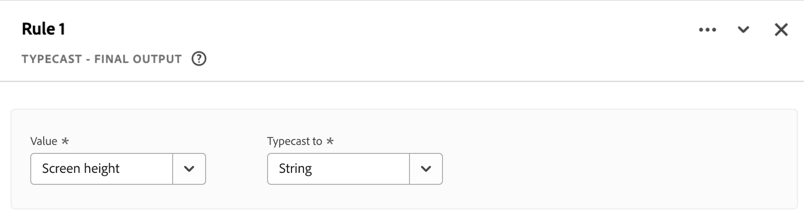

## Caso de uso 2 {#typecast-uc2}

Desea utilizar Revenue en una tabla de cohorte (que sólo admite números enteros), pero el campo Revenue tiene un tipo Double.

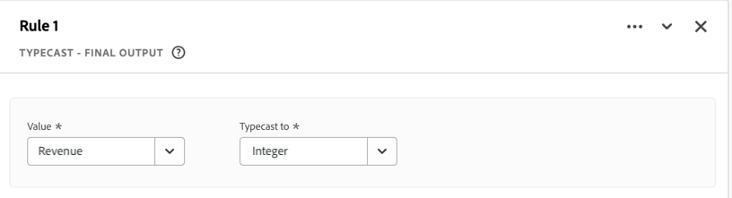

### Campo derivado {#typecast-uc2-derivedfield}

Usted define un campo derivado de `Revenue (integer)`. La función [!UICONTROL TYPECAST] se usa para definir una regla para [!UICONTROL Typecast para] [!UICONTROL Integer] el campo [!UICONTROL Revenue] y almacenarla en el nuevo campo derivado.

+++

<!-- URL PARSE -->

### Análisis de URL {#urlparse}

>[!CONTEXTUALHELP]
>id="dataview_derivedfields_urlparse"
>title="Análisis de URL"
>abstract="Esta función proporciona la capacidad de analizar diferentes partes de una URL, incluidos el host, la ruta o los parámetros de consulta."

Analiza diferentes partes de una dirección URL, incluidos el protocolo, el host, la ruta de acceso o los parámetros de consulta.

+++ Detalles

## Especificaciones {#urlparse-io}

| Tipo de datos de entrada | Entrada | Operadores incluidos | Límite | Salida |
|---|---|---|---|---|
| <ul><li>Cadena</li></ul> | <ul><li>[!UICONTROL Campo]:</li><ul><li>Reglas</li><li>Campos estándar</li><li>Campos</li></ul><li>[!UICONTROL Opción]:<ul><li>[!UICONTROL Obtener protocolo]</li><li>[!UICONTROL Obtener host]</li><li>[!UICONTROL Obtener ruta]</li><li>[!UICONTROL Obtener valor de cadena de consulta]<ul><li>[!UICONTROL Parámetro de consulta]:<ul><li>Cadena</li></ul></li></ul></li><li>[!UICONTROL Obtener valor de hash]</li></ul></li></ul></li></ul> | 
N/A
 | 
5 funciones por campo derivado
 | 
Nuevo campo derivado
 |

{style="table-layout:auto"}

## Caso de uso 1 {#urlparse-uc1}

Solo desea utilizar el dominio de referencia de la dirección URL de referencia como parte del conjunto de reglas de un canal de marketing.

### Datos antes {#urlparse-uc1-databefore}

| [!DNL Referring URL] |
|----|
| `https://www.google.com/` |
| `https://duckduckgo.com/` |
| `https://t.co/` |
| `https://l.facebook.com/` |

{style="table-layout:auto"}

### Campo derivado {#urlparse-uc1-derivedfield}

Usted define un campo derivado de `Referring Domain`. La función [!UICONTROL URL PARSE] se usa para definir una regla para recuperar el host del campo [!UICONTROL URL de referencia] y almacenarla en el nuevo campo derivado.

### Datos después {#urlparse-uc1-dataafter}

| [!DNL Referrer Domain] |
|----|
| [!DNL www.google.com] |
| [!DNL duckduckgo.com] |
| [!DNL t.co] |
| [!DNL l.facebook.com] |

{style="table-layout:auto"}

## Caso de uso 2 {#urlparse-uc2}

Desea usar el valor del parámetro `cid` de una cadena de consulta en un [!DNL Page URL] como parte del resultado de un informe de código de seguimiento derivado.

### Datos antes {#urlparse-uc2-databefore}

| [!DNL Page URL] |
|----|
| `https://www.adobe.com/?cid=abc123` |
| `https://www.adobe.com/?em=email1234&cid=def123` |
| `https://www.adobe.com/landingpage?querystring1=test&test2=1234&cid=xyz123` |

{style="table-layout:auto"}

### Campo derivado {#urlparse-uc2-derivedfield}

Usted define un campo derivado de `Query String CID`. La función [!UICONTROL URL PARSE] se usa para definir una regla que recupere el valor del parámetro de cadena de consulta en el campo [!UICONTROL Page URL], especificando `cid` como parámetro de consulta. El valor de salida se almacena en el nuevo campo derivado.

### Datos después {#urlparse-uc2-dataafter}

| [!DNL Query String CID] |
|----|
| [!DNL abc123] |
| [!DNL def123] |
| [!DNL xyz123] |

{style="table-layout:auto"}

+++

## Limitaciones

Las siguientes limitaciones se aplican a la funcionalidad del Campo derivado en general:

- Puede utilizar un máximo de 10 campos de esquema diferentes (sin incluir los campos estándar) cuando defina reglas para un campo derivado.
   - De este máximo de 10 campos de esquema diferentes, solo se permite un máximo de tres campos de esquema de consulta o esquema de perfil.
- Puede tener un número máximo de campos derivados por conexión de Customer Journey Analytics según el paquete con licencia. Consulte [Descripción del producto](https://helpx.adobe.com/legal/product-descriptions/customer-journey-analytics.html?lang=es){target="_blank"} para obtener más información.

### Resumen de las limitaciones de las funciones

| Función | Limitaciones |
|---|---|
| 
Case When
 | <ul><li>5 funciones Case When por campo derivado</li><li>200 [operadores](#operators) por campo derivado</li></ul> |
| 
Clasificar
 | <ul><li>5 funciones Clasificar por campo derivado</li><li>200 [operadores](#operators) por campo derivado</li></ul> |
| 
Concatenar
 | <ul><li>2 funciones Concatenar por campo derivado</li><li>3 valores por función de concatenación</ul> |
| 
Matemáticas de fechas
 | <ul><li>2 funciones Date Math por campo derivado</li></ul> |
| 
Deduplicar
 | <ul><li>5 Funciones Deduplicar por campo derivado</li></ul> |
| 
Profundidad
 | <ul><li>3 Profundidad funcional por campo derivado</li></ul> |
| 
Buscar y reemplazar
 | <ul><li>2 Funciones Buscar y reemplazar por campo derivado</li></ul> |
| 
Consulta
 | <ul><li>5 Funciones de consulta por campo derivado</li></ul> |
| 
Minúsculas
 | <ul><li>2 funciones Minúsculas por campo derivado</li></ul> |
| 
Matemáticas
 | <ul><li>25 operaciones por campo derivado</li><li>5 funciones matemáticas por campo derivado</li></ul> |
| 
Combinar campos
 | <ul><li>2 funciones Combinar campos por campo derivado</li></ul> |
| 
Siguiente o anterior
 | <ul><li>3 Funciones Siguiente o Anterior por campo derivado</li></ul> |
| 
Reemplazar regex
 | <ul><li>1 función Reemplazar regex por campo derivado</li></ul> |
| 
División
 | <ul><li>2 Dividir funciones por campo derivado</li></ul> |
| 
Resumir
 | <ul><li>3 Funciones Resumir por campo derivado</li></ul> |
| 
Recortar
 | <ul><li>1 función Recortar por campo derivado</li></ul> |
| 
Cambiar tipo de campo
 | <ul><li>3 Funciones de tipografía por campo derivado</li></ul> |
| 
Análisis de URL
 | <ul><li>5 funciones Análisis de URL por campo derivado</li></ul> |

{style="table-layout:auto"}

### Operadores

Un operador en una construcción If o Else If dentro de una función Case When es la combinación de un criterio con **un** valor. Cada valor adicional del criterio se suma al número de operadores.

Por ejemplo, la condición siguiente utiliza 13 operadores.

Un operador de la función Clasificar es una sola entrada para [!UICONTROL Cuando el valor equivale al valor original] [!UICONTROL Reemplazar valor por uno nuevo].

Por ejemplo, la regla Clasificar que se muestra a continuación utiliza 3 operadores.

## Más información {#trim-more-info}

[`Trim`](#trim) y [`Lowercase`](#lowercase) son características que ya están disponibles en la configuración de componentes de [Vistas de datos](../component-settings/overview.md). El uso de campos derivados permite combinar estas funciones para realizar una transformación de datos más compleja directamente en Customer Journey Analytics. Por ejemplo, puede usar `Lowercase` para quitar la distinción entre mayúsculas y minúsculas en un campo de evento y, a continuación, usar [`Lookup`](#lookup) para hacer coincidir el nuevo campo en minúsculas con un conjunto de datos de búsqueda que solo tenga claves en minúsculas. O puede usar `Trim` para quitar caracteres antes de configurar `Lookup` en el nuevo campo.

La compatibilidad con los campos de búsqueda y perfil en los campos derivados permite transformar los datos en función de búsquedas de eventos y atributos de perfil. Esto puede resultar especialmente útil en escenarios B2B con datos de nivel de cuenta en conjuntos de datos de perfil o búsqueda. Además, esta compatibilidad es útil para manipular los datos en campos comunes a partir de datos de búsqueda (como información de campaña y tipo de oferta) o de datos de perfil (como nivel de miembro y tipo de cuenta).

>[!MORELIKETHIS]
>
>- [Blog: Aprovechar al máximo sus datos: un marco para usar campos derivados en Customer Journey Analytics](https://experienceleaguecommunities.adobe.com/t5/adobe-analytics-blogs/making-the-most-of-your-data-a-framework-for-using-derived/ba-p/601670)
>- [Blog: Casos de uso de campos derivados de Customer Journey Analytics](https://experienceleaguecommunities.adobe.com/t5/adobe-analytics-blogs/derived-fields-use-cases-for-customer-journey-analytics/ba-p/601679)
>- [Blog: Mejoras en los campos derivados de Adobe Customer Journey Analytics](https://experienceleaguecommunities.adobe.com/t5/adobe-analytics-blogs/adobe-customer-journey-analytics-derived-fields-enhancements/ba-p/697808)

