# Campos derivados

{{release-limited-testing}}

Los campos derivados son un aspecto importante de la funcionalidad de creación de informes en tiempo real de Customer Journey Analytics (CJA). Un campo derivado permite definir manipulaciones de datos (a menudo complejas) sobre la marcha, mediante un generador de reglas personalizable. A continuación, puede utilizar ese campo derivado como componente (métrica o dimensión) en [Workspace](../../analysis-workspace/home.md) o incluso definir más el campo derivado como un componente en [Vista de datos](../data-views.md).

Los campos derivados pueden ahorrar una cantidad significativa de tiempo y esfuerzo, en comparación con la transformación o manipulación de los datos en otras ubicaciones fuera de CJA. Como [Preparación de datos](https://experienceleague.adobe.com/docs/experience-platform/data-prep/home.html?lang=es), [Data Distiller](https://experienceleague.adobe.com/docs/experience-platform/query/data-distiller/overview.html?lang=en), o dentro de sus propios procesos de carga de transformación de extracción (ETL) / transformación de carga de extracción (ELT).

Los campos derivados se definen en [Vistas de datos](../data-views.md), se basan en un conjunto de funciones definidas como reglas y se aplican a los campos de esquema o estándar disponibles.

Algunos casos de uso son:

- Defina un campo Nombre de página derivado que corrija los valores incorrectos de nombre de página recopilados para corregir los valores de nombre de página.

- Defina un campo de canal de marketing derivado que determine el canal de marketing adecuado en función de una o varias condiciones (por ejemplo, parámetro de URL, dirección URL de página, nombre de página).

## Interfaz de campo derivada

Cuando se crea o edita un campo derivado, se utiliza la interfaz de campo derivado.

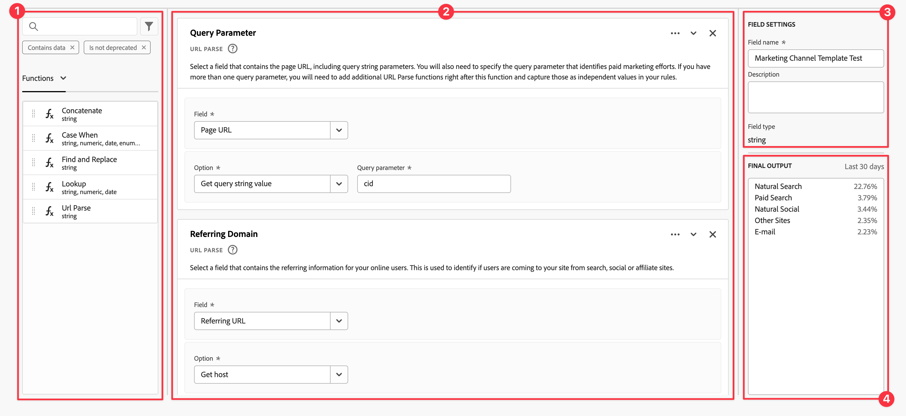

|  | Nombre | Descripción |
|---------|----------|--------|
| 1 | **Selector** | Utilice el área de selector para seleccionar y arrastrar la función, la plantilla de función, el campo de esquema o el campo estándar y colocarlos en el generador de reglas.  Utilice la lista desplegable para seleccionar entre:   [!UICONTROL Funciones] - listas disponibles [Funciones](#function-reference),   [!UICONTROL Plantillas de funciones] - listas disponibles [plantillas de función](#function-templates),    [!UICONTROL Campos de esquema] : enumera los campos disponibles en las categorías de conjuntos de datos (evento, perfil, búsqueda) y los campos derivados definidos anteriormente, y   [!UICONTROL Campos estándar] : campos disponibles estándar (como ID de conjunto de datos de Platform). En el selector solo se muestran los campos estándar numéricos y de cadena. Si la función admite otros tipos de datos, se pueden seleccionar campos estándar con estos otros tipos de datos para valores o campos dentro de la interfaz de regla. Puede buscar funciones, plantillas de funciones, esquemas y campos estándar mediante  Cuadro de búsqueda.  Puede filtrar la lista de objetos seleccionados seleccionando  Filtre y especifique filtros en [!UICONTROL Filtrar campos por] diálogo. Puede quitar filtros fácilmente mediante  para cada filtro. |
| 2 | **Generador de reglas** | El campo derivado se genera secuencialmente utilizando una o más reglas. Una regla es una implementación específica de una función y, por lo tanto, siempre se asocia con una sola función. Para crear una regla, arrastre y suelte una función en el generador de reglas. El tipo de función determina la interfaz de la regla. Consulte la [Interfaz de regla](#rule-interface) para obtener más información.  Puede insertar una función al principio, al final o entre reglas que ya estén disponibles en el generador de reglas. La última regla del generador de reglas determina el resultado final del campo derivado. |
| 3 | **[!UICONTROL ** Configuración de campo **]** | Puede asignar un nombre al campo derivado, describirlo e inspeccionar su tipo de campo. |
| 4 | **[!UICONTROL ** Salida final **]** | Esta área muestra una previsualización actualizada sobre la marcha de los valores de salida, basada en los datos de los últimos 30 días y los cambios realizados en el campo derivado del generador de reglas. |

{style="table-layout:auto"}

## Asistente de plantilla de campo

Cuando accede a la interfaz de campos derivada por primera vez, la variable [!UICONTROL Empezar con una plantilla de campo] se muestra el asistente.

1. Seleccione la plantilla que mejor describa el tipo de campo que está intentando crear.
2. Seleccione el **[!UICONTROL ** Seleccionar **]** para continuar.

El cuadro de diálogo de campo derivado se rellena con reglas (y funciones) necesarias o útiles para el tipo de campo seleccionado. Consulte [Plantillas de funciones](#function-templates) para obtener más información sobre las plantillas disponibles.

## Interfaz de regla

Cuando define una regla en el generador de reglas, utiliza la interfaz de reglas.

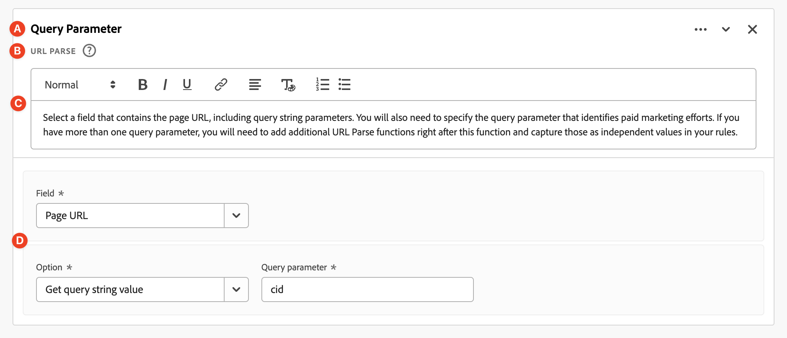

|  | Nombre | Descripción |
|---------|----------|--------|
| A | **Nombre de regla** | De forma predeterminada, el nombre de la regla es **Regla X** (X hace referencia a un número de secuencia). Para editar el nombre de una regla, seleccione su nombre y escriba el nuevo nombre, por ejemplo `Query Parameter`. |
| B | **Nombre de función** | El nombre de función seleccionado para la regla, por ejemplo [!UICONTROL ANÁLISIS DE URL]. Cuando la función es la última de la secuencia de funciones y determina los valores de salida finales, el nombre de la función va seguido de [!UICONTROL - SALIDA FINAL], por ejemplo [!UICONTROL ANÁLISIS DE URL: SALIDA FINAL].  Para mostrar una ventana emergente con más información sobre la función, seleccione . |
| C | **Descripción de regla** | Si lo desea, puede agregar una descripción a una regla. Seleccionar , luego seleccione **[!UICONTROL ** Agregar descripción **]** para añadir una descripción o **[!UICONTROL ** Editar descripción **]** para editar una descripción existente. Utilice el editor para introducir una descripción. Puede utilizar la barra de herramientas para dar formato al texto (mediante el selector de estilo, negrita, cursiva, subrayado, derecha, izquierda, centrado, color, lista de números, lista de viñetas) y agregar vínculos a información externa.  Para terminar de editar la descripción, haga clic fuera del editor. |
| D | **Área de funciones** | Define la lógica de la función. La interfaz depende del tipo de función. El menú desplegable de [!UICONTROL Campo] o [!UICONTROL Valor] muestra todas las categorías de campos (reglas, campos estándar, campos) disponibles, según el tipo de entrada que espera la función. Consulte [Referencia de función](#function-reference) en información detallada para cada una de las funciones admitidas. |

{style="table-layout:auto"}

## Crear un campo derivado

1. Seleccione una vista de datos existente o cree una vista de datos. Consulte [Vistas de datos](../data-views.md) para obtener más información.

2. Seleccione el **[!UICONTROL ** Componentes **]** de la vista de datos.

3. Seleccionar **[!UICONTROL ** Crear campo derivado **]** desde el carril izquierdo.

4. Para definir el campo derivado, utilice el [!UICONTROL Crear campo derivado] interfaz. Consulte [Interfaz de campo derivada](#derived-field-interface).

   Para guardar el nuevo campo derivado, seleccione **[!UICONTROL ** Guardar **]**.

5. El nuevo campo derivado se agregará al [!UICONTROL Campos derivados >] contenedor, como parte de **[!UICONTROL ** Campos de esquema **]** en el carril izquierdo de la vista Datos.

## Editar un campo derivado

1. Seleccione una vista de datos existente. Consulte [Vistas de datos](../data-views.md) para obtener más información.

2. Seleccione el **[!UICONTROL ** Componentes **]** de la vista de datos.

3. Seleccionar **[!UICONTROL ** Campos de esquema **]** en la pestaña [!UICONTROL Conexión] panel de la izquierda.

4. Seleccionar **[!UICONTROL ** Campos derivados >**]** contenedor.

5. Pase el ratón sobre el campo derivado que desee editar y seleccione .

6. Para editar el campo derivado, utilice el [!UICONTROL Editar campo derivado] interfaz. Consulte [Interfaz de campo derivada](#derived-field-interface).

   - Seleccionar **[!UICONTROL ** Guardar **]** para guardar el campo derivado actualizado.

   - Seleccionar **[!UICONTROL ** Cancelar **]** para cancelar los cambios realizados en el campo derivado.

   - Seleccionar **[!UICONTROL ** Guardar como **]** para guardar el campo derivado como un nuevo campo derivado. El nuevo campo derivado tiene el mismo nombre que el campo derivado editado original con `(copy)` se le ha añadido.

## Eliminar un campo derivado

1. Seleccione una vista de datos existente. Consulte [Vistas de datos](../data-views.md) para obtener más información.

2. Seleccione el **[!UICONTROL ** Componentes **]** de la vista de datos.

3. Seleccionar **[!UICONTROL ** Campos de esquema **]** pestaña en [!UICONTROL Conexión] panel.

4. Seleccionar **[!UICONTROL ** Campos derivados >**]** contenedor.

5. Pase el ratón sobre el campo derivado que desee eliminar y seleccione .

6. En el **[!UICONTROL ** Editar campo derivado **]** interfaz, seleccione Eliminar.

   A [!UICONTROL Eliminar componente] El cuadro de diálogo le pedirá que confirme la eliminación. Considere cualquier referencia externa que pueda existir al campo derivado fuera de la vista de datos.

   - Seleccionar **[!UICONTROL ** Continuar **]** para eliminar el campo derivado.

>[!NOTE]
>
>Los campos derivados se administran a nivel de conexión en CJA. Cualquier cambio realizado en un campo derivado en cualquiera de las vistas de datos asociadas con esa conexión se aplica a todas estas vistas de datos asociadas.

## Plantillas de funciones

Para crear rápidamente un campo derivado para casos de uso específicos, hay plantillas de función disponibles. Se puede acceder a estas plantillas de función desde el área de selector de la interfaz de campo derivada o se presentan al utilizarlas por primera vez en el [!UICONTROL Empezar con una plantilla de campo] asistente.

### Canales de marketing

Esta plantilla está configurada para utilizar el [Análisis de URL](#dnl-url-parse) y [Caso Cuándo](#dnl-case-when) funciona varias veces para obtener los valores adecuados de una dirección URL. A continuación, se aplica lógica a estos valores para asociar la URL a un canal de marketing específico.

+++ Detalles

Para utilizar la plantilla, debe especificar los parámetros correctos para cada función enumerada como parte de las reglas de la plantilla. Consulte [Referencia de función](#function-reference) para obtener más información.

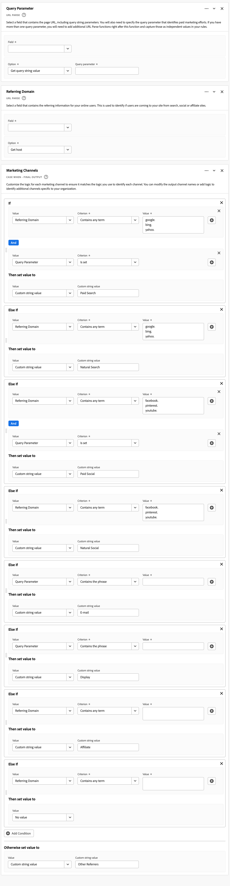

+++

<!--

+++ Data clean up template

>[!WARNING]
>
>Could not find any information on this template.
+++

-->

## Referencia de función

Para cada función admitida, busque los detalles siguientes en:

- especificaciones:
   - tipo de datos de entrada: tipo de datos admitidos,
   - input: posibles valores para input,
   - operadores incluidos: operadores admitidos para esta función (si los hay),
   - limitaciones: limitaciones que se aplican a esta función específica,
   - salida.

- casos de uso, incluidos:
   - datos antes de definir el campo derivado,
   - cómo definir el campo derivado,
   - después de definir el campo derivado.

- restricciones (si procede).

<!-- Concatenate -->

### Concatenar

Combina dos o más campos, campos derivados o valores introducidos por el usuario en un único campo con delimitadores definidos.

+++ Detalles

## Especificaciones {#concatenate-io}

| Tipo de datos de entrada | Entrada | Operadores incluidos | Limitaciones | Output |
|---|---|---|---|---|
| 
Cadena
 | <ul><li>Para cada [!UICONTROL Valor]:<ul><li>Regla</li><li>Campo estándar</li><li>Campo</li><li>Entrada introducida por el usuario</li></ul></li><li>Para cada [!UICONTROL Delimitador]:<ul><li>Entrada introducida por el usuario</li></ul></li> </ul> | 
N/A
 | 
2 funciones por campo derivado
 | 
Nuevo campo derivado
 |

{style="table-layout:auto"}

## Caso de uso {#concatenate-uc}

Actualmente, recopila los códigos de aeropuerto de origen y destino como campos independientes. Desea tomar los dos campos y combinarlos en una sola dimensión separada por un guion (-). Por lo tanto, puede analizar la combinación de origen y destino para identificar las rutas principales reservadas.

Suposiciones:

- Los valores de origen y destino se recopilan en campos independientes en la misma tabla.
- El usuario determina si se debe utilizar el delimitador &quot;-&quot; entre los valores.

Imagine que se producen las siguientes reservas:

- El cliente ABC123 reserva un vuelo entre Salt Lake City (SLC) y Orlando (MCO)
- Cliente ABC456 reserva un vuelo entre Salt Lake City (SLC) y Los Ángeles (LAX)
- Cliente ABC789 reserva un vuelo entre Salt Lake City (SLC) y Seattle (SEA)
- Cliente ABC987 reserva un vuelo entre Salt Lake City (SLC) y San José (SJO)
- Cliente ABC654 reserva un vuelo entre Salt Lake City (SLC) y Orlando (MCO)

El informe deseado debería tener un aspecto similar al siguiente:

| Origen/Destino | Reservas |
|----|---:|
| SLC-MCO | 2 |
| SLC-LAX | 1 |
| SLC-SEA | 1 |
| SLC-SJO | 1 |

{style="table-layout:auto"}

### Datos anteriores {#concatenate-uc-databefore}

| Origen | Destino |
|----|---:|
| SLC | MCO |
| SLC | LAXO |
| SLC | SEA |
| SLC | SJO |
| SLC | MCO |

{style="table-layout:auto"}

### Campo derivado {#concatenate-derivedfield}

Usted define una nueva [!UICONTROL Origin - Destino] campo derivado. Utilice el [!UICONTROL CONCATENAR] función para definir una regla para concatenar el [!UICONTROL Original] y [!UICONTROL Destino] campos con el `-` [!UICONTROL Delimitador].

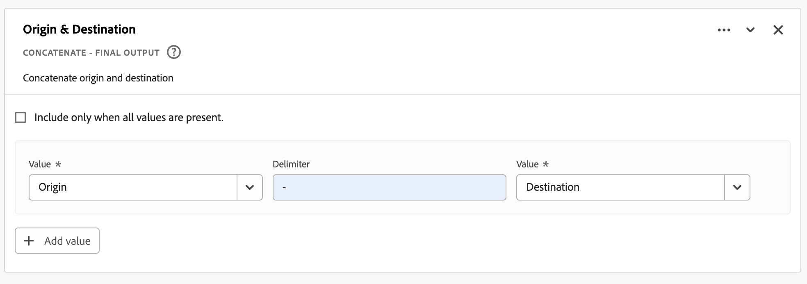

### Datos después de {#concatenate-dataafter}

| Origin - Destino (campo derivado) |
|---|
| SLC-MCO |
| SLC-LAX |
| SLC-SEA |
| SLC-SJO |
| SLC-MCO |

{style="table-layout:auto"}

+++

<!-- CASE WHEN -->

### Caso de que

Aplica condicionales, según los criterios definidos en uno o varios campos. Estos criterios se utilizan para definir los valores en un nuevo campo derivado, según la secuencia de las condiciones.

+++ Detalles

## Especificaciones {#casewhen-io}

| Tipo de datos de entrada | Entrada | Operadores incluidos | Limitaciones | Output |
|---|---|---|---|---|
| <ul><li>Cadena</li><li>Numéricos</li><li>Fecha</li></ul> | <ul><li>Para cada [!UICONTROL If], [!UICONTROL Else If] contenedor:
<ul><li>[!UICONTROL Valor]</li><ul><li>Regla</li><li>Campo estándar</li><li>Campo</li></ul><li>[!UICONTROL Criterio] (consulte operadores incluidos, según el tipo de valor seleccionado)</li></ul></li><li>Para cada [!UICONTROL Luego establezca el valor en], [!UICONTROL De lo contrario, establezca el valor en]:
<ul><li>[!UICONTROL Valor]</li><ul><li>Regla</li><li>Campo estándar</li><li>Campo</li></ul></ul></li></ul> | 
Cadenas
<ul><li>Es igual a</li><li>Es igual a cualquier término</li><li>Contiene la frase</li><li>Contiene cualquier término</li><li>Contiene todos los términos</li><li>Comienza con</li><li>Comienza con cualquier término</li><li>Finaliza con</li><li>Finaliza con cualquier término</li><li>No es igual a</li><li>No coincide con ningún término</li><li>No contiene la frase</li><li>No contiene ningún término</li><li>No contiene todos los términos</li><li>No comienza con</li><li>No comienza con ningún término</li><li>No finaliza con</li><li>No termina con ningún término</li><li>Se ha establecido</li><li>No se ha establecido</li></ul>
Numéricos
<ul><li>Es igual a</li><li>No es igual a</li><li>Es mayor que</li><li>Es mayor que o igual a</li><li>Es menor que</li><li>Es menor que o igual a</li><li>Se ha establecido</li><li>No se ha establecido</li></ul>
Fechas
<ul><li>Es igual a</li><li>No es igual a</li><li>Es posterior a</li><li>Es posterior o igual a</li><li>Es anterior a</li><li>Es anterior o igual a</li><li>Se ha establecido</li><li>No se ha establecido</li></ul> | <ul><li>5 funciones por campo derivado</li><li>200 operadores por campo derivado. Un ejemplo de operador único es &quot;El dominio de referencia contiene Google&quot;. </li></ul> | 
Nuevo campo derivado
 |

{style="table-layout:auto"}

## Caso de uso 1 {#casewhen-uc1}

Desea definir reglas para identificar varios canales de marketing aplicando una lógica en cascada para establecer un campo de canal de marketing en el valor adecuado:

- Si el referente es de un motor de búsqueda y la página tiene un valor de cadena de consulta donde `cid` contains `ps_`, el canal de marketing debe identificarse como [!DNL *Búsqueda de pago*].
- Si el referente es de un motor de búsqueda y la página no tiene la cadena de consulta `cid`, el canal de marketing debe identificarse como [!DNL *Búsqueda natural*].
- Si una página tiene un valor de cadena de consulta donde `cid` contains `em_`, el canal de marketing debe identificarse como un [!DNL *Correo electrónico*].
- Si una página tiene un valor de cadena de consulta donde `cid` contains `ds_`, el canal de marketing debe identificarse como [!DNL *Publicidad en pantalla*].
- Si una página tiene un valor de cadena de consulta donde `cid` contains `so_`, el canal de marketing debe identificarse como [!DNL *Social de pago*].
- Si el referente es de un dominio de referencia de [!DNL twitter.com], [!DNL facebook.com], [!DNL linkedin.com], o [!DNL tiktok.com], el canal de marketing debe identificarse como [!DNL *Social natural*].
- Si ninguna de las reglas anteriores coincide, el canal de marketing debe identificarse como [!DNL *Otro referente*].

En caso de que el sitio reciba los siguientes eventos de muestra, que contienen [!UICONTROL Referente] y [!UICONTROL URL de página]Sin embargo, estos eventos deben identificarse de la siguiente manera:

| [!DNL Event] | [!DNL Referrer] | [!DNL Page URL] | [!DNL Marketing Channel] |
|:--:|----|----|----|
| 1 | `https://facebook.com` | `https://site.com/home` | [!DNL Natural Social] |
| 2 | `https://abc.com` | `https://site.com/?cid=ds_12345678` | [!DNL Display] |
| 3 |  | `https://site.com/?cid=em_12345678` | [!DNL Email] |
| 4 | `https://google.com` | `https://site.com/?cid=ps_abc098765` | [!DNL Paid Search] |
| 5 | `https://google.com` | `https://site.com/?cid=em_765544332` | [!DNL Email] |
| 6 | `https://google.com` |  | [!DNL Natural Search] |

{style="table-layout:auto"}

### Datos anteriores {#casewhen-uc1-databefore}

| [!DNL Referrer] | [!DNL Page URL] |
|----|----|
| `https://facebook.com` | `https://site.com/home` |
| `https://abc.com` | `https://site.com/?cid=ds_12345678` |
|  | `https://site.com/?cid=em_12345678` |
| `https://google.com` | `https://site.com/?cid=ps_abc098765` |
| `https://google.com` | `https://site.com/?cid=em_765544332` |
| `https://google.com` |

{style="table-layout:auto"}

### Campo derivado {#casewhen-uc1-derivedfield}

Usted define una nueva `Marketing Channel` campo derivado. Utilice el [!UICONTROL CASO CUÁNDO] funciones para definir reglas que creen valores para en función de los valores existentes para `Page URL` y `Referring URL` field.

Observe el uso de la función [!UICONTROL ANÁLISIS DE URL] para definir reglas para recuperar los valores de `Page Url` y `Referring Url` antes del [!UICONTROL CASO CUÁNDO] se aplican las reglas de.

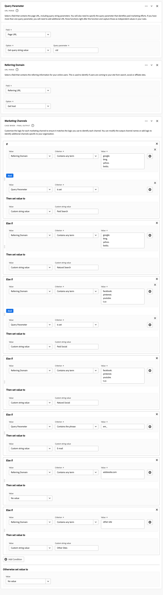

### Datos después de {#casewhen-uc1-dataafter}

| [!DNL Marketing Channel] |
|----|
| [!DNL Natural Social] |
| [!DNL Display] |
| [!DNL Email] |
| [!DNL Paid Search] |
| [!DNL Email] |
| [!DNL Natural Search] |

{style="table-layout:auto"}

## Caso de uso 2 {#casewhen-uc2}

Ha recopilado varias variaciones diferentes de búsquedas dentro de su [!DNL Product Finding Methods] dimensión. Para comprender el rendimiento general de la búsqueda frente a la exploración, debe dedicar una buena cantidad de tiempo a combinar los resultados manualmente.

Su sitio recopila los siguientes valores para su [!DNL Product Finding Methods] dimensión. Al final, todos estos valores indican una búsqueda.

| Valor recopilado | Valor real |
|---|---|
| [!DNL search p13n_no] | [!DNL search] |
| [!DNL search p13n_yes] | [!DNL search] |
| [!DNL search refine p13n_no] | [!DNL search] |
| [!DNL search refine p13n_yes ] | [!DNL search] |
| [!DNL search redirect p13n_yes] | [!DNL search] |
| [!DNL search-redirect] | [!DNL search] |

{style="table-layout:auto"}

### Datos anteriores {#casewhen-uc2-databefore}

| [!DNL Product Finding Methods] |
|----|
| [!DNL search p13_no] |
| [!DNL search p13_yes] |
| [!DNL browse] |
| [!DNL search refine p13_no] |
| [!DNL search refine p13_yes] |
| [!DNL browse] |
| [!DNL search redirect p13_yes] |
| [!DNL search-redirect] |
| [!DNL browse] |

{style="table-layout:auto"}

### Campo derivado {#casewhen-uc2-derivedfield}

Usted define un `Product Finding Methods (new)` campo derivado. Puede crear lo siguiente [!UICONTROL CASO CUÁNDO] reglas en el generador de reglas. Estas reglas aplican lógica a todas las variaciones posibles de lo antiguo [!UICONTROL Métodos de búsqueda de productos] valores de campo para `search` y `browse` uso del [!UICONTROL Contiene la frase] criterio.

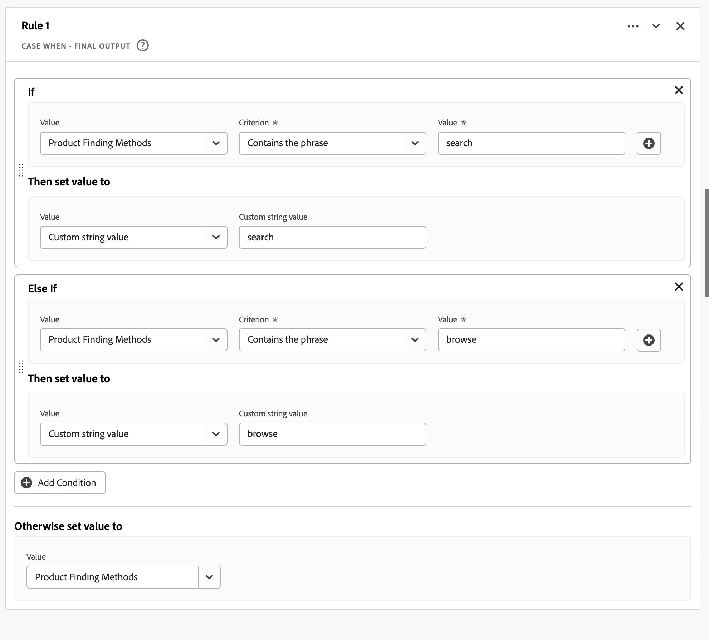

### Datos después de {#casewhen-uc2-dataafter}

| [!DNL Product Finding Methods (new)] |
|----|
| [!DNL search] |
| [!DNL search] |
| [!DNL browse] |
| [!DNL search] |
| [!DNL search] |
| [!DNL browse] |
| [!DNL search] |
| [!DNL search] |
| [!DNL browse] |

{style="table-layout:auto"}

## Caso de uso 3 {#casewhen-uc3}

Como empresa de viajes, le gustaría agrupar la duración del viaje en viajes reservados para poder informar sobre la duración total de los viajes.

Suposiciones:

- La organización está recopilando la duración del viaje en un campo numérico.
- Les gustaría agrupar las duraciones de 1 a 3 días en un contenedor llamado &#39;[!DNL short trip]&#39;
- Les gustaría agrupar las duraciones de 4 a 7 días en un contenedor llamado &#39;[!DNL medium trip]&#39;
- Les gustaría agrupar duraciones de más de 8 días en un contenedor llamado &quot;[!DNL long trip]&#39;
- Se reservaron 132 viajes para un día de duración
- Se reservaron 110 viajes para una duración de 2 días
- Se reservaron 105 viajes para una duración de 3 días
- Se reservaron 99 viajes para una duración de 4 días
- Se reservaron 92 viajes para una duración de 5 días
- Se reservaron 85 viajes para una duración de 6 días
- Se reservaron 82 viajes para una duración de 7 días
- Se reservaron 78 viajes para una duración de 8 días
- Se reservaron 50 viajes para una duración de 9 días
- Se reservaron 44 viajes para una duración de 10 días
- Se reservaron 38 viajes para una duración de 11 días
- Se reservaron 31 viajes para una duración de 12 días

El informe deseado debería tener un aspecto similar al siguiente:

| [!DNL Trip Duration Type] | [!DNL Bookings] |
|----|---:|
| [!DNL medium trip] | 358 |
| [!DNL short trip] | 347 |
| [!DNL long trip] | 241 |

{style="table-layout:auto"}

### Datos anteriores {#casewhen-uc3-databefore}

| [!DNL Trip Duration] |
|---:|
| 1 |
| 12 |
| 3 |
| 6 |
| 4 |
| 8 |
| 6 |
| 2 |
| 1 |
| 2 |
| 21 |
| 8 |

### Campo derivado {#casewhen-uc3-derivedfield}

Usted define un `Trip Duration (bucketed)` campo derivado. Puede crear lo siguiente [!UICONTROL CASO CUÁNDO] regla en el generador de reglas. Esta regla aplica lógica al contenedor del antiguo [!UICONTROL Duración del viaje] Valores de campo en tres valores: `short trip`, `medium  trip`, y `long trip`.

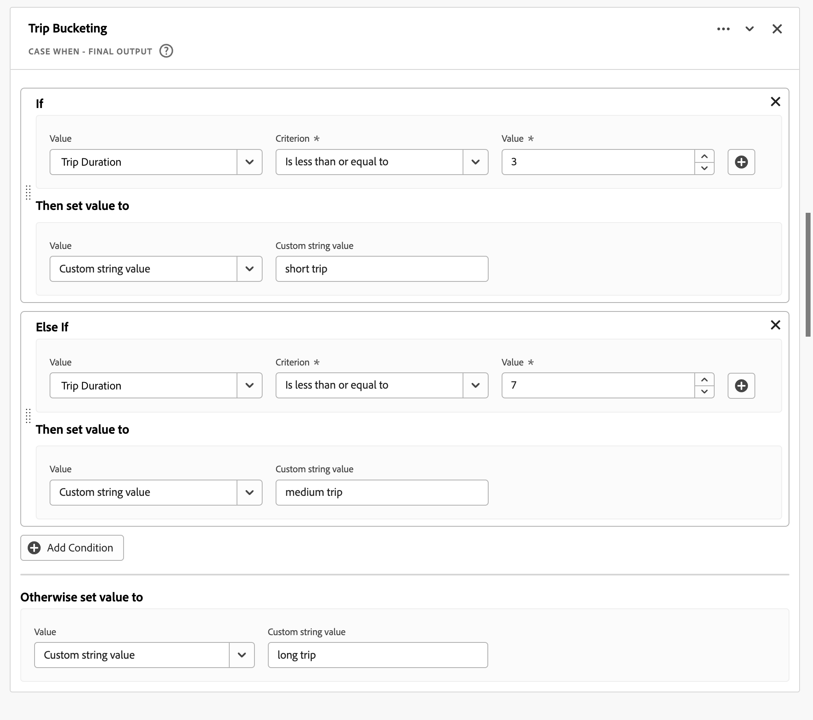

### Datos después de {#casewhen-uc3-dataafter}

| [!DNL Trip Duration (bucketed)] |
|---|
| [!DNL short trip] |
| [!DNL long trip] |
| [!DNL short trip] |
| [!DNL medium trip] |
| [!DNL medium trip] |
| [!DNL long trip] |
| [!DNL medium trip] |
| [!DNL short trip] |
| [!DNL short trip] |
| [!DNL short trip] |
| [!DNL long trip] |
| [!DNL long trip] |

## Restricciones

CJA utiliza una estructura de contenedor anidada, siguiendo el modelo de Adobe Experience Platform [XDM](https://experienceleague.adobe.com/docs/experience-platform/xdm/home.html?lang=es) (Modelo de datos de experiencia). Consulte [Contenedores](../create-dataview.md#containers) y [Filtrar contenedores](../../components/filters/filters-overview.md#filter-containers) para obtener más información. Este modelo de contenedor, aunque flexible por naturaleza, impone algunas restricciones al utilizar el generador de reglas.

CJA utiliza el siguiente modelo de contenedor predeterminado:

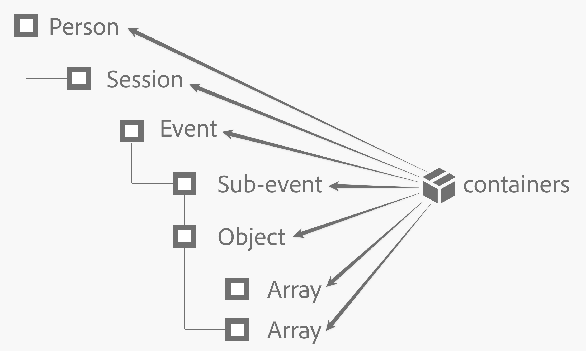

Las siguientes restricciones se aplican y se aplican cuando *selección* y *configuración* valores.

|  | Restricciones |
|:---:|----|
| **A** | Valores que usted *select* dentro del mismo [!UICONTROL If], [!UICONTROL Else If] construcción (uso de [!UICONTROL Y] o [!UICONTROL O]) de una regla debe proceder del mismo contenedor y puede ser de cualquier tipo (cadena , numérico , etc.).  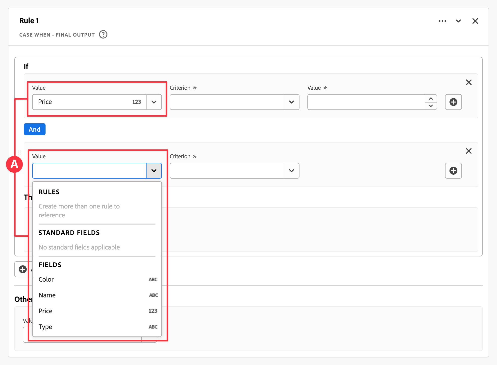 |
| **B** | Todos los valores que *set* en una regla debe ser del mismo contenedor y tener el mismo tipo o un valor derivado del mismo tipo.   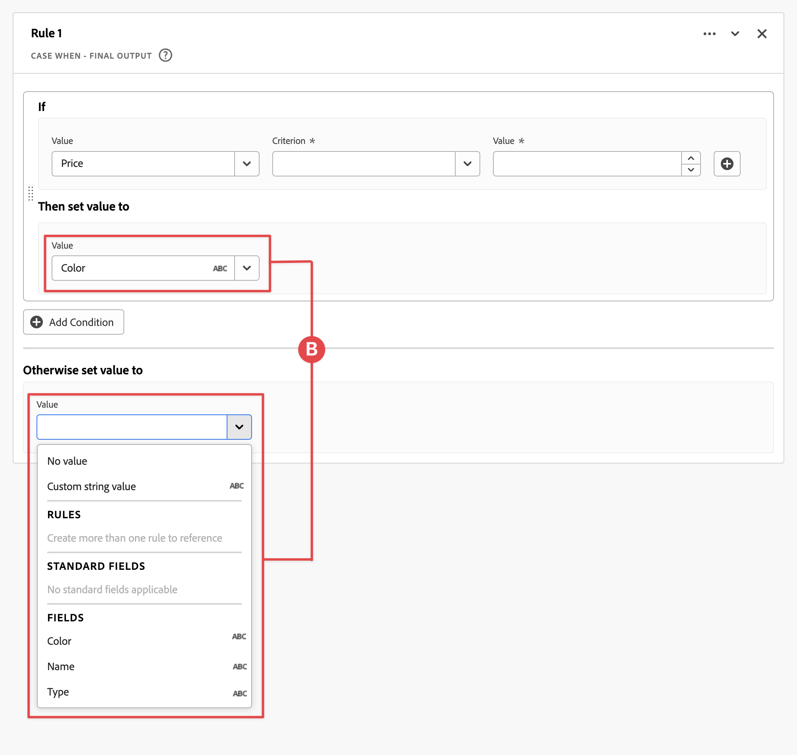 |
| **C** | Los valores que *select* horizontal [!UICONTROL If], [!UICONTROL Else If] las construcciones en la regla sí *no* deben proceder del mismo contenedor y deben *no* deben ser del mismo tipo.   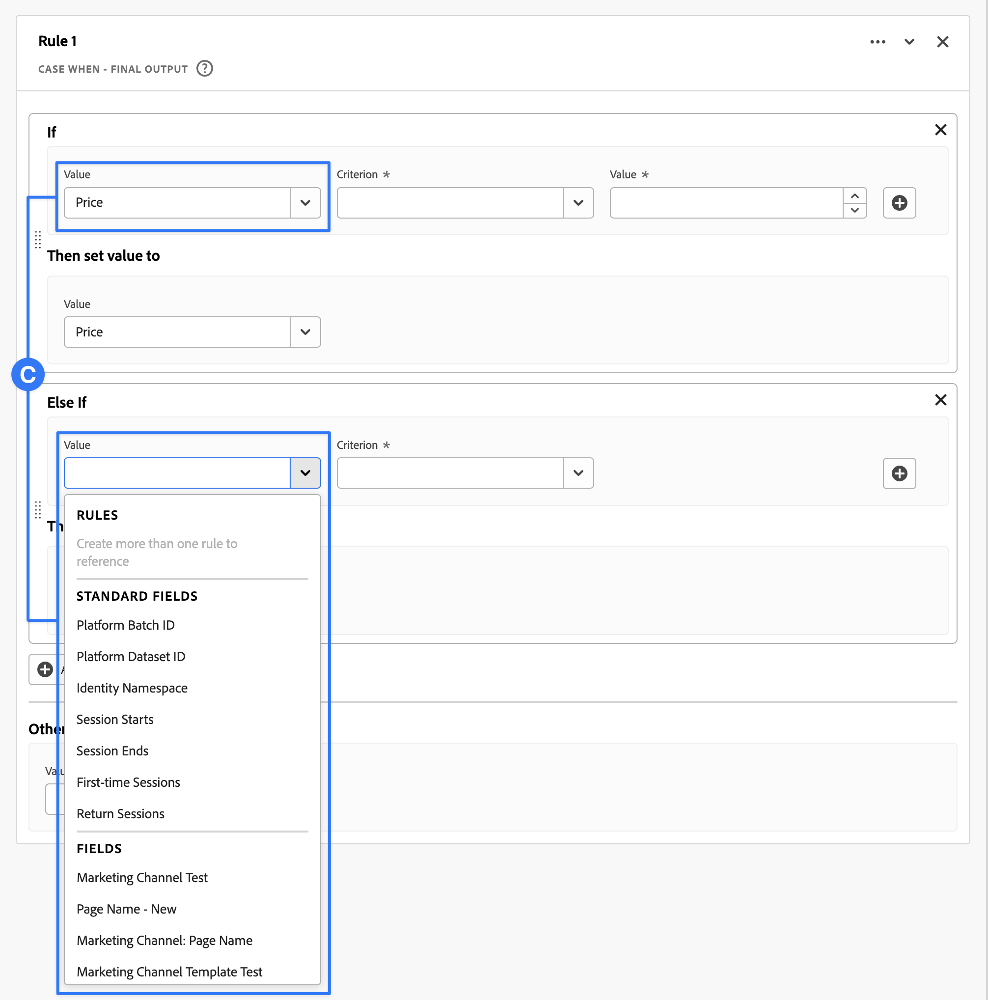 |

{style="table-layout:auto"}

+++

<!-- FIND AND REPLACE -->

### Buscar y reemplazar

Busca todos los valores de un campo seleccionado y reemplaza esos valores por un valor diferente en un nuevo campo derivado.

+++ Detalles

## Especificaciones {#findreplace-io}

| Tipo de datos de entrada | Entrada | Operadores incluidos | Limitaciones | Output |
|---|---|---|---|---|
| 
Cadena
 | <ul><li>Para los criterios:<ul><li>[!UICONTROL Valor]<ul><li>Regla</li><li>Campo estándar</li><li>Campo</li></ul></li></ul></li><li>Para cada [!UICONTROL Buscar todos], [!UICONTROL y reemplace todo por]:<ul><li>[!UICONTROL Valor]</li><ul><li>Entrada introducida por el usuario</li></ul></li></ul></ul> | 
Cadenas
<ul><li>[!UICONTROL Buscar todos], [!UICONTROL y reemplace todo por]</li></ul> | 
5 funciones por campo derivado
 | 
Nuevo campo derivado
 |

{style="table-layout:auto"}

## Caso de uso {#findreplace-uc}

Ha recibido algunos valores mal formados para su informe de canales de marketing externos, por ejemplo `email%20 marketing` en lugar de `email marketing`. Estos valores mal formados fracturan los informes y dificultan la visualización del rendimiento del correo electrónico. Desea reemplazar a `email%20marketing` con `email marketing`.

**Informe original**

| [!DNL External Marketing Channels] | [!DNL Sessions] |
|---|--:|
| [!DNL email marketing] | 500 |
| [!DNL email %20marketing] | 24 |

{style="table-layout:auto"}

**Informe preferido**

| [!DNL External Marketing Channels] | [!DNL Sessions] |
|---|--:|
| [!DNL email marketing] | 524 |

### Datos anteriores {#findreplace-uc-databefore}

| [!DNL External Marketing] |
|----|
| [!DNL email marketing] |
| [!DNL email%20marketing] |
| [!DNL email marketing] |
| [!DNL email marketing] |
| [!DNL email%20marketing] |

{style="table-layout:auto"}

### Campo derivado {#findreplace-uc-derivedfield}

Usted define un `Email Marketing (updated)` campo derivado. Utilice el [!UICONTROL BUSCAR Y REEMPLAZAR] función para definir una regla para buscar y reemplazar todas las ocurrencias de `email%20marketing` con `email marketing`.

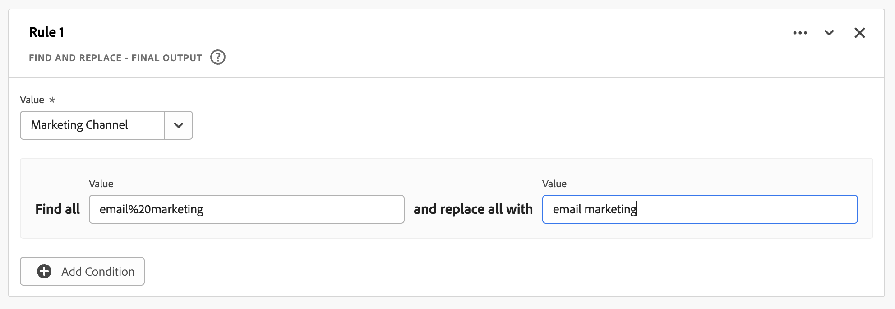

### Datos después de {#findreplace-uc-dataafter}

| [!DNL External Marketing (updated)] |
|----|
| [!DNL email marketing] |
| [!DNL email marketing] |
| [!DNL email marketing] |
| [!DNL email marketing] |
| [!DNL email marketing] |

{style="table-layout:auto"}

+++

<!-- LOOKUP -->

### Búsqueda

Define un conjunto de valores de búsqueda que se reemplazan por los valores correspondientes.

+++ Detalles

## Especificaciones {#lookup-io}

| Tipo de datos de entrada | Entrada | Operadores incluidos | Limitaciones | Output |
|---|---|---|---|---|
| <ul><li>Cadena</li><li>Numéricos</li><li>Fecha</li></ul> | <ul><li>Para [!UICONTROL Campo para aplicar la búsqueda]:<ul><li>Regla</li><li>Campo estándar</li><li>Campo</li></ul></li><li>Para [!UICONTROL Cuando el valor es igual a] y [!UICONTROL Reemplazar valores por]:
<ul><li>Entrada introducida por el usuario</li></ul></li></ul> | 
N/A
 | 
5 funciones por campo derivado
 | 
Nuevo campo derivado
 |

{style="table-layout:auto"}

## Caso de uso 1 {#lookup-uc1}

Tiene un archivo CSV que incluye una columna clave para `hotelID` y una o más columnas adicionales asociadas con la variable `hotelID`: `city`, `rooms`, `hotel name`.
Está recopilando [!DNL Hotel ID] en una dimensión, pero desea crear una [!DNL Hotel Name] dimensión derivada del `hotelID` en el archivo CSV.

**Estructura y contenido del archivo CSV**

| [!DNL hotelID] | [!DNL city] | [!DNL rooms] | [!DNL hotel name] |
|---|---|---:|---|
| [!DNL SLC123] | [!DNL Salt Lake City] | 40 | [!DNL SLC Downtown] |
| [!DNL LAX342] | [!DNL Los Angeles] | 60 | [!DNL LA Airport] |
| [!DNL SFO456] | [!DNL San Francisco] | 75 | [!DNL Market Street] |

{style="table-layout:auto"}

**Informe actual**

| [!DNL Hotel ID] | Vistas del producto |
|---|---:|
| [!DNL SLC123] | 200 |
| [!DNL LX342] | 198 |
| [!DNL SFO456] | 190 |

{style="table-layout:auto"}

**Informe deseado**

| [!DNL Hotel Name] | Vistas del producto |
|----|----:|
| [!DNL SLC Downtown] | 200 |
| [!DNL LA Airport] | 198 |
| [!DNL Market Street] | 190 |

{style="table-layout:auto"}

### Datos anteriores {#lookup-uc1-databefore}

| [!DNL Hotel ID] |
|----|
| [!DNL SLC123] |
| [!DNL LAX342] |
| [!DNL SFO456] |

{style="table-layout:auto"}

### Campo derivado {#lookup-uc1-derivedfield}

Usted define un `Hotel Name` campo derivado. Utilice el [!UICONTROL BÚSQUEDA] función para definir una regla en la que puede buscar valores de la variable [!UICONTROL ID de hotel] y reemplace con valores nuevos.

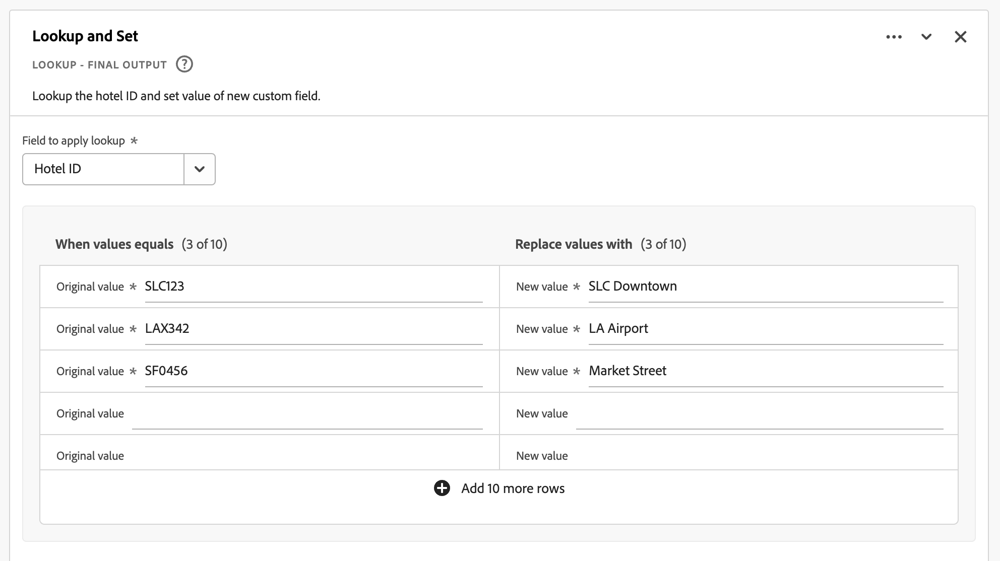

### Datos después de {#lookup-uc1-dataafter}

| [!DNL Hotel Name] |
|----|
| [!DNL SLC Downtown] |
| [!DNL LA Airport] |
| [!DNL Market Street] |

{style="table-layout:auto"}

## Caso de uso 2 {#lookup-uc2}

Ha recopilado direcciones URL en lugar del nombre de página descriptivo de varias páginas. Esta colección mixta de valores interrumpe la creación de informes.

### Datos anteriores {#lookup-uc2-databefore}

| [!DNL Page Name] |
|---|
| [!DNL Home Page] |
| [!DNL Flight Search] |
| `http://www.adobetravel.ca/Hotel-Search` |
| `https://www.adobetravel.com/Package-Search` |
| [!DNL Deals & Offers] |
| `http://www.adobetravel.ca/user/reviews` |
| `https://www.adobetravel.com.br/Generate-Quote/preview` |

{style="table-layout:auto"}

### Campo derivado {#lookup-uc2-derivedfield}

Usted define un `Page Name (updated)` campo derivado. Utilice el [!UICONTROL BÚSQUEDA] función para definir una regla en la que puede buscar valores de su [!UICONTROL Nombre de página] y reemplace con valores correctos actualizados.

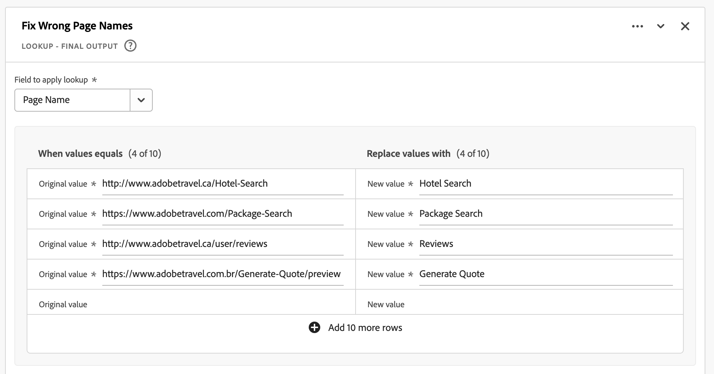

### Datos después de {#lookup-uc2-dataafter}

| [!DNL Page Name (updated)] |
|---|
| [!DNL Home Page] |
| [!DNL Flight Search] |
| [!DNL Hotel Search] |
| [!DNL Package Search] |
| [!DNL Deals & Offers] |
| [!DNL Reviews] |
| [!DNL Generate Quote] |

+++

<!-- URL PARSE -->

### Análisis de URL

Analiza diferentes partes de una dirección URL, incluidos el protocolo, el host, la ruta de acceso o los parámetros de consulta.

+++ Detalles

## Especificaciones {#urlparse-io}

| Tipo de datos de entrada | Entrada | Operadores incluidos | Límite | Output |
|---|---|---|---|---|
| <ul><li>Cadena</li></ul> | <ul><li>Para [!UICONTROL Campo]:</li><ul><li>Regla</li><li>Campo estándar</li><li>Campo</li></ul><li>Para [!UICONTROL Opción]:<ul><li>[!UICONTROL Obtener protocolo]</li><li>[!UICONTROL Obtener host]</li><li>[!UICONTROL Obtener ruta]</li><li>[!UICONTROL Obtener valor de cadena de consulta]<ul><li>[!UICONTROL Parámetro de consulta]:<ul><li>Entrada introducida por el usuario</li></ul></li></ul></li><li>[!UICONTROL Obtener valor de hash]</li></ul></li></ul></li></ul> | 
N/A
 | 
5 funciones por campo derivado
 | 
Nuevo campo derivado
 |

{style="table-layout:auto"}

## Caso de uso 1 {#urlparse-uc1}

Solo desea utilizar el dominio de referencia de la dirección URL de referencia como parte del conjunto de reglas de un canal de marketing.

### Datos anteriores {#urlparse-uc1-databefore}

| [!DNL Referring URL] |
|----|
| `https://www.google.com/` |
| `https://duckduckgo.com/` |
| `https://t.co/` |
| `https://l.facebook.com/` |

{style="table-layout:auto"}

### Campo derivado {#urlparse-uc1-derivedfield}

Usted define un  `Referring Domain` campo derivado. Utilice el [!UICONTROL ANÁLISIS DE URL] función para definir una regla para recuperar el host de [!UICONTROL URL de referencia] y almacenarlo en el nuevo campo derivado.

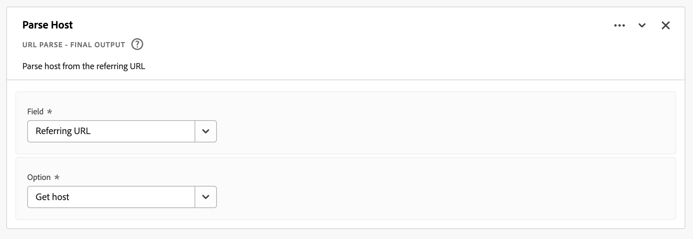

### Datos después de {#urlparse-uc1-dataafter}

| [!DNL Referrer Domain] |
|----|
| [!DNL www.google.com] |
| [!DNL duckduckgo.com] |
| [!DNL t.co] |
| [!DNL l.facebook.com] |

{style="table-layout:auto"}

## Caso de uso 2 {#urlparse-uc2}

Desea utilizar el valor de la variable `cid` parámetro de una cadena de consulta en una [!DNL Page URL] como parte del resultado de un informe de código de seguimiento derivado.

### Datos anteriores {#urlparse-uc2-databefore}

| [!DNL Page URL] |
|----|
| `https://www.adobe.com/?cid=abc123` |
| `https://www.adobe.com/?em=email1234&cid=def123` |
| `https://www.adobe.com/landingpage?querystring1=test&test2=1234&cid=xyz123` |

{style="table-layout:auto"}

### Campo derivado {#urlparse-uc2-derivedfield}

Usted define un `Query String CID` campo derivado. Utilice el [!UICONTROL ANÁLISIS DE URL] función para definir una regla para recuperar el valor del parámetro de cadena de consulta en [!UICONTROL URL de página] campo, especificar `cid` como parámetro de consulta. El valor de salida se almacena en el nuevo campo derivado.

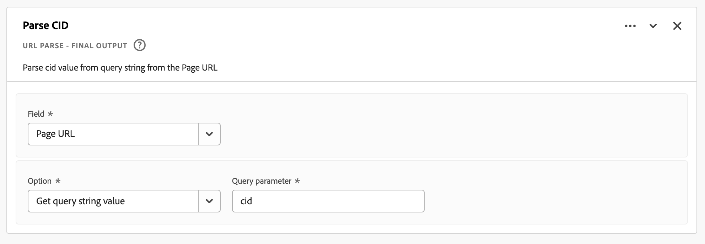

### Datos después de {#urlparse-uc2-dataafter}

| [!DNL Query String CID] |
|----|
| [!DNL abc123] |
| [!DNL def123] |
| [!DNL xyz123] |

{style="table-layout:auto"}

+++

## Limitaciones

Las siguientes limitaciones se aplican a la funcionalidad de campo Derivado en general:

- Puede utilizar un máximo de 100 campos de esquema diferentes (sin incluir los campos estándar) al definir reglas para un campo derivado.
- Puede tener un máximo de 100 campos derivados por conexión CJA.
