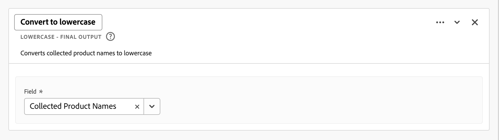

# Campos derivados

Los campos derivados son un aspecto importante de la funcionalidad de creación de informes en tiempo real de Adobe Customer Journey Analytics. Un campo derivado permite definir manipulaciones de datos (a menudo complejas) sobre la marcha, mediante un generador de reglas personalizable. A continuación, puede utilizar ese campo derivado como componente (métrica o dimensión) en [Workspace](../../analysis-workspace/home.md) o incluso definir más el campo derivado como un componente en [Vista de datos](../data-views.md).

Los campos derivados pueden ahorrar una cantidad significativa de tiempo y esfuerzo, en comparación con la transformación o manipulación de los datos en otras ubicaciones fuera de Customer Journey Analytics. Como [Preparación de datos](https://experienceleague.adobe.com/docs/experience-platform/data-prep/home.html?lang=es), [Data Distiller](https://experienceleague.adobe.com/docs/experience-platform/query/data-distiller/overview.html), o dentro de sus propios procesos de carga de transformación de extracción (ETL) / transformación de carga de extracción (ELT).

Los campos derivados se definen en [Vistas de datos](../data-views.md), se basan en un conjunto de funciones definidas como reglas y se aplican a los campos de esquema o estándar disponibles.

Algunos casos de uso son:

- Defina un campo Nombre de página derivado que corrija los valores incorrectos de nombre de página recopilados para corregir los valores de nombre de página.

- Defina un campo de canal de marketing derivado que determine el canal de marketing adecuado en función de una o varias condiciones (por ejemplo, parámetro de URL, dirección URL de página, nombre de página).

## Interfaz de campo derivada

Cuando se crea o edita un campo derivado, se utiliza la interfaz de campo derivado.

|  | Nombre | Descripción |
|---------|----------|--------|
| 1 | **Selector** | Utilice el área de selector para seleccionar y arrastrar la función, la plantilla de función, el campo de esquema o el campo estándar y colocarlos en el generador de reglas.  Utilice la lista desplegable para seleccionar entre:   [!UICONTROL Funciones] - listas disponibles [Funciones](#function-reference),   [!UICONTROL Plantillas de funciones] - listas disponibles [plantillas de función](#function-templates),    [!UICONTROL Campos de esquema] : enumera los campos disponibles en las categorías de conjuntos de datos (evento, perfil, búsqueda) y los campos derivados definidos anteriormente, y   [!UICONTROL Campos estándar] : campos disponibles estándar (como ID de conjunto de datos de Platform). En el selector solo se muestran los campos estándar numéricos y de cadena. Si la función admite otros tipos de datos, se pueden seleccionar campos estándar con estos otros tipos de datos para valores o campos dentro de la interfaz de regla. Puede buscar funciones, plantillas de funciones, esquemas y campos estándar mediante  Cuadro de búsqueda.  Puede filtrar la lista de objetos seleccionados seleccionando  Filtre y especifique filtros en [!UICONTROL Filtrar campos por] diálogo. Puede quitar filtros fácilmente mediante  para cada filtro. |
| 2 | **Generador de reglas** | El campo derivado se genera secuencialmente utilizando una o más reglas. Una regla es una implementación específica de una función y, por lo tanto, siempre se asocia con una sola función. Para crear una regla, arrastre y suelte una función en el generador de reglas. El tipo de función determina la interfaz de la regla. Consulte la [Interfaz de regla](#rule-interface) para obtener más información.  Puede insertar una función al principio, al final o entre reglas que ya estén disponibles en el generador de reglas. La última regla del generador de reglas determina el resultado final del campo derivado. |
| 3 | **[!UICONTROL ** Configuración de campo **]** | Puede asignar un nombre al campo derivado, describirlo e inspeccionar su tipo de campo. |
| 4 | **[!UICONTROL ** Salida final **]** | Esta área muestra una previsualización actualizada sobre la marcha de los valores de salida, basada en los datos de los últimos 30 días y los cambios realizados en el campo derivado del generador de reglas. |

{style="table-layout:auto"}

## Asistente de plantilla de campo

Cuando accede a la interfaz de campos derivada por primera vez, la variable [!UICONTROL Empezar con una plantilla de campo] se muestra el asistente.

1. Seleccione la plantilla que mejor describa el tipo de campo que está intentando crear.
2. Seleccione el **[!UICONTROL ** Seleccionar **]** para continuar.

El cuadro de diálogo de campo derivado se rellena con reglas (y funciones) necesarias o útiles para el tipo de campo seleccionado. Consulte [Plantillas de funciones](#function-templates) para obtener más información sobre las plantillas disponibles.

## Interfaz de regla

Cuando define una regla en el generador de reglas, utiliza la interfaz de reglas.

|  | Nombre | Descripción |
|---------|----------|--------|
| A | **Nombre de regla** | De forma predeterminada, el nombre de la regla es **Regla X** (X hace referencia a un número de secuencia). Para editar el nombre de una regla, seleccione su nombre y escriba el nuevo nombre, por ejemplo `Query Parameter`. |
| B | **Nombre de función** | El nombre de función seleccionado para la regla, por ejemplo [!UICONTROL ANÁLISIS DE URL]. Cuando la función es la última de la secuencia de funciones y determina los valores de salida finales, el nombre de la función va seguido de [!UICONTROL - SALIDA FINAL], por ejemplo [!UICONTROL ANÁLISIS DE URL: SALIDA FINAL].  Para mostrar una ventana emergente con más información sobre la función, seleccione . |
| C | **Descripción de regla** | Si lo desea, puede agregar una descripción a una regla. Seleccionar , luego seleccione **[!UICONTROL ** Agregar descripción **]** para añadir una descripción o **[!UICONTROL ** Editar descripción **]** para editar una descripción existente. Utilice el editor para introducir una descripción. Puede utilizar la barra de herramientas para dar formato al texto (mediante el selector de estilo, negrita, cursiva, subrayado, derecha, izquierda, centrado, color, lista de números, lista de viñetas) y agregar vínculos a información externa.  Para terminar de editar la descripción, haga clic fuera del editor. |
| D | **Área de funciones** | Define la lógica de la función. La interfaz depende del tipo de función. El menú desplegable de [!UICONTROL Campo] o [!UICONTROL Valor] muestra todas las categorías de campos (reglas, campos estándar, campos) disponibles, según el tipo de entrada que espera la función. También puede arrastrar y soltar un campo del selector de Campos de esquema y estándar en un Campo o Valor. Cuando ese campo arrastrado se origina desde un conjunto de datos de búsqueda, se inserta automáticamente una función de búsqueda antes de la función que defina.  Consulte [Referencia de función](#function-reference) en información detallada para cada una de las funciones admitidas. |

{style="table-layout:auto"}

## Crear un campo derivado

1. Seleccione una vista de datos existente o cree una vista de datos. Consulte [Vistas de datos](../data-views.md) para obtener más información.

2. Seleccione el **[!UICONTROL ** Componentes **]** de la vista de datos.

3. Seleccionar **[!UICONTROL ** Crear campo derivado **]** desde el carril izquierdo.

4. Para definir el campo derivado, utilice el [!UICONTROL Crear campo derivado] interfaz. Consulte [Interfaz de campo derivada](#derived-field-interface).

   Para guardar el nuevo campo derivado, seleccione **[!UICONTROL ** Guardar **]**.

5. El nuevo campo derivado se agregará al [!UICONTROL Campos derivados >] contenedor, como parte de **[!UICONTROL ** Campos de esquema **]** en el carril izquierdo de la vista Datos.

## Editar un campo derivado

1. Seleccione una vista de datos existente. Consulte [Vistas de datos](../data-views.md) para obtener más información.

2. Seleccione el **[!UICONTROL ** Componentes **]** de la vista de datos.

3. Seleccionar **[!UICONTROL ** Campos de esquema **]** en la pestaña [!UICONTROL Conexión] panel de la izquierda.

4. Seleccionar **[!UICONTROL ** Campos derivados >**]** contenedor.

5. Pase el ratón sobre el campo derivado que desee editar y seleccione .

6. Para editar el campo derivado, utilice el [!UICONTROL Editar campo derivado] interfaz. Consulte [Interfaz de campo derivada](#derived-field-interface).

   - Seleccionar **[!UICONTROL ** Guardar **]** para guardar el campo derivado actualizado.

   - Seleccionar **[!UICONTROL ** Cancelar **]** para cancelar los cambios realizados en el campo derivado.

   - Seleccionar **[!UICONTROL ** Guardar como **]** para guardar el campo derivado como un nuevo campo derivado. El nuevo campo derivado tiene el mismo nombre que el campo derivado editado original con `(copy)` se le ha añadido.

Alternativamente, si ha utilizado un campo derivado como componente para dimensiones o métricas en la vista de datos:

1. Seleccione el componente. Tenga en cuenta que el componente puede tener un nombre diferente al campo derivado.

1. En el panel Componente, seleccione la opción  junto al campo derivado, debajo de Nombre del campo de esquema.

1. Para editar el campo derivado, utilice el [!UICONTROL Editar campo derivado] interfaz. Consulte [Interfaz de campo derivada](#derived-field-interface).

   - Seleccionar **[!UICONTROL ** Guardar **]** para guardar el campo derivado actualizado.

   - Seleccionar **[!UICONTROL ** Cancelar **]** para cancelar los cambios realizados en el campo derivado.

   - Seleccionar **[!UICONTROL ** Guardar como **]** para guardar el campo derivado como un nuevo campo derivado. El nuevo campo derivado tiene el mismo nombre que el campo derivado editado original con `(copy)` se le ha añadido.

## Eliminar un campo derivado

1. Seleccione una vista de datos existente. Consulte [Vistas de datos](../data-views.md) para obtener más información.

2. Seleccione el **[!UICONTROL ** Componentes **]** de la vista de datos.

3. Seleccionar **[!UICONTROL ** Campos de esquema **]** pestaña en [!UICONTROL Conexión] panel.

4. Seleccionar **[!UICONTROL ** Campos derivados >**]** contenedor.

5. Pase el ratón sobre el campo derivado que desee eliminar y seleccione .

6. En el [!UICONTROL Editar campo derivado] interfaz, seleccione **[!UICONTROL Eliminar]**.

   A [!UICONTROL Eliminar componente] El cuadro de diálogo le pedirá que confirme la eliminación. Considere cualquier referencia externa que pueda existir al campo derivado fuera de la vista de datos.

   - Seleccionar **[!UICONTROL ** Continuar **]** para eliminar el campo derivado.

Alternativamente, si ha utilizado un campo derivado como componente para dimensiones o métricas en la vista de datos:

1. Seleccione el componente. Tenga en cuenta que el componente puede tener un nombre diferente al campo derivado.

1. En el panel Componente, seleccione la opción  junto al campo derivado, debajo de Nombre del campo de esquema.

1. En el [!UICONTROL Editar campo derivado] interfaz, seleccione **[!UICONTROL Eliminar]**.

   A [!UICONTROL Eliminar componente] El cuadro de diálogo le pedirá que confirme la eliminación. Considere cualquier referencia externa que pueda existir al campo derivado fuera de la vista de datos.

   - Seleccionar **[!UICONTROL ** Continuar **]** para eliminar el campo derivado.

>[!NOTE]
>
>Los campos derivados se administran en el nivel de Conexión en Customer Journey Analytics. Cualquier cambio realizado en un campo derivado en cualquiera de las vistas de datos asociadas con esa conexión se aplica a todas estas vistas de datos asociadas.

## Plantillas de funciones

Para crear rápidamente un campo derivado para casos de uso específicos, hay plantillas de función disponibles. Se puede acceder a estas plantillas de función desde el área de selector de la interfaz de campo derivada o se presentan al utilizarlas por primera vez en el [!UICONTROL Empezar con una plantilla de campo] asistente.

### Canales de marketing

Esta plantilla de función utiliza una colección de reglas para crear canales de marketing.

+++ Detalles

Para utilizar la plantilla, debe especificar los parámetros correctos para cada función enumerada como parte de las reglas de la plantilla. Consulte [Referencia de función](#function-reference) para obtener más información.

+++

### Rechazos

Esta plantilla de función utiliza una colección de reglas para identificar los rechazos del sitio.

+++ Detalles

Para utilizar la plantilla, debe especificar los parámetros correctos para cada función enumerada como parte de las reglas de la plantilla. Consulte [Referencia de función](#function-reference) para obtener más información.

+++

### Combinación multidimensional

Esta plantilla de función combina dos valores en uno.

+++ Detalles

Para utilizar la plantilla, debe especificar los parámetros correctos para cada función enumerada como parte de las reglas de la plantilla. Consulte [Referencia de función](#function-reference) para obtener más información.

+++

### Nombre descriptivo del conjunto de datos

Esta plantilla de función proporciona un nombre de conjunto de datos legible.

+++ Detalles

Para utilizar la plantilla, debe especificar los parámetros correctos para cada función enumerada como parte de las reglas de la plantilla. Consulte [Referencia de función](#function-reference) para obtener más información.

+++

### Nombre de página de URL

Esta plantilla de función crea un nombre de página simple.

+++ Detalles

Para utilizar la plantilla, debe especificar los parámetros correctos para cada función enumerada como parte de las reglas de la plantilla. Consulte [Referencia de función](#function-reference) para obtener más información.

+++

### Temporada de vacaciones

Esta plantilla de función clasifica las horas clave del año.

+++ Detalles

Para utilizar la plantilla, debe especificar los parámetros correctos para cada función enumerada como parte de las reglas de la plantilla. Consulte [Referencia de función](#function-reference) para obtener más información.

+++

### Metas mensuales

Esta plantilla de función establece objetivos mensuales personalizados.

+++ Detalles

Para utilizar la plantilla, debe especificar los parámetros correctos para cada función enumerada como parte de las reglas de la plantilla. Consulte [Referencia de función](#function-reference) para obtener más información.

+++

### Obtener todos los valores de la lista delimitada

Esta plantilla de función convierte una lista limitada en una matriz.

+++ Detalles

Para utilizar la plantilla, debe especificar los parámetros correctos para cada función enumerada como parte de las reglas de la plantilla. Consulte [Referencia de función](#function-reference) para obtener más información.

+++

### Obtener el primer valor de la lista delimitada

Esta plantilla de función obtiene el primer valor de una lista delimitada.

+++ Detalles

Para utilizar la plantilla, debe especificar los parámetros correctos para cada función enumerada como parte de las reglas de la plantilla. Consulte [Referencia de función](#function-reference) para obtener más información.

+++

### Obtener el último valor de la lista delimitada

Esta plantilla de función obtiene el último valor de una lista delimitada.

+++ Detalles

Para utilizar la plantilla, debe especificar los parámetros correctos para cada función enumerada como parte de las reglas de la plantilla. Consulte [Referencia de función](#function-reference) para obtener más información.

+++

### Nombre de dominio

Esta plantilla de función extrae el nombre de dominio mediante una expresión regular.

+++ Detalles

Para utilizar la plantilla, debe especificar los parámetros correctos para cada función enumerada como parte de las reglas de la plantilla. Consulte [Referencia de función](#function-reference) para obtener más información.

+++

### Obtener parámetro de cadena de consulta

Esta plantilla de función extrae valores de cadena de consulta.

+++ Detalles

Para utilizar la plantilla, debe especificar los parámetros correctos para cada función enumerada como parte de las reglas de la plantilla. Consulte [Referencia de función](#function-reference) para obtener más información.

+++

### Campo de transición

Esta plantilla de función cambia la creación de informes de un campo a otro.

+++ Detalles

Para utilizar la plantilla, debe especificar los parámetros correctos para cada función enumerada como parte de las reglas de la plantilla. Consulte [Referencia de función](#function-reference) para obtener más información.

+++

### Detección de bots simples

Esta plantilla de función implementa la identificación de bots ligeros.

+++ Detalles

Para utilizar la plantilla, debe especificar los parámetros correctos para cada función enumerada como parte de las reglas de la plantilla. Consulte [Referencia de función](#function-reference) para obtener más información.

+++

### Vínculo de salida

Esta plantilla de función identifica el último vínculo en el que se hizo clic en una sesión.

+++ Detalles

Para utilizar la plantilla, debe especificar los parámetros correctos para cada función enumerada como parte de las reglas de la plantilla. Consulte [Referencia de función](#function-reference) para obtener más información.

+++

### Vínculo de descarga

Esta plantilla de función indica vínculos de descarga comunes.

+++ Detalles

Para utilizar la plantilla, debe especificar los parámetros correctos para cada función enumerada como parte de las reglas de la plantilla. Consulte [Referencia de función](#function-reference) para obtener más información.

+++

<!--

+++ Data clean up template

>[!WARNING]
>
>Could not find any information on this template.
+++

-->

## Referencia de función

{{select-package}}

Para cada función admitida, busque los detalles siguientes en:

- especificaciones:
   - tipo de datos de entrada: tipo de datos admitidos,
   - input: posibles valores para input,
   - operadores incluidos: operadores admitidos para esta función (si los hay),
   - limitaciones: limitaciones que se aplican a esta función específica,
   - salida.

- casos de uso, incluidos:
   - datos antes de definir el campo derivado,
   - cómo definir el campo derivado,
   - después de definir el campo derivado.

- restricciones (si procede).

>[!NOTE]
>
>Se cambió el nombre de la función de búsqueda a [Clasificar](#classify). Consulte la [Clasificar](#classify) para obtener más información.

<!-- CASE WHEN -->

### Caso de que

Aplica condicionales, según los criterios definidos en uno o varios campos. Estos criterios se utilizan para definir los valores en un nuevo campo derivado, según la secuencia de las condiciones.

+++ Detalles

## Especificaciones {#casewhen-io}

| Tipo de datos de entrada | Entrada | Operadores incluidos | Limitaciones | Output |
|---|---|---|---|---|
| <ul><li>Cadena</li><li>Numéricos</li><li>Fecha</li></ul> | <ul><li>[!UICONTROL If], [!UICONTROL Else If] contenedor:
<ul><li>[!UICONTROL Valor]</li><ul><li>Reglas</li><li>Campos estándar</li><li>Campos</li></ul><li>[!UICONTROL Criterio] (consulte operadores incluidos, según el tipo de valor seleccionado)</li></ul></li><li>[!UICONTROL Luego establezca el valor en], [!UICONTROL De lo contrario, establezca el valor en]:
<ul><li>[!UICONTROL Valor]</li><ul><li>Reglas</li><li>Campos estándar</li><li>Campos</li></ul></ul></li></ul> | 
Cadenas
<ul><li>Es igual a</li><li>Es igual a cualquier término</li><li>Contiene la frase</li><li>Contiene cualquier término</li><li>Contiene todos los términos</li><li>Comienza con</li><li>Comienza con cualquier término</li><li>Finaliza con</li><li>Finaliza con cualquier término</li><li>No es igual a</li><li>No coincide con ningún término</li><li>No contiene la frase</li><li>No contiene ningún término</li><li>No contiene todos los términos</li><li>No comienza con</li><li>No comienza con ningún término</li><li>No finaliza con</li><li>No termina con ningún término</li><li>Se ha establecido</li><li>No se ha establecido</li></ul>
Numéricos
<ul><li>Es igual a</li><li>No es igual a</li><li>Es mayor que</li><li>Es mayor que o igual a</li><li>Es menor que</li><li>Es menor que o igual a</li><li>Se ha establecido</li><li>No se ha establecido</li></ul>
Fechas
<ul><li>Es igual a</li><li>No es igual a</li><li>es posterior a</li><li>Es posterior o igual a</li><li>Es antes de</li><li>Es anterior o igual a</li><li>Se ha establecido</li><li>No se ha establecido</li></ul> | <ul><li>5 funciones por campo derivado</li><li>200 [operadores](#operators) por campo derivado. Un ejemplo de operador único es &quot;El dominio de referencia contiene Google&quot;. </li></ul> | 
Nuevo campo derivado
 |

{style="table-layout:auto"}

## Caso de uso 1 {#casewhen-uc1}

Desea definir reglas para identificar varios canales de marketing aplicando una lógica en cascada para establecer un campo de canal de marketing en el valor adecuado:

- Si el referente es de un motor de búsqueda y la página tiene un valor de cadena de consulta donde `cid` contains `ps_`, el canal de marketing debe identificarse como [!DNL *Búsqueda de pago*].
- Si el referente es de un motor de búsqueda y la página no tiene la cadena de consulta `cid`, el canal de marketing debe identificarse como [!DNL *Búsqueda natural*].
- Si una página tiene un valor de cadena de consulta donde `cid` contains `em_`, el canal de marketing debe identificarse como un [!DNL *Correo electrónico*].
- Si una página tiene un valor de cadena de consulta donde `cid` contains `ds_`, el canal de marketing debe identificarse como [!DNL *Publicidad en pantalla*].
- Si una página tiene un valor de cadena de consulta donde `cid` contains `so_`, el canal de marketing debe identificarse como [!DNL *Social de pago*].
- Si el referente es de un dominio de referencia de [!DNL twitter.com], [!DNL facebook.com], [!DNL linkedin.com], o [!DNL tiktok.com], el canal de marketing debe identificarse como [!DNL *Social natural*].
- Si ninguna de las reglas anteriores coincide, el canal de marketing debe identificarse como [!DNL *Otro referente*].

En caso de que el sitio reciba los siguientes eventos de muestra, que contienen [!UICONTROL Referente] y [!UICONTROL URL de página]Sin embargo, estos eventos deben identificarse de la siguiente manera:

| [!DNL Event] | [!DNL Referrer] | [!DNL Page URL] | [!DNL Marketing Channel] |
|:--:|----|----|----|
| 1 | `https://facebook.com` | `https://site.com/home` | [!DNL Natural Social] |
| 2 | `https://abc.com` | `https://site.com/?cid=ds_12345678` | [!DNL Display] |
| 3 | | `https://site.com/?cid=em_12345678` | [!DNL Email] |
| 4 | `https://google.com` | `https://site.com/?cid=ps_abc098765` | [!DNL Paid Search] |
| 5 | `https://google.com` | `https://site.com/?cid=em_765544332` | [!DNL Email] |
| 6 | `https://google.com` |  | [!DNL Natural Search] |

{style="table-layout:auto"}

### Datos anteriores {#casewhen-uc1-databefore}

| [!DNL Referrer] | [!DNL Page URL] |
|----|----|
| `https://facebook.com` | `https://site.com/home` |
| `https://abc.com` | `https://site.com/?cid=ds_12345678` |
|  | `https://site.com/?cid=em_12345678` |
| `https://google.com` | `https://site.com/?cid=ps_abc098765` |
| `https://google.com` | `https://site.com/?cid=em_765544332` |
| `https://google.com` | |

{style="table-layout:auto"}

### Campo derivado {#casewhen-uc1-derivedfield}

Usted define un `Marketing Channel` campo derivado. Utilice el [!UICONTROL CASO CUÁNDO] funciones para definir reglas que creen valores para en función de los valores existentes para `Page URL` y `Referring URL` field.

Observe el uso de la función [!UICONTROL ANÁLISIS DE URL] para definir reglas para recuperar los valores de `Page Url` y `Referring Url` antes del [!UICONTROL CASO CUÁNDO] se aplican las reglas de.

### Datos después de {#casewhen-uc1-dataafter}

| [!DNL Marketing Channel] |
|----|
| [!DNL Natural Social] |
| [!DNL Display] |
| [!DNL Email] |
| [!DNL Paid Search] |
| [!DNL Email] |
| [!DNL Natural Search] |

{style="table-layout:auto"}

## Caso de uso 2 {#casewhen-uc2}

Ha recopilado varias variaciones diferentes de búsquedas dentro de su [!DNL Product Finding Methods] dimensión. Para comprender el rendimiento general de la búsqueda frente a la exploración, debe dedicar una gran cantidad de tiempo a combinar los resultados manualmente.

Su sitio recopila los siguientes valores para su [!DNL Product Finding Methods] dimensión. Al final, todos estos valores indican una búsqueda.

| Valor recopilado | Valor real |
|---|---|
| [!DNL search p13n_no] | [!DNL search] |
| [!DNL search p13n_yes] | [!DNL search] |
| [!DNL search refine p13n_no] | [!DNL search] |
| [!DNL search refine p13n_yes] | [!DNL search] |
| [!DNL search redirect p13n_yes] | [!DNL search] |
| [!DNL search-redirect] | [!DNL search] |

{style="table-layout:auto"}

### Datos anteriores {#casewhen-uc2-databefore}

| [!DNL Product Finding Methods] |
|----|
| [!DNL search p13_no] |
| [!DNL search p13_yes] |
| [!DNL browse] |
| [!DNL search refine p13_no] |
| [!DNL search refine p13_yes] |
| [!DNL browse] |
| [!DNL search redirect p13_yes] |
| [!DNL search-redirect] |
| [!DNL browse] |

{style="table-layout:auto"}

### Campo derivado {#casewhen-uc2-derivedfield}

Usted define un `Product Finding Methods (new)` campo derivado. Puede crear lo siguiente [!UICONTROL CASO CUÁNDO] reglas en el generador de reglas. Estas reglas aplican lógica a todas las variaciones posibles de lo antiguo [!UICONTROL Métodos de búsqueda de productos] valores de campo para `search` y `browse` uso del [!UICONTROL Contiene la frase] criterio.

### Datos después de {#casewhen-uc2-dataafter}

| [!DNL Product Finding Methods (new)] |
|----|
| [!DNL search] |
| [!DNL search] |
| [!DNL browse] |
| [!DNL search] |
| [!DNL search] |
| [!DNL browse] |
| [!DNL search] |
| [!DNL search] |
| [!DNL browse] |

{style="table-layout:auto"}

## Caso de uso 3 {#casewhen-uc3}

Como empresa de viajes, le gustaría agrupar la duración del viaje en viajes reservados para poder informar sobre la duración total de los viajes.

Suposiciones:

- La organización está recopilando la duración del viaje en un campo numérico.
- Les gustaría agrupar las duraciones de 1 a 3 días en un contenedor llamado &#39;[!DNL short trip]&#39;
- Les gustaría agrupar las duraciones de 4 a 7 días en un contenedor llamado &#39;[!DNL medium trip]&#39;
- Les gustaría agrupar duraciones de más de 8 días en un contenedor llamado &quot;[!DNL long trip]&#39;
- Se reservaron 132 viajes para un día de duración
- Se reservaron 110 viajes para una duración de 2 días
- Se reservaron 105 viajes para una duración de 3 días
- Se reservaron 99 viajes para una duración de 4 días
- Se reservaron 92 viajes para una duración de 5 días
- Se reservaron 85 viajes para una duración de 6 días
- Se reservaron 82 viajes para una duración de 7 días
- Se reservaron 78 viajes para una duración de 8 días
- Se reservaron 50 viajes para una duración de 9 días
- Se reservaron 44 viajes para una duración de 10 días
- Se reservaron 38 viajes para una duración de 11 días
- Se reservaron 31 viajes para una duración de 12 días

El informe deseado debería tener un aspecto similar al siguiente:

| [!DNL Trip Duration Type] | [!DNL Bookings] |
|----|---:|
| [!DNL medium trip] | 358 |
| [!DNL short trip] | 347 |
| [!DNL long trip] | 241 |

{style="table-layout:auto"}

### Datos anteriores {#casewhen-uc3-databefore}

| [!DNL Trip Duration] |
|---:|
| 1 |
| 12 |
| 3 |
| 6 |
| 4 |
| 8 |
| 6 |
| 2 |
| 1 |
| 2 |
| 21 |
| 8 |

### Campo derivado {#casewhen-uc3-derivedfield}

Usted define un `Trip Duration (bucketed)` campo derivado. Puede crear lo siguiente [!UICONTROL CASO CUÁNDO] regla en el generador de reglas. Esta regla aplica lógica al contenedor del antiguo [!UICONTROL Duración del viaje] Valores de campo en tres valores: `short trip`, `medium  trip`, y `long trip`.

### Datos después de {#casewhen-uc3-dataafter}

| [!DNL Trip Duration (bucketed)] |
|---|
| [!DNL short trip] |
| [!DNL long trip] |
| [!DNL short trip] |
| [!DNL medium trip] |
| [!DNL medium trip] |
| [!DNL long trip] |
| [!DNL medium trip] |
| [!DNL short trip] |
| [!DNL short trip] |
| [!DNL short trip] |
| [!DNL long trip] |
| [!DNL long trip] |

## Más información

El Customer Journey Analytics utiliza una estructura de contenedor anidada, siguiendo el modelo de Adobe Experience Platform [XDM](https://experienceleague.adobe.com/docs/experience-platform/xdm/home.html?lang=es) (Modelo de datos de experiencia). Consulte [Contenedores](../create-dataview.md#containers) y [Filtrar contenedores](../../components/filters/filters-overview.md#filter-containers) para obtener más información. Este modelo de contenedor, aunque flexible por naturaleza, impone algunas restricciones al utilizar el generador de reglas.

Customer Journey Analytics utiliza el siguiente modelo de contenedor predeterminado:

Las siguientes restricciones se aplican y se aplican cuando *selección* y *configuración* valores.

|  | Restricciones |
|:---:|----|
| **A** | Valores que usted *select* dentro del mismo [!UICONTROL If], [!UICONTROL Else If] construcción (uso de [!UICONTROL Y] o [!UICONTROL O]) de una regla debe proceder del mismo contenedor y puede ser de cualquier tipo (cadena , numérico , etc.).   |
| **B** | Todos los valores que *set* en una regla debe ser del mismo contenedor y tener el mismo tipo o un valor derivado del mismo tipo.    |
| **C** | Los valores que *select* horizontal [!UICONTROL If], [!UICONTROL Else If] las construcciones en la regla sí *no* deben proceder del mismo contenedor y deben *no* deben ser del mismo tipo.    |

{style="table-layout:auto"}

+++

<!-- CLASSIFY -->

### Clasificar

Define un conjunto de valores que se reemplazan por los valores correspondientes en un nuevo campo derivado.

+++ Detalles

>[!NOTE]
>
>Esta función se denominó originalmente Búsqueda, pero se ha cambiado el nombre a Clasificar para dar cabida a la función Búsqueda con una funcionalidad diferente.

## Especificaciones {#classify-io}

| Tipo de datos de entrada | Entrada | Operadores incluidos | Limitaciones | Output |
|---|---|---|---|---|
| <ul><li>Cadena</li><li>Numéricos</li><li>Fecha</li></ul> | <ul><li>[!UICONTROL Campo para clasificar]:<ul><li>Reglas</li><li>Campos estándar</li><li>Campos</li></ul></li><li>[!UICONTROL Cuando el valor es igual a] y [!UICONTROL Reemplazar valores por]:
<ul><li>Cadena</li></ul><li>Mostrar valores originales<ul><li>Booleano</li></ul></li></ul> | 
N/A
 | <ul><li>5 funciones por campo derivado</li><li>200 [operadores](#operators) por campo derivado. Cada entrada de [!UICONTROL Cuando el valor es igual al valor original] [!UICONTROL Reemplazar valor por Nuevo valor] se considera una operación.</li></ul> | 
Nuevo campo derivado
 |

{style="table-layout:auto"}

## Caso de uso 1 {#classify-uc1}

Tiene un archivo CSV que incluye una columna clave para `hotelID` y una o más columnas adicionales asociadas con la variable `hotelID`: `city`, `rooms`, `hotel name`.
Está recopilando [!DNL Hotel ID] en una dimensión, pero desea crear una [!DNL Hotel Name] dimensión derivada del `hotelID` en el archivo CSV.

**Estructura y contenido del archivo CSV**

| [!DNL hotelID] | [!DNL city] | [!DNL rooms] | [!DNL hotel name] |
|---|---|---:|---|
| [!DNL SLC123] | [!DNL Salt Lake City] | 40 | [!DNL SLC Downtown] |
| [!DNL LAX342] | [!DNL Los Angeles] | 60 | [!DNL LA Airport] |
| [!DNL SFO456] | [!DNL San Francisco] | 75 | [!DNL Market Street] |
| [!DNL AMS789] | [!DNL Amsterdam] | 50 | [!DNL Okura] |

{style="table-layout:auto"}

**Informe actual**

| [!DNL Hotel ID] | Vistas del producto |
|---|---:|
| [!DNL SLC123] | 200 |
| [!DNL LX342] | 198 |
| [!DNL SFO456] | 190 |
| [!DNL AMS789] | 150 |

{style="table-layout:auto"}

**Informe deseado**

| [!DNL Hotel Name] | Vistas del producto |
|----|----:|
| [!DNL SLC Downtown] | 200 |
| [!DNL LA Airport] | 198 |
| [!DNL Market Street] | 190 |

{style="table-layout:auto"}

### Datos anteriores {#classify-uc1-databefore}

| [!DNL Hotel ID] |
|----|
| [!DNL SLC123] |
| [!DNL LAX342] |
| [!DNL SFO456] |
| [!DNL AMS789] |

{style="table-layout:auto"}

### Campo derivado {#classify-uc1-derivedfield}

Usted define un `Hotel Name` campo derivado. Utilice el [!UICONTROL CLASIFICAR] función para definir una regla en la que se pueden clasificar los valores de [!UICONTROL ID de hotel] y reemplace con valores nuevos.

Si desea incluir valores originales que no ha definido como parte de los valores que se van a clasificar (por ejemplo, ID de hotel AMS789), asegúrese de seleccionar **[!UICONTROL Mostrar valores originales]**. Esto garantiza que AMS789 forme parte de la salida del campo derivado, a pesar de que ese valor no se clasifique.

### Datos después de {#classify-uc1-dataafter}

| [!DNL Hotel Name] |
|----|
| [!DNL SLC Downtown] |
| [!DNL LA Airport] |
| [!DNL Market Street] |

{style="table-layout:auto"}

## Caso de uso 2 {#classify-uc2}

Ha recopilado direcciones URL en lugar del nombre de página descriptivo de varias páginas. Esta colección mixta de valores interrumpe la creación de informes.

### Datos anteriores {#classify-uc2-databefore}

| [!DNL Page Name] |
|---|
| [!DNL Home Page] |
| [!DNL Flight Search] |
| `http://www.adobetravel.ca/Hotel-Search` |
| `https://www.adobetravel.com/Package-Search` |
| [!DNL Deals & Offers] |
| `http://www.adobetravel.ca/user/reviews` |
| `https://www.adobetravel.com.br/Generate-Quote/preview` |

{style="table-layout:auto"}

### Campo derivado {#classify-uc2-derivedfield}

Usted define un `Page Name (updated)` campo derivado. Utilice el [!UICONTROL CLASIFICAR] función para definir una regla en la que se pueden clasificar los valores de los [!UICONTROL Nombre de página] y reemplace con valores correctos actualizados.

### Datos después de {#classify-uc2-dataafter}

| [!DNL Page Name (updated)] |
|---|
| [!DNL Home Page] |
| [!DNL Flight Search] |
| [!DNL Hotel Search] |
| [!DNL Package Search] |
| [!DNL Deals & Offers] |
| [!DNL Reviews] |
| [!DNL Generate Quote] |

## Más información {#classify-moreinfo}

La siguiente funcionalidad adicional está disponible en la interfaz de reglas de clasificación:

- Para borrar rápidamente todos los valores de la tabla, seleccione  **[!UICONTROL Borrar todos los valores de tabla]**.
- Para cargar un archivo CSV que contenga valores originales para Cuando los valores sean iguales a los nuevos valores para Reemplazar valores por, seleccione  **[!UICONTROL Cargar CSV]**.
- Para descargar una plantilla para crear un archivo CSV con los valores originales y nuevos que desea cargar, seleccione  **[!UICONTROL Descargar plantilla CSV]**.
- Para descargar un archivo CSV con todos los valores originales y nuevos rellenados en la interfaz de reglas, seleccione  **[!UICONTROL Descargar valores CSV]**.

+++

<!-- CONCATENATE -->

### Concatenar

Combina valores de campo en un único campo derivado nuevo con delimitadores definidos.

+++ Detalles

## Especificaciones {#concatenate-io}

| Tipo de datos de entrada | Entrada | Operadores incluidos | Limitaciones | Output |
|---|---|---|---|---|
| <ul><li>Cadena</li></ul> | <ul><li>[!UICONTROL Valor]:<ul><li>Reglas</li><li>Campos estándar</li><li>Campos</li><li>Cadena</li></ul></li><li>[!UICONTROL Delimitador]:<ul><li>Cadena</li></ul></li> </ul> | 
N/A
 | 
2 funciones por campo derivado
 | 
Nuevo campo derivado
 |

{style="table-layout:auto"}

## Caso de uso {#concatenate-uc}

Actualmente, recopila los códigos de aeropuerto de origen y destino como campos independientes. Desea tomar los dos campos y combinarlos en una sola dimensión separada por un guion (-). Por lo tanto, puede analizar la combinación de origen y destino para identificar las rutas principales reservadas.

Suposiciones:

- Los valores de origen y destino se recopilan en campos independientes en la misma tabla.
- El usuario determina si se debe utilizar el delimitador &quot;-&quot; entre los valores.

Imagine que se producen las siguientes reservas:

- El cliente ABC123 reserva un vuelo entre Salt Lake City (SLC) y Orlando (MCO)
- Cliente ABC456 reserva un vuelo entre Salt Lake City (SLC) y Los Ángeles (LAX)
- Cliente ABC789 reserva un vuelo entre Salt Lake City (SLC) y Seattle (SEA)
- Cliente ABC987 reserva un vuelo entre Salt Lake City (SLC) y San José (SJO)
- Cliente ABC654 reserva un vuelo entre Salt Lake City (SLC) y Orlando (MCO)

El informe deseado debería tener un aspecto similar al siguiente:

| Origen/Destino | Reservas |
|----|---:|
| SLC-MCO | 2 |
| SLC-LAX | 1 |
| SLC-SEA | 1 |
| SLC-SJO | 1 |

{style="table-layout:auto"}

### Datos anteriores {#concatenate-uc-databefore}

| Origen | Destino |
|----|---:|
| SLC | MCO |
| SLC | LAXO |
| SLC | SEA |
| SLC | SJO |
| SLC | MCO |

{style="table-layout:auto"}

### Campo derivado {#concatenate-derivedfield}

Usted define un `Origin - Destination` campo derivado. Utilice el [!UICONTROL CONCATENAR] función para definir una regla para concatenar el [!UICONTROL Original] y [!UICONTROL Destino] campos con el `-` [!UICONTROL Delimitador].

### Datos después de {#concatenate-dataafter}

| Origin - Destino (campo derivado) |
|---|
| SLC-MCO |
| SLC-LAX |
| SLC-SEA |
| SLC-SJO |
| SLC-MCO |

{style="table-layout:auto"}

+++

<!-- DEDUPLICATE -->

### Deduplicar

Evita contar un valor varias veces.

+++ Detalles

## Especificaciones {#deduplicate-io}

| Tipo de datos de entrada | Entrada | Operadores incluidos | Limitaciones | Output |
|---|---|---|---|---|
| <ul><li>Cadena</li><li>Numéricos</li></ul> | <ul><li>[!UICONTROL Valor]:<ul><li>Reglas</li><li>Campos estándar</li><li>Campos</li><li>Cadena</li></ul></li><li>[!UICONTROL Ámbito]:<ul><li>Persona</li><li>Sesión</li></ul></li><li>[!UICONTROL ID de anulación de duplicación]:<ul><li>Reglas</li><li>Campos estándar</li><li>Campos</li><li>Cadena</li></ul><li>[!UICONTROL Valor que mantener]:<ul><li>Mantener primera instancia</li><li>Mantener última instancia</li></ul></li></ul> | 
N/A
 | 
5 funciones por campo derivado
 | 
Nuevo campo derivado
 |

{style="table-layout:auto"}

## Caso de uso 1 {#deduplicate-uc1}

Desea evitar el recuento de ingresos duplicados cuando un usuario vuelve a cargar la página de confirmación de reserva. Utilice el ID de confirmación de reserva en el identificador para no volver a contar los ingresos cuando se reciban en el mismo evento.

### Datos anteriores {#deduplicate-uc1-databefore}

| ID de confirmación de reserva | Ingresos |
|----|---:|
| ABC123456789 | 359 |
| ABC123456789 | 359 |
| ABC123456789 | 359 |

{style="table-layout:auto"}

### Campo derivado {#deduplicate-uc1-derivedfield}

Usted define un `Booking Confirmation` campo derivado. Utilice el [!UICONTROL DEDUPLICAR] función para definir una regla para deduplicar el [!UICONTROL Valor] [!DNL Booking] para [!UICONTROL Ámbito] [!DNL Person] usando [!UICONTROL ID de anulación de duplicación] [!UICONTROL ID de confirmación de reserva]. Usted selecciona [!UICONTROL Mantener primera instancia] as [!UICONTROL Valor que mantener].

### Datos después de {#deduplicate-uc1-dataafter}

| ID de confirmación de reserva | Ingresos |
|----|---:|
| ABC123456789 | 359 |
| ABC123456789 | 0 |
| ABC123456789 | 0 |

{style="table-layout:auto"}

## Caso de uso 2 {#deduplicate-uc2}

Los eventos se utilizan como un proxy para las pulsaciones de campañas con campañas de marketing externas. Las recargas y redirecciones están ocasionando que la métrica de eventos esté inflada. Desea deduplicar la dimensión de código de seguimiento para que solo se recopile la primera y minimizar el recuento excesivo de eventos.

### Datos anteriores {#deduplicate-uc2-databefore}

| ID de visitante | Canal de marketing | Eventos |
|----|---|---:|
| ABC123 | búsqueda de pago | 1 |
| ABC123 | búsqueda de pago | 1 |
| ABC123 | búsqueda de pago | 1 |
| DEF123 | email | 1 |
| DEF123 | email | 1 |
| JKL123 | búsqueda natural | 1 |
| JKL123 | búsqueda natural | 1 |

{style="table-layout:auto"}

### Campo derivado {#deduplicate-uc2-derivedfield}

Usted define una nueva `Tracking Code (deduplicated)` campo derivado. Utilice el [!UICONTROL DEDUPLICAR] función para definir una regla para deduplicar el [!UICONTROL Código de seguimiento] con un [!UICONTROL Ámbito de deduplicación] de [!UICONTROL Session] y [!UICONTROL Mantener primera instancia] como el [!UICONTROL Valor que mantener].

### Datos después de {#deduplicate-uc2-dataafter}

| ID de visitante | Canal de marketing | Eventos |
|----|---|---:|
| ABC123 | búsqueda de pago | 1 |
| DEF123 | email | 1 |
| JKL123 | búsqueda natural | 1 |

{style="table-layout:auto"}

+++

<!-- FIND AND REPLACE -->

### Buscar y reemplazar

Busca todos los valores de un campo seleccionado y reemplaza esos valores por un valor diferente en un nuevo campo derivado.

+++ Detalles

## Especificaciones {#findreplace-io}

| Tipo de datos de entrada | Entrada | Operadores incluidos | Limitaciones | Output |
|---|---|---|---|---|
| <ul><li>Cadena</li></ul> | <ul><li>[!UICONTROL Valor]<ul><li>Reglas</li><li>Campos estándar</li><li>Campos</li></ul></li><li>[!UICONTROL Buscar todos], [!UICONTROL y reemplace todo por]:<ul><li>Cadena</li></ul></li></ul></ul> | 
Cadenas
<ul><li>[!UICONTROL Buscar todos], [!UICONTROL y reemplace todo por]</li></ul> | 
5 funciones por campo derivado
 | 
Nuevo campo derivado
 |

{style="table-layout:auto"}

## Caso de uso {#findreplace-uc}

Ha recibido algunos valores mal formados para su informe de canales de marketing externos, por ejemplo `email%20 marketing` en lugar de `email marketing`. Estos valores mal formados fracturan los informes y dificultan la visualización del rendimiento del correo electrónico. Desea reemplazar a `email%20marketing` con `email marketing`.

**Informe original**

| [!DNL External Marketing Channels] | [!DNL Sessions] |
|---|--:|
| [!DNL email marketing] | 500 |
| [!DNL email %20marketing] | 24 |

{style="table-layout:auto"}

**Informe preferido**

| [!DNL External Marketing Channels] | [!DNL Sessions] |
|---|--:|
| [!DNL email marketing] | 524 |

### Datos anteriores {#findreplace-uc-databefore}

| [!DNL External Marketing] |
|----|
| [!DNL email marketing] |
| [!DNL email%20marketing] |
| [!DNL email marketing] |
| [!DNL email marketing] |
| [!DNL email%20marketing] |

{style="table-layout:auto"}

### Campo derivado {#findreplace-uc-derivedfield}

Usted define un `Email Marketing (updated)` campo derivado. Utilice el [!UICONTROL BUSCAR Y REEMPLAZAR] función para definir una regla para buscar y reemplazar todas las ocurrencias de `email%20marketing` con `email marketing`.

### Datos después de {#findreplace-uc-dataafter}

| [!DNL External Marketing (updated)] |
|----|
| [!DNL email marketing] |
| [!DNL email marketing] |
| [!DNL email marketing] |
| [!DNL email marketing] |
| [!DNL email marketing] |

{style="table-layout:auto"}

+++

<!-- LOOKUP -->

### Búsqueda

Valores de búsqueda que utilizan un campo de un conjunto de datos de búsqueda y devuelven un valor en un nuevo campo derivado o para un procesamiento de reglas adicional.

+++ Detalles

## Especificación {#lookup-io}

| Tipo de datos de entrada | Entrada | Operadores incluidos | Límite | Output |
|---|---|---|---|---|
| <ul><li>Cadena</li><li>Numéricos</li><li>Fecha</li></ul> | <ul><li>[!UICONTROL Campo para aplicar la búsqueda]:</li><ul><li>Reglas</li><li>Campos estándar</li><li>Campos</li></ul><li>[!UICONTROL Conjunto de datos de búsqueda]</li><ul><li>Conjunto de datos</li></ul><li>[!UICONTROL Clave de coincidencia]<ul><li>Reglas</li><li>Campos</li></ul></li><li>Valores que se deben devolver<ul><li>Reglas</li><li>Campos</li></ul></li></ul> | 
N/A
 | 
3 funciones por campo derivado
 | 
Nuevo campo o valor derivado para un procesamiento posterior en la regla siguiente
 |

{style="table-layout:auto"}

## Caso de uso {#lookup-uc}

Desea buscar el nombre de la actividad mediante el ID de actividad recopilado cuando sus clientes hicieron clic en un banner personalizado que se muestra a través de Adobe Target. Desea utilizar un conjunto de datos de búsqueda con actividades de Analytics for Target (A4T) que contenga ID de actividad y nombres de actividad.

### Conjunto de datos de búsqueda A4T {#lookup-uc-lookup}

| ID de actividad | Nombre de la actividad |
|---|---|
| 415851 | Páginas de categoría de prueba MVT |
| 415852 | Luma: Campaign Max 2022 |
| 402922 | Titulares de página de inicio |

{style="table-layout:auto"}

### Campo derivado {#lookup-uc-derivedfield}

Usted define un `Activity Name` campo derivado. Utilice el [!UICONTROL BÚSQUEDA] función para definir una regla para buscar el valor de los datos recopilados, especificada en la variable [!UICONTROL Campo para aplicar la búsqueda] field (por ejemplo, **[!DNL ActivityIdentifier]**). El conjunto de datos de búsqueda se selecciona en [!UICONTROL Conjunto de datos de búsqueda] list (por ejemplo, **[!DNL New CJA4T Activities]**). A continuación, seleccione el campo de identificador (por ejemplo, **[!DNL ActivityIdentifier]**) desde el [!UICONTROL Clave de coincidencia] y el campo que se va a devolver desde el [!UICONTROL Valores que devolver] list (por ejemplo, **[!DNL ActivityName]**).

## Más información

Puede insertar rápidamente un [!UICONTROL Búsqueda] función en el generador de reglas, que ya contiene una o más funciones.

1. Seleccionar **[!UICONTROL Campos de esquema]** desde el selector.
1. Seleccionar  **[!UICONTROL Buscar conjuntos de datos]**.
1. Seleccione el conjunto de datos de búsqueda y busque el campo que desee utilizar para la búsqueda.
1. Arrastre y suelte el campo de búsqueda en cualquiera de los campos de entrada disponibles para una función (por ejemplo, Case When). Si es válido, un cuadro azul etiquetado como **[!UICONTROL + Agregar]**, permite soltar el campo e insertar automáticamente una función de búsqueda antes de la función en la que ha colocado el campo de búsqueda. La función de búsqueda insertada se rellena automáticamente con valores relevantes para todos los campos.
   

+++

<!-- LOWERCASE -->

### Minúsculas

Convierte los valores de un campo a minúsculas y los almacena en un nuevo campo derivado.

+++ Detalles

## Especificación {#lowercase-io}

| Tipo de datos de entrada | Entrada | Operadores incluidos | Límite | Output |
|---|---|---|---|---|
| <ul><li>Cadena</li><li>Numéricos</li><li>Fecha</li></ul> | <ul><li>[!UICONTROL Campo]:</li><ul><li>Reglas</li><li>Campos estándar</li><li>Campos</li></ul> | 
N/A
 | 
2 funciones por campo derivado
 | 
Nuevo campo derivado
 |

{style="table-layout:auto"}

## Caso de uso {#lowercase-uc}

Desea convertir todos los nombres de productos recopilados en minúsculas para un sistema de informes adecuado.

### Datos anteriores {#lowercase-uc-databefore}

| Nombres de productos recopilados | Vistas del producto |
|---|---:|
| Raqueta de tenis | 35 |
| Raqueta de tenis | 33 |
| raqueta de tenis | 21 |
| Bate de béisbol | 15 |
| Bate de béisbol | 12 |
| bate de béisbol | 10 |

{style="table-layout:auto"}

### Campo derivado {#lowercase-uc-derivedfield}

Usted define un `Product Names` campo derivado. Utilice el [!UICONTROL MINÚSCULAS] función para definir una regla para convertir el valor de [!UICONTROL Nombres de productos recopilados] para convertirlo en minúsculas y almacenarlo en el nuevo campo derivado.

### Datos después de {#lowercase-uc-dataafter}

| Nombres de productos | Vistas del producto |
|---|---|
| raqueta de tenis | 89 |
| bate de béisbol | 37 |

{style="table-layout:auto"}

+++

<!-- MATH -->

### Math

Utilice operadores matemáticos básicos (sumar, restar, multiplicar, dividir y aumentar a una potencia) en campos numéricos.

+++ Detalles

## Especificación {#math-io}

| Tipo de datos de entrada | Entrada | Operadores incluidos | Límite | Output |
|---|---|---|---|---|
| <ul><li>Numéricos</li></ul> | <ul><li>Uno o varios campos numéricos</li><li>Uno o varios operadores (sumar, restar, multiplicar, dividir, aumentar a una potencia)</li><li>Valor de entrada del usuario</li></ul> | <ul><li>`+` (añadir)</li><li>`-` (restar)</li><li>`*` (multiplicar)</li><li>`/` (dividir)</li><li>`^` (elevar a potencia)</li></ul> | <ul><li>25 operaciones por campo derivado</li><li>5 funciones matemáticas por campo derivado</li></ul> | 
Nuevo campo derivado
 |

{style="table-layout:auto"}

## Caso de uso {#math-uc}

Debido a la inflación, desea corregir las cifras de ingresos de los datos CRM ingeridos con una inflación del 5 %.

### Datos anteriores {#math-uc-databefore}

| ID de CRM | Ingresos anuales |
|---|---:|
| 1234 | 35.070.000 |
| 4133 | 7.500.000 |
| 8110 | 10.980 |
| 2201 | 42.620 |

{style="table-layout:auto"}

### Campo derivado {#math-uc-derivedfield}

Usted define un `Corrected Annual Revenue` campo derivado. Utilice el [!UICONTROL MATEMÁTICAS] para definir una regla que multiplique el número de ingresos anuales original por 1,05.

### Datos después de {#math-uc-dataafter}

| ID de CRM | Ingresos anuales corregidos |
|---|---:|
| 1234 | 36.823.500 |
| 4133 | 7.875.000 |
| 8110 | 11,529,00 |
| 2201 | 44.751 |

{style="table-layout:auto"}

## Más información {#math-more-info}

Para crear una fórmula:

1. Empiece a escribir en el campo Fórmula y los campos numéricos que coincidan con lo que escriba aparecerán en un menú emergente. También puede arrastrar y soltar un campo numérico desde los campos disponibles en el panel izquierdo.
   

1. Añada el operando (por ejemplo, `*` para multiplicar) seguido de otro campo o un valor estático. Puede utilizar paréntesis para definir fórmulas más complejas.

1. Para insertar un valor estático (por ejemplo, `1.05`), escriba el valor y seleccione **[!UICONTROL Añadir *x* como valor estático]** o **[!UICONTROL Agregar -*x* como valor estático negativo]** en el menú emergente.
   

1. Una marca de verificación verde  indica si la fórmula matemática es válida; de lo contrario, verá una advertencia  y el mensaje [!UICONTROL Expresión de fórmula no válida].
   

Hay algunas consideraciones importantes al trabajar con números estáticos en [!UICONTROL MATEMÁTICAS] función:

- Los valores estáticos deben asociarse con un campo. Por ejemplo, con el [!UICONTROL MATEMÁTICAS] no se admite la función con solo campos estáticos.
- No se puede usar el operador de subida a potencia (`ˆ`) en un valor estático.
- Si utiliza varios valores estáticos en una fórmula, estos valores estáticos deben agruparse con paréntesis para que la fórmula sea válida. Por ejemplo:

   - Esta fórmula devuelve un error.
     

   - Esta fórmula es válida.
     

+++

<!-- MERGE FIELDS -->

### Combinar campos

Combina valores de dos campos diferentes en un nuevo campo derivado.

+++ Detalles

## Especificación {#merge-fields-io}

| Tipo de datos de entrada | Entrada | Operadores incluidos | Límite | Output |
|---|---|---|---|---|
| <ul><li>Cadena</li><li>Numéricos</li><li>Fecha</li></ul> | <ul><li>[!UICONTROL Campo]:</li><ul><li>Reglas</li><li>Campos estándar</li><li>Campos</li></ul> | 
N/A
 | 
5 funciones por campo derivado
 | 
Nuevo campo derivado
 |

{style="table-layout:auto"}

## Caso de uso {#merge-fields-uc}

Desea crear una dimensión compuesta por el campo de nombre de página y el campo de motivo de la llamada con la intención de analizar el recorrido en los distintos canales.

### Datos anteriores {#merge-fields-uc-databefore}

| Nombre de la página | Sesión | Visitantes |
|---|--:|--:|
| página de ayuda | 250 | 200 |
| página principal | 500 | 250 |
| página de detalles del producto | 300 | 200 |

{style="table-layout:auto"}

| Razón de llamada | Sesión | Visitantes |
|---|--:|--:|
| preguntas sobre mi pedido | 275 | 250 |
| realizar un cambio en mi pedido | 150 | 145 |
| problema con el pedido | 100 | 95 |

{style="table-layout:auto"}

### Campo derivado {#merge-fields-uc-derivedfield}

Usted define un `Cross Channel Interactions` campo derivado. Utilice el [!UICONTROL COMBINAR CAMPOS] función para definir una regla para combinar los valores de [!UICONTROL Nombre de página] field y [!UICONTROL Razón de llamada] y almacenarlo en el nuevo campo derivado.

### Datos después de {#merge-fields-uc-dataafter}

| Interacciones entre canales | Sesiones | Visitantes |
|---|--:|--:|
| página principal | 500 | 250 |
| página de detalles del producto | 300 | 200 |
| preguntas sobre mi pedido | 275 | 250 |
| página de ayuda | 250 | 200 |
| realizar un cambio en mi pedido | 150 | 145 |
| problema con el pedido | 100 | 95 |

{style="table-layout:auto"}

## Más información {#merge-fields-moreinfo}

Debe seleccionar el mismo tipo de campos dentro de una regla de campos combinados. Por ejemplo, si selecciona un campo Fecha, todos los demás campos que desee combinar deben ser campos Fecha.

+++

<!-- NEXT OR PREVIOUS -->

### Siguiente o anterior

Toma un campo como entrada y resuelve el valor siguiente o anterior de ese campo dentro del ámbito de la sesión o el uso. Esto solo se aplicará a los campos de tabla Visita y Evento.

+++ Detalles

## Especificación {#prevornext-io}

| Tipo de datos de entrada | Entrada | Operadores incluidos | Límite | Output |
|---|---|---|---|---|
| <ul><li>Cadena</li><li>Numéricos</li><li>Fecha</li></ul> | <ul><li>[!UICONTROL Campo]:</li><ul><li>Reglas</li><li>Campos estándar</li><li>Campos</li></ul><li>[!UICONTROL Método]:<ul><li>Valor anterior</li><li>Siguiente valor</li></ul></li><li>[!UICONTROL Ámbito]:<ul><li>Persona</li><li>Sesión</li></ul></li><li>[!UICONTROL Índice]:<ul><li>Numéricos</li></ul><li>[!UICONTROL Incluir repeticiones]:<ul><li>Booleano</li></ul></li><li>[!UICONTROL Incluir &quot;Sin valores&quot;]:<ul><li>Booleano</li></ul></li></ul> | 
N/A
 | 
3 funciones por campo derivado
 | 
Nuevo campo derivado
 |

{style="table-layout:auto"}

## Caso de uso {#prevornext-uc1}

Le gustaría entender lo que **siguiente** o **anterior** El valor es uno de los datos que recibe, teniendo en cuenta los valores repetidos.

### Datos {#prevornext-uc1-databefore}

**Ejemplo 1: Gestión de repeticiones de inclusión**

| Datos recibidos | Siguiente valor Session Índice = 1 Incluir repeticiones | Siguiente valor Session Índice = 1 NO incluir repeticiones | Valor anterior Session Índice = 1 Incluir repeticiones | Valor anterior Session Índice = 1 NO incluir repeticiones |
|---|---|---|---|---|
| Creative Cloud | Creative Cloud | búsqueda | *Sin valor* | *Sin valor* |
| Creative Cloud | búsqueda | búsqueda | Creative Cloud | *Sin valor* |
| búsqueda | búsqueda | información del producto | Creative Cloud | Creative Cloud |
| búsqueda | información del producto | información del producto | búsqueda | Creative Cloud |
| información del producto | búsqueda | búsqueda | búsqueda | búsqueda |
| búsqueda | detalles del producto | información del producto | información del producto | información del producto |
| información del producto | búsqueda | búsqueda | búsqueda | búsqueda |
| búsqueda | búsqueda | *Sin valor* | información del producto | información del producto |
| búsqueda | *Sin valor* | *Sin valor* | búsqueda | información del producto |

{style="table-layout:auto"}

**Ejemplo 2: Gestión de repeticiones de inclusión con valores en blanco en los datos recibidos**

| Datos recibidos | Siguiente valor Session Índice = 1 Incluir repeticiones | Siguiente valor Session Índice = 1 NO incluir repeticiones | Valor anterior Session Índice = 1 Incluir repeticiones | Valor anterior Session Índice = 1 NO incluir repeticiones |
|---|---|---|---|---|
| Creative Cloud | Creative Cloud | búsqueda | *Sin valor* | *Sin valor* |
| Creative Cloud | Creative Cloud | búsqueda | Creative Cloud | *Sin valor* |
| Creative Cloud | búsqueda | búsqueda | Creative Cloud | *Sin valor* |
| búsqueda | búsqueda | información del producto | Creative Cloud | Creative Cloud |
|   |   |   |   |   |
| búsqueda | búsqueda | información del producto | búsqueda | Creative Cloud |
| búsqueda | información del producto | información del producto | búsqueda | Creative Cloud |
| información del producto | *Sin valor* | *Sin valor* | búsqueda | búsqueda |
|   |   |   |   |   |

{style="table-layout:auto"}

### Campo derivado {#prevnext-uc1-derivedfield}

Usted define un `Next Value` o `Previous value` campo derivado. Utilice el [!UICONTROL SIGUIENTE O ANTERIOR] para definir una regla que seleccione la función [!UICONTROL Datos recibidos] , seleccione [!UICONTROL Siguiente valor] o [!UICONTROL Valor anterior] as [!UICONTROL Método], [!UICONTROL Session] como Scope y establezca el valor de [!UICONTROL Índice] hasta `1`.

## Más información {#prevnext-moreinfo}

Solo puede seleccionar campos que pertenezcan a la tabla Visita o Evento.

[!UICONTROL Incluir repeticiones] determina cómo gestionar valores repetidos para [!UICONTROL SIGUIENTE O ANTERIOR] función.

- Incluya looks repetidos y los valores siguientes o anteriores. If [!UICONTROL Incluir repeticiones] está seleccionado, ignorará cualquier repetición secuencial de los valores siguientes o anteriores de la visita actual.

- Las filas sin valores (en blanco) para un campo seleccionado no tendrán valores anteriores o siguientes devueltos como parte del [!UICONTROL SIGUIENTE O ANTERIOR] salida de función.

+++

<!-- REGEX REPLACE -->

### Reemplazar Regex

Reemplaza un valor de un campo mediante una expresión regular en un nuevo campo derivado.

+++ Detalles

## Especificación {#regex-replace-io}

| Tipo de datos de entrada | Entrada | Operadores incluidos | Límite | Output |
|---|---|---|---|---|
| <ul><li>Cadena</li><li>Numéricos</li></ul> | <ul><li>[!UICONTROL Campo]:</li><ul><li>Reglas</li><li>Campos estándar</li><li>Campos</li></ul></ul><ul><li>[!UICONTROL Regex]:</li><ul><li>Cadena</li></ul></li><li>[!UICONTROL Formato de salida]:<ul><li>Cadena</li></ul></ul><ul><li>Con distinción de mayúsculas y minúsculas</li><ul><li>Booleano</li></ul></li></ul></li> | 
N/A
 | 
1 función por campo derivado
 | 
Nuevo campo derivado
 |

{style="table-layout:auto"}

## Caso de uso {#regex-replace-uc}

Desea obtener una parte de una dirección URL y utilizarla como identificador de página único para analizar el tráfico. Usted utiliza `[^/]+(?=/$|$)` para que la expresión regular capture el final de la dirección URL y `$1` como patrón de salida.

### Datos anteriores {#regex-replace-uc-databefore}

| URL de la página |
|---|
| `https://business.adobe.com/products/analytics/adobe-analytics-benefits.html` |
| `https://business.adobe.com/products/analytics/adobe-analytics.html` |
| `https://business.adobe.com/products/experience-platform/customer-journey-analytics.html` |
| `https://business.adobe.com/products/experience-platform/adobe-experience-platform.html` |

{style="table-layout:auto"}

### Campo derivado {#regex-replace-uc-derivedfield}

Usted crea un `Page Identifier` campo derivado. Utilice el [!UICONTROL REGEX REPLACE] función para definir una regla que reemplace el valor de [!UICONTROL URL de referencia] campo con una [!UICONTROL Regex] de `[^/]+(?=/$|$)` y [!UICONTROL Formato de salida] de `$1`.

### Datos después de {#regex-replace-uc-dataafter}

| Identificador de página |
|---|
| adobe-analytics-benefits.html |
| adobe-analytics.html |
| customer-journey-analytics.html |
| adobe-experience-platform.html |

## Más información

Customer Journey Analytics utiliza un subconjunto de la sintaxis regex de Perl. Se admiten las expresiones siguientes:

| Expresión | Descripción |
| --- | --- |
| `a` | Un solo carácter `a`. |
| `a\|b` | Un solo carácter `a` o `b`. |
| `[abc]` | Un solo carácter `a`, `b` o `c`. |
| `[^abc]` | Cualquier carácter individual distinto de `a`, `b` o `c`. |
| `[a-z]` | Cualquier carácter individual del intervalo de `a`-`z`. |
| `[a-zA-Z0-9]` | Cualquier carácter individual del intervalo de `a`-`z`, `A`-`Z` o dígitos de `0`-`9`. |
| `^` | Coincide con el principio de la línea. |
| `$` | Coincide con el final de la línea. |
| `\A` | Inicio de cadena. |
| `\z` | Final de cadena. |
| `.` | Coincide con cualquier carácter. |
| `\s` | Cualquier carácter de espacio en blanco. |
| `\S` | Cualquier carácter que no sea un espacio en blanco. |
| `\d` | Cualquier dígito. |
| `\D` | Cualquier carácter que no sea un dígito. |
| `\w` | Cualquier letra, número o guion bajo. |
| `\W` | Cualquier carácter que no sea de palabra. |
| `\b` | Cualquier límite de palabra. |
| `\B` | Cualquier carácter que no sea un límite de palabra. |
| `\<` | Inicio de la palabra. |
| `\>` | Fin de la palabra. |
| `(...)` | Capturar todo lo incluido. |
| `(?:...)` | Captura sin marca. Evita que se haga referencia a la coincidencia en la cadena de salida. |
| `a?` | Cero o uno de `a`. |
| `a*` | Cero o más de `a`. |
| `a+` | Uno más de los `a`. |
| `a{3}` | Exactamente 3 de `a`. |
| `a{3,}` | 3 o más de `a`. |
| `a{3,6}` | Entre 3 y 6 de `a`. |

Puede utilizar estas secuencias en el [!UICONTROL Formato de salida] cualquier número de veces y en cualquier orden para obtener la salida de cadena deseada.

| Secuencia de marcador de posición de salida | Descripción |
| --- | --- |
| `$&` | Genera lo que coincide con toda la expresión. |
| `$n` | Genera lo que coincidió con la subexpresión nth. Por ejemplo, `$1` genera la primera subexpresión. |
| ``$` `` | Genera el texto entre el final de la última coincidencia encontrada (o el inicio del texto si no se encontró ninguna coincidencia anterior) y el inicio de la coincidencia actual. |
| `$+` | Genera lo que coincidió con la última subexpresión marcada en la expresión regular. |
| `$$` | Genera el carácter de cadena `"$"`. |

{style="table-layout:auto"}

+++

<!-- SPLIT -->

### Split

Divide un valor de un campo en un nuevo campo derivado.

+++ Detalles

## Especificación {#split-io}

| Tipo de datos de entrada | Entrada | Operadores incluidos | Límite | Output |
|---|---|---|---|---|
| <ul><li>Cadena</li><li>Numéricos</li></ul> | <ul><li>[!UICONTROL Campo]:</li><ul><li>Reglas</li><li>Campos estándar</li><li>Campos</li></ul></ul><ul><li>[!UICONTROL Método]:</li><ul><li>Desde la izquierda</li><li>Desde la derecha</li><li>Convertir en matriz</li></ul></li><li>Para el delimitador:<ul><li>Cadena</li></ul><li>Para el índice:<ul><li>Numéricos</li></ul></li> | 
N/A
 | 
5 funciones por campo derivado
 | 
Nuevo campo derivado
 |

{style="table-layout:auto"}

## Caso de uso 1 {#split-uc1}

Las respuestas de la aplicación de voz se recopilan en una lista delimitada en una sola dimensión. Desea que cada valor de la lista sea un valor único en el informe de respuestas.

### Datos anteriores {#split-uc1-databefore}

| Respuestas de aplicación de voz | Eventos |
|---|--:|
| fue genial, hizo perfecto sentido, recomendará a los demás | 1 |
| fue genial, algo confuso, recomendará a otros | 1 |
| no fue genial, muy confuso, no se lo recomendaré a otros | 1 |

{style="table-layout:auto"}

### Campo derivado {#split-u1-derivedfield}

Usted crea un `Responses` campo derivado. Utilice el [!UICONTROL DIVIDIR] función para definir una regla para utilizar  [!UICONTROL Convertir en matriz] para convertir los valores del [!UICONTROL Respuesta de aplicación de voz] field using `,` como el [!UICONTROL Delimitador].

### Datos después de {#split-uc1-dataafter}

| Respuestas | Eventos |
|---|--:|
| fue genial | 2 |
| recomendará a otras personas | 2 |
| no fue genial | 1 |
| tenía sentido | 1 |
| algo confuso | 1 |
| muy confuso | 1 |
| no recomendará a otras personas | 1 |

{style="table-layout:auto"}

## Caso de uso 2 {#split-uc2}

Las respuestas de la aplicación de voz se recopilan en una lista delimitada en una sola dimensión. Desea las respuestas del primer valor de la lista a su propia dimensión. Desea colocar el último valor de la lista en su propia dimensión.

### Datos anteriores {#split-uc2-databefore}

| Respuestas | Eventos |
|---|--:|
| fue grandioso, hizo perfecto sentido, recomendará a otros | 1 |
| fue genial, algo confuso, recomendará a otros | 1 |
| no fue genial, muy confuso, no se lo recomendaré a otros | 1 |

{style="table-layout:auto"}

### Campo derivado {#split-u2-derivedfield}

Usted crea un  `First Response` campo derivado. Utilice el [!UICONTROL DIVIDIR] para definir una regla que tome el primer valor de la variable [!UICONTROL Respuestas] desde la izquierda de la respuesta `,` como delimitador.

Usted crea un `Second Response` campo derivado para tomar el último valor de [!UICONTROL Respuestas] seleccionando Desde la derecha, 1 como Delimitador y 1 como Índice.

### Datos después de {#split-uc2-dataafter}

| Primera respuesta | Eventos |
|---|--:|
| fue genial | 2 |
| no fue genial | 1 |

{style="table-layout:auto"}

| Segunda respuesta | Eventos |
|---|--:|
| recomendará a otras personas | 2 |
| no recomendará a otras personas | 1 |

{style="table-layout:auto"}

+++

<!-- TRIM -->

### Recortar

Recorta los espacios en blanco, los caracteres especiales o el número de caracteres desde el principio o el final de los valores de campo en un nuevo campo derivado.

+++ Detalles

## Especificación {#trim-io}

| Tipo de datos de entrada | Entrada | Operadores incluidos | Límite | Output |
|---|---|---|---|---|
| <ul><li>Cadena</li></ul> | <ul><li>[!UICONTROL Campo]<ul><li>Reglas</li><li>Campos estándar</li><li>Campos</li></ul></li><li>Recortar espacios en blanco</li><li>Recortar caracteres especiales<ul><li>Entrada de caracteres especiales</li></ul></li><li>Recortar desde la izquierda<ul><li>Desde <ul><li>Inicio de cadena</li><li>Posición<ul><li>Posición #</li></ul></li><li>Cadena<ul><li>Valor de cadena</li><li>Índice</li><li>Indicador para incluir cadena</li></ul></li></ul></li><li>Hasta<ul><li>Fin de cadena</li><li>Posición<ul><li>Posición #</li></ul></li><li>Cadena<ul><li>Valor de cadena</li><li>Índice</li><li>Indicador para incluir cadena</li></ul></li><li>Longitud</li></ul></li></ul></li><li>Recortar desde la derecha<ul><li>Desde <ul><li>Fin de cadena</li><li>Posición<ul><li>Posición #</li></ul></li><li>Cadena<ul><li>Valor de cadena</li><li>Índice</li><li>Indicador para incluir cadena</li></ul></li></ul></li><li>Hasta<ul><li>Inicio de cadena</li><li>Posición<ul><li>Posición #</li></ul></li><li>Cadena<ul><li>Valor de cadena</li><li>Índice</li><li>Indicador para incluir cadena</li></ul></li><li>Longitud</li></ul></li></ul></li></ul> | 
N/A
 | 
1 función por campo derivado
 | 
Nuevo campo derivado
 |

{style="table-layout:auto"}

## Caso de uso 1 {#trim-uc1}

Los datos del producto se recopilan, pero esos datos contienen caracteres de espacio en blanco ocultos que fragmentan los informes. Desea recortar fácilmente cualquier espacio en blanco en exceso

### Datos anteriores {#trim-uc1-databefore}

| ID del producto | Eventos |
|---|--:|
| `"prod12356 "` | 1 |
| `"prod12356"` | 1 |
| `" prod12356"` | 1 |

{style="table-layout:auto"}

### Campo derivado {#trim-u1-derivedfield}

Usted crea un `Product Identifier` campo derivado. Utilice el [!UICONTROL RECORTAR] función para definir una regla para **[!UICONTROL Recortar espacio en blanco]** desde el **[!UICONTROL ID del producto]** field.

### Datos después de {#trim-uc1-dataafter}

| Identificador de producto | Eventos |
|---|--:|
| `"prod12356"` | 3 |

{style="table-layout:auto"}

## Caso de uso 2 {#trim-uc2}

Los datos sobre los nombres de páginas recopilados incluyen algunos caracteres especiales erróneos al final del nombre de página que deben eliminarse.

### Datos anteriores {#trim-uc2-databefore}

| Nombre | Eventos |
|---|--:|
| página principal# | 1 |
| ¿página principal? | 1 |
| página principal% | 1 |
| página principal&amp; | 1 |
| página principal/ | 1 |

{style="table-layout:auto"}

### Campo derivado {#trim-u2-derivedfield}

Usted crea un  `Page Name` campo derivado. Utilice el [!UICONTROL RECORTAR] función para definir una regla para [!UICONTROL Recortar caracteres especiales] desde el [!UICONTROL Nombre] mediante el campo [!UICONTROL Caracteres especiales] `#?%&/`.

### Datos después de {#trim-uc2-dataafter}

| Nombre de la página | Eventos |
|---|--:|
| página principal | 5 |

{style="table-layout:auto"}

## Caso de uso 3 {#trim-uc3}

Los datos se recopilan, incluido un ID de tienda. StoreID contiene el código de estado de EE. UU. abreviado como los dos primeros caracteres. Sólo desea utilizar ese código de estado en los informes.

### Datos anteriores {#trim-uc3-databefore}

| storeID | Eventos |
|---|--:|
| CA293842 | 1 |
| CA423402 | 1 |
| UT123418 | 1 |
| UT189021 | 1 |
| ID028930 | 1 |
| O234223 | 1 |
| NV22342 | 1 |

{style="table-layout:auto"}

### Campo derivado {#trim-u3-derivedfield}

Usted crea un  `Store Identifier` campo derivado. Utilice el [!UICONTROL RECORTAR] función para definir una regla para [!UICONTROL Truncar desde la derecha] el [!UICONTROL storeID] campo de cadena de extremo a posición `3`.

### Datos después de {#trim-uc3-dataafter}

| Identificador de tienda | Eventos |
|---|--:|
| CA | 2 |
| UT | 2 |
| ID | 1 |
| O BIEN | 1 |
| NV | 1 |

{style="table-layout:auto"}
+++

<!-- URL PARSE -->

### Análisis de URL

Analiza diferentes partes de una dirección URL, incluidos el protocolo, el host, la ruta de acceso o los parámetros de consulta.

+++ Detalles

## Especificaciones {#urlparse-io}

| Tipo de datos de entrada | Entrada | Operadores incluidos | Límite | Output |
|---|---|---|---|---|
| <ul><li>Cadena</li></ul> | <ul><li>[!UICONTROL Campo]:</li><ul><li>Reglas</li><li>Campos estándar</li><li>Campos</li></ul><li>[!UICONTROL Opción]:<ul><li>[!UICONTROL Obtener protocolo]</li><li>[!UICONTROL Obtener host]</li><li>[!UICONTROL Obtener ruta]</li><li>[!UICONTROL Obtener valor de cadena de consulta]<ul><li>[!UICONTROL Parámetro de consulta]:<ul><li>Cadena</li></ul></li></ul></li><li>[!UICONTROL Obtener valor de hash]</li></ul></li></ul></li></ul> | 
N/A
 | 
5 funciones por campo derivado
 | 
Nuevo campo derivado
 |

{style="table-layout:auto"}

## Caso de uso 1 {#urlparse-uc1}

Solo desea utilizar el dominio de referencia de la dirección URL de referencia como parte del conjunto de reglas de un canal de marketing.

### Datos anteriores {#urlparse-uc1-databefore}

| [!DNL Referring URL] |
|----|
| `https://www.google.com/` |
| `https://duckduckgo.com/` |
| `https://t.co/` |
| `https://l.facebook.com/` |

{style="table-layout:auto"}

### Campo derivado {#urlparse-uc1-derivedfield}

Usted define un  `Referring Domain` campo derivado. Utilice el [!UICONTROL ANÁLISIS DE URL] función para definir una regla para recuperar el host de [!UICONTROL URL de referencia] y almacenarlo en el nuevo campo derivado.

### Datos después de {#urlparse-uc1-dataafter}

| [!DNL Referrer Domain] |
|----|
| [!DNL www.google.com] |
| [!DNL duckduckgo.com] |
| [!DNL t.co] |
| [!DNL l.facebook.com] |

{style="table-layout:auto"}

## Caso de uso 2 {#urlparse-uc2}

Desea utilizar el valor de la variable `cid` parámetro de una cadena de consulta en una [!DNL Page URL] como parte del resultado de un informe de código de seguimiento derivado.

### Datos anteriores {#urlparse-uc2-databefore}

| [!DNL Page URL] |
|----|
| `https://www.adobe.com/?cid=abc123` |
| `https://www.adobe.com/?em=email1234&cid=def123` |
| `https://www.adobe.com/landingpage?querystring1=test&test2=1234&cid=xyz123` |

{style="table-layout:auto"}

### Campo derivado {#urlparse-uc2-derivedfield}

Usted define un `Query String CID` campo derivado. Utilice el [!UICONTROL ANÁLISIS DE URL] función para definir una regla para recuperar el valor del parámetro de cadena de consulta en [!UICONTROL URL de página] campo, especificar `cid` como parámetro de consulta. El valor de salida se almacena en el nuevo campo derivado.

### Datos después de {#urlparse-uc2-dataafter}

| [!DNL Query String CID] |
|----|
| [!DNL abc123] |
| [!DNL def123] |
| [!DNL xyz123] |

{style="table-layout:auto"}

+++

## Limitaciones

Las siguientes limitaciones se aplican a la funcionalidad de campo Derivado en general:

- Puede utilizar un máximo de diez campos de esquema diferentes (sin incluir los campos estándar) al definir reglas para un campo derivado.
   - De este máximo de diez campos de esquema diferentes, solo se permite un máximo de tres campos de esquema de búsqueda o de perfil.
- Puede tener un máximo de 100 campos derivados por conexión de Customer Journey Analytics.

### Resumen de las limitaciones de funciones

| Función | Limitaciones |
|---|---|
| 
Caso de que
 | <ul><li>5 Caso Cuando las funciones por campo derivado</li><li>200 [operadores](#operators) por campo derivado</li></ul> |
| 
Clasificar
 | <ul><li>5 Clasificar funciones por campo derivado</li><li>200 [operadores](#operators) por campo derivado</li></ul> |
| 
Concatenar
 | <ul><li>2 Concatenar funciones por campo derivado</li></ul> |
| 
Deduplicar
 | <ul><li>5 Funciones de deduplicación por campo derivado</li></ul> |
| 
Buscar y reemplazar
 | <ul><li>2 Funciones Buscar y reemplazar por campo derivado</li></ul> |
| 
Búsqueda
 | <ul><li>5 Funciones de búsqueda por campo derivado</li></ul> |
| 
Minúsculas
 | <ul><li>2 Funciones en minúsculas por campo derivado</li></ul> |
| 
Math
 | <ul><li>25 operaciones por campo derivado</li><li>5 funciones matemáticas por campo derivado</li></ul> |
| 
Combinar campos
 | <ul><li>2 funciones Combinar campos por campo derivado</li></ul> |
| 
Siguiente o anterior
 | <ul><li>3 Funciones Siguiente o Anterior por campo derivado</li></ul> |
| 
Reemplazar Regex
 | <ul><li>1 función Regex Replace por campo derivado</li></ul> |
| 
Split
 | <ul><li>5 Funciones divididas por campo derivado</li></ul> |
| 
Recortar
 | <ul><li>1 función Recortar por campo derivado</li></ul> |
| 
Análisis de URL
 | <ul><li>5 funciones de análisis de URL por campo derivado</li></ul> |

{style="table-layout:auto"}

### Operadores

Un operador en una construcción If o Else If dentro de una función Case When es la combinación de un criterio con **uno** valor. Cada valor adicional del criterio se suma al número de operadores.

Por ejemplo, la condición siguiente utiliza 13 operadores.

Un operador en la función Clasificar es una entrada única para [!UICONTROL Cuando el valor es igual al valor original] [!UICONTROL Reemplazar valor por Nuevo valor].

Por ejemplo, la regla Classify a continuación utiliza 3 operadores.

## Más información

[`Trim`](#trim) y [`Lowercase`](#lowercase) Hay funciones disponibles en la configuración de componentes de [Vistas de datos](../component-settings/overview.md). El uso de campos derivados permite combinar estas funciones para realizar una transformación de datos más compleja directamente en Customer Journey Analytics. Por ejemplo, puede utilizar `Lowercase` para eliminar la distinción entre mayúsculas y minúsculas en un campo de evento y, a continuación, utilice [`Lookup`](#lookup) para hacer coincidir el nuevo campo en minúsculas con un conjunto de datos de búsqueda que solo tenga claves de búsqueda en minúsculas. O puede usar `Trim` para quitar caracteres antes de configurar `Lookup` en el nuevo campo.

La compatibilidad con los campos de búsqueda y perfil en los campos derivados permite transformar los datos en función de búsquedas de eventos y atributos de perfil. Esto puede resultar especialmente útil en escenarios B2B con datos de nivel de cuenta en conjuntos de datos de perfil o búsqueda. Además, esta compatibilidad es útil para manipular los datos en campos comunes a partir de datos de búsqueda (como información de campaña y tipo de oferta) o de datos de perfil (como nivel de miembro y tipo de cuenta).

Consulte para obtener más información básica sobre los campos derivados:

- [Aprovechamiento al máximo de los datos: un marco para utilizar campos derivados en Customer Journey Analytics](https://experienceleaguecommunities.adobe.com/t5/adobe-analytics-blogs/making-the-most-of-your-data-a-framework-for-using-derived/ba-p/601670)

- [Casos de uso de campos derivados para Customer Journey Analytics](https://experienceleaguecommunities.adobe.com/t5/adobe-analytics-blogs/derived-fields-use-cases-for-customer-journey-analytics/ba-p/601679)
