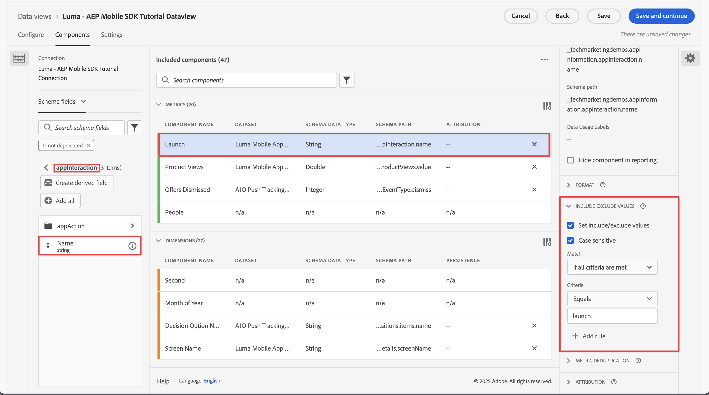
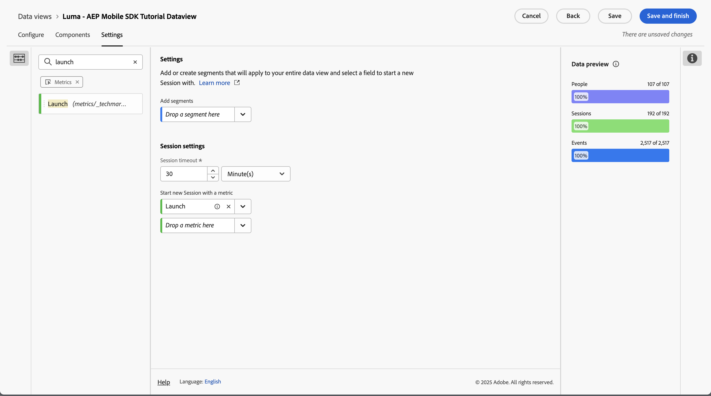

# Configuración de sesión {#session-settings}

<!-- markdownlint-disable MD034 -->

>[!CONTEXTUALHELP]
>id="dataview_settings_datapreview"
>title="Previsualización de datos"
>abstract="Compara los datos de esta vista de datos con los datos de la conexión. El porcentaje de vista previa se basa en el número total de la conexión de los **últimos 90 días**.  Si la vista previa no se carga, es posible que la conexión aún esté reponiendo los datos."

<!-- markdownlint-enable MD034 -->

<!-- markdownlint-enable MD034 -->

En Customer Journey Analytics, puede definir una sesión del mismo modo en que las personas interactúan con las experiencias digitales. La configuración de sesión se establece en una vista de datos.

Las definiciones de configuración de sesiones son inofensivas y no modifican los datos subyacentes. Puede configurar varias vistas de datos (cada una con su definición de configuración de sesiones específica) como base para sus proyectos de Espacio de trabajo.

Para definir el contexto de una sesión en una vista de datos:

1. Seleccione **[!UICONTROL Vistas de datos]**, opcionalmente desde la **[!UICONTROL Administración de datos]**, en la navegación principal de la interfaz de usuario de Customer Journey Analytics.

2. Cree una nueva vista de datos o edite una existente. Consulte [Creación o edición de una vista de datos](create-dataview.md) para obtener más información.

3. Seleccione la pestaña **[!UICONTROL Configuración.]** Debajo de [!UICONTROL Configuración de sesión]:

   1. Escriba un valor para **[!UICONTROL tiempo de espera de sesión]** en [!UICONTROL minuto(s)], [!UICONTROL hora(s)], [!UICONTROL día(s)] o [!UICONTROL semana(s)]. El tiempo de espera de sesión determina cuánto tiempo puede estar inactiva una sesión (sin que se produzcan eventos) antes de iniciar una nueva.

      Elija un tiempo de espera de sesión breve (por ejemplo, 30 minutos) si le interesa analizar principalmente interacciones en línea. Por ejemplo, analizar si los perfiles que visitan las páginas de productos de su tienda en línea agregaron productos al carro de compras o incluso los compraron en línea.

      Elija un tiempo de espera de sesión largo (por ejemplo, 3 meses) si combina datos en línea y sin conexión y desea analizar si sus clientes que han adquirido uno o más productos han llamado a su centro de contacto en los tres primeros meses después de la compra.

   2. Seleccione una métrica de la lista **[!UICONTROL Suelte una métrica aquí]** debajo de **[!UICONTROL Iniciar nueva sesión con una métrica]**. También puede arrastrar y soltar una métrica desde el panel izquierdo en el campo **[!UICONTROL Suelte una métrica]**. La métrica seleccionada define el inicio de una nueva sesión. Puede definir más de una métrica.

      Puede emplear cualquier tipo de métrica para definir una nueva sesión. Por ejemplo, imagine que desea definir una nueva sesión cada vez que un perfil inicia la aplicación móvil. En **[!UICONTROL Vista de datos]** > **[!UICONTROL Componentes]**, define un componente de tipo métrica, denominado **[!UICONTROL Lanzamientos]**, basado en un campo de esquema **[!UICONTROL appInteraction]** **[!UICONTROL Nombre]**. También especifica el componente de métrica **[!UICONTROL Lanzamientos]** para contar el valor solo cuando coincida con `launch`.

      

      A continuación, arrastra y suelta o selecciona **[!UICONTROL Lanzamientos]** como la métrica para definir una nueva sesión.

      

4. Seleccione **[!UICONTROL Guardar]** o **[!UICONTROL Guardar y finalizar]** para guardar la definición de configuración de sesiones.
