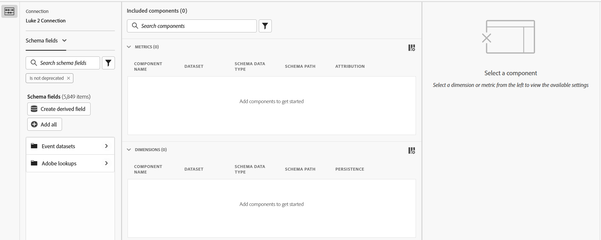

# Editor de componentes compartidos

El editor de componentes compartidos permite crear o editar dimensiones y métricas compartidas. Comparte muchos elementos de la interfaz de usuario al [crear o editar una vista de datos](/help/data-views/create-dataview.md), pero estas interfaces tienen un propósito distinto:

* El editor de componentes de vista de datos permite crear y editar componentes específicos de esa vista de datos. No se pueden editar dimensiones o métricas compartidas en el editor de componentes de vista de datos. En esta interfaz, las dimensiones y métricas compartidas se pueden identificar mediante un icono de  junto al nombre del componente.
* El editor de componentes compartidos permite crear y editar dimensiones y métricas compartidas. No se pueden editar componentes que pertenezcan a una sola vista de datos en el editor de componentes compartidos.

La parte superior derecha incluye tres botones:

* **[!UICONTROL Cerrar]** o **[!UICONTROL Cancelar]**: si se guardan todos los cambios, el botón **[!UICONTROL Cerrar]** cerrará el editor. Si hay cambios sin guardar, el botón **[!UICONTROL Cancelar]** cierra el editor sin guardar los cambios.
* **[!UICONTROL Guardar]**: guarda todos los componentes y mantiene abierto el editor.
* **[!UICONTROL Guardar y finalizar]**: guarda todos los componentes y cierra el editor.

La interfaz incluye tres columnas o secciones principales:

* **Selector de campo de esquema**: busque los campos de esquema deseados y arrástrelos al área de componentes incluidos.
   * **Conexión**: La conexión activa. Cambie la conexión activa en el [administrador de dimensiones y métricas compartidas](smd-overview.md).
   * **Lista de componentes**: puede elegir entre seleccionar [!UICONTROL Campos de esquema] (nuevas dimensiones y métricas compartidas netas) o [!UICONTROL Métricas y dimensiones] (componentes compartidos existentes) del menú desplegable.
   * **Buscar**: use la búsqueda de texto de  para encontrar el campo de esquema o el componente compartido deseado por su nombre. También puede usar  filtros para reducir la lista de componentes. El filtro `Is not deprecated` está activo de manera predeterminada.
   * **Crear campo derivado**: permite [crear un campo derivado](/help/data-views/derived-fields/derived-fields.md).
* **Componentes incluidos**: Los componentes que configuró para compartirlos. Al crear componentes compartidos, puede arrastrar más de un campo de esquema a esta área para crear varios componentes simultáneamente. Al editar componentes compartidos, puede seleccionar varios componentes para editarlos, lo que muestra todos los componentes seleccionados en esta área.
* **Configuración de componentes**: al seleccionar un componente en el área de componentes incluidos, en esta columna se pueden configurar todas las opciones de configuración disponibles. Consulte [Configuración de componentes](/help/data-views/component-settings/overview.md) para ver todas las opciones disponibles de dimensiones y métricas. Mayús + clic en varios elementos en el área de componentes incluidos le permite editar simultáneamente cualquier campo común.
