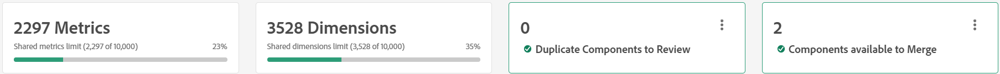

# Resumen de métricas y dimensiones compartidas

Las métricas y dimensiones compartidas proporcionan una ubicación central para administrar las dimensiones y métricas que se pueden utilizar en cualquier número de vistas de datos. Estos componentes son especialmente valiosos para las organizaciones que utilizan varias vistas de datos, especialmente si esas vistas de datos comparten la configuración de componentes comunes. Los cambios realizados en las métricas y dimensiones compartidas se aplican instantáneamente en todas las vistas de datos a las que se comparten. Al editar una vista de datos individual, las dimensiones y métricas compartidas se pueden identificar mediante un icono de  junto al nombre del componente.

Aunque las dimensiones y métricas compartidas permiten el uso de componentes comunes en muchas vistas de datos, no se pueden compartir entre conexiones.

## Flujo de trabajo

La mayoría de las organizaciones utilizan el siguiente flujo de trabajo general para deduplicar y mantener dimensiones y métricas a lo largo del tiempo:

1. Importe componentes de cada vista de datos que puedan compartirse en varias vistas de datos. Si la misma dimensión o métrica existe en varias vistas de datos, Adobe recomienda importar todas las instancias de ese componente. Aunque esta práctica recomendada importa duplicados, estos se importan para que se puedan deduplicar y conservar sus referencias respectivas a proyectos de Workspace.
1. Revise todos los componentes que utilizan el mismo ID de componente, pero que tienen configuraciones de componente diferentes. Para cada grupo de componentes duplicados, seleccione la configuración de componente que desee aplicar a todos los demás componentes que compartan ese ID de componente.
1. Revise todos los componentes que utilicen el mismo ID de componente y que también tengan la misma configuración de componente. Estas dimensiones o métricas se pueden combinar de forma fácil y segura.

## Administrador de [!UICONTROL métricas y dimensiones compartidas]

**[!UICONTROL Customer Journey Analytics]** > **[!UICONTROL Vistas de datos]** > **[!UICONTROL Métricas y dimensiones compartidas]**

Al navegar a esta interfaz de usuario, se muestran todas las dimensiones y métricas actuales que están disponibles para compartirse en varias vistas de datos. La parte superior derecha contiene dos botones para añadir componentes a esta interfaz:

* **[!UICONTROL Importar]**: Abre una ventana modal que le permite seleccionar una vista de datos y, a continuación, seleccionar componentes para que estén disponibles para compartir.
* **[!UICONTROL Crear nuevo]**: Abre el [editor de componentes compartidos](shared-component-editor.md).

Justo debajo de estos dos botones, se pueden ver cuatro tarjetas de información general:

* **Métricas**: El número total de métricas disponibles para compartir entre vistas de datos para esta conexión. Cada conexión puede contener hasta 10 000 métricas compartidas.
* **Dimensiones**: El número total de dimensiones disponibles para compartir entre vistas de datos para esta conexión. Cada conexión puede contener hasta 10 000 dimensiones compartidas.
* **Duplicar componentes para revisar**: al importar componentes en varias vistas de datos, algunas dimensiones o métricas podrían compartir el mismo ID de componente. El número de esta tarjeta de información general muestra el número total de componentes que tienen el mismo ID de componente, pero diferentes configuraciones de componente. Al seleccionar **[!UICONTROL Revisar]**, se habilita un filtro que le permite seleccionar el componente deseado para que actúe como una fuente fiable para todos los demás componentes con el mismo ID.
* **Componentes disponibles para combinar**: si una dimensión o métrica comparte el mismo ID de componente y la misma configuración de componente, son idénticos en la práctica y están listos para deduplicarse. Al seleccionar **[!UICONTROL Revisar]**, se habilita un filtro que le permite combinar todos los componentes con el mismo ID de componente en una sola dimensión o métrica compartida.

Todas las dimensiones y métricas compartidas se muestran debajo de las cuatro tarjetas de información general.

* **Filtro**: seleccione el icono  para mostrar u ocultar los filtros disponibles. Los filtros disponibles son los siguientes:
   * **[!UICONTROL Tipo de componente]**: ver solo dimensiones o solo métricas.
   * **[!UICONTROL Conjunto de datos]**: vea solo los componentes en los que el conjunto de datos está incluido en las vistas de datos en las que se comparte un componente.
   * **[!UICONTROL Vista de datos]**: vea solo los componentes compartidos con esa vista de datos.
   * **[!UICONTROL Creado por]**: vea solo los componentes creados por un usuario determinado.
   * **[!UICONTROL Duplicados]**: vea solo los componentes que tienen el mismo ID de componente que otro componente. Estos filtros son idénticos a los componentes de revisión a través de las tarjetas de información general.
* **Buscar**: Utilice el icono  para buscar un componente por nombre.
* **[!UICONTROL Conexión]**: Menú desplegable que cambia la [conexión](/help/connections/overview.md). Las dimensiones y métricas compartidas siempre son específicas de una sola conexión.
* **[!UICONTROL Personalizar tabla]**: seleccione el icono  para mostrar u ocultar columnas en la tabla. Las opciones disponibles incluyen:
   * **[!UICONTROL Nombre de campo]**: El nombre de la dimensión o métrica compartida. Este campo siempre está visible.
   * **[!UICONTROL Tipo]**: indica si el componente es una dimensión o una métrica. Este campo siempre está visible.
   * **[!UICONTROL Tipo de conjunto de datos]**: El tipo de conjunto de datos. La mayoría de los conjuntos de datos son conjuntos de datos de evento.
   * **[!UICONTROL Compartido en la vista de datos]**: todas las vistas de datos con las que se comparte este componente. Este campo siempre está visible. Seleccione el vínculo para abrir un modal que enumere todas las vistas de datos en las que está disponible este componente.
   * **[!UICONTROL Conjuntos de datos]**: todos los conjuntos de datos que se incluyen en cada vista de datos con la que se comparte este componente. Seleccione el vínculo para abrir un modal que enumere todos los conjuntos de datos del componente.
   * **[!UICONTROL Creado por]**: Nombre del individuo que creó o importó el componente en la interfaz de métricas y dimensiones compartidas.
   * **[!UICONTROL Tipo de esquema]**: El formato en el que se almacenan los datos. Algunos ejemplos son `string`, `double` o `boolean`.
   * **[!UICONTROL ID de componente]**: ID de componente de la dimensión o métrica. Cualquier componente que comparta el mismo ID de componente en esta interfaz debe revisarse y deduplicarse.
   * **[!UICONTROL Esquema]**: La ruta de esquema para la dimensión o métrica. Por ejemplo, `web.webPageDetails.URL`.
   * **[!UICONTROL Descripción]**: La [descripción](/help/data-views/component-settings/overview.md) del componente.
   * **[!UICONTROL Etiquetas de contexto]**: [etiquetas de contexto](/help/data-views/component-settings/overview.md) para el componente.
   * **[!UICONTROL Incluir/Excluir valores]**: Enumera el número de reglas especificadas en [Incluir/excluir valores](/help/data-views/component-settings/include-exclude-values.md).
   * **[!UICONTROL Etiquetas de uso de datos]**: Las [etiquetas de uso de datos](https://experienceleague.adobe.com/en/docs/experience-platform/data-governance/labels/overview) para el campo de esquema.
   * **[!UICONTROL Obsoleto]**: indica si se ha establecido el indicador obsoleto.
   * **[!UICONTROL Formato]**: El formato en el que aparecen los valores. Los booleanos suelen aparecer como `True | False`, las métricas suelen aparecer como `Decimal`, etc.
   * **[!UICONTROL Desduplicación de métricas]**: La configuración de [anulación de duplicación de métricas](/help/data-views/component-settings/metric-deduplication.md) del componente.
   * **[!UICONTROL Comportamiento]**: La configuración de [Comportamiento](/help/data-views/component-settings/behavior.md) del componente.
   * **[!UICONTROL Atribución]**: La configuración de [Atribución](/help/data-views/component-settings/attribution.md) del componente.
   * **[!UICONTROL Opción sin valor]**: [Sin opciones de valor](/help/data-views/component-settings/no-value-options.md) del componente.
   * **[!UICONTROL Clasificación de valores]**: La configuración de [Clasificación de valores](/help/data-views/component-settings/value-bucketing.md) del componente.
   * **[!UICONTROL Persistencia]**: La configuración de [Persistencia](/help/data-views/component-settings/persistence.md) del componente.
   * **[!UICONTROL Minúsculas]**: indica si el componente está habilitado para minúsculas en función de la configuración de [Comportamiento](/help/data-views/component-settings/behavior.md) del componente.
   * **[!UICONTROL Subcadena]**: La configuración de [Subcadena](/help/data-views/component-settings/substring.md) del componente.
   * **[!UICONTROL Grupo de datos de resumen]**: La configuración de [grupo de datos de resumen](/help/data-views/component-settings/summary-data-group.md) del componente.
   * **[!UICONTROL Fecha de creación]**: La fecha en que se creó o importó el componente.
   * **[!UICONTROL Última modificación]**: si el componente se ha modificado después de crearlo, la fecha en que se modificó por última vez.
* **[!UICONTROL Historial de trabajos]**: seleccione el icono  para abrir una ventana modal que muestre todas las instancias de importación de dimensiones y métricas desde vistas de datos individuales.

## Editar componentes o compartir componentes en vistas de datos

Utilice la casilla de verificación situada junto a un componente para mostrar todas las acciones disponibles que puede realizar. Se admiten selecciones múltiples.

*  **[!UICONTROL Editar]**: abre las dimensiones y métricas seleccionadas en el [editor de componentes compartidos](shared-component-editor.md), que te permite ajustar su [configuración de componentes](/help/data-views/component-settings/overview.md). Cuando se seleccionan varios componentes para editarlos, todos se abren en el editor de componentes. Puede desplazar y hacer clic en los componentes en el editor de componentes para editar el mismo campo para varios componentes.
*  **[!UICONTROL Compartir en vista(s) de datos]**: abre una ventana que muestra todas las vistas de datos disponibles en la conexión seleccionada. Seleccione la casilla de verificación de cada vista de datos en la que desee que este componente esté disponible y, a continuación, seleccione **[!UICONTROL Compartir]**.
*  **[!UICONTROL Dejar de compartir de las vistas de datos]**: abre una ventana que muestra todas las vistas de datos con las que se comparte actualmente este componente. Seleccione la casilla de verificación de cada vista de datos de la que desee quitar la disponibilidad de este componente y, a continuación, seleccione **[!UICONTROL Dejar de compartir]**.
*  **[!UICONTROL Duplicado]**: Crea una copia de los componentes seleccionados. Se genera un nuevo ID de componente para los componentes duplicados.
*  **[!UICONTROL Eliminar]**: quita los componentes seleccionados de la interfaz. Si los componentes seleccionados se comparten con cualquier vista de datos, dejarán de compartirse.
